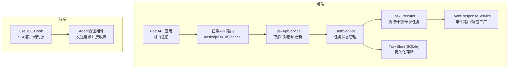
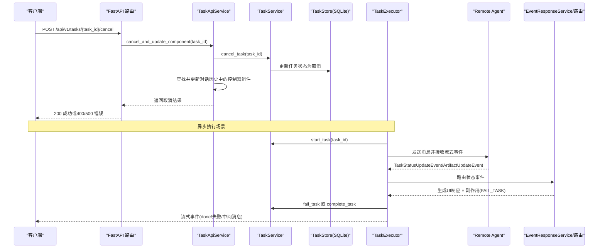
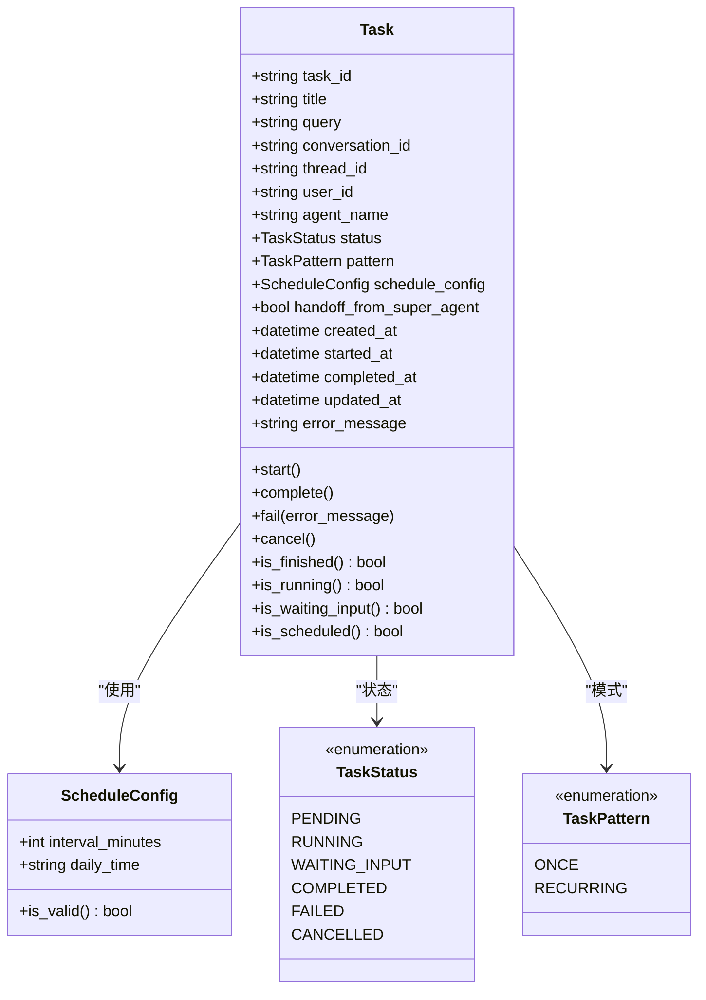
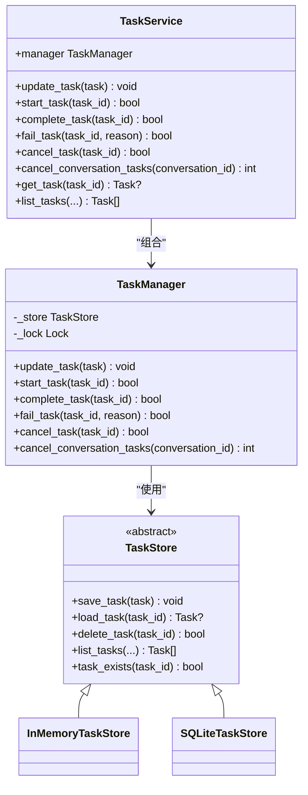
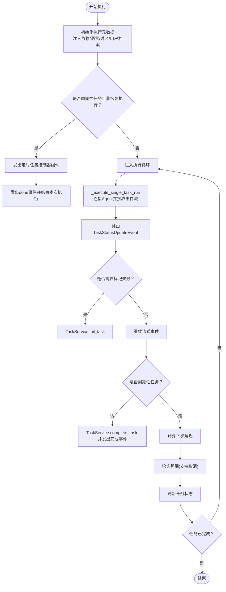
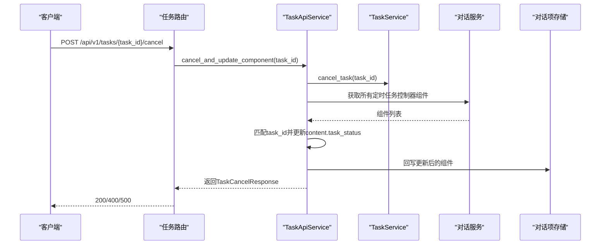
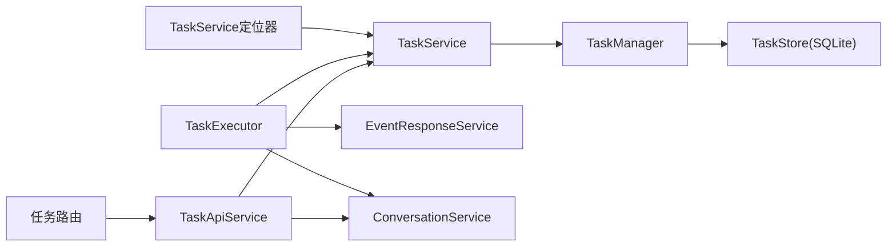

# 任务API

<cite>
**本文引用的文件**
- [python/valuecell/core/task/service.py](file://python/valuecell/core/task/service.py)
- [python/valuecell/core/task/manager.py](file://python/valuecell/core/task/manager.py)
- [python/valuecell/core/task/models.py](file://python/valuecell/core/task/models.py)
- [python/valuecell/core/task/executor.py](file://python/valuecell/core/task/executor.py)
- [python/valuecell/core/task/temporal.py](file://python/valuecell/core/task/temporal.py)
- [python/valuecell/core/task/task_store.py](file://python/valuecell/core/task/task_store.py)
- [python/valuecell/core/task/locator.py](file://python/valuecell/core/task/locator.py)
- [python/valuecell/server/api/routers/task.py](file://python/valuecell/server/api/routers/task.py)
- [python/valuecell/server/services/task_service.py](file://python/valuecell/server/services/task_service.py)
- [python/valuecell/server/api/schemas/task.py](file://python/valuecell/server/api/schemas/task.py)
- [python/valuecell/server/api/app.py](file://python/valuecell/server/api/app.py)
- [python/valuecell/server/api/exceptions.py](file://python/valuecell/server/api/exceptions.py)
- [python/valuecell/core/event/router.py](file://python/valuecell/core/event/router.py)
- [python/valuecell/server/services/agent_stream_service.py](file://python/valuecell/server/services/agent_stream_service.py)
- [frontend/src/hooks/use-sse.ts](file://frontend/src/hooks/use-sse.ts)
- [frontend/src/app/agent/components/agent-view/common-agent-area.tsx](file://frontend/src/app/agent/components/agent-view/common-agent-area.tsx)
</cite>

## 目录
1. [简介](#简介)
2. [项目结构](#项目结构)
3. [核心组件](#核心组件)
4. [架构总览](#架构总览)
5. [详细组件分析](#详细组件分析)
6. [依赖关系分析](#依赖关系分析)
7. [性能考量](#性能考量)
8. [故障排查指南](#故障排查指南)
9. [结论](#结论)
10. [附录：API定义与错误码](#附录api定义与错误码)

## 简介
本技术文档聚焦于任务管理API，覆盖任务创建、查询、执行与状态监控等能力。重点阐述：
- 任务调度机制（一次性与周期性）
- 执行上下文与元数据注入
- 结果返回模式与流式响应
- TaskService与Orchestrator协作处理异步任务
- 任务依赖管理与错误重试机制
- 长时间运行任务的状态监控与前端SSE接入

## 项目结构
任务系统由后端Python服务与前端React组件共同构成，核心模块分布如下：
- 后端核心（Python）：任务模型、服务、执行器、存储、定位器、事件路由
- 后端API层：FastAPI路由与异常处理
- 前端：SSE客户端Hook与消息发送组件

图表来源
- [python/valuecell/server/api/app.py](file://python/valuecell/server/api/app.py#L190-L239)
- [python/valuecell/server/api/routers/task.py](file://python/valuecell/server/api/routers/task.py#L1-L44)
- [python/valuecell/server/services/task_service.py](file://python/valuecell/server/services/task_service.py#L1-L100)
- [python/valuecell/core/task/service.py](file://python/valuecell/core/task/service.py#L1-L68)
- [python/valuecell/core/task/executor.py](file://python/valuecell/core/task/executor.py#L1-L454)
- [python/valuecell/core/task/task_store.py](file://python/valuecell/core/task/task_store.py#L1-L322)
- [frontend/src/hooks/use-sse.ts](file://frontend/src/hooks/use-sse.ts#L1-L91)
- [frontend/src/app/agent/components/agent-view/common-agent-area.tsx](file://frontend/src/app/agent/components/agent-view/common-agent-area.tsx#L123-L171)

章节来源
- [python/valuecell/server/api/app.py](file://python/valuecell/server/api/app.py#L190-L239)

## 核心组件
- 任务模型与状态：定义任务字段、状态枚举、调度配置与辅助方法
- 任务服务：对外暴露任务状态变更接口（启动、完成、失败、取消）
- 任务管理器：加锁保护的内存/数据库存储，提供并发安全的状态更新
- 任务执行器：执行计划与单次任务，处理流式输出、调度循环与完成通知
- 事件路由：将远端任务状态事件转换为UI响应与副作用（如标记失败）
- API路由与服务：提供取消任务接口，并同步更新对话历史中的控制器组件
- 存储抽象：内存与SQLite两种实现，支持列表查询与分页
- 定位器：进程内单例TaskService，支持测试覆盖

章节来源
- [python/valuecell/core/task/models.py](file://python/valuecell/core/task/models.py#L1-L149)
- [python/valuecell/core/task/service.py](file://python/valuecell/core/task/service.py#L1-L68)
- [python/valuecell/core/task/manager.py](file://python/valuecell/core/task/manager.py#L1-L96)
- [python/valuecell/core/task/executor.py](file://python/valuecell/core/task/executor.py#L1-L454)
- [python/valuecell/core/event/router.py](file://python/valuecell/core/event/router.py#L52-L96)
- [python/valuecell/server/api/routers/task.py](file://python/valuecell/server/api/routers/task.py#L1-L44)
- [python/valuecell/server/services/task_service.py](file://python/valuecell/server/services/task_service.py#L1-L100)
- [python/valuecell/core/task/task_store.py](file://python/valuecell/core/task/task_store.py#L1-L322)
- [python/valuecell/core/task/locator.py](file://python/valuecell/core/task/locator.py#L1-L55)

## 架构总览
任务从创建到执行的关键流程：
- 创建：由上层业务生成Task对象并保存至TaskStore
- 执行：TaskExecutor按ExecutionPlan逐个任务执行；单次任务直接调用远程Agent；周期性任务在完成后等待下一次延迟再重启
- 状态：TaskService负责状态持久化；事件路由将远端状态映射为UI响应与副作用
- 取消：API层提供取消接口，同时更新对话历史中对应的控制器组件

图表来源
- [python/valuecell/server/api/routers/task.py](file://python/valuecell/server/api/routers/task.py#L1-L44)
- [python/valuecell/server/services/task_service.py](file://python/valuecell/server/services/task_service.py#L1-L100)
- [python/valuecell/core/task/service.py](file://python/valuecell/core/task/service.py#L1-L68)
- [python/valuecell/core/task/executor.py](file://python/valuecell/core/task/executor.py#L1-L454)
- [python/valuecell/core/event/router.py](file://python/valuecell/core/event/router.py#L52-L96)

## 详细组件分析

### 任务模型与状态
- 状态枚举：pending、running、waiting_input、completed、failed、cancelled
- 模式枚举：once、recurring
- 调度配置：支持按分钟间隔或每日固定时间
- 辅助方法：启动/完成/失败/取消、是否完成/运行中/等待输入/是否周期性

图表来源
- [python/valuecell/core/task/models.py](file://python/valuecell/core/task/models.py#L1-L149)

章节来源
- [python/valuecell/core/task/models.py](file://python/valuecell/core/task/models.py#L1-L149)

### 任务服务与管理器
- TaskService：对外提供状态变更接口，内部委托TaskManager
- TaskManager：加锁保护的并发安全状态更新；支持批量取消同一会话下的未完成任务
- 存储抽象：TaskStore定义统一接口；InMemoryTaskStore用于测试；SQLiteTaskStore用于生产

图表来源
- [python/valuecell/core/task/service.py](file://python/valuecell/core/task/service.py#L1-L68)
- [python/valuecell/core/task/manager.py](file://python/valuecell/core/task/manager.py#L1-L96)
- [python/valuecell/core/task/task_store.py](file://python/valuecell/core/task/task_store.py#L1-L322)

章节来源
- [python/valuecell/core/task/service.py](file://python/valuecell/core/task/service.py#L1-L68)
- [python/valuecell/core/task/manager.py](file://python/valuecell/core/task/manager.py#L1-L96)
- [python/valuecell/core/task/task_store.py](file://python/valuecell/core/task/task_store.py#L1-L322)

### 任务执行器与调度
- 计划执行：遍历ExecutionPlan中的任务，逐个调用execute_task
- 单次任务执行：连接远程Agent，发送消息并持续接收流式事件；根据TaskStatusUpdateEvent路由为UI响应或失败副作用
- 周期性任务：每次执行完成后计算下次延迟（按分钟或每日时间），睡眠期间可被取消；完成后标记完成并发出完成事件
- 上下文注入：在执行元数据中注入用户档案、语言、时区、当前上下文等依赖
- 结果聚合：对定时任务的流式消息进行累积，最终生成“定时任务结果”组件

图表来源
- [python/valuecell/core/task/executor.py](file://python/valuecell/core/task/executor.py#L1-L454)
- [python/valuecell/core/task/temporal.py](file://python/valuecell/core/task/temporal.py#L1-L52)
- [python/valuecell/core/event/router.py](file://python/valuecell/core/event/router.py#L52-L96)

章节来源
- [python/valuecell/core/task/executor.py](file://python/valuecell/core/task/executor.py#L1-L454)
- [python/valuecell/core/task/temporal.py](file://python/valuecell/core/task/temporal.py#L1-L52)
- [python/valuecell/core/event/router.py](file://python/valuecell/core/event/router.py#L52-L96)

### API：取消任务与对话项同步
- 路由：POST /api/v1/tasks/{task_id}/cancel
- 逻辑：调用TaskApiService取消任务，并查找对话历史中类型为“定时任务控制器”的组件，将其内容中的task_status更新为“cancelled”，然后持久化回写
- 返回：包含task_id、success、updated_component_ids的结构化响应

图表来源
- [python/valuecell/server/api/routers/task.py](file://python/valuecell/server/api/routers/task.py#L1-L44)
- [python/valuecell/server/services/task_service.py](file://python/valuecell/server/services/task_service.py#L1-L100)
- [python/valuecell/server/api/schemas/task.py](file://python/valuecell/server/api/schemas/task.py#L1-L25)

章节来源
- [python/valuecell/server/api/routers/task.py](file://python/valuecell/server/api/routers/task.py#L1-L44)
- [python/valuecell/server/services/task_service.py](file://python/valuecell/server/services/task_service.py#L1-L100)
- [python/valuecell/server/api/schemas/task.py](file://python/valuecell/server/api/schemas/task.py#L1-L25)

### 执行上下文与依赖管理
- 执行元数据：包含DEPENDENCIES键，值为用户档案、当前上下文、语言、时区等
- 依赖来源：从工具函数获取用户档案元数据、当前语言与时区
- 依赖注入：在执行前统一设置到元数据字典中，供Agent侧消费

章节来源
- [python/valuecell/core/task/executor.py](file://python/valuecell/core/task/executor.py#L245-L257)

### 错误重试与失败处理
- 远端状态事件：当收到TaskStatusUpdateEvent且状态为failed时，路由生成“任务失败”响应并附加副作用（FAIL_TASK），触发TaskService.fail_task
- 执行异常：TaskExecutor在执行过程中捕获异常，调用fail_task并抛出异常
- 对话项同步：失败时同步更新对话历史中的任务组件状态

章节来源
- [python/valuecell/core/event/router.py](file://python/valuecell/core/event/router.py#L52-L96)
- [python/valuecell/core/task/executor.py](file://python/valuecell/core/task/executor.py#L313-L316)

### 长时间运行任务与流式响应
- 前端SSE：useSSE Hook封装SSE客户端，自动维护连接状态与事件回调
- 发送消息：Agent视图组件将请求体序列化后通过SSE连接发送，接收流式事件并在事件类型为done时关闭连接
- 后端事件：TaskExecutor在执行过程中持续发出消息、推理、工具调用等事件，最终发出done或失败事件

章节来源
- [frontend/src/hooks/use-sse.ts](file://frontend/src/hooks/use-sse.ts#L1-L91)
- [frontend/src/app/agent/components/agent-view/common-agent-area.tsx](file://frontend/src/app/agent/components/agent-view/common-agent-area.tsx#L123-L171)
- [python/valuecell/core/task/executor.py](file://python/valuecell/core/task/executor.py#L1-L454)

## 依赖关系分析
- TaskService依赖TaskManager；TaskManager依赖TaskStore；默认使用SQLiteTaskStore
- TaskExecutor依赖TaskService、EventResponseService、ConversationService与RemoteConnections
- API层TaskApiService依赖TaskService与对话服务，用于取消任务并同步对话项
- 前端SSE客户端与后端流式事件解耦，通过事件类型与payload约定进行通信

图表来源
- [python/valuecell/core/task/locator.py](file://python/valuecell/core/task/locator.py#L1-L55)
- [python/valuecell/core/task/service.py](file://python/valuecell/core/task/service.py#L1-L68)
- [python/valuecell/core/task/manager.py](file://python/valuecell/core/task/manager.py#L1-L96)
- [python/valuecell/core/task/task_store.py](file://python/valuecell/core/task/task_store.py#L1-L322)
- [python/valuecell/core/task/executor.py](file://python/valuecell/core/task/executor.py#L1-L454)
- [python/valuecell/server/api/routers/task.py](file://python/valuecell/server/api/routers/task.py#L1-L44)
- [python/valuecell/server/services/task_service.py](file://python/valuecell/server/services/task_service.py#L1-L100)

## 性能考量
- 执行轮询：周期性任务睡眠采用小步长轮询（默认0.1秒），以快速响应取消
- 存储选择：SQLiteTaskStore支持索引与异步I/O，适合生产环境；InMemoryTaskStore仅用于测试
- 事件路由：将远端状态事件转换为UI响应，避免重复渲染与冗余网络请求
- 前端SSE：useSSE保持连接状态与事件回调引用，减少不必要的重连

章节来源
- [python/valuecell/core/task/executor.py](file://python/valuecell/core/task/executor.py#L1-L454)
- [python/valuecell/core/task/temporal.py](file://python/valuecell/core/task/temporal.py#L1-L52)
- [python/valuecell/core/task/task_store.py](file://python/valuecell/core/task/task_store.py#L1-L322)
- [frontend/src/hooks/use-sse.ts](file://frontend/src/hooks/use-sse.ts#L1-L91)

## 故障排查指南
- 取消接口返回400：表示任务不可取消或不存在，检查任务状态与task_id
- 取消接口返回500：服务器内部错误，查看日志并确认TaskService与对话服务调用链
- 任务失败：检查EventResponseService路由是否正确生成“任务失败”响应并触发FAIL_TASK副作用
- 代理连接失败：TaskExecutor在无法获取客户端时发出工具调用完成事件并抛出异常，需检查Agent连接配置
- 周期性任务不重启：确认ScheduleConfig有效且calculate_next_execution_delay返回非None值；检查睡眠轮询是否被取消

章节来源
- [python/valuecell/server/api/routers/task.py](file://python/valuecell/server/api/routers/task.py#L1-L44)
- [python/valuecell/server/api/exceptions.py](file://python/valuecell/server/api/exceptions.py#L1-L112)
- [python/valuecell/core/event/router.py](file://python/valuecell/core/event/router.py#L52-L96)
- [python/valuecell/core/task/executor.py](file://python/valuecell/core/task/executor.py#L357-L407)

## 结论
该任务API围绕TaskService与TaskExecutor构建，提供从创建、执行、状态监控到取消与对话项同步的完整闭环。通过事件路由与流式响应，系统实现了与前端SSE的良好集成；通过SQLite存储与定位器，确保了状态一致性与可扩展性。建议在生产环境中优先使用SQLiteTaskStore，并结合事件路由与SSE客户端实现稳定的长任务体验。

## 附录：API定义与错误码

### 取消任务接口
- 方法与路径：POST /api/v1/tasks/{task_id}/cancel
- 请求参数：路径参数task_id
- 成功响应：TaskCancelResponse，包含task_id、success、updated_component_ids
- 失败响应：
  - 400：任务不可取消或不存在
  - 500：服务器内部错误

章节来源
- [python/valuecell/server/api/routers/task.py](file://python/valuecell/server/api/routers/task.py#L1-L44)
- [python/valuecell/server/api/schemas/task.py](file://python/valuecell/server/api/schemas/task.py#L1-L25)
- [python/valuecell/server/api/exceptions.py](file://python/valuecell/server/api/exceptions.py#L1-L112)

### 错误码与恢复策略
- 400（BAD_REQUEST）：请求参数无效或任务不可取消。恢复策略：校验task_id与任务状态，必要时重新提交
- 401（UNAUTHORIZED）：未授权访问。恢复策略：检查认证信息与权限
- 403（FORBIDDEN）：禁止访问。恢复策略：检查用户权限与资源访问控制
- 404（NOT_FOUND）：资源不存在。恢复策略：确认任务是否存在或已被清理
- 500（INTERNAL_ERROR）：服务器内部错误。恢复策略：重试请求，检查日志与依赖服务

章节来源
- [python/valuecell/server/api/exceptions.py](file://python/valuecell/server/api/exceptions.py#L1-L112)

### 自动恢复与异步执行
- 自动恢复：在应用启动或服务重启后，通过AgentStreamService扫描待执行的周期性任务，重置状态并异步调度执行
- 异步调度：使用TaskExecutor.execute_task以异步任务方式执行，丢弃响应以便后台运行

章节来源
- [python/valuecell/server/services/agent_stream_service.py](file://python/valuecell/server/services/agent_stream_service.py#L119-L152)