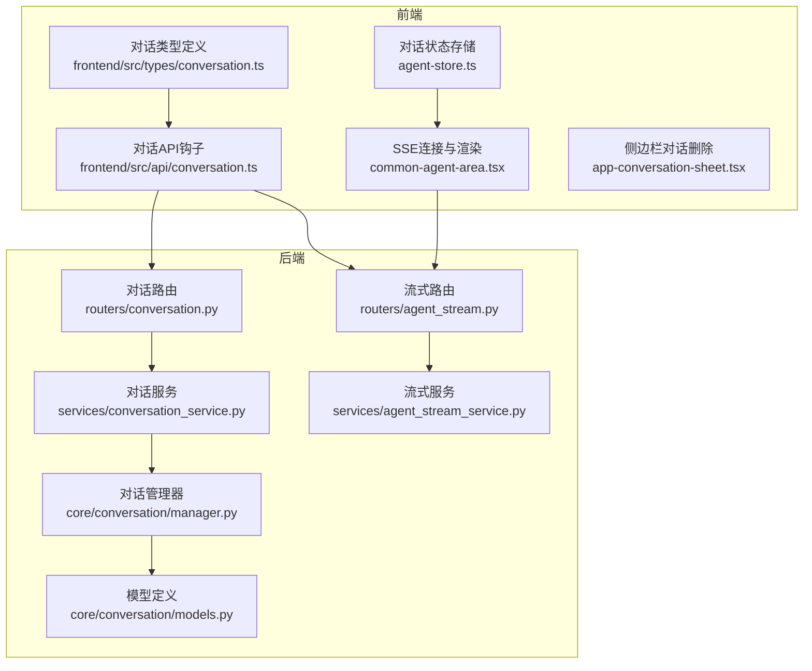
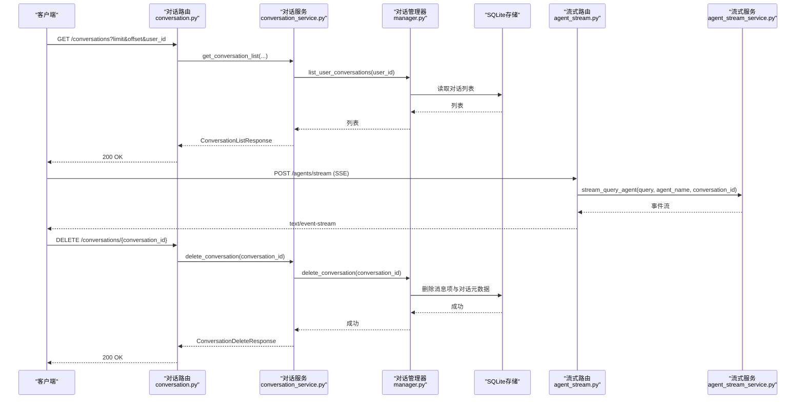
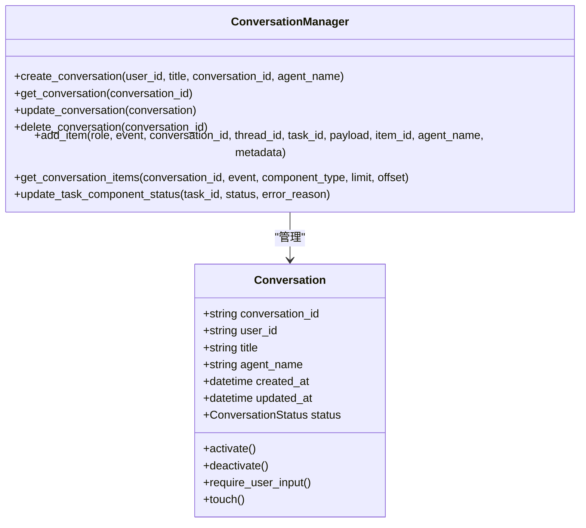
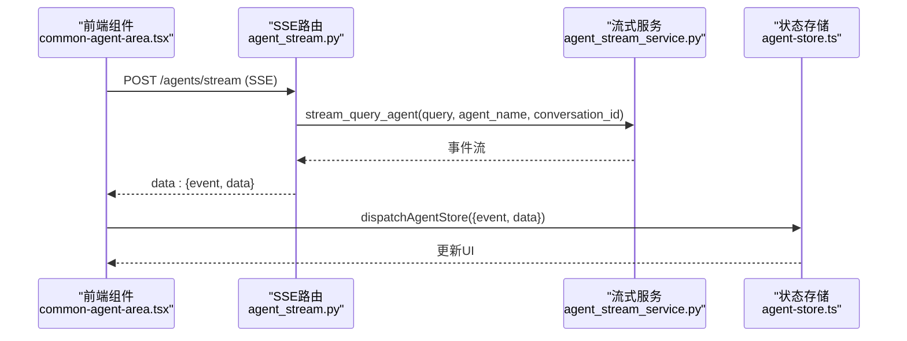
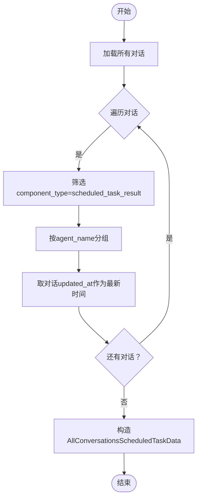
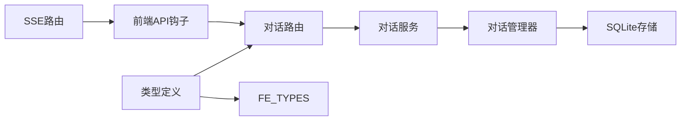

# 对话API

<cite>
**本文引用的文件**
- [conversation.py](file://python/valuecell/server/api/routers/conversation.py)
- [conversation.py](file://python/valuecell/server/api/schemas/conversation.py)
- [base.py](file://python/valuecell/server/api/schemas/base.py)
- [conversation_service.py](file://python/valuecell/server/services/conversation_service.py)
- [manager.py](file://python/valuecell/core/conversation/manager.py)
- [models.py](file://python/valuecell/core/conversation/models.py)
- [conversation.ts](file://frontend/src/api/conversation.ts)
- [conversation.ts](file://frontend/src/types/conversation.ts)
- [agent_stream.py](file://python/valuecell/server/api/routers/agent_stream.py)
- [agent_stream.py](file://python/valuecell/server/api/schemas/agent_stream.py)
- [agent_stream_service.py](file://python/valuecell/server/services/agent_stream_service.py)
- [types.py](file://python/valuecell/core/types.py)
- [common-agent-area.tsx](file://frontend/src/app/agent/components/agent-view/common-agent-area.tsx)
- [app-conversation-sheet.tsx](file://frontend/src/components/valuecell/app/app-conversation-sheet.tsx)
- [agent-store.ts](file://frontend/src/store/agent-store.ts)
</cite>

## 目录
1. [简介](#简介)
2. [项目结构](#项目结构)
3. [核心组件](#核心组件)
4. [架构总览](#架构总览)
5. [详细组件分析](#详细组件分析)
6. [依赖关系分析](#依赖关系分析)
7. [性能考量](#性能考量)
8. [故障排查指南](#故障排查指南)
9. [结论](#结论)
10. [附录](#附录)

## 简介
本文件为对话管理API的详细技术文档，覆盖以下能力：
- 获取对话列表（支持分页与过滤）
- 查询对话历史（包含消息事件与元数据）
- 定时任务结果获取（按对话与全局聚合）
- 删除对话（级联清理关联数据）
- WebSocket流式响应与REST API的集成，以及客户端对话状态同步策略

文档重点解释各端点用途、参数、返回结构（尤其是ConversationListResponse、ConversationHistoryResponse），并提供分页、过滤与错误处理的使用示例；同时阐述对话数据生命周期管理与conversation_id的使用方式，以及如何在客户端实现对话状态同步。

## 项目结构
后端采用FastAPI路由层与服务层分离设计，前端通过React Query消费REST接口，并以SSE连接实现流式对话交互。

图表来源
- [conversation.py](file://python/valuecell/server/api/routers/conversation.py#L1-L148)
- [conversation_service.py](file://python/valuecell/server/services/conversation_service.py#L1-L345)
- [manager.py](file://python/valuecell/core/conversation/manager.py#L1-L307)
- [models.py](file://python/valuecell/core/conversation/models.py#L1-L65)
- [agent_stream.py](file://python/valuecell/server/api/routers/agent_stream.py#L1-L64)
- [agent_stream_service.py](file://python/valuecell/server/services/agent_stream_service.py#L1-L120)
- [conversation.ts](file://frontend/src/api/conversation.ts#L1-L82)
- [conversation.ts](file://frontend/src/types/conversation.ts#L1-L25)
- [common-agent-area.tsx](file://frontend/src/app/agent/components/agent-view/common-agent-area.tsx#L123-L171)
- [agent-store.ts](file://frontend/src/store/agent-store.ts#L1-L36)
- [app-conversation-sheet.tsx](file://frontend/src/components/valuecell/app/app-conversation-sheet.tsx#L91-L130)

章节来源
- [conversation.py](file://python/valuecell/server/api/routers/conversation.py#L1-L148)
- [conversation_service.py](file://python/valuecell/server/services/conversation_service.py#L1-L345)
- [conversation.ts](file://frontend/src/api/conversation.ts#L1-L82)

## 核心组件
- 路由层：定义REST端点，负责参数校验、异常映射与响应封装
- 服务层：实现业务逻辑，协调对话管理器与持久化存储
- 管理器：抽象对话元数据与消息项的增删查改，负责时间戳更新与状态变更
- 模型：定义对话状态枚举与对话对象字段
- 前端API钩子：基于React Query封装对话列表、历史、定时任务轮询与删除
- 流式路由：提供SSE端点，将后台生成的消息事件实时推送到客户端

章节来源
- [conversation.py](file://python/valuecell/server/api/routers/conversation.py#L1-L148)
- [conversation_service.py](file://python/valuecell/server/services/conversation_service.py#L1-L345)
- [manager.py](file://python/valuecell/core/conversation/manager.py#L1-L307)
- [models.py](file://python/valuecell/core/conversation/models.py#L1-L65)
- [conversation.ts](file://frontend/src/api/conversation.ts#L1-L82)
- [agent_stream.py](file://python/valuecell/server/api/routers/agent_stream.py#L1-L64)

## 架构总览
对话API的调用链路如下：
- REST请求进入路由层，参数经校验后交由服务层处理
- 服务层通过对话管理器访问存储，构建统一的历史/列表响应
- 定时任务结果通过过滤与聚合返回
- 删除操作先清理消息项再删除元数据
- 客户端通过SSE订阅流式事件，结合React Query缓存实现对话状态同步

图表来源
- [conversation.py](file://python/valuecell/server/api/routers/conversation.py#L1-L148)
- [conversation_service.py](file://python/valuecell/server/services/conversation_service.py#L1-L345)
- [manager.py](file://python/valuecell/core/conversation/manager.py#L1-L307)
- [agent_stream.py](file://python/valuecell/server/api/routers/agent_stream.py#L1-L64)
- [agent_stream_service.py](file://python/valuecell/server/services/agent_stream_service.py#L1-L120)

## 详细组件分析

### REST端点与响应模型
- 获取对话列表
  - 方法与路径：GET /conversations
  - 查询参数：
    - user_id: 可选，按用户过滤
    - limit: 默认10，范围[1,100]
    - offset: 默认0
  - 返回：ConversationListResponse
    - data: ConversationListData
      - conversations: ConversationListItem[]
      - total: int
    - 其他：SuccessResponse通用字段
  - 行为要点：
    - 过滤策略：排除特定策略类Agent发起的对话
    - 分页：服务层对全量列表应用limit/offset
  - 错误处理：HTTP 500内部错误时抛出异常

- 获取所有对话的定时任务结果
  - 方法与路径：GET /conversations/scheduled-task-results
  - 查询参数：user_id: 可选
  - 返回：AllConversationsScheduledTaskResponse
    - data: AllConversationsScheduledTaskData
      - agents: AgentScheduledTaskResults[]
        - agent_name: str
        - results: ConversationHistoryItem[]
        - update_time: 可选
  - 行为要点：
    - 遍历所有对话，筛选payload中component_type为“scheduled_task_result”的项
    - 按agent_name分组，update_time取该Agent对应对话的updated_at

- 获取指定对话历史
  - 方法与路径：GET /conversations/{conversation_id}/history
  - 路径参数：conversation_id
  - 返回：ConversationHistoryResponse
    - data: ConversationHistoryData
      - conversation_id: str
      - items: ConversationHistoryItem[]
        - event: str
        - data: MessageData
          - conversation_id: str
          - thread_id: str
          - task_id: str
          - payload: 可选字典或字符串
          - role: 可选角色
          - item_id: 可选
          - agent_name: 可选
          - metadata: 可选键值对
  - 行为要点：
    - 排除“scheduled_task_result”类型的组件生成事件
    - 统一事件名与角色名归一化

- 获取指定对话的定时任务结果
  - 方法与路径：GET /conversations/{conversation_id}/scheduled-task-results
  - 路径参数：conversation_id
  - 返回：ConversationHistoryResponse
  - 行为要点：
    - 仅查询component_type为“scheduled_task_result”的项

- 删除对话
  - 方法与路径：DELETE /conversations/{conversation_id}
  - 路径参数：conversation_id
  - 返回：ConversationDeleteResponse
    - data: ConversationDeleteData
      - conversation_id: str
      - deleted: bool
  - 行为要点：
    - 先删除该对话的所有消息项，再删除对话元数据
    - 失败时返回deleted=false并映射HTTP 500

- 响应基类与统一结构
  - SuccessResponse[T]：code默认0，msg默认“success”，data可选
  - ErrorResponse：用于错误场景

章节来源
- [conversation.py](file://python/valuecell/server/api/routers/conversation.py#L1-L148)
- [conversation.py](file://python/valuecell/server/api/schemas/conversation.py#L1-L112)
- [base.py](file://python/valuecell/server/api/schemas/base.py#L1-L76)
- [conversation_service.py](file://python/valuecell/server/services/conversation_service.py#L1-L345)

### 数据模型与生命周期
- 对话状态
  - ACTIVE、INACTIVE、REQUIRE_USER_INPUT
  - 更新状态会刷新updated_at
- 对话对象
  - 字段：conversation_id、user_id、title、agent_name、created_at、updated_at、status
  - 提供activate/deactivate/require_user_input/touch等方法
- 对话管理器
  - 创建/获取/更新/删除对话
  - 添加消息项并自动更新对话时间戳
  - 查询消息项（支持按event、component_type、分页）
  - 更新定时任务组件状态（写入payload与metadata）

图表来源
- [models.py](file://python/valuecell/core/conversation/models.py#L1-L65)
- [manager.py](file://python/valuecell/core/conversation/manager.py#L1-L307)

章节来源
- [models.py](file://python/valuecell/core/conversation/models.py#L1-L65)
- [manager.py](file://python/valuecell/core/conversation/manager.py#L1-L307)

### WebSocket流式响应与REST集成
- SSE端点
  - POST /agents/stream
  - 请求体：AgentStreamRequest
    - query: 用户输入
    - agent_name: 可选，指定Agent
    - conversation_id: 可选，上下文跟踪
  - 响应：text/event-stream，逐条推送JSON片段
- 前端集成
  - 使用SSE连接发送AgentStreamRequest，接收事件流
  - 将事件写入全局状态store，驱动UI渲染
  - 对话列表与历史通过React Query缓存，删除后主动失效列表缓存
- 对话状态同步
  - SSE事件包含conversation_id、thread_id、task_id、payload、role、item_id、agent_name、metadata
  - 前端store按conversation_id聚合消息，实现对话状态实时同步

图表来源
- [agent_stream.py](file://python/valuecell/server/api/routers/agent_stream.py#L1-L64)
- [agent_stream.py](file://python/valuecell/server/api/schemas/agent_stream.py#L1-L40)
- [agent_stream_service.py](file://python/valuecell/server/services/agent_stream_service.py#L1-L120)
- [common-agent-area.tsx](file://frontend/src/app/agent/components/agent-view/common-agent-area.tsx#L123-L171)
- [agent-store.ts](file://frontend/src/store/agent-store.ts#L1-L36)

章节来源
- [agent_stream.py](file://python/valuecell/server/api/routers/agent_stream.py#L1-L64)
- [agent_stream_service.py](file://python/valuecell/server/services/agent_stream_service.py#L1-L120)
- [common-agent-area.tsx](file://frontend/src/app/agent/components/agent-view/common-agent-area.tsx#L123-L171)
- [agent-store.ts](file://frontend/src/store/agent-store.ts#L1-L36)

### 定时任务结果聚合流程
- 全局聚合
  - 遍历所有对话，筛选payload中component_type为“scheduled_task_result”的项
  - 按agent_name分组，update_time取该Agent对应对话的updated_at
- 单对话查询
  - 仅查询当前对话中component_type为“scheduled_task_result”的项
- 事件归一化
  - 服务层将底层响应转换为统一的ConversationHistoryItem格式，便于前端一致渲染

图表来源
- [conversation_service.py](file://python/valuecell/server/services/conversation_service.py#L207-L281)

章节来源
- [conversation_service.py](file://python/valuecell/server/services/conversation_service.py#L207-L281)

## 依赖关系分析
- 路由依赖服务层，服务层依赖管理器，管理器依赖存储实现
- 前端API钩子依赖后端路由与类型定义
- SSE端点独立于对话路由，但共享事件与payload结构

图表来源
- [conversation.py](file://python/valuecell/server/api/routers/conversation.py#L1-L148)
- [conversation_service.py](file://python/valuecell/server/services/conversation_service.py#L1-L345)
- [manager.py](file://python/valuecell/core/conversation/manager.py#L1-L307)
- [conversation.ts](file://frontend/src/api/conversation.ts#L1-L82)
- [conversation.ts](file://frontend/src/types/conversation.ts#L1-L25)
- [agent_stream.py](file://python/valuecell/server/api/routers/agent_stream.py#L1-L64)

章节来源
- [conversation.py](file://python/valuecell/server/api/routers/conversation.py#L1-L148)
- [conversation_service.py](file://python/valuecell/server/services/conversation_service.py#L1-L345)
- [conversation.ts](file://frontend/src/api/conversation.ts#L1-L82)

## 性能考量
- 分页与过滤
  - 列表接口支持limit/offset与user_id过滤，建议前端按需分页，避免一次性拉取过多数据
- 存储与序列化
  - 消息项payload与metadata统一序列化为JSON字符串，注意payload复杂度控制
- SSE流式传输
  - 事件按chunk推送，前端按事件增量渲染，减少重绘成本
- 缓存策略
  - React Query对历史与任务列表设置refetchInterval，避免频繁轮询造成压力

[本节为通用指导，不直接分析具体文件]

## 故障排查指南
- 404未找到
  - 当查询不存在的conversation_id时，历史与定时任务结果查询会返回404
- 500服务器错误
  - 列表与聚合查询内部异常会映射为500
  - 删除失败时deleted=false并返回500
- 参数校验
  - limit必须在[1,100]范围内，offset>=0
- SSE连接问题
  - 前端监听onError/onClose，必要时重连；确保conversation_id正确传递

章节来源
- [conversation.py](file://python/valuecell/server/api/routers/conversation.py#L1-L148)
- [conversation_service.py](file://python/valuecell/server/services/conversation_service.py#L1-L345)
- [common-agent-area.tsx](file://frontend/src/app/agent/components/agent-view/common-agent-area.tsx#L123-L171)

## 结论
对话API提供了完整的对话生命周期管理能力：列表分页与过滤、历史查询、定时任务结果聚合、删除清理，以及与SSE的无缝集成。通过统一的响应模型与事件结构，前端可以稳定地实现对话状态同步与实时渲染。建议在生产环境中合理使用分页、缓存与重试策略，确保用户体验与系统稳定性。

[本节为总结性内容，不直接分析具体文件]

## 附录

### 端点一览与参数说明
- GET /conversations
  - 查询参数：user_id、limit、offset
  - 返回：ConversationListResponse
- GET /conversations/scheduled-task-results
  - 查询参数：user_id
  - 返回：AllConversationsScheduledTaskResponse
- GET /conversations/{conversation_id}/history
  - 路径参数：conversation_id
  - 返回：ConversationHistoryResponse
- GET /conversations/{conversation_id}/scheduled-task-results
  - 路径参数：conversation_id
  - 返回：ConversationHistoryResponse
- DELETE /conversations/{conversation_id}
  - 路径参数：conversation_id
  - 返回：ConversationDeleteResponse

章节来源
- [conversation.py](file://python/valuecell/server/api/routers/conversation.py#L1-L148)
- [conversation.py](file://python/valuecell/server/api/schemas/conversation.py#L1-L112)
- [base.py](file://python/valuecell/server/api/schemas/base.py#L1-L76)

### 响应模型说明
- ConversationListResponse
  - data: ConversationListData
    - conversations: ConversationListItem[]
    - total: int
- ConversationHistoryResponse
  - data: ConversationHistoryData
    - conversation_id: str
    - items: ConversationHistoryItem[]
- ConversationDeleteResponse
  - data: ConversationDeleteData
    - conversation_id: str
    - deleted: bool
- AllConversationsScheduledTaskResponse
  - data: AllConversationsScheduledTaskData
    - agents: AgentScheduledTaskResults[]

章节来源
- [conversation.py](file://python/valuecell/server/api/schemas/conversation.py#L1-L112)
- [base.py](file://python/valuecell/server/api/schemas/base.py#L1-L76)

### 前端使用示例
- 获取对话列表
  - 使用useGetConversationList，选择data.conversations
- 获取对话历史
  - 使用useGetConversationHistory，传入conversationId
- 删除对话
  - 使用useDeleteConversation，删除成功后失效列表缓存
- 轮询定时任务结果
  - 使用usePollTaskList与useAllPollTaskList，设置refetchInterval
- SSE流式对话
  - 在组件中connect并处理事件，dispatch到agent-store

章节来源
- [conversation.ts](file://frontend/src/api/conversation.ts#L1-L82)
- [conversation.ts](file://frontend/src/types/conversation.ts#L1-L25)
- [common-agent-area.tsx](file://frontend/src/app/agent/components/agent-view/common-agent-area.tsx#L123-L171)
- [agent-store.ts](file://frontend/src/store/agent-store.ts#L1-L36)
- [app-conversation-sheet.tsx](file://frontend/src/components/valuecell/app/app-conversation-sheet.tsx#L91-L130)