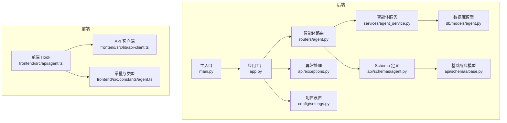
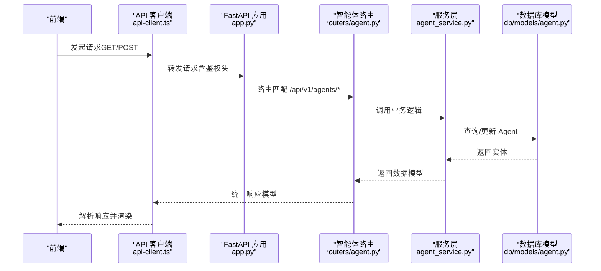
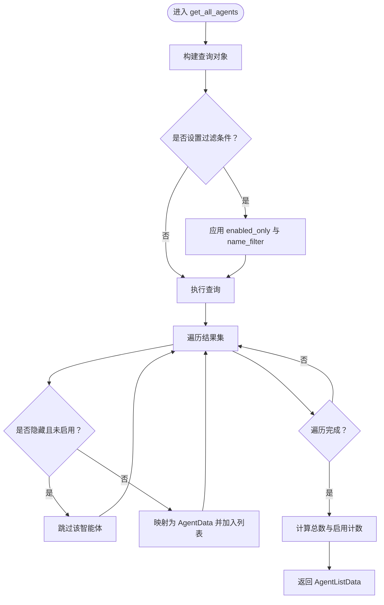
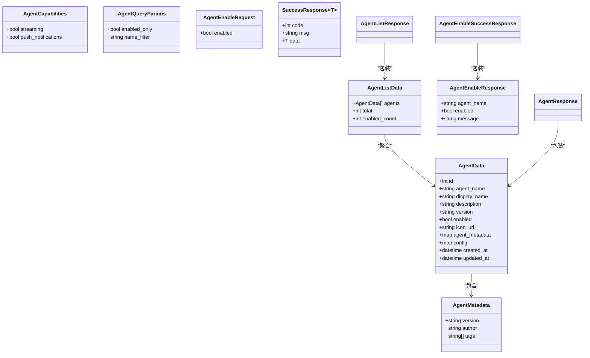
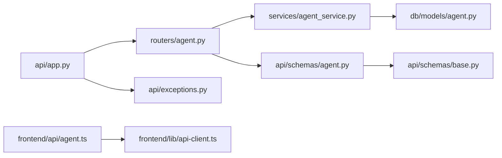
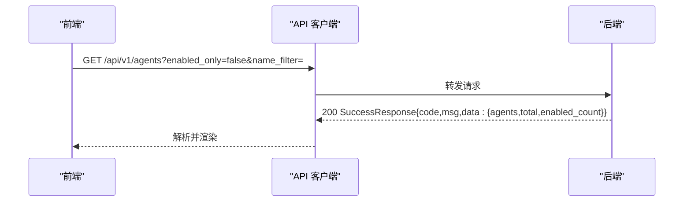
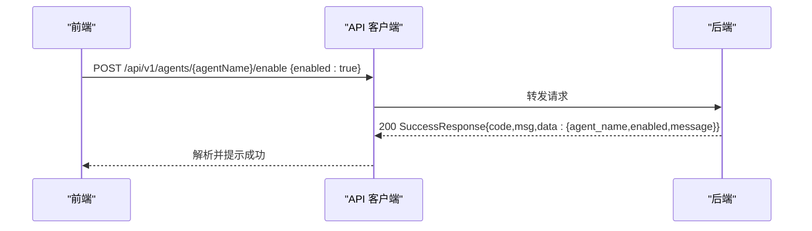
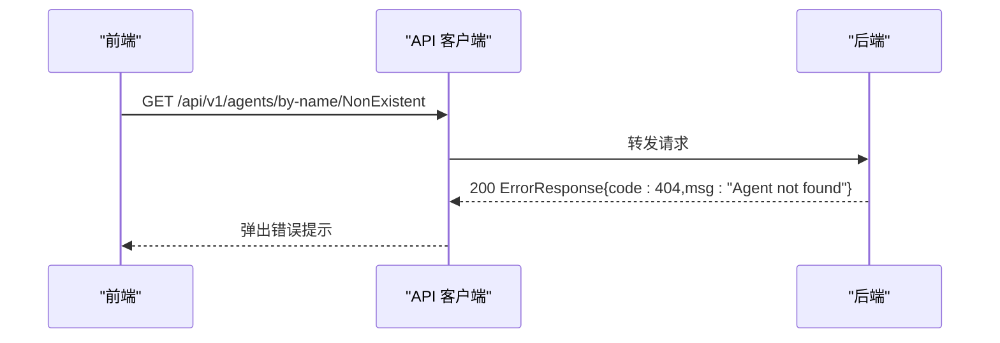

# 智能体API

<cite>
**本文引用的文件列表**
- [python/valuecell/server/api/app.py](file://python/valuecell/server/api/app.py)
- [python/valuecell/server/api/routers/agent.py](file://python/valuecell/server/api/routers/agent.py)
- [python/valuecell/server/api/schemas/agent.py](file://python/valuecell/server/api/schemas/agent.py)
- [python/valuecell/server/api/schemas/base.py](file://python/valuecell/server/api/schemas/base.py)
- [python/valuecell/server/services/agent_service.py](file://python/valuecell/server/services/agent_service.py)
- [python/valuecell/server/db/models/agent.py](file://python/valuecell/server/db/models/agent.py)
- [python/valuecell/server/api/exceptions.py](file://python/valuecell/server/api/exceptions.py)
- [python/valuecell/server/config/settings.py](file://python/valuecell/server/config/settings.py)
- [python/valuecell/server/main.py](file://python/valuecell/server/main.py)
- [frontend/src/api/agent.ts](file://frontend/src/api/agent.ts)
- [frontend/src/lib/api-client.ts](file://frontend/src/lib/api-client.ts)
- [frontend/src/constants/agent.ts](file://frontend/src/constants/agent.ts)
</cite>

## 目录
1. [简介](#简介)
2. [项目结构](#项目结构)
3. [核心组件](#核心组件)
4. [架构总览](#架构总览)
5. [详细组件分析](#详细组件分析)
6. [依赖关系分析](#依赖关系分析)
7. [性能与可扩展性](#性能与可扩展性)
8. [故障排查指南](#故障排查指南)
9. [结论](#结论)
10. [附录：API参考与示例](#附录api参考与示例)

## 简介
本文件为 ValueCell 中“智能体”模块的 RESTful API 文档，聚焦于后端 FastAPI 路由器提供的智能体管理接口，涵盖以下能力：
- 获取全部智能体（支持按启用状态与名称模糊过滤）
- 按 ID 查询特定智能体
- 按名称查询特定智能体
- 启用/禁用智能体
- 统一响应模型与错误码映射
- 前端集成方式与最佳实践

同时，文档对核心数据模型（AgentListResponse、AgentResponse、AgentEnableRequest 等）进行说明，并给出成功与错误场景的请求/响应示意流程图，帮助开发者快速对接与排障。

## 项目结构
ValueCell 的智能体 API 位于 Python 后端，采用分层架构：
- 应用入口与路由注册：FastAPI 应用工厂负责加载环境、中间件、异常处理器与路由挂载
- 路由层：定义 /api/v1/agents 下的 REST 接口
- 服务层：封装业务逻辑（查询、更新启用状态等）
- 数据模型层：SQLAlchemy Agent 表与 Pydantic Schema
- 前端集成：React Query Hook 封装 GET/POST 请求，统一错误处理

图表来源
- [python/valuecell/server/api/app.py](file://python/valuecell/server/api/app.py#L180-L242)
- [python/valuecell/server/api/routers/agent.py](file://python/valuecell/server/api/routers/agent.py#L22-L180)
- [python/valuecell/server/services/agent_service.py](file://python/valuecell/server/services/agent_service.py#L1-L202)
- [python/valuecell/server/db/models/agent.py](file://python/valuecell/server/db/models/agent.py#L1-L131)
- [python/valuecell/server/api/schemas/agent.py](file://python/valuecell/server/api/schemas/agent.py#L1-L129)
- [python/valuecell/server/api/schemas/base.py](file://python/valuecell/server/api/schemas/base.py#L1-L76)
- [python/valuecell/server/api/exceptions.py](file://python/valuecell/server/api/exceptions.py#L1-L112)
- [python/valuecell/server/config/settings.py](file://python/valuecell/server/config/settings.py#L1-L98)
- [python/valuecell/server/main.py](file://python/valuecell/server/main.py#L1-L99)
- [frontend/src/api/agent.ts](file://frontend/src/api/agent.ts#L1-L57)
- [frontend/src/lib/api-client.ts](file://frontend/src/lib/api-client.ts#L1-L186)
- [frontend/src/constants/agent.ts](file://frontend/src/constants/agent.ts#L1-L123)

章节来源
- [python/valuecell/server/api/app.py](file://python/valuecell/server/api/app.py#L180-L242)
- [python/valuecell/server/main.py](file://python/valuecell/server/main.py#L1-L99)

## 核心组件
- 应用工厂与路由挂载
  - 应用工厂负责加载系统环境、初始化数据库、注册中间件与异常处理器，并在 /api/v1 前缀下挂载各路由模块，其中包含智能体路由
- 智能体路由
  - 提供获取全部智能体、按 ID/名称查询、启用/禁用智能体等接口
- 服务层
  - 实现查询过滤、统计、更新启用状态等业务逻辑
- 数据模型
  - SQLAlchemy Agent 表与 Pydantic 模型（AgentData、AgentListData、AgentEnableRequest 等）
- 前端集成
  - React Query Hook 封装 GET/POST 请求，统一错误处理与缓存失效策略

章节来源
- [python/valuecell/server/api/app.py](file://python/valuecell/server/api/app.py#L180-L242)
- [python/valuecell/server/api/routers/agent.py](file://python/valuecell/server/api/routers/agent.py#L22-L180)
- [python/valuecell/server/services/agent_service.py](file://python/valuecell/server/services/agent_service.py#L1-L202)
- [python/valuecell/server/db/models/agent.py](file://python/valuecell/server/db/models/agent.py#L1-L131)
- [python/valuecell/server/api/schemas/agent.py](file://python/valuecell/server/api/schemas/agent.py#L1-L129)
- [frontend/src/api/agent.ts](file://frontend/src/api/agent.ts#L1-L57)

## 架构总览
后端通过 FastAPI 提供 REST 接口，前端通过 React Query 与自定义 API 客户端发起请求。异常统一映射到统一响应模型，便于前端一致化处理。

图表来源
- [python/valuecell/server/api/app.py](file://python/valuecell/server/api/app.py#L180-L242)
- [python/valuecell/server/api/routers/agent.py](file://python/valuecell/server/api/routers/agent.py#L22-L180)
- [python/valuecell/server/services/agent_service.py](file://python/valuecell/server/services/agent_service.py#L1-L202)
- [python/valuecell/server/db/models/agent.py](file://python/valuecell/server/db/models/agent.py#L1-L131)
- [frontend/src/lib/api-client.ts](file://frontend/src/lib/api-client.ts#L1-L186)

## 详细组件分析

### 智能体路由与端点
- 基础前缀
  - /api/v1/agents
- 端点清单
  - GET /api/v1/agents
    - 功能：获取全部智能体，支持启用状态过滤与名称模糊过滤
    - 查询参数：
      - enabled_only: 是否仅返回启用的智能体（布尔）
      - name_filter: 名称过滤（字符串，支持模糊匹配）
    - 成功响应：AgentListResponse
    - 错误：500（内部错误）
  - GET /api/v1/agents/{agent_id}
    - 功能：按 ID 获取智能体详情
    - 路径参数：agent_id（整数）
    - 成功响应：AgentResponse
    - 错误：404（未找到）、500（内部错误）
  - GET /api/v1/agents/by-name/{agent_name}
    - 功能：按名称获取智能体详情
    - 路径参数：agent_name（字符串）
    - 成功响应：AgentResponse
    - 错误：404（未找到）、500（内部错误）
  - POST /api/v1/agents/{agent_name}/enable
    - 功能：启用/禁用指定名称的智能体
    - 路径参数：agent_name（字符串）
    - 请求体：AgentEnableRequest（enabled: 布尔）
    - 成功响应：AgentEnableSuccessResponse
    - 错误：404（未找到）、500（内部错误）

章节来源
- [python/valuecell/server/api/routers/agent.py](file://python/valuecell/server/api/routers/agent.py#L22-L180)

### 服务层逻辑
- get_all_agents
  - 支持 enabled_only、name_filter 过滤；默认排除隐藏智能体（如 research_agent、news_agent），除非已启用
  - 返回 AgentListData（包含 agents 列表、总数、启用计数）
- get_agent_by_id
  - 按主键 ID 查询，返回 AgentData 或空
- get_agent_by_name
  - 按唯一名称查询，返回 AgentData 或空
- update_agent_enabled
  - 更新 enabled 字段与 updated_at 时间戳，提交事务后返回 AgentData

图表来源
- [python/valuecell/server/services/agent_service.py](file://python/valuecell/server/services/agent_service.py#L15-L98)

章节来源
- [python/valuecell/server/services/agent_service.py](file://python/valuecell/server/services/agent_service.py#L1-L202)

### 数据模型与响应结构
- AgentCapabilities
  - streaming: 是否支持流式输出
  - push_notifications: 是否支持推送通知
- AgentMetadata
  - version: 版本
  - author: 作者
  - tags: 标签数组
- AgentData
  - 字段：id、agent_name、display_name、description、version、enabled、icon_url、agent_metadata、config、created_at、updated_at
- AgentListData
  - 字段：agents（AgentData 数组）、total（总数）、enabled_count（启用计数）
- AgentQueryParams
  - 字段：enabled_only、name_filter
- AgentEnableRequest
  - 字段：enabled（布尔）
- AgentEnableResponse
  - 字段：agent_name、enabled、message
- 类型别名
  - AgentResponse = SuccessResponse[AgentData]
  - AgentListResponse = SuccessResponse[AgentListData]
  - AgentEnableSuccessResponse = SuccessResponse[AgentEnableResponse]

图表来源
- [python/valuecell/server/api/schemas/agent.py](file://python/valuecell/server/api/schemas/agent.py#L1-L129)
- [python/valuecell/server/api/schemas/base.py](file://python/valuecell/server/api/schemas/base.py#L1-L76)

章节来源
- [python/valuecell/server/api/schemas/agent.py](file://python/valuecell/server/api/schemas/agent.py#L1-L129)
- [python/valuecell/server/api/schemas/base.py](file://python/valuecell/server/api/schemas/base.py#L1-L76)

### 异常与错误码
- 统一响应模型
  - SuccessResponse：code 默认 0，msg 默认 "success"
  - ErrorResponse：code 映射至 StatusCode 枚举
- StatusCode 枚举
  - SUCCESS: 0
  - BAD_REQUEST: 400
  - UNAUTHORIZED: 401
  - FORBIDDEN: 403
  - NOT_FOUND: 404
  - INTERNAL_ERROR: 500
- 异常映射
  - HTTP 404 -> NOT_FOUND
  - HTTP 500 -> INTERNAL_ERROR
  - 验证失败 -> BAD_REQUEST
  - 其他异常 -> INTERNAL_ERROR
- 注意：异常处理器返回 HTTP 200，错误信息写入响应体字段

章节来源
- [python/valuecell/server/api/schemas/base.py](file://python/valuecell/server/api/schemas/base.py#L1-L76)
- [python/valuecell/server/api/exceptions.py](file://python/valuecell/server/api/exceptions.py#L1-L112)

### 前端集成与使用模式
- 前端 Hook
  - useGetAgentList：GET /api/v1/agents?enabled_only=...
  - useGetAgentInfo：GET /api/v1/agents/by-name/{agentName}
  - useEnableAgent：POST /api/v1/agents/{agentName}/enable
- API 客户端
  - 自动拼接 VITE_API_BASE_URL 与 /api/v1 前缀
  - 可选鉴权头（Bearer Token）
  - 统一错误处理与 Toast 提示
- 常量与类型
  - 前端类型 AgentInfo 与后端 AgentData 结构相近，便于对接

章节来源
- [frontend/src/api/agent.ts](file://frontend/src/api/agent.ts#L1-L57)
- [frontend/src/lib/api-client.ts](file://frontend/src/lib/api-client.ts#L1-L186)
- [frontend/src/constants/agent.ts](file://frontend/src/constants/agent.ts#L1-L123)

## 依赖关系分析
- 路由依赖服务层，服务层依赖数据库模型
- 应用工厂集中注册中间件、异常处理器与路由
- 前端通过 API 客户端与后端交互，统一响应模型简化了错误处理

图表来源
- [python/valuecell/server/api/routers/agent.py](file://python/valuecell/server/api/routers/agent.py#L22-L180)
- [python/valuecell/server/services/agent_service.py](file://python/valuecell/server/services/agent_service.py#L1-L202)
- [python/valuecell/server/db/models/agent.py](file://python/valuecell/server/db/models/agent.py#L1-L131)
- [python/valuecell/server/api/schemas/agent.py](file://python/valuecell/server/api/schemas/agent.py#L1-L129)
- [python/valuecell/server/api/schemas/base.py](file://python/valuecell/server/api/schemas/base.py#L1-L76)
- [python/valuecell/server/api/app.py](file://python/valuecell/server/api/app.py#L180-L242)
- [python/valuecell/server/api/exceptions.py](file://python/valuecell/server/api/exceptions.py#L1-L112)
- [frontend/src/api/agent.ts](file://frontend/src/api/agent.ts#L1-L57)
- [frontend/src/lib/api-client.ts](file://frontend/src/lib/api-client.ts#L1-L186)

章节来源
- [python/valuecell/server/api/app.py](file://python/valuecell/server/api/app.py#L180-L242)
- [python/valuecell/server/api/routers/agent.py](file://python/valuecell/server/api/routers/agent.py#L22-L180)
- [python/valuecell/server/services/agent_service.py](file://python/valuecell/server/services/agent_service.py#L1-L202)
- [python/valuecell/server/db/models/agent.py](file://python/valuecell/server/db/models/agent.py#L1-L131)
- [python/valuecell/server/api/schemas/agent.py](file://python/valuecell/server/api/schemas/agent.py#L1-L129)
- [python/valuecell/server/api/schemas/base.py](file://python/valuecell/server/api/schemas/base.py#L1-L76)
- [python/valuecell/server/api/exceptions.py](file://python/valuecell/server/api/exceptions.py#L1-L112)
- [frontend/src/api/agent.ts](file://frontend/src/api/agent.ts#L1-L57)
- [frontend/src/lib/api-client.ts](file://frontend/src/lib/api-client.ts#L1-L186)

## 性能与可扩展性
- 查询优化建议
  - 在 name 与 display_name 上建立索引，提升模糊匹配效率
  - 对 created_at 建立索引，优化排序与分页
- 过滤策略
  - enabled_only 与 name_filter 可组合使用，减少不必要的数据传输
- 缓存策略
  - 前端对列表与详情使用 React Query 缓存，变更启用状态后主动失效缓存
- 扩展方向
  - 支持分页与排序参数
  - 增加更多元数据字段与标签筛选
  - 提供批量操作接口（批量启用/禁用）

[本节为通用建议，不直接分析具体文件]

## 故障排查指南
- 常见错误与定位
  - 404 未找到：检查 agent_id 或 agent_name 是否正确
  - 500 内部错误：查看后端日志，确认数据库连接与查询是否异常
  - 400 参数校验失败：检查请求体与查询参数格式
- 前端错误处理
  - API 客户端会自动弹出 Toast 提示，并在 401 时尝试刷新令牌
  - 建议在调用 useEnableAgent 后主动失效相关查询缓存，确保 UI 最新状态
- 后端异常映射
  - 所有异常最终以统一响应模型返回，HTTP 状态码为 200，错误信息在响应体中

章节来源
- [python/valuecell/server/api/exceptions.py](file://python/valuecell/server/api/exceptions.py#L1-L112)
- [frontend/src/lib/api-client.ts](file://frontend/src/lib/api-client.ts#L1-L186)
- [frontend/src/api/agent.ts](file://frontend/src/api/agent.ts#L1-L57)

## 结论
ValueCell 的智能体 API 采用清晰的分层设计与统一响应模型，覆盖了智能体全生命周期管理的关键需求。后端通过 FastAPI 提供稳定可靠的 REST 接口，前端通过 React Query 与自定义 API 客户端实现一致化的请求与错误处理。建议在生产环境中进一步完善索引、分页与批量操作能力，以满足更大规模的智能体管理场景。

[本节为总结性内容，不直接分析具体文件]

## 附录：API参考与示例

### 端点一览
- GET /api/v1/agents
  - 查询参数：enabled_only（布尔）、name_filter（字符串）
  - 成功响应：AgentListResponse
  - 错误：500
- GET /api/v1/agents/{agent_id}
  - 成功响应：AgentResponse
  - 错误：404、500
- GET /api/v1/agents/by-name/{agent_name}
  - 成功响应：AgentResponse
  - 错误：404、500
- POST /api/v1/agents/{agent_name}/enable
  - 请求体：AgentEnableRequest（enabled: 布尔）
  - 成功响应：AgentEnableSuccessResponse
  - 错误：404、500

章节来源
- [python/valuecell/server/api/routers/agent.py](file://python/valuecell/server/api/routers/agent.py#L22-L180)

### 统一响应模型与错误码
- SuccessResponse
  - code: 0（成功）
  - msg: "success"
  - data: 具体数据
- ErrorResponse
  - code: 400/401/403/404/500
  - msg: 错误消息
  - data: null
- 异常映射
  - HTTP 404 -> NOT_FOUND
  - HTTP 500 -> INTERNAL_ERROR
  - 验证失败 -> BAD_REQUEST
  - 其他异常 -> INTERNAL_ERROR

章节来源
- [python/valuecell/server/api/schemas/base.py](file://python/valuecell/server/api/schemas/base.py#L1-L76)
- [python/valuecell/server/api/exceptions.py](file://python/valuecell/server/api/exceptions.py#L1-L112)

### 数据模型要点
- AgentData
  - 关键字段：id、agent_name、display_name、enabled、agent_metadata、config、created_at、updated_at
- AgentListData
  - 关键字段：agents、total、enabled_count
- AgentEnableRequest
  - 关键字段：enabled
- AgentEnableResponse
  - 关键字段：agent_name、enabled、message

章节来源
- [python/valuecell/server/api/schemas/agent.py](file://python/valuecell/server/api/schemas/agent.py#L1-L129)

### 前端集成要点
- useGetAgentList：GET /api/v1/agents?enabled_only=...
- useGetAgentInfo：GET /api/v1/agents/by-name/{agentName}
- useEnableAgent：POST /api/v1/agents/{agentName}/enable
- API 客户端自动拼接 /api/v1 前缀，支持鉴权头与错误提示

章节来源
- [frontend/src/api/agent.ts](file://frontend/src/api/agent.ts#L1-L57)
- [frontend/src/lib/api-client.ts](file://frontend/src/lib/api-client.ts#L1-L186)

### 请求/响应示意流程
- 获取全部智能体（成功）

- 启用智能体（成功）

- 查询不存在的智能体（404）

[以上图为概念性示意，不直接对应具体源码文件]