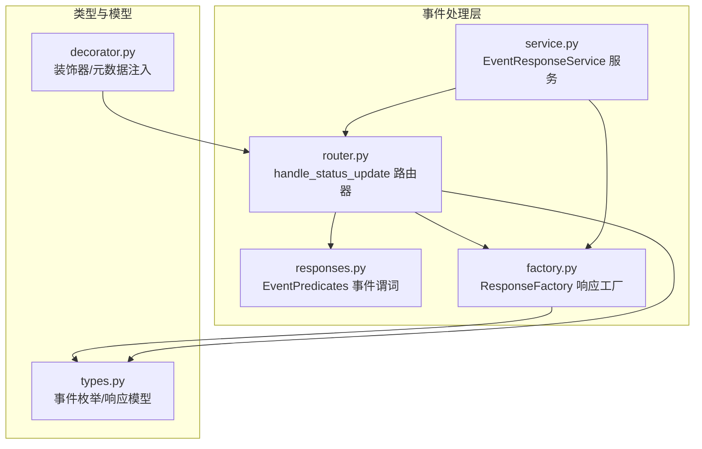
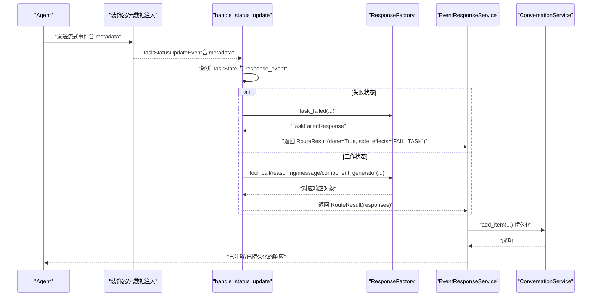
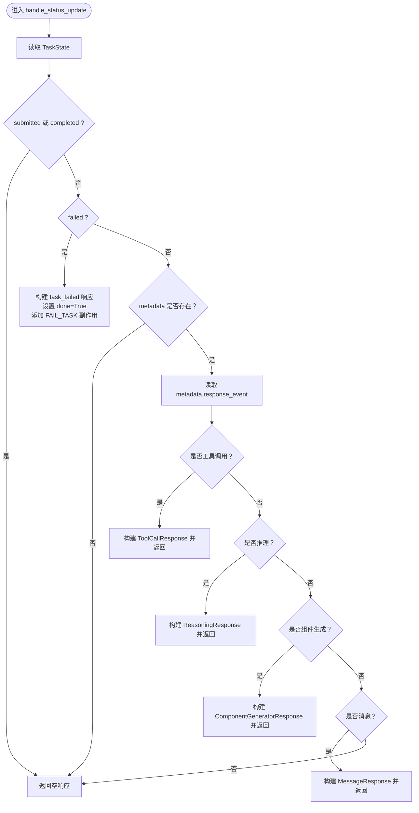
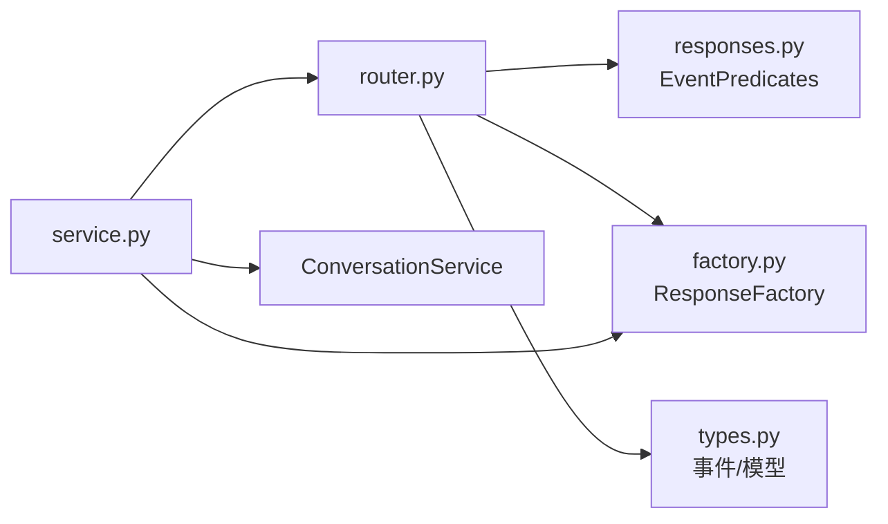

# 事件类型

<cite>
**本文引用的文件**
- [router.py](file://python/valuecell/core/event/router.py)
- [responses.py](file://python/valuecell/core/agent/responses.py)
- [factory.py](file://python/valuecell/core/event/factory.py)
- [service.py](file://python/valuecell/core/event/service.py)
- [types.py](file://python/valuecell/core/types.py)
- [decorator.py](file://python/valuecell/core/agent/decorator.py)
- [test_response_router.py](file://python/valuecell/core/event/tests/test_response_router.py)
- [test_component_id.py](file://python/valuecell/core/event/tests/test_component_id.py)
</cite>

## 目录
1. [简介](#简介)
2. [项目结构](#项目结构)
3. [核心组件](#核心组件)
4. [架构总览](#架构总览)
5. [详细组件分析](#详细组件分析)
6. [依赖关系分析](#依赖关系分析)
7. [性能考量](#性能考量)
8. [故障排查指南](#故障排查指南)
9. [结论](#结论)

## 简介
本文件系统性梳理了流式API支持的事件类型与处理逻辑，重点覆盖以下内容：
- handle_status_update 如何依据 TaskStatusUpdateEvent 的状态与元数据进行路由，生成不同类型的响应并可附加副作用（如标记任务失败）。
- 工具调用（tool_call）、推理过程（reasoning）、组件生成（component_generator）、普通消息（message_response_general）等事件的触发条件、数据结构与前端渲染行为。
- EventPredicates 对事件类型的识别规则，ResponseFactory 对响应对象的创建策略。
- 每类事件的 JSON 示例与典型使用场景，帮助开发者快速集成与调试。

## 项目结构
围绕事件处理的核心模块包括：
- 路由器：将 TaskStatusUpdateEvent 转换为具体响应与副作用
- 响应工厂：按事件类型构造统一的响应对象
- 事件谓词：对事件类型进行分类判断
- 服务层：负责持久化与批量处理
- 类型定义：统一事件枚举、响应模型与数据载荷

图表来源
- [router.py](file://python/valuecell/core/event/router.py#L61-L169)
- [responses.py](file://python/valuecell/core/agent/responses.py#L220-L307)
- [factory.py](file://python/valuecell/core/event/factory.py#L37-L640)
- [service.py](file://python/valuecell/core/event/service.py#L15-L81)
- [types.py](file://python/valuecell/core/types.py#L38-L115)
- [decorator.py](file://python/valuecell/core/agent/decorator.py#L196-L213)

章节来源
- [router.py](file://python/valuecell/core/event/router.py#L61-L169)
- [responses.py](file://python/valuecell/core/agent/responses.py#L220-L307)
- [factory.py](file://python/valuecell/core/event/factory.py#L37-L640)
- [service.py](file://python/valuecell/core/event/service.py#L15-L81)
- [types.py](file://python/valuecell/core/types.py#L38-L115)
- [decorator.py](file://python/valuecell/core/agent/decorator.py#L196-L213)

## 核心组件
- 路由器（handle_status_update）
  - 接收 TaskStatusUpdateEvent，基于 TaskState 与 metadata 中的 response_event 进行分支处理。
  - 对于提交/完成状态默认不产生消息；失败状态生成 task_failed 并请求失败副作用。
  - working 状态下依据 EventPredicates 判定工具调用、推理、组件生成或普通消息，并通过 ResponseFactory 构造响应。
- 事件谓词（EventPredicates）
  - 提供 is_tool_call、is_reasoning、is_message 等静态方法，用于识别事件类型。
- 响应工厂（ResponseFactory）
  - 面向不同事件类型创建对应的响应对象（MessageResponse、ReasoningResponse、ToolCallResponse、ComponentGeneratorResponse、TaskFailedResponse 等），并填充 UnifiedResponseData。
- 服务（EventResponseService）
  - 统一入口，负责响应注解、缓冲、持久化与批量发射。

章节来源
- [router.py](file://python/valuecell/core/event/router.py#L61-L169)
- [responses.py](file://python/valuecell/core/agent/responses.py#L220-L307)
- [factory.py](file://python/valuecell/core/event/factory.py#L37-L640)
- [service.py](file://python/valuecell/core/event/service.py#L15-L81)

## 架构总览
下面的序列图展示了从事件到响应再到持久化的完整流程。

图表来源
- [router.py](file://python/valuecell/core/event/router.py#L61-L169)
- [factory.py](file://python/valuecell/core/event/factory.py#L324-L457)
- [service.py](file://python/valuecell/core/event/service.py#L36-L81)
- [decorator.py](file://python/valuecell/core/agent/decorator.py#L196-L213)

## 详细组件分析

### 事件类型与触发条件
- 工具调用（tool_call）
  - 触发条件：TaskState.working 且 metadata.response_event 属于工具调用事件集合。
  - 元数据要求：tool_call_id、tool_name；可选 tool_result。
  - 响应对象：ToolCallResponse，payload 为 ToolCallPayload。
- 推理过程（reasoning）
  - 触发条件：TaskState.working 且 metadata.response_event 属于推理事件集合。
  - 元数据要求：无强制字段，content 可选。
  - 响应对象：ReasoningResponse，event 为推理相关枚举之一。
- 组件生成（component_generator）
  - 触发条件：TaskState.working 且 metadata.response_event 等于通用事件枚举值。
  - 元数据要求：component_type；可选 component_id 以支持替换行为。
  - 响应对象：ComponentGeneratorResponse，payload 为包含 component_type 的载荷。
- 普通消息（message_response_general）
  - 触发条件：TaskState.working 且 metadata.response_event 属于消息事件集合。
  - 元数据要求：无强制字段，content 为文本。
  - 响应对象：MessageResponse，event 为消息相关枚举之一。
- 任务失败（task_failed）
  - 触发条件：TaskState.failed。
  - 元数据要求：无强制字段，content 来自消息文本。
  - 响应对象：TaskFailedResponse，同时返回副作用请求失败任务。

章节来源
- [router.py](file://python/valuecell/core/event/router.py#L61-L169)
- [responses.py](file://python/valuecell/core/agent/responses.py#L220-L307)
- [factory.py](file://python/valuecell/core/event/factory.py#L324-L640)
- [types.py](file://python/valuecell/core/types.py#L38-L115)
- [decorator.py](file://python/valuecell/core/agent/decorator.py#L196-L213)

### handle_status_update 的路由逻辑
- 状态分支
  - submitted/completed：直接返回空响应，不产生消息。
  - failed：生成 task_failed 响应并请求失败副作用。
- working 分支
  - 若 metadata 为空：返回空响应。
  - 否则根据 response_event 选择工具调用、推理、组件生成或普通消息路径。
- 返回值
  - RouteResult 包含 responses、done 标志与 side_effects 列表。

图表来源
- [router.py](file://python/valuecell/core/event/router.py#L61-L169)

章节来源
- [router.py](file://python/valuecell/core/event/router.py#L61-L169)

### EventPredicates 的识别规则
- is_tool_call：匹配工具调用开始/完成两类事件。
- is_reasoning：匹配推理开始/中间/结束三类事件。
- is_message：匹配消息块与通知消息两类事件。
- is_task_completed/is_task_failed：用于任务生命周期事件的识别（在其他模块中使用）。

章节来源
- [responses.py](file://python/valuecell/core/agent/responses.py#L220-L307)

### ResponseFactory 的响应创建
- 工具调用：tool_call，事件为工具调用开始/完成，payload 为 ToolCallPayload，完成后会格式化 tool_result 以便前端渲染。
- 推理：reasoning，事件为推理相关枚举之一，payload 可选。
- 消息：message_response_general，事件为消息块或通知消息，payload 为文本。
- 组件生成：component_generator，事件为通用组件生成，payload 为包含 component_type 的载荷；若传入 component_id，则覆盖 item_id 实现替换。
- 任务失败：task_failed，事件为任务失败，payload 为错误文本。

章节来源
- [factory.py](file://python/valuecell/core/event/factory.py#L324-L640)
- [test_component_id.py](file://python/valuecell/core/event/tests/test_component_id.py#L104-L143)

### 数据结构与 JSON 示例
以下为常见事件的 JSON 结构要点（字段名与类型来自响应模型与载荷定义）：
- 工具调用（开始/完成）
  - event：工具调用开始/完成
  - data.payload：包含 tool_call_id、tool_name、可选 tool_result
  - data.metadata：可选
- 推理（开始/中间/完成）
  - event：推理开始/中间/完成
  - data.payload.content：可选文本
- 组件生成
  - event：component_generator
  - data.payload.component_type：字符串
  - data.metadata.component_type：字符串
  - data.metadata.component_id：可选，用于替换
- 普通消息
  - event：消息块或通知消息
  - data.payload.content：文本
- 任务失败
  - event：任务失败
  - data.payload.content：错误文本

章节来源
- [types.py](file://python/valuecell/core/types.py#L81-L115)
- [types.py](file://python/valuecell/core/types.py#L284-L323)
- [types.py](file://python/valuecell/core/types.py#L352-L371)
- [types.py](file://python/valuecell/core/types.py#L372-L393)
- [types.py](file://python/valuecell/core/types.py#L422-L432)
- [factory.py](file://python/valuecell/core/event/factory.py#L324-L640)

### 使用场景
- 工具调用
  - 场景：代理执行外部工具后上报结果；前端展示工具调用链路与结果。
  - 关键点：完成后需确保 tool_result 格式兼容前端渲染。
- 推理过程
  - 场景：代理输出中间思考过程，便于用户理解决策链条。
  - 关键点：合理拆分 reasoning_started/reasoning/reasoning_completed 三段。
- 组件生成
  - 场景：动态生成 UI 组件（如报告卡片、图表等），支持替换行为。
  - 关键点：component_id 与 item_id 的优先级与替换语义。
- 普通消息
  - 场景：常规对话消息或通知消息。
  - 关键点：区分流式消息块与通知消息，保持一致性。
- 任务失败
  - 场景：代理在执行过程中遇到不可恢复错误，需要终止任务并记录错误。
  - 关键点：失败副作用与持久化的一致性。

章节来源
- [router.py](file://python/valuecell/core/event/router.py#L61-L169)
- [factory.py](file://python/valuecell/core/event/factory.py#L324-L640)
- [test_response_router.py](file://python/valuecell/core/event/tests/test_response_router.py#L1-L200)

## 依赖关系分析
- 路由器依赖
  - 事件谓词：用于判定事件类型。
  - 响应工厂：用于创建具体响应对象。
  - 类型定义：统一事件枚举与响应模型。
- 服务层依赖
  - 路由器：获取 RouteResult。
  - 响应工厂：构造响应对象。
  - 会话服务：持久化响应项。

图表来源
- [router.py](file://python/valuecell/core/event/router.py#L61-L169)
- [responses.py](file://python/valuecell/core/agent/responses.py#L220-L307)
- [factory.py](file://python/valuecell/core/event/factory.py#L37-L640)
- [service.py](file://python/valuecell/core/event/service.py#L15-L81)

章节来源
- [router.py](file://python/valuecell/core/event/router.py#L61-L169)
- [responses.py](file://python/valuecell/core/agent/responses.py#L220-L307)
- [factory.py](file://python/valuecell/core/event/factory.py#L37-L640)
- [service.py](file://python/valuecell/core/event/service.py#L15-L81)

## 性能考量
- 流式事件的批处理与缓冲：服务层通过缓冲区聚合响应，减少频繁写入。
- 响应对象的最小化序列化：统一使用 UnifiedResponseData，避免冗余字段。
- 工具结果格式化：仅在完成时进行格式化，降低不必要的计算开销。
- 建议
  - 控制推理与消息的粒度，避免过细的事件导致前端渲染压力。
  - 对组件生成采用稳定的 component_id，减少重复渲染。

[本节为通用建议，无需特定文件引用]

## 故障排查指南
- 未产生任何响应
  - 检查 TaskState 是否为 submitted/completed。
  - 检查 metadata 是否存在，以及 response_event 是否正确设置。
- 工具调用未显示结果
  - 确认 metadata 中包含 tool_result，且已完成事件才会格式化。
  - 确认前端渲染期望的 JSON 数组格式。
- 组件替换无效
  - 确认 metadata 中包含 component_id，且 component_id 与 item_id 的优先级生效。
- 任务失败未持久化
  - 确认路由返回 done=True 且包含 FAIL_TASK 副作用，服务层已调用持久化接口。

章节来源
- [router.py](file://python/valuecell/core/event/router.py#L61-L169)
- [factory.py](file://python/valuecell/core/event/factory.py#L324-L640)
- [service.py](file://python/valuecell/core/event/service.py#L36-L81)
- [test_component_id.py](file://python/valuecell/core/event/tests/test_component_id.py#L104-L143)

## 结论
本文系统梳理了流式API事件类型与处理逻辑，明确了 handle_status_update 的路由策略、EventPredicates 的识别规则与 ResponseFactory 的响应创建方式。通过统一的事件枚举与响应模型，系统实现了对工具调用、推理过程、组件生成与普通消息的灵活支持，并提供了明确的 JSON 结构与使用场景，便于前后端协同开发与维护。