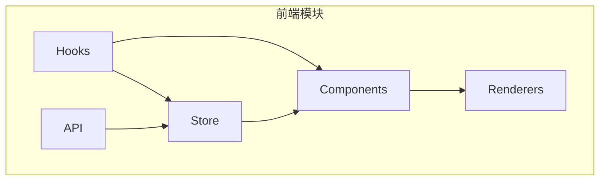
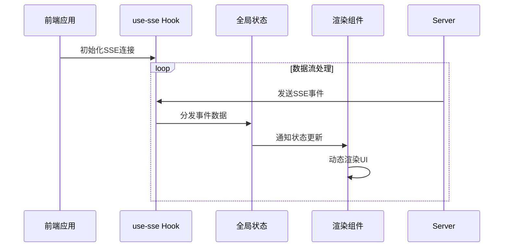
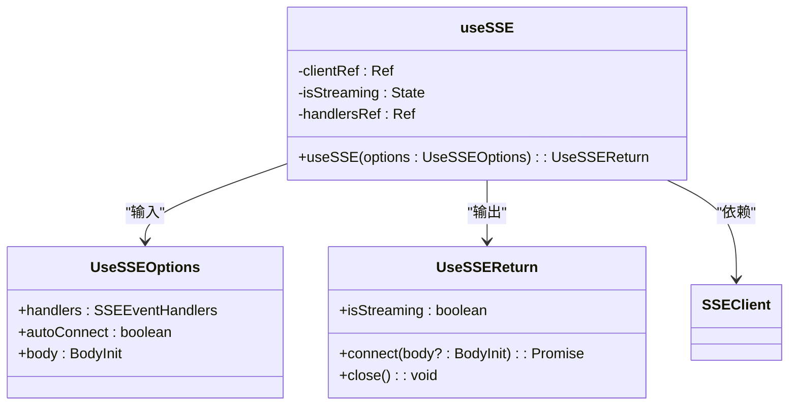
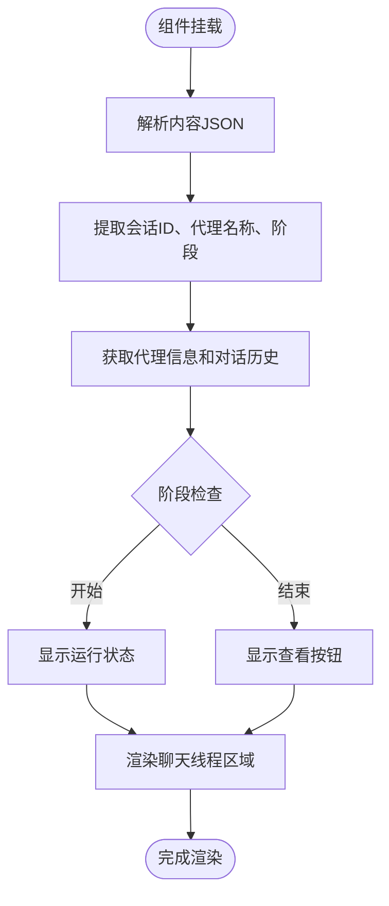
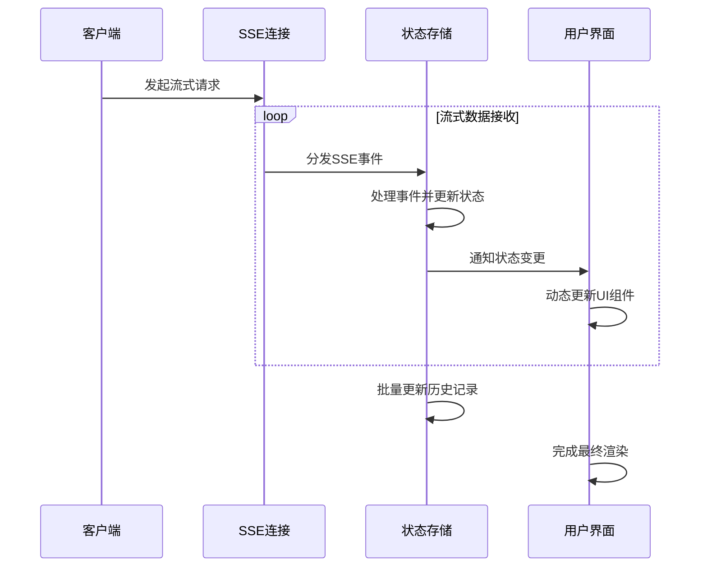
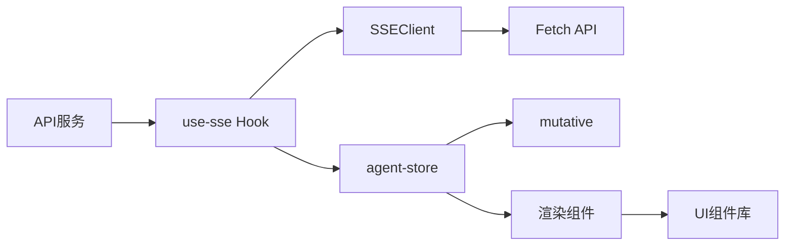

# 客户端集成

<cite>
**本文档中引用的文件**  
- [use-sse.ts](file://frontend/src/hooks/use-sse.ts)
- [sse-client.ts](file://frontend/src/lib/sse-client.ts)
- [chat-conversation-renderer.tsx](file://frontend/src/components/valuecell/renderer/chat-conversation-renderer.tsx)
- [chat-thread-area.tsx](file://frontend/src/app/agent/components/chat-conversation/chat-thread-area.tsx)
- [chat-item-area.tsx](file://frontend/src/app/agent/components/chat-conversation/chat-item-area.tsx)
- [agent-store.ts](file://frontend/src/lib/agent-store.ts)
- [agent-store.ts](file://frontend/src/store/agent-store.ts)
- [reasoning-renderer.tsx](file://frontend/src/components/valuecell/renderer/reasoning-renderer.tsx)
- [tool-call-renderer.tsx](file://frontend/src/components/valuecell/renderer/tool-call-renderer.tsx)
- [chat-streaming-indicator.tsx](file://frontend/src/app/agent/components/chat-conversation/chat-streaming-indicator.tsx)
- [agent.ts](file://frontend/src/types/agent.ts)
- [conversation.ts](file://frontend/src/types/conversation.ts)
</cite>

## 目录
1. [简介](#简介)
2. [项目结构](#项目结构)
3. [核心组件](#核心组件)
4. [架构概述](#架构概述)
5. [详细组件分析](#详细组件分析)
6. [依赖分析](#依赖分析)
7. [性能考虑](#性能考虑)
8. [故障排除指南](#故障排除指南)
9. [结论](#结论)

## 简介
本文档提供详细的客户端集成指南，说明如何在前端应用中消费流式API。重点介绍use-sse自定义Hook如何处理SSE连接和消息解析，以及chat-conversation-renderer组件如何根据不同的事件类型（如推理、工具调用）动态渲染UI。同时涵盖流式文本显示、进度指示器、错误处理、连接中断恢复、状态同步等关键功能的实现方式，并提供性能优化建议。

## 项目结构
本项目采用模块化前端架构，主要分为hooks、components、store、api等核心目录。SSE流式处理逻辑集中在hooks和lib目录下，UI渲染组件分布在components/valuecell/renderer目录中，状态管理通过zustand实现并存放于store目录。这种分层结构确保了流式数据处理、状态管理和UI渲染的关注点分离。

**Diagram sources**
- [use-sse.ts](file://frontend/src/hooks/use-sse.ts)
- [agent-store.ts](file://frontend/src/store/agent-store.ts)

**Section sources**
- [project_structure](file://project_structure)

## 核心组件
系统的核心组件包括use-sse自定义Hook用于管理SSE连接，agent-store用于状态管理，以及一系列渲染器组件负责UI展示。这些组件协同工作，实现了从服务器接收流式数据到前端渲染的完整流程，支持动态内容更新、交互式UI元素和复杂的状态管理。

**Section sources**
- [use-sse.ts](file://frontend/src/hooks/use-sse.ts)
- [agent-store.ts](file://frontend/src/lib/agent-store.ts)
- [chat-conversation-renderer.tsx](file://frontend/src/components/valuecell/renderer/chat-conversation-renderer.tsx)

## 架构概述
系统采用基于SSE的流式架构，前端通过use-sse Hook建立与后端的持久连接，接收分块的数据流。接收到的数据通过事件处理器分发到全局状态store，UI组件订阅状态变化并动态更新。这种架构支持实时数据流处理，能够高效地处理推理、工具调用等不同类型的事件，并提供流畅的用户体验。

**Diagram sources**
- [use-sse.ts](file://frontend/src/hooks/use-sse.ts)
- [agent-store.ts](file://frontend/src/lib/agent-store.ts)
- [chat-conversation-renderer.tsx](file://frontend/src/components/valuecell/renderer/chat-conversation-renderer.tsx)

## 详细组件分析

### use-sse自定义Hook分析
use-sse是处理SSE连接的核心Hook，封装了连接管理、事件处理和状态同步的复杂逻辑。它提供简洁的API供组件使用，包括connect、close方法和isStreaming状态。

#### Hook实现细节

**Diagram sources**
- [use-sse.ts](file://frontend/src/hooks/use-sse.ts)
- [sse-client.ts](file://frontend/src/lib/sse-client.ts)

**Section sources**
- [use-sse.ts](file://frontend/src/hooks/use-sse.ts)

### chat-conversation-renderer组件分析
chat-conversation-renderer组件负责解析和渲染聊天对话内容，根据不同的事件类型选择合适的渲染器组件进行展示。

#### 组件工作流程

**Diagram sources**
- [chat-conversation-renderer.tsx](file://frontend/src/components/valuecell/renderer/chat-conversation-renderer.tsx)

**Section sources**
- [chat-conversation-renderer.tsx](file://frontend/src/components/valuecell/renderer/chat-conversation-renderer.tsx)

### 流式数据处理与状态同步
系统通过精心设计的状态管理机制，将流式响应与本地状态(store)无缝同步，确保UI能够实时反映最新的数据状态。

#### 状态更新流程

**Diagram sources**
- [agent-store.ts](file://frontend/src/lib/agent-store.ts)
- [use-sse.ts](file://frontend/src/hooks/use-sse.ts)

**Section sources**
- [agent-store.ts](file://frontend/src/lib/agent-store.ts)
- [agent-store.ts](file://frontend/src/store/agent-store.ts)

## 依赖分析
系统各组件之间存在清晰的依赖关系，形成了一个高效的数据流管道。use-sse Hook依赖于SSEClient类进行底层连接管理，状态存储依赖于mutative库进行不可变状态更新，渲染组件依赖于各种UI组件库和工具函数。

**Diagram sources**
- [use-sse.ts](file://frontend/src/hooks/use-sse.ts)
- [agent-store.ts](file://frontend/src/lib/agent-store.ts)
- [package.json](file://frontend/package.json)

**Section sources**
- [use-sse.ts](file://frontend/src/hooks/use-sse.ts)
- [agent-store.ts](file://frontend/src/lib/agent-store.ts)

## 性能考虑
在实现流式API集成时，需要考虑多个性能优化点，包括消息缓冲、渲染节流、连接管理等方面，以确保应用的响应性和稳定性。

### 消息缓冲与渲染节流
系统通过合理的消息缓冲策略和渲染节流机制，避免了频繁的UI更新带来的性能问题。use-sse Hook内部实现了消息缓冲，将多个小的消息块合并处理，减少状态更新频率。同时，渲染组件采用memoization技术，避免不必要的重渲染。

### 连接管理优化
SSE连接实现了自动重连机制和超时控制，确保在网络不稳定的情况下仍能保持良好的用户体验。连接状态被妥善管理，避免了重复连接和资源泄漏的问题。

### 状态更新优化
通过mutative库实现的不可变状态更新，确保了状态变更的高效性和可预测性。批量更新API允许将多个相关更新合并为一次状态变更，减少了UI的重新渲染次数。

**Section sources**
- [sse-client.ts](file://frontend/src/lib/sse-client.ts)
- [agent-store.ts](file://frontend/src/lib/agent-store.ts)
- [use-sse.ts](file://frontend/src/hooks/use-sse.ts)

## 故障排除指南
在集成流式API时可能会遇到各种问题，本节提供常见问题的解决方案和调试建议。

### 连接问题排查
当SSE连接无法建立时，首先检查网络连接和服务器状态。查看浏览器开发者工具的网络面板，确认请求是否正常发送，响应头是否包含text/event-stream类型。检查use-sse的配置选项，确保URL和headers正确设置。

### 消息解析错误
如果出现消息解析错误，检查服务器发送的SSE格式是否符合规范，确保每个事件以\n\n结尾。查看控制台警告信息，确认JSON解析是否成功。对于复杂的嵌套JSON，考虑使用更健壮的解析库。

### 状态同步问题
当UI未能正确反映最新状态时，检查状态更新逻辑是否正确处理了所有事件类型。验证store的订阅机制是否正常工作，确保组件能够接收到状态变更通知。

**Section sources**
- [sse-client.ts](file://frontend/src/lib/sse-client.ts)
- [agent-store.ts](file://frontend/src/lib/agent-store.ts)
- [use-sse.ts](file://frontend/src/hooks/use-sse.ts)

## 结论
本文档详细介绍了客户端流式API集成的各个方面，从use-sse自定义Hook的实现到chat-conversation-renderer组件的动态渲染，再到状态同步和性能优化。通过这套完整的解决方案，前端应用能够高效地处理流式数据，提供流畅的用户体验。建议在实际集成时遵循文档中的最佳实践，充分利用提供的工具和组件，确保系统的稳定性和性能。