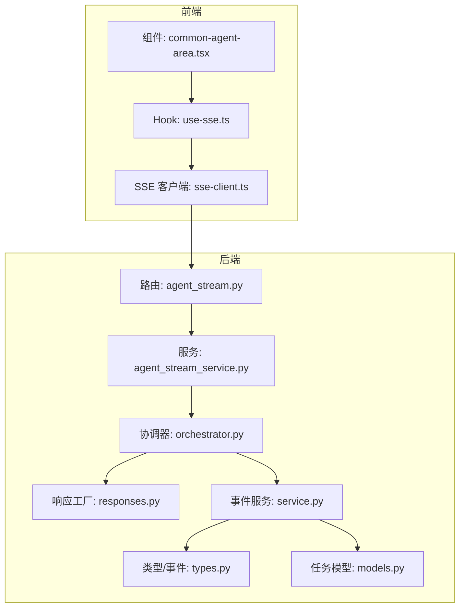
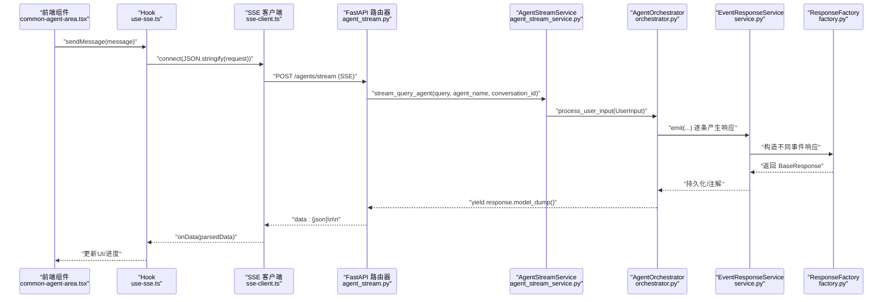
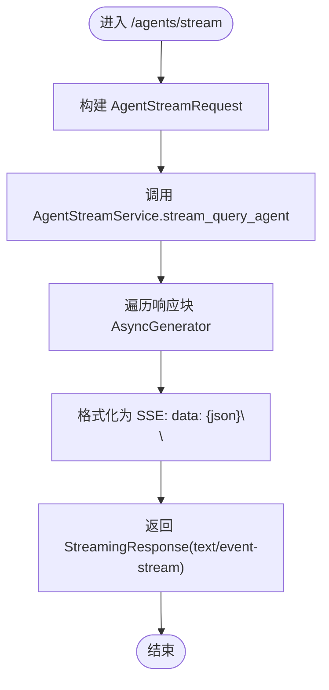
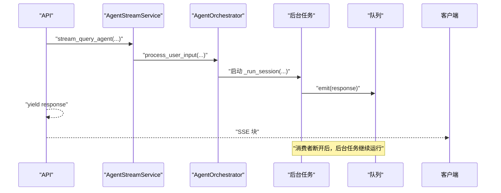
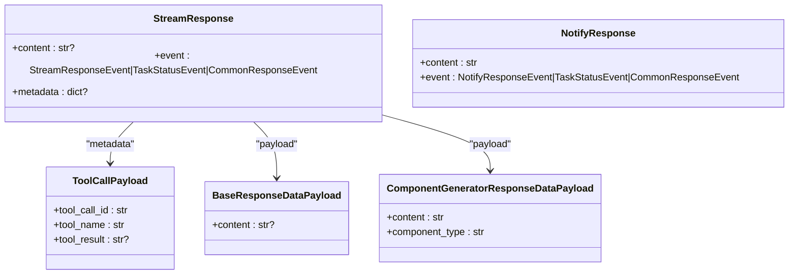
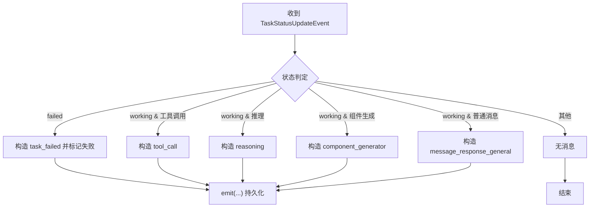
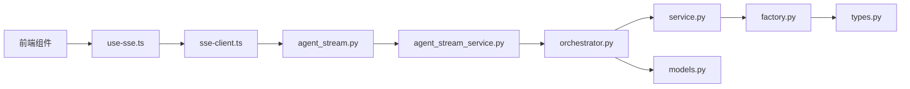

# 流式API

<cite>
**本文引用的文件**
- [agent_stream.py](file://python/valuecell/server/api/routers/agent_stream.py)
- [agent_stream_service.py](file://python/valuecell/server/services/agent_stream_service.py)
- [agent_stream.py（前端）](file://python/valuecell/server/api/schemas/agent_stream.py)
- [types.py](file://python/valuecell/core/types.py)
- [responses.py](file://python/valuecell/core/agent/responses.py)
- [router.py](file://python/valuecell/core/event/router.py)
- [factory.py](file://python/valuecell/core/event/factory.py)
- [service.py](file://python/valuecell/core/event/service.py)
- [orchestrator.py](file://python/valuecell/core/coordinate/orchestrator.py)
- [models.py](file://python/valuecell/core/task/models.py)
- [sse-client.ts](file://frontend/src/lib/sse-client.ts)
- [use-sse.ts](file://frontend/src/hooks/use-sse.ts)
- [common-agent-area.tsx](file://frontend/src/app/agent/components/agent-view/common-agent-area.tsx)
</cite>

## 目录
1. [简介](#简介)
2. [项目结构](#项目结构)
3. [核心组件](#核心组件)
4. [架构总览](#架构总览)
5. [详细组件分析](#详细组件分析)
6. [依赖关系分析](#依赖关系分析)
7. [性能与可靠性](#性能与可靠性)
8. [故障排查指南](#故障排查指南)
9. [结论](#结论)
10. [附录：客户端实现指南](#附录：客户端实现指南)

## 简介
本文件系统性阐述 ValueCell 的流式API，重点覆盖基于 FastAPI 的 Server-Sent Events（SSE）实时通信机制。内容涵盖：
- 连接建立流程与请求/响应模型
- 消息格式与事件类型（推理步骤、工具调用、组件生成、任务状态等）
- 服务端流式响应模式与事件路由（EventRouter）、响应工厂（ResponseFactory）的作用
- 客户端实现要点（SSE 客户端、React Hook、前端渲染与进度指示）

特别说明：当前仓库未实现 WebSocket 实时通道；本文仅针对已实现的 SSE 流式通信进行完整说明，并提供可扩展到 WebSocket 的建议路径。

## 项目结构
围绕流式API的关键文件分布如下：
- 后端路由与服务
  - 路由器：python/valuecell/server/api/routers/agent_stream.py
  - 服务：python/valuecell/server/services/agent_stream_service.py
  - 请求/响应模型：python/valuecell/server/api/schemas/agent_stream.py
- 核心类型与事件
  - 类型与事件枚举：python/valuecell/core/types.py
  - 响应工厂与命名空间：python/valuecell/core/agent/responses.py
  - 事件路由与工厂：python/valuecell/core/event/router.py、python/valuecell/core/event/factory.py、python/valuecell/core/event/service.py
  - 协调器与会话：python/valuecell/core/coordinate/orchestrator.py
  - 任务模型：python/valuecell/core/task/models.py
- 前端SSE客户端与Hook
  - SSE 客户端：frontend/src/lib/sse-client.ts
  - React Hook：frontend/src/hooks/use-sse.ts
  - 使用示例：frontend/src/app/agent/components/agent-view/common-agent-area.tsx

图表来源
- [agent_stream.py](file://python/valuecell/server/api/routers/agent_stream.py#L1-L64)
- [agent_stream_service.py](file://python/valuecell/server/services/agent_stream_service.py#L1-L153)
- [types.py](file://python/valuecell/core/types.py#L1-L200)
- [responses.py](file://python/valuecell/core/agent/responses.py#L1-L200)
- [service.py](file://python/valuecell/core/event/service.py#L1-L81)
- [orchestrator.py](file://python/valuecell/core/coordinate/orchestrator.py#L1-L200)
- [models.py](file://python/valuecell/core/task/models.py#L1-L149)
- [sse-client.ts](file://frontend/src/lib/sse-client.ts#L1-L257)
- [use-sse.ts](file://frontend/src/hooks/use-sse.ts#L1-L92)
- [common-agent-area.tsx](file://frontend/src/app/agent/components/agent-view/common-agent-area.tsx#L123-L171)

章节来源
- [agent_stream.py](file://python/valuecell/server/api/routers/agent_stream.py#L1-L64)
- [agent_stream_service.py](file://python/valuecell/server/services/agent_stream_service.py#L1-L153)
- [types.py](file://python/valuecell/core/types.py#L1-L200)
- [responses.py](file://python/valuecell/core/agent/responses.py#L1-L200)
- [service.py](file://python/valuecell/core/event/service.py#L1-L81)
- [orchestrator.py](file://python/valuecell/core/coordinate/orchestrator.py#L1-L200)
- [models.py](file://python/valuecell/core/task/models.py#L1-L149)
- [sse-client.ts](file://frontend/src/lib/sse-client.ts#L1-L257)
- [use-sse.ts](file://frontend/src/hooks/use-sse.ts#L1-L92)
- [common-agent-area.tsx](file://frontend/src/app/agent/components/agent-view/common-agent-area.tsx#L123-L171)

## 核心组件
- SSE 路由器：接收客户端请求，返回 text/event-stream 响应，逐块推送 JSON 数据。
- 服务层：封装用户输入、会话ID生成、调用协调器并逐块产出响应。
- 协调器：后台生产者模式，独立于客户端生命周期运行，确保长任务不因断开而中断。
- 事件路由与工厂：将任务状态、工具调用、推理、组件生成等抽象为统一事件模型，便于前端解析与渲染。
- 前端SSE客户端：基于 fetch + ReadableStream 解析 data: 行，逐条透传给上层处理器。
- 前端Hook：封装连接、关闭、状态管理，简化 React 组件接入。

章节来源
- [agent_stream.py](file://python/valuecell/server/api/routers/agent_stream.py#L1-L64)
- [agent_stream_service.py](file://python/valuecell/server/services/agent_stream_service.py#L1-L153)
- [orchestrator.py](file://python/valuecell/core/coordinate/orchestrator.py#L1-L200)
- [router.py](file://python/valuecell/core/event/router.py#L1-L170)
- [factory.py](file://python/valuecell/core/event/factory.py#L1-L640)
- [sse-client.ts](file://frontend/src/lib/sse-client.ts#L1-L257)
- [use-sse.ts](file://frontend/src/hooks/use-sse.ts#L1-L92)

## 架构总览
下图展示从客户端发起请求到前端接收并渲染的全链路：

图表来源
- [common-agent-area.tsx](file://frontend/src/app/agent/components/agent-view/common-agent-area.tsx#L123-L171)
- [use-sse.ts](file://frontend/src/hooks/use-sse.ts#L1-L92)
- [sse-client.ts](file://frontend/src/lib/sse-client.ts#L1-L257)
- [agent_stream.py](file://python/valuecell/server/api/routers/agent_stream.py#L1-L64)
- [agent_stream_service.py](file://python/valuecell/server/services/agent_stream_service.py#L1-L153)
- [orchestrator.py](file://python/valuecell/core/coordinate/orchestrator.py#L1-L200)
- [service.py](file://python/valuecell/core/event/service.py#L1-L81)
- [factory.py](file://python/valuecell/core/event/factory.py#L1-L640)

## 详细组件分析

### 后端：SSE 路由器与服务
- 路由器
  - 提供 POST /agents/stream 接口，返回 text/event-stream。
  - 将每个响应块包装为 data: JSON 的 SSE 行，末尾以空行分隔事件块。
  - 设置缓存控制与连接保持头，避免浏览器缓存与提前断开。
- 服务层
  - 初始化时预加载本地代理类，避免 Windows 导入锁导致的死锁。
  - 通过协调器 process_user_input 逐条产出响应，使用异步生成器逐块序列化为 JSON 字符串。
  - 异常时返回错误字符串，便于前端识别失败状态。

图表来源
- [agent_stream.py](file://python/valuecell/server/api/routers/agent_stream.py#L1-L64)
- [agent_stream_service.py](file://python/valuecell/server/services/agent_stream_service.py#L1-L153)

章节来源
- [agent_stream.py](file://python/valuecell/server/api/routers/agent_stream.py#L1-L64)
- [agent_stream_service.py](file://python/valuecell/server/services/agent_stream_service.py#L1-L153)

### 协调器与后台生产者
- 协调器采用“后台生产者 + 队列消费者”的模式：
  - 启动后台任务运行会话，将响应写入队列。
  - 消费者循环从队列取值，若取消则标记停止入队但不中断后台任务。
  - 这保证了即使客户端断开，计划/任务仍可继续执行，避免资源泄漏或中断。

图表来源
- [agent_stream_service.py](file://python/valuecell/server/services/agent_stream_service.py#L1-L153)
- [orchestrator.py](file://python/valuecell/core/coordinate/orchestrator.py#L1-L200)

章节来源
- [agent_stream_service.py](file://python/valuecell/server/services/agent_stream_service.py#L1-L153)
- [orchestrator.py](file://python/valuecell/core/coordinate/orchestrator.py#L1-L200)

### 事件类型与消息格式
- 事件枚举
  - SystemResponseEvent：会话开始、线程开始、需要用户输入、计划失败、系统失败、完成。
  - TaskStatusEvent：任务开始、完成、失败、取消。
  - StreamResponseEvent：消息片段、工具调用开始/完成、推理开始/进行/完成。
  - NotifyResponseEvent：通知消息。
  - CommonResponseEvent：通用事件，如组件生成。
- 响应模型
  - StreamResponse/NotifyResponse：包含 content、event、metadata。
  - ToolCallPayload：工具调用标识与结果。
  - BaseResponseDataPayload/ComponentGeneratorResponseDataPayload：承载文本或组件内容。
- 命名空间工厂
  - responses.streaming：便捷工厂方法，用于构造消息片段、工具调用、组件生成、完成/失败等事件。
  - responses.notify：用于通知类消息。

图表来源
- [types.py](file://python/valuecell/core/types.py#L1-L200)
- [responses.py](file://python/valuecell/core/agent/responses.py#L1-L200)

章节来源
- [types.py](file://python/valuecell/core/types.py#L1-L200)
- [responses.py](file://python/valuecell/core/agent/responses.py#L1-L200)

### 事件路由与响应工厂
- 事件路由（EventRouter）
  - 根据任务状态与元数据判断事件类型，生成对应响应（推理、工具调用、组件生成、消息等）。
  - 支持副作用（如标记任务失败），并返回 RouteResult 控制是否终止任务处理。
- 响应工厂（ResponseFactory）
  - 将不同事件类型映射为统一的 BaseResponse 结构，填充 conversation_id、thread_id、task_id、agent_name、item_id 等上下文信息。
  - 对工具调用完成事件自动格式化结果，确保前端渲染兼容。

图表来源
- [router.py](file://python/valuecell/core/event/router.py#L1-L170)
- [factory.py](file://python/valuecell/core/event/factory.py#L1-L640)
- [service.py](file://python/valuecell/core/event/service.py#L1-L81)

章节来源
- [router.py](file://python/valuecell/core/event/router.py#L1-L170)
- [factory.py](file://python/valuecell/core/event/factory.py#L1-L640)
- [service.py](file://python/valuecell/core/event/service.py#L1-L81)

### 智能体执行过程中的中间结果传输
- 中间结果通过 StreamResponseEvent 的多种事件类型传输：
  - 推理阶段：REASONING_STARTED/REASONING/REASONING_COMPLETED
  - 工具调用：TOOL_CALL_STARTED/TOOL_CALL_COMPLETED（携带 ToolCallPayload）
  - 文本消息：MESSAGE_CHUNK
  - 组件生成：COMPONENT_GENERATOR（携带组件类型与内容）
- 协调器以异步生成器方式逐块产出响应，前端按事件类型分别渲染。

章节来源
- [responses.py](file://python/valuecell/core/agent/responses.py#L1-L200)
- [types.py](file://python/valuecell/core/types.py#L1-L200)
- [orchestrator.py](file://python/valuecell/core/coordinate/orchestrator.py#L1-L200)

### 断线重连策略
- 当前实现
  - SSE 客户端支持超时与手动关闭；未内置自动重连逻辑。
  - 协调器后台生产者在消费者断开后继续运行，避免任务中断。
- 建议
  - 前端可在 onOpen/onClose/onError 回调中实现指数退避重连。
  - 可考虑在路由层增加 last-event-id 或时间戳参数，支持断点续推（需服务端配合）。

章节来源
- [agent_stream.py](file://python/valuecell/server/api/routers/agent_stream.py#L1-L64)
- [sse-client.ts](file://frontend/src/lib/sse-client.ts#L1-L257)
- [orchestrator.py](file://python/valuecell/core/coordinate/orchestrator.py#L1-L200)

## 依赖关系分析
- 后端模块耦合
  - 路由器依赖服务层；服务层依赖协调器；协调器依赖事件服务与工厂；事件服务依赖工厂与缓冲区；工厂依赖类型与任务模型。
- 前端模块耦合
  - 组件通过 Hook 使用 SSE 客户端；Hook 包装事件回调；SSE 客户端解析 data: 行并透传。

图表来源
- [agent_stream.py](file://python/valuecell/server/api/routers/agent_stream.py#L1-L64)
- [agent_stream_service.py](file://python/valuecell/server/services/agent_stream_service.py#L1-L153)
- [orchestrator.py](file://python/valuecell/core/coordinate/orchestrator.py#L1-L200)
- [service.py](file://python/valuecell/core/event/service.py#L1-L81)
- [factory.py](file://python/valuecell/core/event/factory.py#L1-L640)
- [types.py](file://python/valuecell/core/types.py#L1-L200)
- [models.py](file://python/valuecell/core/task/models.py#L1-L149)
- [sse-client.ts](file://frontend/src/lib/sse-client.ts#L1-L257)
- [use-sse.ts](file://frontend/src/hooks/use-sse.ts#L1-L92)

章节来源
- [agent_stream.py](file://python/valuecell/server/api/routers/agent_stream.py#L1-L64)
- [agent_stream_service.py](file://python/valuecell/server/services/agent_stream_service.py#L1-L153)
- [orchestrator.py](file://python/valuecell/core/coordinate/orchestrator.py#L1-L200)
- [service.py](file://python/valuecell/core/event/service.py#L1-L81)
- [factory.py](file://python/valuecell/core/event/factory.py#L1-L640)
- [types.py](file://python/valuecell/core/types.py#L1-L200)
- [models.py](file://python/valuecell/core/task/models.py#L1-L149)
- [sse-client.ts](file://frontend/src/lib/sse-client.ts#L1-L257)
- [use-sse.ts](file://frontend/src/hooks/use-sse.ts#L1-L92)

## 性能与可靠性
- 性能
  - 后台生产者模式避免消费者断开影响生产者，适合长时间任务与计划任务。
  - SSE 逐块推送降低首字节延迟，前端可边接收边渲染。
- 可靠性
  - 服务端异常时返回错误字符串，前端可据此提示用户。
  - 前端超时与 AbortController 保障握手阶段的健壮性。
- 建议优化
  - 前端可引入背压控制（如节流/合并事件）减少 UI 抖动。
  - 服务端可对高并发场景增加队列容量与限速策略。

[本节为通用指导，无需列出具体文件来源]

## 故障排查指南
- 常见问题
  - SSE 连接失败：检查网络、CORS、路由路径与请求体格式。
  - 事件解析失败：确认 data: 行格式正确且 JSON 可解析。
  - 任务未继续执行：确认消费者断开后后台任务仍在运行。
- 定位手段
  - 后端日志：关注服务初始化、查询处理、异常捕获。
  - 前端日志：onError/onClose 回调输出，确认握手超时或连接被中断。
- 处理建议
  - 在 onOpen/onError/onClose 中记录状态变化，便于定位问题。
  - 对于工具调用结果为空的情况，检查工具执行与 ResponseFactory 的结果格式化逻辑。

章节来源
- [agent_stream.py](file://python/valuecell/server/api/routers/agent_stream.py#L1-L64)
- [agent_stream_service.py](file://python/valuecell/server/services/agent_stream_service.py#L1-L153)
- [sse-client.ts](file://frontend/src/lib/sse-client.ts#L1-L257)
- [common-agent-area.tsx](file://frontend/src/app/agent/components/agent-view/common-agent-area.tsx#L123-L171)

## 结论
本流式API以 SSE 为核心，结合后台生产者与事件工厂/路由，实现了从智能体执行过程中持续产出中间结果的能力。尽管当前未实现 WebSocket，但整体架构清晰、职责分离明确，具备良好的扩展性。建议后续在前端增加断线重连与事件去抖策略，在后端增加断点续推与速率限制，进一步提升用户体验与系统稳定性。

[本节为总结性内容，无需列出具体文件来源]

## 附录：客户端实现指南

### SSE 客户端与 Hook
- SSE 客户端
  - 基于 fetch + ReadableStream，支持自定义 headers、超时、AbortController。
  - 读取响应流，按 \n\n 分割事件块，提取 data: 行并解析 JSON。
- React Hook
  - useSSE 封装连接/关闭与状态管理，提供 onData/onError/onOpen/onClose 回调。
  - 内部持有最新 handlers 引用，避免闭包陷阱。

章节来源
- [sse-client.ts](file://frontend/src/lib/sse-client.ts#L1-L257)
- [use-sse.ts](file://frontend/src/hooks/use-sse.ts#L1-L92)

### 事件类型与消息解析
- 前端根据 event 字段区分消息类型：
  - 推理：reasoning_started/reasoning/reasoning_completed
  - 工具调用：tool_call_started/tool_call_completed（携带 tool_call_id/tool_name/tool_result）
  - 文本消息：message_chunk/message
  - 组件生成：component_generator（携带 component_type 与内容）
  - 任务状态：task_started/task_completed/task_failed
- 建议
  - 为每种事件类型提供专用渲染器，确保 UI 与交互一致。
  - 对工具调用结果进行安全解析与渲染，避免 XSS。

章节来源
- [types.py](file://python/valuecell/core/types.py#L1-L200)
- [responses.py](file://python/valuecell/core/agent/responses.py#L1-L200)

### 进度指示器与交互
- 进度指示器
  - 可根据 message_chunk 的累积长度或工具调用数量动态更新。
  - 对于长推理阶段，显示“思考中”状态并在 reasoning_completed 后收起。
- 交互
  - 在 onOpen/onClose/onError 中更新按钮状态与提示文案。
  - 用户取消时主动调用 close()，释放资源。

章节来源
- [common-agent-area.tsx](file://frontend/src/app/agent/components/agent-view/common-agent-area.tsx#L123-L171)
- [use-sse.ts](file://frontend/src/hooks/use-sse.ts#L1-L92)

### WebSocket 扩展建议（当前未实现）
- 若未来需要双向通信或更低延迟，可新增 WebSocket 路由器与连接管理。
- 建议复用现有事件模型与工厂，保持前后端契约一致。
- 注意 WebSocket 的心跳、断线重连、幂等处理与消息顺序保证。

[本节为概念性建议，无需列出具体文件来源]