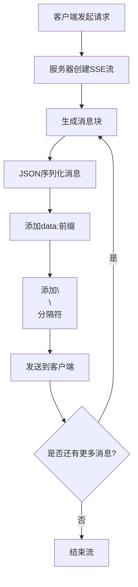
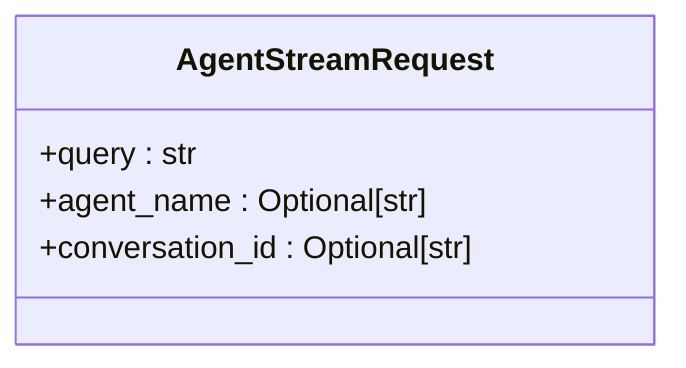
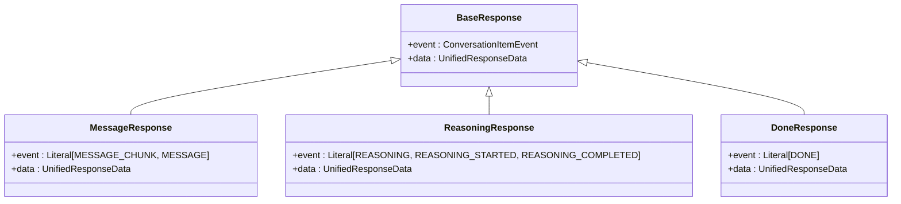
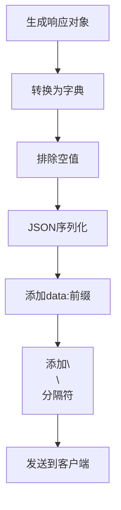

# 消息协议

<cite>
**本文档引用的文件**   
- [agent_stream.py](file://python/valuecell/server/api/routers/agent_stream.py)
- [agent_stream.py](file://python/valuecell/server/api/schemas/agent_stream.py)
- [agent_stream_service.py](file://python/valuecell/server/services/agent_stream_service.py)
- [factory.py](file://python/valuecell/core/event/factory.py)
- [types.py](file://python/valuecell/core/types.py)
- [use-sse.ts](file://frontend/src/hooks/use-sse.ts)
- [common-agent-area.tsx](file://frontend/src/app/agent/components/agent-view/common-agent-area.tsx)
</cite>

## 目录
1. [引言](#引言)
2. [SSE数据包结构](#sse数据包结构)
3. [AgentStreamRequest请求模型](#agentstreamrequest请求模型)
4. [BaseResponse基类与消息传输](#baseresponse基类与消息传输)
5. [消息编码/解码实现细节](#消息编码解码实现细节)
6. [实际消息示例](#实际消息示例)
7. [结论](#结论)

## 引言
本文档深入解析ValueCell系统中流式通信的消息格式和数据序列化协议。重点分析基于Server-Sent Events (SSE)的实时消息传输机制，涵盖从客户端请求到服务器响应的完整流程。文档详细描述了SSE数据包的结构、AgentStreamRequest请求模型的字段定义、BaseResponse基类在消息传输中的作用，以及消息编码/解码的实现细节。通过具体示例展示从服务器到客户端的完整消息流，为开发者提供全面的消息协议参考。

## SSE数据包结构

ValueCell系统采用Server-Sent Events (SSE)协议实现服务器到客户端的实时流式通信。SSE是一种基于HTTP的单向通信协议，允许服务器向客户端推送实时更新。在ValueCell中，SSE被用于传输代理（Agent）的流式响应，确保用户能够实时接收处理结果。

SSE数据包遵循特定的格式规范，每个数据包由一个或多个字段组成，以换行符分隔。在ValueCell实现中，关键的数据包结构如下：

- **data字段**：这是SSE协议的核心字段，用于携带实际的消息内容。在ValueCell中，所有从服务器发送到客户端的消息都通过`data:`前缀标识。例如，`data: {"event": "message_chunk", "data": {...}}`表示一个包含JSON序列化消息内容的数据包。
- **换行符分隔**：每个SSE数据包以两个换行符`\n\n`结尾，这是SSE协议的标准分隔符，用于标识一个完整消息的结束。这种设计使得客户端能够准确地解析和处理连续的消息流。
- **JSON序列化格式**：`data`字段的内容采用JSON格式进行序列化，确保消息的结构化和可读性。JSON格式不仅便于解析，还能有效支持复杂的数据结构，如嵌套对象和数组。

在服务器端，`agent_stream.py`文件中的`generate_stream`函数负责生成SSE格式的流式响应。该函数通过`yield f"data: {json.dumps(chunk)}\n\n"`语句将每个消息块转换为符合SSE规范的数据包。这种方式确保了消息的实时性和连续性，同时保持了协议的简洁性和高效性。



**Diagram sources**
- [agent_stream.py](file://python/valuecell/server/api/routers/agent_stream.py#L41-L50)

**Section sources**
- [agent_stream.py](file://python/valuecell/server/api/routers/agent_stream.py#L41-L58)

## AgentStreamRequest请求模型

`AgentStreamRequest`是客户端向服务器发送流式查询请求的核心数据模型。该模型定义了客户端与代理进行交互所需的所有必要参数，确保请求的完整性和可追溯性。

`AgentStreamRequest`模型包含以下关键字段：

- **query**：必填字段，表示用户向代理发送的查询内容。这是请求的核心，包含了用户希望代理处理的具体问题或指令。
- **agent_name**：可选字段，用于指定处理查询的特定代理名称。如果提供此字段，系统将优先使用指定的代理；否则，系统将根据查询内容自动选择合适的代理。
- **conversation_id**：可选字段，用于跟踪对话上下文的唯一标识符。通过维护对话ID，系统能够保持多轮对话的连贯性，确保代理能够基于之前的交互历史生成响应。

该模型通过Pydantic库实现数据验证和序列化，确保请求数据的完整性和正确性。例如，`query`字段被标记为必填（`...`），系统在接收到请求时会自动验证该字段是否存在且非空。此外，模型还提供了JSON Schema示例，帮助开发者理解和使用该请求模型。

在实际应用中，`AgentStreamRequest`模型被用于构建POST请求的请求体。客户端通过将用户输入封装为`AgentStreamRequest`对象，并将其序列化为JSON格式，发送到服务器的`/agents/stream`端点。服务器接收到请求后，解析`AgentStreamRequest`对象，并启动相应的流式处理流程。



**Diagram sources**
- [agent_stream.py](file://python/valuecell/server/api/schemas/agent_stream.py#L10-L27)

**Section sources**
- [agent_stream.py](file://python/valuecell/server/api/schemas/agent_stream.py#L10-L40)

## BaseResponse基类与消息传输

`BaseResponse`是ValueCell系统中所有响应消息的基类，定义了消息传输的通用结构和行为。作为所有具体响应类型的父类，`BaseResponse`确保了消息格式的一致性和可扩展性。

`BaseResponse`基类包含两个核心属性：

- **event**：表示响应事件的类型，是一个枚举值，用于区分不同类型的消息。例如，`message_chunk`表示消息块，`reasoning`表示推理过程，`done`表示处理完成。通过事件类型，客户端能够准确地识别和处理不同类型的响应。
- **data**：包含响应的具体数据负载，类型为`UnifiedResponseData`。该字段封装了消息的所有相关信息，包括对话ID、线程ID、任务ID、角色、内容等，确保消息的完整性和上下文信息的传递。

在ValueCell系统中，`BaseResponse`的子类（如`MessageResponse`、`ReasoningResponse`、`DoneResponse`等）继承并扩展了基类的功能，以满足不同场景下的需求。例如，`MessageResponse`专门用于传输消息内容，而`ReasoningResponse`则用于传输代理的推理过程。

`BaseResponse`基类在消息传输中扮演着至关重要的角色。首先，它提供了一种统一的消息格式，使得客户端能够以一致的方式处理各种类型的响应。其次，通过继承机制，系统能够轻松地添加新的响应类型，而无需修改现有的消息处理逻辑。最后，`BaseResponse`与SSE协议紧密结合，确保了消息的实时性和可靠性。



**Diagram sources**
- [types.py](file://python/valuecell/core/types.py#L309-L400)
- [factory.py](file://python/valuecell/core/event/factory.py#L460-L512)

**Section sources**
- [types.py](file://python/valuecell/core/types.py#L309-L400)

## 消息编码/解码实现细节

ValueCell系统在消息编码和解码方面采用了多种技术，以确保消息的高效传输和正确解析。这些技术涵盖了从数据序列化到特殊字符处理的各个方面，确保了系统的稳定性和可靠性。

### 消息编码
在服务器端，消息编码主要通过JSON序列化实现。`agent_stream_service.py`文件中的`stream_query_agent`方法负责生成流式响应。该方法通过`yield response_chunk.model_dump(exclude_none=True)`语句将响应对象转换为字典，并排除空值，然后通过`json.dumps`将其序列化为JSON字符串。这种方式不仅保证了消息的紧凑性，还避免了不必要的数据传输。

### 特殊字符处理
在处理特殊字符时，系统依赖于JSON序列化的内置机制。JSON标准本身支持Unicode字符，因此任何包含特殊字符的文本都能被正确地编码和传输。此外，系统在生成SSE数据包时，通过`f"data: {json.dumps(chunk)}\n\n"`确保了数据的正确格式化，避免了因特殊字符导致的解析错误。

### 二进制数据处理
虽然ValueCell系统主要处理文本数据，但在需要传输二进制数据时，系统通常采用Base64编码。Base64编码将二进制数据转换为ASCII字符串，使其能够安全地嵌入JSON消息中。接收方在解码时，首先将Base64字符串解码为二进制数据，然后进行进一步处理。

### 大消息分块传输
对于大消息的传输，ValueCell系统采用分块传输策略。代理在处理用户查询时，会将响应内容分割为多个小块，并通过`streaming.message_chunk()`方法逐个发送。每个消息块作为一个独立的SSE数据包发送，客户端在接收到所有块后，将其重新组合为完整的消息。这种策略不仅提高了传输效率，还改善了用户体验，使用户能够实时看到处理进度。



**Diagram sources**
- [agent_stream_service.py](file://python/valuecell/server/services/agent_stream_service.py#L88-L91)
- [agent_stream.py](file://python/valuecell/server/api/routers/agent_stream.py#L48-L50)

**Section sources**
- [agent_stream_service.py](file://python/valuecell/server/services/agent_stream_service.py#L54-L96)
- [factory.py](file://python/valuecell/core/event/factory.py#L460-L512)

## 实际消息示例

以下是一个从服务器到客户端的完整消息流示例，展示了SSE协议在ValueCell系统中的实际应用。

### 客户端请求
客户端通过POST请求向`/agents/stream`端点发送`AgentStreamRequest`对象：
```json
{
  "query": "What is the current market trend?",
  "agent_name": "MarketAnalystAgent",
  "conversation_id": "conv-123"
}
```

### 服务器响应流
服务器接收到请求后，开始生成SSE格式的流式响应：
```
data: {"event": "thread_started", "data": {"conversation_id": "conv-123", "thread_id": "thread-456", "task_id": "task-789", "payload": {"content": "What is the current market trend?"}, "role": "user"}}
data: {"event": "message_chunk", "data": {"conversation_id": "conv-123", "thread_id": "thread-456", "task_id": "task-789", "payload": {"content": "Analyzing market data..."}, "role": "agent"}}
data: {"event": "message_chunk", "data": {"conversation_id": "conv-123", "thread_id": "thread-456", "task_id": "task-789", "payload": {"content": "The current market shows a bullish trend with strong buying pressure."}, "role": "agent"}}
data: {"event": "done", "data": {"conversation_id": "conv-123", "thread_id": "thread-456", "role": "system"}}
```

### 客户端处理
客户端通过`use-sse.ts`中的`useSSE`钩子函数接收并处理这些消息。每当接收到新的数据包时，`onData`回调函数被触发，将消息内容更新到用户界面。例如，当接收到`message_chunk`事件时，客户端将消息内容追加到聊天窗口；当接收到`done`事件时，客户端关闭SSE连接，表示对话结束。

这个示例展示了从客户端请求到服务器响应再到客户端处理的完整流程，体现了SSE协议在实时通信中的优势。

**Section sources**
- [common-agent-area.tsx](file://frontend/src/app/agent/components/agent-view/common-agent-area.tsx#L144-L163)
- [use-sse.ts](file://frontend/src/hooks/use-sse.ts#L54-L56)

## 结论
本文档全面解析了ValueCell系统中流式通信的消息格式和数据序列化协议。通过深入分析SSE数据包结构、AgentStreamRequest请求模型、BaseResponse基类以及消息编码/解码的实现细节，我们揭示了系统如何实现高效、可靠的实时通信。SSE协议的使用确保了消息的实时性和连续性，而JSON序列化和分块传输策略则保证了消息的结构化和高效传输。这些技术的结合，为用户提供了一个流畅、响应迅速的交互体验。未来，随着系统的发展，这些消息协议将继续演进，以支持更复杂的应用场景和更高的性能要求。