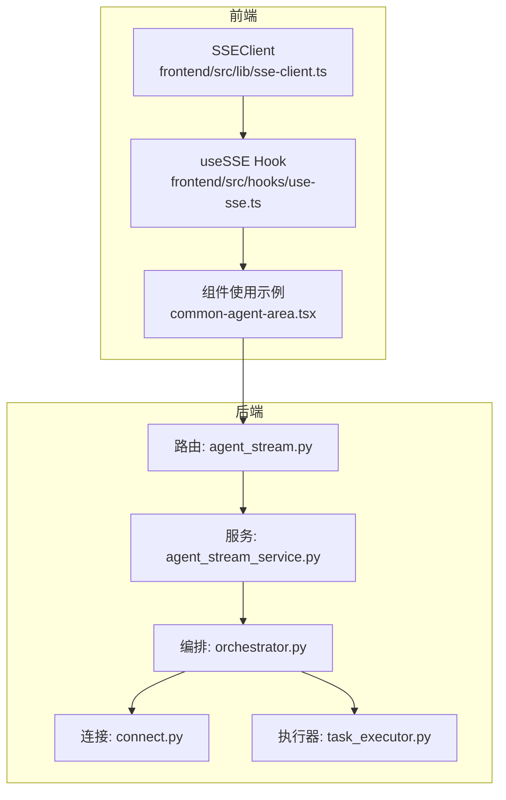
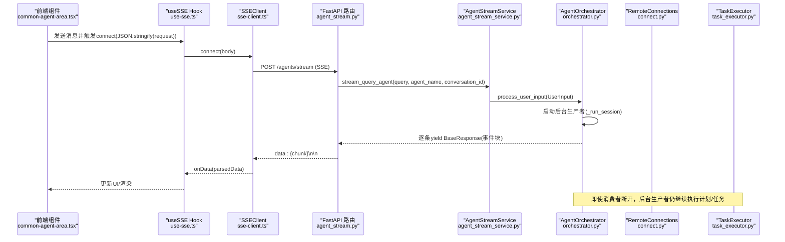
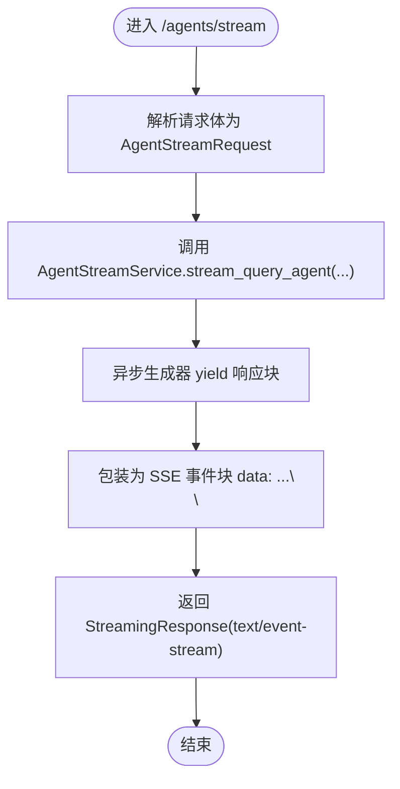
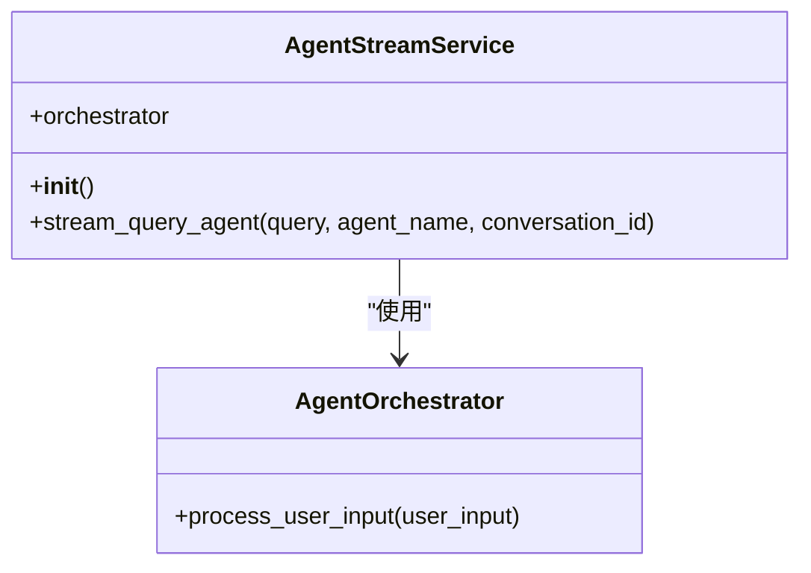
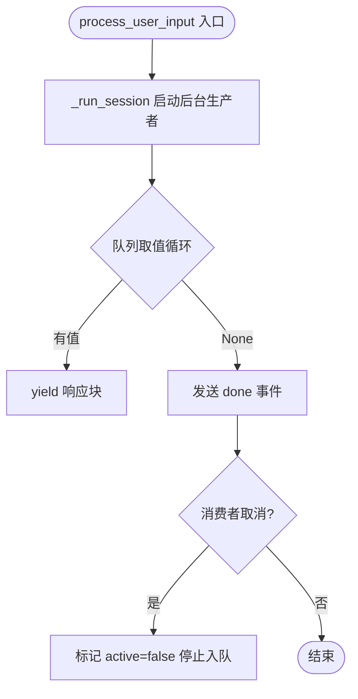
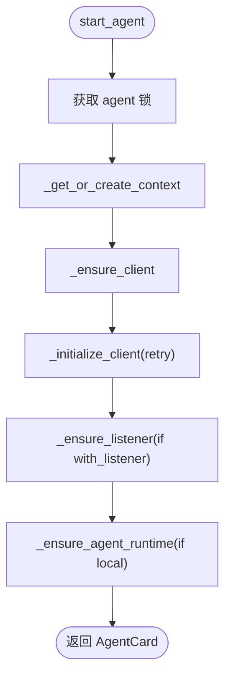
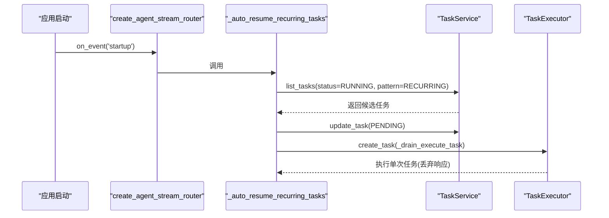
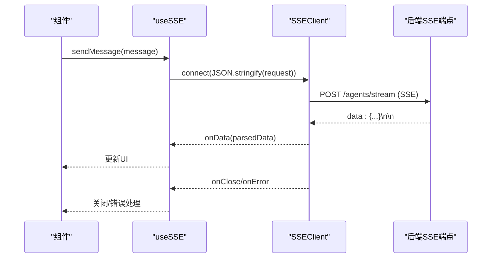
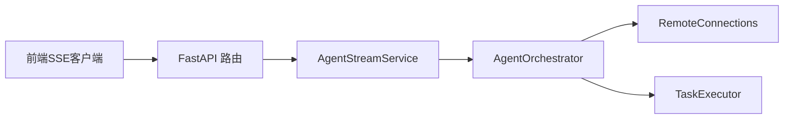

# 连接管理

<cite>
**本文引用的文件**
- [python/valuecell/server/api/routers/agent_stream.py](file://python/valuecell/server/api/routers/agent_stream.py)
- [python/valuecell/server/api/schemas/agent_stream.py](file://python/valuecell/server/api/schemas/agent_stream.py)
- [python/valuecell/server/services/agent_stream_service.py](file://python/valuecell/server/services/agent_stream_service.py)
- [python/valuecell/core/coordinate/orchestrator.py](file://python/valuecell/core/coordinate/orchestrator.py)
- [python/valuecell/core/agent/connect.py](file://python/valuecell/core/agent/connect.py)
- [python/valuecell/core/task/executor.py](file://python/valuecell/core/task/executor.py)
- [frontend/src/lib/sse-client.ts](file://frontend/src/lib/sse-client.ts)
- [frontend/src/hooks/use-sse.ts](file://frontend/src/hooks/use-sse.ts)
- [frontend/src/app/agent/components/agent-view/common-agent-area.tsx](file://frontend/src/app/agent/components/agent-view/common-agent-area.tsx)
</cite>

## 目录
1. [引言](#引言)
2. [项目结构](#项目结构)
3. [核心组件](#核心组件)
4. [架构总览](#架构总览)
5. [详细组件分析](#详细组件分析)
6. [依赖关系分析](#依赖关系分析)
7. [性能考量](#性能考量)
8. [故障排查指南](#故障排查指南)
9. [结论](#结论)

## 引言
本文件聚焦于系统中的流式API连接建立与管理机制，重点覆盖：
- WebSocket与SSE（Server-Sent Events）的连接初始化流程
- 后端路由与服务层如何协作完成流式响应
- 客户端如何通过SSE维持持久连接
- 认证、超时、断线重连策略与并发连接管理
- 服务启动时“自动恢复周期性任务”的机制

说明：当前后端采用SSE作为流式传输协议；未发现WebSocket实现。本文将围绕SSE进行深入解析，并对WebSocket与SSE的差异进行概念性说明，帮助读者理解两种协议在本系统中的适用场景与取舍。

## 项目结构
与流式连接管理直接相关的模块分布如下：
- 后端路由与服务
  - 路由器：python/valuecell/server/api/routers/agent_stream.py
  - 服务：python/valuecell/server/services/agent_stream_service.py
  - 核心编排：python/valuecell/core/coordinate/orchestrator.py
  - 远程代理连接：python/valuecell/core/agent/connect.py
  - 任务执行器：python/valuecell/core/task/executor.py
- 前端SSE客户端
  - SSE客户端封装：frontend/src/lib/sse-client.ts
  - React Hook：frontend/src/hooks/use-sse.ts
  - 使用示例：frontend/src/app/agent/components/agent-view/common-agent-area.tsx

图表来源
- [python/valuecell/server/api/routers/agent_stream.py](file://python/valuecell/server/api/routers/agent_stream.py#L1-L64)
- [python/valuecell/server/services/agent_stream_service.py](file://python/valuecell/server/services/agent_stream_service.py#L1-L153)
- [python/valuecell/core/coordinate/orchestrator.py](file://python/valuecell/core/coordinate/orchestrator.py#L1-L200)
- [python/valuecell/core/agent/connect.py](file://python/valuecell/core/agent/connect.py#L1-L120)
- [python/valuecell/core/task/executor.py](file://python/valuecell/core/task/executor.py#L1-L120)
- [frontend/src/lib/sse-client.ts](file://frontend/src/lib/sse-client.ts#L1-L120)
- [frontend/src/hooks/use-sse.ts](file://frontend/src/hooks/use-sse.ts#L1-L91)
- [frontend/src/app/agent/components/agent-view/common-agent-area.tsx](file://frontend/src/app/agent/components/agent-view/common-agent-area.tsx#L123-L171)

章节来源
- [python/valuecell/server/api/routers/agent_stream.py](file://python/valuecell/server/api/routers/agent_stream.py#L1-L64)
- [python/valuecell/server/services/agent_stream_service.py](file://python/valuecell/server/services/agent_stream_service.py#L1-L153)
- [python/valuecell/core/coordinate/orchestrator.py](file://python/valuecell/core/coordinate/orchestrator.py#L1-L200)
- [python/valuecell/core/agent/connect.py](file://python/valuecell/core/agent/connect.py#L1-L120)
- [python/valuecell/core/task/executor.py](file://python/valuecell/core/task/executor.py#L1-L120)
- [frontend/src/lib/sse-client.ts](file://frontend/src/lib/sse-client.ts#L1-L120)
- [frontend/src/hooks/use-sse.ts](file://frontend/src/hooks/use-sse.ts#L1-L91)
- [frontend/src/app/agent/components/agent-view/common-agent-area.tsx](file://frontend/src/app/agent/components/agent-view/common-agent-area.tsx#L123-L171)

## 核心组件
- 路由器与端点
  - create_agent_stream_router：创建/注册“/agents/stream”端点，返回SSE流
  - stream_query_agent：接收AgentStreamRequest，调用服务层生成SSE事件块
- 服务层
  - AgentStreamService：负责预加载本地代理类、构造UserInput并交由AgentOrchestrator流式产出
- 编排器
  - AgentOrchestrator.process_user_input：后台生产者+队列消费模型，支持消费者断开后后台继续执行
- 连接管理
  - RemoteConnections：统一管理远程代理连接、监听器、客户端生命周期与并发控制
- 执行器
  - TaskExecutor：执行计划与任务，支持周期性任务调度与轮询
- 前端SSE客户端
  - SSEClient：基于fetch + ReadableStream的SSE客户端，支持超时、错误处理、状态变化回调
  - useSSE：React Hook封装，暴露connect/close/isStreaming等能力

章节来源
- [python/valuecell/server/api/routers/agent_stream.py](file://python/valuecell/server/api/routers/agent_stream.py#L1-L64)
- [python/valuecell/server/api/schemas/agent_stream.py](file://python/valuecell/server/api/schemas/agent_stream.py#L1-L40)
- [python/valuecell/server/services/agent_stream_service.py](file://python/valuecell/server/services/agent_stream_service.py#L1-L153)
- [python/valuecell/core/coordinate/orchestrator.py](file://python/valuecell/core/coordinate/orchestrator.py#L90-L175)
- [python/valuecell/core/agent/connect.py](file://python/valuecell/core/agent/connect.py#L200-L340)
- [python/valuecell/core/task/executor.py](file://python/valuecell/core/task/executor.py#L1-L120)
- [frontend/src/lib/sse-client.ts](file://frontend/src/lib/sse-client.ts#L1-L120)
- [frontend/src/hooks/use-sse.ts](file://frontend/src/hooks/use-sse.ts#L1-L91)

## 架构总览
下图展示了从客户端发起SSE请求到服务端流式输出的完整链路，以及后台任务在消费者断开后的独立执行行为。

图表来源
- [python/valuecell/server/api/routers/agent_stream.py](file://python/valuecell/server/api/routers/agent_stream.py#L31-L63)
- [python/valuecell/server/services/agent_stream_service.py](file://python/valuecell/server/services/agent_stream_service.py#L54-L96)
- [python/valuecell/core/coordinate/orchestrator.py](file://python/valuecell/core/coordinate/orchestrator.py#L98-L175)
- [python/valuecell/core/agent/connect.py](file://python/valuecell/core/agent/connect.py#L338-L420)
- [python/valuecell/core/task/executor.py](file://python/valuecell/core/task/executor.py#L112-L200)
- [frontend/src/lib/sse-client.ts](file://frontend/src/lib/sse-client.ts#L70-L120)
- [frontend/src/hooks/use-sse.ts](file://frontend/src/hooks/use-sse.ts#L29-L89)
- [frontend/src/app/agent/components/agent-view/common-agent-area.tsx](file://frontend/src/app/agent/components/agent-view/common-agent-area.tsx#L144-L167)

## 详细组件分析

### 路由器与端点：create_agent_stream_router 与 stream_query_agent
- 路由器职责
  - 注册前缀为“/agents”的路由组，标签为“Agent Stream”
  - 在应用启动事件中调用“自动恢复周期性任务”逻辑
  - 提供POST端点“/agents/stream”，用于实时流式返回SSE事件
- 端点处理流程
  - 接收AgentStreamRequest（包含query、agent_name、conversation_id）
  - 通过AgentStreamService.stream_query_agent获取异步生成器
  - 将每个响应块格式化为SSE事件行“data: …\n\n”，并设置媒体类型为“text/event-stream”
  - 设置必要的HTTP头以保持连接与禁用缓存
  - 异常时抛出HTTP 500

图表来源
- [python/valuecell/server/api/routers/agent_stream.py](file://python/valuecell/server/api/routers/agent_stream.py#L31-L63)
- [python/valuecell/server/api/schemas/agent_stream.py](file://python/valuecell/server/api/schemas/agent_stream.py#L10-L39)
- [python/valuecell/server/services/agent_stream_service.py](file://python/valuecell/server/services/agent_stream_service.py#L54-L96)

章节来源
- [python/valuecell/server/api/routers/agent_stream.py](file://python/valuecell/server/api/routers/agent_stream.py#L18-L63)
- [python/valuecell/server/api/schemas/agent_stream.py](file://python/valuecell/server/api/schemas/agent_stream.py#L10-L39)

### 服务层：AgentStreamService
- 初始化与预加载
  - 在构造函数中调用“预加载本地代理类”以避免Windows导入锁死
  - 初始化AgentOrchestrator实例
- 流式查询
  - 生成conversation_id（若未提供）
  - 组装UserInput（含user_id、conversation_id、target_agent_name）
  - 通过AgentOrchestrator.process_user_input获取异步响应流
  - 将每个响应块序列化为JSON并yield给上层路由

图表来源
- [python/valuecell/server/services/agent_stream_service.py](file://python/valuecell/server/services/agent_stream_service.py#L42-L96)
- [python/valuecell/core/coordinate/orchestrator.py](file://python/valuecell/core/coordinate/orchestrator.py#L98-L120)

章节来源
- [python/valuecell/server/services/agent_stream_service.py](file://python/valuecell/server/services/agent_stream_service.py#L1-L153)

### 编排器：AgentOrchestrator
- 流式处理模型
  - 使用后台任务运行会话（_run_session），将响应写入队列
  - 消费者断开时，标记active=false，停止向队列写入，但不取消后台任务
  - 最终发送“done”事件，保证客户端收到结束信号
- 会话生命周期
  - 新请求：创建线程、触发规划/执行阶段
  - 中断续跑：当conversation处于REQUIRE_USER_INPUT时，验证上下文并恢复
- 上下文过期清理
  - 默认上下文TTL为1小时，定期扫描并清理过期上下文

图表来源
- [python/valuecell/core/coordinate/orchestrator.py](file://python/valuecell/core/coordinate/orchestrator.py#L98-L175)
- [python/valuecell/core/coordinate/orchestrator.py](file://python/valuecell/core/coordinate/orchestrator.py#L176-L226)

章节来源
- [python/valuecell/core/coordinate/orchestrator.py](file://python/valuecell/core/coordinate/orchestrator.py#L1-L200)

### 连接管理：RemoteConnections
- 并发控制
  - 为每个agent_name维护独立的asyncio.Lock，确保同一agent的并发启动只初始化一次
- 客户端生命周期
  - _ensure_client：根据URL创建AgentClient并初始化，支持本地代理的重试与延迟退避
  - _ensure_listener：按需启动通知监听器（如支持推送通知）
  - _ensure_agent_runtime：在需要时启动本地代理进程（in-process）
- 资源清理
  - stop_agent/_cleanup_agent：关闭客户端、取消监听器任务、清理代理实例
- 可用代理枚举
  - list_running_agents/list_available_agents：基于本地配置卡片动态加载

图表来源
- [python/valuecell/core/agent/connect.py](file://python/valuecell/core/agent/connect.py#L338-L420)
- [python/valuecell/core/agent/connect.py](file://python/valuecell/core/agent/connect.py#L472-L498)
- [python/valuecell/core/agent/connect.py](file://python/valuecell/core/agent/connect.py#L590-L622)

章节来源
- [python/valuecell/core/agent/connect.py](file://python/valuecell/core/agent/connect.py#L200-L340)
- [python/valuecell/core/agent/connect.py](file://python/valuecell/core/agent/connect.py#L338-L420)
- [python/valuecell/core/agent/connect.py](file://python/valuecell/core/agent/connect.py#L472-L498)
- [python/valuecell/core/agent/connect.py](file://python/valuecell/core/agent/connect.py#L590-L622)

### 任务执行与自动恢复：周期性任务
- 自动恢复入口
  - 路由器startup事件中调用_auto_resume_recurring_tasks
  - 遍历RUNNING且模式为RECURRING的任务，将其状态重置为PENDING并重新调度
- 恢复执行
  - 通过TaskExecutor.execute_task以“resumed=True”方式执行单次任务运行
  - 仅消费响应而不持久化，确保后台任务继续按计划周期性执行

图表来源
- [python/valuecell/server/api/routers/agent_stream.py](file://python/valuecell/server/api/routers/agent_stream.py#L24-L30)
- [python/valuecell/server/services/agent_stream_service.py](file://python/valuecell/server/services/agent_stream_service.py#L98-L153)
- [python/valuecell/core/task/executor.py](file://python/valuecell/core/task/executor.py#L279-L303)

章节来源
- [python/valuecell/server/api/routers/agent_stream.py](file://python/valuecell/server/api/routers/agent_stream.py#L24-L30)
- [python/valuecell/server/services/agent_stream_service.py](file://python/valuecell/server/services/agent_stream_service.py#L98-L153)
- [python/valuecell/core/task/executor.py](file://python/valuecell/core/task/executor.py#L279-L303)

### 前端SSE客户端：SSEClient 与 useSSE
- SSEClient
  - connect：发起POST请求，设置Accept为text/event-stream，携带JSON请求体
  - readStream：基于ReadableStream读取字节流，按“data: …\n\n”分隔事件块
  - processEvent：提取data字段并尝试解析JSON，透传给onData
  - 支持超时（默认30秒）、AbortController中断、状态变化回调
- useSSE
  - 封装SSEClient，暴露connect/close/isStreaming
  - 通过onStateChange将OPEN/CONNECTING映射为isStreaming=true

图表来源
- [frontend/src/lib/sse-client.ts](file://frontend/src/lib/sse-client.ts#L70-L120)
- [frontend/src/lib/sse-client.ts](file://frontend/src/lib/sse-client.ts#L153-L224)
- [frontend/src/hooks/use-sse.ts](file://frontend/src/hooks/use-sse.ts#L29-L89)
- [frontend/src/app/agent/components/agent-view/common-agent-area.tsx](file://frontend/src/app/agent/components/agent-view/common-agent-area.tsx#L144-L167)

章节来源
- [frontend/src/lib/sse-client.ts](file://frontend/src/lib/sse-client.ts#L1-L257)
- [frontend/src/hooks/use-sse.ts](file://frontend/src/hooks/use-sse.ts#L1-L91)
- [frontend/src/app/agent/components/agent-view/common-agent-area.tsx](file://frontend/src/app/agent/components/agent-view/common-agent-area.tsx#L123-L171)

## 依赖关系分析
- 路由器依赖服务层；服务层依赖编排器；编排器依赖连接管理与任务执行器
- 前端SSE客户端与useSSE Hook解耦于后端实现，通过标准SSE协议交互
- RemoteConnections在启动阶段进行本地代理类预加载，避免Windows导入锁问题

图表来源
- [python/valuecell/server/api/routers/agent_stream.py](file://python/valuecell/server/api/routers/agent_stream.py#L18-L63)
- [python/valuecell/server/services/agent_stream_service.py](file://python/valuecell/server/services/agent_stream_service.py#L42-L96)
- [python/valuecell/core/coordinate/orchestrator.py](file://python/valuecell/core/coordinate/orchestrator.py#L68-L120)
- [python/valuecell/core/agent/connect.py](file://python/valuecell/core/agent/connect.py#L200-L340)
- [python/valuecell/core/task/executor.py](file://python/valuecell/core/task/executor.py#L112-L200)
- [frontend/src/lib/sse-client.ts](file://frontend/src/lib/sse-client.ts#L70-L120)

章节来源
- [python/valuecell/server/api/routers/agent_stream.py](file://python/valuecell/server/api/routers/agent_stream.py#L18-L63)
- [python/valuecell/server/services/agent_stream_service.py](file://python/valuecell/server/services/agent_stream_service.py#L42-L96)
- [python/valuecell/core/coordinate/orchestrator.py](file://python/valuecell/core/coordinate/orchestrator.py#L68-L120)
- [python/valuecell/core/agent/connect.py](file://python/valuecell/core/agent/connect.py#L200-L340)
- [python/valuecell/core/task/executor.py](file://python/valuecell/core/task/executor.py#L112-L200)
- [frontend/src/lib/sse-client.ts](file://frontend/src/lib/sse-client.ts#L70-L120)

## 性能考量
- 队列与后台生产者
  - 使用asyncio.Queue承载响应，消费者断开后停止入队，后台任务继续执行，避免阻塞
- 导入锁与预加载
  - 服务启动前预加载本地代理类，避免Windows线程池与事件循环竞争导致的死锁
- 连接初始化重试
  - 本地代理客户端初始化支持最多3次重试，指数退避上限1秒，提升启动稳定性
- 任务调度轮询
  - 周期性任务通过轮询与睡眠实现，支持在每次迭代中检查任务是否已完成或被取消

章节来源
- [python/valuecell/core/coordinate/orchestrator.py](file://python/valuecell/core/coordinate/orchestrator.py#L98-L175)
- [python/valuecell/server/services/agent_stream_service.py](file://python/valuecell/server/services/agent_stream_service.py#L22-L40)
- [python/valuecell/core/agent/connect.py](file://python/valuecell/core/agent/connect.py#L472-L498)
- [python/valuecell/core/task/executor.py](file://python/valuecell/core/task/executor.py#L445-L453)

## 故障排查指南
- SSE握手超时
  - 现象：onError回调收到“Handshake timeout”
  - 处理：检查后端SSE端点可达性、网络延迟、请求体格式；适当增大timeout
  - 参考：[frontend/src/lib/sse-client.ts](file://frontend/src/lib/sse-client.ts#L90-L118)
- SSE连接异常或提前关闭
  - 现象：onError或onClose被触发
  - 处理：确认后端路由/media type/headers正确；检查服务端异常日志
  - 参考：[python/valuecell/server/api/routers/agent_stream.py](file://python/valuecell/server/api/routers/agent_stream.py#L41-L63)
- 任务恢复失败
  - 现象：自动恢复日志显示“failed to schedule task …”
  - 处理：检查任务状态更新、TaskExecutor可用性与数据库连接；查看异常堆栈
  - 参考：[python/valuecell/server/services/agent_stream_service.py](file://python/valuecell/server/services/agent_stream_service.py#L119-L153)
- 代理连接冲突
  - 现象：并发启动同一agent出现重复初始化
  - 处理：确认已使用agent级锁；检查_remote_contexts_loaded状态
  - 参考：[python/valuecell/core/agent/connect.py](file://python/valuecell/core/agent/connect.py#L218-L225)

章节来源
- [frontend/src/lib/sse-client.ts](file://frontend/src/lib/sse-client.ts#L90-L151)
- [python/valuecell/server/api/routers/agent_stream.py](file://python/valuecell/server/api/routers/agent_stream.py#L41-L63)
- [python/valuecell/server/services/agent_stream_service.py](file://python/valuecell/server/services/agent_stream_service.py#L119-L153)
- [python/valuecell/core/agent/connect.py](file://python/valuecell/core/agent/connect.py#L218-L225)

## 结论
- 本系统采用SSE作为流式通信协议，通过FastAPI的StreamingResponse实现服务端事件推送
- 路由器负责端点注册与启动事件；服务层负责预加载与编排；编排器采用后台生产者+队列模型，确保消费者断开后任务仍可继续执行
- RemoteConnections提供代理连接、监听器与本地代理运行时的统一管理，并通过锁与重试保障稳定性
- 周期性任务在服务启动时自动恢复，通过TaskExecutor的单次执行与丢弃响应的方式维持长期调度
- 前端SSE客户端基于fetch + ReadableStream，具备超时、错误与状态管理能力，便于在React中集成