# 策略API

<cite>
**本文引用的文件**
- [python/valuecell/server/api/routers/strategy.py](file://python/valuecell/server/api/routers/strategy.py)
- [python/valuecell/server/api/routers/strategy_api.py](file://python/valuecell/server/api/routers/strategy_api.py)
- [python/valuecell/server/api/schemas/strategy.py](file://python/valuecell/server/api/schemas/strategy.py)
- [python/valuecell/server/services/strategy_service.py](file://python/valuecell/server/services/strategy_service.py)
- [python/valuecell/server/db/models/strategy.py](file://python/valuecell/server/db/models/strategy.py)
- [python/valuecell/server/db/models/strategy_prompt.py](file://python/valuecell/server/db/models/strategy_prompt.py)
- [python/valuecell/server/api/app.py](file://python/valuecell/server/api/app.py)
- [frontend/src/api/strategy.ts](file://frontend/src/api/strategy.ts)
- [frontend/src/types/strategy.ts](file://frontend/src/types/strategy.ts)
</cite>

## 目录
1. [简介](#简介)
2. [项目结构](#项目结构)
3. [核心组件](#核心组件)
4. [架构总览](#架构总览)
5. [详细组件分析](#详细组件分析)
6. [依赖关系分析](#依赖关系分析)
7. [性能与可用性考量](#性能与可用性考量)
8. [故障排查指南](#故障排查指南)
9. [结论](#结论)
10. [附录：端点与响应定义](#附录端点与响应定义)

## 简介
本文件面向交易策略管理API，系统化梳理策略全生命周期管理能力，包括：
- 获取策略列表与统计
- 性能数据与配置概览
- 持仓信息与组合摘要
- 交易明细与价格曲线
- 停止策略的POST请求
- 组合查询参数（user_id、status、name_filter）
- 策略类型（PROMPT/GRID）的自动推断逻辑

目标是帮助开发者与产品使用者快速理解端点、响应结构与业务语义，同时提供可视化图示与排障建议。

## 项目结构
后端采用FastAPI路由聚合策略，策略相关端点由统一入口注册；前端通过React Query封装常用查询与变更操作。

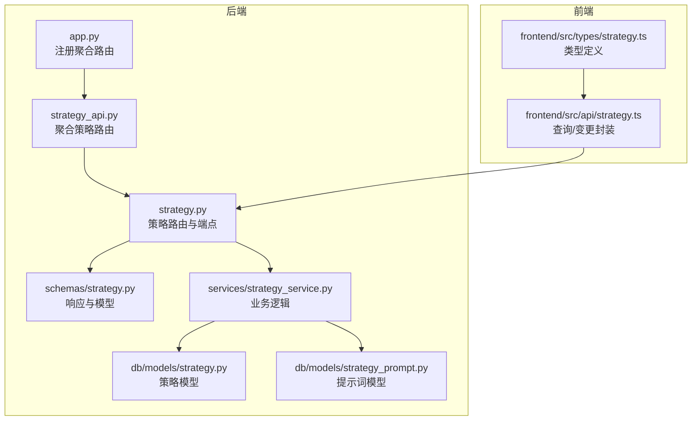

图表来源
- [python/valuecell/server/api/app.py](file://python/valuecell/server/api/app.py#L218-L241)
- [python/valuecell/server/api/routers/strategy_api.py](file://python/valuecell/server/api/routers/strategy_api.py#L1-L26)
- [python/valuecell/server/api/routers/strategy.py](file://python/valuecell/server/api/routers/strategy.py#L1-L60)
- [python/valuecell/server/api/schemas/strategy.py](file://python/valuecell/server/api/schemas/strategy.py#L1-L60)
- [python/valuecell/server/services/strategy_service.py](file://python/valuecell/server/services/strategy_service.py#L1-L40)
- [python/valuecell/server/db/models/strategy.py](file://python/valuecell/server/db/models/strategy.py#L1-L40)
- [python/valuecell/server/db/models/strategy_prompt.py](file://python/valuecell/server/db/models/strategy_prompt.py#L1-L30)
- [frontend/src/api/strategy.ts](file://frontend/src/api/strategy.ts#L1-L40)
- [frontend/src/types/strategy.ts](file://frontend/src/types/strategy.ts#L1-L40)

章节来源
- [python/valuecell/server/api/app.py](file://python/valuecell/server/api/app.py#L218-L241)
- [python/valuecell/server/api/routers/strategy_api.py](file://python/valuecell/server/api/routers/strategy_api.py#L1-L26)

## 核心组件
- 路由器与端点：统一在策略路由中定义列表、性能、持仓、摘要、明细、曲线、停止等端点。
- 响应模型：通过Pydantic模型定义各端点返回的数据结构，确保前后端契约一致。
- 服务层：封装数据聚合、类型推断、ROI计算、快照合并等业务逻辑。
- 数据模型：策略表与提示词表，承载策略配置、元数据与提示词内容。
- 前端封装：React Query钩子封装GET/POST请求，支持轮询刷新与缓存失效。

章节来源
- [python/valuecell/server/api/routers/strategy.py](file://python/valuecell/server/api/routers/strategy.py#L42-L211)
- [python/valuecell/server/api/schemas/strategy.py](file://python/valuecell/server/api/schemas/strategy.py#L14-L120)
- [python/valuecell/server/services/strategy_service.py](file://python/valuecell/server/services/strategy_service.py#L163-L301)
- [python/valuecell/server/db/models/strategy.py](file://python/valuecell/server/db/models/strategy.py#L15-L74)
- [python/valuecell/server/db/models/strategy_prompt.py](file://python/valuecell/server/db/models/strategy_prompt.py#L16-L48)
- [frontend/src/api/strategy.ts](file://frontend/src/api/strategy.ts#L1-L179)

## 架构总览
策略API采用“路由-服务-仓储-模型”的分层设计，前端通过HTTP调用后端端点，后端根据查询参数与业务规则返回标准化响应。

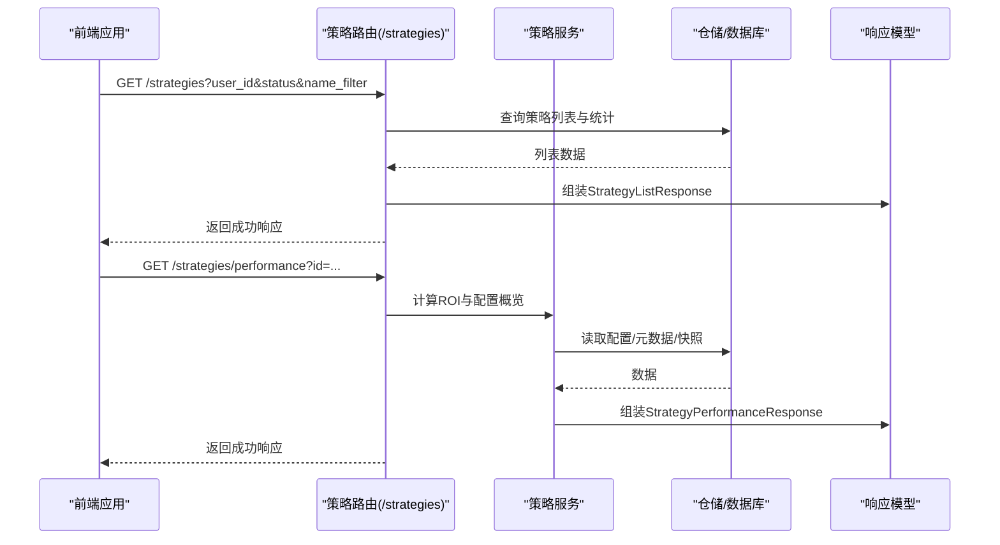

图表来源
- [python/valuecell/server/api/routers/strategy.py](file://python/valuecell/server/api/routers/strategy.py#L42-L211)
- [python/valuecell/server/services/strategy_service.py](file://python/valuecell/server/services/strategy_service.py#L200-L301)
- [python/valuecell/server/api/schemas/strategy.py](file://python/valuecell/server/api/schemas/strategy.py#L241-L276)

## 详细组件分析

### 策略列表与过滤
- 端点：GET /strategies
- 查询参数：
  - user_id：按所有者过滤
  - status：按运行状态过滤（running/stopped）
  - name_filter：模糊匹配名称或ID
- 返回：包含策略数组、总数、运行中数量的列表响应
- 处理流程：构建SQL查询，支持多条件组合；异常时返回500

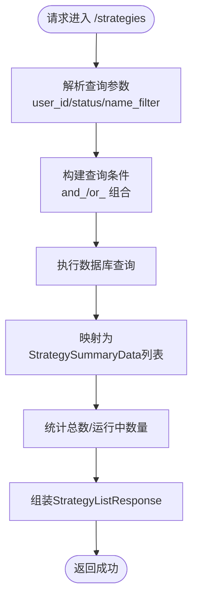

图表来源
- [python/valuecell/server/api/routers/strategy.py](file://python/valuecell/server/api/routers/strategy.py#L42-L211)
- [python/valuecell/server/api/schemas/strategy.py](file://python/valuecell/server/api/schemas/strategy.py#L19-L53)

章节来源
- [python/valuecell/server/api/routers/strategy.py](file://python/valuecell/server/api/routers/strategy.py#L42-L211)
- [python/valuecell/server/api/schemas/strategy.py](file://python/valuecell/server/api/schemas/strategy.py#L19-L53)

### 性能数据与配置概览
- 端点：GET /strategies/performance
- 参数：id（必填）
- 返回：StrategyPerformanceResponse，包含初始资金、回报率、模型提供商/模型ID、交易所、策略类型、交易模式、最大杠杆、标的池、最终提示词名称与文本等
- 计算逻辑：
  - ROI = (当前总资产 - 初始资金) / 初始资金 × 100%
  - 初始资金来源优先级：实盘元数据（initial_capital_live）> 首次快照现金 > 虚拟模式配置
  - 策略类型自动推断：优先从元数据/配置读取，其次从代理名关键词推断
  - 最终提示词严格从模板ID解析，不回退

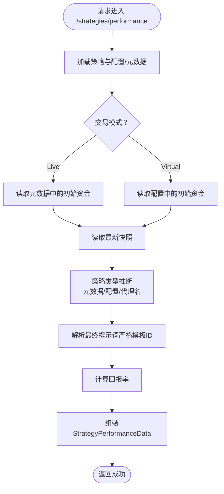

图表来源
- [python/valuecell/server/api/routers/strategy.py](file://python/valuecell/server/api/routers/strategy.py#L212-L249)
- [python/valuecell/server/services/strategy_service.py](file://python/valuecell/server/services/strategy_service.py#L200-L301)
- [python/valuecell/server/api/schemas/strategy.py](file://python/valuecell/server/api/schemas/strategy.py#L241-L276)

章节来源
- [python/valuecell/server/api/routers/strategy.py](file://python/valuecell/server/api/routers/strategy.py#L212-L249)
- [python/valuecell/server/services/strategy_service.py](file://python/valuecell/server/services/strategy_service.py#L200-L301)
- [python/valuecell/server/api/schemas/strategy.py](file://python/valuecell/server/api/schemas/strategy.py#L241-L276)

### 持仓信息（扁平化视图）
- 端点：GET /strategies/holding
- 参数：id（必填）
- 返回：StrategyHoldingFlatResponse，数组项包含标的、方向（LONG/SHORT）、杠杆、开仓均价、数量（绝对值）、未实现盈亏与百分比
- 处理流程：从最新持仓快照转换为扁平化条目；对空仓或无效数据进行跳过与容错

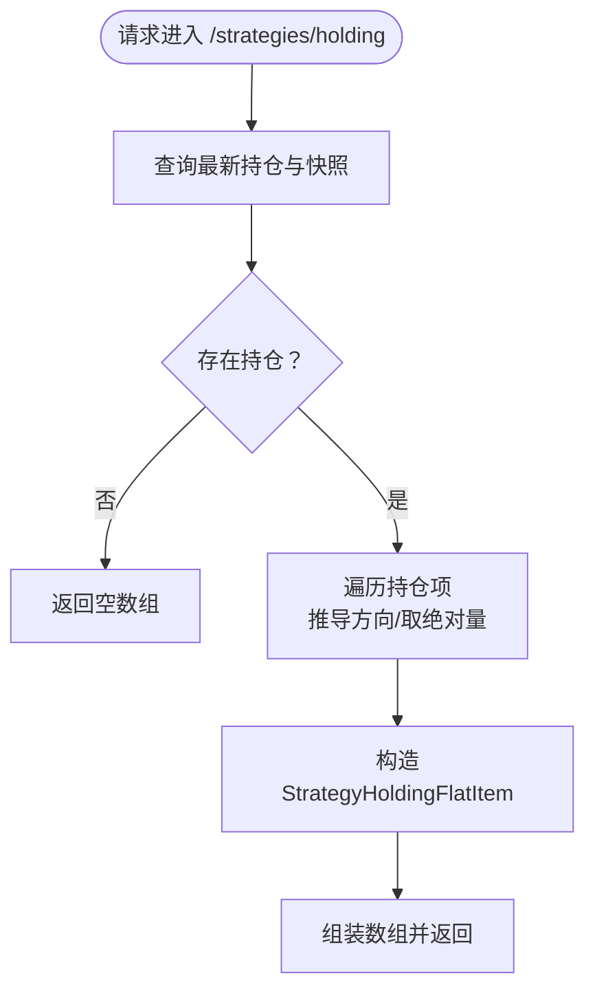

图表来源
- [python/valuecell/server/api/routers/strategy.py](file://python/valuecell/server/api/routers/strategy.py#L251-L296)
- [python/valuecell/server/api/schemas/strategy.py](file://python/valuecell/server/api/schemas/strategy.py#L187-L205)

章节来源
- [python/valuecell/server/api/routers/strategy.py](file://python/valuecell/server/api/routers/strategy.py#L251-L296)
- [python/valuecell/server/api/schemas/strategy.py](file://python/valuecell/server/api/schemas/strategy.py#L187-L205)

### 组合摘要
- 端点：GET /strategies/portfolio_summary
- 参数：id（必填）
- 返回：StrategyPortfolioSummaryResponse，包含时间戳、现金、总资产、总盈亏、总盈亏百分比、总杠杆暴露等
- 计算逻辑：基于最新快照与首次快照计算总盈亏与百分比；若无首次快照则按当前PnL推导

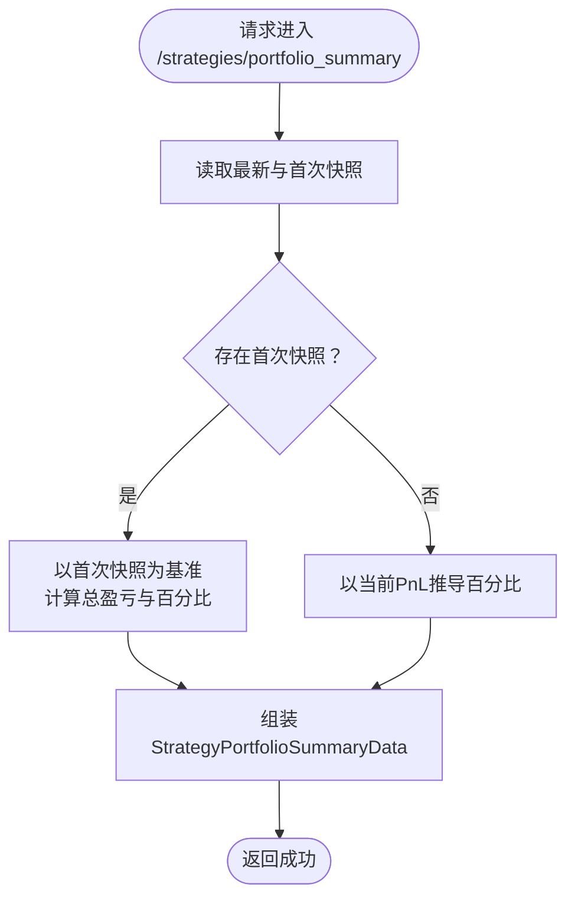

图表来源
- [python/valuecell/server/api/routers/strategy.py](file://python/valuecell/server/api/routers/strategy.py#L296-L329)
- [python/valuecell/server/services/strategy_service.py](file://python/valuecell/server/services/strategy_service.py#L107-L155)

章节来源
- [python/valuecell/server/api/routers/strategy.py](file://python/valuecell/server/api/routers/strategy.py#L296-L329)
- [python/valuecell/server/services/strategy_service.py](file://python/valuecell/server/services/strategy_service.py#L107-L155)

### 交易明细
- 端点：GET /strategies/detail
- 参数：id（必填）
- 返回：StrategyDetailResponse，按周期组织的行动卡片，包含指令ID、标的、动作、买卖方向、数量、杠杆、成交均价、入场/出场时间、持有时长、手续费、已实现盈亏与百分比、理由等
- 处理流程：查询周期、指令与执行细节，合并生成行动卡片

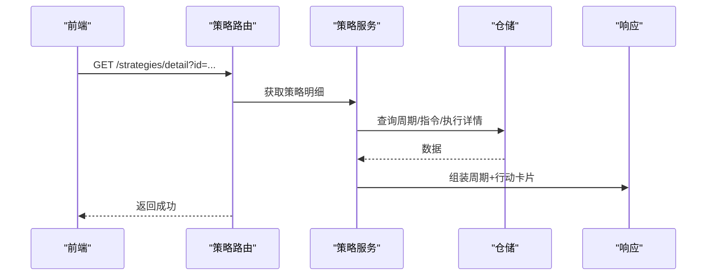

图表来源
- [python/valuecell/server/api/routers/strategy.py](file://python/valuecell/server/api/routers/strategy.py#L330-L357)
- [python/valuecell/server/services/strategy_service.py](file://python/valuecell/server/services/strategy_service.py#L303-L415)
- [python/valuecell/server/api/schemas/strategy.py](file://python/valuecell/server/api/schemas/strategy.py#L132-L185)

章节来源
- [python/valuecell/server/api/routers/strategy.py](file://python/valuecell/server/api/routers/strategy.py#L330-L357)
- [python/valuecell/server/services/strategy_service.py](file://python/valuecell/server/services/strategy_service.py#L303-L415)
- [python/valuecell/server/api/schemas/strategy.py](file://python/valuecell/server/api/schemas/strategy.py#L132-L185)

### 价格曲线（单策略/合并）
- 端点：GET /strategies/holding_price_curve
- 参数：
  - id（可选）：单策略曲线
  - limit（可选）：当未提供id时，限制返回策略数量（最晚创建优先）
- 返回：StrategyCurveResponse，二维数组，首行为列头（时间+策略名），后续行为按时间升序排列的净值序列（缺失值为null）
- 处理流程：单策略直接从快照聚合；合并模式构建时间轴并填充各策略序列

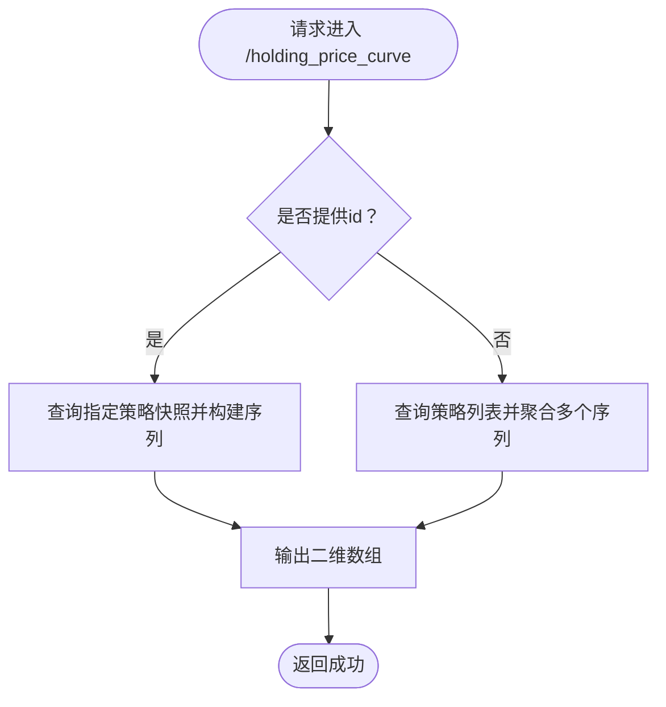

图表来源
- [python/valuecell/server/api/routers/strategy.py](file://python/valuecell/server/api/routers/strategy.py#L358-L486)

章节来源
- [python/valuecell/server/api/routers/strategy.py](file://python/valuecell/server/api/routers/strategy.py#L358-L486)

### 停止策略（POST）
- 端点：POST /strategies/stop
- 参数：id（必填，查询参数）
- 行为：将策略状态更新为stopped（幂等），返回状态更新响应
- 异常：未找到策略返回404，其他错误返回500

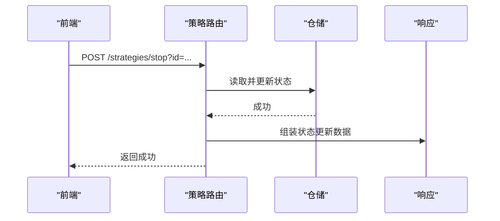

图表来源
- [python/valuecell/server/api/routers/strategy.py](file://python/valuecell/server/api/routers/strategy.py#L487-L524)

章节来源
- [python/valuecell/server/api/routers/strategy.py](file://python/valuecell/server/api/routers/strategy.py#L487-L524)

### 策略类型自动推断逻辑
- 推断顺序：
  1) 元数据中的strategy_type
  2) 配置中的trading_config.strategy_type
  3) 代理名关键词（包含prompt/grid）
  4) 若均不可得，返回None
- 支持的规范化输入（大小写/前缀/紧凑形式）：
  - 完整字符串："PromptBasedStrategy"/"GridStrategy"
  - 紧凑形式："promptbasedstrategy"/"gridstrategy"
  - 简写："prompt"/"grid"
  - 带前缀："StrategyType.PromptBasedStrategy"等

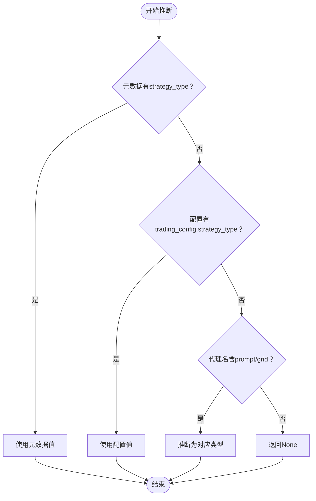

图表来源
- [python/valuecell/server/services/strategy_service.py](file://python/valuecell/server/services/strategy_service.py#L163-L198)

章节来源
- [python/valuecell/server/services/strategy_service.py](file://python/valuecell/server/services/strategy_service.py#L163-L198)

## 依赖关系分析
- 路由器依赖：FastAPI路由注册、数据库会话注入、服务层调用
- 服务层依赖：仓储接口（策略仓库）、数据库模型与提示词模型
- 前端依赖：HTTP客户端、React Query钩子、类型定义

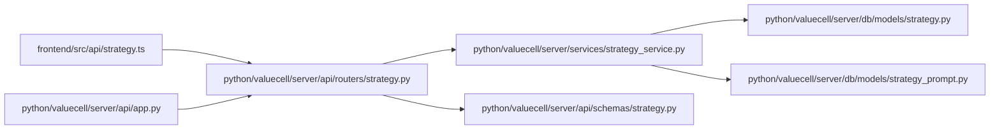

图表来源
- [python/valuecell/server/api/routers/strategy.py](file://python/valuecell/server/api/routers/strategy.py#L1-L60)
- [python/valuecell/server/services/strategy_service.py](file://python/valuecell/server/services/strategy_service.py#L1-L40)
- [python/valuecell/server/db/models/strategy.py](file://python/valuecell/server/db/models/strategy.py#L1-L40)
- [python/valuecell/server/db/models/strategy_prompt.py](file://python/valuecell/server/db/models/strategy_prompt.py#L1-L30)
- [python/valuecell/server/api/schemas/strategy.py](file://python/valuecell/server/api/schemas/strategy.py#L1-L40)
- [python/valuecell/server/api/app.py](file://python/valuecell/server/api/app.py#L218-L241)
- [frontend/src/api/strategy.ts](file://frontend/src/api/strategy.ts#L1-L40)

章节来源
- [python/valuecell/server/api/routers/strategy.py](file://python/valuecell/server/api/routers/strategy.py#L1-L60)
- [python/valuecell/server/services/strategy_service.py](file://python/valuecell/server/services/strategy_service.py#L1-L40)
- [python/valuecell/server/db/models/strategy.py](file://python/valuecell/server/db/models/strategy.py#L1-L40)
- [python/valuecell/server/db/models/strategy_prompt.py](file://python/valuecell/server/db/models/strategy_prompt.py#L1-L30)
- [python/valuecell/server/api/schemas/strategy.py](file://python/valuecell/server/api/schemas/strategy.py#L1-L40)
- [python/valuecell/server/api/app.py](file://python/valuecell/server/api/app.py#L218-L241)
- [frontend/src/api/strategy.ts](file://frontend/src/api/strategy.ts#L1-L40)

## 性能与可用性考量
- 列表查询支持多条件组合，建议在大数据量场景下配合索引与分页（当前端点未内置分页，需结合limit/offset或上层控制）
- 性能端点涉及多次快照与配置读取，建议缓存最近快照与配置热点数据
- 曲线端点在合并模式下可能产生大数组，建议前端按需limit并分页展示
- 停止策略为幂等操作，避免重复请求导致的副作用

[本节为通用指导，无需列出具体文件来源]

## 故障排查指南
- 404未找到：停止/详情/摘要/曲线等端点在策略不存在时返回404
- 400非法ID：性能端点对特定前缀的ID返回400
- 500服务器错误：数据库异常、解析失败、类型推断失败等情况
- 建议：
  - 检查策略ID格式与存在性
  - 确认交易模式与初始资金来源（实盘优先元数据）
  - 核对提示词模板ID是否存在且可解析
  - 查看服务日志定位异常堆栈

章节来源
- [python/valuecell/server/api/routers/strategy.py](file://python/valuecell/server/api/routers/strategy.py#L220-L249)
- [python/valuecell/server/api/routers/strategy.py](file://python/valuecell/server/api/routers/strategy.py#L487-L524)

## 结论
该策略API围绕“列表/性能/持仓/摘要/明细/曲线/停止”构建了完整的策略生命周期管理能力，响应模型清晰、类型推断严谨、计算逻辑透明。通过前端封装与后端服务解耦，既满足产品展示需求，也为扩展与维护提供了良好基础。

[本节为总结性内容，无需列出具体文件来源]

## 附录：端点与响应定义

### 端点一览
- GET /strategies
  - 查询参数：user_id、status、name_filter
  - 响应：StrategyListResponse
- GET /strategies/performance
  - 查询参数：id（必填）
  - 响应：StrategyPerformanceResponse
- GET /strategies/holding
  - 查询参数：id（必填）
  - 响应：StrategyHoldingFlatResponse
- GET /strategies/portfolio_summary
  - 查询参数：id（必填）
  - 响应：StrategyPortfolioSummaryResponse
- GET /strategies/detail
  - 查询参数：id（必填）
  - 响应：StrategyDetailResponse
- GET /strategies/holding_price_curve
  - 查询参数：id（可选）、limit（可选）
  - 响应：StrategyCurveResponse
- POST /strategies/stop
  - 查询参数：id（必填）
  - 响应：StrategyStatusSuccessResponse

章节来源
- [python/valuecell/server/api/routers/strategy.py](file://python/valuecell/server/api/routers/strategy.py#L42-L524)
- [python/valuecell/server/api/schemas/strategy.py](file://python/valuecell/server/api/schemas/strategy.py#L14-L205)
- [python/valuecell/server/api/schemas/strategy.py](file://python/valuecell/server/api/schemas/strategy.py#L208-L276)

### 关键响应模型字段说明
- StrategyListResponse
  - data.strategies：策略摘要数组
  - data.total：策略总数
  - data.running_count：运行中数量
- StrategyPerformanceResponse
  - data.strategy_id：策略ID
  - data.initial_capital：初始资金
  - data.return_rate_pct：回报率百分比
  - data.llm_provider / data.llm_model_id：模型提供商与模型ID
  - data.exchange_id：交易所ID
  - data.strategy_type：策略类型（PROMPT/GRID）
  - data.trading_mode：交易模式（live/virtual）
  - data.max_leverage：最大杠杆
  - data.symbols：标的池
  - data.prompt_name / data.prompt：最终提示词名称与文本
- StrategyHoldingFlatResponse
  - data[].symbol：标的
  - data[].type：方向（LONG/SHORT）
  - data[].leverage：杠杆
  - data[].entry_price：平均开仓价
  - data[].quantity：数量（绝对值）
  - data[].unrealized_pnl / data[].unrealized_pnl_pct：未实现盈亏与百分比
- StrategyPortfolioSummaryResponse
  - data.ts：快照时间戳（毫秒）
  - data.cash：现金
  - data.total_value：总资产
  - data.total_pnl：总盈亏
  - data.total_pnl_pct：总盈亏百分比
  - data.gross_exposure / data.net_exposure：总杠杆暴露
- StrategyDetailResponse
  - data[].compose_id：周期ID
  - data[].cycle_index：周期索引
  - data[].created_at：周期创建时间
  - data[].rationale：理由
  - data[].actions：行动卡片数组
- StrategyCurveResponse
  - 二维数组：首行列头为“时间+策略名”，其余行为按时间升序的净值序列（缺失值为null）

章节来源
- [python/valuecell/server/api/schemas/strategy.py](file://python/valuecell/server/api/schemas/strategy.py#L14-L120)
- [python/valuecell/server/api/schemas/strategy.py](file://python/valuecell/server/api/schemas/strategy.py#L132-L205)
- [python/valuecell/server/api/schemas/strategy.py](file://python/valuecell/server/api/schemas/strategy.py#L208-L276)

### 前端调用要点
- 使用React Query钩子封装GET/POST请求，支持轮询刷新与缓存失效
- 列表与详情等端点默认启用轮询间隔，注意网络与性能开销
- 停止策略后主动失效列表缓存，保证UI一致性

章节来源
- [frontend/src/api/strategy.ts](file://frontend/src/api/strategy.ts#L1-L179)
- [frontend/src/types/strategy.ts](file://frontend/src/types/strategy.ts#L1-L152)