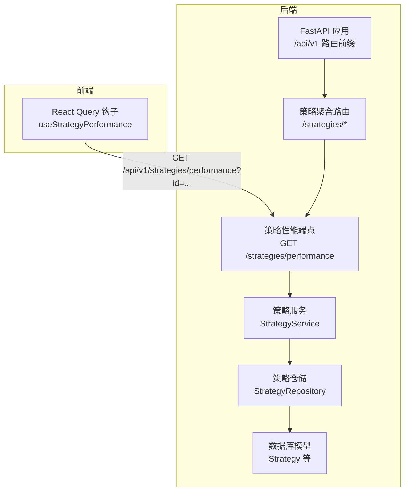
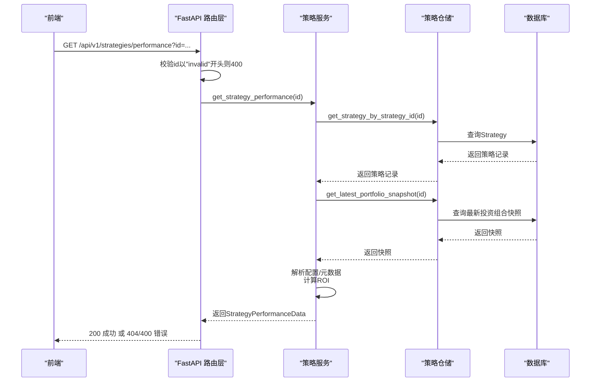
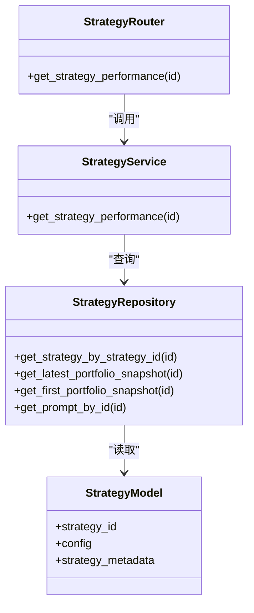

# 策略性能分析

<cite>
**本文引用的文件**
- [python/valuecell/server/api/routers/strategy.py](file://python/valuecell/server/api/routers/strategy.py)
- [python/valuecell/server/api/schemas/strategy.py](file://python/valuecell/server/api/schemas/strategy.py)
- [python/valuecell/server/services/strategy_service.py](file://python/valuecell/server/services/strategy_service.py)
- [python/valuecell/server/db/repositories/strategy_repository.py](file://python/valuecell/server/db/repositories/strategy_repository.py)
- [python/valuecell/server/db/models/strategy.py](file://python/valuecell/server/db/models/strategy.py)
- [python/valuecell/server/api/app.py](file://python/valuecell/server/api/app.py)
- [frontend/src/api/strategy.ts](file://frontend/src/api/strategy.ts)
</cite>

## 目录
1. [简介](#简介)
2. [项目结构](#项目结构)
3. [核心组件](#核心组件)
4. [架构总览](#架构总览)
5. [详细组件分析](#详细组件分析)
6. [依赖关系分析](#依赖关系分析)
7. [性能考量](#性能考量)
8. [故障排查指南](#故障排查指南)
9. [结论](#结论)
10. [附录：使用示例与错误处理](#附录使用示例与错误处理)

## 简介
本文件聚焦于策略性能分析API的“GET /strategies/performance”端点，系统性说明其请求参数、响应结构、数据来源与计算逻辑，并给出在前端如何通过策略ID查询性能数据的实践建议。特别地，文档明确ROI（投资回报率）的严格计算方式为：基于投资组合视图权益（total_value）相对初始资金（initial_capital）的百分比；同时解释当ID以“invalid”开头时返回400错误，以及策略不存在时返回404错误的处理机制。

## 项目结构
该功能由后端FastAPI路由层、服务层、仓储层与数据库模型共同组成，并通过统一的聚合路由进行暴露；前端通过React Query钩子发起请求。

图表来源
- [python/valuecell/server/api/app.py](file://python/valuecell/server/api/app.py#L227-L238)
- [python/valuecell/server/api/routers/strategy.py](file://python/valuecell/server/api/routers/strategy.py#L36-L266)
- [python/valuecell/server/services/strategy_service.py](file://python/valuecell/server/services/strategy_service.py#L200-L301)
- [python/valuecell/server/db/repositories/strategy_repository.py](file://python/valuecell/server/db/repositories/strategy_repository.py#L36-L60)
- [python/valuecell/server/db/models/strategy.py](file://python/valuecell/server/db/models/strategy.py#L15-L74)
- [frontend/src/api/strategy.ts](file://frontend/src/api/strategy.ts#L166-L178)

章节来源
- [python/valuecell/server/api/app.py](file://python/valuecell/server/api/app.py#L187-L239)
- [python/valuecell/server/api/routers/strategy.py](file://python/valuecell/server/api/routers/strategy.py#L36-L266)
- [frontend/src/api/strategy.ts](file://frontend/src/api/strategy.ts#L166-L178)

## 核心组件
- 路由层：定义“GET /strategies/performance”，接收查询参数id，并在业务异常时返回HTTP 400或404。
- 服务层：从仓储读取策略元数据与最新投资组合快照，解析配置字段，计算ROI并组装响应数据。
- 仓储层：提供按strategy_id查询策略、获取最新/最早投资组合快照等能力。
- 数据模型：Strategy模型包含config与strategy_metadata，用于服务层提取LLM提供商、模型ID、交易配置等。
- 响应模型：StrategyPerformanceData定义了性能概览所需字段，最终封装为SuccessResponse。

章节来源
- [python/valuecell/server/api/routers/strategy.py](file://python/valuecell/server/api/routers/strategy.py#L212-L249)
- [python/valuecell/server/services/strategy_service.py](file://python/valuecell/server/services/strategy_service.py#L200-L301)
- [python/valuecell/server/db/repositories/strategy_repository.py](file://python/valuecell/server/db/repositories/strategy_repository.py#L36-L60)
- [python/valuecell/server/db/models/strategy.py](file://python/valuecell/server/db/models/strategy.py#L15-L74)
- [python/valuecell/server/api/schemas/strategy.py](file://python/valuecell/server/api/schemas/strategy.py#L241-L276)

## 架构总览
下图展示从客户端到数据库的完整调用链路与关键数据流。

图表来源
- [python/valuecell/server/api/routers/strategy.py](file://python/valuecell/server/api/routers/strategy.py#L212-L249)
- [python/valuecell/server/services/strategy_service.py](file://python/valuecell/server/services/strategy_service.py#L200-L301)
- [python/valuecell/server/db/repositories/strategy_repository.py](file://python/valuecell/server/db/repositories/strategy_repository.py#L36-L60)
- [python/valuecell/server/db/models/strategy.py](file://python/valuecell/server/db/models/strategy.py#L15-L74)

## 详细组件分析

### 端点：GET /strategies/performance
- 请求路径：/api/v1/strategies/performance
- 方法：GET
- 查询参数：
  - id：必填，策略ID
- 响应模型：SuccessResponse[StrategyPerformanceData]
- 特殊行为：
  - 若id以“invalid”开头（忽略大小写），直接返回HTTP 400
  - 若未找到策略记录，返回HTTP 404
  - 其他异常返回HTTP 500

章节来源
- [python/valuecell/server/api/routers/strategy.py](file://python/valuecell/server/api/routers/strategy.py#L212-L249)

### 响应模型：StrategyPerformanceData
该模型用于描述策略的性能概览与相关配置信息。字段含义如下：

- strategy_id：策略标识符
- initial_capital：初始资金（严格来自配置或元数据）
- return_rate_pct：投资回报率百分比（基于total_value相对initial_capital的严格计算）
- llm_provider：大模型提供商（如openrouter、google、openai等）
- llm_model_id：模型标识（如deepseek-ai/deepseek-v3.1）
- exchange_id：交易所标识
- strategy_type：策略类型（PromptBasedStrategy 或 GridStrategy）
- trading_mode：交易模式（live 或 virtual）
- max_leverage：最大杠杆率
- symbols：标的池（可选）
- prompt_name：最终提示词模板名称（严格来自模板表，无回退）
- prompt：最终提示词文本（严格来自模板表，无回退）

章节来源
- [python/valuecell/server/api/schemas/strategy.py](file://python/valuecell/server/api/schemas/strategy.py#L241-L276)

### ROI计算逻辑（严格规则）
- 计算公式：ROI = (total_value − initial_capital) / initial_capital × 100%
- 严格性说明：
  - 使用“投资组合视图权益（total_value）”作为当前价值
  - 使用“初始资金（initial_capital）”作为基准
  - 当initial_capital为0或无效时，返回空值（不抛错）
- 初始资金来源优先级（Live模式优先）：
  - Live模式：优先从元数据中读取“initial_capital_live”
  - 若缺失，则回退到首次投资组合快照的cash
  - 非Live模式：从交易配置中读取“initial_capital”

章节来源
- [python/valuecell/server/services/strategy_service.py](file://python/valuecell/server/services/strategy_service.py#L227-L253)
- [python/valuecell/server/services/strategy_service.py](file://python/valuecell/server/services/strategy_service.py#L278-L286)

### 配置字段提取与最终提示词
- LLM提供商与模型ID：从配置的llm_model_config中提取，若为空则回退至元数据中的provider/model_id
- 交易所ID：从exchange_config中提取
- 策略类型：从strategy_metadata或trading_config推断，支持多种规范化形式
- 最终提示词（prompt）与名称（prompt_name）：严格通过template_id从提示词模板表读取，不进行回退
- 其他配置：max_leverage、symbols、trading_mode等均来自交易配置或元数据

章节来源
- [python/valuecell/server/services/strategy_service.py](file://python/valuecell/server/services/strategy_service.py#L211-L271)
- [python/valuecell/server/db/repositories/strategy_repository.py](file://python/valuecell/server/db/repositories/strategy_repository.py#L567-L586)

### 数据来源与服务流程
- 策略存在性检查：通过StrategyRepository.get_strategy_by_strategy_id(id)判断
- 投资组合快照：通过StrategyRepository.get_latest_portfolio_snapshot(id)获取最新快照
- 首次快照回退（Live模式）：当元数据缺失时，回退到第一次快照的cash作为initial_capital
- 提示词解析：通过StrategyRepository.get_prompt_by_id(template_id)严格获取

章节来源
- [python/valuecell/server/services/strategy_service.py](file://python/valuecell/server/services/strategy_service.py#L200-L301)
- [python/valuecell/server/db/repositories/strategy_repository.py](file://python/valuecell/server/db/repositories/strategy_repository.py#L258-L290)
- [python/valuecell/server/db/repositories/strategy_repository.py](file://python/valuecell/server/db/repositories/strategy_repository.py#L567-L586)

## 依赖关系分析
- 路由层依赖服务层提供的get_strategy_performance方法
- 服务层依赖仓储层的策略与快照查询
- 仓储层依赖数据库模型（Strategy、StrategyPortfolioView等）
- 前端通过React Query钩子调用后端API

图表来源
- [python/valuecell/server/api/routers/strategy.py](file://python/valuecell/server/api/routers/strategy.py#L212-L249)
- [python/valuecell/server/services/strategy_service.py](file://python/valuecell/server/services/strategy_service.py#L200-L301)
- [python/valuecell/server/db/repositories/strategy_repository.py](file://python/valuecell/server/db/repositories/strategy_repository.py#L36-L60)
- [python/valuecell/server/db/models/strategy.py](file://python/valuecell/server/db/models/strategy.py#L15-L74)

## 性能考量
- 计算复杂度：主要为单表查询与少量字段解析，时间复杂度近似O(1)
- 数据访问：仅涉及策略与最新快照两条记录，开销较小
- 异常处理：对不可用字段进行安全转换（浮点化），避免异常传播
- Live模式优化：优先从元数据读取initial_capital，减少额外查询

[本节为通用性能讨论，无需列出具体文件来源]

## 故障排查指南
- 400 错误（无效ID）：当id以“invalid”开头（忽略大小写）时触发
- 404 错误（策略不存在）：当根据id无法查询到策略记录时触发
- 500 错误（服务器内部错误）：其他异常将被统一捕获并返回
- 建议排查步骤：
  - 确认id是否以“invalid”开头
  - 确认id是否正确且存在于数据库
  - 检查是否存在最新投资组合快照
  - 检查Live模式下的initial_capital_live元数据是否缺失

章节来源
- [python/valuecell/server/api/routers/strategy.py](file://python/valuecell/server/api/routers/strategy.py#L224-L238)

## 结论
“GET /strategies/performance”端点提供了策略的严格ROI计算与关键配置信息聚合，满足用户快速评估策略表现的需求。其设计强调：
- ROI计算严格基于total_value与initial_capital
- 配置字段来源清晰且具备回退策略
- 错误处理明确区分无效ID与不存在策略两类场景
- 前后端职责清晰，便于扩展与维护

[本节为总结性内容，无需列出具体文件来源]

## 附录：使用示例与错误处理

### 如何通过策略ID查询性能数据
- 后端端点：GET /api/v1/strategies/performance?id={策略ID}
- 前端调用：使用React Query钩子useStrategyPerformance，传入策略ID后手动启用查询
- 示例调用路径参考：
  - [python/valuecell/server/api/routers/strategy.py](file://python/valuecell/server/api/routers/strategy.py#L212-L249)
  - [frontend/src/api/strategy.ts](file://frontend/src/api/strategy.ts#L166-L178)

### 错误处理机制
- 无效ID（以“invalid”开头）：返回HTTP 400
- 策略不存在：返回HTTP 404
- 其他异常：返回HTTP 500

章节来源
- [python/valuecell/server/api/routers/strategy.py](file://python/valuecell/server/api/routers/strategy.py#L224-L238)