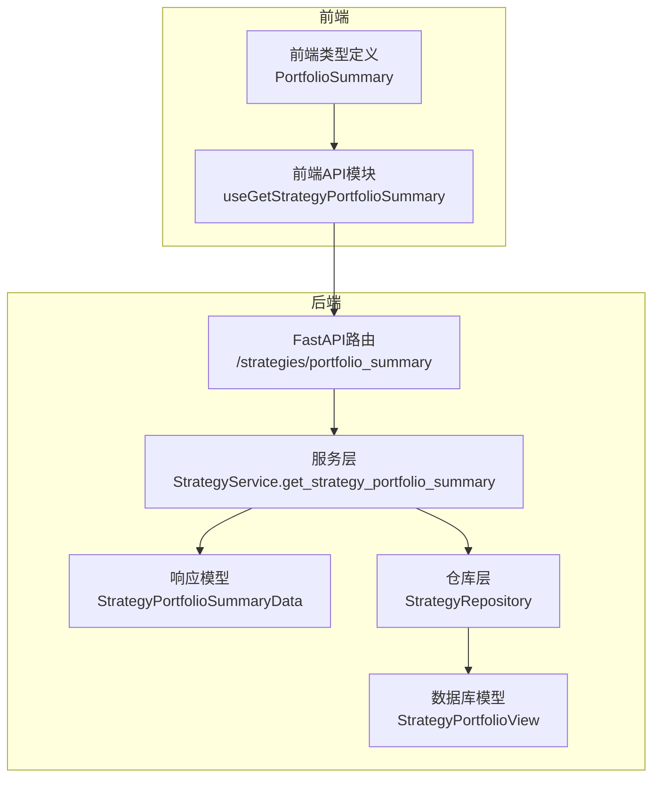
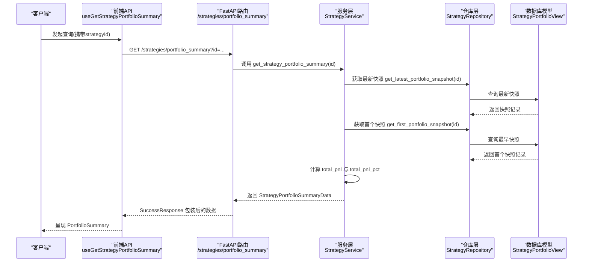
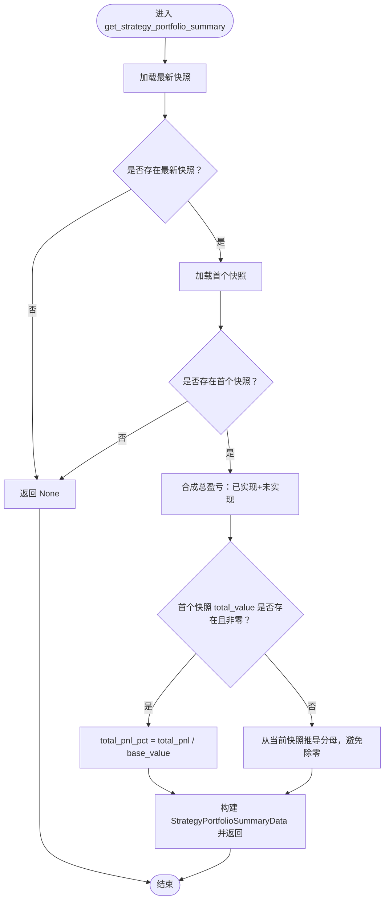
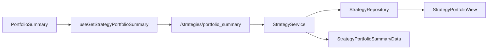

# 策略投资组合

<cite>
**本文引用的文件**
- [python/valuecell/server/api/routers/strategy.py](file://python/valuecell/server/api/routers/strategy.py)
- [python/valuecell/server/api/schemas/strategy.py](file://python/valuecell/server/api/schemas/strategy.py)
- [python/valuecell/server/services/strategy_service.py](file://python/valuecell/server/services/strategy_service.py)
- [python/valuecell/server/db/models/strategy_portfolio.py](file://python/valuecell/server/db/models/strategy_portfolio.py)
- [python/valuecell/server/db/repositories/strategy_repository.py](file://python/valuecell/server/db/repositories/strategy_repository.py)
- [frontend/src/api/strategy.ts](file://frontend/src/api/strategy.ts)
- [frontend/src/types/strategy.ts](file://frontend/src/types/strategy.ts)
- [frontend/src/constants/api.ts](file://frontend/src/constants/api.ts)
</cite>

## 目录
1. [简介](#简介)
2. [项目结构](#项目结构)
3. [核心组件](#核心组件)
4. [架构总览](#架构总览)
5. [详细组件分析](#详细组件分析)
6. [依赖关系分析](#依赖关系分析)
7. [性能考量](#性能考量)
8. [故障排查指南](#故障排查指南)
9. [结论](#结论)
10. [附录](#附录)

## 简介
本文件聚焦于策略投资组合API中的GET /strategies/portfolio_summary端点，系统性说明其响应结构、关键指标含义与计算方法，以及服务层如何获取最新投资组合快照并结合首次快照计算收益率。同时提供使用示例与“无摘要时返回空数据”的处理机制说明，帮助开发者与使用者快速理解与集成该接口。

## 项目结构
围绕“策略投资组合”能力，后端由FastAPI路由、Pydantic模型与服务层构成；数据库侧通过StrategyPortfolioView聚合快照表存储现金、总价值与盈亏等指标；前端通过React Query封装请求与类型定义。

图表来源
- [python/valuecell/server/api/routers/strategy.py](file://python/valuecell/server/api/routers/strategy.py#L298-L328)
- [python/valuecell/server/api/schemas/strategy.py](file://python/valuecell/server/api/schemas/strategy.py#L107-L129)
- [python/valuecell/server/services/strategy_service.py](file://python/valuecell/server/services/strategy_service.py#L106-L155)
- [python/valuecell/server/db/repositories/strategy_repository.py](file://python/valuecell/server/db/repositories/strategy_repository.py#L258-L284)
- [python/valuecell/server/db/models/strategy_portfolio.py](file://python/valuecell/server/db/models/strategy_portfolio.py#L25-L79)
- [frontend/src/api/strategy.ts](file://frontend/src/api/strategy.ts#L67-L80)
- [frontend/src/types/strategy.ts](file://frontend/src/types/strategy.ts#L146-L152)

章节来源
- [python/valuecell/server/api/routers/strategy.py](file://python/valuecell/server/api/routers/strategy.py#L298-L328)
- [python/valuecell/server/api/schemas/strategy.py](file://python/valuecell/server/api/schemas/strategy.py#L107-L129)
- [python/valuecell/server/services/strategy_service.py](file://python/valuecell/server/services/strategy_service.py#L106-L155)
- [python/valuecell/server/db/repositories/strategy_repository.py](file://python/valuecell/server/db/repositories/strategy_repository.py#L258-L284)
- [python/valuecell/server/db/models/strategy_portfolio.py](file://python/valuecell/server/db/models/strategy_portfolio.py#L25-L79)
- [frontend/src/api/strategy.ts](file://frontend/src/api/strategy.ts#L67-L80)
- [frontend/src/types/strategy.ts](file://frontend/src/types/strategy.ts#L146-L152)

## 核心组件
- 路由层：定义GET /strategies/portfolio_summary端点，接收策略ID参数，调用服务层并返回统一成功响应包装。
- 服务层：从仓库层获取最新与首个投资组合快照，计算总盈亏与总盈亏百分比，并构造StrategyPortfolioSummaryData。
- 数据模型：StrategyPortfolioView记录每条快照的现金、总价值、已实现/未实现盈亏、总暴露等字段。
- 响应模型：StrategyPortfolioSummaryData定义cash、total_value、total_pnl、total_pnl_pct、gross_exposure、net_exposure等字段。
- 前端：useGetStrategyPortfolioSummary封装查询，类型为PortfolioSummary，支持轮询刷新。

章节来源
- [python/valuecell/server/api/routers/strategy.py](file://python/valuecell/server/api/routers/strategy.py#L298-L328)
- [python/valuecell/server/api/schemas/strategy.py](file://python/valuecell/server/api/schemas/strategy.py#L107-L129)
- [python/valuecell/server/services/strategy_service.py](file://python/valuecell/server/services/strategy_service.py#L106-L155)
- [python/valuecell/server/db/models/strategy_portfolio.py](file://python/valuecell/server/db/models/strategy_portfolio.py#L25-L79)
- [frontend/src/api/strategy.ts](file://frontend/src/api/strategy.ts#L67-L80)
- [frontend/src/types/strategy.ts](file://frontend/src/types/strategy.ts#L146-L152)

## 架构总览
下图展示从客户端到数据库的完整调用链路与数据流。

图表来源
- [python/valuecell/server/api/routers/strategy.py](file://python/valuecell/server/api/routers/strategy.py#L298-L328)
- [python/valuecell/server/services/strategy_service.py](file://python/valuecell/server/services/strategy_service.py#L106-L155)
- [python/valuecell/server/db/repositories/strategy_repository.py](file://python/valuecell/server/db/repositories/strategy_repository.py#L258-L284)
- [python/valuecell/server/db/models/strategy_portfolio.py](file://python/valuecell/server/db/models/strategy_portfolio.py#L25-L79)
- [frontend/src/api/strategy.ts](file://frontend/src/api/strategy.ts#L67-L80)

## 详细组件分析

### 端点：GET /strategies/portfolio_summary
- 功能：返回指定策略的最新投资组合汇总（现金、总价值、总盈亏、总盈亏百分比等）。
- 请求参数：
  - id: 策略ID（字符串），必填。
- 响应：
  - 成功时：SuccessResponse 包裹 StrategyPortfolioSummaryData。
  - 无摘要时：SuccessResponse 包裹 data=None，消息提示“未找到摘要”。

章节来源
- [python/valuecell/server/api/routers/strategy.py](file://python/valuecell/server/api/routers/strategy.py#L298-L328)

### 响应模型：StrategyPortfolioSummaryData
- 字段说明（均来自快照记录）：
  - strategy_id：策略标识符。
  - ts：快照时间戳（毫秒）。
  - cash：现金余额。
  - total_value：投资组合总值（现金+持仓价值）。
  - total_pnl：总盈亏（已实现盈亏与未实现盈亏之和）。
  - total_pnl_pct：总盈亏百分比。
  - gross_exposure：总总敞口。
  - net_exposure：净敞口。

章节来源
- [python/valuecell/server/api/schemas/strategy.py](file://python/valuecell/server/api/schemas/strategy.py#L107-L129)

### 服务层：StrategyService.get_strategy_portfolio_summary
- 获取最新快照与首个快照，若任一缺失则返回None。
- 计算总盈亏：
  - 合成逻辑：total_pnl = total_realized_pnl + total_unrealized_pnl（均为快照字段）。
- 计算总盈亏百分比：
  - 若首个快照存在且非零：total_pnl_pct = total_pnl / base_value，其中 base_value = 首个快照的 total_value。
  - 否则：从当前快照推导分母，避免除零并记录告警。
- 返回包含上述字段的 StrategyPortfolioSummaryData。

图表来源
- [python/valuecell/server/services/strategy_service.py](file://python/valuecell/server/services/strategy_service.py#L106-L155)

章节来源
- [python/valuecell/server/services/strategy_service.py](file://python/valuecell/server/services/strategy_service.py#L106-L155)

### 数据模型：StrategyPortfolioView
- 字段要点：
  - cash：快照时的现金余额。
  - total_value：快照时的总价值（权益）。
  - total_unrealized_pnl：快照时的未实现盈亏合计。
  - total_realized_pnl：快照时的已实现盈亏合计。
  - gross_exposure、net_exposure：快照时的总/净敞口。
  - snapshot_ts：快照时间戳（UTC）。

章节来源
- [python/valuecell/server/db/models/strategy_portfolio.py](file://python/valuecell/server/db/models/strategy_portfolio.py#L25-L79)

### 仓库层：StrategyRepository
- 提供 get_latest_portfolio_snapshot 与 get_first_portfolio_snapshot，用于服务层获取最新与首个快照。
- 提供 get_portfolio_snapshots 以支持历史曲线等其他功能。

章节来源
- [python/valuecell/server/db/repositories/strategy_repository.py](file://python/valuecell/server/db/repositories/strategy_repository.py#L258-L284)
- [python/valuecell/server/db/repositories/strategy_repository.py](file://python/valuecell/server/db/repositories/strategy_repository.py#L233-L257)

### 前端集成
- useGetStrategyPortfolioSummary：封装查询，支持按策略ID轮询刷新。
- PortfolioSummary 类型：cash、total_value、total_pnl 三字段映射至后端响应。

章节来源
- [frontend/src/api/strategy.ts](file://frontend/src/api/strategy.ts#L67-L80)
- [frontend/src/types/strategy.ts](file://frontend/src/types/strategy.ts#L146-L152)
- [frontend/src/constants/api.ts](file://frontend/src/constants/api.ts#L36-L45)

## 依赖关系分析
- 路由依赖服务层；服务层依赖仓库层；仓库层访问数据库模型。
- 响应模型独立于路由与服务层，仅作为数据契约。
- 前端通过统一的查询键与API封装调用后端。

图表来源
- [python/valuecell/server/api/routers/strategy.py](file://python/valuecell/server/api/routers/strategy.py#L298-L328)
- [python/valuecell/server/services/strategy_service.py](file://python/valuecell/server/services/strategy_service.py#L106-L155)
- [python/valuecell/server/db/repositories/strategy_repository.py](file://python/valuecell/server/db/repositories/strategy_repository.py#L258-L284)
- [python/valuecell/server/db/models/strategy_portfolio.py](file://python/valuecell/server/db/models/strategy_portfolio.py#L25-L79)
- [frontend/src/api/strategy.ts](file://frontend/src/api/strategy.ts#L67-L80)
- [frontend/src/types/strategy.ts](file://frontend/src/types/strategy.ts#L146-L152)

章节来源
- [python/valuecell/server/api/routers/strategy.py](file://python/valuecell/server/api/routers/strategy.py#L298-L328)
- [python/valuecell/server/services/strategy_service.py](file://python/valuecell/server/services/strategy_service.py#L106-L155)
- [python/valuecell/server/db/repositories/strategy_repository.py](file://python/valuecell/server/db/repositories/strategy_repository.py#L258-L284)
- [python/valuecell/server/db/models/strategy_portfolio.py](file://python/valuecell/server/db/models/strategy_portfolio.py#L25-L79)
- [frontend/src/api/strategy.ts](file://frontend/src/api/strategy.ts#L67-L80)
- [frontend/src/types/strategy.ts](file://frontend/src/types/strategy.ts#L146-L152)

## 性能考量
- 快照查询：服务层仅进行一次最新快照与一次首个快照查询，复杂度低。
- 分母计算：优先使用首个快照的total_value作为基准，避免除零；否则采用当前快照推导，减少异常分支。
- 前端轮询：默认5秒刷新，可根据策略活跃度调整。

[本节为通用建议，不直接分析具体文件]

## 故障排查指南
- 无摘要返回空数据：
  - 当最新快照或首个快照不存在时，服务层返回None，路由层以SuccessResponse包裹data=None并提示“未找到摘要”。前端可据此显示占位或提示。
- 除零告警：
  - 当无法从首个快照推导基准时，服务层会记录告警日志，避免total_pnl_pct计算异常。
- 错误处理：
  - 路由层捕获异常并返回HTTP 500，便于定位问题。

章节来源
- [python/valuecell/server/api/routers/strategy.py](file://python/valuecell/server/api/routers/strategy.py#L310-L328)
- [python/valuecell/server/services/strategy_service.py](file://python/valuecell/server/services/strategy_service.py#L123-L142)

## 结论
GET /strategies/portfolio_summary端点通过服务层聚合最新与首个快照，提供简洁明确的投资组合摘要。其响应模型清晰表达现金、总值、总盈亏与总盈亏百分比等关键指标，满足实时监控与回测对比需求。前端通过统一查询封装与类型约束，便于在UI中稳定展示。

[本节为总结性内容，不直接分析具体文件]

## 附录

### 使用示例
- 查询特定策略的投资组合摘要：
  - 前端调用：useGetStrategyPortfolioSummary(策略ID)
  - 路由请求：GET /strategies/portfolio_summary?id=策略ID
  - 响应：SuccessResponse 包裹 StrategyPortfolioSummaryData 或 data=None

章节来源
- [frontend/src/api/strategy.ts](file://frontend/src/api/strategy.ts#L67-L80)
- [python/valuecell/server/api/routers/strategy.py](file://python/valuecell/server/api/routers/strategy.py#L298-L328)

### 关键指标计算说明
- 现金余额（cash）
  - 来源：最新快照的cash字段。
- 投资组合总值（total_value）
  - 来源：最新快照的total_value字段。
- 总盈亏（total_pnl）
  - 来源：最新快照的total_realized_pnl与total_unrealized_pnl之和。
- 总盈亏百分比（total_pnl_pct）
  - 基准：若首个快照存在且非零，则以首个快照total_value为基准；否则从当前快照推导分母，避免除零并记录告警。

章节来源
- [python/valuecell/server/services/strategy_service.py](file://python/valuecell/server/services/strategy_service.py#L123-L142)
- [python/valuecell/server/db/models/strategy_portfolio.py](file://python/valuecell/server/db/models/strategy_portfolio.py#L25-L79)