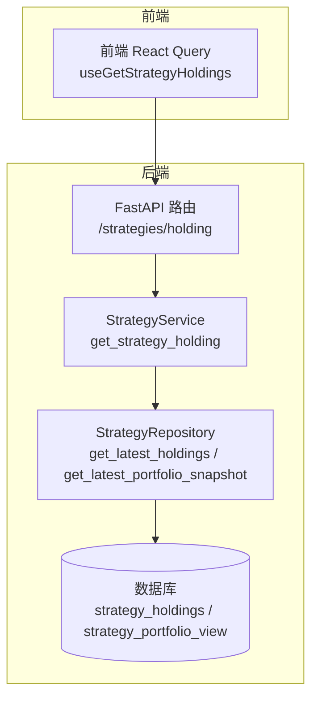
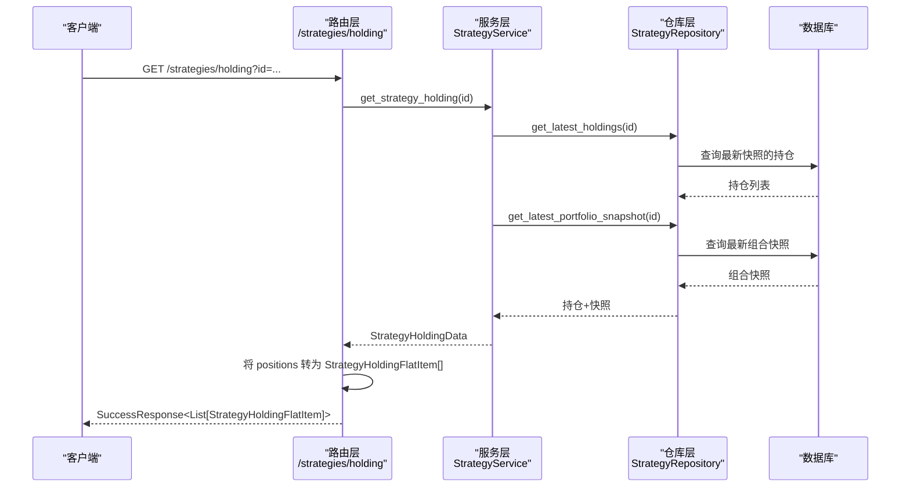
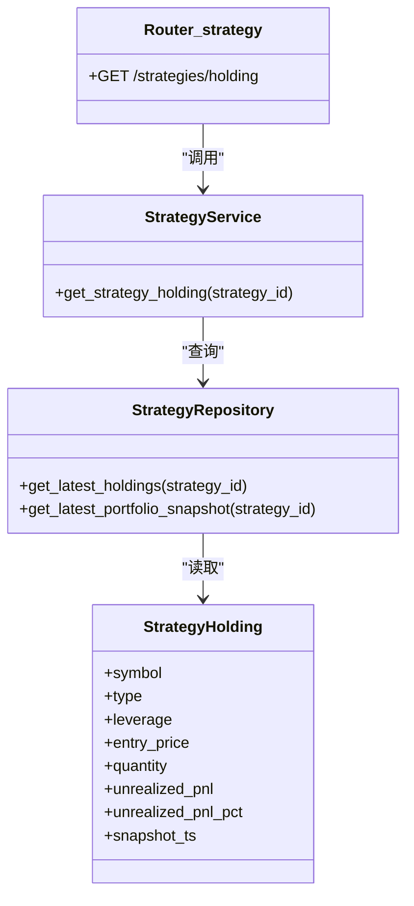

# 策略持仓管理

<cite>
**本文引用的文件列表**
- [python/valuecell/server/api/routers/strategy.py](file://python/valuecell/server/api/routers/strategy.py)
- [python/valuecell/server/api/schemas/strategy.py](file://python/valuecell/server/api/schemas/strategy.py)
- [python/valuecell/server/api/schemas/base.py](file://python/valuecell/server/api/schemas/base.py)
- [python/valuecell/server/services/strategy_service.py](file://python/valuecell/server/services/strategy_service.py)
- [python/valuecell/server/db/repositories/strategy_repository.py](file://python/valuecell/server/db/repositories/strategy_repository.py)
- [python/valuecell/server/db/models/strategy_holding.py](file://python/valuecell/server/db/models/strategy_holding.py)
- [frontend/src/api/strategy.ts](file://frontend/src/api/strategy.ts)
</cite>

## 目录
1. [简介](#简介)
2. [项目结构](#项目结构)
3. [核心组件](#核心组件)
4. [架构总览](#架构总览)
5. [详细组件分析](#详细组件分析)
6. [依赖关系分析](#依赖关系分析)
7. [性能考量](#性能考量)
8. [故障排查指南](#故障排查指南)
9. [结论](#结论)
10. [附录：使用示例与最佳实践](#附录使用示例与最佳实践)

## 简介
本文件聚焦于策略持仓管理API中的“GET /strategies/holding”端点，系统性说明：
- 端点用途与返回结构
- 响应体 StrategyHoldingFlatResponse 的扁平化设计思路与字段语义
- 服务层如何从数据库获取最新持仓并转换为前端友好格式
- 实际使用示例（含无持仓时返回空数组的处理）

## 项目结构
围绕“策略持仓”相关的核心文件分布如下：
- 路由层：定义 /strategies/holding 端点及参数校验、响应封装
- 服务层：聚合仓库查询结果，构造统一的持仓视图
- 仓库层：提供按策略ID获取最新持仓快照、最新组合快照等能力
- 数据模型：策略持仓表结构与序列化
- 前端：通过React Query调用该端点并渲染

图表来源
- [python/valuecell/server/api/routers/strategy.py](file://python/valuecell/server/api/routers/strategy.py#L251-L296)
- [python/valuecell/server/services/strategy_service.py](file://python/valuecell/server/services/strategy_service.py#L27-L105)
- [python/valuecell/server/db/repositories/strategy_repository.py](file://python/valuecell/server/db/repositories/strategy_repository.py#L204-L232)

章节来源
- [python/valuecell/server/api/routers/strategy.py](file://python/valuecell/server/api/routers/strategy.py#L251-L296)
- [python/valuecell/server/services/strategy_service.py](file://python/valuecell/server/services/strategy_service.py#L27-L105)
- [python/valuecell/server/db/repositories/strategy_repository.py](file://python/valuecell/server/db/repositories/strategy_repository.py#L204-L232)

## 核心组件
- 端点：GET /strategies/holding
  - 查询参数：id（策略ID）
  - 返回：SuccessResponse<List[StrategyHoldingFlatItem]>
  - 行为：若无最新持仓，则返回空数组
- 响应模型：StrategyHoldingFlatItem
  - 字段含义见下节“响应结构说明”
- 服务层：StrategyService.get_strategy_holding
  - 从仓库获取最新持仓快照与最新组合快照，构造 StrategyHoldingData
  - 将内部 PositionHoldingItem 转换为扁平化的 StrategyHoldingFlatItem
- 仓库层：StrategyRepository
  - get_latest_holdings：按策略ID与最新快照时间获取持仓集合
  - get_latest_portfolio_snapshot：获取最新组合快照（用于时间戳与现金等汇总信息）

章节来源
- [python/valuecell/server/api/routers/strategy.py](file://python/valuecell/server/api/routers/strategy.py#L251-L296)
- [python/valuecell/server/api/schemas/strategy.py](file://python/valuecell/server/api/schemas/strategy.py#L187-L202)
- [python/valuecell/server/services/strategy_service.py](file://python/valuecell/server/services/strategy_service.py#L27-L105)
- [python/valuecell/server/db/repositories/strategy_repository.py](file://python/valuecell/server/db/repositories/strategy_repository.py#L204-L232)

## 架构总览
下图展示了从请求到响应的关键调用链路与数据流转。

图表来源
- [python/valuecell/server/api/routers/strategy.py](file://python/valuecell/server/api/routers/strategy.py#L251-L296)
- [python/valuecell/server/services/strategy_service.py](file://python/valuecell/server/services/strategy_service.py#L27-L105)
- [python/valuecell/server/db/repositories/strategy_repository.py](file://python/valuecell/server/db/repositories/strategy_repository.py#L204-L232)

## 详细组件分析

### 端点：GET /strategies/holding
- 路径与方法：GET /strategies/holding
- 查询参数
  - id：策略ID（必填）
- 响应
  - 成功：SuccessResponse<List[StrategyHoldingFlatItem]>
  - 无持仓：SuccessResponse<List[StrategyHoldingFlatItem]>，data为空数组
- 错误处理
  - 内部异常：HTTP 500
  - 参数校验失败：HTTP 400（由FastAPI参数校验触发）

章节来源
- [python/valuecell/server/api/routers/strategy.py](file://python/valuecell/server/api/routers/strategy.py#L251-L296)
- [python/valuecell/server/api/schemas/base.py](file://python/valuecell/server/api/schemas/base.py#L12-L46)

### 响应结构：StrategyHoldingFlatItem（扁平化持仓项）
该结构将策略的最新持仓信息扁平化，便于前端直接展示。字段说明如下：
- symbol：交易品种（如合约或币对）
- type：交易类型，取值为 LONG 或 SHORT
- leverage：杠杆率（可选）
- entry_price：平均入场价（可选）
- quantity：绝对持仓数量（始终为正数）
- unrealized_pnl：未实现盈亏（可选）
- unrealized_pnl_pct：未实现盈亏百分比（可选）

注意：
- quantity 字段始终为正数，多空方向由 type 字段体现
- 若某持仓已平仓（quantity为0），服务层会跳过该条目，不会出现在最终数组中

章节来源
- [python/valuecell/server/api/schemas/strategy.py](file://python/valuecell/server/api/schemas/strategy.py#L187-L202)

### 服务层：StrategyService.get_strategy_holding
职责与流程：
- 获取最新持仓快照：调用仓库的 get_latest_holdings
- 获取最新组合快照：调用仓库的 get_latest_portfolio_snapshot
- 过滤逻辑：跳过 quantity 为0或为空的持仓
- 类型与数量归一化：
  - 多空方向：优先使用 trade_type；若为空则根据 quantity 符号推断
  - 数量：取绝对值，保证 quantity 为正
- 时间戳选择：优先使用组合快照的时间戳，否则回退到持仓快照时间
- 现金与暴露度：从组合快照读取 cash、gross_exposure、net_exposure 等（可选）

章节来源
- [python/valuecell/server/services/strategy_service.py](file://python/valuecell/server/services/strategy_service.py#L27-L105)

### 仓库层：StrategyRepository
关键方法：
- get_latest_holdings：按策略ID与最新 snapshot_ts 获取持仓列表
- get_latest_portfolio_snapshot：获取最新组合快照（包含时间戳与资产汇总）

章节来源
- [python/valuecell/server/db/repositories/strategy_repository.py](file://python/valuecell/server/db/repositories/strategy_repository.py#L204-L232)

### 数据模型：StrategyHolding
- 字段要点（与服务层转换相关）：
  - symbol：标的符号
  - type：LONG/SHORT
  - leverage：杠杆
  - entry_price：平均入场价
  - quantity：绝对数量
  - unrealized_pnl / unrealized_pnl_pct：未实现盈亏与百分比
  - snapshot_ts：快照时间
- to_dict：用于序列化（非本端点直接使用）

章节来源
- [python/valuecell/server/db/models/strategy_holding.py](file://python/valuecell/server/db/models/strategy_holding.py#L24-L112)

### 前端集成：useGetStrategyHoldings
- 请求路径：/strategies/holding?id=策略ID
- 返回数据：Position[]（与后端扁平化后的结构一致）
- 刷新策略：每5秒自动刷新一次

章节来源
- [frontend/src/api/strategy.ts](file://frontend/src/api/strategy.ts#L41-L52)

## 依赖关系分析

图表来源
- [python/valuecell/server/api/routers/strategy.py](file://python/valuecell/server/api/routers/strategy.py#L251-L296)
- [python/valuecell/server/services/strategy_service.py](file://python/valuecell/server/services/strategy_service.py#L27-L105)
- [python/valuecell/server/db/repositories/strategy_repository.py](file://python/valuecell/server/db/repositories/strategy_repository.py#L204-L232)
- [python/valuecell/server/db/models/strategy_holding.py](file://python/valuecell/server/db/models/strategy_holding.py#L24-L112)

章节来源
- [python/valuecell/server/api/routers/strategy.py](file://python/valuecell/server/api/routers/strategy.py#L251-L296)
- [python/valuecell/server/services/strategy_service.py](file://python/valuecell/server/services/strategy_service.py#L27-L105)
- [python/valuecell/server/db/repositories/strategy_repository.py](file://python/valuecell/server/db/repositories/strategy_repository.py#L204-L232)
- [python/valuecell/server/db/models/strategy_holding.py](file://python/valuecell/server/db/models/strategy_holding.py#L24-L112)

## 性能考量
- 查询优化
  - get_latest_holdings 使用了“最新快照时间”的过滤条件，避免全表扫描
  - 对 symbol 排序以保证输出稳定
- 数据转换
  - 服务层在内存中进行类型与数量归一化，复杂度 O(n)
- 前端轮询
  - 默认每5秒刷新一次，可根据业务需求调整

章节来源
- [python/valuecell/server/db/repositories/strategy_repository.py](file://python/valuecell/server/db/repositories/strategy_repository.py#L204-L232)
- [frontend/src/api/strategy.ts](file://frontend/src/api/strategy.ts#L41-L52)

## 故障排查指南
- 无持仓返回空数组
  - 当仓库未找到任何最新持仓时，服务层返回 None，路由层将返回空数组
  - 前端应正确处理 data 为空数组的情况
- 404/400/500
  - 404：策略不存在（性能端点有显式校验）
  - 400：参数非法（如无效ID前缀）
  - 500：服务器内部错误
- 日志与可观测性
  - 服务层使用日志记录异常，便于定位问题

章节来源
- [python/valuecell/server/api/routers/strategy.py](file://python/valuecell/server/api/routers/strategy.py#L251-L296)
- [python/valuecell/server/services/strategy_service.py](file://python/valuecell/server/services/strategy_service.py#L27-L105)

## 结论
- GET /strategies/holding 提供了策略最新持仓的扁平化视图，字段简洁、方向明确、数量统一为正，便于前端直接消费
- 服务层负责从数据库获取最新持仓与组合快照，并进行必要的类型与数量归一化
- 当策略尚无持仓时，端点返回空数组，前端应具备相应容错处理
- 整体架构清晰、职责分离，具备良好的扩展性与可维护性

## 附录：使用示例与最佳实践

### 使用示例
- 前端调用
  - 使用 React Query 的 useGetStrategyHoldings，传入策略ID，自动每5秒刷新
  - 参考路径：[frontend/src/api/strategy.ts](file://frontend/src/api/strategy.ts#L41-L52)
- 后端调用
  - GET /strategies/holding?id=策略ID
  - 返回 SuccessResponse<List[StrategyHoldingFlatItem]>，其中 data 为数组
  - 参考路径：[python/valuecell/server/api/routers/strategy.py](file://python/valuecell/server/api/routers/strategy.py#L251-L296)

### 字段含义速查
- symbol：交易品种
- type：LONG 或 SHORT
- leverage：杠杆率（可选）
- entry_price：平均入场价（可选）
- quantity：绝对持仓数量（始终为正）
- unrealized_pnl：未实现盈亏（可选）
- unrealized_pnl_pct：未实现盈亏百分比（可选）

### 最佳实践
- 前端：当 data 为空数组时，显示“暂无持仓”提示
- 服务层：确保 quantity 为0的持仓被过滤掉，避免误导
- 路由层：保持对异常的统一处理，返回标准 SuccessResponse 或错误响应