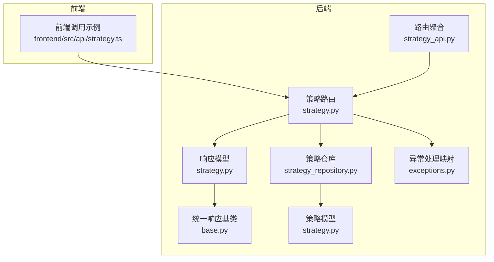
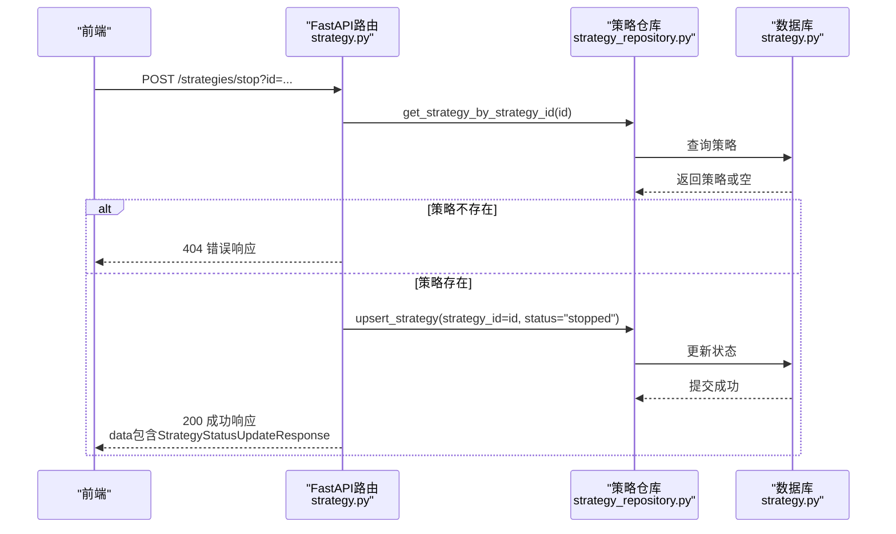
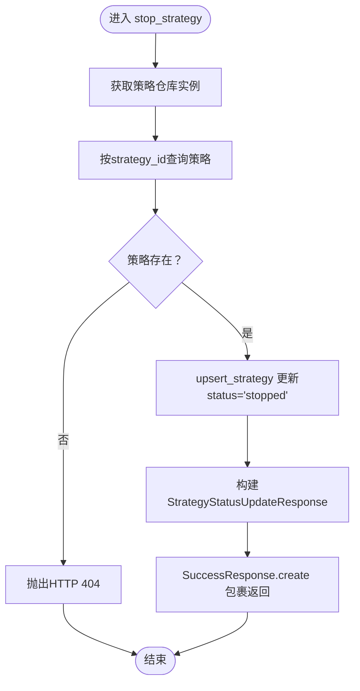
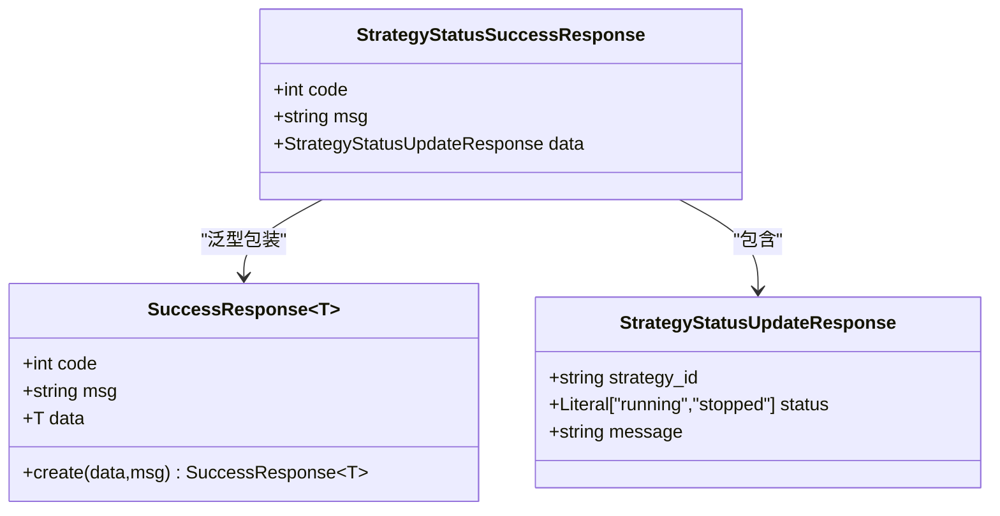
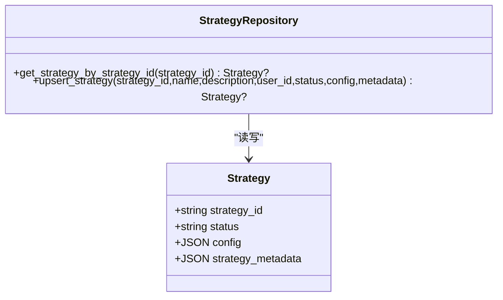
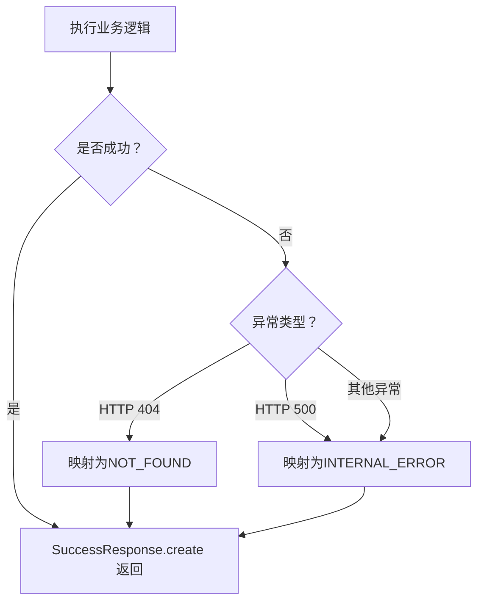
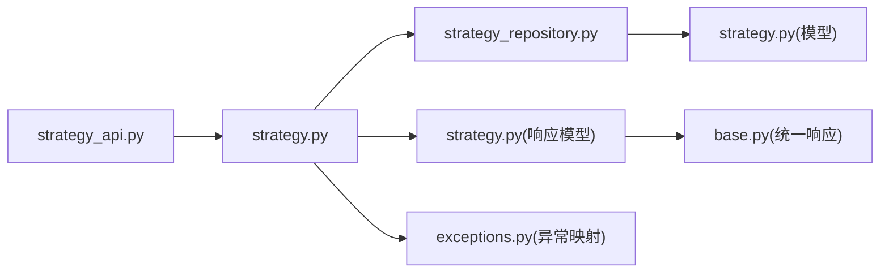

# 策略控制操作

<cite>
**本文引用的文件**
- [python/valuecell/server/api/routers/strategy.py](file://python/valuecell/server/api/routers/strategy.py)
- [python/valuecell/server/api/schemas/strategy.py](file://python/valuecell/server/api/schemas/strategy.py)
- [python/valuecell/server/api/schemas/base.py](file://python/valuecell/server/api/schemas/base.py)
- [python/valuecell/server/db/repositories/strategy_repository.py](file://python/valuecell/server/db/repositories/strategy_repository.py)
- [python/valuecell/server/db/models/strategy.py](file://python/valuecell/server/db/models/strategy.py)
- [python/valuecell/server/api/exceptions.py](file://python/valuecell/server/api/exceptions.py)
- [python/valuecell/server/api/routers/strategy_api.py](file://python/valuecell/server/api/routers/strategy_api.py)
- [frontend/src/api/strategy.ts](file://frontend/src/api/strategy.ts)
</cite>

## 目录
1. [简介](#简介)
2. [项目结构](#项目结构)
3. [核心组件](#核心组件)
4. [架构总览](#架构总览)
5. [详细组件分析](#详细组件分析)
6. [依赖关系分析](#依赖关系分析)
7. [性能与幂等性](#性能与幂等性)
8. [故障排查指南](#故障排查指南)
9. [结论](#结论)
10. [附录：使用示例与接口规范](#附录使用示例与接口规范)

## 简介
本文件聚焦于策略控制操作API中的POST /strategies/stop端点，系统化说明其请求参数、响应格式、状态更新逻辑与异常处理机制。重点解释StrategyStatusSuccessResponse响应结构中各字段（策略ID、更新后的状态、操作消息）的含义；阐述服务层通过策略仓库将策略状态更新为“已停止”的实现方式，并强调该操作的幂等性保障；最后提供实际使用示例，覆盖正常停止、策略不存在返回404、更新失败返回500等场景。

## 项目结构
围绕策略控制操作的关键文件分布如下：
- 后端路由与控制器：python/valuecell/server/api/routers/strategy.py
- 响应模型与统一响应封装：python/valuecell/server/api/schemas/strategy.py、python/valuecell/server/api/schemas/base.py
- 数据访问层（仓库）：python/valuecell/server/db/repositories/strategy_repository.py
- 数据模型：python/valuecell/server/db/models/strategy.py
- 异常处理映射：python/valuecell/server/api/exceptions.py
- 路由聚合入口：python/valuecell/server/api/routers/strategy_api.py
- 前端调用示例：frontend/src/api/strategy.ts

图表来源
- [python/valuecell/server/api/routers/strategy.py](file://python/valuecell/server/api/routers/strategy.py#L487-L524)
- [python/valuecell/server/api/schemas/strategy.py](file://python/valuecell/server/api/schemas/strategy.py#L208-L217)
- [python/valuecell/server/api/schemas/base.py](file://python/valuecell/server/api/schemas/base.py#L28-L60)
- [python/valuecell/server/db/repositories/strategy_repository.py](file://python/valuecell/server/db/repositories/strategy_repository.py#L76-L128)
- [python/valuecell/server/db/models/strategy.py](file://python/valuecell/server/db/models/strategy.py#L15-L59)
- [python/valuecell/server/api/exceptions.py](file://python/valuecell/server/api/exceptions.py#L58-L74)
- [python/valuecell/server/api/routers/strategy_api.py](file://python/valuecell/server/api/routers/strategy_api.py#L14-L26)
- [frontend/src/api/strategy.ts](file://frontend/src/api/strategy.ts#L107-L122)

章节来源
- [python/valuecell/server/api/routers/strategy.py](file://python/valuecell/server/api/routers/strategy.py#L487-L524)
- [python/valuecell/server/api/routers/strategy_api.py](file://python/valuecell/server/api/routers/strategy_api.py#L14-L26)

## 核心组件
- 策略路由与控制器：定义POST /strategies/stop端点，接收查询参数id，校验策略存在性，调用仓库更新状态为“stopped”，构造StrategyStatusUpdateResponse并以SuccessResponse包裹返回。
- 响应模型：StrategyStatusUpdateResponse包含strategy_id、status、message；StrategyStatusSuccessResponse为SuccessResponse[StrategyStatusUpdateResponse]。
- 统一响应封装：SuccessResponse.create用于生成标准成功响应体。
- 策略仓库：提供get_strategy_by_strategy_id与upsert_strategy方法，后者支持按strategy_id创建或更新，从而保证幂等。
- 数据模型：Strategy模型包含status字段，作为策略状态的持久化载体。
- 异常处理：HTTP 404映射为NOT_FOUND，HTTP 500映射为INTERNAL_ERROR，均通过统一响应体返回。

章节来源
- [python/valuecell/server/api/routers/strategy.py](file://python/valuecell/server/api/routers/strategy.py#L487-L524)
- [python/valuecell/server/api/schemas/strategy.py](file://python/valuecell/server/api/schemas/strategy.py#L208-L217)
- [python/valuecell/server/api/schemas/base.py](file://python/valuecell/server/api/schemas/base.py#L28-L60)
- [python/valuecell/server/db/repositories/strategy_repository.py](file://python/valuecell/server/db/repositories/strategy_repository.py#L36-L128)
- [python/valuecell/server/db/models/strategy.py](file://python/valuecell/server/db/models/strategy.py#L15-L59)
- [python/valuecell/server/api/exceptions.py](file://python/valuecell/server/api/exceptions.py#L58-L74)

## 架构总览
POST /strategies/stop的端到端流程如下：
- 前端通过POST /strategies/stop?id={策略ID}发起请求
- FastAPI路由解析查询参数id
- 调用策略仓库根据strategy_id查询策略是否存在
- 若不存在，抛出HTTP 404
- 若存在，调用upsert_strategy将status更新为“stopped”
- 构造StrategyStatusUpdateResponse并以SuccessResponse.create返回
- 异常统一由异常处理器映射为统一响应体

图表来源
- [python/valuecell/server/api/routers/strategy.py](file://python/valuecell/server/api/routers/strategy.py#L487-L524)
- [python/valuecell/server/db/repositories/strategy_repository.py](file://python/valuecell/server/db/repositories/strategy_repository.py#L36-L128)
- [python/valuecell/server/db/models/strategy.py](file://python/valuecell/server/db/models/strategy.py#L15-L59)

## 详细组件分析

### POST /strategies/stop 端点
- 方法与路径：POST /strategies/stop
- 查询参数：
  - id: 策略ID（字符串），必填
- 请求与响应：
  - 请求：无请求体，仅查询参数id
  - 响应：SuccessResponse[StrategyStatusUpdateResponse]
- 处理流程：
  - 校验策略存在性，不存在则返回404
  - 幂等地将状态更新为“stopped”
  - 返回包含strategy_id、status、message的成功响应

图表来源
- [python/valuecell/server/api/routers/strategy.py](file://python/valuecell/server/api/routers/strategy.py#L487-L524)
- [python/valuecell/server/db/repositories/strategy_repository.py](file://python/valuecell/server/db/repositories/strategy_repository.py#L76-L128)

章节来源
- [python/valuecell/server/api/routers/strategy.py](file://python/valuecell/server/api/routers/strategy.py#L487-L524)

### 响应结构 StrategyStatusSuccessResponse
- 结构组成：
  - code: 统一状态码（成功为0）
  - msg: 操作结果消息
  - data: StrategyStatusUpdateResponse
- StrategyStatusUpdateResponse 字段：
  - strategy_id: 策略ID（字符串）
  - status: 更新后的状态（枚举值，限定为“running”或“stopped”）
  - message: 操作提示信息（例如“策略已被停止”）

图表来源
- [python/valuecell/server/api/schemas/base.py](file://python/valuecell/server/api/schemas/base.py#L28-L60)
- [python/valuecell/server/api/schemas/strategy.py](file://python/valuecell/server/api/schemas/strategy.py#L208-L217)

章节来源
- [python/valuecell/server/api/schemas/strategy.py](file://python/valuecell/server/api/schemas/strategy.py#L208-L217)
- [python/valuecell/server/api/schemas/base.py](file://python/valuecell/server/api/schemas/base.py#L28-L60)

### 服务层与仓库层交互
- 仓库方法：
  - get_strategy_by_strategy_id：按strategy_id查询策略
  - upsert_strategy：按strategy_id创建或更新策略，支持传入status、metadata等字段
- 状态更新逻辑：
  - 若策略存在：直接更新status为“stopped”
  - 若策略不存在：不创建新记录，保持幂等（不会因更新而产生新行）
- 幂等性保障：
  - upsert_strategy基于strategy_id进行更新，若不存在则不创建
  - 即使重复调用，最终状态均为“stopped”，且不会产生副作用

图表来源
- [python/valuecell/server/db/repositories/strategy_repository.py](file://python/valuecell/server/db/repositories/strategy_repository.py#L36-L128)
- [python/valuecell/server/db/models/strategy.py](file://python/valuecell/server/db/models/strategy.py#L15-L59)

章节来源
- [python/valuecell/server/db/repositories/strategy_repository.py](file://python/valuecell/server/db/repositories/strategy_repository.py#L36-L128)
- [python/valuecell/server/db/models/strategy.py](file://python/valuecell/server/db/models/strategy.py#L15-L59)

### 异常处理与状态码映射
- 404（未找到）：当策略不存在时，抛出HTTP 404，映射为统一响应体中的NOT_FOUND
- 500（内部错误）：当数据库更新失败或未知异常时，抛出HTTP 500，映射为INTERNAL_ERROR
- 统一响应体：所有错误均以统一的响应结构返回，便于前端一致处理

图表来源
- [python/valuecell/server/api/routers/strategy.py](file://python/valuecell/server/api/routers/strategy.py#L487-L524)
- [python/valuecell/server/api/exceptions.py](file://python/valuecell/server/api/exceptions.py#L58-L74)

章节来源
- [python/valuecell/server/api/routers/strategy.py](file://python/valuecell/server/api/routers/strategy.py#L487-L524)
- [python/valuecell/server/api/exceptions.py](file://python/valuecell/server/api/exceptions.py#L58-L74)

## 依赖关系分析
- 聚合路由：strategy_api.py将多个子路由整合，其中包含策略相关路由
- 控制器依赖：stop_strategy依赖仓库层完成数据访问
- 模型依赖：仓库层依赖数据库模型，统一响应依赖基础响应模型

图表来源
- [python/valuecell/server/api/routers/strategy_api.py](file://python/valuecell/server/api/routers/strategy_api.py#L14-L26)
- [python/valuecell/server/api/routers/strategy.py](file://python/valuecell/server/api/routers/strategy.py#L487-L524)
- [python/valuecell/server/db/repositories/strategy_repository.py](file://python/valuecell/server/db/repositories/strategy_repository.py#L36-L128)
- [python/valuecell/server/db/models/strategy.py](file://python/valuecell/server/db/models/strategy.py#L15-L59)
- [python/valuecell/server/api/schemas/strategy.py](file://python/valuecell/server/api/schemas/strategy.py#L208-L217)
- [python/valuecell/server/api/schemas/base.py](file://python/valuecell/server/api/schemas/base.py#L28-L60)
- [python/valuecell/server/api/exceptions.py](file://python/valuecell/server/api/exceptions.py#L58-L74)

章节来源
- [python/valuecell/server/api/routers/strategy_api.py](file://python/valuecell/server/api/routers/strategy_api.py#L14-L26)
- [python/valuecell/server/api/routers/strategy.py](file://python/valuecell/server/api/routers/strategy.py#L487-L524)

## 性能与幂等性
- 幂等性：
  - upsert_strategy基于strategy_id更新，若不存在不创建，避免重复插入
  - 多次调用同一策略ID的停止请求，最终状态仍为“stopped”，不会产生额外副作用
- 性能特征：
  - 查询与更新均为单条记录级别的操作，SQL复杂度低
  - 仓库层对会话管理进行了封装，减少连接泄漏风险
- 可靠性：
  - 异常统一捕获并映射为统一响应体，便于前端稳定处理

章节来源
- [python/valuecell/server/db/repositories/strategy_repository.py](file://python/valuecell/server/db/repositories/strategy_repository.py#L76-L128)
- [python/valuecell/server/api/routers/strategy.py](file://python/valuecell/server/api/routers/strategy.py#L487-L524)

## 故障排查指南
- 404 未找到策略
  - 现象：返回统一响应体，code为NOT_FOUND
  - 排查：确认id是否正确、策略是否已创建
- 500 内部错误
  - 现象：返回统一响应体，code为INTERNAL_ERROR
  - 排查：检查数据库连接、事务提交、仓库层异常日志
- 前端调用问题
  - 现象：前端调用useStopStrategy后列表未刷新
  - 处理：确保调用成功回调中触发列表查询失效（queryClient.invalidateQueries）

章节来源
- [python/valuecell/server/api/routers/strategy.py](file://python/valuecell/server/api/routers/strategy.py#L487-L524)
- [python/valuecell/server/api/exceptions.py](file://python/valuecell/server/api/exceptions.py#L58-L74)
- [frontend/src/api/strategy.ts](file://frontend/src/api/strategy.ts#L107-L122)

## 结论
POST /strategies/stop端点通过简单明确的查询参数id，实现了对指定策略的幂等停止。其响应采用统一的成功响应体，包含策略ID、更新后的状态与操作消息，便于前后端协同。仓库层的upsert_strategy确保了状态更新的幂等性与可靠性；异常处理映射保证了错误响应的一致性。结合前端useStopStrategy的调用示例，可快速集成到产品功能中。

## 附录：使用示例与接口规范

### 接口规范
- 方法与路径：POST /strategies/stop
- 查询参数：
  - id: 策略ID（字符串，必填）
- 成功响应：
  - data.strategy_id: 策略ID
  - data.status: “stopped”
  - data.message: 停止操作提示
- 异常响应：
  - 404：策略不存在
  - 500：服务器内部错误

章节来源
- [python/valuecell/server/api/routers/strategy.py](file://python/valuecell/server/api/routers/strategy.py#L487-L524)
- [python/valuecell/server/api/schemas/strategy.py](file://python/valuecell/server/api/schemas/strategy.py#L208-L217)
- [python/valuecell/server/api/exceptions.py](file://python/valuecell/server/api/exceptions.py#L58-L74)

### 实际使用示例
- 正常停止
  - 前端调用：POST /strategies/stop?id={策略ID}
  - 预期：返回200，data.status为“stopped”，data.message包含策略ID
- 策略不存在
  - 前端调用：POST /strategies/stop?id=不存在的ID
  - 预期：返回统一错误响应，code为NOT_FOUND
- 更新失败
  - 前端调用：POST /strategies/stop?id=有效ID（但数据库异常）
  - 预期：返回统一错误响应，code为INTERNAL_ERROR

章节来源
- [frontend/src/api/strategy.ts](file://frontend/src/api/strategy.ts#L107-L122)
- [python/valuecell/server/api/routers/strategy.py](file://python/valuecell/server/api/routers/strategy.py#L487-L524)