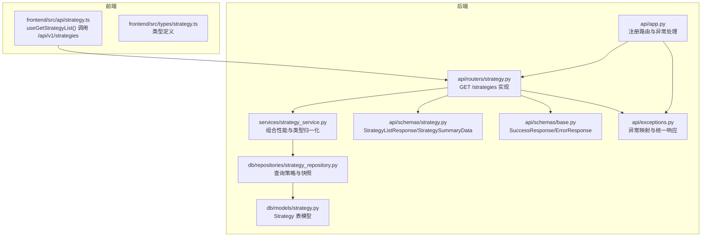
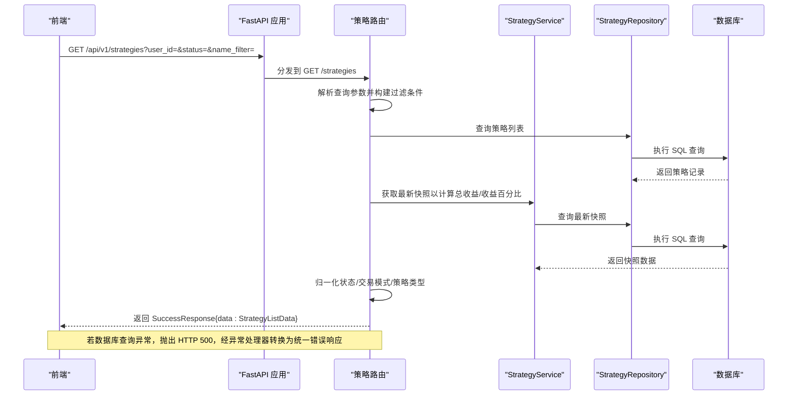
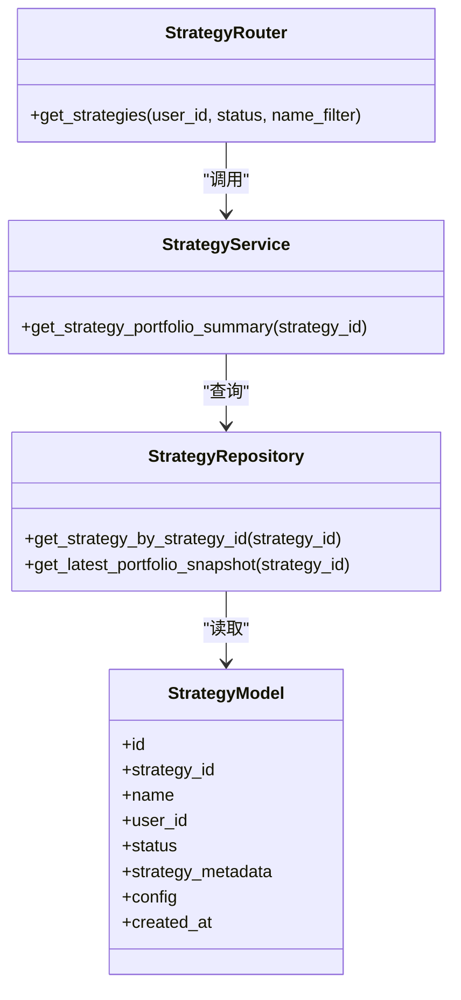

# 策略查询

<cite>
**本文引用的文件**
- [python/valuecell/server/api/routers/strategy.py](file://python/valuecell/server/api/routers/strategy.py)
- [python/valuecell/server/api/schemas/strategy.py](file://python/valuecell/server/api/schemas/strategy.py)
- [python/valuecell/server/api/schemas/base.py](file://python/valuecell/server/api/schemas/base.py)
- [python/valuecell/server/api/exceptions.py](file://python/valuecell/server/api/exceptions.py)
- [python/valuecell/server/api/app.py](file://python/valuecell/server/api/app.py)
- [python/valuecell/server/db/models/strategy.py](file://python/valuecell/server/db/models/strategy.py)
- [python/valuecell/server/db/repositories/strategy_repository.py](file://python/valuecell/server/db/repositories/strategy_repository.py)
- [python/valuecell/server/services/strategy_service.py](file://python/valuecell/server/services/strategy_service.py)
- [frontend/src/api/strategy.ts](file://frontend/src/api/strategy.ts)
- [frontend/src/types/strategy.ts](file://frontend/src/types/strategy.ts)
</cite>

## 目录
1. [简介](#简介)
2. [项目结构](#项目结构)
3. [核心组件](#核心组件)
4. [架构总览](#架构总览)
5. [详细组件分析](#详细组件分析)
6. [依赖关系分析](#依赖关系分析)
7. [性能考量](#性能考量)
8. [故障排查指南](#故障排查指南)
9. [结论](#结论)

## 简介
本文件面向“策略查询”能力，聚焦于后端通过 GET /api/v1/strategies 端点返回策略列表的完整流程。文档将详细说明：
- 查询参数 user_id、status 和 name_filter 的使用方式与过滤逻辑
- 响应体 StrategyListResponse 中策略摘要数据字段（策略ID、名称、状态、交易模式、性能指标等）的来源与含义
- 实际请求示例：按用户过滤、按状态筛选运行中策略、按名称进行模糊搜索
- 错误处理说明：当数据库查询失败时返回 500 场景及统一错误响应格式

## 项目结构
围绕策略查询的关键文件分布如下：
- 后端路由与服务层：/python/valuecell/server/api/routers/strategy.py、/python/valuecell/server/services/strategy_service.py
- 数据模型与仓库：/python/valuecell/server/db/models/strategy.py、/python/valuecell/server/db/repositories/strategy_repository.py
- 前端调用封装：/frontend/src/api/strategy.ts、/frontend/src/types/strategy.ts
- 统一响应与异常处理：/python/valuecell/server/api/schemas/base.py、/python/valuecell/server/api/exceptions.py、/python/valuecell/server/api/app.py

图表来源
- [python/valuecell/server/api/app.py](file://python/valuecell/server/api/app.py#L180-L240)
- [python/valuecell/server/api/routers/strategy.py](file://python/valuecell/server/api/routers/strategy.py#L42-L211)
- [python/valuecell/server/api/schemas/strategy.py](file://python/valuecell/server/api/schemas/strategy.py#L14-L53)
- [python/valuecell/server/api/schemas/base.py](file://python/valuecell/server/api/schemas/base.py#L12-L60)
- [python/valuecell/server/api/exceptions.py](file://python/valuecell/server/api/exceptions.py#L58-L73)
- [python/valuecell/server/services/strategy_service.py](file://python/valuecell/server/services/strategy_service.py#L107-L154)
- [python/valuecell/server/db/repositories/strategy_repository.py](file://python/valuecell/server/db/repositories/strategy_repository.py#L36-L128)
- [python/valuecell/server/db/models/strategy.py](file://python/valuecell/server/db/models/strategy.py#L15-L74)

章节来源
- [python/valuecell/server/api/app.py](file://python/valuecell/server/api/app.py#L180-L240)

## 核心组件
- 路由器与端点
  - GET /api/v1/strategies：支持 user_id、status、name_filter 三个查询参数；返回 StrategyListResponse
- 响应模型
  - StrategySummaryData：包含策略ID、名称、状态、交易模式、总收益与收益百分比、创建时间、交易所与模型ID等
  - StrategyListData：包含策略数组、总数、运行中数量
  - SuccessResponse：统一成功响应包装
- 服务层
  - StrategyService：负责从最新快照计算总收益与收益百分比，并进行策略类型与交易模式的归一化
- 仓库层
  - StrategyRepository：提供策略查询、最新持仓与快照查询等基础能力
- 异常与响应
  - 统一错误码 StatusCode（含 500），异常处理器将 HTTP 500 映射为内部错误响应

章节来源
- [python/valuecell/server/api/routers/strategy.py](file://python/valuecell/server/api/routers/strategy.py#L42-L211)
- [python/valuecell/server/api/schemas/strategy.py](file://python/valuecell/server/api/schemas/strategy.py#L14-L53)
- [python/valuecell/server/api/schemas/base.py](file://python/valuecell/server/api/schemas/base.py#L12-L60)
- [python/valuecell/server/api/exceptions.py](file://python/valuecell/server/api/exceptions.py#L58-L73)
- [python/valuecell/server/services/strategy_service.py](file://python/valuecell/server/services/strategy_service.py#L107-L154)
- [python/valuecell/server/db/repositories/strategy_repository.py](file://python/valuecell/server/db/repositories/strategy_repository.py#L36-L128)

## 架构总览
下图展示了从前端到后端的请求链路与关键处理步骤。

图表来源
- [python/valuecell/server/api/routers/strategy.py](file://python/valuecell/server/api/routers/strategy.py#L42-L211)
- [python/valuecell/server/services/strategy_service.py](file://python/valuecell/server/services/strategy_service.py#L107-L154)
- [python/valuecell/server/db/repositories/strategy_repository.py](file://python/valuecell/server/db/repositories/strategy_repository.py#L233-L290)
- [python/valuecell/server/api/exceptions.py](file://python/valuecell/server/api/exceptions.py#L58-L73)

## 详细组件分析

### GET /strategies 端点与参数
- 端点路径：/api/v1/strategies
- 方法：GET
- 查询参数
  - user_id：按拥有者用户ID过滤
  - status：按策略状态过滤（例如 running/stopped）
  - name_filter：按策略名称或策略ID进行模糊匹配
- 过滤逻辑
  - user_id、status 为精确相等过滤
  - name_filter 使用模糊匹配，同时对 name 与 strategy_id 同时匹配
  - 多个过滤条件通过 AND 组合
- 排序
  - 按 created_at 降序排列

章节来源
- [python/valuecell/server/api/routers/strategy.py](file://python/valuecell/server/api/routers/strategy.py#L42-L85)

### 响应结构 StrategyListResponse
- 成功响应包装：SuccessResponse
- data 结构：StrategyListData
  - strategies：策略摘要数组，元素为 StrategySummaryData
  - total：策略总数
  - running_count：运行中策略数量
- 策略摘要字段 StrategySummaryData
  - strategy_id：运行时策略标识（来自 Strategy.model.strategy_id）
  - strategy_name：用户自定义名称（来自 Strategy.model.name）
  - strategy_type：策略类型（PromptBasedStrategy 或 GridStrategy），由元数据与配置推断
  - status：状态（running/stopped），统一归一化
  - stop_reason：停止原因文本（仅在状态为 stopped 时显示）
  - trading_mode：交易模式（live/virtual），由元数据或配置推断
  - total_pnl：总收益值（来自最新快照）
  - total_pnl_pct：总收益百分比（来自最新快照）
  - created_at：创建时间
  - exchange_id：交易所标识（来自元数据或配置）
  - model_id：模型标识（来自元数据或配置）

章节来源
- [python/valuecell/server/api/schemas/strategy.py](file://python/valuecell/server/api/schemas/strategy.py#L14-L53)
- [python/valuecell/server/api/schemas/strategy.py](file://python/valuecell/server/api/schemas/strategy.py#L55-L60)
- [python/valuecell/server/api/schemas/strategy.py](file://python/valuecell/server/api/schemas/strategy.py#L206-L206)

### 数据来源与归一化规则
- 状态归一化
  - 将原始状态字符串统一为 running 或 stopped
- 交易模式归一化
  - 优先取元数据或配置中的 trading_mode 字段
  - live/virtual/real/realtime/paper/sim 等变体统一映射为 live 或 virtual
- 策略类型归一化
  - 优先取元数据 strategy_type
  - 其次取配置 trading_config.strategy_type
  - 若仍为空，依据 agent_name 包含 prompt/grid 推断
  - 支持多种大小写与别名形式
- 性能指标计算
  - total_pnl 与 total_pnl_pct 来自最新快照（StrategyPortfolioView）
  - total_pnl_pct 采用“当前总价值 - 初始资本”的方式计算（若初始资本可得）

章节来源
- [python/valuecell/server/api/routers/strategy.py](file://python/valuecell/server/api/routers/strategy.py#L86-L148)
- [python/valuecell/server/services/strategy_service.py](file://python/valuecell/server/services/strategy_service.py#L107-L154)

### 前端集成与类型
- 前端通过 useGetStrategyList() 发起 GET /api/v1/strategies 请求
- 响应数据被解包为 strategies 数组
- 前端类型 Strategy 定义与后端 StrategySummaryData 字段基本一致

章节来源
- [frontend/src/api/strategy.ts](file://frontend/src/api/strategy.ts#L14-L26)
- [frontend/src/types/strategy.ts](file://frontend/src/types/strategy.ts#L3-L15)

### 错误处理与 500 场景
- 当数据库查询或内部处理发生异常时，端点会抛出 HTTP 500
- 异常处理器将 HTTP 500 映射为统一错误响应（code=500），并保持 HTTP 200 的响应体结构
- 前端收到统一错误响应后，可根据 code 与 msg 进行提示

章节来源
- [python/valuecell/server/api/routers/strategy.py](file://python/valuecell/server/api/routers/strategy.py#L207-L211)
- [python/valuecell/server/api/exceptions.py](file://python/valuecell/server/api/exceptions.py#L58-L73)
- [python/valuecell/server/api/schemas/base.py](file://python/valuecell/server/api/schemas/base.py#L12-L60)

## 依赖关系分析

图表来源
- [python/valuecell/server/api/routers/strategy.py](file://python/valuecell/server/api/routers/strategy.py#L42-L211)
- [python/valuecell/server/services/strategy_service.py](file://python/valuecell/server/services/strategy_service.py#L107-L154)
- [python/valuecell/server/db/repositories/strategy_repository.py](file://python/valuecell/server/db/repositories/strategy_repository.py#L36-L128)
- [python/valuecell/server/db/models/strategy.py](file://python/valuecell/server/db/models/strategy.py#L15-L74)

## 性能考量
- 查询过滤
  - user_id、status 使用精确相等过滤，建议在对应列建立索引以提升查询效率
  - name_filter 使用模糊匹配，可能无法命中索引，建议在高并发场景限制 name_filter 长度或配合分页
- 排序
  - created_at 降序排序，若存在大表，建议在 created_at 上建立索引
- 计算开销
  - 对每个策略调用 StrategyService 获取最新快照以计算收益，建议缓存最近一次快照结果或批量查询
- 响应体积
  - 若策略数量较多，建议前端分页或后端增加 limit 参数（当前端点未暴露 limit，可在后续版本扩展）

[本节为通用性能建议，不直接分析具体文件]

## 故障排查指南
- 500 内部错误
  - 现象：接口返回统一错误响应，code=500
  - 可能原因：数据库连接异常、SQL 查询失败、服务层异常
  - 排查步骤：
    - 查看后端日志定位异常堆栈
    - 确认数据库连通性与权限
    - 检查策略表是否存在、索引是否缺失
- 400 参数校验错误
  - 现象：统一错误响应，code=400
  - 可能原因：请求参数不符合预期（如类型不匹配）
  - 排查步骤：检查请求参数类型与命名
- 404 资源不存在
  - 现象：统一错误响应，code=404
  - 适用范围：其他端点（如停止策略、详情、持仓等）；策略列表端点不会返回 404
- 无数据但非 404
  - 现象：返回空数组或空列表
  - 适用范围：策略详情、持仓等端点；策略列表端点不会返回空列表，而是 total=0

章节来源
- [python/valuecell/server/api/exceptions.py](file://python/valuecell/server/api/exceptions.py#L58-L73)
- [python/valuecell/server/api/schemas/base.py](file://python/valuecell/server/api/schemas/base.py#L12-L60)
- [python/valuecell/server/api/routers/strategy.py](file://python/valuecell/server/api/routers/strategy.py#L212-L211)

## 结论
- GET /api/v1/strategies 提供了灵活的策略列表查询能力，支持按用户、状态与名称模糊搜索
- 响应中的策略摘要字段来源于策略元数据与配置，并结合最新快照计算收益指标
- 错误处理遵循统一规范，数据库查询失败时返回 500 统一错误响应
- 建议在生产环境中为常用过滤字段建立索引，并考虑对高频查询进行缓存优化