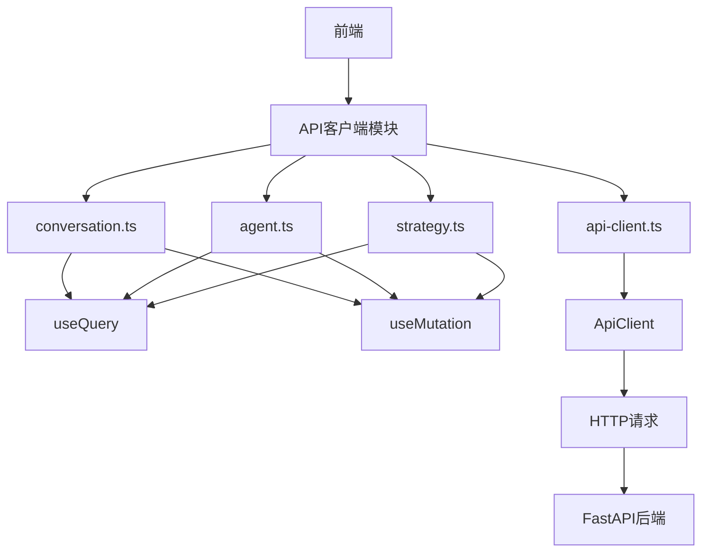
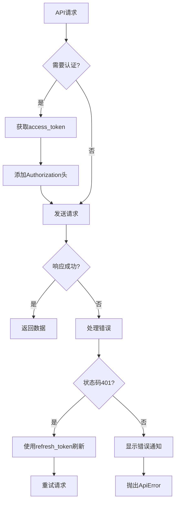
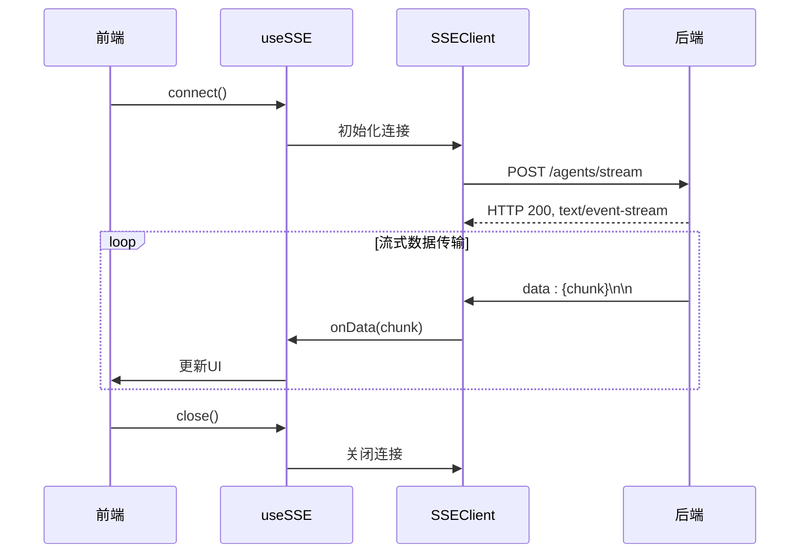
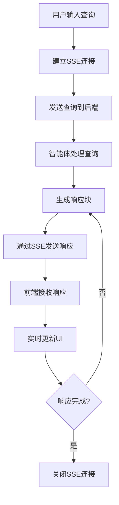

# API集成

<cite>
**本文档引用的文件**   
- [conversation.ts](file://frontend/src/api/conversation.ts)
- [agent.ts](file://frontend/src/api/agent.ts)
- [strategy.ts](file://frontend/src/api/strategy.ts)
- [api-client.ts](file://frontend/src/lib/api-client.ts)
- [use-sse.ts](file://frontend/src/hooks/use-sse.ts)
- [agent_stream.py](file://python/valuecell/server/api/routers/agent_stream.py)
- [conversation.py](file://python/valuecell/server/api/routers/conversation.py)
- [agent.py](file://python/valuecell/server/api/routers/agent.py)
- [strategy.py](file://python/valuecell/server/api/routers/strategy.py)
- [conversation.py](file://python/valuecell/server/api/schemas/conversation.py)
- [agent.py](file://python/valuecell/server/api/schemas/agent.py)
- [strategy.py](file://python/valuecell/server/api/schemas/strategy.py)
</cite>

## 目录
1. [API集成概述](#api集成概述)
2. [API客户端模块封装](#api客户端模块封装)
3. [认证机制与错误处理](#认证机制与错误处理)
4. [SSE流式响应处理](#sse流式响应处理)
5. [智能体对话场景中的SSE应用](#智能体对话场景中的sse应用)
6. [请求重试策略与缓存管理](#请求重试策略与缓存管理)
7. [性能监控与WebSocket替代方案](#性能监控与websocket替代方案)

## API集成概述

本文档详细介绍了ValueCell项目中前端与FastAPI后端的通信机制。系统采用模块化的API客户端设计，通过React Query进行数据获取和状态管理，实现了conversation、agent、strategy等核心模块的封装。API通信基于RESTful设计原则，同时利用Server-Sent Events（SSE）技术实现智能体对话的实时流式响应。

系统架构采用分层设计，前端通过api-client.ts统一处理HTTP请求，各业务模块（如conversation.ts、agent.ts、strategy.ts）封装特定的API调用逻辑。后端使用FastAPI框架，通过agent_stream.py等路由处理流式请求，conversation.py、agent.py、strategy.py等模块提供RESTful API接口。数据传输遵循统一的响应格式，包含code、data、msg字段，确保前后端通信的一致性和可预测性。

**Section sources**
- [conversation.ts](file://frontend/src/api/conversation.ts)
- [agent.ts](file://frontend/src/api/agent.ts)
- [strategy.ts](file://frontend/src/api/strategy.ts)
- [agent_stream.py](file://python/valuecell/server/api/routers/agent_stream.py)
- [conversation.py](file://python/valuecell/server/api/routers/conversation.py)
- [agent.py](file://python/valuecell/server/api/routers/agent.py)
- [strategy.py](file://python/valuecell/server/api/routers/strategy.py)

## API客户端模块封装

API客户端采用模块化设计，每个业务领域都有独立的API模块，如conversation.ts、agent.ts和strategy.ts，这些模块使用React Query的useQuery和useMutation钩子封装数据获取和变更操作。

conversation模块提供会话管理功能，包括获取会话列表(useGetConversationList)、获取会话历史(useGetConversationHistory)、删除会话(useDeleteConversation)等。agent模块处理智能体相关操作，如获取智能体信息(useGetAgentInfo)、获取智能体列表(useGetAgentList)和启用/禁用智能体(useEnableAgent)。strategy模块管理交易策略，提供获取策略列表(useGetStrategyList)、创建策略(useCreateStrategy)、停止策略(useStopStrategy)等功能。

这些API模块通过api-client.ts中的ApiClient类进行HTTP通信，该类封装了请求的通用逻辑，包括认证头添加、错误处理和响应解析。各模块使用API_QUERY_KEYS常量定义查询键，便于React Query进行缓存管理和数据失效处理。

**Diagram sources **
- [conversation.ts](file://frontend/src/api/conversation.ts#L10-L82)
- [agent.ts](file://frontend/src/api/agent.ts#L7-L57)
- [strategy.ts](file://frontend/src/api/strategy.ts#L14-L179)
- [api-client.ts](file://frontend/src/lib/api-client.ts#L41-L185)

**Section sources**
- [conversation.ts](file://frontend/src/api/conversation.ts)
- [agent.ts](file://frontend/src/api/agent.ts)
- [strategy.ts](file://frontend/src/api/strategy.ts)
- [api-client.ts](file://frontend/src/lib/api-client.ts)

## 认证机制与错误处理

系统采用Bearer Token认证机制，通过access_token和refresh_token实现安全的API访问。认证信息存储在system-store中，由ApiClient在请求时自动添加到Authorization头。当access_token过期时，系统会自动使用refresh_token获取新的访问令牌，确保用户体验的连续性。

错误处理机制在api-client.ts中实现，通过ApiError类封装HTTP错误，包含状态码和详细信息。系统使用toast通知向用户展示错误信息，对于401未授权错误，会尝试自动刷新令牌。API响应遵循统一格式，包含code、data和msg字段，便于前端进行一致的错误处理。

**Diagram sources **
- [api-client.ts](file://frontend/src/lib/api-client.ts#L8-L92)
- [api-client.ts](file://frontend/src/lib/api-client.ts#L113-L117)

**Section sources**
- [api-client.ts](file://frontend/src/lib/api-client.ts)

## SSE流式响应处理

系统通过Server-Sent Events（SSE）技术实现智能体对话的实时流式响应。前端使用useSSE钩子封装SSE连接逻辑，该钩子提供connect、close和isStreaming等接口，便于组件管理SSE连接状态。

后端在agent_stream.py中实现流式API，通过StreamingResponse返回text/event-stream媒体类型。stream_query_agent函数生成SSE格式的流式响应，每个数据块以"data: "前缀和双换行符结束。这种设计允许后端逐步发送响应数据，前端可以实时接收并显示。

useSSE钩子使用SSEClient类管理SSE连接，支持自定义事件处理器和连接选项。该实现避免了闭包问题，通过ref保持对最新事件处理器的引用，确保事件处理的正确性。连接状态通过isStreaming状态变量暴露，便于UI根据连接状态进行相应更新。

**Diagram sources **
- [use-sse.ts](file://frontend/src/hooks/use-sse.ts#L29-L91)
- [agent_stream.py](file://python/valuecell/server/api/routers/agent_stream.py#L31-L63)

**Section sources**
- [use-sse.ts](file://frontend/src/hooks/use-sse.ts)
- [agent_stream.py](file://python/valuecell/server/api/routers/agent_stream.py)

## 智能体对话场景中的SSE应用

在智能体对话场景中，SSE被用于实现实时的对话流式响应。当用户在聊天界面输入查询时，系统通过SSE连接发送请求，后端智能体逐步生成响应并通过SSE流式返回。

前端在chat.tsx组件中根据智能体类型渲染不同的对话界面，如StrategyAgentArea或CommonAgentArea。这些组件使用useSSE钩子建立与后端的SSE连接，实时接收并显示智能体的响应。流式响应允许用户在内容生成过程中就看到部分结果，提升了交互体验。

后端的agent_stream_service处理智能体查询，通过流式生成器逐步返回响应块。每个响应块包含事件类型和数据，前端根据事件类型进行相应的UI更新。这种设计特别适合智能体生成长篇内容的场景，用户无需等待完整响应生成即可开始阅读。

**Diagram sources **
- [chat.tsx](file://frontend/src/app/agent/chat.tsx#L1-L24)
- [use-sse.ts](file://frontend/src/hooks/use-sse.ts#L29-L91)
- [agent_stream.py](file://python/valuecell/server/api/routers/agent_stream.py#L31-L63)

**Section sources**
- [chat.tsx](file://frontend/src/app/agent/chat.tsx)
- [use-sse.ts](file://frontend/src/hooks/use-sse.ts)
- [agent_stream.py](file://python/valuecell/server/api/routers/agent_stream.py)

## 请求重试策略与缓存管理

系统通过React Query实现智能的缓存管理和请求重试策略。每个useQuery调用都定义了查询键，React Query基于这些键自动管理缓存数据。当数据失效时，系统会自动重新获取，确保UI显示最新信息。

对于会话和策略等频繁更新的数据，系统设置了较短的refetchInterval（如5秒），确保数据的实时性。当执行变更操作（如创建策略或删除会话）时，相关查询会通过invalidateQueries失效，触发自动重新获取，保证数据一致性。

错误请求的重试策略由React Query配置，对于临时性错误会自动重试。同时，系统通过queryClient的缓存机制减少不必要的网络请求，提升性能和用户体验。这种缓存与失效的组合策略，既保证了数据的实时性，又避免了过度的网络请求。

**Section sources**
- [conversation.ts](file://frontend/src/api/conversation.ts)
- [strategy.ts](file://frontend/src/api/strategy.ts)

## 性能监控与WebSocket替代方案

系统通过多种机制实现性能监控和优化。React Query的devtools提供了详细的请求和缓存状态监控，便于开发人员分析性能瓶颈。前端通过useQuery的refetchInterval配置实现数据的定期刷新，同时避免过度请求。

与WebSocket相比，SSE方案具有简化实现、更好的浏览器兼容性和更低的服务器资源消耗等优势。SSE基于HTTP协议，无需维护长连接，更适合当前的智能体对话场景。虽然WebSocket提供双向通信能力，但本系统主要需要服务器向客户端的单向流式传输，SSE是更合适的选择。

对于未来可能需要双向通信的场景，系统架构支持扩展WebSocket支持。当前的SSE实现已经满足了智能体对话的主要需求，提供了良好的用户体验和系统性能。

**Section sources**
- [use-sse.ts](file://frontend/src/hooks/use-sse.ts)
- [agent_stream.py](file://python/valuecell/server/api/routers/agent_stream.py)