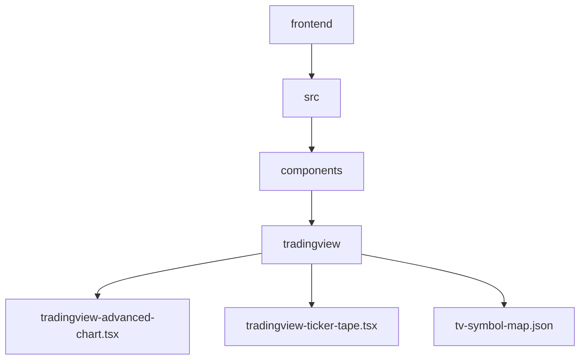
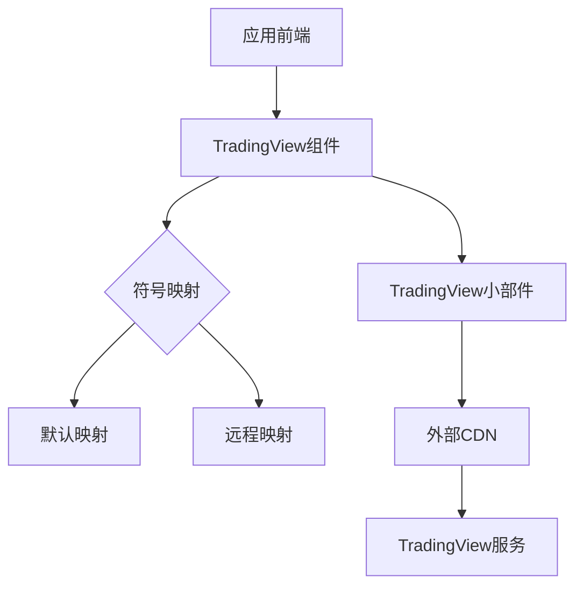
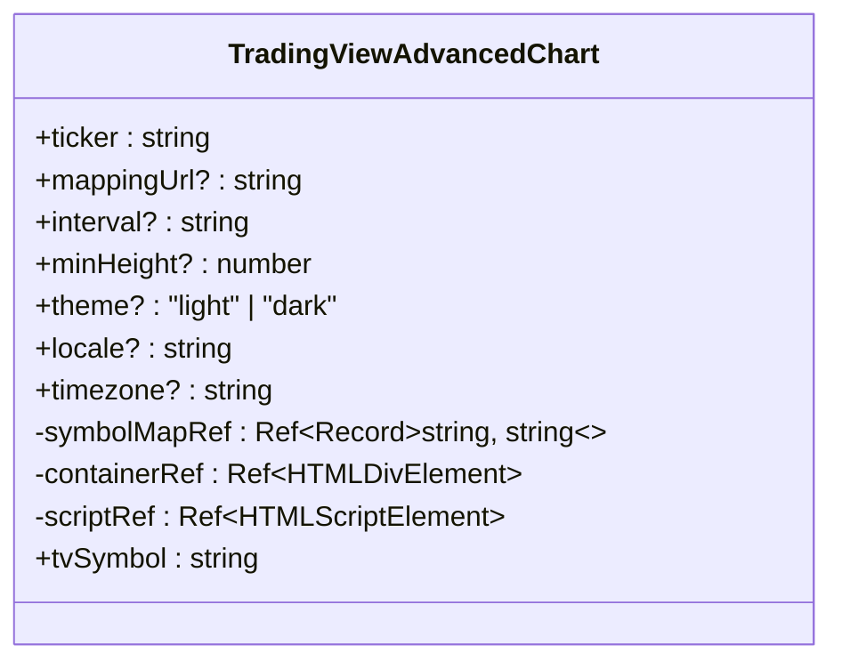
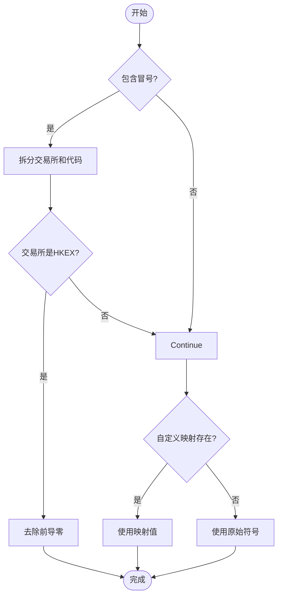
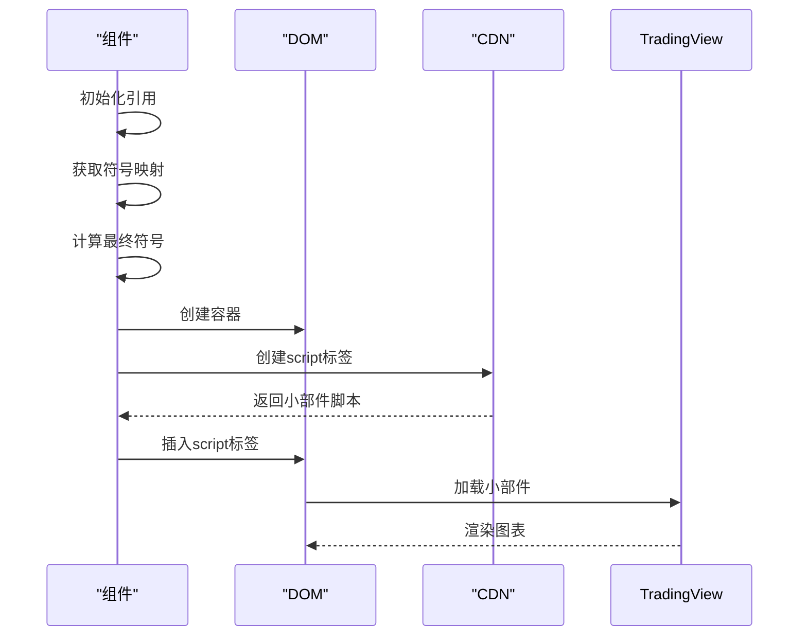
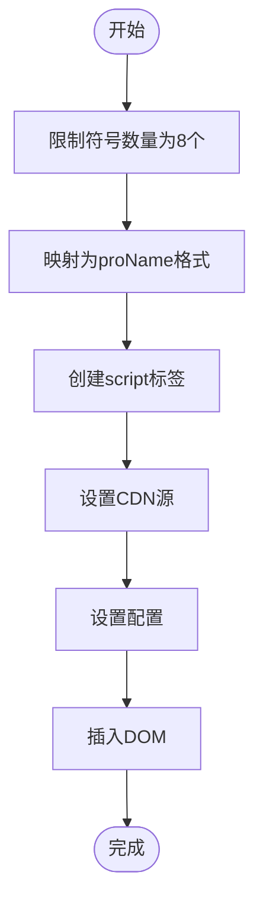
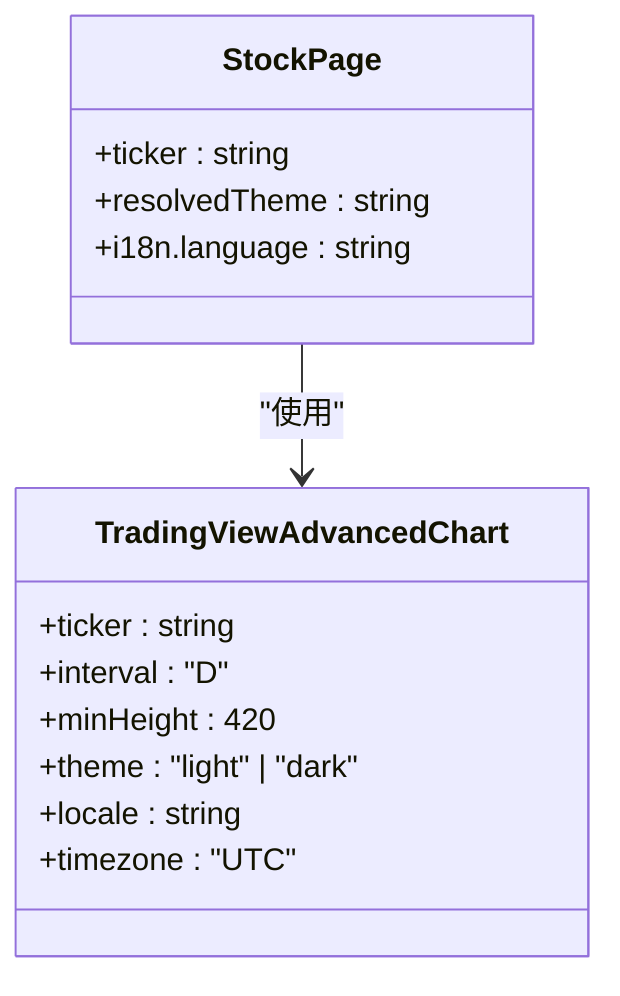
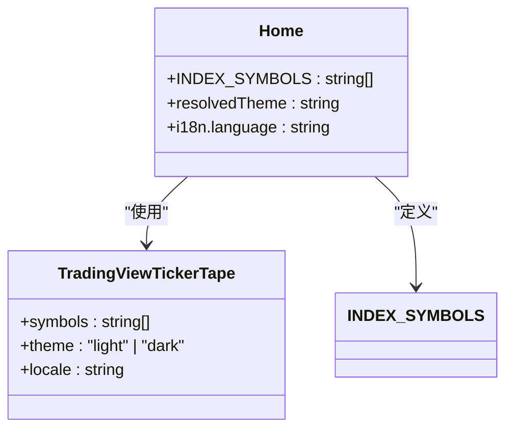
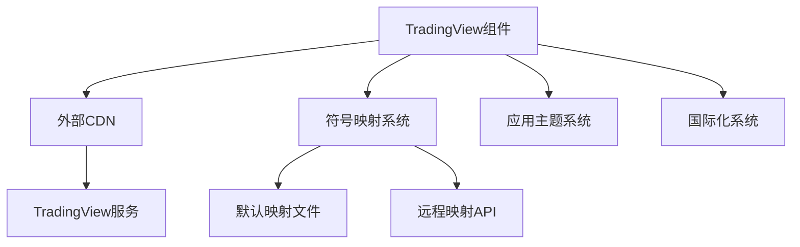

# TradingView 集成

<cite>
**本文档引用的文件**  
- [tradingview-advanced-chart.tsx](file://frontend/src/components/tradingview/tradingview-advanced-chart.tsx)
- [tradingview-ticker-tape.tsx](file://frontend/src/components/tradingview/tradingview-ticker-tape.tsx)
- [tv-symbol-map.json](file://frontend/src/components/tradingview/tv-symbol-map.json)
- [stock.tsx](file://frontend/src/app/home/stock.tsx)
- [home.tsx](file://frontend/src/app/home/home.tsx)
- [stock.ts](file://frontend/src/types/stock.ts)
- [stock.tsx](file://frontend/src/app/home/components/stock-history-chart.tsx)
- [stock.ts](file://frontend/src/api/stock.ts)
</cite>

## 目录
1. [简介](#简介)
2. [项目结构](#项目结构)
3. [核心组件](#核心组件)
4. [架构概述](#架构概述)
5. [详细组件分析](#详细组件分析)
6. [依赖分析](#依赖分析)
7. [性能考虑](#性能考虑)
8. [故障排除指南](#故障排除指南)
9. [结论](#结论)

## 简介
本文档详细介绍了ValueCell项目中TradingView的集成实现。该集成主要通过两个核心组件实现：高级图表组件和行情条组件。这些组件为用户提供专业的金融图表功能，支持股票、加密货币等多种资产类型，并实现了与应用主题、语言设置的无缝集成。

## 项目结构
TradingView集成相关文件位于前端组件目录下的专用文件夹中，采用模块化设计，包含图表组件、配置映射和相关工具。



**图表来源**  
- [tradingview-advanced-chart.tsx](file://frontend/src/components/tradingview/tradingview-advanced-chart.tsx)
- [tradingview-ticker-ticker-tape.tsx](file://frontend/src/components/tradingview/tradingview-ticker-tape.tsx)

**章节来源**  
- [tradingview-advanced-chart.tsx](file://frontend/src/components/tradingview/tradingview-advanced-chart.tsx#L1-L143)
- [tradingview-ticker-tape.tsx](file://frontend/src/components/tradingview/tradingview-ticker-tape.tsx#L1-L71)

## 核心组件
TradingView集成包含两个主要组件：高级图表组件和行情条组件。高级图表组件提供完整的K线图功能，支持技术分析和交互式操作；行情条组件则在应用顶部显示主要指数和加密货币的实时行情。

**章节来源**  
- [tradingview-advanced-chart.tsx](file://frontend/src/components/tradingview/tradingview-advanced-chart.tsx#L1-L143)
- [tradingview-ticker-tape.tsx](file://frontend/src/components/tradingview/tradingview-ticker-tape.tsx#L1-L71)

## 架构概述
TradingView集成采用嵌入式小部件架构，通过动态加载TradingView提供的JavaScript小部件来实现功能。组件通过配置映射处理不同数据源的符号转换，确保与后端数据的一致性。



**图表来源**  
- [tradingview-advanced-chart.tsx](file://frontend/src/components/tradingview/tradingview-advanced-chart.tsx#L71-L143)
- [tradingview-ticker-tape.tsx](file://frontend/src/components/tradingview/tradingview-ticker-tape.tsx#L32-L47)

## 详细组件分析

### 高级图表组件分析
高级图表组件是TradingView集成的核心，提供专业的金融图表功能。组件通过props接收股票代码、时间间隔、主题等配置，并处理符号映射以确保与TradingView系统的兼容性。

#### 组件实现


**图表来源**  
- [tradingview-advanced-chart.tsx](file://frontend/src/components/tradingview/tradingview-advanced-chart.tsx#L4-L12)

#### 符号映射逻辑


**图表来源**  
- [tradingview-advanced-chart.tsx](file://frontend/src/components/tradingview/tradingview-advanced-chart.tsx#L44-L60)

#### 小部件加载流程


**图表来源**  
- [tradingview-advanced-chart.tsx](file://frontend/src/components/tradingview/tradingview-advanced-chart.tsx#L71-L117)

**章节来源**  
- [tradingview-advanced-chart.tsx](file://frontend/src/components/tradingview/tradingview-advanced-chart.tsx#L1-L143)

### 行情条组件分析
行情条组件提供简洁的实时行情显示，通常用于展示主要指数和加密货币的价格变动。

#### 组件实现
```mermaid
classDiagram
class TradingViewTickerTape {
+symbols : string[]
+theme? : "light" | "dark"
+locale? : string
-containerRef : Ref~HTMLDivElement~
-scriptRef : Ref~HTMLScriptElement~
+tapeSymbols : {proName : string}[]
}
```

**图表来源**  
- [tradingview-ticker-tape.tsx](file://frontend/src/components/tradingview/tradingview-ticker-tape.tsx#L3-L7)

#### 数据处理流程


**图表来源**  
- [tradingview-ticker-tape.tsx](file://frontend/src/components/tradingview/tradingview-ticker-tape.tsx#L17-L20)

**章节来源**  
- [tradingview-ticker-tape.tsx](file://frontend/src/components/tradingview/tradingview-ticker-tape.tsx#L1-L71)

### 集成使用示例
高级图表组件在股票详情页面中使用，提供完整的图表功能。



**图表来源**  
- [stock.tsx](file://frontend/src/app/home/stock.tsx#L87-L94)

**章节来源**  
- [stock.tsx](file://frontend/src/app/home/stock.tsx#L63-L105)

行情条组件在首页中使用，展示主要指数和加密货币行情。



**图表来源**  
- [home.tsx](file://frontend/src/app/home/home.tsx#L20-L28)
- [home.tsx](file://frontend/src/app/home/home.tsx#L90-L94)

**章节来源**  
- [home.tsx](file://frontend/src/app/home/home.tsx#L1-L150)

## 依赖分析
TradingView集成依赖于外部CDN服务和内部符号映射系统，确保数据的一致性和可用性。



**图表来源**  
- [tradingview-advanced-chart.tsx](file://frontend/src/components/tradingview/tradingview-advanced-chart.tsx#L74-L75)
- [tradingview-ticker-tape.tsx](file://frontend/src/components/tradingview/tradingview-ticker-tape.tsx#L35-L36)

**章节来源**  
- [tradingview-advanced-chart.tsx](file://frontend/src/components/tradingview/tradingview-advanced-chart.tsx#L1-L143)
- [tradingview-ticker-tape.tsx](file://frontend/src/components/tradingview/tradingview-ticker-tape.tsx#L1-L71)

## 性能考虑
TradingView集成在性能方面进行了优化，包括组件记忆化、动态脚本加载和资源清理。

**章节来源**  
- [tradingview-advanced-chart.tsx](file://frontend/src/components/tradingview/tradingview-advanced-chart.tsx#L143)
- [tradingview-ticker-tape.tsx](file://frontend/src/components/tradingview/tradingview-ticker-tape.tsx#L71)

## 故障排除指南
当TradingView组件无法正常显示时，可检查以下常见问题：

1. 网络连接是否正常，能否访问TradingView的CDN
2. 符号格式是否正确，是否需要通过映射转换
3. 组件容器是否有足够的尺寸
4. 浏览器控制台是否有JavaScript错误

**章节来源**  
- [tradingview-advanced-chart.tsx](file://frontend/src/components/tradingview/tradingview-advanced-chart.tsx#L29-L42)
- [tradingview-ticker-tape.tsx](file://frontend/src/components/tradingview/tradingview-ticker-tape.tsx#L22-L23)

## 结论
TradingView集成通过封装外部小部件，为ValueCell应用提供了专业的金融图表功能。集成设计考虑了符号映射、主题适配和性能优化，确保了良好的用户体验和系统稳定性。通过模块化组件设计，实现了代码的可维护性和可扩展性。