# UI组件库

<cite>
**本文档引用的文件**   
- [button.tsx](file://frontend/src/components/ui/button.tsx)
- [card.tsx](file://frontend/src/components/ui/card.tsx)
- [dialog.tsx](file://frontend/src/components/ui/dialog.tsx)
- [input.tsx](file://frontend/src/components/ui/input.tsx)
- [switch.tsx](file://frontend/src/components/ui/switch.tsx)
- [tabs.tsx](file://frontend/src/components/ui/tabs.tsx)
- [table.tsx](file://frontend/src/components/ui/table.tsx)
- [select.tsx](file://frontend/src/components/ui/select.tsx)
- [badge.tsx](file://frontend/src/components/ui/badge.tsx)
- [avatar.tsx](file://frontend/src/components/ui/avatar.tsx)
- [checkbox.tsx](file://frontend/src/components/ui/checkbox.tsx)
- [radio-group.tsx](file://frontend/src/components/ui/radio-group.tsx)
- [textarea.tsx](file://frontend/src/components/ui/textarea.tsx)
- [field.tsx](file://frontend/src/components/ui/field.tsx)
- [sheet.tsx](file://frontend/src/components/ui/sheet.tsx)
- [sidebar.tsx](file://frontend/src/components/ui/sidebar.tsx)
- [form](file://frontend/src/components/form)
- [agent-view](file://frontend/src/app/agent/components/agent-view)
- [strategy-items](file://frontend/src/app/agent/components/strategy-items)
- [home](file://frontend/src/app/home)
- [setting](file://frontend/src/app/setting)
</cite>

## 目录
1. [简介](#简介)
2. [项目结构](#项目结构)
3. [核心组件](#核心组件)
4. [架构概述](#架构概述)
5. [详细组件分析](#详细组件分析)
6. [依赖分析](#依赖分析)
7. [性能考虑](#性能考虑)
8. [故障排除指南](#故障排除指南)
9. [结论](#结论)

## 简介
本文档详细介绍了基于React的UI组件库，重点阐述了各种UI组件的属性、事件、样式定制和使用场景。文档还涵盖了组件库如何支持主题定制和响应式设计，并与Tauri桌面应用集成。此外，文档包含了无障碍访问（a11y）最佳实践、性能优化建议以及常见问题解决方案。

## 项目结构
该项目采用模块化结构，前端代码位于`frontend`目录下，主要组件位于`frontend/src/components/ui`目录中。组件库基于React和Radix UI构建，使用Tailwind CSS进行样式设计。

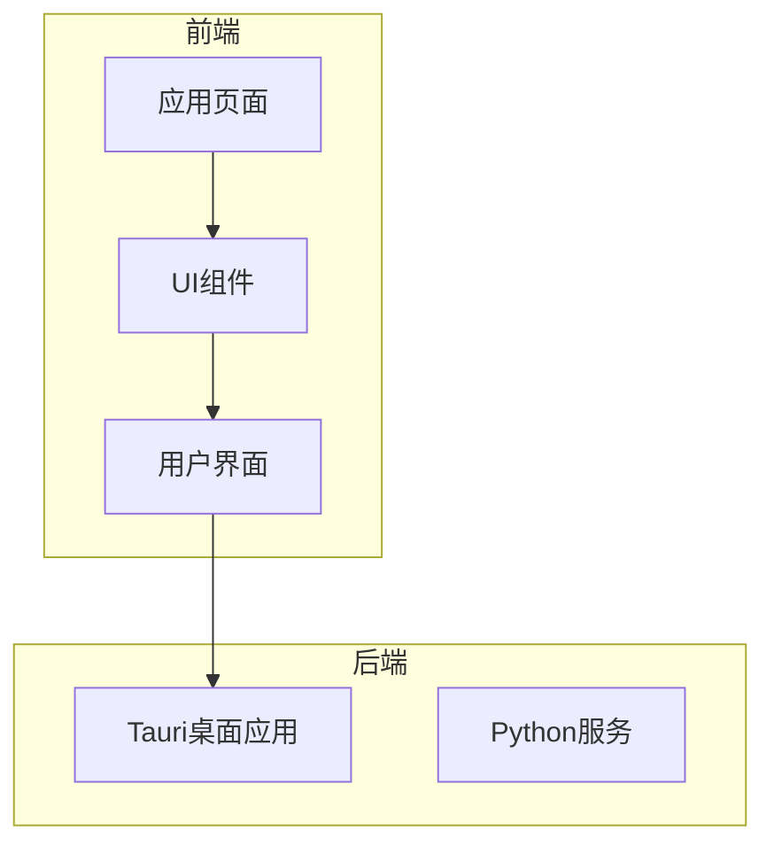

**Diagram sources**
- [button.tsx](file://frontend/src/components/ui/button.tsx)
- [card.tsx](file://frontend/src/components/ui/card.tsx)

**Section sources**
- [button.tsx](file://frontend/src/components/ui/button.tsx)
- [card.tsx](file://frontend/src/components/ui/card.tsx)

## 核心组件
UI组件库提供了丰富的基础组件，包括按钮、卡片、对话框、输入框、开关、标签页、表格等。这些组件都遵循一致的设计原则，支持主题定制和无障碍访问。

**Section sources**
- [button.tsx](file://frontend/src/components/ui/button.tsx)
- [card.tsx](file://frontend/src/components/ui/card.tsx)
- [input.tsx](file://frontend/src/components/ui/input.tsx)

## 架构概述
组件库采用分层架构，基础UI组件位于`ui`目录，业务组件位于`valuecell`目录。组件库通过`class-variance-authority`实现样式变体，通过Radix UI提供无障碍访问支持。

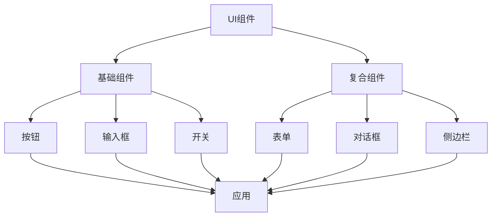

**Diagram sources**
- [button.tsx](file://frontend/src/components/ui/button.tsx)
- [input.tsx](file://frontend/src/components/ui/input.tsx)
- [switch.tsx](file://frontend/src/components/ui/switch.tsx)
- [dialog.tsx](file://frontend/src/components/ui/dialog.tsx)
- [sidebar.tsx](file://frontend/src/components/ui/sidebar.tsx)

## 详细组件分析
本节详细分析各个UI组件的实现细节、属性和使用方法。

### 按钮组件分析
按钮组件提供了多种变体和尺寸，支持图标和加载状态。

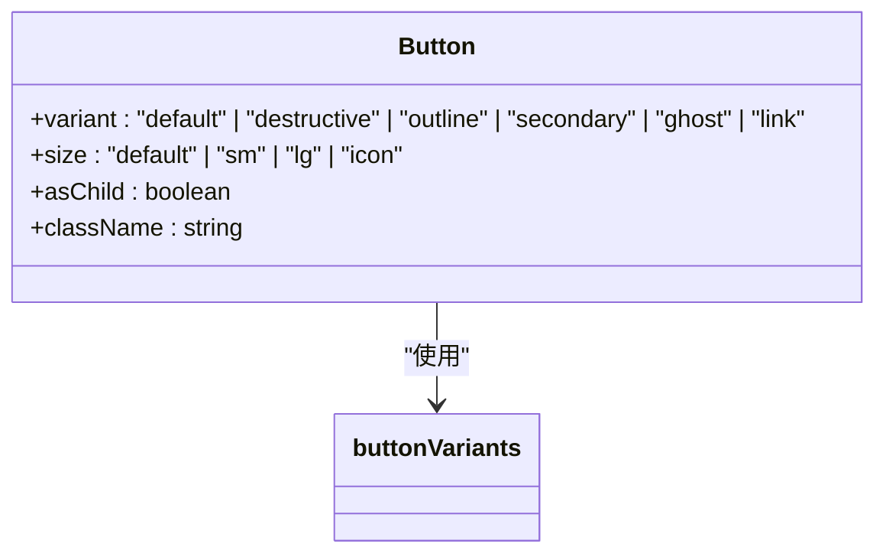

**Diagram sources**
- [button.tsx](file://frontend/src/components/ui/button.tsx#L7-L60)

**Section sources**
- [button.tsx](file://frontend/src/components/ui/button.tsx#L1-L60)

### 卡片组件分析
卡片组件提供了一套完整的卡片布局系统，包括标题、描述、内容和操作区域。

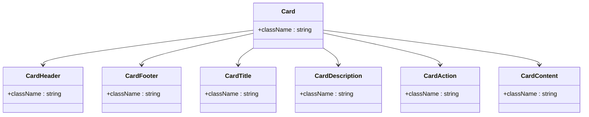

**Diagram sources**
- [card.tsx](file://frontend/src/components/ui/card.tsx#L5-L93)

**Section sources**
- [card.tsx](file://frontend/src/components/ui/card.tsx#L1-L93)

### 对话框组件分析
对话框组件提供模态对话框功能，支持自定义内容、标题和操作按钮。

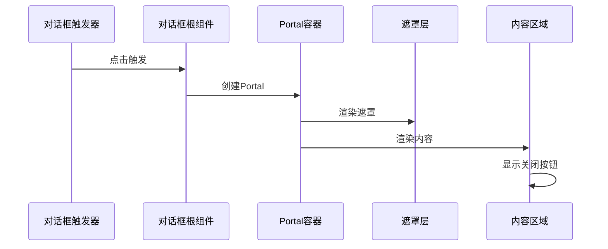

**Diagram sources**
- [dialog.tsx](file://frontend/src/components/ui/dialog.tsx#L7-L142)

**Section sources**
- [dialog.tsx](file://frontend/src/components/ui/dialog.tsx#L1-L142)

### 输入框组件分析
输入框组件提供基础输入功能，支持验证状态和焦点样式。

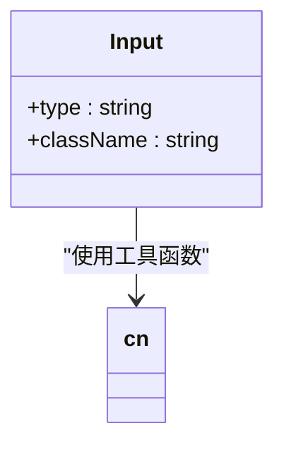

**Diagram sources**
- [input.tsx](file://frontend/src/components/ui/input.tsx#L5-L22)

**Section sources**
- [input.tsx](file://frontend/src/components/ui/input.tsx#L1-L22)

### 开关组件分析
开关组件提供布尔值切换功能，具有平滑的动画效果。

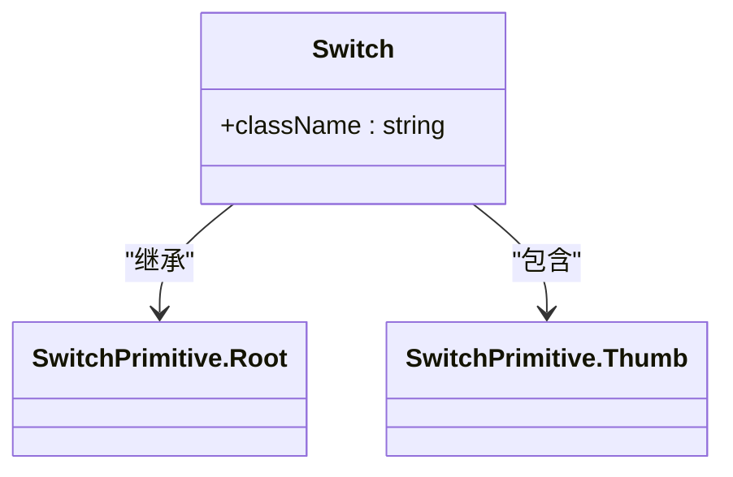

**Diagram sources**
- [switch.tsx](file://frontend/src/components/ui/switch.tsx#L6-L30)

**Section sources**
- [switch.tsx](file://frontend/src/components/ui/switch.tsx#L1-L30)

### 标签页组件分析
标签页组件提供选项卡式界面，支持水平布局和状态管理。

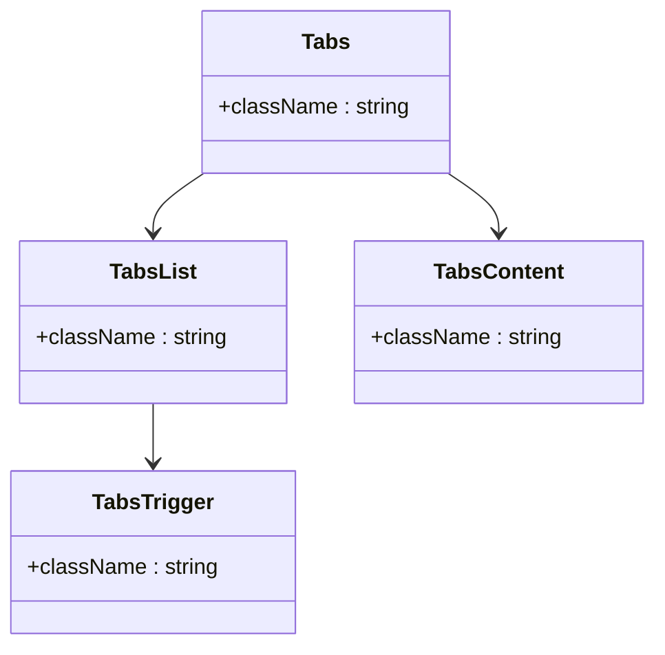

**Diagram sources**
- [tabs.tsx](file://frontend/src/components/ui/tabs.tsx#L6-L65)

**Section sources**
- [tabs.tsx](file://frontend/src/components/ui/tabs.tsx#L1-L65)

### 表格组件分析
表格组件提供完整的表格布局系统，支持表头、表体、表尾和分页。

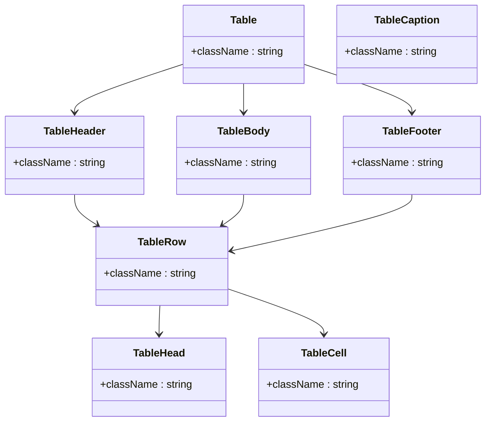

**Diagram sources**
- [table.tsx](file://frontend/src/components/ui/table.tsx#L5-L115)

**Section sources**
- [table.tsx](file://frontend/src/components/ui/table.tsx#L1-L115)

### 选择器组件分析
选择器组件提供下拉选择功能，支持滚动按钮和多种尺寸。

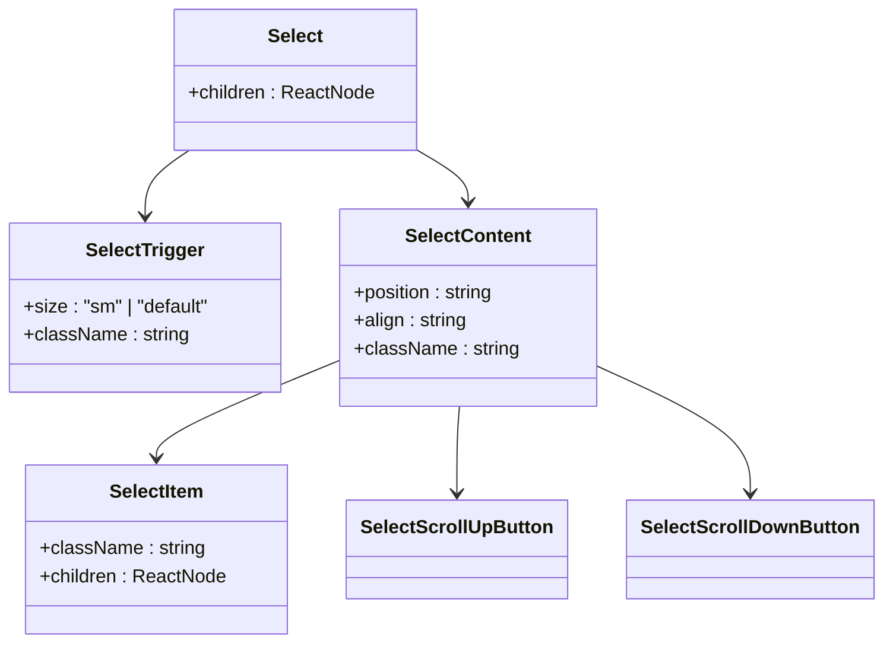

**Diagram sources**
- [select.tsx](file://frontend/src/components/ui/select.tsx#L9-L188)

**Section sources**
- [select.tsx](file://frontend/src/components/ui/select.tsx#L1-L188)

### 表单字段组件分析
表单字段组件提供结构化的表单布局，支持标签、描述、错误信息和分组。

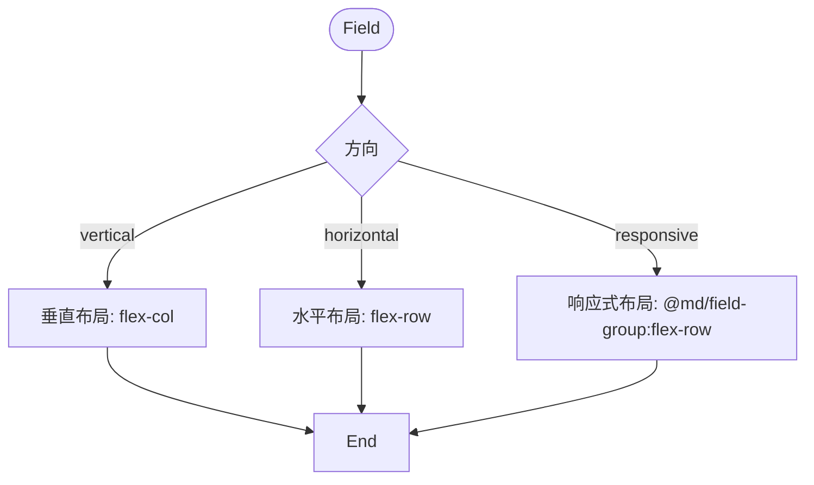

**Diagram sources**
- [field.tsx](file://frontend/src/components/ui/field.tsx#L79-L247)

**Section sources**
- [field.tsx](file://frontend/src/components/ui/field.tsx#L1-L247)

### 侧边栏组件分析
侧边栏组件提供复杂的侧边栏功能，支持折叠、移动设备适配和键盘快捷键。

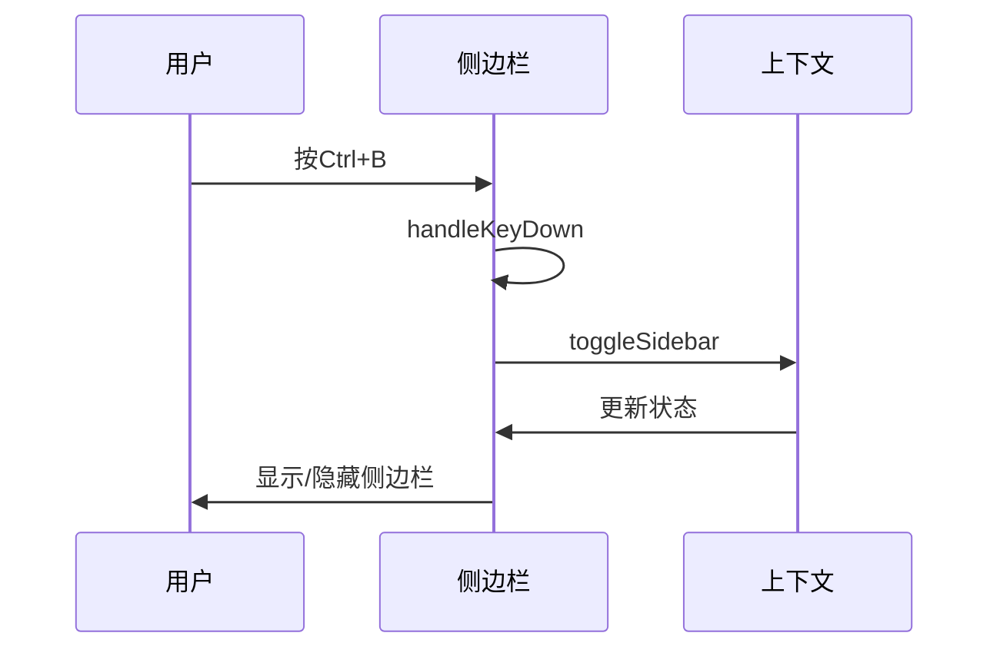

**Diagram sources**
- [sidebar.tsx](file://frontend/src/components/ui/sidebar.tsx#L154-L727)

**Section sources**
- [sidebar.tsx](file://frontend/src/components/ui/sidebar.tsx#L1-L727)

## 依赖分析
组件库依赖于多个第三方库，包括Radix UI、Lucide图标和Class Variance Authority。

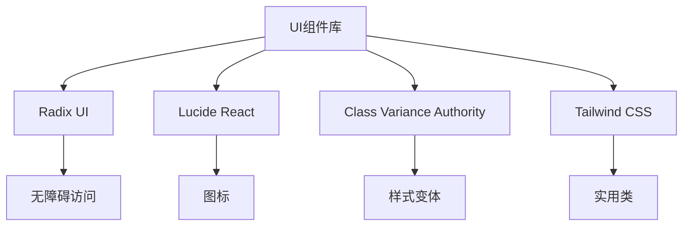

**Diagram sources**
- [package.json](file://package.json)
- [components.json](file://components.json)

**Section sources**
- [package.json](file://package.json)
- [components.json](file://components.json)

## 性能考虑
组件库在性能方面进行了优化，包括使用React.memo、useCallback和虚拟化技术。对于大型列表，建议使用虚拟滚动来提高性能。

## 故障排除指南
本节提供常见问题的解决方案。

### 模态框层级冲突
当多个模态框同时出现时，可能会发生层级冲突。解决方案是确保每个模态框都有正确的z-index值。

**Section sources**
- [dialog.tsx](file://frontend/src/components/ui/dialog.tsx#L56-L78)
- [sheet.tsx](file://frontend/src/components/ui/sheet.tsx#L54-L78)

### 表单验证处理
表单验证通过FieldError组件处理，支持单个错误和多个错误的显示。

**Section sources**
- [field.tsx](file://frontend/src/components/ui/field.tsx#L184-L233)
- [form](file://frontend/src/components/form)

## 结论
该UI组件库提供了一套完整、一致且可访问的React组件，支持主题定制和响应式设计。组件库与Tauri桌面应用集成良好，适用于构建现代化的桌面和Web应用。