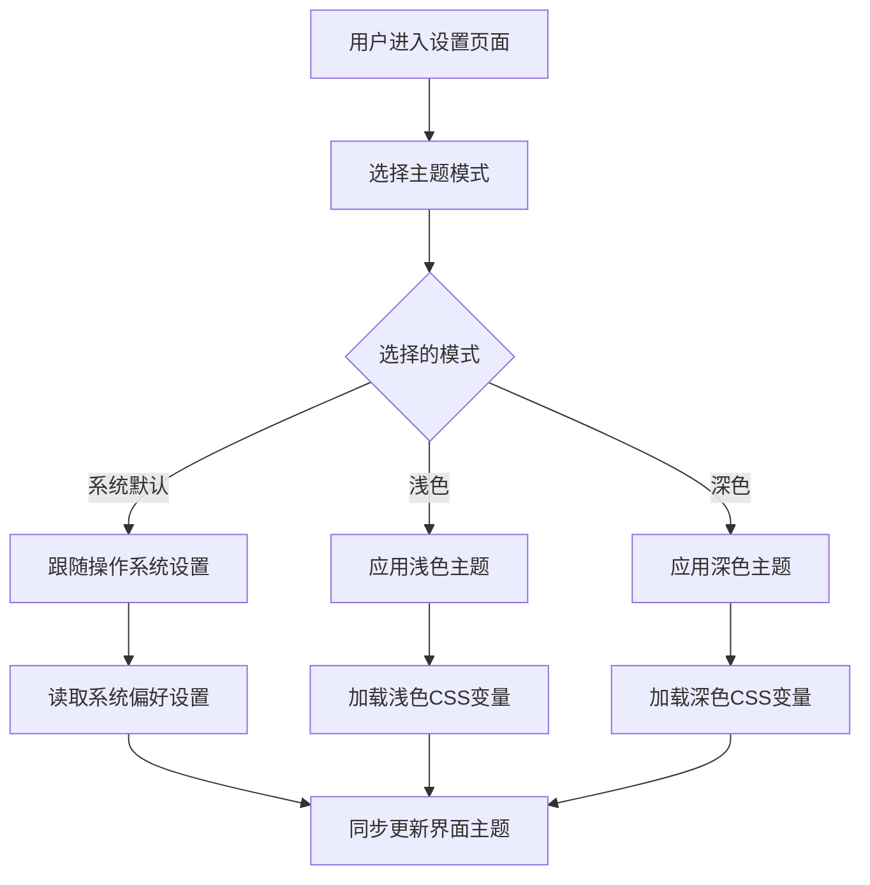
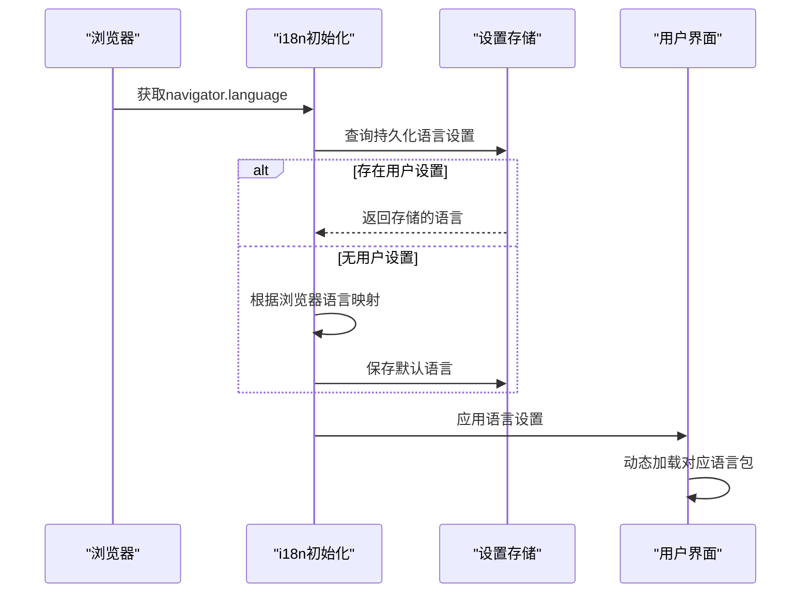
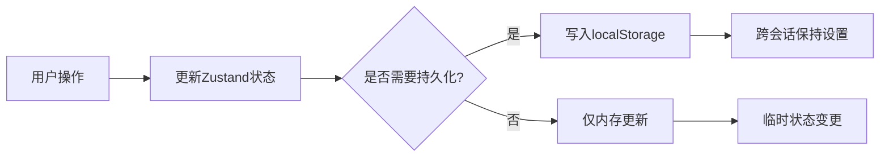

# 主题定制

<cite>
**本文档中引用的文件**  
- [general.tsx](file://frontend/src/app/setting/general.tsx)
- [settings-store.ts](file://frontend/src/store/settings-store.ts)
- [global.css](file://frontend/src/global.css)
- [root.tsx](file://frontend/src/root.tsx)
- [stock.ts](file://frontend/src/constants/stock.ts)
- [i18n](file://frontend/src/i18n/index.ts)
</cite>

## 目录
1. [简介](#简介)
2. [主题配置](#主题配置)
3. [颜色模式设置](#颜色模式设置)
4. [国际化支持](#国际化支持)
5. [状态管理与持久化](#状态管理与持久化)
6. [样式与主题变量](#样式与主题变量)

## 简介
ValueCell 是一个社区驱动的多智能体金融应用平台，支持用户自定义界面主题和显示偏好。本项目提供深色/浅色主题切换、股票涨跌颜色自定义以及多语言支持等功能，以满足不同用户的个性化需求。

**Section sources**
- [README.md](file://README.md#L38-L45)

## 主题配置
系统支持三种主题模式：跟随系统、浅色主题和深色主题。用户可以在设置页面中选择所需的主题模式，系统会自动保存选择并应用于整个应用界面。



**Diagram sources**
- [general.tsx](file://frontend/src/app/setting/general.tsx#L107-L135)
- [root.tsx](file://frontend/src/root.tsx#L52-L58)

**Section sources**
- [general.tsx](file://frontend/src/app/setting/general.tsx#L107-L135)
- [root.tsx](file://frontend/src/root.tsx#L52-L58)

## 颜色模式设置
用户可自定义股票价格变动的颜色显示方式，支持两种标准模式：

- **绿涨红跌模式**：价格上涨显示为绿色，下跌显示为红色
- **红涨绿跌模式**：价格上涨显示为红色，下跌显示为绿色

该设置会影响所有涉及股票价格变动的UI组件，包括标签、图表和表格等。

```mermaid
classDiagram
class StockColorMode {
+GREEN_UP_RED_DOWN : "GREEN_UP_RED_DOWN"
+RED_UP_GREEN_DOWN : "RED_UP_GREEN_DOWN"
}
class SettingsStoreState {
-stockColorMode : StockColorMode
+setStockColorMode(mode : StockColorMode) : void
}
class UseStockColors {
+useStockColors() : Record~StockChangeType, string~
+useStockGradientColors() : Record~StockChangeType, [string, string]~
+useStockBadgeColors() : Record~StockChangeType, { bg : string; text : string }~
}
SettingsStoreState --> StockColorMode : "使用"
UseStockColors --> SettingsStoreState : "读取"
```

**Diagram sources**
- [settings-store.ts](file://frontend/src/store/settings-store.ts#L18-L144)
- [stock.ts](file://frontend/src/constants/stock.ts#L1-L21)

**Section sources**
- [settings-store.ts](file://frontend/src/store/settings-store.ts#L18-L144)
- [stock.ts](file://frontend/src/constants/stock.ts#L1-L21)

## 国际化支持
系统支持多语言界面显示，当前包含以下语言选项：

- 英语 (English)
- 简体中文 (简体中文)
- 繁体中文 (繁體中文)
- 日语 (日本語)

语言设置会持久化存储，并在应用重启后保持不变。系统默认根据浏览器语言环境自动选择合适的语言。



**Diagram sources**
- [i18n/index.ts](file://frontend/src/i18n/index.ts#L1-L34)
- [settings-store.ts](file://frontend/src/store/settings-store.ts#L29-L39)

**Section sources**
- [i18n/index.ts](file://frontend/src/i18n/index.ts#L1-L34)
- [settings-store.ts](file://frontend/src/store/settings-store.ts#L29-L39)

## 状态管理与持久化
系统使用 Zustand 进行全局状态管理，并通过持久化中间件将用户设置保存到本地存储中。所有主题相关的设置都会在用户操作后立即保存，确保设置的持久性和一致性。



**Diagram sources**
- [settings-store.ts](file://frontend/src/store/settings-store.ts#L49-L65)

**Section sources**
- [settings-store.ts](file://frontend/src/store/settings-store.ts#L49-L65)

## 样式与主题变量
系统采用 CSS 自定义属性（CSS Variables）实现主题样式管理，通过动态切换 CSS 类来实现主题变换。所有颜色值均定义在全局 CSS 文件中，并支持深色/浅色模式的自动适配。

```mermaid
erDiagram
THEME_VARIABLES {
string background
string foreground
string primary
string secondary
string accent
string destructive
string border
string input
string ring
string radius
}
DARK_THEME {
string background: oklch(0.145 0 0)
string foreground: oklch(0.985 0 0)
string primary: oklch(0.922 0 0)
string secondary: oklch(0.269 0 0)
}
LIGHT_THEME {
string background: oklch(1 0 0)
string foreground: oklch(0.145 0 0)
string primary: oklch(0.205 0 0)
string secondary: oklch(0.97 0 0)
}
THEME_VARIABLES ||--o{ DARK_THEME : "深色模式"
THEME_VARIABLES ||--o{ LIGHT_THEME : "浅色模式"
```

**Diagram sources**
- [global.css](file://frontend/src/global.css#L42-L107)

**Section sources**
- [global.css](file://frontend/src/global.css#L42-L107)