# 前端架构

<cite>
**本文档中引用的文件**  
- [root.tsx](file://frontend/src/root.tsx)
- [routes.ts](file://frontend/src/routes.ts)
- [package.json](file://frontend/package.json)
- [vite.config.ts](file://frontend/vite.config.ts)
- [system-store.ts](file://frontend/src/store/system-store.ts)
- [agent-store.ts](file://frontend/src/store/agent-store.ts)
- [settings-store.ts](file://frontend/src/store/settings-store.ts)
- [use-sse.ts](file://frontend/src/hooks/use-sse.ts)
- [app-sidebar.tsx](file://frontend/src/components/valuecell/app/app-sidebar.tsx)
- [home.tsx](file://frontend/src/app/home/home.tsx)
- [agents.tsx](file://frontend/src/app/market/agents.tsx)
- [board.tsx](file://frontend/src/app/rank/board.tsx)
- [models.tsx](file://frontend/src/app/setting/models.tsx)
- [api-client.ts](file://frontend/src/lib/api-client.ts)
- [agent.ts](file://frontend/src/api/agent.ts)
- [conversation.ts](file://frontend/src/api/conversation.ts)
- [setting.ts](file://frontend/src/api/setting.ts)
- [strategy.ts](file://frontend/src/api/strategy.ts)
- [system.ts](file://frontend/src/api/system.ts)
- [sse-client.ts](file://frontend/src/lib/sse-client.ts)
- [tauri-store-state.ts](file://frontend/src/store/plugin/tauri-store-state.ts)
</cite>

## 目录
1. [项目结构](#项目结构)
2. [核心架构](#核心架构)
3. [状态管理](#状态管理)
4. [API客户端与数据获取](#api客户端与数据获取)
5. [主要页面与组件](#主要页面与组件)
6. [流式响应处理](#流式响应处理)
7. [Tauri原生功能集成](#tauri原生功能集成)
8. [最佳实践](#最佳实践)

## 项目结构

前端应用采用基于React和Tauri的桌面应用架构，使用React Router进行路由管理，Vite作为构建工具。项目结构清晰，按功能模块组织。

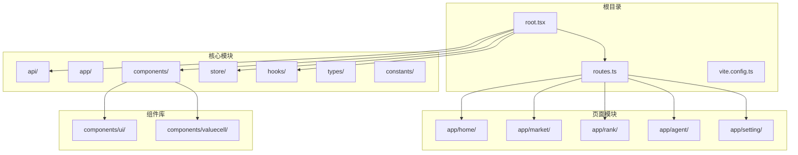

**图示来源**
- [root.tsx](file://frontend/src/root.tsx)
- [routes.ts](file://frontend/src/routes.ts)
- [package.json](file://frontend/package.json)

**本节来源**
- [root.tsx](file://frontend/src/root.tsx#L1-L72)
- [routes.ts](file://frontend/src/routes.ts#L1-L39)
- [vite.config.ts](file://frontend/vite.config.ts#L1-L100)

## 核心架构

应用采用现代化的React架构，结合Tauri提供桌面应用能力。核心架构包括路由系统、状态管理、API客户端和UI组件库。

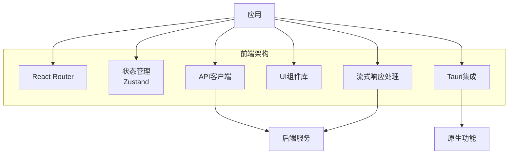

**图示来源**
- [root.tsx](file://frontend/src/root.tsx#L1-L72)
- [package.json](file://frontend/package.json#L20-L70)

**本节来源**
- [root.tsx](file://frontend/src/root.tsx#L1-L72)
- [package.json](file://frontend/package.json#L20-L70)

## 状态管理

应用使用Zustand进行状态管理，实现了多个专用的状态存储，包括系统状态、代理状态和设置状态。

### 系统状态管理

系统状态存储用户认证信息和系统配置，使用Zustand的persist中间件实现持久化存储。

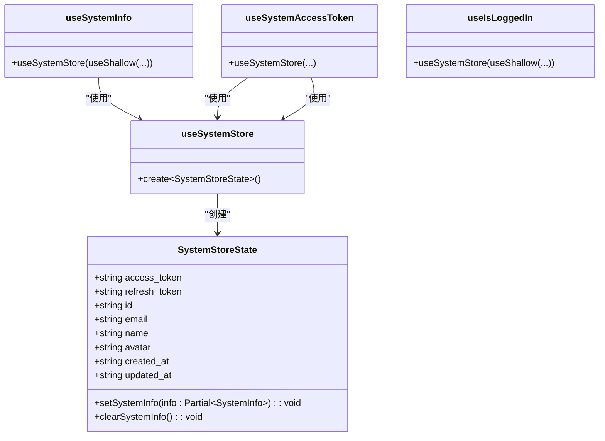

**图示来源**
- [system-store.ts](file://frontend/src/store/system-store.ts#L1-L62)

**本节来源**
- [system-store.ts](file://frontend/src/store/system-store.ts#L1-L62)

### 代理状态管理

代理状态管理聊天会话数据，支持实时更新和历史记录管理。

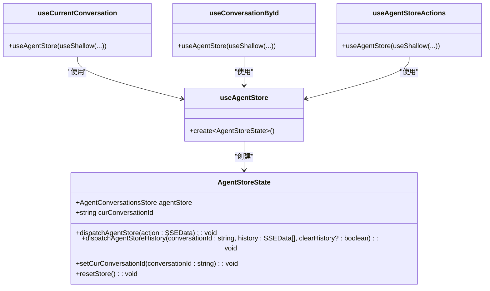

**图示来源**
- [agent-store.ts](file://frontend/src/store/agent-store.ts#L1-L77)

**本节来源**
- [agent-store.ts](file://frontend/src/store/agent-store.ts#L1-L77)

### 设置状态管理

设置状态管理用户偏好设置，如股票颜色模式，并使用持久化存储。

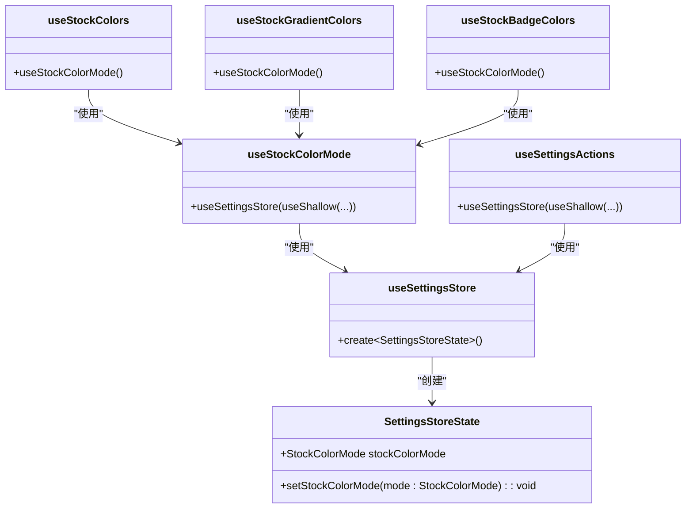

**图示来源**
- [settings-store.ts](file://frontend/src/store/settings-store.ts#L1-L118)

**本节来源**
- [settings-store.ts](file://frontend/src/store/settings-store.ts#L1-L118)

## API客户端与数据获取

应用使用自定义的API客户端与后端服务通信，结合React Query进行数据获取和缓存管理。

### API客户端实现

API客户端封装了HTTP请求，处理认证、错误和响应解析。

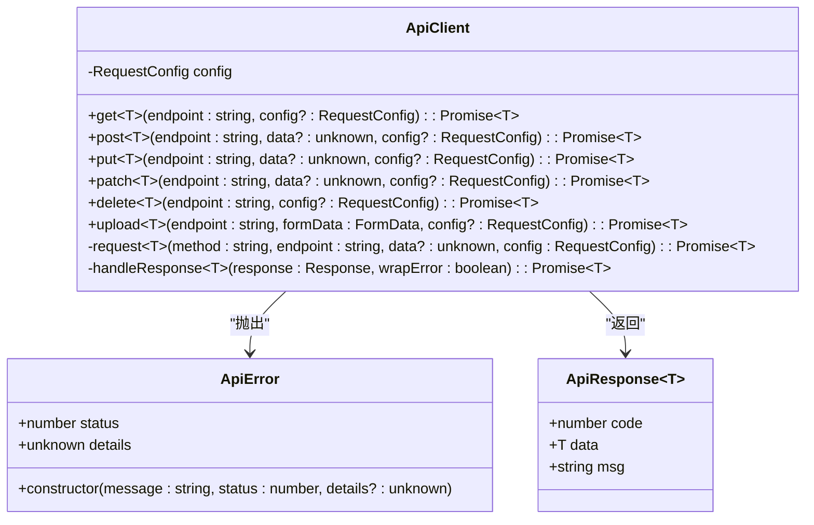

**图示来源**
- [api-client.ts](file://frontend/src/lib/api-client.ts#L1-L186)

**本节来源**
- [api-client.ts](file://frontend/src/lib/api-client.ts#L1-L186)

### 数据获取模式

应用使用React Query进行数据获取，定义了多个自定义Hook来封装API调用。

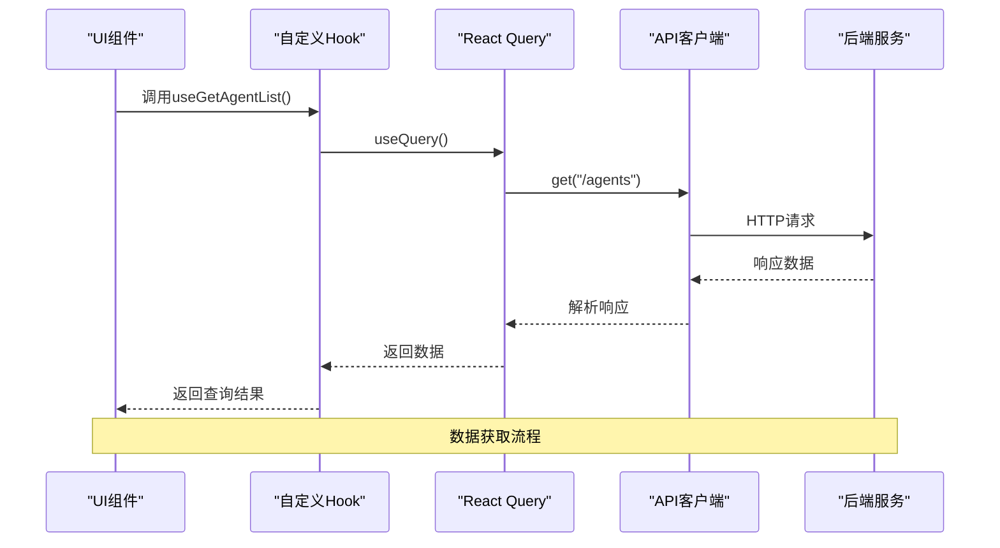

**图示来源**
- [agent.ts](file://frontend/src/api/agent.ts#L1-L57)
- [api-client.ts](file://frontend/src/lib/api-client.ts#L1-L186)

**本节来源**
- [agent.ts](file://frontend/src/api/agent.ts#L1-L57)
- [conversation.ts](file://frontend/src/api/conversation.ts)
- [setting.ts](file://frontend/src/api/setting.ts)
- [strategy.ts](file://frontend/src/api/strategy.ts)
- [system.ts](file://frontend/src/api/system.ts)

## 主要页面与组件

应用包含多个主要页面，每个页面由多个可复用的组件构成。

### 主页

主页是应用的入口，包含股票列表、代理建议和聊天输入区域。

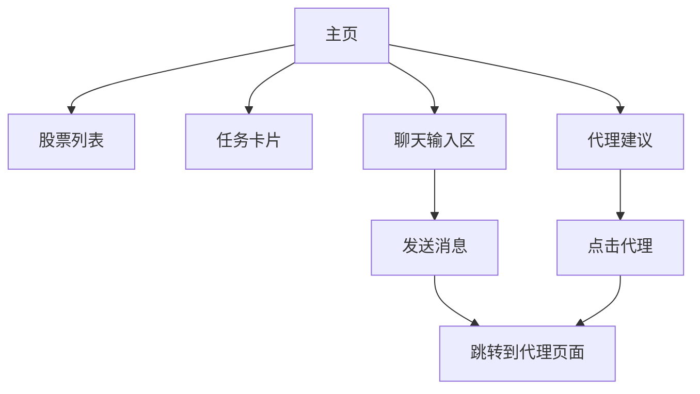

**图示来源**
- [home.tsx](file://frontend/src/app/home/home.tsx#L1-L94)

**本节来源**
- [home.tsx](file://frontend/src/app/home/home.tsx#L1-L94)

### 市场页面

市场页面展示所有可用的代理，用户可以浏览和配置不同的代理。

```mermaid
flowchart TD
Market[市场页面] --> Skeleton[加载骨架]
Market --> Grid[代理网格]
Grid --> Card[代理卡片]
Card --> Config[配置页面]
Skeleton --> Grid : "加载完成"
Grid --> Card : "遍历代理列表"
Card --> Config : "点击跳转"
```

**图示来源**
- [agents.tsx](file://frontend/src/app/market/agents.tsx#L1-L36)

**本节来源**
- [agents.tsx](file://frontend/src/app/market/agents.tsx#L1-L36)

### 排行榜页面

排行榜页面展示策略的性能排名，用户可以查看详细信息。

```mermaid
flowchart TD
Rank[排行榜页面] --> Tabs[时间选项卡]
Rank --> Table[排名表格]
Table --> Row[排名行]
Row --> Modal[详情模态框]
Tabs --> Table : "切换时间"
Table --> Row : "遍历策略列表"
Row --> Modal : "点击查看"
```

**图示来源**
- [board.tsx](file://frontend/src/app/rank/board.tsx#L1-L163)

**本节来源**
- [board.tsx](file://frontend/src/app/rank/board.tsx#L1-L163)

### 设置页面

设置页面允许用户配置系统和模型设置。

```mermaid
flowchart TD
Setting[设置页面] --> Providers[模型提供商]
Setting --> Detail[模型详情]
Providers --> Select[选择提供商]
Select --> Detail : "更新选中"
Providers --> Detail : "传递选中提供商"
Detail --> Providers : "可能更新提供商列表"
```

**图示来源**
- [models.tsx](file://frontend/src/app/setting/models.tsx#L1-L29)

**本节来源**
- [models.tsx](file://frontend/src/app/setting/models.tsx#L1-L29)

## 流式响应处理

应用使用Server-Sent Events (SSE) 处理流式响应，实现实时数据更新。

### SSE客户端实现

SSE客户端封装了EventSource API，提供更友好的接口。

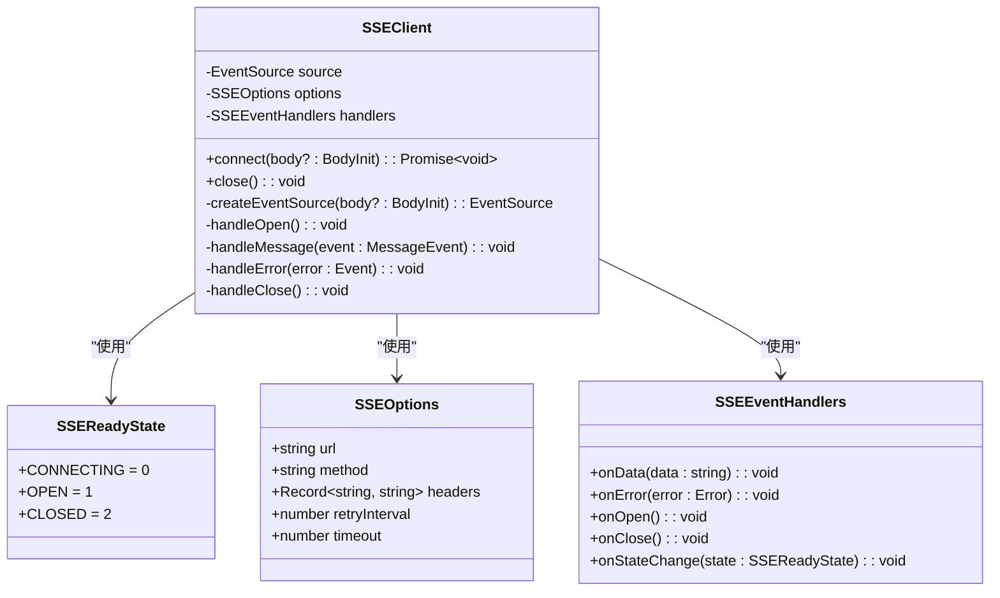

**图示来源**
- [sse-client.ts](file://frontend/src/lib/sse-client.ts)

**本节来源**
- [use-sse.ts](file://frontend/src/hooks/use-sse.ts#L1-L92)
- [sse-client.ts](file://frontend/src/lib/sse-client.ts)

### 流式响应Hook

自定义Hook封装了SSE客户端的使用，提供更简单的API。

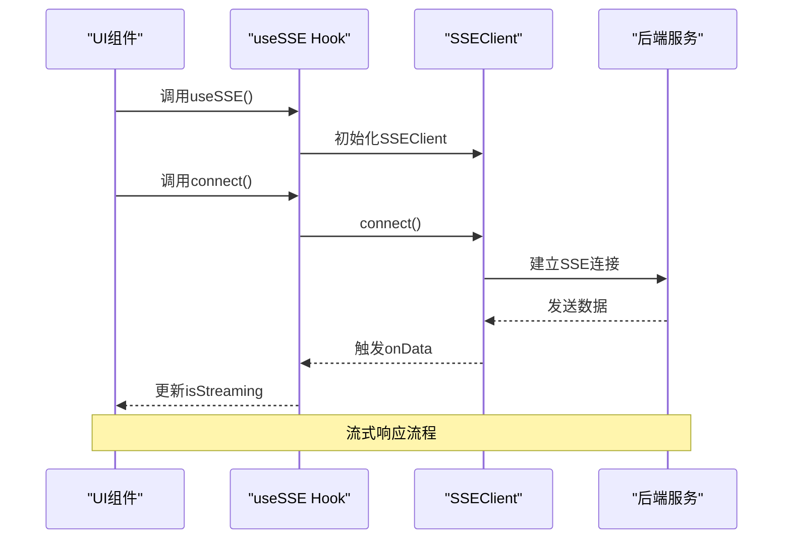

**图示来源**
- [use-sse.ts](file://frontend/src/hooks/use-sse.ts#L1-L92)

**本节来源**
- [use-sse.ts](file://frontend/src/hooks/use-sse.ts#L1-L92)

## Tauri原生功能集成

应用通过Tauri插件集成原生功能，如自动更新、健康检查和本地存储。

### Tauri存储状态

使用Tauri的store插件实现状态的本地持久化存储。

```mermaid
classDiagram
class TauriStoreState {
-string key
-Store~any~ store
+init() : Promise~void~
+get() : Promise~any~
+set(value : any) : Promise~void~
+clear() : Promise~void~
}
class useSystemStore {
+persist(..., { storage : createJSONStorage(() => store) })
}
useSystemStore --> TauriStoreState : "使用"
TauriStoreState --> "@tauri-apps/plugin-store" : "依赖"
```

**图示来源**
- [tauri-store-state.ts](file://frontend/src/store/plugin/tauri-store-state.ts)

**本节来源**
- [system-store.ts](file://frontend/src/store/system-store.ts#L1-L62)
- [tauri-store-state.ts](file://frontend/src/store/plugin/tauri-store-state.ts)

### Tauri功能组件

应用包含多个Tauri功能组件，如自动更新检查和后端健康检查。

```mermaid
flowchart TD
App[应用] --> AutoUpdate[自动更新检查]
App --> HealthCheck[后端健康检查]
App --> DeepLink[深度链接]
App --> Opener[打开器]
App --> OS[操作系统]
App --> Process[进程]
App --> Updater[更新器]
AutoUpdate --> "@tauri-apps/plugin-updater"
HealthCheck --> "后端API"
DeepLink --> "@tauri-apps/plugin-deep-link"
Opener --> "@tauri-apps/plugin-opener"
OS --> "@tauri-apps/plugin-os"
Process --> "@tauri-apps/plugin-process"
```

**图示来源**
- [root.tsx](file://frontend/src/root.tsx#L44-L45)
- [package.json](file://frontend/package.json#L42-L47)

**本节来源**
- [root.tsx](file://frontend/src/root.tsx#L44-L45)
- [auto-update-check.tsx](file://frontend/src/components/valuecell/app/auto-update-check.tsx)
- [backend-health-check.tsx](file://frontend/src/components/valuecell/app/backend-health-check.tsx)

## 最佳实践

### 组件使用示例

#### 侧边栏组件
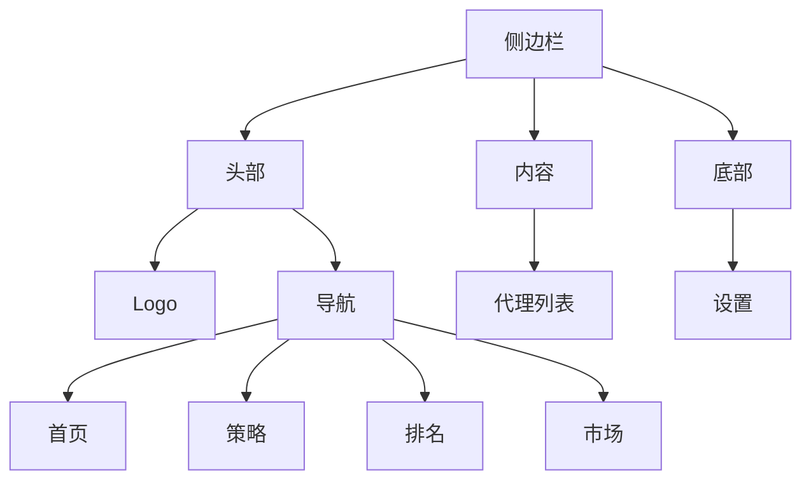

#### 聊天输入组件
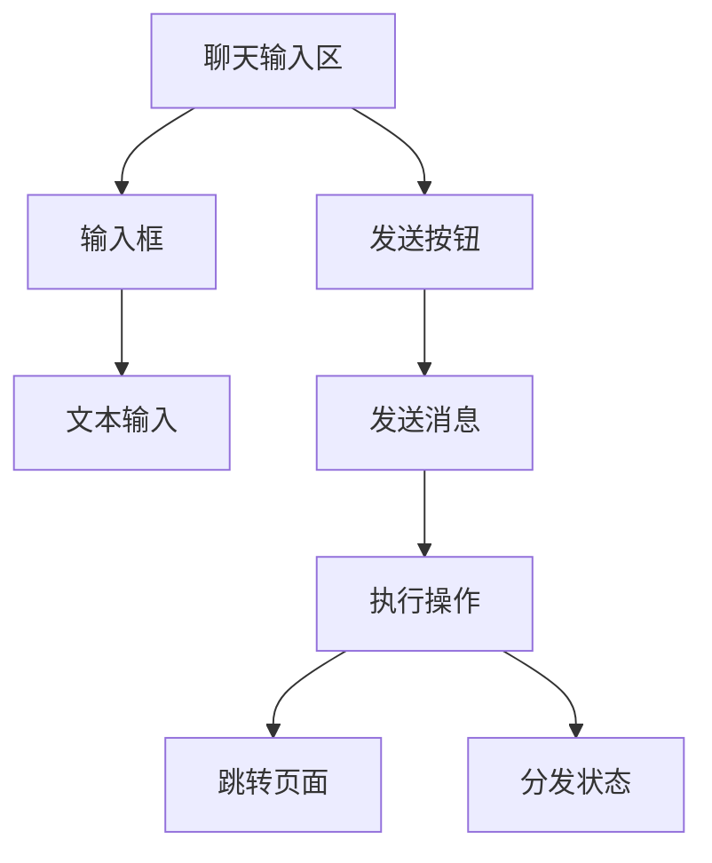

### 状态管理最佳实践

1. **单一职责原则**：每个状态存储只负责特定领域的状态
2. **持久化策略**：对需要持久化的状态使用persist中间件
3. **选择器优化**：使用useShallow进行浅比较优化性能
4. **动作封装**：将状态更新逻辑封装在store中

### Tauri集成指南

1. **插件管理**：通过package.json管理Tauri插件依赖
2. **错误处理**：妥善处理原生功能调用的可能错误
3. **性能考虑**：避免频繁调用原生API
4. **跨平台兼容**：确保功能在不同操作系统上的兼容性

**本节来源**
- [app-sidebar.tsx](file://frontend/src/components/valuecell/app/app-sidebar.tsx#L1-L273)
- [chat-input-area.tsx](file://frontend/src/app/agent/components/chat-conversation/chat-input-area.tsx)
- 所有状态管理文件
- 所有Tauri相关文件