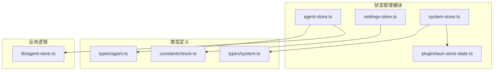
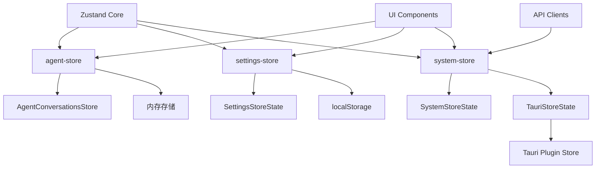
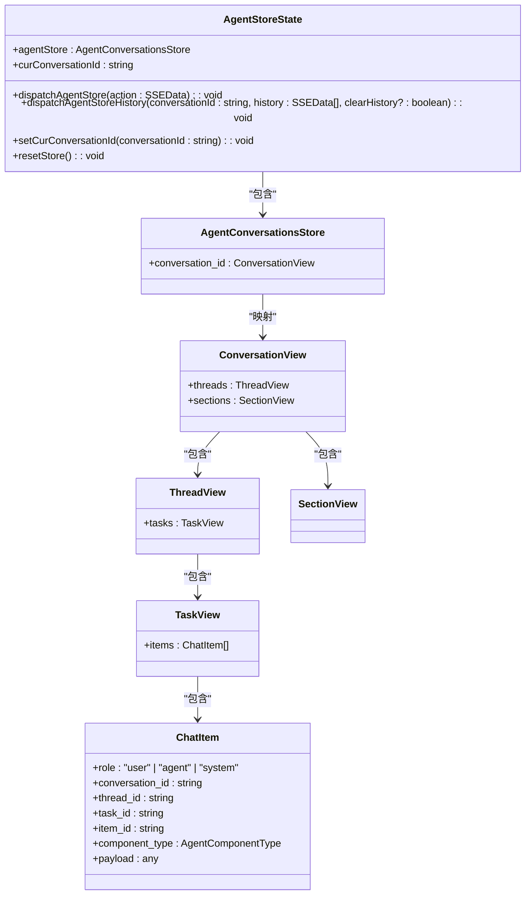
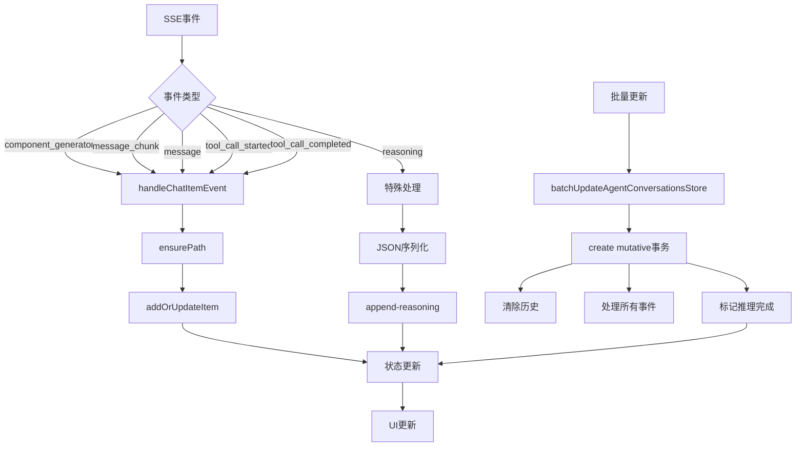

# 状态管理

<cite>
**本文档引用的文件**  
- [agent-store.ts](file://frontend/src/store/agent-store.ts)
- [settings-store.ts](file://frontend/src/store/settings-store.ts)
- [system-store.ts](file://frontend/src/store/system-store.ts)
- [tauri-store-state.ts](file://frontend/src/store/plugin/tauri-store-state.ts)
- [agent.ts](file://frontend/src/types/agent.ts)
- [system.ts](file://frontend/src/types/system.ts)
- [stock.ts](file://frontend/src/constants/stock.ts)
- [general.tsx](file://frontend/src/app/setting/general.tsx)
- [login-modal.tsx](file://frontend/src/components/valuecell/modal/login-modal.tsx)
- [lib/agent-store.ts](file://frontend/src/lib/agent-store.ts)
</cite>

## 目录
1. [简介](#简介)
2. [项目结构](#项目结构)
3. [核心组件](#核心组件)
4. [架构概述](#架构概述)
5. [详细组件分析](#详细组件分析)
6. [依赖分析](#依赖分析)
7. [性能考虑](#性能考虑)
8. [故障排除指南](#故障排除指南)
9. [结论](#结论)

## 简介
本文档详细介绍了ValueCell应用中基于Zustand的状态管理架构。重点分析了agent-store、settings-store和system-store三个核心状态模块的设计与实现，包括状态结构、更新机制和持久化策略。文档还解释了如何通过tauri-store-state实现与Tauri原生存储的集成，确保跨平台数据一致性。提供了状态订阅、异步更新和错误处理的最佳实践示例，涵盖了状态拆分原则、性能优化（如选择器使用）、调试技巧以及与其他模块（如API客户端）的交互模式。

## 项目结构
状态管理模块位于`frontend/src/store`目录下，采用模块化设计，将不同领域的状态分离到独立的store文件中。这种结构提高了代码的可维护性和可测试性，同时避免了状态的过度集中。



**Diagram sources**
- [agent-store.ts](file://frontend/src/store/agent-store.ts)
- [settings-store.ts](file://frontend/src/store/settings-store.ts)
- [system-store.ts](file://frontend/src/store/system-store.ts)
- [tauri-store-state.ts](file://frontend/src/store/plugin/tauri-store-state.ts)

**Section sources**
- [agent-store.ts](file://frontend/src/store/agent-store.ts)
- [settings-store.ts](file://frontend/src/store/settings-store.ts)
- [system-store.ts](file://frontend/src/store/system-store.ts)

## 核心组件
状态管理模块由三个核心store组成：agent-store用于管理代理会话状态，settings-store用于管理用户偏好设置，system-store用于管理系统级信息和认证状态。每个store都使用Zustand创建，具有明确的类型定义和更新机制。

**Section sources**
- [agent-store.ts](file://frontend/src/store/agent-store.ts)
- [settings-store.ts](file://frontend/src/store/settings-store.ts)
- [system-store.ts](file://frontend/src/store/system-store.ts)

## 架构概述
整个状态管理架构基于Zustand库构建，利用其轻量级、类型安全和中间件支持的特性。架构采用分层设计，将状态存储、更新逻辑和持久化机制分离，确保了代码的清晰性和可维护性。



**Diagram sources**
- [agent-store.ts](file://frontend/src/store/agent-store.ts)
- [settings-store.ts](file://frontend/src/store/settings-store.ts)
- [system-store.ts](file://frontend/src/store/system-store.ts)
- [tauri-store-state.ts](file://frontend/src/store/plugin/tauri-store-state.ts)

## 详细组件分析
本节详细分析每个核心状态管理组件的实现细节，包括状态结构、更新机制和持久化策略。

### agent-store分析
agent-store是应用中最复杂的状态模块，负责管理代理会话的完整状态，包括对话历史、任务执行和组件渲染。



**Diagram sources**
- [agent-store.ts](file://frontend/src/store/agent-store.ts)
- [types/agent.ts](file://frontend/src/types/agent.ts)

**Section sources**
- [agent-store.ts](file://frontend/src/store/agent-store.ts)
- [lib/agent-store.ts](file://frontend/src/lib/agent-store.ts)

### settings-store分析
settings-store管理用户偏好设置，特别是股票颜色模式，支持localStorage持久化。

```mermaid
classDiagram
class SettingsStoreState {
+stockColorMode : StockColorMode
+setStockColorMode(mode : StockColorMode) : void
}
class StockColorMode {
+GREEN_UP_RED_DOWN
+RED_UP_GREEN_DOWN
}
class StockColors {
+positive : string
+negative : string
+neutral : string
}
SettingsStoreState --> StockColorMode : "使用"
SettingsStoreState --> StockColors : "提供"
note right of SettingsStoreState
使用Zustand persist中间件
实现localStorage持久化
end note
```

**Diagram sources**
- [settings-store.ts](file://frontend/src/store/settings-store.ts)
- [constants/stock.ts](file://frontend/src/constants/stock.ts)

**Section sources**
- [settings-store.ts](file://frontend/src/store/settings-store.ts)

### system-store分析
system-store管理系统级信息和用户认证状态，通过Tauri原生存储实现跨平台数据持久化。

```mermaid
classDiagram
class SystemStoreState {
+access_token : string
+refresh_token : string
+id : string
+email : string
+name : string
+avatar : string
+created_at : string
+updated_at : string
+setSystemInfo(info : Partial~SystemInfo~) : void
+clearSystemInfo() : void
}
class TauriStoreState {
-store : Store | null
-debouncedSave : (() => void) | null
-initialized : boolean
+constructor(storeName : string)
+init() : Promise~void~
+getItem(name : string) : Promise~string | null~
+setItem(name : string, value : string) : Promise~void~
+removeItem(name : string) : Promise~void~
}
class StateStorage {
+getItem(name : string) : Promise~string | null~
+setItem(name : string, value : string) : Promise~void~
+removeItem(name : string) : Promise~void~
}
SystemStoreState --> TauriStoreState : "使用"
TauriStoreState --> StateStorage : "实现"
note right of TauriStoreState
使用@tauri-apps/plugin-store
提供跨平台存储能力
end note
```

**Diagram sources**
- [system-store.ts](file://frontend/src/store/system-store.ts)
- [tauri-store-state.ts](file://frontend/src/store/plugin/tauri-store-state.ts)
- [types/system.ts](file://frontend/src/types/system.ts)

**Section sources**
- [system-store.ts](file://frontend/src/store/system-store.ts)
- [tauri-store-state.ts](file://frontend/src/store/plugin/tauri-store-state.ts)

### 状态更新流程分析
agent-store的状态更新流程涉及SSE事件的处理和状态的批量更新，确保了实时通信的高效处理。



**Diagram sources**
- [lib/agent-store.ts](file://frontend/src/lib/agent-store.ts)
- [agent-store.ts](file://frontend/src/store/agent-store.ts)

**Section sources**
- [lib/agent-store.ts](file://frontend/src/lib/agent-store.ts)

## 依赖分析
状态管理模块依赖于多个外部库和内部模块，形成了清晰的依赖关系网络。

```mermaid
graph TD
A[Zustand] --> B[agent-store]
A --> C[settings-store]
A --> D[system-store]
E[zustand/middleware] --> F[devtools]
E --> G[persist]
E --> H[createJSONStorage]
F --> B
F --> C
F --> D
G --> C
H --> D
I[zustand/shallow] --> J[选择器优化]
J --> B
J --> C
J --> D
K[@tauri-apps/plugin-store] --> L[TauriStoreState]
L --> D
M[mutative] --> N[状态不可变更新]
N --> O[updateAgentConversationsStore]
N --> P[batchUpdateAgentConversationsStore]
O --> B
P --> B
```

**Diagram sources**
- [agent-store.ts](file://frontend/src/store/agent-store.ts)
- [settings-store.ts](file://frontend/src/store/settings-store.ts)
- [system-store.ts](file://frontend/src/store/system-store.ts)
- [tauri-store-state.ts](file://frontend/src/store/plugin/tauri-store-state.ts)
- [lib/agent-store.ts](file://frontend/src/lib/agent-store.ts)

**Section sources**
- [agent-store.ts](file://frontend/src/store/agent-store.ts)
- [settings-store.ts](file://frontend/src/store/settings-store.ts)
- [system-store.ts](file://frontend/src/store/system-store.ts)
- [tauri-store-state.ts](file://frontend/src/store/plugin/tauri-store-state.ts)

## 性能考虑
状态管理模块在设计时充分考虑了性能优化，采用了多种策略来确保应用的响应性和效率。

### 选择器优化
通过使用`useShallow`钩子，实现了浅比较优化，避免了不必要的组件重新渲染。当只需要访问状态的一部分时，这种优化尤为重要。

### 批量更新
对于历史数据的加载，使用`batchUpdateAgentConversationsStore`函数在单个mutative事务中处理所有事件，减少了状态更新的次数，提高了性能。

### 持久化优化
TauriStoreState类使用防抖技术来优化存储操作，避免频繁的磁盘写入，同时确保数据的最终一致性。

### 内存管理
agent-store中的会话状态在不需要时可以被重置，避免了内存泄漏。通过合理的状态生命周期管理，确保了应用的长期稳定性。

## 故障排除指南
本节提供状态管理模块常见问题的排查方法和解决方案。

### 状态更新不生效
检查是否正确使用了`set`函数来更新状态，确保在异步操作中正确处理了状态更新。

### 持久化数据丢失
验证Tauri插件是否正确初始化，检查存储路径和权限设置。在开发环境中，可以启用devtools来监控状态变化。

### 订阅失效
确保组件正确使用了选择器钩子，避免在渲染过程中创建新的选择器函数，这会导致不必要的重新订阅。

### 性能问题
使用`useShallow`或自定义选择器来减少不必要的重新渲染。对于复杂的状态访问，考虑使用记忆化技术。

**Section sources**
- [agent-store.ts](file://frontend/src/store/agent-store.ts)
- [settings-store.ts](file://frontend/src/store/settings-store.ts)
- [system-store.ts](file://frontend/src/store/system-store.ts)
- [tauri-store-state.ts](file://frontend/src/store/plugin/tauri-store-state.ts)

## 结论
ValueCell应用的状态管理架构设计合理，通过Zustand库实现了高效、类型安全的状态管理。三个核心store的分离设计提高了代码的可维护性，而Tauri原生存储的集成确保了跨平台数据的一致性。通过合理使用中间件和优化技术，架构在性能和用户体验之间取得了良好平衡。未来可以考虑进一步的状态拆分和更精细的持久化策略，以适应应用的持续发展。