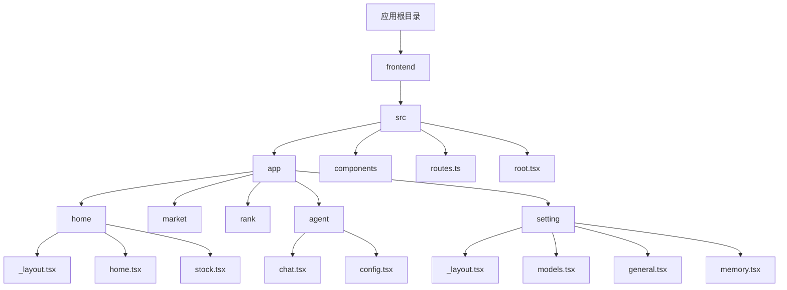
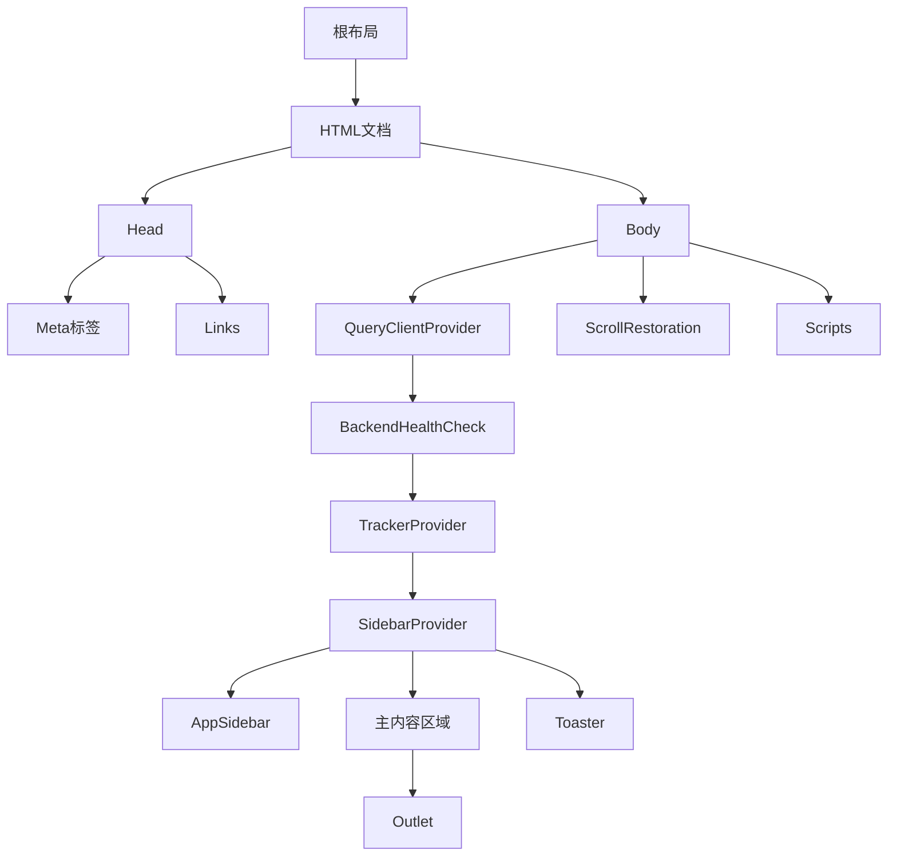
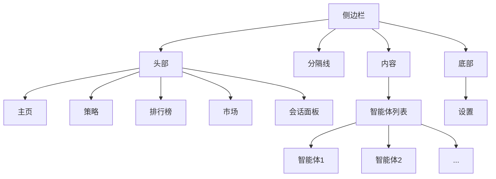
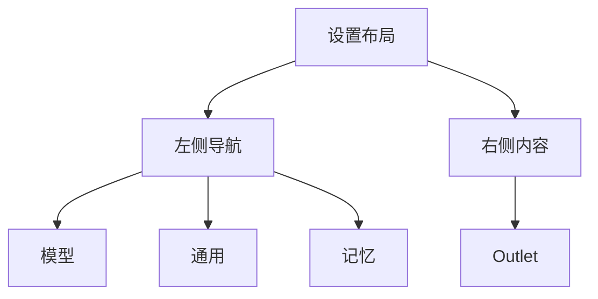
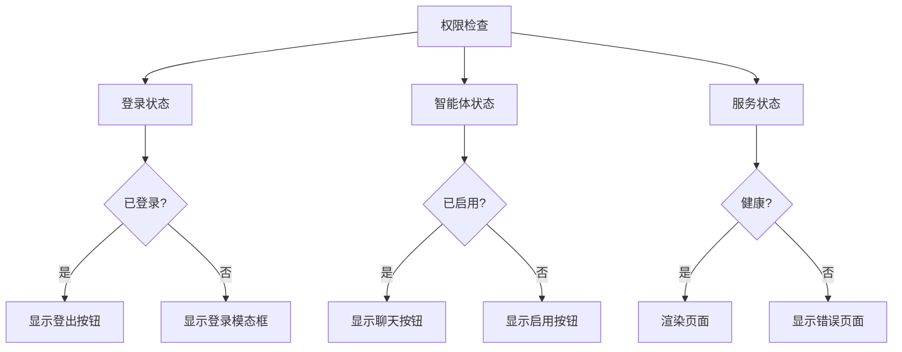
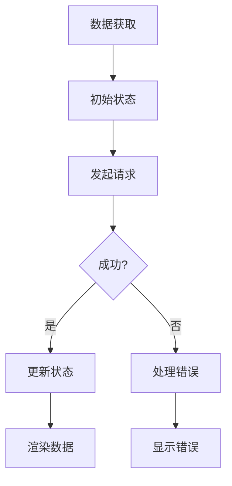
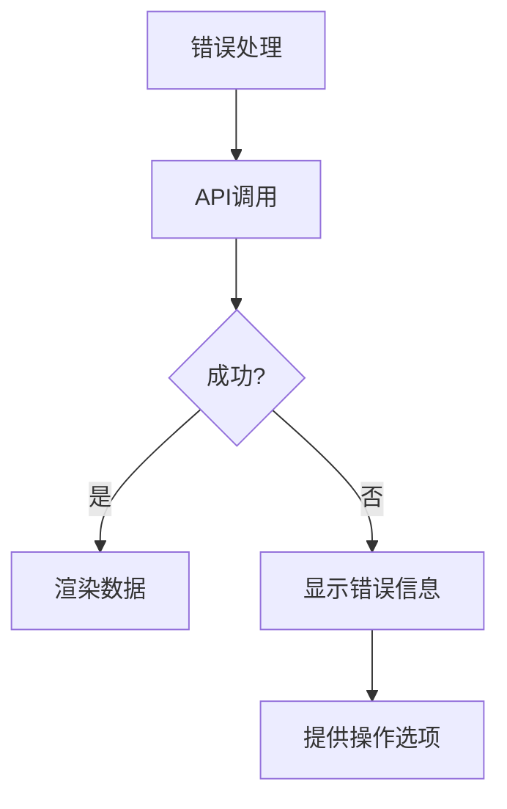

# 页面结构

<cite>
**本文档引用的文件**   
- [routes.ts](file://frontend/src/routes.ts)
- [root.tsx](file://frontend/src/root.tsx)
- [_layout.tsx](file://frontend/src/app/home/_layout.tsx)
- [_layout.tsx](file://frontend/src/app/setting/_layout.tsx)
- [home.tsx](file://frontend/src/app/home/home.tsx)
- [agents.tsx](file://frontend/src/app/market/agents.tsx)
- [board.tsx](file://frontend/src/app/rank/board.tsx)
- [chat.tsx](file://frontend/src/app/agent/chat.tsx)
- [config.tsx](file://frontend/src/app/agent/config.tsx)
- [models.tsx](file://frontend/src/app/setting/models.tsx)
- [general.tsx](file://frontend/src/app/setting/general.tsx)
- [memory.tsx](file://frontend/src/app/setting/memory.tsx)
- [app-sidebar.tsx](file://frontend/src/components/valuecell/app/app-sidebar.tsx)
- [stock.tsx](file://frontend/src/app/home/stock.tsx)
</cite>

## 目录
1. [项目结构](#项目结构)
2. [核心页面架构](#核心页面架构)
3. [全局布局实现](#全局布局实现)
4. [路由配置与导航逻辑](#路由配置与导航逻辑)
5. [页面间跳转与参数传递](#页面间跳转与参数传递)
6. [权限控制实现](#权限控制实现)
7. [页面生命周期管理](#页面生命周期管理)
8. [懒加载策略](#懒加载策略)
9. [错误边界处理](#错误边界处理)
10. [UI组件库集成](#ui组件库集成)

## 项目结构

项目采用基于功能模块的组织结构，前端代码位于`frontend/src/app`目录下，每个核心页面都有独立的模块目录。主要结构包括：

- `app/home`：主页模块，包含主页布局和股票详情页
- `app/market`：市场模块，展示智能体市场
- `app/rank`：排行榜模块，显示策略收益排名
- `app/agent`：智能体聊天模块，包含聊天和配置页面
- `app/setting`：设置模块，包含模型、通用和记忆设置
- `components`：UI组件库，包含基础组件和业务组件
- `routes.ts`：React Router路由配置文件
- `root.tsx`：应用根组件，包含全局布局和提供器



**Diagram sources**
- [routes.ts](file://frontend/src/routes.ts)
- [root.tsx](file://frontend/src/root.tsx)

**Section sources**
- [routes.ts](file://frontend/src/routes.ts)
- [root.tsx](file://frontend/src/root.tsx)

## 核心页面架构

### 主页 (Home)
主页是应用的入口页面，提供欢迎信息、智能体任务卡片和聊天输入区域。页面采用响应式布局，包含一个主要的内容区域和可选的侧边栏（当前注释中）。

**Section sources**
- [home.tsx](file://frontend/src/app/home/home.tsx)
- [home/_layout.tsx](file://frontend/src/app/home/_layout.tsx)

### 市场 (Market)
市场页面展示所有可用的智能体，采用网格布局显示智能体卡片。用户可以点击卡片进入智能体配置页面。页面包含加载状态处理，使用骨架屏组件在数据加载时提供视觉反馈。

**Section sources**
- [agents.tsx](file://frontend/src/app/market/agents.tsx)

### 排行榜 (Ranking)
排行榜页面显示策略收益排名，包含一个可切换时间范围的标签页（7天和30天）。页面使用表格组件展示排名数据，包括用户头像、收益率、策略类型、交易所和模型信息。点击"查看"按钮可以打开策略详情模态框。

**Section sources**
- [board.tsx](file://frontend/src/app/rank/board.tsx)

### 设置 (Setting)
设置页面包含多个子页面，通过侧边栏导航进行切换。当前实现包括模型、通用和记忆三个设置类别。每个设置页面专注于特定的配置功能，提供一致的用户体验。

**Section sources**
- [models.tsx](file://frontend/src/app/setting/models.tsx)
- [general.tsx](file://frontend/src/app/setting/general.tsx)
- [memory.tsx](file://frontend/src/app/setting/memory.tsx)

### 智能体聊天 (Agent Chat)
智能体聊天页面是与特定智能体交互的主要界面。页面根据智能体名称动态选择不同的视图组件，如策略智能体使用`StrategyAgentArea`，其他智能体使用`CommonAgentArea`。页面包含聊天输入、消息历史和智能体状态等组件。

**Section sources**
- [chat.tsx](file://frontend/src/app/agent/chat.tsx)

## 全局布局实现

### 根布局 (Root Layout)
根布局在`root.tsx`文件中定义，包含应用的全局结构和提供器。布局实现包括：

- HTML文档结构，包含meta标签和标题
- 全局样式导入
- 状态管理提供器（QueryClientProvider、TrackerProvider、SidebarProvider）
- 全局组件（侧边栏、主内容区域、通知组件）
- 滚动恢复和脚本加载



**Diagram sources**
- [root.tsx](file://frontend/src/root.tsx)

**Section sources**
- [root.tsx](file://frontend/src/root.tsx)

### 侧边栏 (Sidebar)
侧边栏由`app-sidebar.tsx`组件实现，提供全局导航功能。侧边栏包含三个主要部分：

1. **头部导航**：包含主页、策略、排行榜和市场等主要功能入口
2. **智能体列表**：动态显示启用的智能体，支持鼠标悬停显示完整名称
3. **底部设置**：包含设置入口

侧边栏使用React Router的NavLink组件实现导航，通过`useLocation`钩子检测当前路径并高亮活动项。



**Diagram sources**
- [app-sidebar.tsx](file://frontend/src/components/valuecell/app/app-sidebar.tsx)

**Section sources**
- [app-sidebar.tsx](file://frontend/src/components/valuecell/app/app-sidebar.tsx)

### 页面布局 (Page Layout)
不同页面使用不同的布局组件来实现特定的UI结构：

- **主页布局**：在`app/home/_layout.tsx`中定义，包含欢迎标题和主要内容区域
- **设置布局**：在`app/setting/_layout.tsx`中定义，包含左侧导航和右侧内容区域

设置布局的侧边栏包含模型、通用和记忆三个导航项，使用`NavLink`实现页面内导航。



**Diagram sources**
- [app/setting/_layout.tsx](file://frontend/src/app/setting/_layout.tsx)

**Section sources**
- [app/setting/_layout.tsx](file://frontend/src/app/setting/_layout.tsx)

## 路由配置与导航逻辑

### 路由配置
路由配置在`routes.ts`文件中定义，使用React Router的配置式路由。主要路由结构包括：

- 根重定向到主页
- `/home`前缀下的主页相关路由
- `/market`市场页面
- `/ranking`排行榜页面
- `/agent`前缀下的智能体相关路由
- `/setting`前缀下的设置相关路由

```mermaid
graph TD
A[路由配置] --> B[根重定向]
A --> C[/home]
C --> D[首页]
C --> E[/stock/:stockId]
A --> F[/market]
A --> G[/ranking]
A --> H[/agent]
H --> I[/:agentName]
H --> J[/:agentName/config]
A --> K[/setting]
K --> L[首页]
K --> M[/general]
K --> N[/memory]
```

**Diagram sources**
- [routes.ts](file://frontend/src/routes.ts)

**Section sources**
- [routes.ts](file://frontend/src/routes.ts)

### 导航逻辑
导航通过React Router提供的组件和钩子实现：

- `Link`和`NavLink`组件用于声明式导航
- `useNavigate`钩子用于编程式导航
- `useParams`钩子用于获取路由参数
- `useLocation`钩子用于获取当前路由信息

导航逻辑在多个组件中实现，如主页中的智能体点击导航、市场页面中的智能体卡片导航等。

## 页面间跳转与参数传递

### 页面跳转
页面跳转主要通过`useNavigate`钩子和`Link`组件实现。例如，在主页中点击智能体建议会导航到对应的智能体聊天页面：

```typescript
const handleAgentClick = (agentId: string) => {
  navigate(`/agent/${agentId}`);
};
```

### 参数传递
路由参数通过动态路由段传递，如`/stock/:stockId`。参数在目标页面中通过`useParams`钩子获取：

```typescript
const { stockId } = useParams<Route.LoaderArgs["params"]>();
```

此外，还可以通过导航状态传递数据，如在主页的聊天输入中：

```typescript
navigate("/agent/ValueCellAgent", {
  state: {
    inputValue,
  },
});
```

**Section sources**
- [home.tsx](file://frontend/src/app/home/home.tsx)
- [stock.tsx](file://frontend/src/app/home/stock.tsx)
- [chat.tsx](file://frontend/src/app/agent/chat.tsx)

## 权限控制实现

权限控制主要通过条件渲染和路由守卫实现。虽然当前代码中没有复杂的权限系统，但已有一些基础的控制机制：

- 智能体配置页面中的启用/禁用按钮根据智能体状态显示不同内容
- 设置页面中的登录状态检查，显示登录或登出按钮
- 后端健康检查组件在服务不可用时阻止页面渲染



**Section sources**
- [config.tsx](file://frontend/src/app/agent/config.tsx)
- [general.tsx](file://frontend/src/app/setting/general.tsx)
- [backend-health-check.tsx](file://frontend/src/components/valuecell/app/backend-health-check.tsx)

## 页面生命周期管理

### 组件生命周期
页面组件使用React的生命周期钩子和副作用钩子管理状态和数据获取：

- `useEffect`用于在组件挂载后执行副作用，如设置默认选中的提供者
- `useMemo`用于记忆化计算，避免不必要的重新渲染
- `useState`用于管理组件内部状态

### 数据获取生命周期
数据获取通过自定义Hook实现，遵循标准的加载-成功-错误状态管理：



例如，在排行榜页面中，使用`useGetStrategyList` Hook获取策略列表数据，并根据加载状态显示不同的UI。

**Section sources**
- [board.tsx](file://frontend/src/app/rank/board.tsx)
- [models.tsx](file://frontend/src/app/setting/models.tsx)
- [memory.tsx](file://frontend/src/app/setting/memory.tsx)

## 懒加载策略

虽然当前代码中没有显式的代码分割或懒加载实现，但项目结构支持按需加载：

- 每个页面模块独立组织，便于代码分割
- 路由配置清晰，便于实现动态导入
- 组件按功能拆分，减少单个文件的体积

未来可以实现的懒加载策略包括：

- 使用`React.lazy`和`Suspense`实现页面级懒加载
- 动态导入大型组件或第三方库
- 路由级别的代码分割

## 错误边界处理

### 错误处理机制
项目实现了多层次的错误处理：

- **组件级错误处理**：在股票详情页中，对API调用进行错误处理，显示友好的错误信息
- **全局错误处理**：通过`BackendHealthCheck`组件检查后端服务状态，服务不可用时阻止页面渲染
- **加载状态处理**：使用骨架屏组件在数据加载时提供视觉反馈

### 错误边界
虽然没有显式的错误边界组件，但通过条件渲染实现了类似功能：

- 检查数据是否存在
- 处理加载和错误状态
- 提供回退UI



**Section sources**
- [stock.tsx](file://frontend/src/app/home/stock.tsx)
- [backend-health-check.tsx](file://frontend/src/components/valuecell/app/backend-health-check.tsx)

## UI组件库集成

### 组件库结构
UI组件库位于`components/ui`目录下，提供基础的原子组件：

- 按钮、输入框、标签等表单组件
- 卡片、表格、标签页等布局组件
- 对话框、提示框、工具提示等交互组件

### 业务组件
在`components/valuecell`目录下提供业务相关的复合组件：

- `app-sidebar`：应用侧边栏
- `agent-avatar`：智能体头像
- `sparkline`：迷你图表
- `renderer`：内容渲染器

### 组件集成
组件通过别名导入，提高代码可读性：

```typescript
import { Button } from "@/components/ui/button";
import AppSidebar from "@/components/valuecell/app/app-sidebar";
import AgentAvatar from "@/components/valuecell/icon/agent-avatar";
```

这种集成方式使得组件引用更加简洁，便于维护和重构。

**Section sources**
- [app-sidebar.tsx](file://frontend/src/components/valuecell/app/app-sidebar.tsx)
- [agent-avatar.tsx](file://frontend/src/components/valuecell/icon/agent-avatar.tsx)
- [sparkline.tsx](file://frontend/src/components/valuecell/charts/sparkline.tsx)