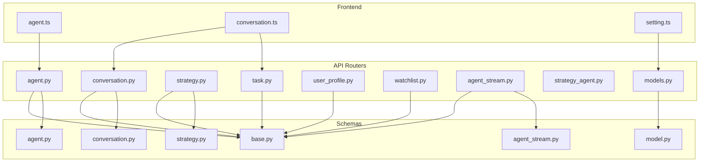

# API端点

<cite>
**本文档中引用的文件**   
- [models.py](file://python/valuecell/server/api/routers/models.py)
- [model.py](file://python/valuecell/server/api/schemas/model.py)
- [setting.ts](file://frontend/src/api/setting.ts)
- [model-detail.tsx](file://frontend/src/app/setting/components/models/model-detail.tsx)
- [agent.py](file://python/valuecell/server/api/routers/agent.py)
- [conversation.py](file://python/valuecell/server/api/routers/conversation.py)
- [strategy.py](file://python/valuecell/server/api/routers/strategy.py)
- [task.py](file://python/valuecell/server/api/routers/task.py)
- [user_profile.py](file://python/valuecell/server/api/routers/user_profile.py)
- [watchlist.py](file://python/valuecell/server/api/routers/watchlist.py)
- [agent_stream.py](file://python/valuecell/server/api/routers/agent_stream.py)
- [strategy_agent.py](file://python/valuecell/server/api/routers/strategy_agent.py)
- [base.py](file://python/valuecell/server/api/schemas/base.py)
- [agent.py](file://python/valuecell/server/api/schemas/agent.py)
- [conversation.py](file://python/valuecell/server/api/schemas/conversation.py)
- [strategy.py](file://python/valuecell/server/api/schemas/strategy.py)
- [agent_stream.py](file://python/valuecell/server/api/schemas/agent_stream.py)
- [agent.ts](file://frontend/src/api/agent.ts)
- [conversation.ts](file://frontend/src/api/conversation.ts)
- [api.ts](file://frontend/src/constants/api.ts)
</cite>

## 更新摘要
**已更改内容**   
- 在“模型管理”部分新增了“模型可用性检查”端点
- 更新了“认证与错误处理”部分以反映新的模型检查功能
- 添加了新的前后端交互示例，展示模型可用性检查的调用方式

## 目录
1. [简介](#简介)
2. [核心API路由器](#核心api路由器)
3. [智能体管理 (agent)](#智能体管理-agent)
4. [对话管理 (conversation)](#对话管理-conversation)
5. [策略交易 (strategy)](#策略交易-strategy)
6. [任务调度 (task)](#任务调度-task)
7. [用户配置 (user_profile)](#用户配置-user_profile)
8. [自选股列表 (watchlist)](#自选股列表-watchlist)
9. [流式接口 (SSE)](#流式接口-sse)
10. [模型管理](#模型管理)
11. [认证与错误处理](#认证与错误处理)
12. [前后端交互示例](#前后端交互示例)

## 简介
本文档详细介绍了ValueCell项目中基于FastAPI实现的RESTful API端点。系统提供了一套完整的金融智能体管理接口，涵盖智能体、对话、交易策略、任务调度、用户配置和自选股列表等核心功能。所有API均遵循统一的响应格式，通过`/api/v1`前缀提供服务，并采用Pydantic模型进行请求和响应的数据结构定义。前端通过React Query进行数据获取和状态管理，与后端实现高效交互。

## 核心API路由器
系统API由多个独立的路由器模块构成，每个模块负责特定的业务功能。这些路由器在应用启动时被注册到主FastAPI应用中，形成清晰的URL命名空间。核心路由器包括`agent`、`conversation`、`strategy`、`task`、`user_profile`和`watchlist`，分别处理各自领域的HTTP请求。流式接口通过`agent_stream`和`strategy_agent`路由器实现，支持Server-Sent Events (SSE)协议，为用户提供实时响应体验。

**Diagram sources**
- [agent.py](file://python/valuecell/server/api/routers/agent.py)
- [conversation.py](file://python/valuecell/server/api/routers/conversation.py)
- [strategy.py](file://python/valuecell/server/api/routers/strategy.py)
- [task.py](file://python/valuecell/server/api/routers/task.py)
- [user_profile.py](file://python/valuecell/server/api/routers/user_profile.py)
- [watchlist.py](file://python/valuecell/server/api/routers/watchlist.py)
- [models.py](file://python/valuecell/server/api/routers/models.py)



## 智能体管理 (agent)

该模块提供对系统内所有智能体的查询和状态管理功能。

### 获取所有智能体
- **HTTP方法**: `GET`
- **URL路径**: `/api/v1/agents/`
- **功能**: 获取系统中所有智能体的列表。
- **查询参数**:
  - `enabled_only` (bool): 是否仅返回启用的智能体。
  - `name_filter` (str): 按名称进行模糊匹配过滤。
- **请求/响应数据结构**:
  - **请求**: 无请求体。
  - **响应**: `AgentListResponse`，包含智能体列表和统计信息。
- **认证机制**: 无特定认证要求。
- **错误码**:
  - `500`: 获取智能体列表失败。

### 按ID获取智能体
- **HTTP方法**: `GET`
- **URL路径**: `/api/v1/agents/{agent_id}`
- **功能**: 根据唯一ID获取单个智能体的详细信息。
- **路径参数**:
  - `agent_id` (int): 智能体的唯一标识符。
- **请求/响应数据结构**:
  - **请求**: 无请求体。
  - **响应**: `AgentResponse`，包含单个智能体的详细数据。
- **认证机制**: 无特定认证要求。
- **错误码**:
  - `404`: 指定ID的智能体不存在。
  - `500`: 获取智能体信息失败。

### 按名称获取智能体
- **HTTP方法**: `GET`
- **URL路径**: `/api/v1/agents/by-name/{agent_name}`
- **功能**: 根据名称获取单个智能体的详细信息。
- **路径参数**:
  - `agent_name` (str): 智能体的名称。
- **请求/响应数据结构**:
  - **请求**: 无请求体。
  - **响应**: `AgentResponse`。
- **认证机制**: 无特定认证要求。
- **错误码**:
  - `404`: 指定名称的智能体不存在。
  - `500`: 获取智能体信息失败。

### 更新智能体启用状态
- **HTTP方法**: `POST`
- **URL路径**: `/api/v1/agents/{agent_name}/enable`
- **功能**: 启用或禁用指定名称的智能体。
- **路径参数**:
  - `agent_name` (str): 要更新的智能体名称。
- **请求/响应数据结构**:
  - **请求**: `AgentEnableRequest`，包含`enabled` (bool) 字段。
  - **响应**: `AgentEnableSuccessResponse`，包含更新后的状态信息。
- **认证机制**: 无特定认证要求。
- **错误码**:
  - `404`: 指定名称的智能体不存在。
  - `500`: 更新智能体状态失败。

**Section sources**
- [agent.py](file://python/valuecell/server/api/routers/agent.py#L31-L178)
- [agent.ts](file://frontend/src/api/agent.ts#L7-L56)

## 对话管理 (conversation)

该模块负责管理用户与智能体之间的对话历史和会话数据。

### 获取对话列表
- **HTTP方法**: `GET`
- **URL路径**: `/api/v1/conversations/`
- **功能**: 获取对话列表，支持分页和用户过滤。
- **查询参数**:
  - `user_id` (str): 按用户ID过滤。
  - `limit` (int): 返回的对话数量，默认10。
  - `offset` (int): 跳过的对话数量，默认0。
- **请求/响应数据结构**:
  - **请求**: 无请求体。
  - **响应**: `ConversationListResponse`，包含对话列表。
- **认证机制**: 无特定认证要求。
- **错误码**:
  - `500`: 内部服务器错误。

### 获取对话历史
- **HTTP方法**: `GET`
- **URL路径**: `/api/v1/conversations/{conversation_id}/history`
- **功能**: 获取指定对话的完整消息历史。
- **路径参数**:
  - `conversation_id` (str): 对话的唯一ID。
- **请求/响应数据结构**:
  - **请求**: 无请求体。
  - **响应**: `ConversationHistoryResponse`，包含按时间顺序排列的消息列表。
- **认证机制**: 无特定认证要求。
- **错误码**:
  - `404`: 对话不存在。
  - `500`: 内部服务器错误。

### 删除对话
- **HTTP方法**: `DELETE`
- **URL路径**: `/api/v1/conversations/{conversation_id}`
- **功能**: 删除指定的对话及其所有关联数据。
- **路径参数**:
  - `conversation_id` (str): 要删除的对话ID。
- **请求/响应数据结构**:
  - **请求**: 无请求体。
  - **响应**: `ConversationDeleteResponse`，包含删除结果。
- **认证机制**: 无特定认证要求。
- **错误码**:
  - `404`: 对话不存在。
  - `500`: 内部服务器错误。

### 获取所有对话的定时任务结果
- **HTTP方法**: `GET`
- **URL路径**: `/api/v1/conversations/scheduled-task-results`
- **功能**: 获取所有对话中定时任务的结果，按智能体名称分组。
- **查询参数**:
  - `user_id` (str): 按用户ID过滤。
- **请求/响应数据结构**:
  - **请求**: 无请求体。
  - **响应**: `AllConversationsScheduledTaskResponse`，包含按智能体分组的任务结果。
- **认证机制**: 无特定认证要求。
- **错误码**:
  - `500`: 内部服务器错误。

**Section sources**
- [conversation.py](file://python/valuecell/server/api/routers/conversation.py#L21-L147)
- [conversation.ts](file://frontend/src/api/conversation.ts#L10-L81)

## 策略交易 (strategy)

该模块提供对交易策略的全生命周期管理，包括查询、性能分析和状态控制。

### 获取所有策略
- **HTTP方法**: `GET`
- **URL路径**: `/api/v1/strategies/`
- **功能**: 获取通过StrategyAgent创建的所有策略列表。
- **查询参数**:
  - `user_id` (str): 按所有者用户ID过滤。
  - `status` (str): 按状态过滤（running, stopped）。
  - `name_filter` (str): 按策略名称或ID进行模糊匹配。
- **请求/响应数据结构**:
  - **请求**: 无请求体。
  - **响应**: `StrategyListResponse`，包含策略摘要列表。
- **认证机制**: 无特定认证要求。
- **错误码**:
  - `500`: 获取策略列表失败。

### 获取策略性能
- **HTTP方法**: `GET`
- **URL路径**: `/api/v1/strategies/performance`
- **功能**: 获取策略的性能和配置概览。
- **查询参数**:
  - `id` (str): 策略ID。
- **请求/响应数据结构**:
  - **请求**: 无请求体。
  - **响应**: `StrategyPerformanceResponse`，包含ROI、模型/提供商和最终提示等信息。
- **认证机制**: 无特定认证要求。
- **错误码**:
  - `400`: 策略ID无效。
  - `404`: 策略未找到。
  - `500`: 获取策略性能失败。

### 获取策略持仓
- **HTTP方法**: `GET`
- **URL路径**: `/api/v1/strategies/holding`
- **功能**: 获取指定策略的当前持仓。
- **查询参数**:
  - `id` (str): 策略ID。
- **请求/响应数据结构**:
  - **请求**: 无请求体。
  - **响应**: `StrategyHoldingFlatResponse`，包含持仓列表。
- **认证机制**: 无特定认证要求。
- **错误码**:
  - `500`: 获取持仓失败。

### 获取策略投资组合摘要
- **HTTP方法**: `GET`
- **URL路径**: `/api/v1/strategies/portfolio_summary`
- **功能**: 获取策略最新的投资组合摘要。
- **查询参数**:
  - `id` (str): 策略ID。
- **请求/响应数据结构**:
  - **请求**: 无请求体。
  - **响应**: `StrategyPortfolioSummaryResponse`，包含现金、总价值和未实现盈亏等聚合指标。
- **认证机制**: 无特定认证要求。
- **错误码**:
  - `500`: 获取投资组合摘要失败。

### 获取策略交易详情
- **HTTP方法**: `GET`
- **URL路径**: `/api/v1/strategies/detail`
- **功能**: 获取策略的交易详情列表。
- **查询参数**:
  - `id` (str): 策略ID。
- **请求/响应数据结构**:
  - **请求**: 无请求体。
  - **响应**: `StrategyDetailResponse`，包含交易指令卡列表。
- **认证机制**: 无特定认证要求。
- **错误码**:
  - `500`: 获取详情失败。

### 获取策略持仓价格曲线
- **HTTP方法**: `GET`
- **URL路径**: `/api/v1/strategies/holding_price_curve`
- **功能**: 获取单个或所有策略的持仓价格曲线。
- **查询参数**:
  - `id` (str): 策略ID（可选）。
  - `limit` (int): 当`id`省略时，限制返回的策略数量。
- **请求/响应数据结构**:
  - **请求**: 无请求体。
  - **响应**: `StrategyCurveResponse`，包含时间序列数据。
- **认证机制**: 无特定认证要求。
- **错误码**:
  - `404`: 策略未找到。
  - `500`: 获取价格曲线失败。

### 停止策略
- **HTTP方法**: `POST`
- **URL路径**: `/api/v1/strategies/stop`
- **功能**: 通过ID停止一个策略。
- **查询参数**:
  - `id` (str): 策略ID。
- **请求/响应数据结构**:
  - **请求**: 无请求体。
  - **响应**: `StrategyStatusSuccessResponse`，包含更新后的状态信息。
- **认证机制**: 无特定认证要求。
- **错误码**:
  - `404`: 策略未找到。
  - `500`: 停止策略失败。

**Section sources**
- [strategy.py](file://python/valuecell/server/api/routers/strategy.py#L42-L524)

## 任务调度 (task)

该模块提供对后台任务的管理功能。

### 取消任务
- **HTTP方法**: `POST`
- **URL路径**: `/api/v1/tasks/{task_id}/cancel`
- **功能**: 取消指定ID的任务，并更新对话历史中的相关组件状态。
- **路径参数**:
  - `task_id` (str): 要取消的任务ID。
- **请求/响应数据结构**:
  - **请求**: 无请求体。
  - **响应**: `TaskCancelResponse`，包含取消结果。
- **认证机制**: 无特定认证要求。
- **错误码**:
  - `400`: 任务不可取消或未找到。
  - `500`: 内部服务器错误。

**Section sources**
- [task.py](file://python/valuecell/server/api/routers/task.py#L13-L43)
- [conversation.ts](file://frontend/src/api/conversation.ts#L76-L81)

## 用户配置 (user_profile)

该模块管理用户的个人配置信息。

### 创建用户配置
- **HTTP方法**: `POST`
- **URL路径**: `/api/v1/user/profile`
- **功能**: 创建新的用户配置。
- **请求/响应数据结构**:
  - **请求**: `CreateUserProfileRequest`，包含`category`和`content`。
  - **响应**: `SuccessResponse[UserProfileData]`。
- **认证机制**: 使用默认用户ID "default_user"。
- **错误码**:
  - `400`: 类别无效。
  - `500`: 创建配置失败。

### 获取用户配置
- **HTTP方法**: `GET`
- **URL路径**: `/api/v1/user/profile`
- **功能**: 获取所有用户配置，可按类别过滤。
- **查询参数**:
  - `category` (str): 按类别过滤。
- **请求/响应数据结构**:
  - **请求**: 无请求体。
  - **响应**: `SuccessResponse[UserProfileListData]`。
- **认证机制**: 使用默认用户ID "default_user"。
- **错误码**:
  - `400`: 类别无效。
  - `500`: 获取配置失败。

### 获取用户配置摘要
- **HTTP方法**: `GET`
- **URL路径**: `/api/v1/user/profile/summary`
- **功能**: 获取按类别分组的用户配置摘要。
- **请求/响应数据结构**:
  - **请求**: 无请求体。
  - **响应**: `SuccessResponse[UserProfileSummaryData]`。
- **认证机制**: 使用默认用户ID "default_user"。
- **错误码**:
  - `500`: 获取摘要失败。

### 其他操作
还包括按ID获取、更新和删除用户配置的端点，均使用默认用户ID进行认证。

**Section sources**
- [user_profile.py](file://python/valuecell/server/api/routers/user_profile.py#L29-L245)

## 自选股列表 (watchlist)

该模块提供对自选股列表的管理功能。

### 搜索资产
- **HTTP方法**: `GET`
- **URL路径**: `/api/v1/watchlist/asset/search`
- **功能**: 搜索金融资产（股票等）。
- **查询参数**:
  - `q` (str): 搜索查询。
  - `asset_types` (str): 资产类型，逗号分隔。
  - `exchanges` (str): 交易所，逗号分隔。
  - `countries` (str): 国家，逗号分隔。
  - `limit` (int): 最大结果数。
  - `language` (str): 本地化结果的语言。
- **请求/响应数据结构**:
  - **请求**: 无请求体。
  - **响应**: `SuccessResponse[AssetSearchResultData]`。
- **认证机制**: 使用默认用户ID "default_user"。
- **错误码**:
  - `500`: 搜索错误。

### 获取资产详情
- **HTTP方法**: `GET`
- **URL路径**: `/api/v1/watchlist/asset/{ticker}`
- **功能**: 获取特定资产的详细信息。
- **路径参数**:
  - `ticker` (str): 资产代码。
- **请求/响应数据结构**:
  - **请求**: 无请求体。
  - **响应**: `SuccessResponse[AssetDetailData]`。
- **认证机制**: 使用默认用户ID "default_user"。
- **错误码**:
  - `404`: 资产未找到。
  - `500`: 资产详情错误。

### 获取资产价格
- **HTTP方法**: `GET`
- **URL路径**: `/api/v1/watchlist/asset/{ticker}/price`
- **功能**: 获取资产的当前价格。
- **路径参数**:
  - `ticker` (str): 资产代码。
- **请求/响应数据结构**:
  - **请求**: 无请求体。
  - **响应**: `SuccessResponse[AssetPriceData]`。
- **认证机制**: 使用默认用户ID "default_user"。
- **错误码**:
  - `404`: 价格数据不可用。
  - `500`: 价格数据错误。

### 管理自选股列表
提供创建、获取、删除自选股列表以及向列表中添加/移除资产的端点，均使用默认用户ID进行认证。

**Section sources**
- [watchlist.py](file://python/valuecell/server/api/routers/watchlist.py#L38-L579)

## 流式接口 (SSE)

`agent_stream` 和 `strategy_agent` 模块通过Server-Sent Events (SSE)协议实现流式响应，为用户提供实时的交互体验。

### 智能体流式查询
- **HTTP方法**: `POST`
- **URL路径**: `/api/v1/agents/stream`
- **功能**: 实时流式返回智能体查询的响应。
- **请求/响应数据结构**:
  - **请求**: `AgentStreamRequest`，包含`query`、`agent_name`和`conversation_id`。
  - **响应**: `text/event-stream`，每个数据块为`data: {json_chunk}\n\n`格式。
- **实现机制**:
  - 使用FastAPI的`StreamingResponse`返回流式内容。
  - 响应头设置`Cache-Control: no-cache`和`Connection: keep-alive`以保持长连接。
  - 服务端异步生成数据块，通过SSE协议推送给客户端。
- **错误处理**:
  - `500`: 智能体查询失败。

### 策略创建
- **HTTP方法**: `POST`
- **URL路径**: `/api/v1/strategies/create`
- **功能**: 通过StrategyAgent创建交易策略。
- **请求/响应数据结构**:
  - **请求**: `UserRequest`，包含LLM模型配置、交易所配置和交易配置。
  - **响应**: 非SSE的聚合JSON响应，包含创建结果。
- **实现机制**:
  - 使用`AgentOrchestrator`处理用户输入。
  - 在策略创建成功后，将策略信息持久化到数据库。
  - 支持在创建时更新LLM API密钥。
- **错误处理**:
  - `400`: 策略类型不支持或连接测试失败。
  - `404`: 策略未找到。
  - `500`: 内部错误。

### 连接测试
- **HTTP方法**: `POST`
- **URL路径**: `/api/v1/strategies/test-connection`
- **功能**: 测试与交易所的连接。
- **请求/响应数据结构**:
  - **请求**: `ExchangeConfig`，包含交易所ID和API密钥等。
  - **响应**: `SuccessResponse`或`HTTPException`。
- **特殊处理**: 虚拟交易模式下直接返回成功。

### 删除策略
- **HTTP方法**: `DELETE`
- **URL路径**: `/api/v1/strategies/delete`
- **功能**: 删除由StrategyAgent创建的策略。
- **查询参数**:
  - `id` (str): 策略ID。
  - `cascade` (bool): 是否级联删除相关记录。
- **实现机制**: 在删除前会尝试将策略状态设置为"stopped"。

**Section sources**
- [agent_stream.py](file://python/valuecell/server/api/routers/agent_stream.py#L31-L63)
- [strategy_agent.py](file://python/valuecell/server/api/routers/strategy_agent.py#L45-L327)
- [agent_stream.py](file://python/valuecell/server/api/schemas/agent_stream.py#L10-L39)

## 模型管理
该模块提供对LLM模型配置的管理功能，包括可用性检查、提供商配置和模型列表管理。

### 模型可用性检查
- **HTTP方法**: `POST`
- **URL路径**: `/api/v1/models/check`
- **功能**: 执行最小化的实时请求以验证模型是否响应。此端点不验证提供商配置或API密钥的存在。
- **请求/响应数据结构**:
  - **请求**: `CheckModelRequest`，包含`provider`、`model_id`和可选的`api_key`。
  - **响应**: `SuccessResponse[CheckModelResponse]`，包含可用性检查结果。
- **认证机制**: 无特定认证要求。
- **错误码**:
  - `400`: 模型ID未指定且提供商无默认模型。
  - `404`: 指定的提供商未找到。
  - `500`: 检查模型失败。

### 获取模型提供商列表
- **HTTP方法**: `GET`
- **URL路径**: `/api/v1/models/providers`
- **功能**: 列出可用的提供商及其基本信息。
- **请求/响应数据结构**:
  - **请求**: 无请求体。
  - **响应**: `SuccessResponse[List[ModelProviderSummary]]`。
- **认证机制**: 无特定认证要求。
- **错误码**:
  - `500`: 获取提供商列表失败。

### 获取提供商详细信息
- **HTTP方法**: `GET`
- **URL路径**: `/api/v1/models/providers/{provider}`
- **功能**: 获取特定提供商的配置和模型信息。
- **路径参数**:
  - `provider` (str): 服务提供商名称。
- **请求/响应数据结构**:
  - **请求**: 无请求体。
  - **响应**: `SuccessResponse[ProviderDetailData]`。
- **认证机制**: 无特定认证要求。
- **错误码**:
  - `404`: 指定的提供商未找到。
  - `500`: 获取提供商信息失败。

### 更新提供商配置
- **HTTP方法**: `PUT`
- **URL路径**: `/api/v1/models/providers/{provider}/config`
- **功能**: 更新提供商的API密钥和主机配置。
- **路径参数**:
  - `provider` (str): 服务提供商名称。
- **请求/响应数据结构**:
  - **请求**: `ProviderUpdateRequest`，包含`api_key`和`base_url`。
  - **响应**: `SuccessResponse[ProviderDetailData]`。
- **认证机制**: 无特定认证要求。
- **错误码**:
  - `404`: 指定的提供商未找到。
  - `500`: 更新提供商配置失败。

**Section sources**
- [models.py](file://python/valuecell/server/api/routers/models.py#L487-L887)
- [model.py](file://python/valuecell/server/api/schemas/model.py#L89-L114)
- [setting.ts](file://frontend/src/api/setting.ts#L180-L184)
- [model-detail.tsx](file://frontend/src/app/setting/components/models/model-detail.tsx#L70-L259)

## 认证与错误处理

### 认证机制
本系统目前采用简化的认证模型：
- 大多数API端点使用一个全局默认用户ID `"default_user"`，适用于开源版本。
- 敏感操作（如策略创建）通过在请求体中直接传递API密钥来实现，系统会动态更新环境变量中的密钥。
- 新增了模型可用性检查功能，允许使用临时API密钥进行测试，而不会影响现有配置。
- 未来版本可能引入更完善的API Key或JWT认证机制。

### 错误处理
系统采用统一的错误响应格式，定义在`base.py`中：
- **基础响应模型**: `BaseResponse` 包含`code`、`msg`和`data`字段。
- **成功响应**: `SuccessResponse`，`code`为0，`msg`为"success"。
- **错误响应**: `ErrorResponse`，`code`为标准HTTP状态码或自定义错误码，`data`为null。
- **错误码枚举**: `StatusCode` 枚举定义了`SUCCESS`、`BAD_REQUEST`、`UNAUTHORIZED`、`FORBIDDEN`、`NOT_FOUND`和`INTERNAL_ERROR`等状态码。
- **新增模型检查状态码**: 包括`auth_failed`、`timeout`、`request_failed`、`probe_unavailable`等，用于详细描述模型可用性检查结果。

**Section sources**
- [base.py](file://python/valuecell/server/api/schemas/base.py#L12-L58)

## 前后端交互示例

### 前端调用示例 (React Query)
前端使用`@tanstack/react-query`库来管理API调用和缓存。

```typescript
// 获取智能体列表
const { data: agents } = useGetAgentList({ enabled_only: "true" });

// 获取对话历史
const { data: history } = useGetConversationHistory(conversationId);

// 取消任务
const { mutate: cancelTask } = useCancelTask();
cancelTask(taskId);

// 检查模型可用性
const { mutateAsync: checkAvailability } = useCheckModelAvailability();
const result = await checkAvailability({
  provider: "openai",
  model_id: "gpt-4o"
});
```

### 实际调用示例 (curl)
```bash
# 获取所有启用的智能体
curl -X GET "http://localhost:8000/api/v1/agents/?enabled_only=true"

# 流式查询智能体
curl -X POST http://localhost:8000/api/v1/agents/stream \
  -H "Content-Type: application/json" \
  -d '{"query": "分析当前市场趋势", "agent_name": "MarketAnalystAgent"}'

# 创建策略
curl -X POST http://localhost:8000/api/v1/strategies/create \
  -H "Content-Type: application/json" \
  -d '{
    "llm_model_config": {"provider": "openai", "model_id": "gpt-4", "api_key": "sk-..."},
    "exchange_config": {"exchange_id": "binance", "api_key": "...", "secret_key": "..."},
    "trading_config": {"strategy_type": "PromptBasedStrategy", "prompt_text": "..." }
  }'

# 检查模型可用性
curl -X POST http://localhost:8000/api/v1/models/check \
  -H "Content-Type: application/json" \
  -d '{"provider": "openai", "model_id": "gpt-4o"}'
```

### 作用说明
- **智能体管理**: 前端通过此模块加载可用的智能体列表，并允许用户启用/禁用它们。
- **对话管理**: 前端使用此模块加载对话历史、显示消息流，并提供删除对话的功能。
- **策略交易**: 前端通过此模块展示策略的性能、持仓和交易历史，是策略监控的核心。
- **任务调度**: 前端通过轮询`/scheduled-task-results`端点来实时更新任务状态。
- **流式接口**: 前端通过SSE连接接收智能体的实时响应，实现类似ChatGPT的流式输出效果。
- **模型管理**: 前端通过`useCheckModelAvailability` Hook调用新的模型可用性检查端点，让用户在配置模型时能够验证其可用性，而无需保存配置。

**Section sources**
- [agent.ts](file://frontend/src/api/agent.ts)
- [conversation.ts](file://frontend/src/api/conversation.ts)
- [api.ts](file://frontend/src/constants/api.ts)
- [setting.ts](file://frontend/src/api/setting.ts#L180-L184)