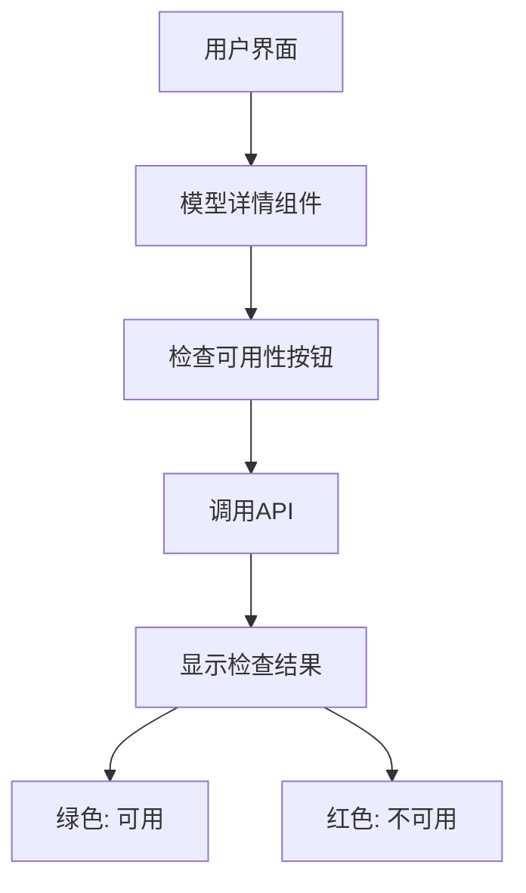
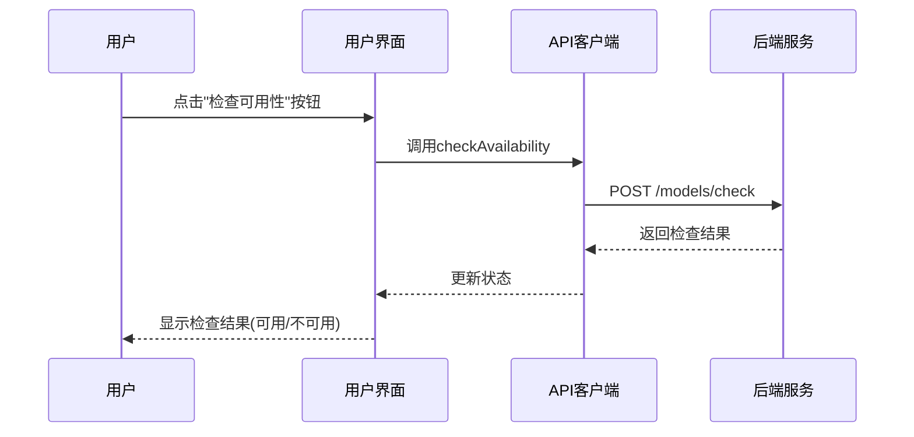
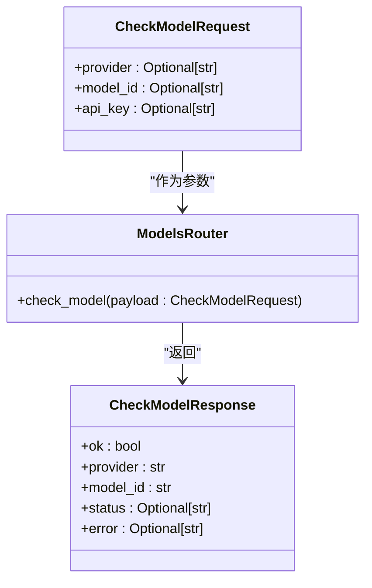
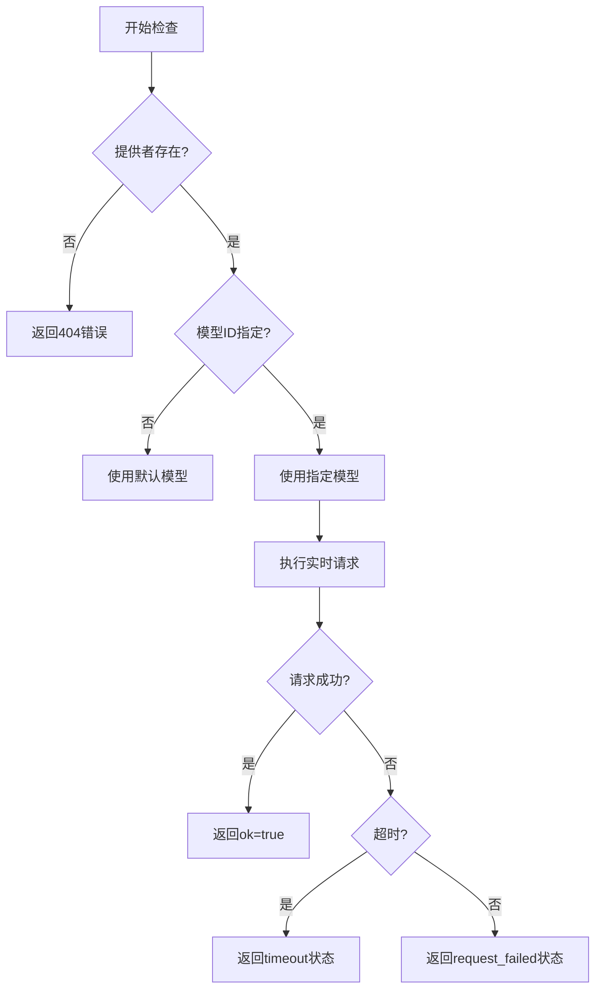
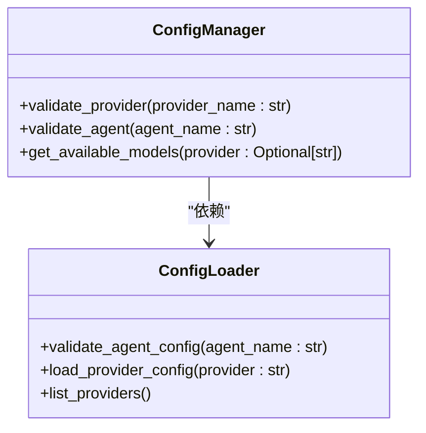
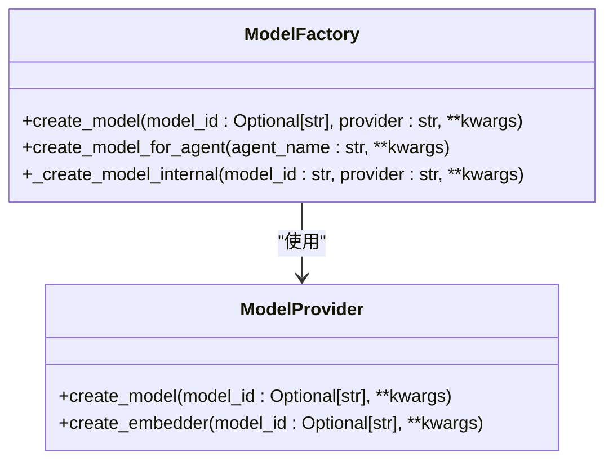
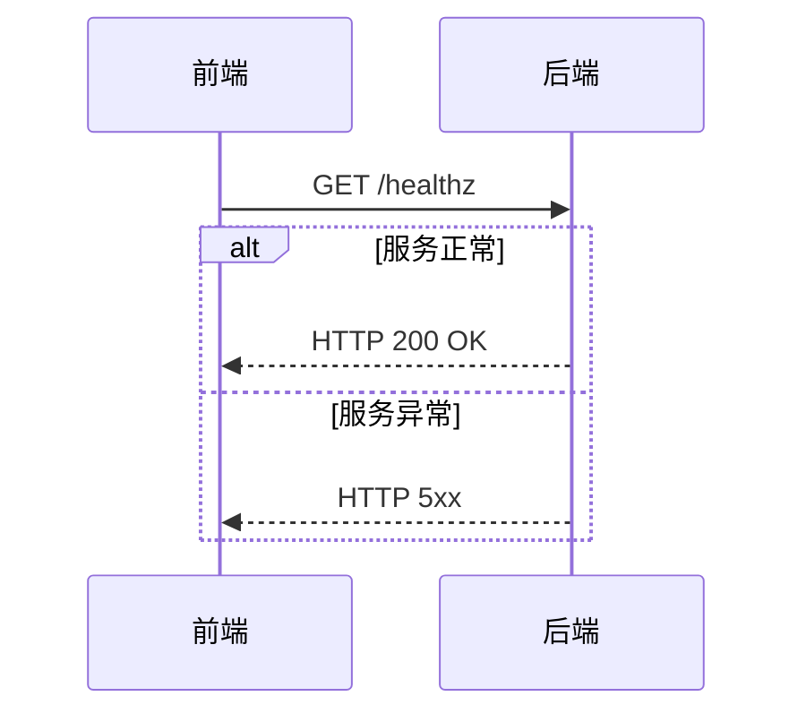

# 模型可用性检查

<cite>
**本文档中引用的文件**   
- [backend-health-check.tsx](file://frontend/src/components/valuecell/app/backend-health-check.tsx)
- [system.ts](file://frontend/src/api/system.ts)
- [model-detail.tsx](file://frontend/src/app/setting/components/models/model-detail.tsx)
- [setting.ts](file://frontend/src/api/setting.ts)
- [models.py](file://python/valuecell/server/api/routers/models.py)
- [model.py](file://python/valuecell/server/api/schemas/model.py)
- [manager.py](file://python/valuecell/config/manager.py)
- [loader.py](file://python/valuecell/config/loader.py)
- [factory.py](file://python/valuecell/adapters/models/factory.py)
- [CONFIGURATION_GUIDE.md](file://docs/CONFIGURATION_GUIDE.md)
</cite>

## 目录
1. [简介](#简介)
2. [前端用户界面](#前端用户界面)
3. [后端API实现](#后端api实现)
4. [配置管理与验证](#配置管理与验证)
5. [模型工厂与创建](#模型工厂与创建)
6. [系统健康检查](#系统健康检查)
7. [结论](#结论)

## 简介

模型可用性检查功能是ValueCell系统中的关键组件，用于验证大语言模型（LLM）提供者和模型的配置正确性和连接可用性。该功能允许用户在设置界面中检查模型是否可用，确保系统能够成功连接到指定的模型提供者。

该功能涉及前端用户界面、后端API端点以及底层配置管理系统。前端提供用户友好的界面来触发检查，后端执行实际的连接测试，而配置管理系统负责验证配置的完整性和正确性。

**Section sources**
- [model-detail.tsx](file://frontend/src/app/setting/components/models/model-detail.tsx#L1-L442)
- [models.py](file://python/valuecell/server/api/routers/models.py#L1-L887)

## 前端用户界面

前端的模型可用性检查功能主要在设置页面的模型详情组件中实现。用户可以通过点击"检查可用性"按钮来验证特定模型的可用性。



**Diagram sources**
- [model-detail.tsx](file://frontend/src/app/setting/components/models/model-detail.tsx#L228-L259)

### 检查功能实现

前端通过`useCheckModelAvailability`钩子函数实现模型可用性检查功能。该函数使用`useMutation`来发送POST请求到`/models/check`端点。

当用户点击"检查可用性"按钮时，前端会收集当前选中的提供者和默认模型ID，并发送检查请求。检查结果会以绿色或红色文本显示在界面上，指示模型是否可用。



**Diagram sources**
- [model-detail.tsx](file://frontend/src/app/setting/components/models/model-detail.tsx#L233-L236)
- [setting.ts](file://frontend/src/api/setting.ts#L182-L184)

**Section sources**
- [model-detail.tsx](file://frontend/src/app/setting/components/models/model-detail.tsx#L70-L74)
- [setting.ts](file://frontend/src/api/setting.ts#L180-L185)

## 后端API实现

后端的模型可用性检查功能通过`/models/check` API端点实现，该端点位于`python/valuecell/server/api/routers/models.py`文件中。



**Diagram sources**
- [models.py](file://python/valuecell/server/api/routers/models.py#L487-L886)
- [model.py](file://python/valuecell/server/api/schemas/model.py#L88-L114)

### 检查逻辑流程

后端的模型可用性检查逻辑包括以下步骤：

1. 获取配置管理器并确定要检查的提供者
2. 获取提供者配置并验证其存在性
3. 确定要检查的模型ID
4. 执行最小化的实时请求来验证模型响应
5. 处理各种可能的错误情况



**Diagram sources**
- [models.py](file://python/valuecell/server/api/routers/models.py#L499-L880)

**Section sources**
- [models.py](file://python/valuecell/server/api/routers/models.py#L487-L886)
- [model.py](file://python/valuecell/server/api/schemas/model.py#L88-L114)

## 配置管理与验证

模型可用性检查依赖于系统的配置管理组件，这些组件负责验证提供者和代理的配置正确性。



**Diagram sources**
- [manager.py](file://python/valuecell/config/manager.py#L378-L434)
- [loader.py](file://python/valuecell/config/loader.py#L432-L482)

### 提供者验证

`ConfigManager`类的`validate_provider`方法负责验证提供者配置的完整性。验证包括：

- 检查提供者是否存在
- 检查提供者是否已启用
- 检查API密钥是否存在（ollama除外）
- 检查Azure端点是否配置

```python
def validate_provider(self, provider_name: str) -> tuple[bool, Optional[str]]:
    provider_config = self.get_provider_config(provider_name)
    
    if not provider_config:
        return False, f"Provider '{provider_name}' not found in configuration"
    
    if not provider_config.enabled:
        return False, f"Provider '{provider_name}' is disabled in config"
    
    # 检查API密钥（ollama除外）
    if provider_name != "ollama" and not provider_config.api_key:
        provider_data = self.loader.load_provider_config(provider_name)
        api_key_env = provider_data.get("connection", {}).get("api_key_env")
        return (
            False,
            f"API key not found for '{provider_name}'. Please set {api_key_env} in .env",
        )
    
    # Azure需要端点
    if provider_name == "azure" and not provider_config.base_url:
        return (
            False,
            "Azure endpoint not configured. Please set AZURE_OPENAI_ENDPOINT",
        )
    
    return True, None
```

**Section sources**
- [manager.py](file://python/valuecell/config/manager.py#L378-L413)
- [loader.py](file://python/valuecell/config/loader.py#L467-L472)

## 模型工厂与创建

模型工厂组件负责创建实际的模型实例，并在创建过程中执行可用性检查。



**Diagram sources**
- [factory.py](file://python/valuecell/adapters/models/factory.py#L19-L44)

### 模型创建流程

模型创建流程包括以下步骤：

1. 验证代理配置是否启用
2. 获取代理的模型配置
3. 检查指定提供者是否可用
4. 如果不可用，则回退到主提供者
5. 创建模型实例

```python
def create_model_for_agent(self, agent_name: str, **kwargs) -> Any:
    # 获取代理配置
    agent_config = self.config_manager.get_agent_config(agent_name)
    if not agent_config:
        raise ValueError(f"Agent config not found: {agent_name}")
    
    if not agent_config.enabled:
        raise ValueError(f"Agent is disabled: {agent_name}")
    
    # 获取模型配置
    model_config = agent_config.primary_model
    
    # 合并参数
    merged_params = {**model_config.parameters, **kwargs}
    
    # 检查指定提供者是否可用
    provider = model_config.provider
    model_id = model_config.model_id
    is_valid, error_msg = self.config_manager.validate_provider(provider)
    
    if not is_valid:
        # 回退到主提供者
        fallback_provider = self.config_manager.primary_provider
        logger.warning(
            f"Configured provider '{provider}' for agent '{agent_name}' is not available: {error_msg}. "
            f"Falling back to primary provider: {fallback_provider}"
        )
        provider = fallback_provider
```

**Section sources**
- [factory.py](file://python/valuecell/adapters/models/factory.py#L780-L826)
- [CONFIGURATION_GUIDE.md](file://docs/CONFIGURATION_GUIDE.md#L543-L563)

## 系统健康检查

除了模型可用性检查外，系统还实现了后端健康检查功能，用于监控后端服务的整体可用性。



**Diagram sources**
- [system.ts](file://frontend/src/api/system.ts#L25-L35)
- [backend-health-check.tsx](file://frontend/src/components/valuecell/app/backend-health-check.tsx#L8-L37)

### 健康检查实现

前端使用`useBackendHealth`钩子来定期检查后端健康状态。该钩子配置了智能的重试策略：

- 当服务正常时，每10秒检查一次
- 当服务异常时，每2秒检查一次
- 当窗口获得焦点时重新检查

```typescript
export const useBackendHealth = () => {
  return useQuery({
    queryKey: ["backend-health"],
    queryFn: () => apiClient.get<boolean>("/healthz"),
    retry: false,
    refetchInterval: (query) => {
      return query.state.status === "error" ? 2000 : 10000;
    },
    refetchOnWindowFocus: true,
  });
};
```

**Section sources**
- [system.ts](file://frontend/src/api/system.ts#L25-L35)
- [backend-health-check.tsx](file://frontend/src/components/valuecell/app/backend-health-check.tsx#L13-L26)

## 结论

模型可用性检查功能是ValueCell系统中确保大语言模型连接可靠性的关键组件。该功能通过前后端协同工作，为用户提供直观的模型状态反馈。

前端提供了用户友好的界面来触发和显示检查结果，而后端实现了详细的连接测试逻辑。配置管理系统确保了配置的完整性和正确性，而模型工厂组件在创建模型时执行必要的可用性验证。

整个系统设计体现了分层架构的思想，将用户界面、API接口、业务逻辑和配置管理分离，提高了代码的可维护性和可扩展性。这种设计使得添加新的模型提供者和支持新的检查类型变得更加容易。

**Section sources**
- [model-detail.tsx](file://frontend/src/app/setting/components/models/model-detail.tsx#L1-L442)
- [models.py](file://python/valuecell/server/api/routers/models.py#L1-L887)
- [manager.py](file://python/valuecell/config/manager.py#L378-L434)
- [factory.py](file://python/valuecell/adapters/models/factory.py#L1-L826)