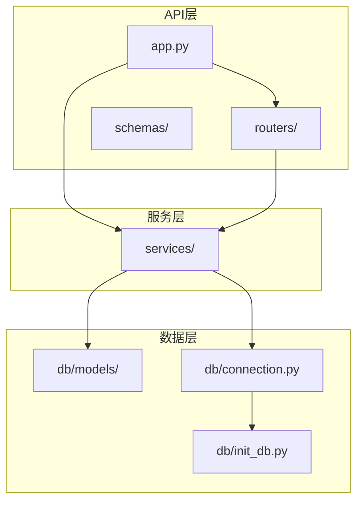
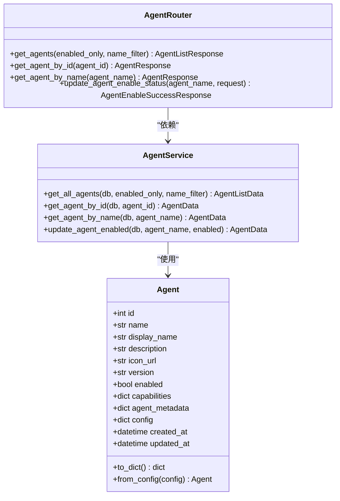
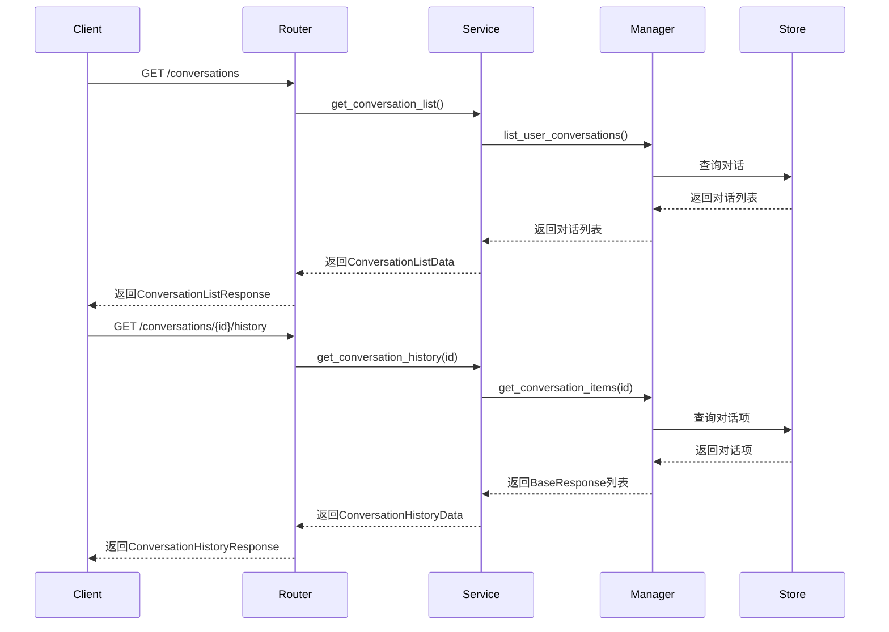
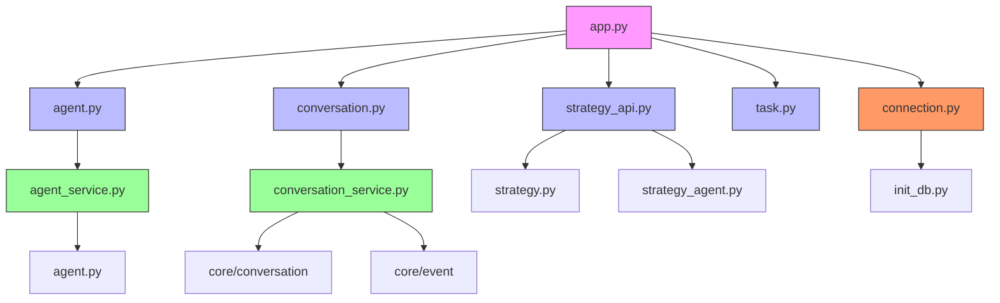

# 后端架构

<cite>
**本文档中引用的文件**  
- [main.py](file://python/valuecell/server/main.py)
- [app.py](file://python/valuecell/server/api/app.py)
- [init_db.py](file://python/valuecell/server/db/init_db.py)
- [connection.py](file://python/valuecell/server/db/connection.py)
- [agent.py](file://python/valuecell/server/api/routers/agent.py)
- [conversation.py](file://python/valuecell/server/api/routers/conversation.py)
- [strategy_api.py](file://python/valuecell/server/api/routers/strategy_api.py)
- [task.py](file://python/valuecell/server/api/routers/task.py)
- [base.py](file://python/valuecell/server/db/models/base.py)
- [agent.py](file://python/valuecell/server/db/models/agent.py)
- [strategy.py](file://python/valuecell/server/db/models/strategy.py)
- [asset.py](file://python/valuecell/server/db/models/asset.py)
- [agent_service.py](file://python/valuecell/server/services/agent_service.py)
- [conversation_service.py](file://python/valuecell/server/services/conversation_service.py)
</cite>

## 目录
1. [简介](#简介)
2. [项目结构](#项目结构)
3. [核心组件](#核心组件)
4. [架构概述](#架构概述)
5. [详细组件分析](#详细组件分析)
6. [依赖分析](#依赖分析)
7. [性能考虑](#性能考虑)
8. [故障排除指南](#故障排除指南)
9. [结论](#结论)

## 简介
本项目是一个基于FastAPI的后端服务器，为金融应用提供多智能体平台。系统通过REST API提供智能体管理、对话历史、策略创建和任务调度等功能。后端使用SQLAlchemy作为ORM框架，支持SQLite数据库，并通过模块化设计实现了清晰的分层架构。服务器在启动时初始化数据库表和默认数据，包括智能体配置和资产信息。API路由组织良好，每个功能领域都有独立的路由器，而服务层则处理业务逻辑并与数据库交互。

## 项目结构
项目采用分层架构，将API路由、数据库模型、服务逻辑和配置分离。`server/api/routers`目录包含所有API端点，每个功能（智能体、对话、策略等）都有独立的路由器。`server/db/models`目录包含SQLAlchemy ORM模型，定义了数据库表结构。`server/services`目录包含业务逻辑服务，处理API请求并操作数据。`server/db/connection.py`管理数据库连接和会话，而`server/db/init_db.py`负责数据库初始化。`server/api/app.py`是FastAPI应用工厂，配置了中间件、异常处理和路由。`main.py`是服务器入口点，使用Uvicorn运行应用。



**图源**  
- [app.py](file://python/valuecell/server/api/app.py)
- [routers/](file://python/valuecell/server/api/routers/)
- [services/](file://python/valuecell/server/services/)
- [db/models/](file://python/valuecell/server/db/models/)
- [connection.py](file://python/valuecell/server/db/connection.py)
- [init_db.py](file://python/valuecell/server/db/init_db.py)

**本节源码**  
- [app.py](file://python/valuecell/server/api/app.py)
- [connection.py](file://python/valuecell/server/db/connection.py)
- [init_db.py](file://python/valuecell/server/db/init_db.py)

## 核心组件
系统的核心组件包括FastAPI应用实例、数据库管理器和主要服务类。`create_app()`函数在`app.py`中创建和配置FastAPI应用，设置生命周期事件来初始化数据库和适配器。`DatabaseManager`类在`connection.py`中管理SQLAlchemy引擎和会话，提供依赖注入的`get_db()`函数。`AgentService`和`ConversationService`类分别处理智能体和对话的业务逻辑。API路由器如`create_agent_router()`和`create_conversation_router()`定义了具体的端点，将请求委托给相应的服务。数据库初始化过程在`init_db.py`中实现，确保表结构和默认数据就位。

**本节源码**  
- [main.py](file://python/valuecell/server/main.py)
- [app.py](file://python/valuecell/server/api/app.py)
- [connection.py](file://python/valuecell/server/db/connection.py)
- [agent_service.py](file://python/valuecell/server/services/agent_service.py)
- [conversation_service.py](file://python/valuecell/server/services/conversation_service.py)

## 架构概述
系统采用经典的三层架构：API层、服务层和数据层。API层由FastAPI路由器组成，处理HTTP请求并返回响应。服务层包含业务逻辑，协调数据操作并实现应用规则。数据层使用SQLAlchemy ORM与数据库交互。服务器启动时，通过`lifespan`上下文管理器初始化数据库表和默认数据。API端点使用依赖注入获取数据库会话，确保每个请求都有独立的事务上下文。异常处理由全局异常处理器统一管理，返回一致的错误响应。CORS中间件允许跨域请求，支持前端应用的集成。

```mermaid
graph TD
Client[客户端] --> API[API层]
API --> Services[服务层]
Services --> Data[数据层]
Data --> DB[(数据库)]
API < --> Services
Services < --> Data
subgraph "API层"
API1[智能体路由器]
API2[对话路由器]
API3[策略路由器]
API4[任务路由器]
end
subgraph "服务层"
S1[AgentService]
S2[ConversationService]
S3[StrategyService]
S4[TaskService]
end
subgraph "数据层"
D1[ORM模型]
D2[数据库连接]
D3[数据库初始化]
end
```

**图源**  
- [app.py](file://python/valuecell/server/api/app.py)
- [routers/](file://python/valuecell/server/api/routers/)
- [services/](file://python/valuecell/server/services/)
- [db/models/](file://python/valuecell/server/db/models/)
- [connection.py](file://python/valuecell/server/db/connection.py)

## 详细组件分析
### 智能体管理分析
智能体管理功能允许客户端查询和更新系统中的AI智能体。`Agent` ORM模型定义了智能体的属性，包括名称、描述、启用状态和能力。`AgentService`提供业务逻辑，支持查询所有智能体、按ID或名称查找特定智能体以及更新启用状态。`create_agent_router()`函数定义了相应的API端点，如`GET /agents`返回智能体列表，`POST /agents/{agent_name}/enable`更新智能体状态。服务层使用SQLAlchemy查询数据库，并将结果转换为API响应模型。智能体数据在服务器启动时从本地JSON文件初始化，确保系统始终有可用的智能体配置。



**图源**  
- [agent.py](file://python/valuecell/server/db/models/agent.py)
- [agent_service.py](file://python/valuecell/server/services/agent_service.py)
- [agent.py](file://python/valuecell/server/api/routers/agent.py)

**本节源码**  
- [agent.py](file://python/valuecell/server/db/models/agent.py)
- [agent_service.py](file://python/valuecell/server/services/agent_service.py)
- [agent.py](file://python/valuecell/server/api/routers/agent.py)

### 对话管理分析
对话管理功能处理用户与智能体之间的交互历史。`ConversationService`使用核心对话模块管理会话，支持获取对话列表、查看对话历史和删除对话。`create_conversation_router()`定义了相应的API端点，如`GET /conversations`返回用户对话列表，`GET /conversations/{conversation_id}/history`获取特定对话的完整历史。服务层通过`ConversationManager`与底层存储交互，重建对话事件流。对话数据存储在SQLite数据库中，包括`conversations`和`conversation_items`表。系统还支持获取计划任务结果，这些结果作为特殊组件类型存储在对话历史中。



**图源**  
- [conversation.py](file://python/valuecell/server/api/routers/conversation.py)
- [conversation_service.py](file://python/valuecell/server/services/conversation_service.py)
- [core/conversation/](file://python/valuecell/core/conversation/)

**本节源码**  
- [conversation.py](file://python/valuecell/server/api/routers/conversation.py)
- [conversation_service.py](file://python/valuecell/server/services/conversation_service.py)

### 策略管理分析
策略管理功能通过聚合路由器`create_strategy_api_router()`提供统一的访问点。该路由器组合了核心策略、策略智能体和策略提示的端点，所有路径都以`/strategies`为前缀。这种设计允许逻辑分离，同时提供简洁的API接口。策略相关的数据模型包括`Strategy`、`StrategyPrompt`和`StrategyPortfolio`，定义了策略的配置、提示模板和投资组合信息。服务层处理策略的创建、持久化和自动恢复，确保策略状态在服务器重启后得以保留。

```mermaid
graph TD
A[create_strategy_api_router] --> B[create_strategy_router]
A --> C[create_strategy_agent_router]
A --> D[create_strategy_prompts_router]
B --> E[/strategies]
C --> F[/strategies]
D --> G[/strategies/prompts]
class A,B,C,D router;
class E,F,G endpoint;
```

**图源**  
- [strategy_api.py](file://python/valuecell/server/api/routers/strategy_api.py)
- [strategy.py](file://python/valuecell/server/api/routers/strategy.py)
- [strategy_agent.py](file://python/valuecell/server/api/routers/strategy_agent.py)
- [strategy_prompts.py](file://python/valuecell/server/api/routers/strategy_prompts.py)

**本节源码**  
- [strategy_api.py](file://python/valuecell/server/api/routers/strategy_api.py)

## 依赖分析
系统依赖关系清晰，遵循依赖倒置原则。API路由器依赖服务层，服务层依赖数据层，形成单向依赖链。`app.py`通过`create_app()`函数协调所有组件，导入并注册各个路由器。服务类如`AgentService`和`ConversationService`不直接依赖具体实现，而是通过参数接收数据库会话，便于测试和替换。数据库连接通过全局`get_database_manager()`函数提供，确保整个应用使用相同的连接管理器。第三方依赖包括FastAPI、SQLAlchemy、Uvicorn和Loguru，分别处理Web服务、数据库ORM、ASGI服务器和日志记录。



**图源**  
- [app.py](file://python/valuecell/server/api/app.py)
- [routers/](file://python/valuecell/server/api/routers/)
- [services/](file://python/valuecell/server/services/)
- [db/](file://python/valuecell/server/db/)

**本节源码**  
- [app.py](file://python/valuecell/server/api/app.py)
- [connection.py](file://python/valuecell/server/db/connection.py)
- [init_db.py](file://python/valuecell/server/db/init_db.py)

## 性能考虑
系统在性能方面做了多项优化。数据库使用`StaticPool`连接池，特别针对SQLite优化，避免了多线程问题。API端点设计为异步，利用FastAPI的异步支持处理I/O操作。`ConversationService`在获取对话列表时排除策略智能体的对话，减少不必要的数据传输。数据库查询使用索引优化，如`agents`表的`name`字段和`conversations`表的`user_id`字段。服务器配置允许在调试模式下显示文档，但在生产环境中禁用以提高安全性。资产服务使用适配器模式，支持多个数据源（Yahoo Finance、AKShare、BaoStock），并自动配置可用的适配器。

## 故障排除指南
常见问题包括数据库初始化失败、智能体加载问题和API连接错误。数据库问题通常源于权限或路径问题，应检查`DATABASE_URL`环境变量和文件系统权限。智能体配置应放置在正确的目录中，JSON文件必须有效。API连接问题可能由CORS配置引起，应确保前端域名在`CORS_ORIGINS`设置中。日志记录使用Loguru，提供详细的启动和运行时信息，帮助诊断问题。服务器支持通过标准输入发送`__EXIT__`命令进行优雅关闭，便于容器环境管理。

**本节源码**  
- [main.py](file://python/valuecell/server/main.py)
- [app.py](file://python/valuecell/server/api/app.py)
- [init_db.py](file://python/valuecell/server/db/init_db.py)

## 结论
该项目实现了一个功能完整的FastAPI后端，为多智能体金融平台提供支持。架构清晰，分层合理，易于维护和扩展。ORM模型与数据库表一一对应，服务层封装了业务逻辑，API层提供了RESTful接口。数据库初始化过程健壮，确保系统始终处于一致状态。未来可扩展方向包括添加更多数据库支持、实现缓存机制和增强认证系统。整体设计遵循Python和FastAPI的最佳实践，代码质量高，文档完善。