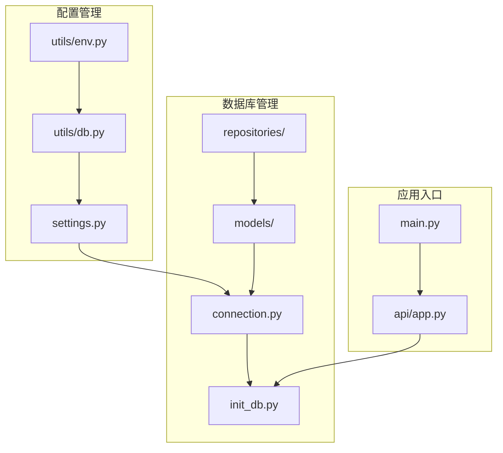
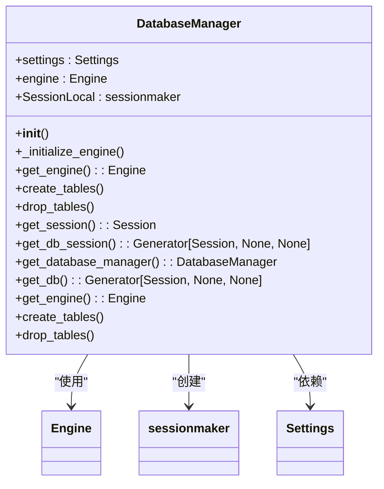
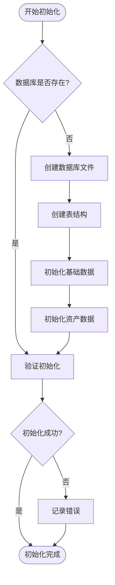
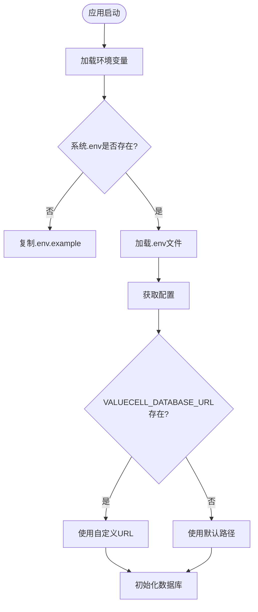
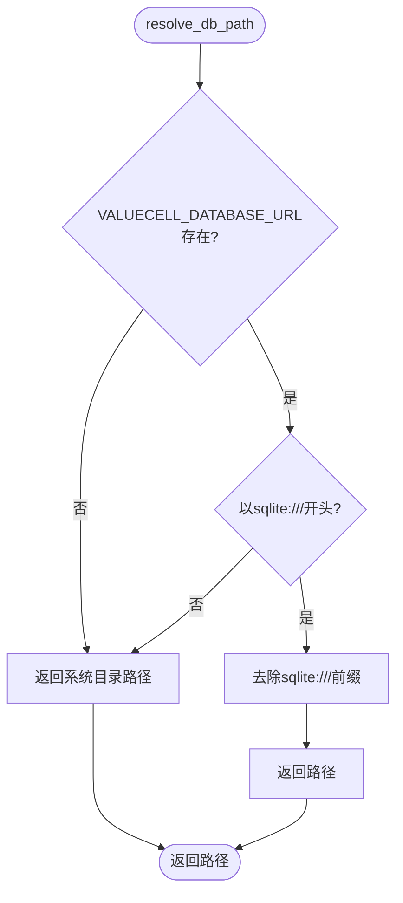
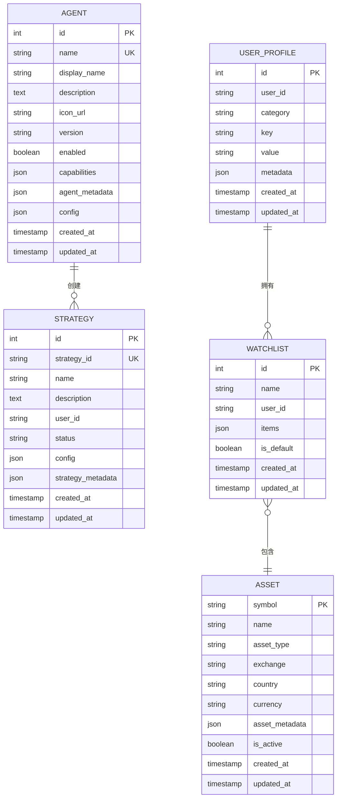
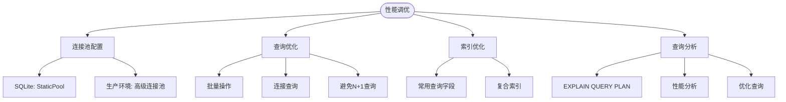
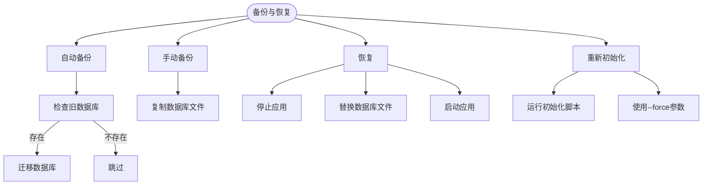
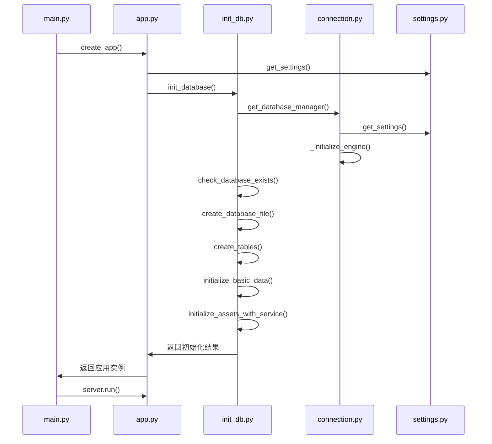

# 数据库管理

<cite>
**本文档引用的文件**
- [connection.py](file://python/valuecell/server/db/connection.py)
- [init_db.py](file://python/valuecell/server/db/init_db.py)
- [settings.py](file://python/valuecell/server/config/settings.py)
- [db.py](file://python/valuecell/utils/db.py)
- [main.py](file://python/valuecell/server/main.py)
- [app.py](file://python/valuecell/server/api/app.py)
- [base.py](file://python/valuecell/server/db/models/base.py)
- [agent.py](file://python/valuecell/server/db/models/agent.py)
- [strategy.py](file://python/valuecell/server/db/models/strategy.py)
</cite>

## 目录
1. [项目结构](#项目结构)
2. [数据库连接与会话管理](#数据库连接与会话管理)
3. [数据库初始化流程](#数据库初始化流程)
4. [配置管理与环境变量](#配置管理与环境变量)
5. [辅助函数与健康检查](#辅助函数与健康检查)
6. [表结构与数据模型](#表结构与数据模型)
7. [性能调优建议](#性能调优建议)
8. [备份与恢复方案](#备份与恢复方案)
9. [依赖关系与启动顺序](#依赖关系与启动顺序)

## 项目结构

根据项目结构，数据库管理相关的核心文件位于 `python/valuecell/server/db/` 目录下，主要包括：

- `connection.py`: 数据库连接和会话管理
- `init_db.py`: 数据库初始化脚本
- `models/`: 数据库模型定义
- `repositories/`: 数据访问层

配置相关文件位于：

- `server/config/settings.py`: 应用配置设置
- `utils/db.py`: 数据库路径解析工具
- `utils/env.py`: 环境变量和系统目录管理



**图表来源**
- [connection.py](file://python/valuecell/server/db/connection.py)
- [init_db.py](file://python/valuecell/server/db/init_db.py)
- [settings.py](file://python/valuecell/server/config/settings.py)
- [db.py](file://python/valuecell/utils/db.py)
- [main.py](file://python/valuecell/server/main.py)
- [app.py](file://python/valuecell/server/api/app.py)

**本节来源**
- [connection.py](file://python/valuecell/server/db/connection.py)
- [init_db.py](file://python/valuecell/server/db/init_db.py)
- [settings.py](file://python/valuecell/server/config/settings.py)

## 数据库连接与会话管理

数据库连接通过 `DatabaseManager` 类进行管理，该类封装了 SQLAlchemy 引擎和会话工厂的创建与管理。连接管理器基于配置中的数据库 URL 创建异步数据库引擎，并根据数据库类型进行特定配置。

对于 SQLite 数据库，连接管理器设置了特殊的连接参数：
- `check_same_thread=False`: 允许在不同线程间共享连接
- `timeout=20`: 设置 20 秒的连接超时时间
- 使用 `StaticPool` 连接池类，为每个线程创建独立的连接



**图表来源**
- [connection.py](file://python/valuecell/server/db/connection.py#L13-L103)

**本节来源**
- [connection.py](file://python/valuecell/server/db/connection.py#L1-L103)

## 数据库初始化流程

数据库初始化由 `DatabaseInitializer` 类负责，该类实现了完整的数据库初始化流程，包括数据库文件创建、表结构初始化、基础数据填充等步骤。

初始化流程遵循以下步骤：
1. 检查数据库是否存在
2. 创建数据库文件（针对 SQLite）
3. 创建所有表结构
4. 初始化基础数据（代理、策略提示等）
5. 初始化资产数据
6. 验证初始化结果



**图表来源**
- [init_db.py](file://python/valuecell/server/db/init_db.py#L36-L657)

**本节来源**
- [init_db.py](file://python/valuecell/server/db/init_db.py#L1-L719)

## 配置管理与环境变量

数据库配置通过环境变量进行管理，支持不同环境（开发、生产）的配置切换。配置优先级如下：
1. `VALUECELL_DATABASE_URL` 环境变量
2. 系统应用目录的默认路径

系统会自动在用户系统目录中创建 `.env` 文件，如果不存在的话。对于 macOS，数据库文件位于 `~/Library/Application Support/ValueCell/valuecell.db`；对于 Linux，位于 `~/.config/valuecell/valuecell.db`；对于 Windows，位于 `%APPDATA%\ValueCell\valuecell.db`。



**图表来源**
- [settings.py](file://python/valuecell/server/config/settings.py#L33-L98)
- [app.py](file://python/valuecell/server/api/app.py#L35-L83)

**本节来源**
- [settings.py](file://python/valuecell/server/config/settings.py#L1-L98)
- [app.py](file://python/valuecell/server/api/app.py#L1-L242)
- [.env.example](file://.env.example)

## 辅助函数与健康检查

`utils/db.py` 模块提供了数据库路径解析的辅助函数，包括 `resolve_db_path()` 和 `resolve_lancedb_uri()`。这些函数负责解析数据库文件的实际路径，支持从环境变量或系统默认位置获取路径。

`resolve_db_path()` 函数的解析顺序：
1. 检查 `VALUECELL_DATABASE_URL` 环境变量是否以 `sqlite:///` 开头
2. 如果是，返回去除前缀的路径
3. 否则，返回系统应用目录下的默认路径



**图表来源**
- [db.py](file://python/valuecell/utils/db.py#L1-L69)

**本节来源**
- [db.py](file://python/valuecell/utils/db.py#L1-L69)

## 表结构与数据模型

数据库使用 SQLAlchemy ORM 定义数据模型，所有模型继承自 `Base` 类。核心数据模型包括：

- `Agent`: 代理模型，存储代理信息
- `Strategy`: 策略模型，存储用户创建的策略
- `Asset`: 资产模型，存储金融资产信息
- `UserProfile`: 用户配置文件模型
- `Watchlist`: 观察列表模型



**图表来源**
- [base.py](file://python/valuecell/server/db/models/base.py#L1-L11)
- [agent.py](file://python/valuecell/server/db/models/agent.py#L1-L131)
- [strategy.py](file://python/valuecell/server/db/models/strategy.py#L1-L74)

**本节来源**
- [base.py](file://python/valuecell/server/db/models/base.py#L1-L11)
- [agent.py](file://python/valuecell/server/db/models/agent.py#L1-L131)
- [strategy.py](file://python/valuecell/server/db/models/strategy.py#L1-L74)

## 性能调优建议

### 连接池配置
对于 SQLite 数据库，使用 `StaticPool` 连接池类，为每个线程创建独立的连接，避免线程安全问题。对于生产环境的其他数据库，可以考虑使用更高级的连接池配置。

### 查询优化
1. 为常用查询字段创建索引
2. 使用批量操作处理大量数据
3. 避免 N+1 查询问题
4. 使用连接查询替代多次单表查询

### 索引优化
在 `init_db.py` 中已经为常用查询字段创建了索引：
- `conversation_items` 表的 `conversation_id` 和 `created_at` 字段
- `tasks` 表的 `conversation_id`、`user_id` 和 `status` 字段

### 查询分析
建议定期使用数据库的查询分析工具（如 SQLite 的 `EXPLAIN QUERY PLAN`）来分析慢查询，并根据分析结果优化查询语句和索引。



**本节来源**
- [connection.py](file://python/valuecell/server/db/connection.py#L1-L103)
- [init_db.py](file://python/valuecell/server/db/init_db.py#L1-L719)

## 备份与恢复方案

### 自动备份
系统在启动时会自动检查并迁移旧版本的数据库文件。如果在项目根目录发现旧的 `valuecell.db` 文件，而系统目录中没有数据库文件，则会自动将旧数据库文件复制到系统目录。

### 手动备份
用户可以通过复制数据库文件进行手动备份。数据库文件的默认位置根据操作系统而异：
- macOS: `~/Library/Application Support/ValueCell/valuecell.db`
- Linux: `~/.config/valuecell/valuecell.db`
- Windows: `%APPDATA%\ValueCell\valuecell.db`

### 恢复流程
1. 停止应用程序
2. 将备份的数据库文件复制到上述位置
3. 启动应用程序

### 强制重新初始化
如果需要重新初始化数据库，可以使用 `--force` 参数运行初始化脚本：

```bash
python3 -m valuecell.server.db.init_db --force
```

这将删除现有数据库并重新创建所有表结构和基础数据。



**图表来源**
- [init_db.py](file://python/valuecell/server/db/init_db.py#L94-L137)
- [db.py](file://python/valuecell/utils/db.py#L1-L69)

**本节来源**
- [init_db.py](file://python/valuecell/server/db/init_db.py#L1-L719)
- [db.py](file://python/valuecell/utils/db.py#L1-L69)

## 依赖关系与启动顺序

数据库管理与其他核心服务有明确的依赖关系和启动顺序要求。应用启动时，数据库初始化必须在其他服务之前完成。

### 启动顺序
1. 加载环境变量和配置
2. 初始化数据库连接
3. 创建表结构和初始化基础数据
4. 启动 API 服务器
5. 启动其他服务（适配器、代理等）

### 依赖关系
- `main.py` 依赖 `app.py` 创建应用实例
- `app.py` 在应用生命周期的启动阶段调用 `init_database()`
- `init_database()` 依赖 `connection.py` 中的数据库连接
- `connection.py` 依赖 `settings.py` 中的配置



**图表来源**
- [main.py](file://python/valuecell/server/main.py#L1-L99)
- [app.py](file://python/valuecell/server/api/app.py#L1-L242)
- [init_db.py](file://python/valuecell/server/db/init_db.py#L1-L719)
- [connection.py](file://python/valuecell/server/db/connection.py#L1-L103)
- [settings.py](file://python/valuecell/server/config/settings.py#L1-L98)

**本节来源**
- [main.py](file://python/valuecell/server/main.py#L1-L99)
- [app.py](file://python/valuecell/server/api/app.py#L1-L242)