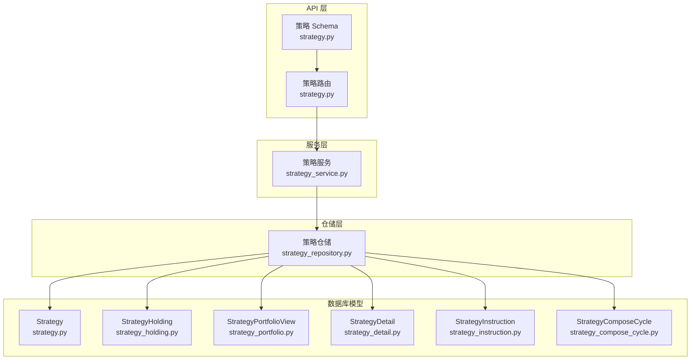
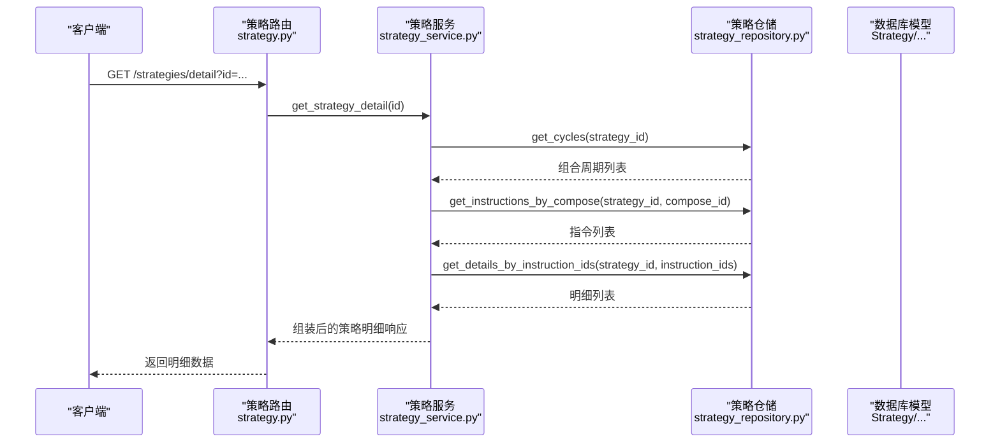
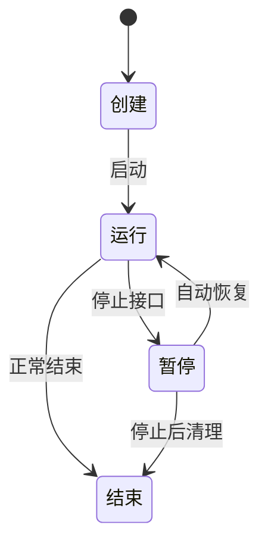
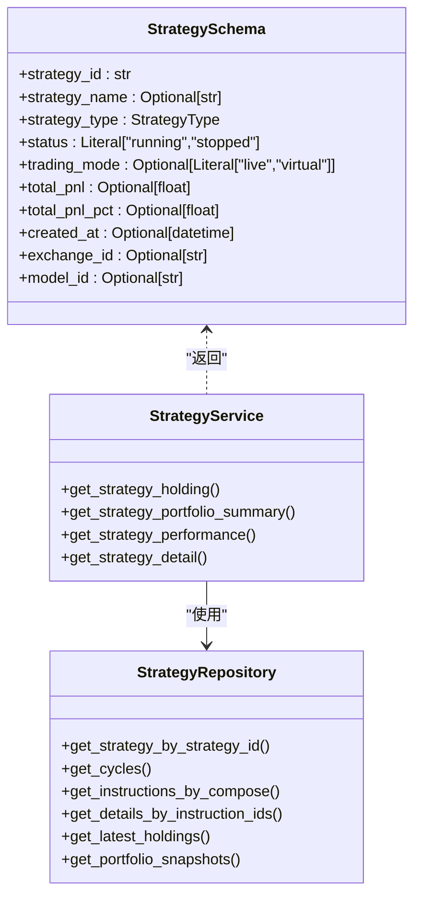
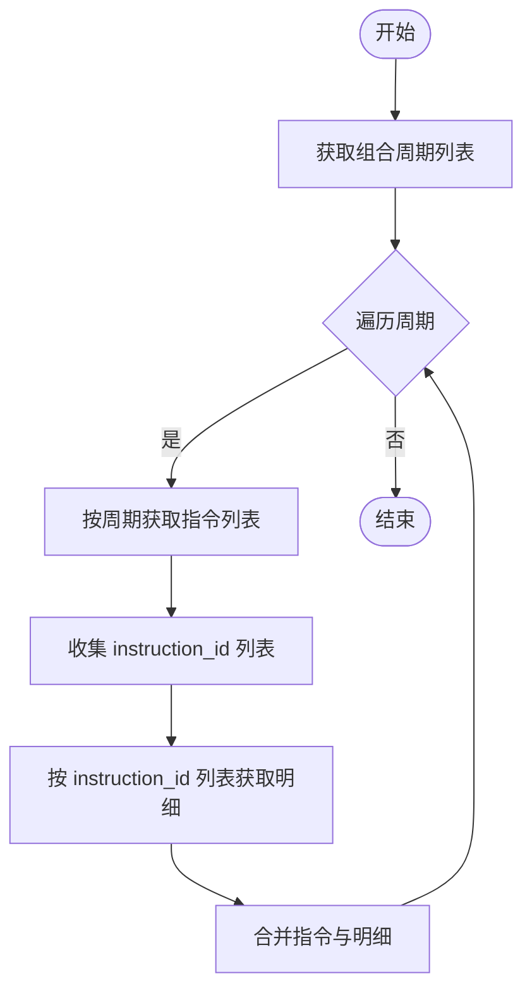
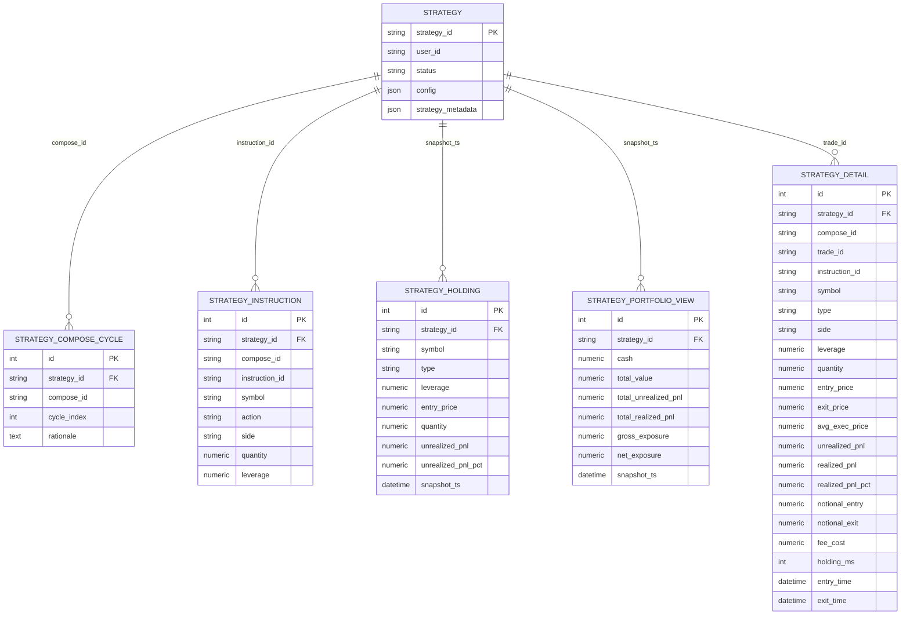
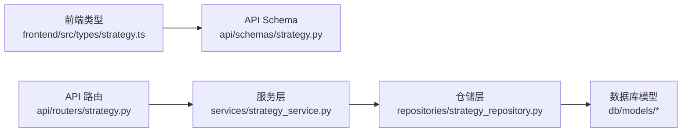

# 交易策略模型

<cite>
**本文引用的文件**
- [python/valuecell/server/db/models/strategy.py](file://python/valuecell/server/db/models/strategy.py)
- [python/valuecell/server/db/models/strategy_portfolio.py](file://python/valuecell/server/db/models/strategy_portfolio.py)
- [python/valuecell/server/db/models/strategy_holding.py](file://python/valuecell/server/db/models/strategy_holding.py)
- [python/valuecell/server/db/models/strategy_detail.py](file://python/valuecell/server/db/models/strategy_detail.py)
- [python/valuecell/server/db/models/strategy_instruction.py](file://python/valuecell/server/db/models/strategy_instruction.py)
- [python/valuecell/server/db/models/strategy_compose_cycle.py](file://python/valuecell/server/db/models/strategy_compose_cycle.py)
- [python/valuecell/server/api/routers/strategy.py](file://python/valuecell/server/api/routers/strategy.py)
- [python/valuecell/server/api/schemas/strategy.py](file://python/valuecell/server/api/schemas/strategy.py)
- [python/valuecell/server/services/strategy_service.py](file://python/valuecell/server/services/strategy_service.py)
- [python/valuecell/server/db/repositories/strategy_repository.py](file://python/valuecell/server/db/repositories/strategy_repository.py)
- [python/valuecell/server/services/strategy_autoresume.py](file://python/valuecell/server/services/strategy_autoresume.py)
- [python/valuecell/server/db/init_db.py](file://python/valuecell/server/db/init_db.py)
- [frontend/src/types/strategy.ts](file://frontend/src/types/strategy.ts)
</cite>

## 目录
1. [简介](#简介)
2. [项目结构](#项目结构)
3. [核心组件](#核心组件)
4. [架构总览](#架构总览)
5. [详细组件分析](#详细组件分析)
6. [依赖关系分析](#依赖关系分析)
7. [性能考量](#性能考量)
8. [故障排查指南](#故障排查指南)
9. [结论](#结论)
10. [附录](#附录)

## 简介
本文件系统性梳理交易策略模型在 ValueCell 中的设计与实现，围绕 Strategy 主实体及其关联模型（策略组合周期、策略持仓、策略指令、策略明细、策略组合视图）展开，重点解释：
- 核心字段：strategy_id（运行时标识）、user_id（所有者）、status（运行状态）、config（原始请求配置）、strategy_metadata（代理与模型提供商信息）
- 生命周期管理：创建、运行、暂停与恢复
- 数据模型与 API 层 Pydantic Schema 的映射关系
- 实际代码示例路径：策略组合查询、持仓记录获取、指令追溯
- ER 图展示主从表关系

## 项目结构
围绕策略相关的核心模块分布如下：
- 数据库模型：位于 python/valuecell/server/db/models 下，包含 Strategy、StrategyHolding、StrategyPortfolioView、StrategyDetail、StrategyInstruction、StrategyComposeCycle 等
- 仓储层：位于 python/valuecell/server/db/repositories，统一提供策略、组合周期、指令、明细、快照等数据访问
- 服务层：位于 python/valuecell/server/services，封装策略汇总、表现、明细、组合曲线等业务逻辑
- API 路由与 Schema：位于 python/valuecell/server/api/routers 与 python/valuecell/server/api/schemas
- 前端类型：位于 frontend/src/types/strategy.ts
- 初始化脚本：python/valuecell/server/db/init_db.py

图表来源
- [python/valuecell/server/api/routers/strategy.py](file://python/valuecell/server/api/routers/strategy.py#L1-L525)
- [python/valuecell/server/api/schemas/strategy.py](file://python/valuecell/server/api/schemas/strategy.py#L1-L276)
- [python/valuecell/server/services/strategy_service.py](file://python/valuecell/server/services/strategy_service.py#L1-L415)
- [python/valuecell/server/db/repositories/strategy_repository.py](file://python/valuecell/server/db/repositories/strategy_repository.py#L1-L648)
- [python/valuecell/server/db/models/strategy.py](file://python/valuecell/server/db/models/strategy.py#L1-L74)
- [python/valuecell/server/db/models/strategy_holding.py](file://python/valuecell/server/db/models/strategy_holding.py#L1-L112)
- [python/valuecell/server/db/models/strategy_portfolio.py](file://python/valuecell/server/db/models/strategy_portfolio.py#L1-L122)
- [python/valuecell/server/db/models/strategy_detail.py](file://python/valuecell/server/db/models/strategy_detail.py#L1-L166)
- [python/valuecell/server/db/models/strategy_instruction.py](file://python/valuecell/server/db/models/strategy_instruction.py#L1-L75)
- [python/valuecell/server/db/models/strategy_compose_cycle.py](file://python/valuecell/server/db/models/strategy_compose_cycle.py#L1-L76)

章节来源
- [python/valuecell/server/api/routers/strategy.py](file://python/valuecell/server/api/routers/strategy.py#L1-L525)
- [python/valuecell/server/api/schemas/strategy.py](file://python/valuecell/server/api/schemas/strategy.py#L1-L276)
- [python/valuecell/server/services/strategy_service.py](file://python/valuecell/server/services/strategy_service.py#L1-L415)
- [python/valuecell/server/db/repositories/strategy_repository.py](file://python/valuecell/server/db/repositories/strategy_repository.py#L1-L648)
- [python/valuecell/server/db/models/strategy.py](file://python/valuecell/server/db/models/strategy.py#L1-L74)
- [python/valuecell/server/db/models/strategy_holding.py](file://python/valuecell/server/db/models/strategy_holding.py#L1-L112)
- [python/valuecell/server/db/models/strategy_portfolio.py](file://python/valuecell/server/db/models/strategy_portfolio.py#L1-L122)
- [python/valuecell/server/db/models/strategy_detail.py](file://python/valuecell/server/db/models/strategy_detail.py#L1-L166)
- [python/valuecell/server/db/models/strategy_instruction.py](file://python/valuecell/server/db/models/strategy_instruction.py#L1-L75)
- [python/valuecell/server/db/models/strategy_compose_cycle.py](file://python/valuecell/server/db/models/strategy_compose_cycle.py#L1-L76)

## 核心组件
- Strategy 主实体：承载策略运行时标识、所有者、状态、配置与元数据，提供 to_dict 序列化
- StrategyHolding：按时间快照记录单个标的持仓详情（含杠杆、均价、未实现盈亏等）
- StrategyPortfolioView：聚合快照记录（现金、总值、未实现/已实现盈亏、总敞口等）
- StrategyDetail：策略交易明细（含成交均价、入场/出场时间、手续费、持有时长等）
- StrategyInstruction：组合周期内生成的指令（含符号、动作、方向、数量、杠杆等）
- StrategyComposeCycle：组合周期元数据（compose_id、cycle_index、理由等）

章节来源
- [python/valuecell/server/db/models/strategy.py](file://python/valuecell/server/db/models/strategy.py#L1-L74)
- [python/valuecell/server/db/models/strategy_holding.py](file://python/valuecell/server/db/models/strategy_holding.py#L1-L112)
- [python/valuecell/server/db/models/strategy_portfolio.py](file://python/valuecell/server/db/models/strategy_portfolio.py#L1-L122)
- [python/valuecell/server/db/models/strategy_detail.py](file://python/valuecell/server/db/models/strategy_detail.py#L1-L166)
- [python/valuecell/server/db/models/strategy_instruction.py](file://python/valuecell/server/db/models/strategy_instruction.py#L1-L75)
- [python/valuecell/server/db/models/strategy_compose_cycle.py](file://python/valuecell/server/db/models/strategy_compose_cycle.py#L1-L76)

## 架构总览
策略数据流自上而下：API 路由接收请求，调用服务层方法，服务层通过仓储层访问数据库模型，最终返回给前端或调用方。

图表来源
- [python/valuecell/server/api/routers/strategy.py](file://python/valuecell/server/api/routers/strategy.py#L330-L356)
- [python/valuecell/server/services/strategy_service.py](file://python/valuecell/server/services/strategy_service.py#L302-L415)
- [python/valuecell/server/db/repositories/strategy_repository.py](file://python/valuecell/server/db/repositories/strategy_repository.py#L448-L510)

## 详细组件分析

### Strategy 主实体与字段语义
- strategy_id：运行时唯一标识，作为外键关联其他子表，便于跨表查询与追踪
- user_id：策略所有者标识，用于权限过滤与统计
- status：策略运行状态，支持 running/stopped；API 提供停止接口
- config：原始用户请求配置（JSON），包含模型、交易所、交易参数等
- strategy_metadata：代理与模型提供商信息（JSON），包含策略类型、交易模式、初始资金等

章节来源
- [python/valuecell/server/db/models/strategy.py](file://python/valuecell/server/db/models/strategy.py#L1-L74)
- [python/valuecell/server/api/routers/strategy.py](file://python/valuecell/server/api/routers/strategy.py#L487-L524)

### 策略生命周期管理
- 创建：通过 upsert_strategy 或业务流程写入 Strategy 行，同时持久化组合周期、指令、明细与快照
- 运行：策略在 RUNNING 状态下持续产生组合周期、指令与明细
- 暂停：通过 /strategies/stop 将 status 更新为 STOPPED
- 恢复：进程启动时扫描 RUNNING 或特定 STOPPED（取消原因）策略，自动恢复执行

图表来源
- [python/valuecell/server/api/routers/strategy.py](file://python/valuecell/server/api/routers/strategy.py#L487-L524)
- [python/valuecell/server/services/strategy_autoresume.py](file://python/valuecell/server/services/strategy_autoresume.py#L1-L150)
- [python/valuecell/server/db/repositories/strategy_repository.py](file://python/valuecell/server/db/repositories/strategy_repository.py#L587-L628)

章节来源
- [python/valuecell/server/api/routers/strategy.py](file://python/valuecell/server/api/routers/strategy.py#L487-L524)
- [python/valuecell/server/services/strategy_autoresume.py](file://python/valuecell/server/services/strategy_autoresume.py#L1-L150)
- [python/valuecell/server/db/repositories/strategy_repository.py](file://python/valuecell/server/db/repositories/strategy_repository.py#L587-L628)

### 数据模型与 API Schema 映射
- API Schema 使用 Pydantic 定义响应结构，如 StrategySummaryData、StrategyHoldingData、StrategyDetailResponse、StrategyPerformanceData 等
- 服务层将仓储查询结果映射到 Pydantic 模型，再由路由返回
- 前端类型定义与 API Schema 对应，确保前后端一致

图表来源
- [python/valuecell/server/api/schemas/strategy.py](file://python/valuecell/server/api/schemas/strategy.py#L1-L276)
- [python/valuecell/server/services/strategy_service.py](file://python/valuecell/server/services/strategy_service.py#L1-L415)
- [python/valuecell/server/db/repositories/strategy_repository.py](file://python/valuecell/server/db/repositories/strategy_repository.py#L1-L648)

章节来源
- [python/valuecell/server/api/schemas/strategy.py](file://python/valuecell/server/api/schemas/strategy.py#L1-L276)
- [python/valuecell/server/services/strategy_service.py](file://python/valuecell/server/services/strategy_service.py#L1-L415)
- [frontend/src/types/strategy.ts](file://frontend/src/types/strategy.ts#L1-L152)

### 策略组合查询、持仓记录获取与指令追溯
- 策略组合查询：通过 get_cycles 获取组合周期列表，再按 compose_id 查询指令集
- 持仓记录获取：通过 get_latest_holdings 获取最新快照下的持仓，结合 get_latest_portfolio_snapshot 计算总值与盈亏
- 指令追溯：通过 get_instructions_by_compose 获取指令，再按 instruction_id 列表查询 StrategyDetail 获取成交细节

图表来源
- [python/valuecell/server/services/strategy_service.py](file://python/valuecell/server/services/strategy_service.py#L302-L415)
- [python/valuecell/server/db/repositories/strategy_repository.py](file://python/valuecell/server/db/repositories/strategy_repository.py#L448-L510)

章节来源
- [python/valuecell/server/services/strategy_service.py](file://python/valuecell/server/services/strategy_service.py#L302-L415)
- [python/valuecell/server/db/repositories/strategy_repository.py](file://python/valuecell/server/db/repositories/strategy_repository.py#L448-L510)

### ER 图：主从表关系
- Strategy 为主表，其他表均以 strategy_id 外键关联
- StrategyComposeCycle 与 StrategyInstruction 描述策略在某个 compose_id 下的动作集合
- StrategyHolding 与 StrategyPortfolioView 分别记录逐标的快照与聚合快照
- StrategyDetail 记录每笔交易的执行细节

图表来源
- [python/valuecell/server/db/models/strategy.py](file://python/valuecell/server/db/models/strategy.py#L1-L74)
- [python/valuecell/server/db/models/strategy_compose_cycle.py](file://python/valuecell/server/db/models/strategy_compose_cycle.py#L1-L76)
- [python/valuecell/server/db/models/strategy_instruction.py](file://python/valuecell/server/db/models/strategy_instruction.py#L1-L75)
- [python/valuecell/server/db/models/strategy_holding.py](file://python/valuecell/server/db/models/strategy_holding.py#L1-L112)
- [python/valuecell/server/db/models/strategy_portfolio.py](file://python/valuecell/server/db/models/strategy_portfolio.py#L1-L122)
- [python/valuecell/server/db/models/strategy_detail.py](file://python/valuecell/server/db/models/strategy_detail.py#L1-L166)

## 依赖关系分析
- API 路由依赖服务层；服务层依赖仓储层；仓储层依赖 SQLAlchemy 模型
- 前端类型与 API Schema 存在一一对应关系，保证数据一致性
- 自动恢复逻辑依赖策略状态与元数据，避免误恢复

图表来源
- [frontend/src/types/strategy.ts](file://frontend/src/types/strategy.ts#L1-L152)
- [python/valuecell/server/api/schemas/strategy.py](file://python/valuecell/server/api/schemas/strategy.py#L1-L276)
- [python/valuecell/server/api/routers/strategy.py](file://python/valuecell/server/api/routers/strategy.py#L1-L525)
- [python/valuecell/server/services/strategy_service.py](file://python/valuecell/server/services/strategy_service.py#L1-L415)
- [python/valuecell/server/db/repositories/strategy_repository.py](file://python/valuecell/server/db/repositories/strategy_repository.py#L1-L648)
- [python/valuecell/server/db/models/strategy.py](file://python/valuecell/server/db/models/strategy.py#L1-L74)

章节来源
- [frontend/src/types/strategy.ts](file://frontend/src/types/strategy.ts#L1-L152)
- [python/valuecell/server/api/schemas/strategy.py](file://python/valuecell/server/api/schemas/strategy.py#L1-L276)
- [python/valuecell/server/api/routers/strategy.py](file://python/valuecell/server/api/routers/strategy.py#L1-L525)
- [python/valuecell/server/services/strategy_service.py](file://python/valuecell/server/services/strategy_service.py#L1-L415)
- [python/valuecell/server/db/repositories/strategy_repository.py](file://python/valuecell/server/db/repositories/strategy_repository.py#L1-L648)

## 性能考量
- 快照去重：StrategyHolding 与 StrategyPortfolioView 在同一 strategy_id + 时间戳上设置唯一约束，避免重复写入
- 查询优化：按 strategy_id、symbol、compose_id、instruction_id 等建立索引，提升联结与过滤效率
- 批量操作：明细与指令写入采用批量提交，减少事务开销
- 浮点转换：服务层对数值进行安全转换，避免异常导致的性能问题

[本节为通用指导，不直接分析具体文件]

## 故障排查指南
- 策略停止失败：检查 /strategies/stop 是否传入正确的 strategy_id，确认仓储层 upsert_strategy 是否成功
- 自动恢复失败：查看 auto_resume_strategies 日志，确认策略状态与元数据是否满足恢复条件
- 数据缺失：若 get_strategy_detail 返回空，检查是否存在对应的组合周期与指令；确认 instruction_id 与明细表的关联是否正确
- 初始化异常：数据库初始化脚本会创建表与默认数据，若失败可重试或检查数据库连接

章节来源
- [python/valuecell/server/api/routers/strategy.py](file://python/valuecell/server/api/routers/strategy.py#L487-L524)
- [python/valuecell/server/services/strategy_autoresume.py](file://python/valuecell/server/services/strategy_autoresume.py#L1-L150)
- [python/valuecell/server/db/init_db.py](file://python/valuecell/server/db/init_db.py#L1-L719)

## 结论
该策略模型以 Strategy 为核心，围绕组合周期、指令、明细与快照构建完整数据链路，配合 API Schema 与服务层实现策略组合查询、持仓获取与指令追溯。生命周期管理通过状态字段与自动恢复机制实现稳健运行，ER 图清晰展示了主从关系与外键约束，为后续扩展与维护提供了坚实基础。

[本节为总结性内容，不直接分析具体文件]

## 附录

### 关键字段与 JSON 结构设计要点
- strategy_id：字符串，唯一且作为外键，建议与运行时生成的标识保持一致
- user_id：字符串，用于归属与权限控制
- status：字符串，枚举值（running/stopped），API 提供停止接口
- config：JSON 对象，包含 llm_model_config、exchange_config、trading_config 等
- strategy_metadata：JSON 对象，包含 agent_name、provider、model_id、exchange_id、initial_capital_live、strategy_type、trading_mode 等

章节来源
- [python/valuecell/server/db/models/strategy.py](file://python/valuecell/server/db/models/strategy.py#L1-L74)
- [python/valuecell/server/api/schemas/strategy.py](file://python/valuecell/server/api/schemas/strategy.py#L241-L276)

### 实际代码示例路径（不含代码内容）
- 策略组合查询
  - [python/valuecell/server/services/strategy_service.py](file://python/valuecell/server/services/strategy_service.py#L302-L415)
  - [python/valuecell/server/db/repositories/strategy_repository.py](file://python/valuecell/server/db/repositories/strategy_repository.py#L448-L510)
- 持仓记录获取
  - [python/valuecell/server/services/strategy_service.py](file://python/valuecell/server/services/strategy_service.py#L27-L105)
  - [python/valuecell/server/db/repositories/strategy_repository.py](file://python/valuecell/server/db/repositories/strategy_repository.py#L204-L232)
- 指令追溯
  - [python/valuecell/server/services/strategy_service.py](file://python/valuecell/server/services/strategy_service.py#L302-L415)
  - [python/valuecell/server/db/repositories/strategy_repository.py](file://python/valuecell/server/db/repositories/strategy_repository.py#L468-L510)