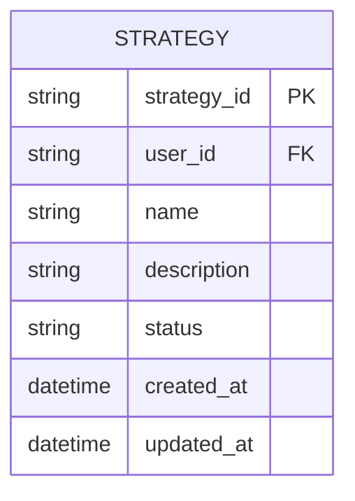
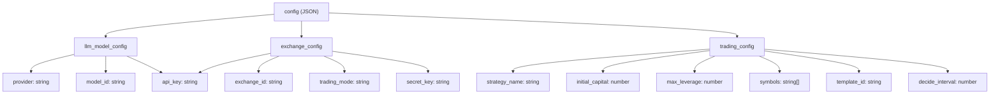
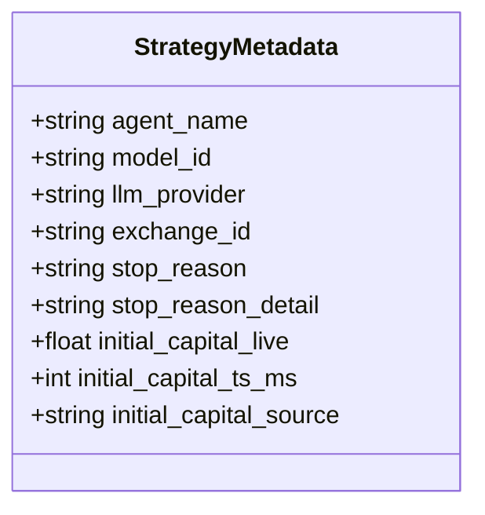
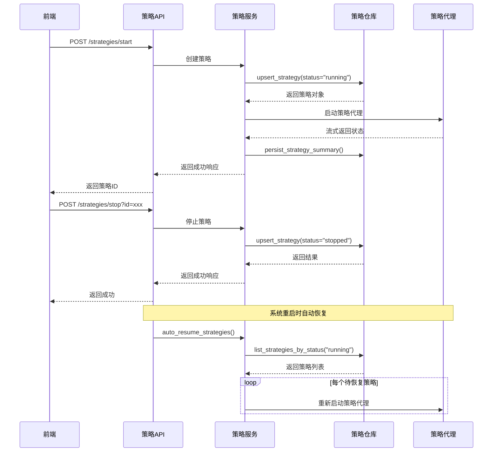
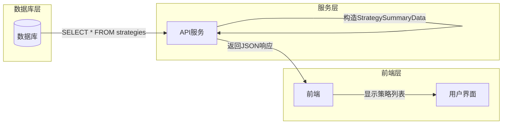

# 策略主模型

<cite>
**本文档引用的文件**   
- [strategy.ts](file://frontend/src/types/strategy.ts)
- [strategy.py](file://python/valuecell/server/db/models/strategy.py)
- [strategy_repository.py](file://python/valuecell/server/db/repositories/strategy_repository.py)
- [strategy_service.py](file://python/valuecell/server/services/strategy_service.py)
- [strategy.py](file://python/valuecell/server/api/routers/strategy.py)
- [strategy_persistence.py](file://python/valuecell/server/services/strategy_persistence.py)
- [strategy_autoresume.py](file://python/valuecell/server/services/strategy_autoresume.py)
- [strategy.py](file://python/valuecell/server/api/schemas/strategy.py)
</cite>

## 目录
1. [简介](#简介)
2. [核心字段解析](#核心字段解析)
3. [配置字段结构设计](#配置字段结构设计)
4. [策略元数据设计](#策略元数据设计)
5. [策略生命周期管理](#策略生命周期管理)
6. [数据库表结构与索引](#数据库表结构与索引)
7. [API层与数据库层数据映射](#apilayer与数据库层数据映射)

## 简介
策略主模型是ValueCell系统中交易策略的核心实体，负责存储和管理通过策略代理（StrategyAgent）创建的所有交易策略的元数据和配置信息。该模型作为策略生命周期的中心枢纽，连接了前端用户界面、后端服务逻辑和数据库持久化层。策略主模型不仅记录了策略的基本属性如唯一标识、所有者和运行状态，还通过JSON字段存储了原始用户请求配置和代理特定的元数据，为策略的创建、监控、暂停、恢复和性能分析提供了完整的数据支持。

**Section sources**
- [strategy.py](file://python/valuecell/server/db/models/strategy.py#L1-L74)

## 核心字段解析
策略主模型的核心字段设计旨在提供策略的唯一标识、所有权信息和运行状态管理。`strategy_id`字段作为运行时唯一标识，确保每个策略实例在整个系统中的唯一性。`user_id`字段记录策略的所有者，实现了多用户环境下的策略隔离和权限控制。`status`字段采用枚举值"running"和"stopped"来表示策略的运行状态，是策略生命周期管理的关键控制点。此外，模型还包含`name`和`description`等可选字段，允许用户为策略添加可读性名称和描述信息。`created_at`和`updated_at`时间戳字段则自动记录策略的创建和最后更新时间，为审计和监控提供了时间维度的数据支持。



**Diagram sources **
- [strategy.py](file://python/valuecell/server/db/models/strategy.py#L15-L74)

**Section sources**
- [strategy.py](file://python/valuecell/server/db/models/strategy.py#L15-L74)

## 配置字段结构设计
`config`字段是策略主模型中最重要的JSON结构，它完整地存储了用户创建策略时的原始请求配置。该字段采用分层设计，包含三个主要子对象：`llm_model_config`、`exchange_config`和`trading_config`。`llm_model_config`包含大语言模型的提供商、模型ID和API密钥等信息，确保策略能够正确调用指定的AI模型。`exchange_config`记录了交易所的ID、交易模式（实盘/虚拟）以及API认证信息，为策略执行交易提供了必要的连接参数。`trading_config`则包含了策略的核心交易参数，如`initial_capital`（初始资金）、`max_leverage`（最大杠杆）和`symbols`（交易标的）等。这种结构化的设计使得配置信息既易于解析，又便于后续的性能分析和审计。



**Diagram sources **
- [strategy.ts](file://frontend/src/types/strategy.ts#L82-L110)
- [strategy.py](file://python/valuecell/server/db/models/strategy.py#L41-L44)

**Section sources**
- [strategy.ts](file://frontend/src/types/strategy.ts#L82-L110)
- [strategy.py](file://python/valuecell/server/db/models/strategy.py#L41-L44)

## 策略元数据设计
`strategy_metadata`字段是另一个关键的JSON字段，用于记录策略运行时的动态信息和代理特定的元数据。与`config`字段存储静态配置不同，`strategy_metadata`主要用于存储在策略运行过程中生成或更新的信息。该字段包含`agent_name`（代理类型）、`model_id`（模型提供商信息）、`exchange_id`（交易所ID）等关键属性，这些信息在策略创建时从配置中提取并标准化，便于后续的查询和分析。此外，元数据字段还用于存储策略停止的原因（`stop_reason`）和详细说明（`stop_reason_detail`），为故障排查和用户体验优化提供了重要依据。在实盘交易模式下，该字段还特别记录了`initial_capital_live`，即策略启动时的实际初始资金，这对于准确计算投资回报率至关重要。



**Diagram sources **
- [strategy.py](file://python/valuecell/server/db/models/strategy.py#L42-L44)
- [strategy_service.py](file://python/valuecell/server/services/strategy_service.py#L219-L226)

**Section sources**
- [strategy.py](file://python/valuecell/server/db/models/strategy.py#L42-L44)
- [strategy_service.py](file://python/valuecell/server/services/strategy_service.py#L219-L226)

## 策略生命周期管理
策略生命周期管理机制通过策略代理（StrategyAgent）实现，涵盖了策略的创建、状态变更、暂停与恢复等核心操作。当用户通过前端界面提交创建策略请求时，系统会调用策略代理，根据`UserRequest`配置创建新的策略实例，并将其`status`设置为"running"。策略的暂停和恢复通过状态变更实现：调用`/strategies/stop` API端点会将指定策略的`status`更新为"stopped"，而系统重启时的自动恢复机制会扫描所有`status`为"running"的策略并重新启动它们。`strategy_persistence`服务模块提供了`set_strategy_status`和`mark_strategy_stopped`等便捷方法，封装了状态更新的复杂逻辑。`strategy_autoresume`模块实现了智能的自动恢复功能，不仅恢复运行中的策略，还会恢复因取消而停止但意图自动重启的策略，确保了系统的高可用性和用户体验的连续性。



**Diagram sources **
- [strategy.py](file://python/valuecell/server/api/routers/strategy.py#L487-L524)
- [strategy_persistence.py](file://python/valuecell/server/services/strategy_persistence.py#L274-L301)
- [strategy_autoresume.py](file://python/valuecell/server/services/strategy_autoresume.py#L45-L83)

**Section sources**
- [strategy.py](file://python/valuecell/server/api/routers/strategy.py#L487-L524)
- [strategy_persistence.py](file://python/valuecell/server/services/strategy_persistence.py#L274-L301)
- [strategy_autoresume.py](file://python/valuecell/server/services/strategy_autoresume.py#L45-L83)

## 数据库表结构与索引
策略主模型对应的数据库表名为`strategies`，其表结构设计充分考虑了查询性能和数据完整性。主键`id`为自增整数，而`strategy_id`作为业务主键具有唯一约束和索引，确保了策略ID的全局唯一性。`user_id`字段也建立了索引，支持按用户ID快速查询其名下的所有策略。`status`字段的索引对于实现策略状态过滤查询至关重要，特别是在获取所有运行中策略的场景下。`strategy_id`和`user_id`的组合索引进一步优化了按用户和策略ID进行联合查询的性能。表结构还包含了`created_at`和`updated_at`时间戳字段，支持按时间范围查询策略。这种索引设计rationale确保了系统在处理大量策略数据时仍能保持高效的查询性能，特别是在策略列表展示和状态监控等高频操作场景中。

```mermaid
erDiagram
STRATEGIES {
int id PK
string strategy_id UK,IX
string name
text description
string user_id IX
string status IX
json config
json strategy_metadata
datetime created_at
datetime updated_at
}
```

**Diagram sources **
- [strategy.py](file://python/valuecell/server/db/models/strategy.py#L15-L74)

**Section sources**
- [strategy.py](file://python/valuecell/server/db/models/strategy.py#L15-L74)

## API层与数据库层数据映射
API层与数据库层的数据映射关系通过`strategy.ts`中的`Strategy`接口和后端的Pydantic模型实现。前端`Strategy`接口定义了策略在UI层的展示结构，包含`strategy_id`、`strategy_name`、`status`等核心字段，这些字段直接映射到数据库模型的对应属性。后端通过`StrategySummaryData` Pydantic模型将数据库查询结果转换为API响应格式，在此过程中进行了数据标准化和字段重命名，例如将数据库中的`name`字段映射为API响应中的`strategy_name`。`get_strategies` API端点的实现展示了完整的映射流程：首先从数据库查询`Strategy`对象，然后通过`strategy_metadata`和`config`字段提取并标准化`exchange_id`、`model_id`等衍生字段，最后组装成符合前端需求的响应数据。这种分层映射设计实现了前后端的解耦，使得数据库结构的调整不会直接影响到前端代码，提高了系统的可维护性和扩展性。



**Diagram sources **
- [strategy.ts](file://frontend/src/types/strategy.ts#L3-L15)
- [strategy.py](file://python/valuecell/server/api/routers/strategy.py#L48-L206)
- [strategy.py](file://python/valuecell/server/api/schemas/strategy.py#L19-L42)

**Section sources**
- [strategy.ts](file://frontend/src/types/strategy.ts#L3-L15)
- [strategy.py](file://python/valuecell/server/api/routers/strategy.py#L48-L206)
- [strategy.py](file://python/valuecell/server/api/schemas/strategy.py#L19-L42)