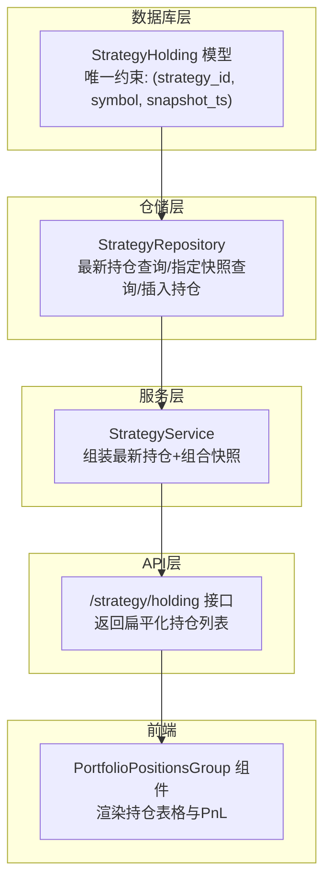
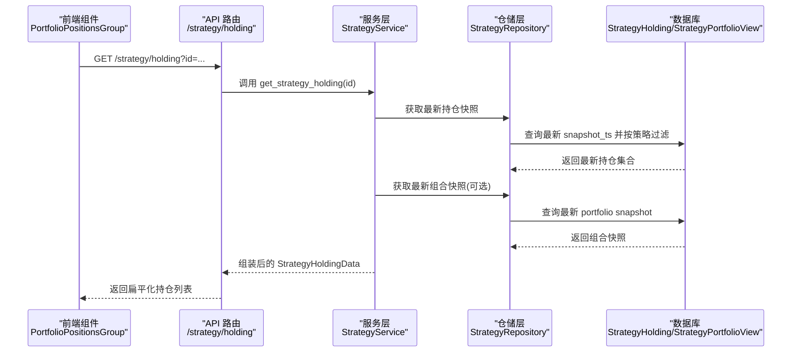
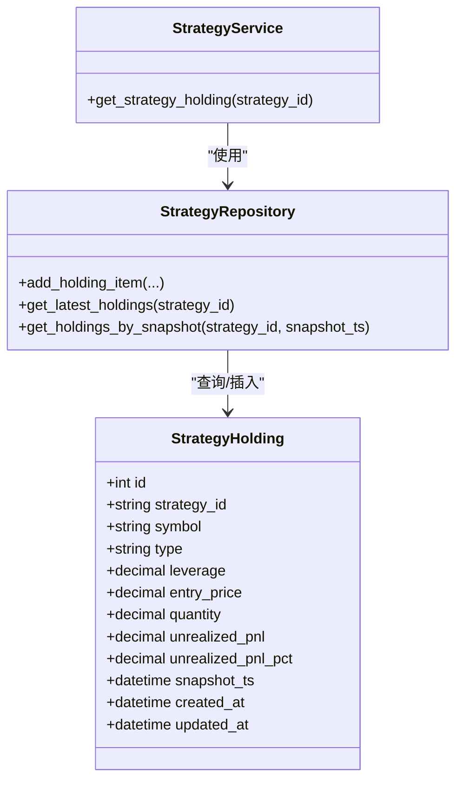
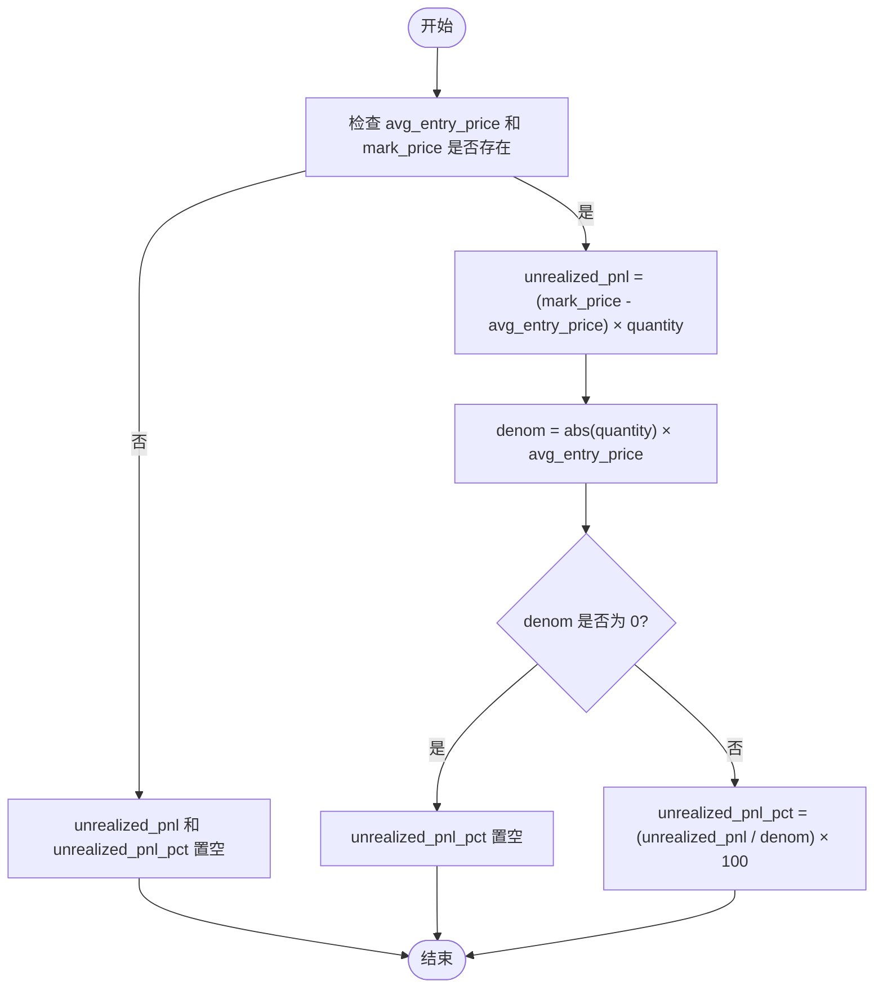
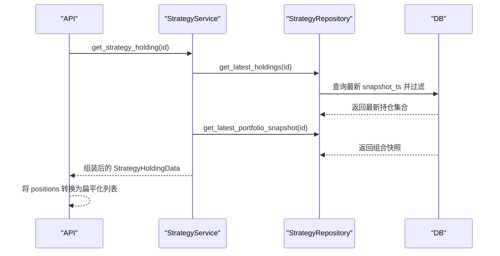
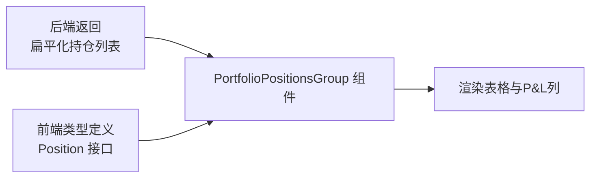
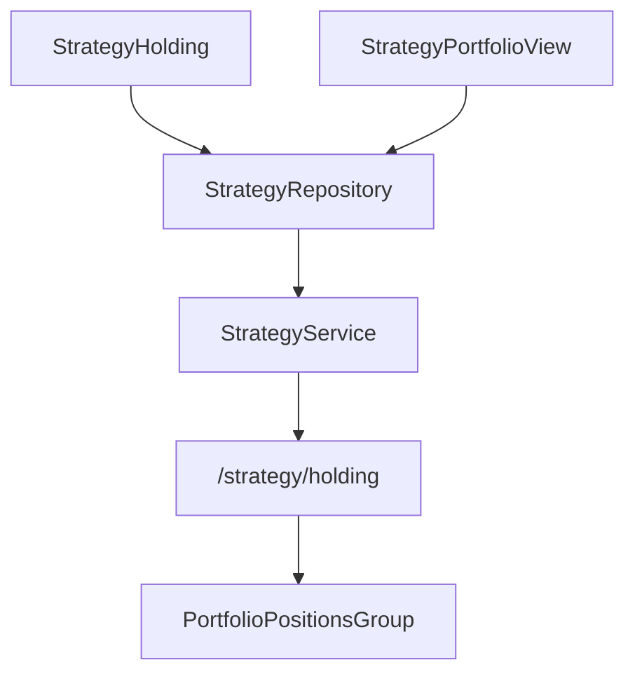

# 策略持仓记录

<cite>
**本文引用的文件列表**
- [python/valuecell/server/db/models/strategy_holding.py](file://python/valuecell/server/db/models/strategy_holding.py)
- [python/valuecell/server/db/repositories/strategy_repository.py](file://python/valuecell/server/db/repositories/strategy_repository.py)
- [python/valuecell/server/services/strategy_service.py](file://python/valuecell/server/services/strategy_service.py)
- [python/valuecell/server/api/routers/strategy.py](file://python/valuecell/server/api/routers/strategy.py)
- [python/valuecell/server/api/schemas/strategy.py](file://python/valuecell/server/api/schemas/strategy.py)
- [python/valuecell/agents/common/trading/portfolio/in_memory.py](file://python/valuecell/agents/common/trading/portfolio/in_memory.py)
- [frontend/src/app/agent/components/strategy-items/portfolio-positions-group.tsx](file://frontend/src/app/agent/components/strategy-items/portfolio-positions-group.tsx)
- [frontend/src/types/strategy.ts](file://frontend/src/types/strategy.ts)
</cite>

## 目录
1. [简介](#简介)
2. [项目结构](#项目结构)
3. [核心组件](#核心组件)
4. [架构总览](#架构总览)
5. [组件详解](#组件详解)
6. [依赖关系分析](#依赖关系分析)
7. [性能考量](#性能考量)
8. [故障排查指南](#故障排查指南)
9. [结论](#结论)
10. [附录](#附录)

## 简介
本文件围绕“策略持仓记录”模型 StrategyHolding 展开，系统性说明其如何在特定快照时间捕获某个策略的单个头寸详情，包括 symbol（交易标的）、type（持仓类型：LONG/SHORT）、leverage（杠杆倍数）、entry_price（入场价格）、quantity（持仓数量）等关键字段；解释 unrealized_pnl 与 unrealized_pnl_pct 的计算方式及其在风险监控中的作用；阐述 snapshot_ts 字段如何支撑历史追踪，并通过 UniqueConstraint 确保同一策略、标的与时间点的数据唯一性；最后给出实际用例，展示如何查询某策略的实时持仓分布，并与前端持仓界面进行关联说明。

## 项目结构
围绕策略持仓记录的关键代码分布在以下层次：
- 数据库层：定义 StrategyHolding 模型与唯一约束
- 仓储层：提供按最新快照查询、按指定快照查询、插入持仓快照等能力
- 服务层：组装最新持仓与组合快照，输出统一的前端数据结构
- API 层：对外暴露查询接口，返回扁平化的持仓列表或汇总信息
- 前端层：消费后端返回的持仓数据，渲染到“持仓”表格与“总值曲线”等界面

图表来源
- [python/valuecell/server/db/models/strategy_holding.py](file://python/valuecell/server/db/models/strategy_holding.py#L1-L112)
- [python/valuecell/server/db/repositories/strategy_repository.py](file://python/valuecell/server/db/repositories/strategy_repository.py#L130-L313)
- [python/valuecell/server/services/strategy_service.py](file://python/valuecell/server/services/strategy_service.py#L27-L105)
- [python/valuecell/server/api/routers/strategy.py](file://python/valuecell/server/api/routers/strategy.py#L250-L296)
- [frontend/src/app/agent/components/strategy-items/portfolio-positions-group.tsx](file://frontend/src/app/agent/components/strategy-items/portfolio-positions-group.tsx#L1-L297)

章节来源
- [python/valuecell/server/db/models/strategy_holding.py](file://python/valuecell/server/db/models/strategy_holding.py#L1-L112)
- [python/valuecell/server/db/repositories/strategy_repository.py](file://python/valuecell/server/db/repositories/strategy_repository.py#L130-L313)
- [python/valuecell/server/services/strategy_service.py](file://python/valuecell/server/services/strategy_service.py#L27-L105)
- [python/valuecell/server/api/routers/strategy.py](file://python/valuecell/server/api/routers/strategy.py#L250-L296)
- [frontend/src/app/agent/components/strategy-items/portfolio-positions-group.tsx](file://frontend/src/app/agent/components/strategy-items/portfolio-positions-group.tsx#L1-L297)

## 核心组件
- StrategyHolding 模型：定义单条持仓快照记录的字段与唯一约束，用于捕获策略在某一时刻对某一标的的头寸详情。
- StrategyRepository：提供按最新快照查询、按指定快照查询、插入持仓快照等方法，是数据访问层的核心。
- StrategyService：将最新持仓与组合快照合并，生成统一的前端数据结构，供 API 返回。
- API 路由：对外暴露 /strategy/holding 接口，返回扁平化的持仓列表。
- 前端组件：PortfolioPositionsGroup 使用后端返回的持仓数据渲染表格，展示符号、类型、杠杆、数量、未实现盈亏与百分比等。

章节来源
- [python/valuecell/server/db/models/strategy_holding.py](file://python/valuecell/server/db/models/strategy_holding.py#L24-L111)
- [python/valuecell/server/db/repositories/strategy_repository.py](file://python/valuecell/server/db/repositories/strategy_repository.py#L204-L313)
- [python/valuecell/server/services/strategy_service.py](file://python/valuecell/server/services/strategy_service.py#L27-L105)
- [python/valuecell/server/api/routers/strategy.py](file://python/valuecell/server/api/routers/strategy.py#L250-L296)
- [frontend/src/app/agent/components/strategy-items/portfolio-positions-group.tsx](file://frontend/src/app/agent/components/strategy-items/portfolio-positions-group.tsx#L1-L297)

## 架构总览
下图展示了从数据库到前端的完整调用链路，以及 StrategyHolding 在其中的角色。

图表来源
- [python/valuecell/server/api/routers/strategy.py](file://python/valuecell/server/api/routers/strategy.py#L250-L296)
- [python/valuecell/server/services/strategy_service.py](file://python/valuecell/server/services/strategy_service.py#L27-L105)
- [python/valuecell/server/db/repositories/strategy_repository.py](file://python/valuecell/server/db/repositories/strategy_repository.py#L204-L284)
- [python/valuecell/server/db/models/strategy_holding.py](file://python/valuecell/server/db/models/strategy_holding.py#L24-L111)

## 组件详解

### StrategyHolding 实体与字段语义
- 表名与主键
  - 表名：strategy_holdings
  - 主键：id（自增整数）
- 关联字段
  - strategy_id：外键关联 strategies.strategy_id，删除时级联删除
  - symbol：交易标的（字符串），索引优化查询
- 持仓简化字段
  - type：LONG 或 SHORT（字符串）
  - leverage：杠杆倍数（数值型，允许为空）
  - entry_price：平均入场价（数值型，允许为空）
  - quantity：绝对数量（数值型，不允许为空）
- 风险指标
  - unrealized_pnl：未实现盈亏（数值型，允许为空）
  - unrealized_pnl_pct：未实现盈亏百分比（数值型，允许为空）
- 快照与时序
  - snapshot_ts：快照时间戳（带时区，默认服务器当前时间）
  - created_at/updated_at：记录创建与更新时间戳
- 唯一性约束
  - (strategy_id, symbol, snapshot_ts) 唯一，确保同一策略、同一标的在同一快照时间仅有一条记录

图表来源
- [python/valuecell/server/db/models/strategy_holding.py](file://python/valuecell/server/db/models/strategy_holding.py#L24-L111)
- [python/valuecell/server/db/repositories/strategy_repository.py](file://python/valuecell/server/db/repositories/strategy_repository.py#L130-L313)
- [python/valuecell/server/services/strategy_service.py](file://python/valuecell/server/services/strategy_service.py#L27-L105)

章节来源
- [python/valuecell/server/db/models/strategy_holding.py](file://python/valuecell/server/db/models/strategy_holding.py#L24-L111)

### 字段语义与业务含义
- symbol（交易标的）
  - 描述：具体交易标的（如币种或合约代码）
  - 用途：作为持仓维度之一，配合 strategy_id 与 snapshot_ts 唯一标识一条头寸
- type（持仓类型）
  - 描述：LONG 或 SHORT
  - 用途：决定 quantity 的正负方向与前端显示颜色
- leverage（杠杆倍数）
  - 描述：该头寸应用的杠杆
  - 用途：用于风险度量与前端展示杠杆倍数
- entry_price（入场价格）
  - 描述：该头寸的平均入场价
  - 用途：用于计算未实现盈亏与前端显示
- quantity（持仓数量）
  - 描述：绝对数量（不区分多空）
  - 用途：与 type 协同决定前端显示的正负号与数量
- unrealized_pnl（未实现盈亏）
  - 描述：基于标记价格与平均入场价计算的未实现损益
  - 用途：前端用于展示每只标的的 P&L 数值
- unrealized_pnl_pct（未实现盈亏百分比）
  - 描述：未实现盈亏占投入成本的比例
  - 用途：前端用于展示每只标的的 P&L 百分比
- snapshot_ts（快照时间）
  - 描述：该条记录对应的快照时间
  - 用途：支持历史追踪与按时间点查询

章节来源
- [python/valuecell/server/db/models/strategy_holding.py](file://python/valuecell/server/db/models/strategy_holding.py#L44-L66)
- [python/valuecell/agents/common/trading/portfolio/in_memory.py](file://python/valuecell/agents/common/trading/portfolio/in_memory.py#L212-L261)

### 计算方式与风险监控
- 未实现盈亏计算
  - 公式：unrealized_pnl = (mark_price - avg_entry_price) × quantity
  - 百分比：unrealized_pnl_pct = (unrealized_pnl / (abs(quantity) × avg_entry_price)) × 100
  - 说明：当 avg_entry_price 或 mark_price 缺失时，相关字段置空
- 风险监控要点
  - 通过 unrealized_pnl_pct 可快速识别高风险头寸（例如超过阈值即触发预警）
  - 结合 leverage 与 notional（由 quantity × mark_price 计算）评估整体敞口
  - 前端根据 unrealized_pnl 的正负与颜色直观呈现风险状态

图表来源
- [python/valuecell/agents/common/trading/portfolio/in_memory.py](file://python/valuecell/agents/common/trading/portfolio/in_memory.py#L212-L261)

章节来源
- [python/valuecell/agents/common/trading/portfolio/in_memory.py](file://python/valuecell/agents/common/trading/portfolio/in_memory.py#L212-L261)

### 历史追踪与唯一性约束
- 历史追踪
  - 通过 snapshot_ts 记录每个时间点的头寸快照，支持按时间序列回溯策略的持仓变化
  - 支持按指定 snapshot_ts 查询某时刻的持仓视图
- 唯一性约束
  - (strategy_id, symbol, snapshot_ts) 唯一，避免重复写入同一时间点的相同标的头寸
  - 通过 UniqueConstraint 确保数据一致性，防止脏数据

章节来源
- [python/valuecell/server/db/models/strategy_holding.py](file://python/valuecell/server/db/models/strategy_holding.py#L78-L84)
- [python/valuecell/server/db/repositories/strategy_repository.py](file://python/valuecell/server/db/repositories/strategy_repository.py#L292-L313)

### 查询与返回流程（后端）
- 最新持仓查询
  - 仓储层先查出最新 snapshot_ts，再按 strategy_id 与该时间过滤
  - 服务层将最新持仓与最新组合快照合并，生成统一数据结构
- API 返回
  - /strategy/holding 接口返回扁平化持仓列表，字段包含 symbol、type、leverage、entry_price、quantity、unrealized_pnl、unrealized_pnl_pct
  - 若无最新持仓，返回空数组并提示成功

图表来源
- [python/valuecell/server/api/routers/strategy.py](file://python/valuecell/server/api/routers/strategy.py#L250-L296)
- [python/valuecell/server/services/strategy_service.py](file://python/valuecell/server/services/strategy_service.py#L27-L105)
- [python/valuecell/server/db/repositories/strategy_repository.py](file://python/valuecell/server/db/repositories/strategy_repository.py#L204-L284)

章节来源
- [python/valuecell/server/api/routers/strategy.py](file://python/valuecell/server/api/routers/strategy.py#L250-L296)
- [python/valuecell/server/services/strategy_service.py](file://python/valuecell/server/services/strategy_service.py#L27-L105)
- [python/valuecell/server/db/repositories/strategy_repository.py](file://python/valuecell/server/db/repositories/strategy_repository.py#L204-L284)

### 前端集成与界面关联
- 前端组件 PortfolioPositionsGroup
  - 渲染“持仓”表格，列包括 Symbol、Type、Leverage、Quantity、P&L
  - 使用 position.unrealized_pnl 与 position.unrealized_pnl_pct 进行颜色与格式化展示
- 类型定义
  - 前端 types 中的 Position 接口包含 symbol、type、leverage、entry_price、quantity、unrealized_pnl、unrealized_pnl_pct 等字段，与后端扁平化返回保持一致

图表来源
- [frontend/src/app/agent/components/strategy-items/portfolio-positions-group.tsx](file://frontend/src/app/agent/components/strategy-items/portfolio-positions-group.tsx#L1-L297)
- [frontend/src/types/strategy.ts](file://frontend/src/types/strategy.ts#L35-L43)
- [python/valuecell/server/api/routers/strategy.py](file://python/valuecell/server/api/routers/strategy.py#L250-L296)

章节来源
- [frontend/src/app/agent/components/strategy-items/portfolio-positions-group.tsx](file://frontend/src/app/agent/components/strategy-items/portfolio-positions-group.tsx#L1-L297)
- [frontend/src/types/strategy.ts](file://frontend/src/types/strategy.ts#L35-L43)

## 依赖关系分析
- 模型依赖
  - StrategyHolding 依赖 SQLAlchemy 基类与 UniqueConstraint
- 仓储依赖
  - StrategyRepository 依赖 StrategyHolding、StrategyPortfolioView 与数据库会话
- 服务依赖
  - StrategyService 依赖 StrategyRepository，并将最新持仓与组合快照合并
- API 依赖
  - /strategy/holding 接口依赖 StrategyService，并将结果转换为扁平化列表
- 前端依赖
  - PortfolioPositionsGroup 依赖后端返回的持仓数据与类型定义

图表来源
- [python/valuecell/server/db/models/strategy_holding.py](file://python/valuecell/server/db/models/strategy_holding.py#L24-L111)
- [python/valuecell/server/db/repositories/strategy_repository.py](file://python/valuecell/server/db/repositories/strategy_repository.py#L1-L60)
- [python/valuecell/server/services/strategy_service.py](file://python/valuecell/server/services/strategy_service.py#L1-L40)
- [python/valuecell/server/api/routers/strategy.py](file://python/valuecell/server/api/routers/strategy.py#L250-L296)
- [frontend/src/app/agent/components/strategy-items/portfolio-positions-group.tsx](file://frontend/src/app/agent/components/strategy-items/portfolio-positions-group.tsx#L1-L297)

章节来源
- [python/valuecell/server/db/models/strategy_holding.py](file://python/valuecell/server/db/models/strategy_holding.py#L24-L111)
- [python/valuecell/server/db/repositories/strategy_repository.py](file://python/valuecell/server/db/repositories/strategy_repository.py#L1-L60)
- [python/valuecell/server/services/strategy_service.py](file://python/valuecell/server/services/strategy_service.py#L1-L40)
- [python/valuecell/server/api/routers/strategy.py](file://python/valuecell/server/api/routers/strategy.py#L250-L296)
- [frontend/src/app/agent/components/strategy-items/portfolio-positions-group.tsx](file://frontend/src/app/agent/components/strategy-items/portfolio-positions-group.tsx#L1-L297)

## 性能考量
- 查询路径
  - 最新持仓查询：先查最大 snapshot_ts 再过滤，避免全表扫描
  - 指定快照查询：直接按 (strategy_id, snapshot_ts) 过滤，索引命中良好
- 数据类型
  - 数值型字段采用高精度 decimal，避免浮点误差累积
- 唯一约束
  - 通过唯一约束避免重复写入，减少后续去重与聚合成本
- 前端渲染
  - 前端仅消费必要字段，避免额外计算与渲染压力

[本节为通用建议，无需列出具体文件来源]

## 故障排查指南
- 无法获取最新持仓
  - 检查是否存在最新 snapshot_ts；若不存在，返回空集属正常行为
  - 确认 strategy_id 是否正确
- 未实现盈亏为空
  - 可能由于 avg_entry_price 或 mark_price 缺失导致
  - 检查上游数据源是否正确填充 entry_price 与 mark_price
- 前端未显示 P&L
  - 确认后端返回的 unrealized_pnl/unrealized_pnl_pct 字段是否非空
  - 检查前端类型定义与后端扁平化映射是否一致

章节来源
- [python/valuecell/server/db/repositories/strategy_repository.py](file://python/valuecell/server/db/repositories/strategy_repository.py#L204-L284)
- [python/valuecell/agents/common/trading/portfolio/in_memory.py](file://python/valuecell/agents/common/trading/portfolio/in_memory.py#L212-L261)
- [frontend/src/app/agent/components/strategy-items/portfolio-positions-group.tsx](file://frontend/src/app/agent/components/strategy-items/portfolio-positions-group.tsx#L52-L95)

## 结论
StrategyHolding 模型通过简洁的字段设计与唯一约束，有效捕获策略在特定快照时间的单个头寸详情。结合后端服务与 API 的装配逻辑，能够稳定地输出可用于前端展示的扁平化持仓列表。unrealized_pnl 与 unrealized_pnl_pct 的计算方式清晰明确，便于前端直观呈现风险状况。snapshot_ts 的引入使得历史追踪成为可能，配合 UniqueConstraint 保障了数据一致性与可审计性。

[本节为总结性内容，无需列出具体文件来源]

## 附录

### 实际用例：查询某策略的实时持仓分布
- 步骤
  - 调用 /strategy/holding 接口，传入 strategy_id
  - 后端返回扁平化持仓列表，包含 symbol、type、leverage、entry_price、quantity、unrealized_pnl、unrealized_pnl_pct
  - 前端 PortfolioPositionsGroup 组件接收并渲染表格
- 注意事项
  - 若无最新持仓，接口返回空数组但状态为成功
  - 前端应兼容字段为空的情况，避免渲染异常

章节来源
- [python/valuecell/server/api/routers/strategy.py](file://python/valuecell/server/api/routers/strategy.py#L250-L296)
- [frontend/src/app/agent/components/strategy-items/portfolio-positions-group.tsx](file://frontend/src/app/agent/components/strategy-items/portfolio-positions-group.tsx#L1-L297)