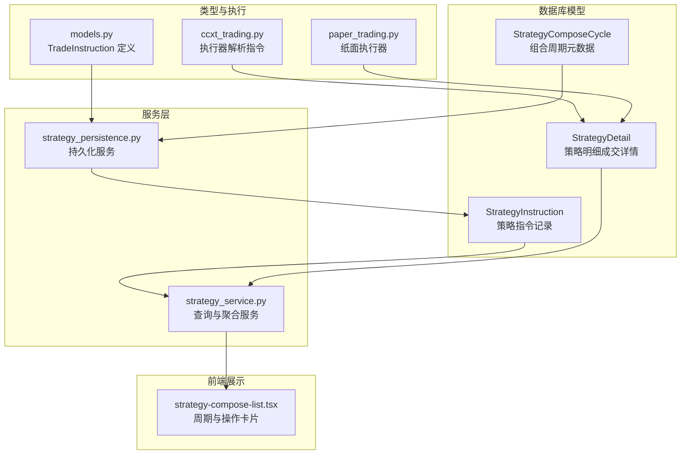
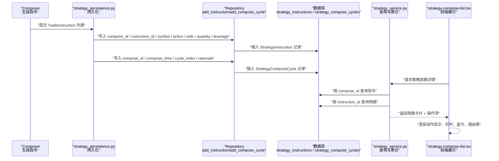
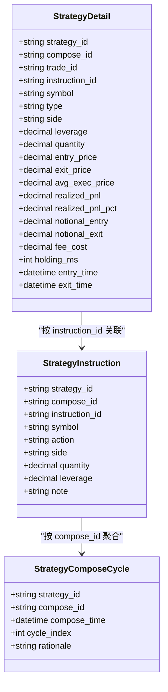

# 策略指令记录

<cite>
**本文引用的文件**
- [python/valuecell/server/db/models/strategy_instruction.py](file://python/valuecell/server/db/models/strategy_instruction.py)
- [python/valuecell/server/db/models/strategy_detail.py](file://python/valuecell/server/db/models/strategy_detail.py)
- [python/valuecell/server/db/models/strategy_compose_cycle.py](file://python/valuecell/server/db/models/strategy_compose_cycle.py)
- [python/valuecell/server/services/strategy_persistence.py](file://python/valuecell/server/services/strategy_persistence.py)
- [python/valuecell/server/services/strategy_service.py](file://python/valuecell/server/services/strategy_service.py)
- [python/valuecell/agents/common/trading/models.py](file://python/valuecell/agents/common/trading/models.py)
- [python/valuecell/agents/common/trading/execution/ccxt_trading.py](file://python/valuecell/agents/common/trading/execution/ccxt_trading.py)
- [python/valuecell/agents/common/trading/execution/paper_trading.py](file://python/valuecell/agents/common/trading/execution/paper_trading.py)
- [frontend/src/app/agent/components/strategy-items/strategy-compose-list.tsx](file://frontend/src/app/agent/components/strategy-items/strategy-compose-list.tsx)
- [python/valuecell/server/api/schemas/strategy.py](file://python/valuecell/server/api/schemas/strategy.py)
</cite>

## 目录
1. [简介](#简介)
2. [项目结构](#项目结构)
3. [核心组件](#核心组件)
4. [架构总览](#架构总览)
5. [组件详解](#组件详解)
6. [依赖关系分析](#依赖关系分析)
7. [性能考量](#性能考量)
8. [故障排查指南](#故障排查指南)
9. [结论](#结论)
10. [附录](#附录)

## 简介
本文件系统性地记录并解释策略指令记录模型 StrategyInstruction 的设计与用法，重点说明其如何在“组合周期”中存储 LLM 生成的交易指令，并与策略明细 StrategyDetail 协同实现从“决策意图”到“成交事实”的完整审计链路。文档将详细阐述以下关键字段的语义与用途：
- 执行相关字段：action（LLM 动作：open/close/noop）、side（执行方向：BUY/SELL）、quantity（指令数量）、leverage（杠杆）
- 追溯与审计字段：compose_id（组合周期标识）、instruction_id（指令唯一标识）

同时，文档给出策略决策频率与交易模式的分析方法，以及如何利用该模型支撑策略优化与性能评估。

## 项目结构
围绕策略指令记录的核心文件分布如下：
- 数据库模型层：StrategyInstruction、StrategyDetail、StrategyComposeCycle
- 服务层：策略持久化与查询服务，负责将指令与明细进行关联与聚合
- 前端展示：组合周期列表与操作卡片，用于可视化展示指令与明细的对应关系
- 类型与执行：TradeInstruction 类型定义及执行器对指令的解析与应用

图表来源
- [python/valuecell/server/db/models/strategy_instruction.py](file://python/valuecell/server/db/models/strategy_instruction.py#L1-L75)
- [python/valuecell/server/db/models/strategy_detail.py](file://python/valuecell/server/db/models/strategy_detail.py#L1-L166)
- [python/valuecell/server/db/models/strategy_compose_cycle.py](file://python/valuecell/server/db/models/strategy_compose_cycle.py#L1-L76)
- [python/valuecell/server/services/strategy_persistence.py](file://python/valuecell/server/services/strategy_persistence.py#L337-L371)
- [python/valuecell/server/services/strategy_service.py](file://python/valuecell/server/services/strategy_service.py#L311-L414)
- [python/valuecell/agents/common/trading/models.py](file://python/valuecell/agents/common/trading/models.py#L644-L750)
- [python/valuecell/agents/common/trading/execution/ccxt_trading.py](file://python/valuecell/agents/common/trading/execution/ccxt_trading.py#L892-L912)
- [python/valuecell/agents/common/trading/execution/paper_trading.py](file://python/valuecell/agents/common/trading/execution/paper_trading.py#L23-L51)
- [frontend/src/app/agent/components/strategy-items/strategy-compose-list.tsx](file://frontend/src/app/agent/components/strategy-items/strategy-compose-list.tsx#L1-L256)

章节来源
- [python/valuecell/server/db/models/strategy_instruction.py](file://python/valuecell/server/db/models/strategy_instruction.py#L1-L75)
- [python/valuecell/server/db/models/strategy_detail.py](file://python/valuecell/server/db/models/strategy_detail.py#L1-L166)
- [python/valuecell/server/db/models/strategy_compose_cycle.py](file://python/valuecell/server/db/models/strategy_compose_cycle.py#L1-L76)
- [python/valuecell/server/services/strategy_persistence.py](file://python/valuecell/server/services/strategy_persistence.py#L337-L371)
- [python/valuecell/server/services/strategy_service.py](file://python/valuecell/server/services/strategy_service.py#L311-L414)
- [python/valuecell/agents/common/trading/models.py](file://python/valuecell/agents/common/trading/models.py#L644-L750)
- [python/valuecell/agents/common/trading/execution/ccxt_trading.py](file://python/valuecell/agents/common/trading/execution/ccxt_trading.py#L892-L912)
- [python/valuecell/agents/common/trading/execution/paper_trading.py](file://python/valuecell/agents/common/trading/execution/paper_trading.py#L23-L51)
- [frontend/src/app/agent/components/strategy-items/strategy-compose-list.tsx](file://frontend/src/app/agent/components/strategy-items/strategy-compose-list.tsx#L1-L256)

## 核心组件
- StrategyInstruction：记录一次组合周期内由 LLM 生成的交易指令，包含最小必要字段以支持聚合与审计。
- StrategyDetail：记录实际成交详情，与指令建立一一对应或一对多映射，便于回放与归因分析。
- StrategyComposeCycle：记录组合周期元数据（时间戳、序号、可选理由），为指令与明细提供上下文。

章节来源
- [python/valuecell/server/db/models/strategy_instruction.py](file://python/valuecell/server/db/models/strategy_instruction.py#L1-L75)
- [python/valuecell/server/db/models/strategy_detail.py](file://python/valuecell/server/db/models/strategy_detail.py#L1-L166)
- [python/valuecell/server/db/models/strategy_compose_cycle.py](file://python/valuecell/server/db/models/strategy_compose_cycle.py#L1-L76)

## 架构总览
下图展示了从“组合周期”到“指令记录”，再到“成交明细”的完整流程，以及前端如何基于两者进行可视化展示。

图表来源
- [python/valuecell/server/services/strategy_persistence.py](file://python/valuecell/server/services/strategy_persistence.py#L337-L371)
- [python/valuecell/server/db/repositories/strategy_repository.py](file://python/valuecell/server/db/repositories/strategy_repository.py#L381-L446)
- [python/valuecell/server/services/strategy_service.py](file://python/valuecell/server/services/strategy_service.py#L311-L414)
- [frontend/src/app/agent/components/strategy-items/strategy-compose-list.tsx](file://frontend/src/app/agent/components/strategy-items/strategy-compose-list.tsx#L1-L256)

## 组件详解

### StrategyInstruction 字段语义与用途
- strategy_id：运行时策略标识，用于区分不同策略实例
- compose_id：组合周期标识，用于将指令归属到具体决策周期
- instruction_id：指令唯一标识，确保幂等性与审计追溯
- symbol：合约/币种符号，作为指令的标的
- action：LLM 动作，枚举值包括 open_long、open_short、close_long、close_short、noop
- side：执行方向，枚举值为 BUY 或 SELL；由 action 推导而来
- quantity：下单数量（单位为标的计价单位）
- leverage：杠杆倍数，仅在开仓时生效
- note：可选备注，通常来自指令元数据中的“rationale”
- created_at / updated_at：时间戳，便于排序与审计

章节来源
- [python/valuecell/server/db/models/strategy_instruction.py](file://python/valuecell/server/db/models/strategy_instruction.py#L1-L75)
- [python/valuecell/agents/common/trading/models.py](file://python/valuecell/agents/common/trading/models.py#L644-L750)

### 执行相关字段详解
- action（LLM 动作）
  - open_long：做多开仓（若当前为空仓或空头，则直接开多）
  - open_short：做空开仓（若当前为空仓或多头，则直接开空）
  - close_long：平多（减少或清空多头头寸）
  - close_short：平空（减少或清空空头头寸）
  - noop：无操作，不生成订单
- side（执行方向）
  - 由 action 推导：open_long/close_short 对应 BUY，open_short/close_long 对应 SELL
  - noop 或非订单类动作不派生 side
- quantity（指令数量）
  - 以标的单位计数，用于计算下单数量与保证金占用
- leverage（杠杆）
  - 仅在开仓动作时生效，用于放大头寸规模与保证金计算

章节来源
- [python/valuecell/agents/common/trading/models.py](file://python/valuecell/agents/common/trading/models.py#L546-L582)
- [python/valuecell/agents/common/trading/models.py](file://python/valuecell/agents/common/trading/models.py#L644-L750)
- [python/valuecell/agents/common/trading/execution/ccxt_trading.py](file://python/valuecell/agents/common/trading/execution/ccxt_trading.py#L892-L912)
- [python/valuecell/agents/common/trading/execution/paper_trading.py](file://python/valuecell/agents/common/trading/execution/paper_trading.py#L23-L51)

### 追溯与审计字段：compose_id 与 instruction_id
- compose_id
  - 标识一次“组合周期”，即一次由协调器生成的决策与指令集合
  - 通过 StrategyComposeCycle 记录周期时间、序号与可选理由
- instruction_id
  - 在同一组合周期内，对每个标的的指令唯一标识
  - 通常采用 compose_id + symbol + 序号的格式，保证幂等性
- 关联关系
  - StrategyInstruction 与 StrategyComposeCycle 通过 strategy_id + compose_id 联合唯一
  - StrategyDetail 通过 instruction_id 与 StrategyInstruction 建立一对一或多对一映射，用于记录成交详情

章节来源
- [python/valuecell/server/db/models/strategy_instruction.py](file://python/valuecell/server/db/models/strategy_instruction.py#L1-L75)
- [python/valuecell/server/db/models/strategy_compose_cycle.py](file://python/valuecell/server/db/models/strategy_compose_cycle.py#L1-L76)
- [python/valuecell/server/db/models/strategy_detail.py](file://python/valuecell/server/db/models/strategy_detail.py#L1-L166)

### 与 StrategyDetail 的关联与职责边界
- StrategyInstruction：记录“决策意图”与“可执行指令”，包含 action、side、quantity、leverage 等
- StrategyDetail：记录“成交事实”，包含 entry/exit 时间、价格、未平仓/已实现盈亏、手续费、持有时长等
- 关联方式
  - 通过 instruction_id 建立关联，一个指令可能对应多次成交（分笔成交）
  - 通过 compose_id 将明细纳入同一周期上下文

章节来源
- [python/valuecell/server/db/models/strategy_detail.py](file://python/valuecell/server/db/models/strategy_detail.py#L1-L166)
- [python/valuecell/server/services/strategy_service.py](file://python/valuecell/server/services/strategy_service.py#L311-L414)

### 前端展示与交互
- 周期卡片：展示周期索引、创建时间、AI 理由
- 操作卡片：展示 symbol、动作显示、杠杆、数量、入场/出场价格、持有时长、手续费、已实现盈亏与理由
- 交互：支持展开查看理由与成交细节

章节来源
- [frontend/src/app/agent/components/strategy-items/strategy-compose-list.tsx](file://frontend/src/app/agent/components/strategy-items/strategy-compose-list.tsx#L1-L256)
- [python/valuecell/server/api/schemas/strategy.py](file://python/valuecell/server/api/schemas/strategy.py#L132-L158)

### 实际场景示例：分析策略决策频率与交易模式
- 决策频率分析
  - 以 compose_id 为粒度统计指令条数，即可得到策略在各周期内的“决策活跃度”
  - 结合 cycle_index 可观察策略是否持续产生新指令
- 交易模式分析
  - 通过 action 分布（open_long/open_short/close_long/close_short/noop）判断策略偏向
  - 通过 side 分布判断多空倾向（BUY/SELL 比例）
  - 通过 quantity 与 leverage 的组合，评估策略的加仓强度与风险暴露
- 成交归因与回测
  - 使用 instruction_id 关联 StrategyDetail，计算每笔指令的平均成交价格、滑点、手续费与已实现盈亏
  - 通过 holding_ms 与 realized_pnl/pnl_pct 评估持有成本与收益质量
- 性能评估
  - 基于周期维度汇总胜率、平均持有时长、最大回撤等指标，指导策略优化

章节来源
- [python/valuecell/server/services/strategy_service.py](file://python/valuecell/server/services/strategy_service.py#L311-L414)
- [python/valuecell/server/api/schemas/strategy.py](file://python/valuecell/server/api/schemas/strategy.py#L132-L158)

## 依赖关系分析
- 指令到持久化的依赖
  - TradeInstruction（类型定义）→ strategy_persistence.persist_instructions（持久化入口）
  - strategy_persistence.add_instruction（Repository 层）→ 数据库表 strategy_instructions
- 周期到指令的依赖
  - StrategyComposeCycle（周期元数据）→ StrategyInstruction（按 compose_id 聚合）
- 指令到明细的依赖
  - StrategyInstruction.instruction_id → StrategyDetail.instruction_id
- 执行器对指令的依赖
  - ccxt_trading/paper_trading 从 TradeInstruction 中读取 action、side、quantity、leverage 等字段，驱动下单与成交

图表来源
- [python/valuecell/server/db/models/strategy_compose_cycle.py](file://python/valuecell/server/db/models/strategy_compose_cycle.py#L1-L76)
- [python/valuecell/server/db/models/strategy_instruction.py](file://python/valuecell/server/db/models/strategy_instruction.py#L1-L75)
- [python/valuecell/server/db/models/strategy_detail.py](file://python/valuecell/server/db/models/strategy_detail.py#L1-L166)

## 性能考量
- 存储与索引
  - 为 strategy_id、compose_id、instruction_id 建立索引，提升查询效率
  - instruction_id 的唯一约束保障幂等写入，避免重复指令
- 写入路径
  - persist_instructions 逐条写入，异常时记录日志并继续处理其他指令，提高整体吞吐
- 聚合查询
  - 先按 compose_id 获取指令，再按 instruction_id 批量获取明细，减少往返次数
- 前端渲染
  - 仅加载必要字段，避免一次性拉取大量明细导致卡顿

[本节为通用建议，无需列出具体文件来源]

## 故障排查指南
- 指令未入库
  - 检查 persist_instructions 是否抛出异常并记录警告日志
  - 确认 instruction_id 是否重复（唯一约束）
- 明细缺失
  - 确认 StrategyDetail.instruction_id 是否与 StrategyInstruction.instruction_id 匹配
  - 检查执行器是否正确将 TxResult 转换为明细记录
- 周期数据异常
  - 检查 StrategyComposeCycle 的 compose_id 是否与指令一致
  - 核对 cycle_index 与 compose_time 的生成逻辑

章节来源
- [python/valuecell/server/services/strategy_persistence.py](file://python/valuecell/server/services/strategy_persistence.py#L337-L371)
- [python/valuecell/server/db/repositories/strategy_repository.py](file://python/valuecell/server/db/repositories/strategy_repository.py#L381-L446)
- [python/valuecell/agents/common/trading/execution/ccxt_trading.py](file://python/valuecell/agents/common/trading/execution/ccxt_trading.py#L892-L912)

## 结论
StrategyInstruction 作为策略在组合周期内“决策意图”的最小可执行单元，通过 action、side、quantity、leverage 等字段清晰表达 LLM 的交易意图；配合 compose_id 与 instruction_id，实现了从“决策”到“成交”的完整审计闭环。与 StrategyDetail 的关联使得策略优化与性能评估具备了坚实的数据基础。前端通过周期与操作卡片直观呈现策略行为，有助于快速定位问题与验证改进效果。

[本节为总结性内容，无需列出具体文件来源]

## 附录

### 字段对照与复杂度分析
- 字段选择
  - 最小必要字段：strategy_id、compose_id、instruction_id、symbol、action、side、quantity、leverage、note
  - 时间戳：created_at、updated_at，便于排序与审计
- 复杂度
  - 写入：O(1) 插入单条记录
  - 查询：按 compose_id 聚合指令 O(n)，按 instruction_id 批量获取明细 O(m)
  - 关联：instruction_id 唯一约束，明细按 instruction_id 聚合，典型为 1:N

章节来源
- [python/valuecell/server/db/models/strategy_instruction.py](file://python/valuecell/server/db/models/strategy_instruction.py#L1-L75)
- [python/valuecell/server/db/models/strategy_detail.py](file://python/valuecell/server/db/models/strategy_detail.py#L1-L166)