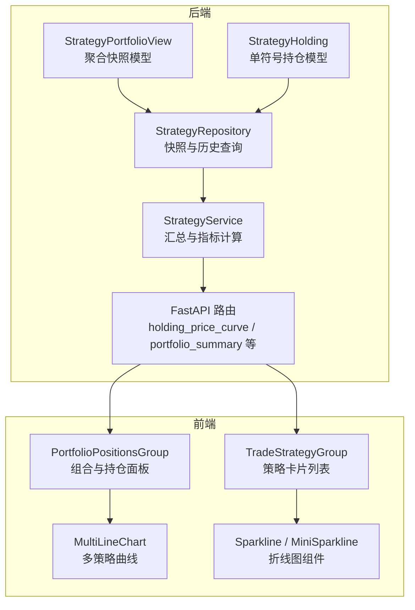
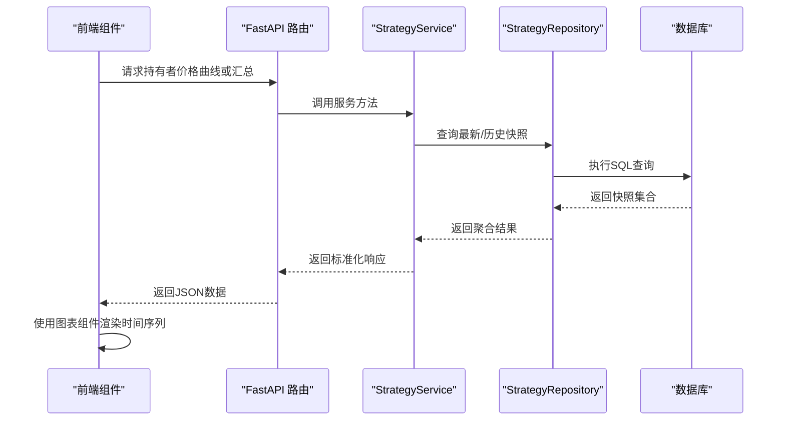
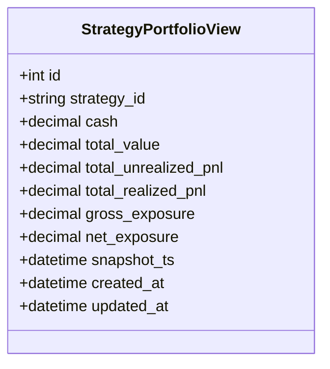
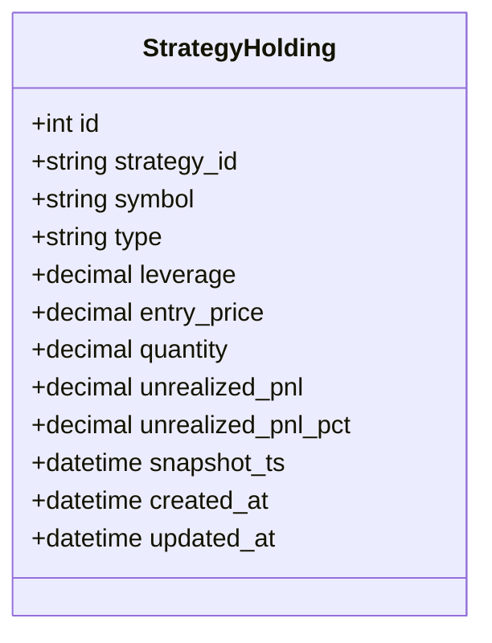
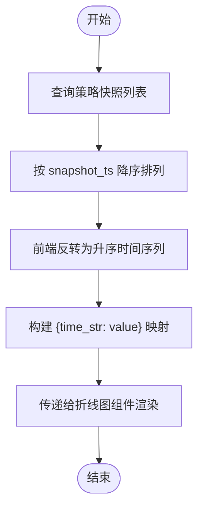
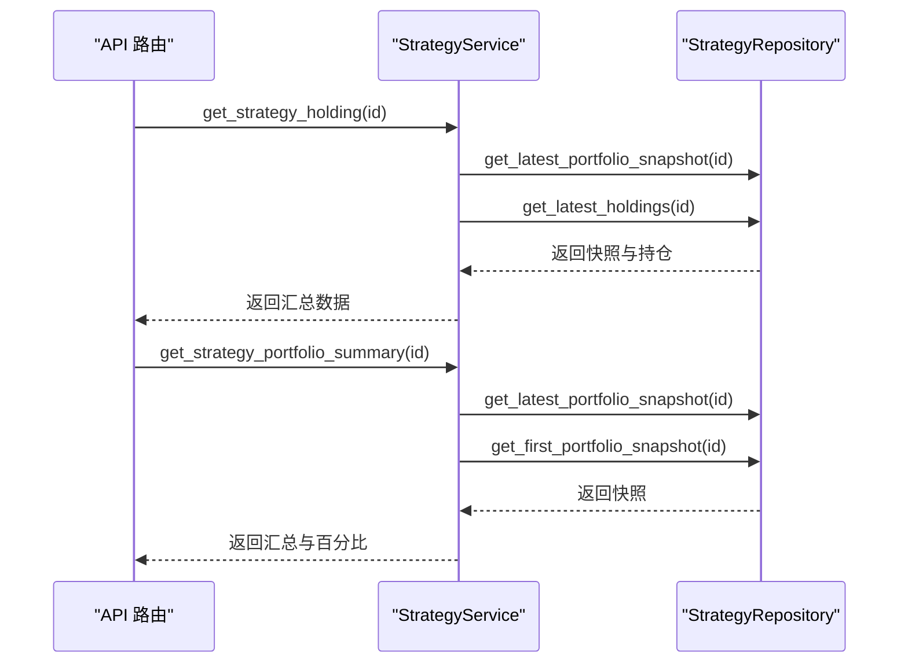
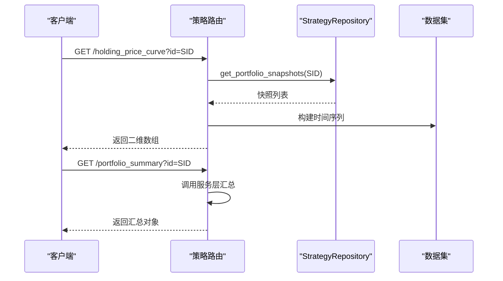
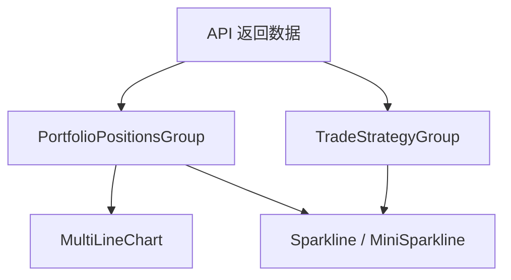
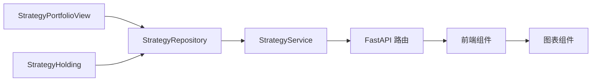

# 策略组合视图

<cite>
**本文引用的文件**
- [strategy_portfolio.py](file://python/valuecell/server/db/models/strategy_portfolio.py)
- [strategy_holding.py](file://python/valuecell/server/db/models/strategy_holding.py)
- [strategy_repository.py](file://python/valuecell/server/db/repositories/strategy_repository.py)
- [strategy_service.py](file://python/valuecell/server/services/strategy_service.py)
- [strategy.py](file://python/valuecell/server/api/routers/strategy.py)
- [strategy.py（前端）](file://frontend/src/app/agent/components/strategy-items/portfolio-positions-group.tsx)
- [trade-strategy-group.tsx](file://frontend/src/app/agent/components/strategy-items/trade-strategy-group.tsx)
- [sparkline.tsx](file://frontend/src/components/valuecell/charts/sparkline.tsx)
- [mini-sparkline.tsx](file://frontend/src/components/valuecell/charts/mini-sparkline.tsx)
- [chart.ts 类型定义](file://frontend/src/types/chart.ts)
</cite>

## 目录
1. [简介](#简介)
2. [项目结构](#项目结构)
3. [核心组件](#核心组件)
4. [架构总览](#架构总览)
5. [详细组件分析](#详细组件分析)
6. [依赖关系分析](#依赖关系分析)
7. [性能考量](#性能考量)
8. [故障排查指南](#故障排查指南)
9. [结论](#结论)
10. [附录：查询示例与前端应用](#附录查询示例与前端应用)

## 简介
本文件系统性阐述“策略组合视图”模型 StrategyPortfolioView 的设计与使用，重点说明其如何为每个策略提供聚合的投资组合快照，包括现金余额、总价值、未实现盈亏等核心指标的业务含义与计算来源；并解释快照时间戳 snapshot_ts 如何支撑策略绩效的时间序列分析。同时阐明 StrategyPortfolioView 与 StrategyHolding 的区别与互补关系：前者提供整体概览，后者记录单个持仓细节。最后给出实际查询示例与前端性能分析场景的应用说明。

## 项目结构
围绕策略组合视图的关键代码分布在后端数据库模型层、仓储层、服务层与 API 层，以及前端图表与页面组件中：
- 数据库模型层：StrategyPortfolioView（聚合快照）、StrategyHolding（单符号持仓）
- 仓储层：StrategyRepository（快照与历史查询）
- 服务层：StrategyService（汇总与指标计算）
- API 层：FastAPI 路由（价格曲线、汇总、详情等接口）
- 前端：多行折线图、迷你折线图、策略卡片与组合页

**图表来源**
- [strategy_portfolio.py](file://python/valuecell/server/db/models/strategy_portfolio.py#L1-L122)
- [strategy_holding.py](file://python/valuecell/server/db/models/strategy_holding.py#L1-L112)
- [strategy_repository.py](file://python/valuecell/server/db/repositories/strategy_repository.py#L168-L203)
- [strategy_service.py](file://python/valuecell/server/services/strategy_service.py#L27-L105)
- [strategy.py](file://python/valuecell/server/api/routers/strategy.py#L359-L486)
- [portfolio-positions-group.tsx](file://frontend/src/app/agent/components/strategy-items/portfolio-positions-group.tsx#L1-L297)
- [trade-strategy-group.tsx](file://frontend/src/app/agent/components/strategy-items/trade-strategy-group.tsx#L1-L320)
- [sparkline.tsx](file://frontend/src/components/valuecell/charts/sparkline.tsx#L1-L173)
- [mini-sparkline.tsx](file://frontend/src/components/valuecell/charts/mini-sparkline.tsx#L1-L116)

**章节来源**
- [strategy_portfolio.py](file://python/valuecell/server/db/models/strategy_portfolio.py#L1-L122)
- [strategy_holding.py](file://python/valuecell/server/db/models/strategy_holding.py#L1-L112)
- [strategy_repository.py](file://python/valuecell/server/db/repositories/strategy_repository.py#L168-L203)
- [strategy_service.py](file://python/valuecell/server/services/strategy_service.py#L27-L105)
- [strategy.py](file://python/valuecell/server/api/routers/strategy.py#L359-L486)
- [portfolio-positions-group.tsx](file://frontend/src/app/agent/components/strategy-items/portfolio-positions-group.tsx#L1-L297)
- [trade-strategy-group.tsx](file://frontend/src/app/agent/components/strategy-items/trade-strategy-group.tsx#L1-L320)
- [sparkline.tsx](file://frontend/src/components/valuecell/charts/sparkline.tsx#L1-L173)
- [mini-sparkline.tsx](file://frontend/src/components/valuecell/charts/mini-sparkline.tsx#L1-L116)

## 核心组件
- StrategyPortfolioView（聚合快照）
  - 字段：cash、total_value、total_unrealized_pnl、total_realized_pnl、gross_exposure、net_exposure、snapshot_ts
  - 唯一键：(strategy_id, snapshot_ts)
  - 用途：按时间点记录策略整体资产状况，便于时间序列分析与可视化
- StrategyHolding（单符号持仓）
  - 字段：symbol、type、leverage、entry_price、quantity、unrealized_pnl、unrealized_pnl_pct、snapshot_ts
  - 唯一键：(strategy_id, symbol, snapshot_ts)
  - 用途：记录每个标的在快照时刻的头寸细节

两者共同构成“概览（聚合）+ 细节（逐标）”的双层视图，前者用于整体趋势与收益分析，后者用于定位具体持仓表现。

**章节来源**
- [strategy_portfolio.py](file://python/valuecell/server/db/models/strategy_portfolio.py#L25-L81)
- [strategy_holding.py](file://python/valuecell/server/db/models/strategy_holding.py#L24-L84)

## 架构总览
后端通过仓储层统一访问数据库，服务层负责将聚合快照与最新持仓整合为对外 API 所需的数据结构；API 路由提供价格曲线与汇总接口；前端以图表组件渲染时间序列与策略卡片。

**图表来源**
- [strategy.py](file://python/valuecell/server/api/routers/strategy.py#L359-L486)
- [strategy_service.py](file://python/valuecell/server/services/strategy_service.py#L27-L105)
- [strategy_repository.py](file://python/valuecell/server/db/repositories/strategy_repository.py#L233-L290)

## 详细组件分析

### StrategyPortfolioView 模型与字段语义
- cash（现金余额）
  - 含义：快照时刻可用的现金头寸
  - 来源：仓储层插入时写入
- total_value（总价值）
  - 含义：快照时刻的总资产价值（通常为 cash + 持仓未实现价值）
  - 来源：仓储层插入时写入
- total_unrealized_pnl（未实现盈亏）
  - 含义：当前持仓未平仓产生的累计未实现收益/损失
  - 来源：仓储层插入时写入
- total_realized_pnl（已实现盈亏）
  - 含义：历史平仓产生的累计已实现收益/损失
  - 来源：仓储层插入时写入
- gross_exposure（总敞口）
  - 含义：多头与空头名义价值之和（衡量总体风险暴露）
- net_exposure（净敞口）
  - 含义：多头与空头名义价值差（衡量净风险暴露）
- snapshot_ts（快照时间戳）
  - 含义：UTC 时间戳，标识该条快照的采集时刻
  - 设计要点：唯一约束确保同一策略在同一时刻仅有一条聚合快照；API 层按该时间排序构建时间序列

**图表来源**
- [strategy_portfolio.py](file://python/valuecell/server/db/models/strategy_portfolio.py#L25-L122)

**章节来源**
- [strategy_portfolio.py](file://python/valuecell/server/db/models/strategy_portfolio.py#L25-L81)

### StrategyHolding 模型与字段语义
- symbol（标的代码）
- type（头寸类型：LONG/SHORT）
- leverage（杠杆倍数）
- entry_price（平均开仓价）
- quantity（头寸数量，绝对值）
- unrealized_pnl / unrealized_pnl_pct（未实现收益/百分比）
- snapshot_ts（快照时间戳）

**图表来源**
- [strategy_holding.py](file://python/valuecell/server/db/models/strategy_holding.py#L24-L112)

**章节来源**
- [strategy_holding.py](file://python/valuecell/server/db/models/strategy_holding.py#L24-L84)

### 快照时间戳 snapshot_ts 的设计与应用
- 唯一性：(strategy_id, snapshot_ts) 唯一约束，保证同一策略在任一时刻仅一条聚合快照
- 排序：API 层按 snapshot_ts 降序返回，再在前端反转以呈现从早到晚的时间序列
- 可视化：API 将 snapshot_ts 转换为字符串时间键，构建二维数组供折线图渲染
- 性能：按时间序列查询时，可限制返回条目数量，避免前端渲染压力

**图表来源**
- [strategy_repository.py](file://python/valuecell/server/db/repositories/strategy_repository.py#L233-L257)
- [strategy.py](file://python/valuecell/server/api/routers/strategy.py#L388-L414)

**章节来源**
- [strategy_repository.py](file://python/valuecell/server/db/repositories/strategy_repository.py#L233-L257)
- [strategy.py](file://python/valuecell/server/api/routers/strategy.py#L388-L414)

### 服务层汇总与指标计算
- get_strategy_holding
  - 合并：取最新聚合快照与最新持仓快照，构造包含 cash、positions、total_value、unrealized/realized PnL、exposure 的数据对象
  - 时间戳：优先使用聚合快照时间，否则回退到持仓快照时间
- get_strategy_portfolio_summary
  - 计算：基于最新快照 total_value 与首条快照 total_value 计算总 PnL 与总 PnL 百分比
  - 百分比：当首条快照存在时采用显式基线；否则基于当前 PnL 推导
- get_strategy_performance
  - 提供初始资本、回报率等配置与性能信息，用于前端展示

**图表来源**
- [strategy_service.py](file://python/valuecell/server/services/strategy_service.py#L27-L105)
- [strategy_service.py](file://python/valuecell/server/services/strategy_service.py#L106-L155)
- [strategy_repository.py](file://python/valuecell/server/db/repositories/strategy_repository.py#L278-L290)

**章节来源**
- [strategy_service.py](file://python/valuecell/server/services/strategy_service.py#L27-L105)
- [strategy_service.py](file://python/valuecell/server/services/strategy_service.py#L106-L155)

### API 层：价格曲线与汇总接口
- /holding_price_curve
  - 单策略：按快照时间升序返回 [时间, total_value] 序列
  - 多策略：合并所有策略在同一时间点的 total_value，缺失处填 null
- /portfolio_summary
  - 返回最新快照的汇总指标（cash、total_value、total_pnl、total_pnl_pct、exposure 等）

**图表来源**
- [strategy.py](file://python/valuecell/server/api/routers/strategy.py#L359-L486)
- [strategy_repository.py](file://python/valuecell/server/db/repositories/strategy_repository.py#L233-L257)

**章节来源**
- [strategy.py](file://python/valuecell/server/api/routers/strategy.py#L359-L486)

### 前端：时间序列与策略卡片
- PortfolioPositionsGroup
  - 展示：总权益、可用余额、总 P&L 三块摘要；Portfolio Value History 折线图；持仓明细表
  - 数据来源：API 返回的价格曲线与汇总
- TradeStrategyGroup
  - 展示：策略卡片列表，包含 P&L 与状态；支持复制、删除、查看详情等操作
- 图表组件
  - MultiLineChart / Sparkline / MiniSparkline：接收 [时间, 数值] 序列，渲染折线图；支持缩放、提示等交互

**图表来源**
- [portfolio-positions-group.tsx](file://frontend/src/app/agent/components/strategy-items/portfolio-positions-group.tsx#L1-L297)
- [trade-strategy-group.tsx](file://frontend/src/app/agent/components/strategy-items/trade-strategy-group.tsx#L1-L320)
- [sparkline.tsx](file://frontend/src/components/valuecell/charts/sparkline.tsx#L1-L173)
- [mini-sparkline.tsx](file://frontend/src/components/valuecell/charts/mini-sparkline.tsx#L1-L116)
- [chart.ts 类型定义](file://frontend/src/types/chart.ts#L1-L7)

**章节来源**
- [portfolio-positions-group.tsx](file://frontend/src/app/agent/components/strategy-items/portfolio-positions-group.tsx#L1-L297)
- [trade-strategy-group.tsx](file://frontend/src/app/agent/components/strategy-items/trade-strategy-group.tsx#L1-L320)
- [sparkline.tsx](file://frontend/src/components/valuecell/charts/sparkline.tsx#L1-L173)
- [mini-sparkline.tsx](file://frontend/src/components/valuecell/charts/mini-sparkline.tsx#L1-L116)
- [chart.ts 类型定义](file://frontend/src/types/chart.ts#L1-L7)

## 依赖关系分析
- 模型层
  - StrategyPortfolioView 与 StrategyHolding 共同依赖 Base，分别映射到数据库表
- 仓储层
  - 提供聚合快照查询（latest/earliest/按时间范围），以及按快照时间查询持仓
- 服务层
  - 将聚合快照与最新持仓整合，输出对外 API 所需的数据结构
- API 层
  - 对外暴露价格曲线与汇总接口，内部调用服务层
- 前端
  - 通过 API 获取数据，使用图表组件渲染时间序列

**图表来源**
- [strategy_portfolio.py](file://python/valuecell/server/db/models/strategy_portfolio.py#L25-L81)
- [strategy_holding.py](file://python/valuecell/server/db/models/strategy_holding.py#L24-L84)
- [strategy_repository.py](file://python/valuecell/server/db/repositories/strategy_repository.py#L168-L203)
- [strategy_service.py](file://python/valuecell/server/services/strategy_service.py#L27-L105)
- [strategy.py](file://python/valuecell/server/api/routers/strategy.py#L359-L486)

**章节来源**
- [strategy_repository.py](file://python/valuecell/server/db/repositories/strategy_repository.py#L168-L203)
- [strategy_service.py](file://python/valuecell/server/services/strategy_service.py#L27-L105)
- [strategy.py](file://python/valuecell/server/api/routers/strategy.py#L359-L486)

## 性能考量
- 数据量控制
  - API 层对多策略合并曲线时，建议限制返回的策略数量与快照条目数量，避免前端渲染卡顿
- 时间序列构建
  - 仓储层按 snapshot_ts 排序，API 层反转后再传给前端，减少前端排序成本
- 前端渲染
  - 折线图组件支持数据更新与尺寸自适应，建议在大数据量场景下启用数据缩放与动画优化
- 存储与索引
  - 唯一键约束确保快照幂等，避免重复写入；按 strategy_id 与 snapshot_ts 建立索引可提升查询性能

[本节为通用性能建议，不直接分析具体文件，故无“章节来源”]

## 故障排查指南
- 快照缺失
  - 现象：/portfolio_summary 或 /holding_price_curve 返回空
  - 排查：确认是否已插入聚合快照；检查 strategy_id 是否正确
- 百分比计算异常
  - 现象：total_pnl_pct 为 0 或警告日志
  - 排查：确认首条快照是否存在；若不存在则采用推导方式，注意分母为零的情况
- 时间序列错位
  - 现象：多策略曲线时间轴不一致
  - 排查：API 层会合并所有时间点，缺失处填 null；确认各策略快照时间是否覆盖完整

**章节来源**
- [strategy_service.py](file://python/valuecell/server/services/strategy_service.py#L106-L155)
- [strategy_repository.py](file://python/valuecell/server/db/repositories/strategy_repository.py#L258-L290)

## 结论
StrategyPortfolioView 通过聚合快照提供策略在任意时刻的整体资产状况，是进行时间序列分析与可视化展示的核心数据源。配合 StrategyHolding 的逐标细节，形成“概览+细节”的双层视图。后端服务层将快照与持仓整合为标准响应，前端以折线图组件高效渲染策略净值曲线与关键指标，满足实时监控与回测分析需求。

[本节为总结性内容，不直接分析具体文件，故无“章节来源”]

## 附录：查询示例与前端应用

### 实际查询示例
以下示例展示如何通过后端接口获取策略在特定时间点的整体表现与时间序列：

- 获取单策略持有者价格曲线（时间序列）
  - 请求路径：GET /strategies/holding_price_curve?id={strategy_id}
  - 返回：二维数组，格式为 ["时间", "总价值"]，按时间升序排列
  - 适用场景：在“组合与持仓面板”中渲染净值曲线
  - 参考实现位置：
    - [strategy.py](file://python/valuecell/server/api/routers/strategy.py#L388-L414)

- 获取多策略持有者价格曲线（合并）
  - 请求路径：GET /strategies/holding_price_curve
  - 参数：limit（可选，限制返回策略数量）
  - 返回：二维数组，首行为时间列，后续每列为对应策略的净值；缺失处填 null
  - 适用场景：在“策略卡片列表”中对比多个策略的净值走势
  - 参考实现位置：
    - [strategy.py](file://python/valuecell/server/api/routers/strategy.py#L415-L486)

- 获取策略最新组合汇总
  - 请求路径：GET /strategies/portfolio_summary?id={strategy_id}
  - 返回：包含 cash、total_value、total_pnl、total_pnl_pct、gross_exposure、net_exposure 等字段
  - 适用场景：在“组合与持仓面板”中展示摘要卡片
  - 参考实现位置：
    - [strategy.py](file://python/valuecell/server/api/routers/strategy.py#L299-L328)
    - [strategy_service.py](file://python/valuecell/server/services/strategy_service.py#L106-L155)

- 获取策略当前持仓（逐标）
  - 请求路径：GET /strategies/holding?id={strategy_id}
  - 返回：positions 列表，包含 symbol、type、quantity、unrealized_pnl 等
  - 适用场景：在“组合与持仓面板”中展示持仓明细表
  - 参考实现位置：
    - [strategy.py](file://python/valuecell/server/api/routers/strategy.py#L251-L297)
    - [strategy_service.py](file://python/valuecell/server/services/strategy_service.py#L27-L105)

### 前端性能分析与应用场景
- 折线图组件
  - MultiLineChart：用于多策略净值对比，支持隐藏图例、数据缩放
  - Sparkline / MiniSparkline：用于策略卡片中的迷你净值图，支持渐变填充与动画
  - 参考实现位置：
    - [sparkline.tsx](file://frontend/src/components/valuecell/charts/sparkline.tsx#L1-L173)
    - [mini-sparkline.tsx](file://frontend/src/components/valuecell/charts/mini-sparkline.tsx#L1-L116)
    - [chart.ts 类型定义](file://frontend/src/types/chart.ts#L1-L7)

- 页面组件
  - PortfolioPositionsGroup：组合与持仓面板，展示净值曲线、摘要卡片与持仓明细
  - TradeStrategyGroup：策略卡片列表，展示 P&L 与状态，支持复制、删除、查看详情
  - 参考实现位置：
    - [portfolio-positions-group.tsx](file://frontend/src/app/agent/components/strategy-items/portfolio-positions-group.tsx#L1-L297)
    - [trade-strategy-group.tsx](file://frontend/src/app/agent/components/strategy-items/trade-strategy-group.tsx#L1-L320)

- 数据类型
  - SparklineData：[timestamp, value] 对数组，支持数字、字符串或 Date 对象作为时间戳
  - 参考实现位置：
    - [chart.ts 类型定义](file://frontend/src/types/chart.ts#L1-L7)

**章节来源**
- [strategy.py](file://python/valuecell/server/api/routers/strategy.py#L251-L486)
- [strategy_service.py](file://python/valuecell/server/services/strategy_service.py#L27-L155)
- [sparkline.tsx](file://frontend/src/components/valuecell/charts/sparkline.tsx#L1-L173)
- [mini-sparkline.tsx](file://frontend/src/components/valuecell/charts/mini-sparkline.tsx#L1-L116)
- [chart.ts 类型定义](file://frontend/src/types/chart.ts#L1-L7)
- [portfolio-positions-group.tsx](file://frontend/src/app/agent/components/strategy-items/portfolio-positions-group.tsx#L1-L297)
- [trade-strategy-group.tsx](file://frontend/src/app/agent/components/strategy-items/trade-strategy-group.tsx#L1-L320)