# 数据模型

<cite>
**本文档中引用的文件**  
- [base.py](file://python/valuecell/server/db/models/base.py)
- [user_profile.py](file://python/valuecell/server/db/models/user_profile.py)
- [agent.py](file://python/valuecell/server/db/models/agent.py)
- [strategy.py](file://python/valuecell/server/db/models/strategy.py)
- [watchlist.py](file://python/valuecell/server/db/models/watchlist.py)
- [asset.py](file://python/valuecell/server/db/models/asset.py)
- [strategy_portfolio.py](file://python/valuecell/server/db/models/strategy_portfolio.py)
- [strategy_holding.py](file://python/valuecell/server/db/models/strategy_holding.py)
- [init_db.py](file://python/valuecell/server/db/init_db.py)
- [connection.py](file://python/valuecell/server/db/connection.py)
- [user_profile.py](file://python/valuecell/server/api/schemas/user_profile.py)
- [strategy.py](file://python/valuecell/server/api/schemas/strategy.py)
</cite>

## 目录
1. [简介](#简介)
2. [核心数据模型](#核心数据模型)
3. [关联表设计](#关联表设计)
4. [Pydantic Schema与API传输模型](#pydantic-schema与api传输模型)
5. 数据库初始化与连接管理
6. 实体关系图
7. 典型查询场景
8. 总结

## 简介
本文档详细介绍了ValueCell系统中基于SQLAlchemy ORM的数据库实体设计。重点描述了核心模型：UserProfile（用户配置）、Agent（智能体元数据）、Strategy（交易策略）、Watchlist（自选股列表）和Asset（资产信息）的设计与实现。文档还解释了strategy_portfolio和strategy_holding等关联表的设计目的和数据访问模式，以及如何通过Pydantic Schema实现数据库模型与API传输模型的分离与映射。

**Section sources**
- [base.py](file://python/valuecell/server/db/models/base.py)

## 核心数据模型

### UserProfile（用户配置）
UserProfile模型用于存储用户的偏好和记忆信息。该模型通过category字段区分不同类型的用户配置，如产品行为、风险偏好、阅读偏好等。

**字段定义：**
- id: 主键，自增整数
- user_id: 用户ID，字符串类型，建立索引
- category: 配置类别，枚举类型（ProfileCategory），建立索引
- content: 配置内容，文本类型
- created_at: 创建时间戳，服务器默认值
- updated_at: 更新时间戳，服务器默认值和更新时触发

**约束条件：**
- user_id字段建立索引以提高查询性能
- category字段建立索引以支持按类别查询

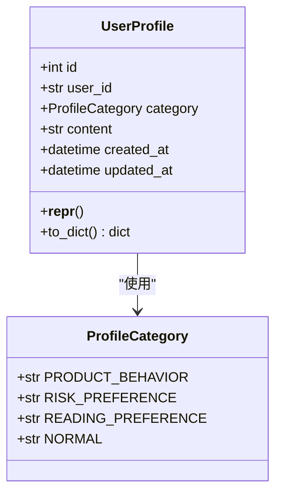

**Diagram sources**
- [user_profile.py](file://python/valuecell/server/db/models/user_profile.py#L21-L63)

**Section sources**
- [user_profile.py](file://python/valuecell/server/db/models/user_profile.py#L21-L63)

### Agent（智能体元数据）
Agent模型表示ValueCell系统中的AI智能体，存储了智能体的基本信息、配置、状态和元数据。

**字段定义：**
- id: 主键，自增整数
- name: 智能体名称，唯一字符串，建立索引
- display_name: 显示名称，可为空
- description: 详细描述，文本类型
- icon_url: 图标URL，字符串类型
- version: 版本号，字符串类型
- enabled: 是否启用，布尔类型，默认True
- capabilities: 能力描述，JSON类型
- agent_metadata: 附加元数据，JSON类型
- config: 智能体特定配置，JSON类型
- created_at: 创建时间戳
- updated_at: 更新时间戳

**约束条件：**
- name字段唯一且建立索引
- enabled字段默认值为True

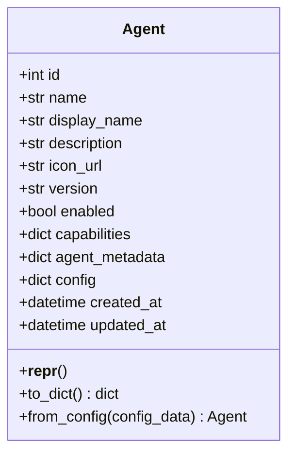

**Diagram sources**
- [agent.py](file://python/valuecell/server/db/models/agent.py#L15-L131)

**Section sources**
- [agent.py](file://python/valuecell/server/db/models/agent.py#L15-L131)

### Strategy（交易策略）
Strategy模型表示通过StrategyAgent创建的交易策略，存储了策略的基本信息、配置和状态。

**字段定义：**
- id: 主键，自增整数
- strategy_id: 运行时策略标识符，唯一字符串，建立索引
- name: 用户定义的策略名称，可为空
- description: 可选描述，文本类型
- user_id: 所有者用户ID，字符串类型，建立索引
- status: 策略状态，字符串类型，默认"running"
- config: 原始用户请求配置，JSON类型
- strategy_metadata: 附加元数据，JSON类型
- created_at: 创建时间戳
- updated_at: 更新时间戳

**约束条件：**
- strategy_id字段唯一且建立索引
- status字段默认值为"running"

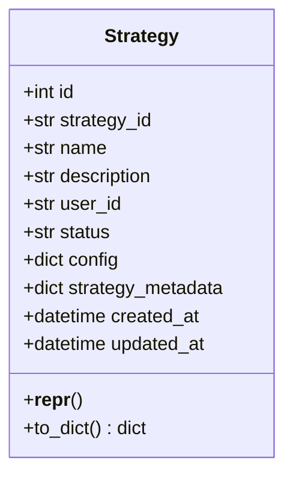

**Diagram sources**
- [strategy.py](file://python/valuecell/server/db/models/strategy.py#L15-L74)

**Section sources**
- [strategy.py](file://python/valuecell/server/db/models/strategy.py#L15-L74)

### Watchlist（自选股列表）
Watchlist模型表示用户的股票观察列表，包含主表Watchlist和子表WatchlistItem。

**Watchlist字段定义：**
- id: 主键，自增整数
- user_id: 用户标识符，字符串类型，建立索引
- name: 观察列表名称，字符串类型
- description: 描述，文本类型
- is_default: 是否为默认观察列表，布尔类型，默认False
- is_public: 是否公开，布尔类型，默认False
- created_at: 创建时间戳
- updated_at: 更新时间戳

**约束条件：**
- user_id和name的组合具有唯一性约束

**WatchlistItem字段定义：**
- id: 主键，自增整数
- watchlist_id: 外键，关联到watchlists表的id字段
- ticker: 股票代码，格式为"EXCHANGE:SYMBOL"，字符串类型，建立索引
- display_name: 显示名称，可为空
- notes: 用户笔记，文本类型
- order_index: 显示顺序，整数类型，默认0
- added_at: 添加时间戳
- updated_at: 更新时间戳

**约束条件：**
- watchlist_id和ticker的组合具有唯一性约束
- watchlist_id字段建立外键约束，删除时级联删除

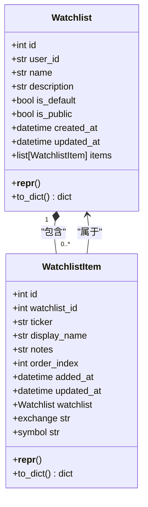

**Diagram sources**
- [watchlist.py](file://python/valuecell/server/db/models/watchlist.py#L25-L196)

**Section sources**
- [watchlist.py](file://python/valuecell/server/db/models/watchlist.py#L25-L196)

### Asset（资产信息）
Asset模型表示金融资产，包括股票、债券、加密货币等投资工具。

**字段定义：**
- id: 主键，自增整数
- symbol: 资产代码/股票代码，唯一字符串，建立索引
- name: 资产全名，字符串类型
- description: 详细描述，文本类型
- asset_type: 资产类型，字符串类型，建立索引
- sector: 行业板块，字符串类型
- current_price: 当前市场价格，数值类型
- is_active: 是否活跃，布尔类型，默认True
- asset_metadata: 附加元数据，JSON类型
- config: 资产特定配置，JSON类型
- created_at: 创建时间戳
- updated_at: 更新时间戳

**约束条件：**
- symbol字段唯一且建立索引
- is_active字段默认值为True

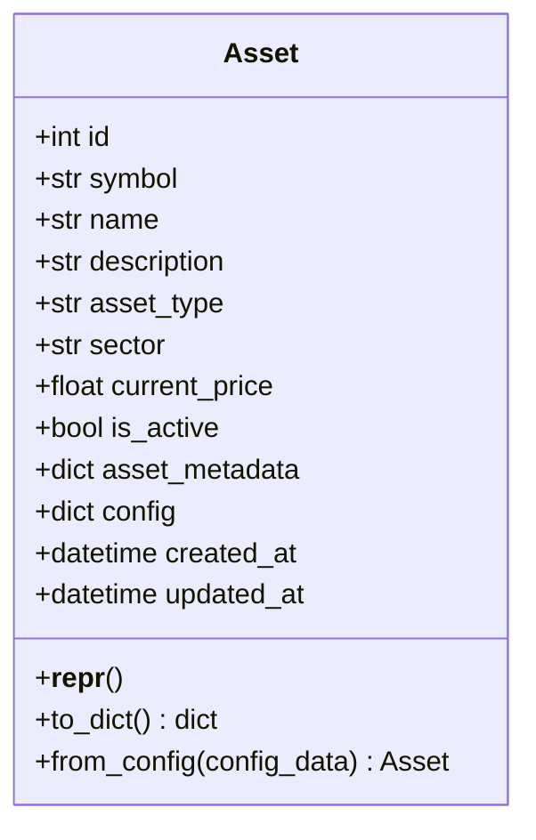

**Diagram sources**
- [asset.py](file://python/valuecell/server/db/models/asset.py#L15-L128)

**Section sources**
- [asset.py](file://python/valuecell/server/db/models/asset.py#L15-L128)

## 关联表设计

### strategy_portfolio（策略组合）
StrategyPortfolioView模型存储策略的聚合投资组合快照，包括现金、权益和未实现盈亏。

**字段定义：**
- id: 主键，自增整数
- strategy_id: 策略标识符，外键关联到strategies表的strategy_id字段
- cash: 现金余额
- total_value: 总投资组合价值（权益）
- total_unrealized_pnl: 总未实现盈亏
- total_realized_pnl: 总已实现盈亏
- gross_exposure: 快照时的总风险敞口
- net_exposure: 快照时的净风险敞口
- snapshot_ts: 快照时间戳
- created_at: 创建时间戳
- updated_at: 更新时间戳

**约束条件：**
- strategy_id和snapshot_ts的组合具有唯一性约束
- strategy_id字段建立外键约束，删除时级联删除

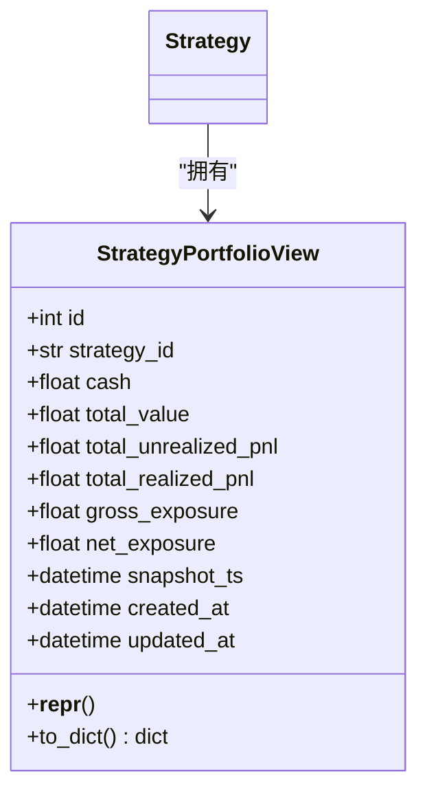

**Diagram sources**
- [strategy_portfolio.py](file://python/valuecell/server/db/models/strategy_portfolio.py#L25-L122)

**Section sources**
- [strategy_portfolio.py](file://python/valuecell/server/db/models/strategy_portfolio.py#L25-L122)

### strategy_holding（策略持仓）
StrategyHolding模型存储策略的持仓（头寸）快照，每个记录代表一个策略在特定时间点的某个证券头寸。

**字段定义：**
- id: 主键，自增整数
- strategy_id: 策略标识符，外键关联到strategies表的strategy_id字段
- symbol: 证券代码，字符串类型，建立索引
- type: 头寸类型（LONG/SHORT），字符串类型
- leverage: 杠杆比率，数值类型
- entry_price: 平均入场价格，数值类型
- quantity: 头寸数量（绝对值），数值类型
- unrealized_pnl: 未实现盈亏值，数值类型
- unrealized_pnl_pct: 未实现盈亏百分比，数值类型
- snapshot_ts: 快照时间戳
- created_at: 创建时间戳
- updated_at: 更新时间戳

**约束条件：**
- strategy_id、symbol和snapshot_ts的组合具有唯一性约束
- strategy_id字段建立外键约束，删除时级联删除

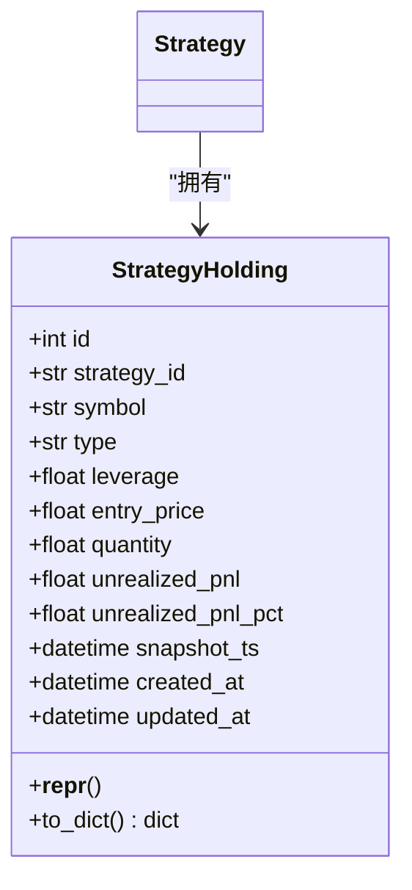

**Diagram sources**
- [strategy_holding.py](file://python/valuecell/server/db/models/strategy_holding.py#L24-L112)

**Section sources**
- [strategy_holding.py](file://python/valuecell/server/db/models/strategy_holding.py#L24-L112)

## Pydantic Schema与API传输模型

### 数据库模型与API模型的分离
系统通过Pydantic Schema实现了数据库模型与API传输模型的分离，确保了数据的安全性和灵活性。

**分离原则：**
- 数据库模型（ORM模型）负责数据持久化
- Pydantic Schema负责API请求和响应的数据验证与序列化
- 通过to_dict()方法将数据库模型转换为字典，再由Pydantic Schema进行验证和序列化

### UserProfile Schema
UserProfile相关的Pydantic Schema定义在`python/valuecell/server/api/schemas/user_profile.py`中。

**主要Schema：**
- UserProfileData：用户配置数据Schema
- CreateUserProfileRequest：创建用户配置请求Schema
- UpdateUserProfileRequest：更新用户配置请求Schema
- UserProfileListData：用户配置列表数据Schema
- UserProfileSummaryData：用户配置摘要数据Schema

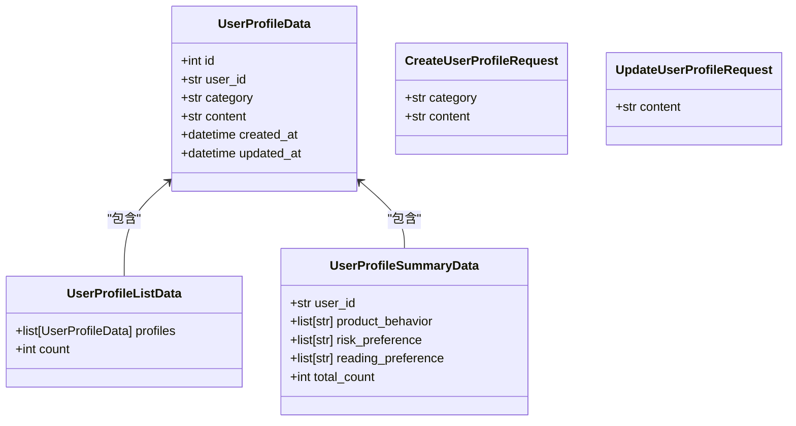

**Diagram sources**
- [user_profile.py](file://python/valuecell/server/api/schemas/user_profile.py#L11-L63)

**Section sources**
- [user_profile.py](file://python/valuecell/server/api/schemas/user_profile.py#L11-L63)

### Strategy Schema
Strategy相关的Pydantic Schema定义在`python/valuecell/server/api/schemas/strategy.py`中。

**主要Schema：**
- StrategySummaryData：策略摘要数据
- StrategyListData：策略列表数据
- PositionHoldingItem：持仓项目
- StrategyHoldingData：策略持仓数据
- StrategyPortfolioSummaryData：策略组合摘要数据
- StrategyActionCard：策略动作卡片
- StrategyCycleDetail：策略周期详情

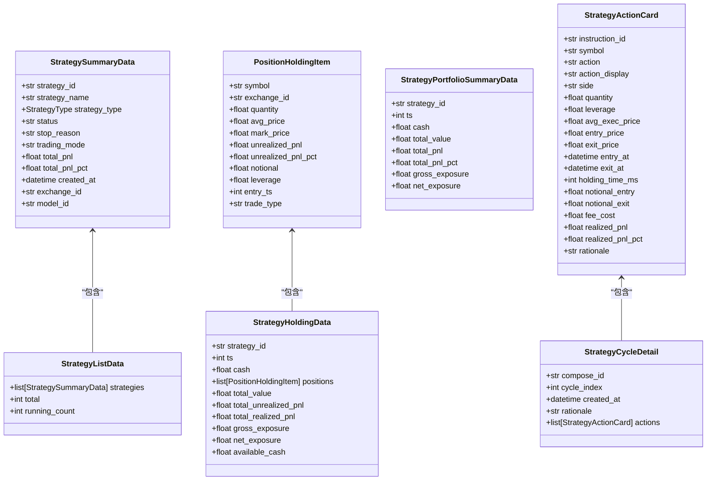

**Diagram sources**
- [strategy.py](file://python/valuecell/server/api/schemas/strategy.py#L19-L276)

**Section sources**
- [strategy.py](file://python/valuecell/server/api/schemas/strategy.py#L19-L276)

## 数据库初始化与连接管理

### init_db.py（数据库初始化）
`init_db.py`文件负责数据库的初始化工作，包括创建数据库文件、创建表结构、初始化基础数据等。

**主要功能：**
- 检查数据库是否存在
- 创建数据库文件（针对SQLite）
- 创建所有表结构
- 初始化默认智能体数据
- 初始化资产数据
- 验证数据库初始化结果

**初始化流程：**
1. 检查数据库是否存在且已正确初始化
2. 创建数据库文件（如果需要）
3. 创建所有表结构
4. 初始化基础数据（智能体）
5. 初始化资产数据
6. 验证初始化结果

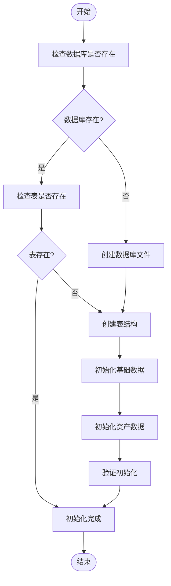

**Diagram sources**
- [init_db.py](file://python/valuecell/server/db/init_db.py#L36-L656)

**Section sources**
- [init_db.py](file://python/valuecell/server/db/init_db.py#L36-L656)

### connection.py（连接管理）
`connection.py`文件负责数据库连接和会话管理。

**主要组件：**
- DatabaseManager类：数据库连接和会话管理器
- get_database_manager()函数：获取全局数据库管理器实例
- get_db()函数：获取数据库会话（用于FastAPI依赖注入）

**连接管理特点：**
- 使用单例模式管理数据库连接
- 支持SQLite的特殊配置（check_same_thread=False）
- 提供会话工厂（sessionmaker）
- 支持依赖注入模式

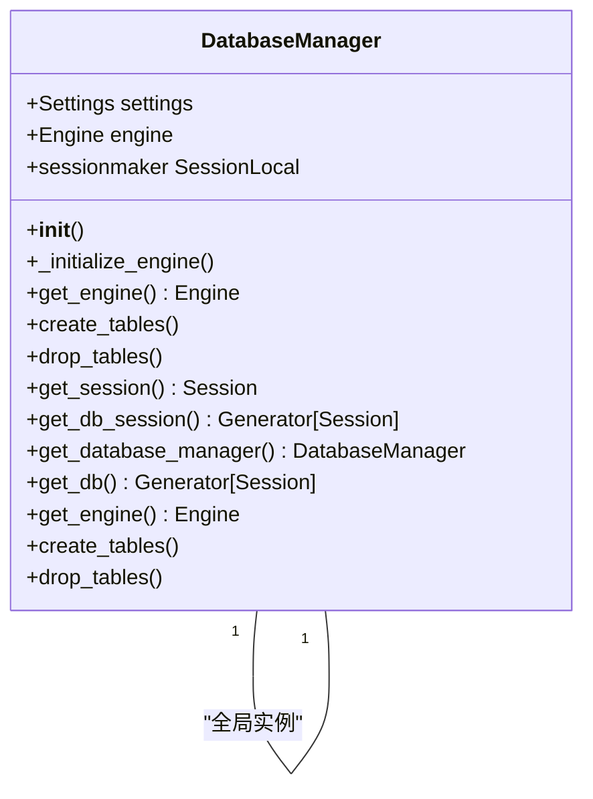

**Diagram sources**
- [connection.py](file://python/valuecell/server/db/connection.py#L13-L103)

**Section sources**
- [connection.py](file://python/valuecell/server/db/connection.py#L13-L103)

## 实体关系图
以下是系统核心实体的关系图：

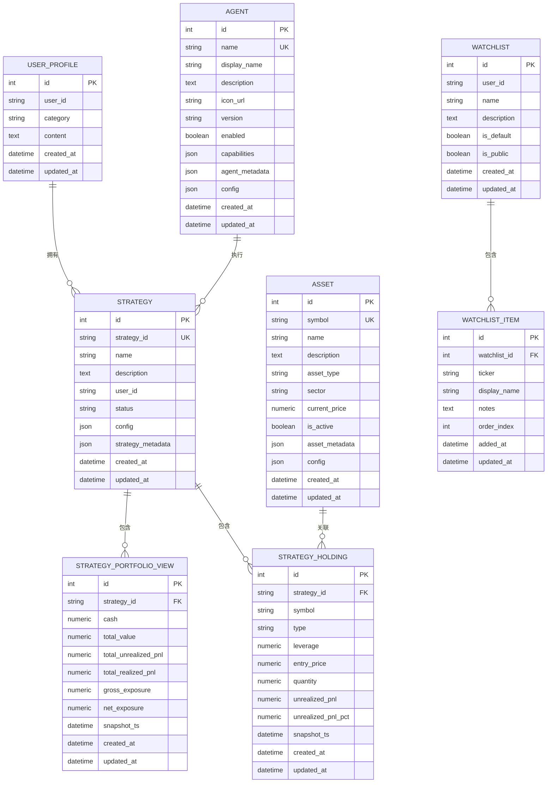

**Diagram sources**
- [user_profile.py](file://python/valuecell/server/db/models/user_profile.py#L21-L63)
- [agent.py](file://python/valuecell/server/db/models/agent.py#L15-L131)
- [strategy.py](file://python/valuecell/server/db/models/strategy.py#L15-L74)
- [watchlist.py](file://python/valuecell/server/db/models/watchlist.py#L25-L196)
- [asset.py](file://python/valuecell/server/db/models/asset.py#L15-L128)
- [strategy_portfolio.py](file://python/valuecell/server/db/models/strategy_portfolio.py#L25-L122)
- [strategy_holding.py](file://python/valuecell/server/db/models/strategy_holding.py#L24-L112)

## 典型查询场景

### 获取用户策略组合
获取特定用户的策略组合信息，包括策略列表和每个策略的持仓情况。

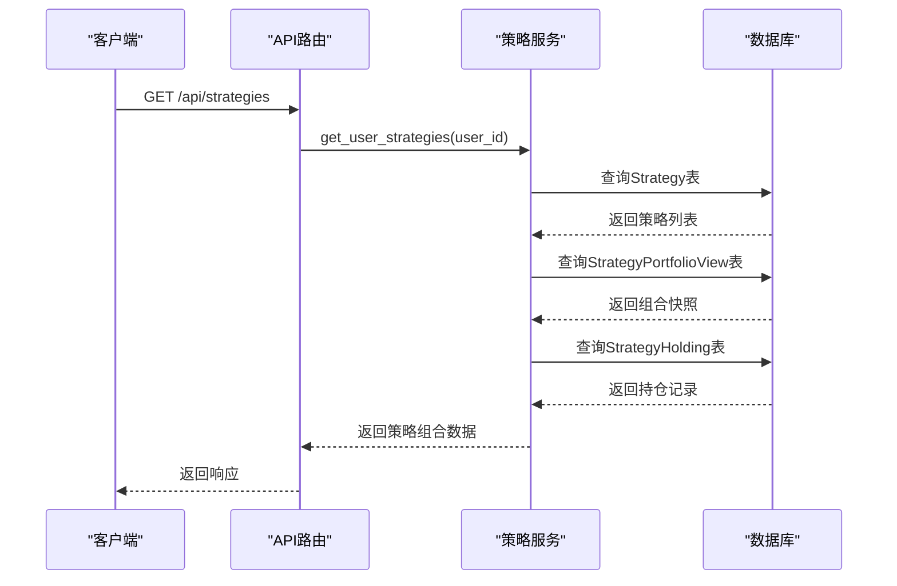

**Diagram sources**
- [strategy.py](file://python/valuecell/server/api/routers/strategy.py)
- [strategy_service.py](file://python/valuecell/server/services/strategy_service.py)
- [strategy.py](file://python/valuecell/server/db/models/strategy.py)
- [strategy_portfolio.py](file://python/valuecell/server/db/models/strategy_portfolio.py)
- [strategy_holding.py](file://python/valuecell/server/db/models/strategy_holding.py)

**Section sources**
- [strategy.py](file://python/valuecell/server/api/routers/strategy.py)
- [strategy_service.py](file://python/valuecell/server/services/strategy_service.py)

### 查询持仓记录
查询特定策略的持仓记录，包括历史持仓和当前持仓。

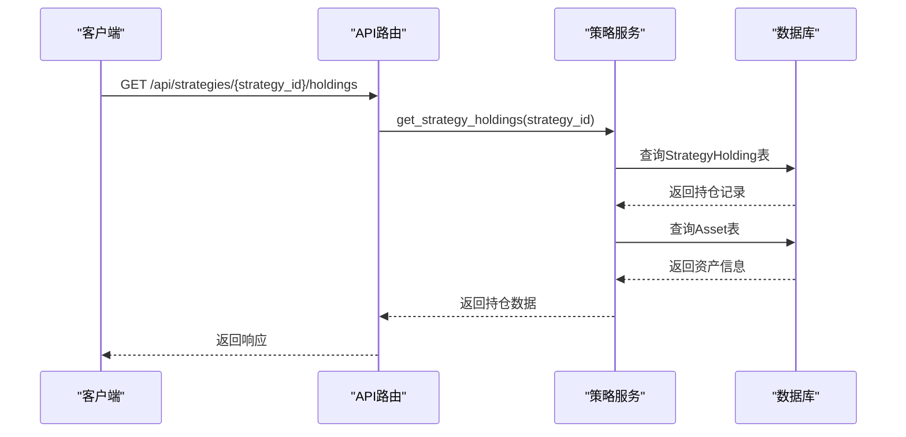

**Diagram sources**
- [strategy.py](file://python/valuecell/server/api/routers/strategy.py)
- [strategy_service.py](file://python/valuecell/server/services/strategy_service.py)
- [strategy_holding.py](file://python/valuecell/server/db/models/strategy_holding.py)
- [asset.py](file://python/valuecell/server/db/models/asset.py)

**Section sources**
- [strategy.py](file://python/valuecell/server/api/routers/strategy.py)
- [strategy_service.py](file://python/valuecell/server/services/strategy_service.py)

## 总结
本文档详细介绍了ValueCell系统的数据模型设计，包括核心实体模型、关联表设计、Pydantic Schema与API传输模型的分离机制，以及数据库初始化和连接管理的最佳实践。通过这些设计，系统实现了数据的高效存储、安全访问和灵活扩展。