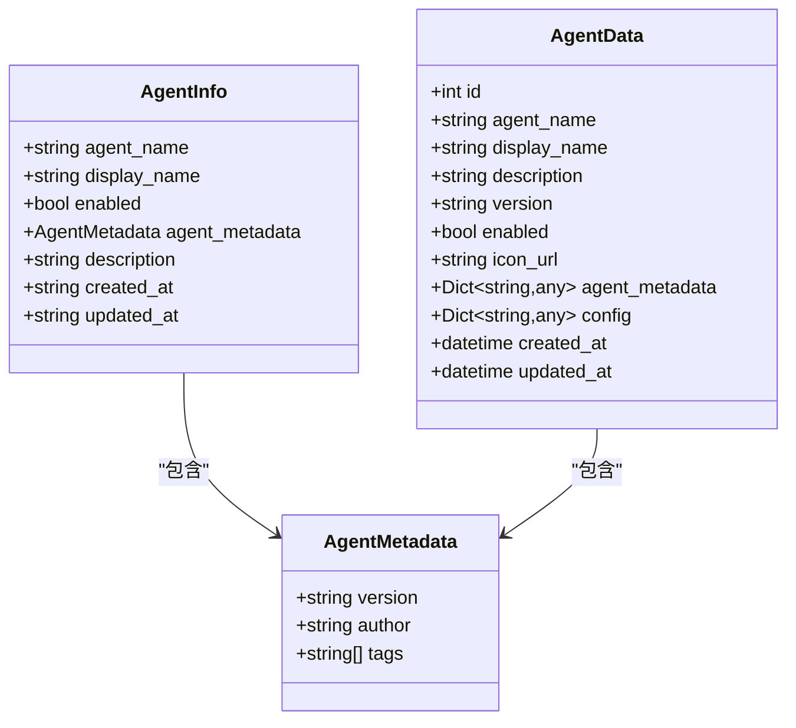
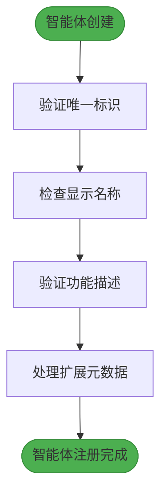
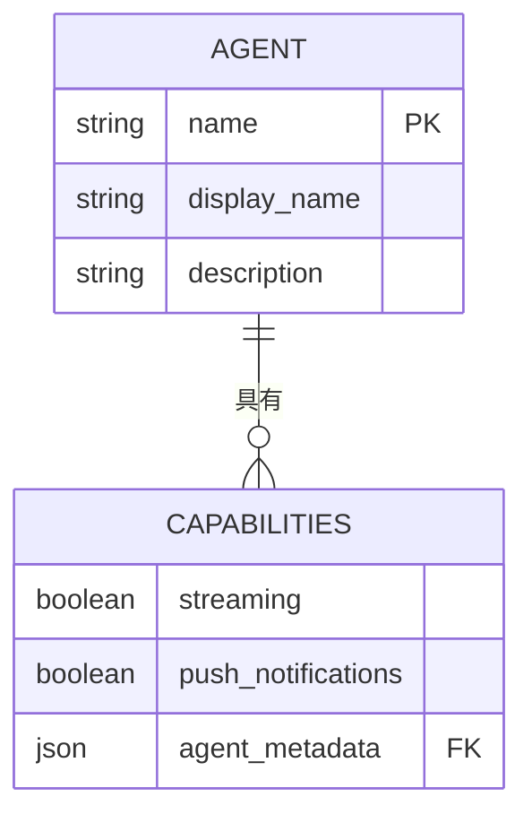
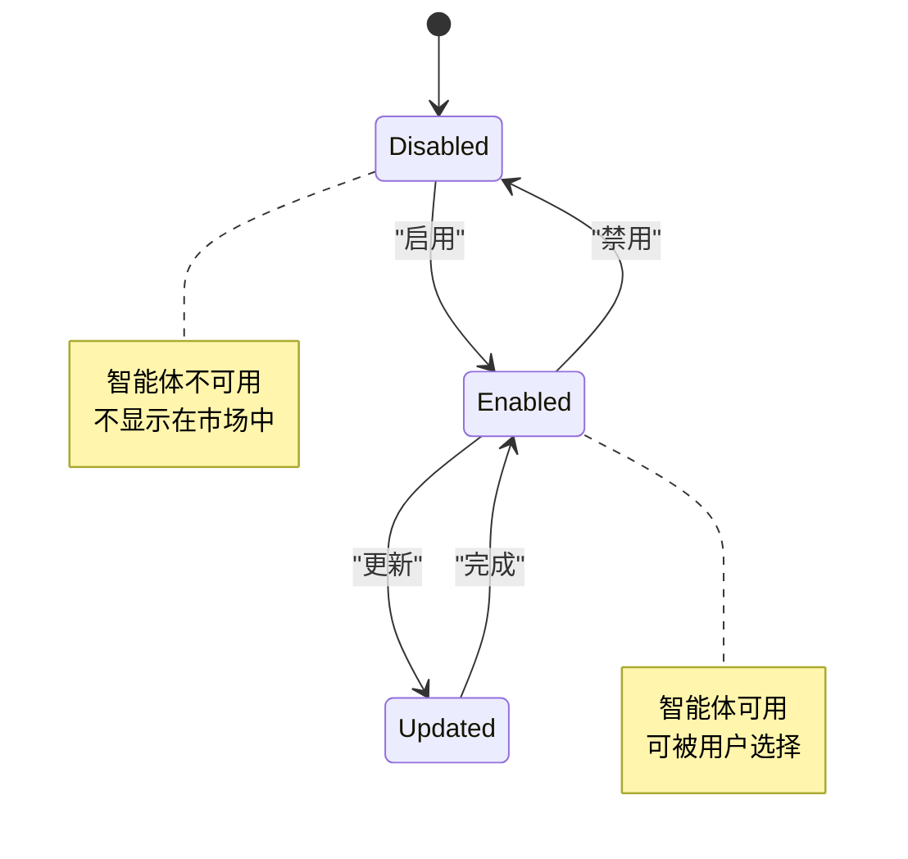
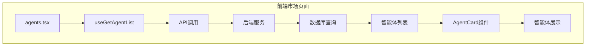
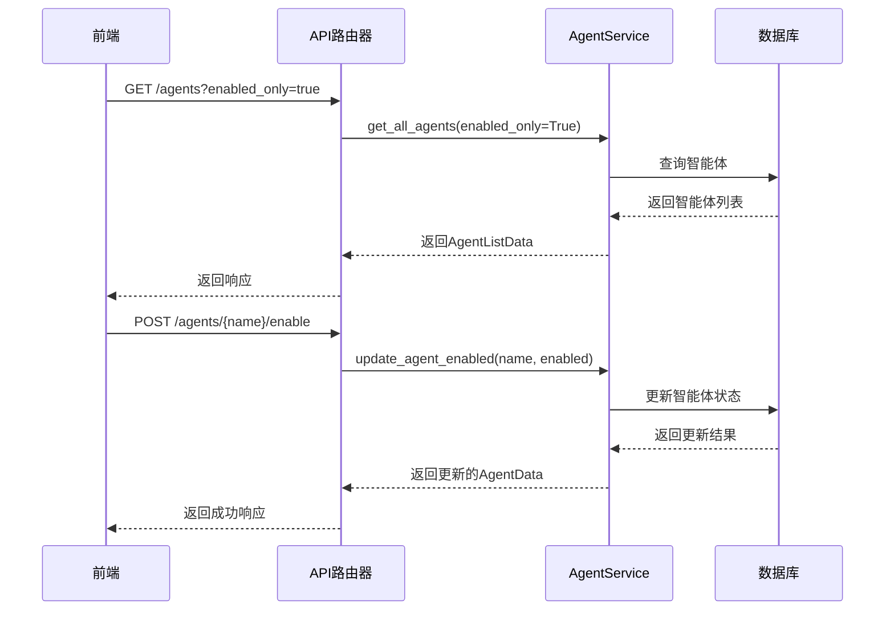
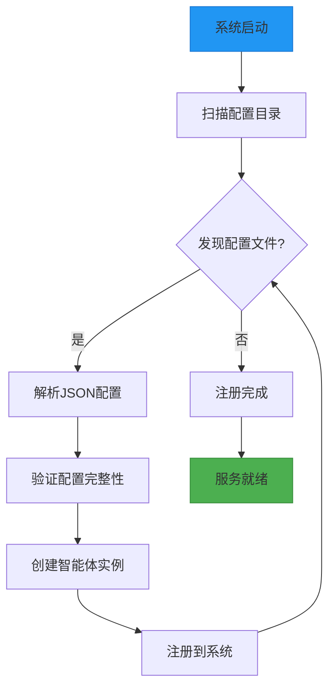

# 智能体模型

<cite>
**本文档引用的文件**   
- [agent.ts](file://frontend/src/types/agent.ts)
- [agent.py](file://python/valuecell/server/api/routers/agent.py)
- [agent_service.py](file://python/valuecell/server/services/agent_service.py)
- [agent.py](file://python/valuecell/server/db/models/agent.py)
- [agent_card.tsx](file://frontend/src/app/market/components/agent-card.tsx)
- [agents.tsx](file://frontend/src/app/market/agents.tsx)
- [agent.py](file://frontend/src/api/agent.ts)
- [loader.py](file://python/valuecell/config/loader.py)
- [grid_agent.json](file://python/configs/agent_cards/grid_agent.json)
- [news_agent.json](file://python/configs/agent_cards/news_agent.json)
</cite>

## 目录
1. [简介](#简介)
2. [核心数据结构](#核心数据结构)
3. [元数据管理](#元数据管理)
4. [能力描述](#能力描述)
5. [状态与版本控制](#状态与版本控制)
6. [市场页面集成](#市场页面集成)
7. [服务层实现](#服务层实现)
8. [配置与动态注册](#配置与动态注册)

## 简介
智能体模型是ValueCell系统的核心组成部分，用于定义和管理AI智能体的元数据、功能特性和运行时行为。该模型通过结构化的JSON模式设计，支持智能体的发现、选择和动态配置。本文档详细阐述了智能体模型的各个组成部分，包括基本信息字段、扩展元数据、功能特性以及如何通过服务层与前端市场页面进行集成。

## 核心数据结构
智能体模型的核心数据结构定义了智能体的基本信息和配置。这些信息通过前后端共享的类型定义和数据库模型保持一致。



**图示来源**
- [agent.ts](file://frontend/src/types/agent.ts#L128-L142)
- [agent.py](file://python/valuecell/server/api/schemas/agent.py#L30-L44)
- [agent.py](file://python/valuecell/server/db/models/agent.py#L23-L89)

**本节来源**
- [agent.ts](file://frontend/src/types/agent.ts#L128-L142)
- [agent.py](file://python/valuecell/server/api/schemas/agent.py#L30-L44)

## 元数据管理
智能体的元数据管理通过`agent_metadata`字段实现，该字段是一个JSON对象，包含作者、标签、版本等扩展信息。这种设计允许智能体携带丰富的描述性信息，支持智能体的分类、搜索和展示。

### 基本信息字段
智能体的基本信息字段提供了智能体的唯一标识和显示信息：

- **name** (`agent_name`): 智能体的唯一标识符，用于系统内部引用和API调用
- **display_name**: 智能体的显示名称，用于用户界面展示
- **description**: 智能体的功能描述，帮助用户理解其用途和能力



**图示来源**
- [agent.ts](file://frontend/src/types/agent.ts#L135-L139)
- [agent.py](file://python/valuecell/server/db/models/agent.py#L29-L38)

**本节来源**
- [agent.ts](file://frontend/src/types/agent.ts#L135-L139)
- [agent.py](file://python/valuecell/server/db/models/agent.py#L29-L38)

## 能力描述
智能体的能力描述通过`capabilities`字段实现，该字段定义了智能体支持的功能特性，如流式响应和推送通知。

### 功能特性
智能体的功能特性在`capabilities` JSON对象中定义：

- **streaming**: 布尔值，表示智能体是否支持流式响应
- **push_notifications**: 布尔值，表示智能体是否支持推送通知



**图示来源**
- [agent.py](file://python/valuecell/server/api/schemas/agent.py#L13-L20)
- [agent.py](file://python/valuecell/server/db/models/agent.py#L64-L68)

**本节来源**
- [agent.py](file://python/valuecell/server/api/schemas/agent.py#L13-L20)
- [agent.py](file://python/valuecell/server/db/models/agent.py#L64-L68)

## 状态与版本控制
智能体的状态和版本控制通过`enabled`和`version`字段实现，支持智能体的启用/禁用管理和版本追踪。

### 启用/禁用控制
`enabled`字段是布尔类型，用于控制智能体的可用状态：
- `true`: 智能体处于启用状态，可以被用户选择和使用
- `false`: 智能体处于禁用状态，不会出现在可用智能体列表中

### 版本管理
`version`字段用于版本管理，遵循语义化版本控制规范（如"1.0.0"），支持：
- 跟踪智能体的迭代历史
- 支持向后兼容性检查
- 辅助用户了解智能体的成熟度



**图示来源**
- [agent.py](file://python/valuecell/server/db/models/agent.py#L56-L61)
- [agent.py](file://python/valuecell/server/db/models/agent.py#L51-L53)

**本节来源**
- [agent.py](file://python/valuecell/server/db/models/agent.py#L51-L61)

## 市场页面集成
智能体模型通过`agents.tsx`市场页面实现智能体的展示与选择功能，为用户提供直观的界面来浏览和选择可用的智能体。

### 市场页面实现
市场页面通过以下组件实现智能体展示：



**图示来源**
- [agents.tsx](file://frontend/src/app/market/agents.tsx#L8)
- [agent-card.tsx](file://frontend/src/app/market/components/agent-card.tsx)

**本节来源**
- [agents.tsx](file://frontend/src/app/market/agents.tsx#L8)
- [agent-card.tsx](file://frontend/src/app/market/components/agent-card.tsx)

## 服务层实现
智能体模型的服务层实现通过`AgentService`类提供，处理智能体相关的业务逻辑操作。

### 服务层架构
服务层提供了以下核心功能：



**图示来源**
- [agent_service.py](file://python/valuecell/server/services/agent_service.py)
- [agent.py](file://python/valuecell/server/api/routers/agent.py)

**本节来源**
- [agent_service.py](file://python/valuecell/server/services/agent_service.py)
- [agent.py](file://python/valuecell/server/api/routers/agent.py)

## 配置与动态注册
智能体模型支持通过配置文件实现动态注册，允许系统在启动时自动发现和注册智能体。

### 配置文件结构
智能体通过JSON配置文件进行定义，示例如下：

```json
{
  "name": "NewsAgent",
  "display_name": "News Agent",
  "description": "Professional news agent specialized in gathering, analyzing, and presenting current events",
  "capabilities": {
    "streaming": true
  },
  "enabled": true,
  "metadata": {
    "version": "1.0.0",
    "author": "ValueCell Team",
    "tags": ["news", "current events", "financial markets"]
  }
}
```

### 动态注册流程
配置驱动的动态注册流程如下：



**图示来源**
- [grid_agent.json](file://python/configs/agent_cards/grid_agent.json)
- [news_agent.json](file://python/configs/agent_cards/news_agent.json)
- [loader.py](file://python/valuecell/config/loader.py)

**本节来源**
- [grid_agent.json](file://python/configs/agent_cards/grid_agent.json)
- [news_agent.json](file://python/configs/agent_cards/news_agent.json)
- [loader.py](file://python/valuecell/config/loader.py)