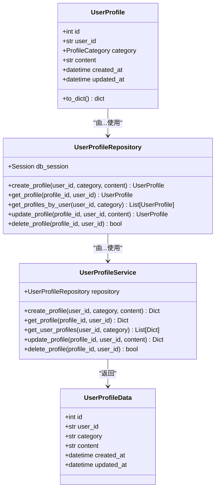
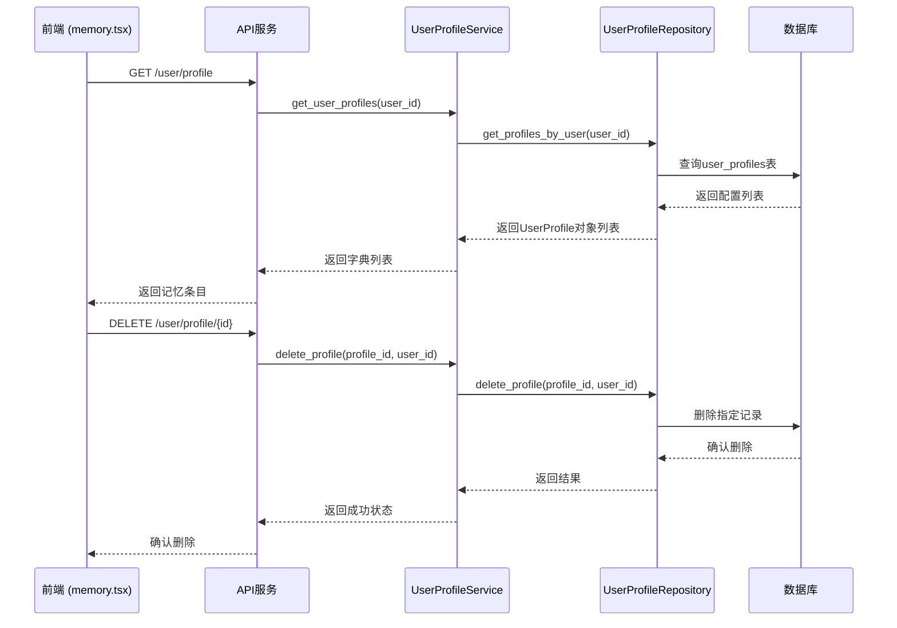
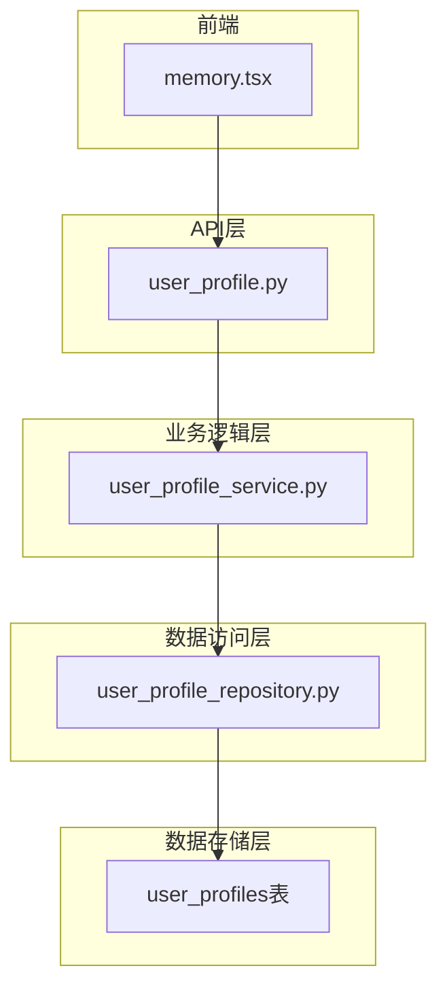

# 用户配置模型

<cite>
**本文档引用的文件**   
- [user_profile.py](file://python/valuecell/server/db/models/user_profile.py)
- [user_profile_repository.py](file://python/valuecell/server/db/repositories/user_profile_repository.py)
- [user_profile_service.py](file://python/valuecell/server/services/user_profile_service.py)
- [user_profile.py](file://python/valuecell/server/api/routers/user_profile.py)
- [user_profile.py](file://python/valuecell/server/api/schemas/user_profile.py)
- [memory.tsx](file://frontend/src/app/setting/memory.tsx)
- [setting.ts](file://frontend/src/api/setting.ts)
- [connection.py](file://python/valuecell/server/db/connection.py)
</cite>

## 目录
1. [简介](#简介)
2. [核心数据结构](#核心数据结构)
3. [CRUD操作实现](#crud操作实现)
4. [前端集成](#前端集成)
5. [查询场景与性能优化](#查询场景与性能优化)
6. [数据验证与索引策略](#数据验证与索引策略)
7. [系统架构](#系统架构)

## 简介
用户配置模型是ValueCell系统中的核心组件，用于存储和管理用户的个性化偏好与记忆信息。该模型通过UserProfile实体实现，支持多种配置分类，包括产品行为、风险偏好和阅读偏好等。模型设计旨在为用户提供持久化的记忆存储功能，使系统能够根据用户的历史偏好提供更加个性化的服务。通过与前端设置页面的集成，用户可以方便地管理自己的记忆条目，而系统则利用这些信息优化对话和推荐的准确性。

## 核心数据结构
用户配置模型的核心是UserProfile实体，它包含以下关键字段：user_id（用户标识）、category（配置分类）、content（配置内容字符串）以及时间戳字段。配置分类采用枚举类型ProfileCategory，包含PRODUCT_BEHAVIOR（产品行为）、RISK_PREFERENCE（风险偏好）、READING_PREFERENCE（阅读偏好）和NORMAL（普通配置）等值。每个用户配置条目都通过user_id和category的复合索引进行高效检索，确保了数据访问的高性能。该模型支持用户记忆的存储和个性化偏好管理，为系统的智能化服务提供了数据基础。

**Section sources**
- [user_profile.py](file://python/valuecell/server/db/models/user_profile.py#L11-L62)

## CRUD操作实现
用户配置模型通过分层架构实现了完整的CRUD（创建、读取、更新、删除）操作。在数据访问层，UserProfileRepository提供了数据库操作的具体实现，包括create_profile、get_profile、get_profiles_by_user、update_profile和delete_profile等方法。业务逻辑层由UserProfileService管理，它封装了数据访问逻辑并添加了错误处理和日志记录功能。API层通过user_profile.py中的路由函数暴露RESTful接口，支持HTTP POST、GET、PUT和DELETE操作。这种分层设计确保了代码的可维护性和可测试性，同时通过依赖注入机制提高了组件的灵活性。

**Diagram sources **
- [user_profile.py](file://python/valuecell/server/db/models/user_profile.py#L21-L62)
- [user_profile_repository.py](file://python/valuecell/server/db/repositories/user_profile_repository.py#L17-L220)
- [user_profile_service.py](file://python/valuecell/server/services/user_profile_service.py#L12-L255)
- [user_profile.py](file://python/valuecell/server/api/schemas/user_profile.py#L11-L63)

**Section sources**
- [user_profile_repository.py](file://python/valuecell/server/db/repositories/user_profile_repository.py#L30-L167)
- [user_profile_service.py](file://python/valuecell/server/services/user_profile_service.py#L23-L158)

## 前端集成
用户配置模型与前端设置页面中的memory.tsx组件紧密集成，实现了用户记忆的可视化管理和交互。前端通过useGetMemoryList和useRemoveMemory等自定义Hook与后端API进行通信，获取和删除用户记忆条目。当用户在设置页面查看或修改记忆时，前端会向/user/profile端点发送HTTP请求，后端服务处理请求并返回相应数据。这种集成方式确保了用户界面的响应性和数据的一致性，使用户能够实时看到自己的配置变化。此外，前端还实现了数据缓存和错误处理机制，提升了用户体验。

**Diagram sources **
- [memory.tsx](file://frontend/src/app/setting/memory.tsx#L1-L61)
- [setting.ts](file://frontend/src/api/setting.ts#L17-L38)
- [user_profile.py](file://python/valuecell/server/api/routers/user_profile.py#L71-L113)

**Section sources**
- [memory.tsx](file://frontend/src/app/setting/memory.tsx#L1-L61)
- [setting.ts](file://frontend/src/api/setting.ts#L17-L38)

## 查询场景与性能优化
用户配置模型支持多种典型的查询场景，如获取用户风险偏好或阅读习惯。通过get_user_profiles方法，系统可以根据user_id和category参数高效检索特定类型的配置信息。为了优化查询性能，数据库在user_id和category字段上建立了复合索引，显著提高了数据检索速度。此外，系统还实现了get_profile_summary方法，能够一次性获取用户所有配置的汇总信息，减少了数据库查询次数。这些优化措施确保了即使在大量用户数据的情况下，系统也能快速响应查询请求，为用户提供流畅的体验。

**Section sources**
- [user_profile_service.py](file://python/valuecell/server/services/user_profile_service.py#L84-L111)
- [user_profile_repository.py](file://python/valuecell/server/db/repositories/user_profile_repository.py#L85-L109)

## 数据验证与索引策略
用户配置模型实施了严格的数据验证规则和索引策略，以确保数据的完整性和查询效率。在数据验证方面，系统通过_validate_category方法检查配置分类的有效性，只接受预定义的枚举值。内容字段设置了最小长度为1、最大长度为10000的约束，防止无效或过长的数据输入。在索引策略上，数据库在user_id和category字段上创建了复合索引，这不仅加速了基于用户和分类的查询，还支持了高效的分页和排序操作。这些措施共同保证了用户配置数据的高质量和高可用性。

**Section sources**
- [user_profile_service.py](file://python/valuecell/server/services/user_profile_service.py#L225-L237)
- [user_profile.py](file://python/valuecell/server/api/schemas/user_profile.py#L25-L31)

## 系统架构
用户配置模型的系统架构遵循分层设计原则，从数据存储到API暴露形成了清晰的层次结构。在底层，SQLite数据库通过SQLAlchemy ORM管理user_profiles表，确保了数据的持久化和一致性。中间层由UserProfileRepository和UserProfileService组成，分别负责数据访问和业务逻辑处理。顶层是FastAPI框架提供的RESTful API，通过user_profile.py中的路由函数暴露服务接口。这种架构不仅提高了代码的可维护性，还便于未来的功能扩展和性能优化。

**Diagram sources **
- [user_profile.py](file://python/valuecell/server/api/routers/user_profile.py#L22-L245)
- [user_profile_service.py](file://python/valuecell/server/services/user_profile_service.py#L12-L255)
- [user_profile_repository.py](file://python/valuecell/server/db/repositories/user_profile_repository.py#L17-L220)
- [user_profile.py](file://python/valuecell/server/db/models/user_profile.py#L21-L62)
- [connection.py](file://python/valuecell/server/db/connection.py#L13-L103)

**Section sources**
- [user_profile.py](file://python/valuecell/server/api/routers/user_profile.py#L22-L245)
- [user_profile_service.py](file://python/valuecell/server/services/user_profile_service.py#L12-L255)
- [user_profile_repository.py](file://python/valuecell/server/db/repositories/user_profile_repository.py#L17-L220)
- [user_profile.py](file://python/valuecell/server/db/models/user_profile.py#L21-L62)
- [connection.py](file://python/valuecell/server/db/connection.py#L13-L103)