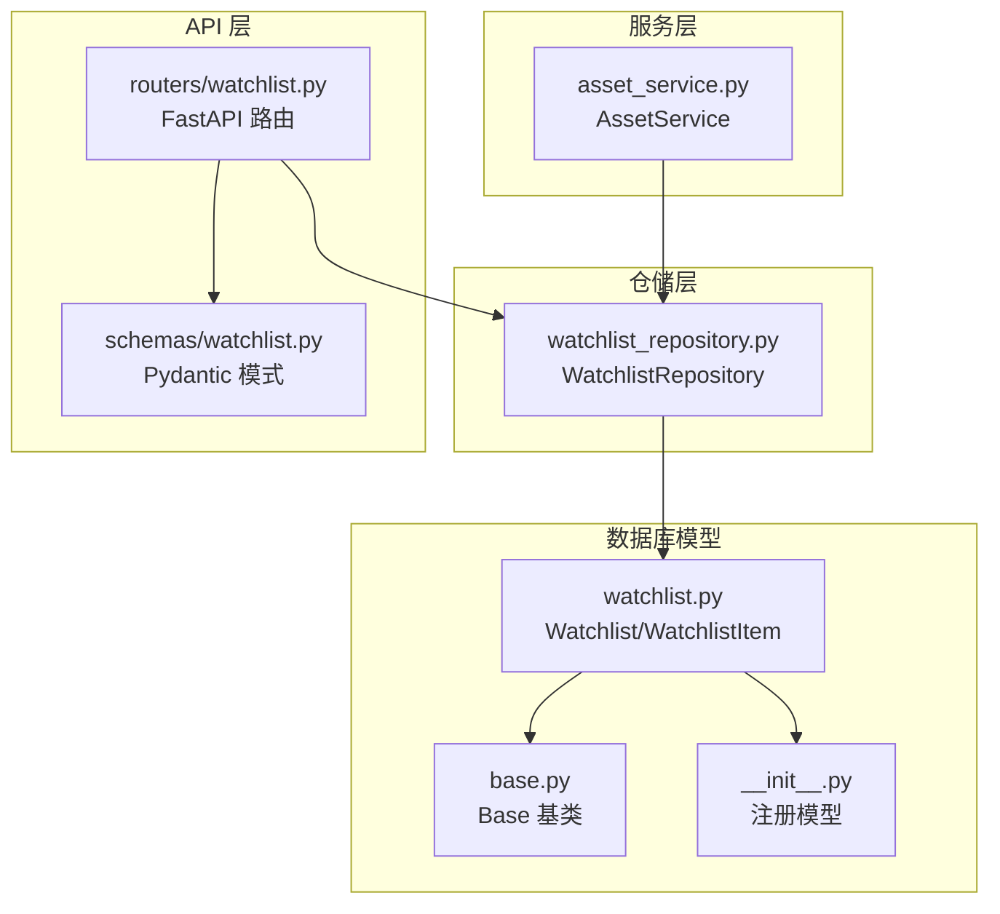
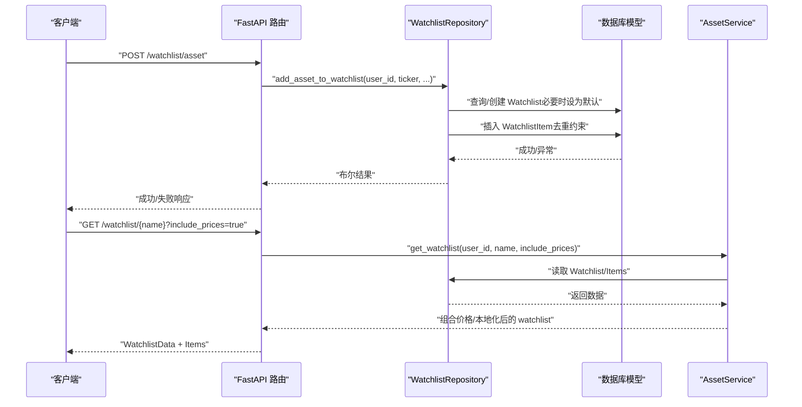
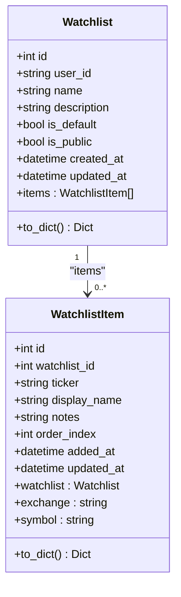
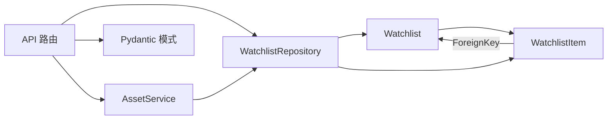

# 自选股模型

<cite>
**本文引用的文件**
- [python/valuecell/server/db/models/watchlist.py](file://python/valuecell/server/db/models/watchlist.py)
- [python/valuecell/server/db/repositories/watchlist_repository.py](file://python/valuecell/server/db/repositories/watchlist_repository.py)
- [python/valuecell/server/api/routers/watchlist.py](file://python/valuecell/server/api/routers/watchlist.py)
- [python/valuecell/server/api/schemas/watchlist.py](file://python/valuecell/server/api/schemas/watchlist.py)
- [python/valuecell/server/db/models/base.py](file://python/valuecell/server/db/models/base.py)
- [python/valuecell/server/db/models/__init__.py](file://python/valuecell/server/db/models/__init__.py)
- [python/valuecell/server/services/assets/asset_service.py](file://python/valuecell/server/services/assets/asset_service.py)
</cite>

## 目录
1. [简介](#简介)
2. [项目结构](#项目结构)
3. [核心组件](#核心组件)
4. [架构总览](#架构总览)
5. [详细组件分析](#详细组件分析)
6. [依赖分析](#依赖分析)
7. [性能考虑](#性能考虑)
8. [故障排查指南](#故障排查指南)
9. [结论](#结论)
10. [附录：典型操作示例路径](#附录典型操作示例路径)

## 简介
本文件系统性梳理 ValueCell 后端中的“自选股”模型设计，围绕 Watchlist 与 WatchlistItem 两个关联模型展开，重点阐释：
- Watchlist 的用户归属、命名唯一性、默认列表与公开状态等业务语义；
- WatchlistItem 与父表的级联删除关系、ticker 字段“交易所:代码”的统一格式及其解析；
- 用户体验相关字段（显示名、备注、排序索引）的作用；
- 典型操作流程（创建列表、添加条目、按序查询、按市场筛选）的调用链路与数据流。

## 项目结构
与自选股模型直接相关的代码分布在以下模块：
- 数据库模型层：watchlist 模型与基础基类
- 仓储层：对 watchlist 及其条目的持久化操作封装
- API 层：对外暴露的 watchlist 路由与请求/响应模式
- 服务层：资产搜索与 watchlist 管理的高层服务

图表来源
- [python/valuecell/server/db/models/watchlist.py](file://python/valuecell/server/db/models/watchlist.py#L1-L196)
- [python/valuecell/server/db/models/base.py](file://python/valuecell/server/db/models/base.py#L1-L11)
- [python/valuecell/server/db/models/__init__.py](file://python/valuecell/server/db/models/__init__.py#L1-L39)
- [python/valuecell/server/db/repositories/watchlist_repository.py](file://python/valuecell/server/db/repositories/watchlist_repository.py#L1-L501)
- [python/valuecell/server/api/routers/watchlist.py](file://python/valuecell/server/api/routers/watchlist.py#L1-L580)
- [python/valuecell/server/api/schemas/watchlist.py](file://python/valuecell/server/api/schemas/watchlist.py#L1-L202)
- [python/valuecell/server/services/assets/asset_service.py](file://python/valuecell/server/services/assets/asset_service.py#L1-L200)

章节来源
- [python/valuecell/server/db/models/watchlist.py](file://python/valuecell/server/db/models/watchlist.py#L1-L196)
- [python/valuecell/server/db/repositories/watchlist_repository.py](file://python/valuecell/server/db/repositories/watchlist_repository.py#L1-L501)
- [python/valuecell/server/api/routers/watchlist.py](file://python/valuecell/server/api/routers/watchlist.py#L1-L580)
- [python/valuecell/server/api/schemas/watchlist.py](file://python/valuecell/server/api/schemas/watchlist.py#L1-L202)
- [python/valuecell/server/db/models/base.py](file://python/valuecell/server/db/models/base.py#L1-L11)
- [python/valuecell/server/db/models/__init__.py](file://python/valuecell/server/db/models/__init__.py#L1-L39)
- [python/valuecell/server/services/assets/asset_service.py](file://python/valuecell/server/services/assets/asset_service.py#L1-L200)

## 核心组件
- Watchlist：用户自选股列表实体，包含用户标识、名称、描述、默认与公开标志、时间戳以及与条目的关系；通过联合唯一约束确保同一用户下的列表名称唯一。
- WatchlistItem：列表中的具体股票条目，通过外键与 Watchlist 关联，支持级联删除；ticker 采用“EXCHANGE:SYMBOL”格式，提供 exchange 与 symbol 两个只读属性用于解析；支持 display_name、notes、order_index 等提升用户体验的字段。

章节来源
- [python/valuecell/server/db/models/watchlist.py](file://python/valuecell/server/db/models/watchlist.py#L25-L103)
- [python/valuecell/server/db/models/watchlist.py](file://python/valuecell/server/db/models/watchlist.py#L105-L196)

## 架构总览
自选股功能从 API 路由进入，经由仓储层访问数据库模型，同时结合服务层完成资产信息与价格数据的补充。整体调用链如下：

图表来源
- [python/valuecell/server/api/routers/watchlist.py](file://python/valuecell/server/api/routers/watchlist.py#L304-L421)
- [python/valuecell/server/db/repositories/watchlist_repository.py](file://python/valuecell/server/db/repositories/watchlist_repository.py#L222-L303)
- [python/valuecell/server/services/assets/asset_service.py](file://python/valuecell/server/services/assets/asset_service.py#L623-L661)

## 详细组件分析

### Watchlist 模型
- 用户归属与命名唯一性
  - user_id：字符串类型，标识列表归属用户；便于多租户或匿名用户场景。
  - name：列表名称；与 user_id 组成联合唯一约束，保证同一用户下列表名称全局唯一。
- 状态标志
  - is_default：是否为该用户的默认列表；创建时若置为默认，会自动将该用户其他列表的默认标记清除。
  - is_public：是否公开；可用于后续权限控制或分享场景。
- 时间戳
  - created_at/updated_at：服务器默认时间，自动维护。
- 关系与约束
  - items：与 WatchlistItem 的一对多关系，级联删除孤儿项，避免孤立条目。
  - 联合唯一约束：UniqueConstraint('user_id','name')，确保用户级唯一命名。

图表来源
- [python/valuecell/server/db/models/watchlist.py](file://python/valuecell/server/db/models/watchlist.py#L25-L103)
- [python/valuecell/server/db/models/watchlist.py](file://python/valuecell/server/db/models/watchlist.py#L105-L196)

章节来源
- [python/valuecell/server/db/models/watchlist.py](file://python/valuecell/server/db/models/watchlist.py#L25-L103)

### WatchlistItem 模型
- 外键与级联删除
  - watchlist_id 外键指向 watchlists.id，ondelete=CASCADE；当删除 Watchlist 时，其所有条目自动删除，保持数据一致性。
- ticker 设计与解析
  - 采用“EXCHANGE:SYMBOL”格式，统一跨市场的股票标识，便于跨适配器与多交易所场景。
  - 提供 exchange 与 symbol 两个只读属性，分别从 ticker 中解析出交易所与代码；若无冒号分隔，则 symbol 回退为完整 ticker。
- 用户体验字段
  - display_name：优先展示搜索结果中的显示名，未提供时回退到 symbol。
  - notes：用户对某只股票的备注。
  - order_index：在列表中的显示顺序，便于前端排序与拖拽重排。
- 唯一约束
  - UniqueConstraint('watchlist_id','ticker')，确保单个列表内不重复添加同一股票。

章节来源
- [python/valuecell/server/db/models/watchlist.py](file://python/valuecell/server/db/models/watchlist.py#L105-L196)

### 仓储层：WatchlistRepository
- 创建列表
  - 若设置 is_default，则先将该用户其他列表的默认标记置为 false；随后创建新列表并返回。
- 查询列表
  - 支持按名称、ID、默认列表、用户全量列表查询；查询时会预加载 items，避免懒加载问题。
- 添加/移除条目
  - add_asset_to_watchlist：可指定 watchlist_name 或使用默认列表；若未提供 display_name，尝试从资产表回填；order_index 默认为当前列表条目数量。
  - remove_asset_from_watchlist：按 watchlist_id 与 ticker 定位条目并删除。
- 获取条目与检查存在
  - get_watchlist_assets：按 order_index 升序返回条目列表。
  - is_asset_in_watchlist：判断某股票是否已存在于指定或默认列表。
- 更新备注
  - update_asset_notes：更新条目 notes 并提交。

章节来源
- [python/valuecell/server/db/repositories/watchlist_repository.py](file://python/valuecell/server/db/repositories/watchlist_repository.py#L1-L501)

### API 层：路由与模式
- 路由
  - 列表 CRUD：GET /、GET /{name}、POST /、DELETE /{name}
  - 条目管理：POST /asset、DELETE /asset/{ticker}、PUT /asset/{ticker}/notes
  - 价格与历史：GET /asset/{ticker}/price、GET /asset/{ticker}/price/historical
- 请求/响应模式
  - CreateWatchlistRequest、AddAssetRequest、UpdateAssetNotesRequest、WatchlistData、WatchlistItemData 等 Pydantic 模式定义了输入输出结构，其中 WatchlistItemData 包含 derived 字段 exchange/symbol，便于前端直接消费。

章节来源
- [python/valuecell/server/api/routers/watchlist.py](file://python/valuecell/server/api/routers/watchlist.py#L1-L580)
- [python/valuecell/server/api/schemas/watchlist.py](file://python/valuecell/server/api/schemas/watchlist.py#L1-L202)

### 服务层：AssetService 与 watchlist 集成
- 服务层通过 watchlist_manager 与 watchlist_repository 协作，提供资产搜索、详情、实时价与历史价等能力；在获取 watchlist 时可选择是否包含价格数据，从而减少不必要的网络开销。

章节来源
- [python/valuecell/server/services/assets/asset_service.py](file://python/valuecell/server/services/assets/asset_service.py#L1-L200)
- [python/valuecell/server/services/assets/asset_service.py](file://python/valuecell/server/services/assets/asset_service.py#L623-L661)

## 依赖分析
- 模型依赖
  - WatchlistItem 依赖 Watchlist 的主键 id；二者通过 SQLAlchemy relationship 建立一对多关系。
  - Watchlist 与 WatchlistItem 均继承自 Base，注册于统一元数据。
- 仓储依赖
  - WatchlistRepository 依赖 SQLAlchemy Session 与数据库模型；对异常进行捕获与回滚，保证幂等性。
- API 依赖
  - 路由依赖仓库与资产服务；对异常转换为 HTTP 异常，统一错误响应。
- 服务依赖
  - AssetService 依赖适配器管理器与 watchlist 管理器，延迟加载仓库以避免循环导入。

图表来源
- [python/valuecell/server/db/models/watchlist.py](file://python/valuecell/server/db/models/watchlist.py#L25-L196)
- [python/valuecell/server/db/repositories/watchlist_repository.py](file://python/valuecell/server/db/repositories/watchlist_repository.py#L1-L501)
- [python/valuecell/server/api/routers/watchlist.py](file://python/valuecell/server/api/routers/watchlist.py#L1-L580)
- [python/valuecell/server/api/schemas/watchlist.py](file://python/valuecell/server/api/schemas/watchlist.py#L1-L202)
- [python/valuecell/server/services/assets/asset_service.py](file://python/valuecell/server/services/assets/asset_service.py#L1-L200)

## 性能考虑
- 查询优化
  - Watchlist 与 WatchlistItem 均设置了索引列（如 user_id、name、watchlist_id、ticker），有助于过滤与连接性能。
  - 仓储层在批量查询时预加载 items，避免 N+1 查询问题。
- 写入与并发
  - 联合唯一约束在数据库层面保证唯一性，避免应用层竞争条件。
  - 默认列表切换时的原子更新，减少并发冲突。
- 序列化与传输
  - 模型提供 to_dict 方法，API 层再包装为 Pydantic 模式，减少额外转换成本。

[本节为通用建议，无需列出具体文件来源]

## 故障排查指南
- 创建列表失败（名称冲突）
  - 现象：返回 400，提示列表名称可能已存在。
  - 排查：确认同一 user_id 下是否存在同名列表；若存在则需变更名称或删除旧列表。
  - 参考路径：[python/valuecell/server/api/routers/watchlist.py](file://python/valuecell/server/api/routers/watchlist.py#L310-L343)
- 添加条目失败（重复）
  - 现象：返回 400，提示条目可能已存在。
  - 排查：确认同一 watchlist_id 下是否已存在相同 ticker；若存在请先移除再添加。
  - 参考路径：[python/valuecell/server/db/repositories/watchlist_repository.py](file://python/valuecell/server/db/repositories/watchlist_repository.py#L222-L303)
- 移除条目不存在
  - 现象：返回 404。
  - 排查：确认 watchlist_name 或默认列表是否存在，且 ticker 是否在该列表中。
  - 参考路径：[python/valuecell/server/api/routers/watchlist.py](file://python/valuecell/server/api/routers/watchlist.py#L384-L421)
- 查询不到默认列表
  - 现象：返回空列表或未找到。
  - 排查：确认是否已创建默认列表；若不存在，仓储层会在添加条目时自动创建。
  - 参考路径：[python/valuecell/server/db/repositories/watchlist_repository.py](file://python/valuecell/server/db/repositories/watchlist_repository.py#L222-L261)

章节来源
- [python/valuecell/server/api/routers/watchlist.py](file://python/valuecell/server/api/routers/watchlist.py#L304-L421)
- [python/valuecell/server/db/repositories/watchlist_repository.py](file://python/valuecell/server/db/repositories/watchlist_repository.py#L222-L303)

## 结论
Watchlist 与 WatchlistItem 通过清晰的业务语义与严格的约束设计，实现了用户级自选股列表的可靠管理。ticker 的“EXCHANGE:SYMBOL”统一格式与解析属性提升了跨市场兼容性；默认列表与公开状态标志为后续扩展提供了基础。仓储层与 API 层的职责分离，配合 Pydantic 模式，使接口稳定、易用且易于维护。

[本节为总结性内容，无需列出具体文件来源]

## 附录：典型操作示例路径
以下为常见操作对应的实现位置（仅提供路径，不展示代码内容）：
- 创建用户自选股列表
  - 路由入口：[python/valuecell/server/api/routers/watchlist.py](file://python/valuecell/server/api/routers/watchlist.py#L304-L343)
  - 仓储实现：[python/valuecell/server/db/repositories/watchlist_repository.py](file://python/valuecell/server/db/repositories/watchlist_repository.py#L31-L75)
- 添加股票条目
  - 路由入口：[python/valuecell/server/api/routers/watchlist.py](file://python/valuecell/server/api/routers/watchlist.py#L345-L383)
  - 仓储实现：[python/valuecell/server/db/repositories/watchlist_repository.py](file://python/valuecell/server/db/repositories/watchlist_repository.py#L222-L303)
- 按顺序查询条目
  - 路由入口：[python/valuecell/server/api/routers/watchlist.py](file://python/valuecell/server/api/routers/watchlist.py#L180-L217)
  - 仓储实现：[python/valuecell/server/db/repositories/watchlist_repository.py](file://python/valuecell/server/db/repositories/watchlist_repository.py#L355-L397)
- 提取特定市场的关注股票
  - 解析逻辑：[python/valuecell/server/db/models/watchlist.py](file://python/valuecell/server/db/models/watchlist.py#L187-L196)
  - API 层使用：[python/valuecell/server/api/routers/watchlist.py](file://python/valuecell/server/api/routers/watchlist.py#L180-L217)