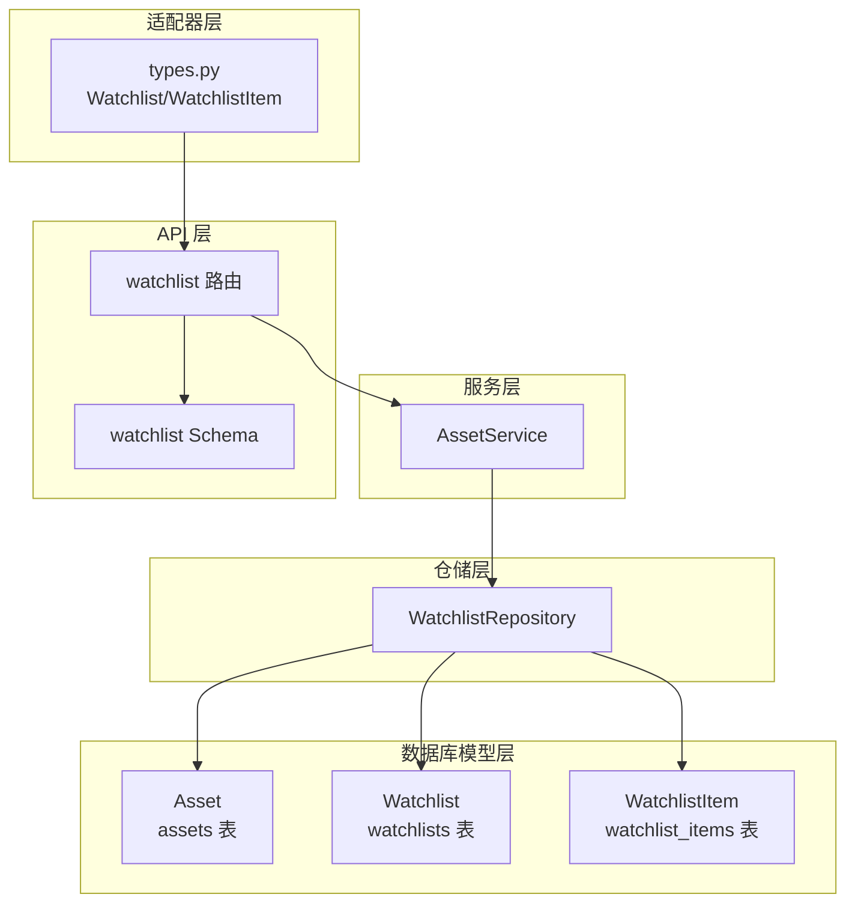
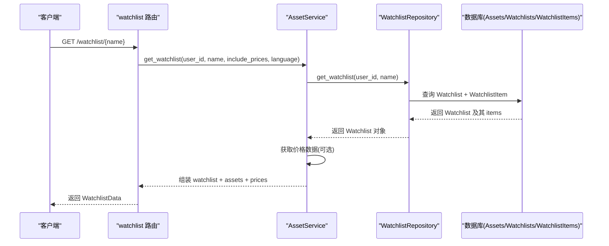
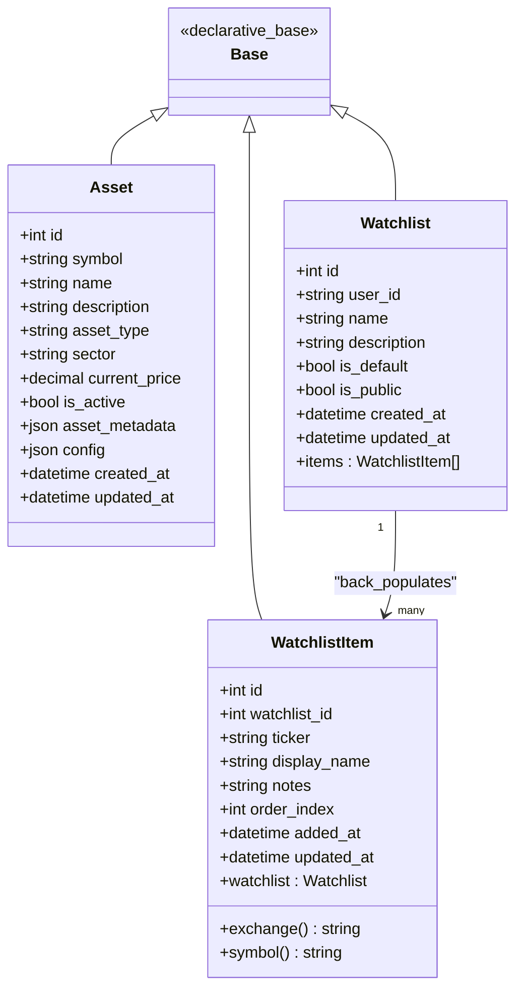

# 资产与自选股模型

<cite>
**本文引用的文件**
- [python/valuecell/server/db/models/asset.py](file://python/valuecell/server/db/models/asset.py)
- [python/valuecell/server/db/models/watchlist.py](file://python/valuecell/server/db/models/watchlist.py)
- [python/valuecell/server/db/models/base.py](file://python/valuecell/server/db/models/base.py)
- [python/valuecell/server/db/repositories/watchlist_repository.py](file://python/valuecell/server/db/repositories/watchlist_repository.py)
- [python/valuecell/server/services/assets/asset_service.py](file://python/valuecell/server/services/assets/asset_service.py)
- [python/valuecell/server/api/routers/watchlist.py](file://python/valuecell/server/api/routers/watchlist.py)
- [python/valuecell/server/api/schemas/watchlist.py](file://python/valuecell/server/api/schemas/watchlist.py)
- [python/valuecell/adapters/assets/types.py](file://python/valuecell/adapters/assets/types.py)
</cite>

## 目录
1. [简介](#简介)
2. [项目结构](#项目结构)
3. [核心组件](#核心组件)
4. [架构总览](#架构总览)
5. [详细组件分析](#详细组件分析)
6. [依赖关系分析](#依赖关系分析)
7. [性能考量](#性能考量)
8. [故障排查指南](#故障排查指南)
9. [结论](#结论)
10. [附录：典型用例与路径参考](#附录典型用例与路径参考)

## 简介
本文件系统性梳理 ValueCell 中“资产与自选股”模型的设计与实现，围绕以下目标展开：
- 资产模型（Asset）：symbol（资产标识符，格式为 EXCHANGE:SYMBOL）、asset_type（资产类型）、current_price（实时价格）等关键字段及其索引策略。
- 自选股模型（Watchlist）：user_id（用户归属）、is_default（默认列表）、is_public（公开状态）等属性。
- WatchlistItem 模型：通过外键关联实现股票条目管理；利用 ticker 字段的“EXCHANGE:SYMBOL”格式支持多市场资产；unique constraint（用户+名称）防止重复命名。
- 典型用例：添加股票到自选股、查询用户关注列表、提取交易所/符号信息。

## 项目结构
围绕资产与自选股的核心代码分布在如下层次：
- 数据库模型层：定义表结构、索引与唯一约束
- 仓储层：封装数据库操作，处理事务与约束冲突
- 服务层：聚合业务逻辑，提供国际化与价格数据集成
- API 层：对外暴露路由与请求/响应模型
- 适配器层：内存态 Watchlist 结构与工具方法（用于演示与测试）

图表来源
- [python/valuecell/server/db/models/asset.py](file://python/valuecell/server/db/models/asset.py#L1-L128)
- [python/valuecell/server/db/models/watchlist.py](file://python/valuecell/server/db/models/watchlist.py#L1-L196)
- [python/valuecell/server/db/repositories/watchlist_repository.py](file://python/valuecell/server/db/repositories/watchlist_repository.py#L1-L501)
- [python/valuecell/server/services/assets/asset_service.py](file://python/valuecell/server/services/assets/asset_service.py#L1-L706)
- [python/valuecell/server/api/routers/watchlist.py](file://python/valuecell/server/api/routers/watchlist.py#L1-L580)
- [python/valuecell/server/api/schemas/watchlist.py](file://python/valuecell/server/api/schemas/watchlist.py#L1-L202)
- [python/valuecell/adapters/assets/types.py](file://python/valuecell/adapters/assets/types.py#L254-L328)

章节来源
- [python/valuecell/server/db/models/asset.py](file://python/valuecell/server/db/models/asset.py#L1-L128)
- [python/valuecell/server/db/models/watchlist.py](file://python/valuecell/server/db/models/watchlist.py#L1-L196)
- [python/valuecell/server/db/repositories/watchlist_repository.py](file://python/valuecell/server/db/repositories/watchlist_repository.py#L1-L501)
- [python/valuecell/server/services/assets/asset_service.py](file://python/valuecell/server/services/assets/asset_service.py#L1-L706)
- [python/valuecell/server/api/routers/watchlist.py](file://python/valuecell/server/api/routers/watchlist.py#L1-L580)
- [python/valuecell/server/api/schemas/watchlist.py](file://python/valuecell/server/api/schemas/watchlist.py#L1-L202)
- [python/valuecell/adapters/assets/types.py](file://python/valuecell/adapters/assets/types.py#L254-L328)

## 核心组件
- 资产模型（Asset）
  - 关键字段：symbol（唯一索引）、asset_type（索引）、current_price、is_active、asset_metadata、config 等。
  - 设计要点：统一使用“EXCHANGE:SYMBOL”的 symbol 格式，便于跨市场识别；为 symbol 与 asset_type 建立索引以提升查询效率。
- 自选股模型（Watchlist）
  - 关键属性：user_id（索引）、name、description、is_default、is_public、created_at/updated_at。
  - 唯一约束：UniqueConstraint("user_id","name")，防止同一用户重复命名。
- WatchlistItem
  - 外键：watchlist_id -> watchlists.id（级联删除），确保列表删除时子项同步清理。
  - 关键字段：ticker（“EXCHANGE:SYMBOL”）、display_name、notes、order_index、added_at/updated_at。
  - 唯一约束：UniqueConstraint("watchlist_id","ticker")，防止同一列表中重复添加同一只股票。
  - 辅助属性：exchange、symbol，从 ticker 解析出交易所与符号。

章节来源
- [python/valuecell/server/db/models/asset.py](file://python/valuecell/server/db/models/asset.py#L1-L128)
- [python/valuecell/server/db/models/watchlist.py](file://python/valuecell/server/db/models/watchlist.py#L1-L196)

## 架构总览
下图展示了从 API 到数据库的调用链路与数据流，体现“路由 -> 服务 -> 仓储 -> 模型”的分层职责。

图表来源
- [python/valuecell/server/api/routers/watchlist.py](file://python/valuecell/server/api/routers/watchlist.py#L218-L302)
- [python/valuecell/server/services/assets/asset_service.py](file://python/valuecell/server/services/assets/asset_service.py#L543-L625)
- [python/valuecell/server/db/repositories/watchlist_repository.py](file://python/valuecell/server/db/repositories/watchlist_repository.py#L76-L105)

章节来源
- [python/valuecell/server/api/routers/watchlist.py](file://python/valuecell/server/api/routers/watchlist.py#L1-L580)
- [python/valuecell/server/services/assets/asset_service.py](file://python/valuecell/server/services/assets/asset_service.py#L543-L625)
- [python/valuecell/server/db/repositories/watchlist_repository.py](file://python/valuecell/server/db/repositories/watchlist_repository.py#L1-L501)

## 详细组件分析

### 资产模型（Asset）
- 字段设计与索引
  - symbol：唯一索引，格式为“EXCHANGE:SYMBOL”，便于跨市场唯一标识。
  - asset_type：索引，便于按资产类型过滤。
  - current_price：数值型，存储实时价格。
  - is_active：布尔标志，控制资产是否可用。
  - asset_metadata/config：JSON 字段，扩展元数据与配置。
- 复杂度与性能
  - 唯一索引保证 symbol 的全局唯一性，插入/更新时触发唯一约束检查。
  - 对 asset_type 建立索引，有利于按类型检索。
- 错误处理
  - 当 symbol 冲突或类型非法时，数据库层会抛出完整性异常，上层应捕获并返回友好错误。

章节来源
- [python/valuecell/server/db/models/asset.py](file://python/valuecell/server/db/models/asset.py#L1-L128)

### 自选股模型（Watchlist）
- 字段与约束
  - user_id：索引，按用户维度快速筛选。
  - name：配合 user_id 构成唯一约束，避免重名。
  - is_default/is_public：布尔标志，分别表示默认列表与公开状态。
- 默认列表策略
  - 创建/更新默认列表时，仓储层会将该用户的其他默认标记置为 false，确保唯一默认。

章节来源
- [python/valuecell/server/db/models/watchlist.py](file://python/valuecell/server/db/models/watchlist.py#L1-L103)
- [python/valuecell/server/db/repositories/watchlist_repository.py](file://python/valuecell/server/db/repositories/watchlist_repository.py#L31-L75)

### WatchlistItem 模型与外键关联
- 外键关系
  - watchlist_id -> watchlists.id（级联删除），保证父表删除时子项自动清理。
- 唯一约束
  - UniqueConstraint("watchlist_id","ticker")，防止同一列表重复添加相同 ticker。
- 辅助属性
  - exchange/symbol：从 ticker 解析出交易所与符号，便于前端展示与过滤。
- 排序与顺序
  - order_index：用于维护用户自定义排序；查询时按升序排列。

章节来源
- [python/valuecell/server/db/models/watchlist.py](file://python/valuecell/server/db/models/watchlist.py#L105-L196)
- [python/valuecell/server/db/repositories/watchlist_repository.py](file://python/valuecell/server/db/repositories/watchlist_repository.py#L222-L303)

### 服务层与仓储层协作
- WatchlistRepository
  - 提供创建、查询、删除、增删改查 WatchlistItem 等操作。
  - 在添加资产时，若未指定 display_name，则尝试从 Assets 表回填显示名；若未指定 order_index，则基于当前列表长度自动生成。
  - 对于默认列表的设置，采用原子更新策略，避免并发导致的多重默认。
- AssetService
  - 聚合 watchlist 数据与价格数据，按语言进行本地化。
  - 将数据库对象转换为 API 响应模型，包含 items 的 display_name、added_at、order、notes 等。

章节来源
- [python/valuecell/server/db/repositories/watchlist_repository.py](file://python/valuecell/server/db/repositories/watchlist_repository.py#L1-L501)
- [python/valuecell/server/services/assets/asset_service.py](file://python/valuecell/server/services/assets/asset_service.py#L543-L625)

### API 路由与请求/响应模型
- 路由能力
  - 搜索资产、获取资产详情、获取实时/历史价格、获取/创建/删除自选股列表、添加/移除资产、更新备注等。
- 请求/响应模型
  - WatchlistData、WatchlistItemData、CreateWatchlistRequest、AddAssetRequest、UpdateAssetNotesRequest 等，均对 ticker 的“EXCHANGE:SYMBOL”格式进行约束与校验。
- 用法要点
  - 获取 watchlist 时可选择是否包含价格；支持语言参数进行本地化展示。

章节来源
- [python/valuecell/server/api/routers/watchlist.py](file://python/valuecell/server/api/routers/watchlist.py#L1-L580)
- [python/valuecell/server/api/schemas/watchlist.py](file://python/valuecell/server/api/schemas/watchlist.py#L1-L202)

### 适配器层（内存态 Watchlist）
- 作用
  - 提供内存态的 Watchlist/WatchlistItem 结构，便于在无数据库场景下演示与测试。
- 关键行为
  - 添加/移除资产、重排顺序、查找默认列表等。

章节来源
- [python/valuecell/adapters/assets/types.py](file://python/valuecell/adapters/assets/types.py#L254-L328)

## 依赖关系分析

图表来源
- [python/valuecell/server/db/models/base.py](file://python/valuecell/server/db/models/base.py#L1-L11)
- [python/valuecell/server/db/models/asset.py](file://python/valuecell/server/db/models/asset.py#L1-L128)
- [python/valuecell/server/db/models/watchlist.py](file://python/valuecell/server/db/models/watchlist.py#L1-L196)

章节来源
- [python/valuecell/server/db/models/base.py](file://python/valuecell/server/db/models/base.py#L1-L11)
- [python/valuecell/server/db/models/asset.py](file://python/valuecell/server/db/models/asset.py#L1-L128)
- [python/valuecell/server/db/models/watchlist.py](file://python/valuecell/server/db/models/watchlist.py#L1-L196)

## 性能考量
- 索引策略
  - Asset.symbol：唯一索引，保证插入/去重高效。
  - Asset.asset_type：索引，加速按类型过滤。
  - Watchlist.user_id：索引，加速按用户查询。
  - WatchlistItem.watchlist_id、ticker：联合唯一约束，避免重复添加。
- 查询优化
  - 仓储层在查询 watchlist 时会预加载 items，减少 N+1 查询风险。
  - 服务层按 order_index 排序，避免额外排序开销。
- 并发与一致性
  - 设置默认 watchlist 时，先更新其他默认标记再写入新默认，降低竞态概率。
  - 添加/删除 watchlist_item 使用事务包裹，失败回滚，保持一致性。

[本节为通用建议，不直接分析具体文件]

## 故障排查指南
- “重复命名”错误
  - 现象：创建 watchlist 报错。
  - 原因：同一用户已存在同名 watchlist。
  - 处理：修改名称或删除旧列表后重试。
  - 参考
    - [python/valuecell/server/db/repositories/watchlist_repository.py](file://python/valuecell/server/db/repositories/watchlist_repository.py#L31-L75)
- “重复添加股票”错误
  - 现象：添加同一 ticker 到同一 watchlist 失败。
  - 原因：watchlist_items 的唯一约束触发。
  - 处理：先移除再添加，或更换 watchlist。
  - 参考
    - [python/valuecell/server/db/models/watchlist.py](file://python/valuecell/server/db/models/watchlist.py#L166-L170)
- “找不到 watchlist 或资产”
  - 现象：查询/添加/删除返回未找到。
  - 处理：确认 user_id、watchlist_name、ticker 是否正确；检查 is_default 标记。
  - 参考
    - [python/valuecell/server/api/routers/watchlist.py](file://python/valuecell/server/api/routers/watchlist.py#L218-L302)
    - [python/valuecell/server/db/repositories/watchlist_repository.py](file://python/valuecell/server/db/repositories/watchlist_repository.py#L222-L303)

章节来源
- [python/valuecell/server/db/repositories/watchlist_repository.py](file://python/valuecell/server/db/repositories/watchlist_repository.py#L31-L75)
- [python/valuecell/server/db/models/watchlist.py](file://python/valuecell/server/db/models/watchlist.py#L166-L170)
- [python/valuecell/server/api/routers/watchlist.py](file://python/valuecell/server/api/routers/watchlist.py#L218-L302)

## 结论
本模型以“EXCHANGE:SYMBOL”统一资产标识，结合数据库索引与唯一约束，实现了跨市场的资产识别与自选股管理。通过仓储层的事务与一致性保障、服务层的价格与本地化聚合，以及 API 层清晰的请求/响应模型，整体具备良好的扩展性与可维护性。建议在生产环境中：
- 严格遵循 ticker 格式规范；
- 合理使用默认列表与公开状态；
- 在高并发场景下注意默认列表切换的原子性；
- 对 watchlist_item 的 order_index 进行有序维护，避免频繁重排。

[本节为总结性内容，不直接分析具体文件]

## 附录：典型用例与路径参考

- 添加股票到自选股
  - 路由：POST /watchlist/asset
  - 请求体：AddAssetRequest（包含 ticker、watchlist_name、notes 等）
  - 服务流程：服务层调用仓储层添加 item；若未提供 display_name，尝试从资产表回填；若未提供 order_index，按当前数量自动生成。
  - 参考
    - [python/valuecell/server/api/routers/watchlist.py](file://python/valuecell/server/api/routers/watchlist.py#L345-L382)
    - [python/valuecell/server/db/repositories/watchlist_repository.py](file://python/valuecell/server/db/repositories/watchlist_repository.py#L222-L303)

- 查询用户关注列表
  - 路由：GET /watchlist/{watchlist_name}
  - 功能：返回 watchlist 详情，可选择是否包含价格；支持语言参数。
  - 参考
    - [python/valuecell/server/api/routers/watchlist.py](file://python/valuecell/server/api/routers/watchlist.py#L218-L302)
    - [python/valuecell/server/services/assets/asset_service.py](file://python/valuecell/server/services/assets/asset_service.py#L543-L625)

- 提取交易所/符号信息
  - 方法：WatchlistItem.exchange、WatchlistItem.symbol（从 ticker 解析）
  - 参考
    - [python/valuecell/server/db/models/watchlist.py](file://python/valuecell/server/db/models/watchlist.py#L187-L196)

- 查询用户所有 watchlist
  - 路由：GET /watchlist/
  - 功能：返回用户所有 watchlist 的简要信息（名称、描述、默认/公开状态、数量等）
  - 参考
    - [python/valuecell/server/api/routers/watchlist.py](file://python/valuecell/server/api/routers/watchlist.py#L180-L217)
    - [python/valuecell/server/services/assets/asset_service.py](file://python/valuecell/server/services/assets/asset_service.py#L627-L661)

- 移除股票
  - 路由：DELETE /watchlist/asset/{ticker}
  - 功能：从指定 watchlist（或默认）移除某只股票
  - 参考
    - [python/valuecell/server/api/routers/watchlist.py](file://python/valuecell/server/api/routers/watchlist.py#L384-L421)
    - [python/valuecell/server/db/repositories/watchlist_repository.py](file://python/valuecell/server/db/repositories/watchlist_repository.py#L304-L354)

- 更新备注
  - 路由：PUT /watchlist/asset/{ticker}/notes
  - 功能：更新 watchlist 中某只股票的备注
  - 参考
    - [python/valuecell/server/api/routers/watchlist.py](file://python/valuecell/server/api/routers/watchlist.py#L456-L498)
    - [python/valuecell/server/db/repositories/watchlist_repository.py](file://python/valuecell/server/db/repositories/watchlist_repository.py#L429-L483)