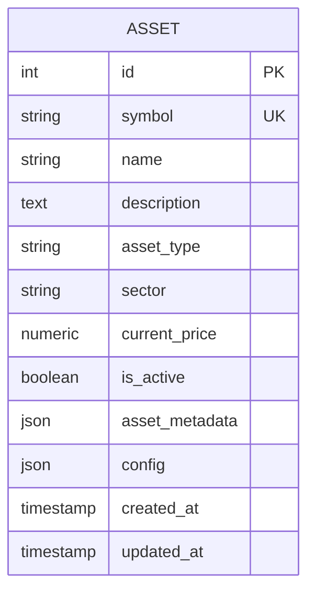
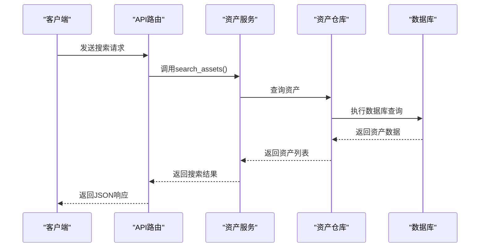

# 资产模型

<cite>
**本文档引用的文件**   
- [asset.py](file://python/valuecell/server/db/models/asset.py)
- [asset_repository.py](file://python/valuecell/server/db/repositories/asset_repository.py)
- [asset_service.py](file://python/valuecell/server/services/assets/asset_service.py)
- [watchlist.py](file://python/valuecell/server/api/routers/watchlist.py)
- [types.py](file://python/valuecell/adapters/assets/types.py)
- [init_db.py](file://python/valuecell/server/db/init_db.py)
- [connection.py](file://python/valuecell/server/db/connection.py)
- [settings.py](file://python/valuecell/server/config/settings.py)
- [base.py](file://python/valuecell/server/db/models/base.py)
</cite>

## 目录
1. [简介](#简介)
2. [核心字段设计](#核心字段设计)
3. [数据精度与金融计算](#数据精度与金融计算)
4. [状态与时间戳管理](#状态与时间戳管理)
5. [扩展属性与配置](#扩展属性与配置)
6. [序列化与工厂方法](#序列化与工厂方法)
7. [查询与筛选功能](#查询与筛选功能)
8. [索引与数据库策略](#索引与数据库策略)

## 简介
资产模型是ValueCell系统中用于表示金融资产的核心数据结构。该模型设计用于存储股票、债券、加密货币及其他投资工具的详细信息。模型采用EXCHANGE:SYMBOL格式作为唯一标识符，支持多交易所资产的统一管理，并通过JSON字段存储扩展属性与配置参数，实现了高度的灵活性和可扩展性。

**Section sources**
- [asset.py](file://python/valuecell/server/db/models/asset.py#L1-L21)

## 核心字段设计

资产模型的核心字段设计旨在提供全面的资产分类与标识能力。symbol字段采用EXCHANGE:SYMBOL格式（如NASDAQ:MSFT、CRYPTO:BTC），作为资产的唯一标识符，确保了跨交易所资产的精确区分。该字段被设置为唯一约束并建立了数据库索引，以保证数据的完整性和查询效率。

asset_type字段用于定义资产类型，如股票(stock)、加密货币(crypto)、交易所交易基金(etf)和指数(index)等，为系统提供了基础的资产分类能力。sector字段则用于存储股票所属的行业板块信息，便于按行业进行资产筛选和分析。

**Section sources**
- [asset.py](file://python/valuecell/server/db/models/asset.py#L28-L55)
- [types.py](file://python/valuecell/adapters/assets/types.py#L16-L32)

## 数据精度与金融计算

current_price字段用于存储资产的实时市场价格，其数据精度设置为Numeric(precision=20, scale=8)。这种高精度数值类型能够精确表示从大型股票市值到微小加密货币价格的广泛数值范围，确保了金融计算的准确性。20位的总精度和8位的小数位数足以处理绝大多数金融场景，包括高价值资产的微小价格变动和低价值加密货币的精确计价。

**Diagram sources **
- [asset.py](file://python/valuecell/server/db/models/asset.py#L26-L92)

## 状态与时间戳管理

is_active状态字段用于标识资产是否处于活跃状态，是资产管理中的关键机制。该字段默认值为True，表示资产默认为可用状态。通过将is_active设置为False，系统可以逻辑删除或停用资产，而无需从数据库中物理移除记录，这有助于保持数据历史的完整性并支持资产的重新激活。

created_at和updated_at时间戳字段实现了自动生成逻辑。created_at字段在记录创建时自动设置为当前时间，而updated_at字段在记录创建和每次更新时都会自动更新为当前时间。这种机制通过数据库的server_default和onupdate参数实现，确保了时间戳的准确性和一致性，无需在应用层进行手动管理。

**Section sources**
- [asset.py](file://python/valuecell/server/db/models/asset.py#L64-L92)
- [base.py](file://python/valuecell/server/db/models/base.py#L3-L6)
- [connection.py](file://python/valuecell/server/db/connection.py#L5-L10)

## 扩展属性与配置

asset_metadata和config字段均使用JSON类型存储数据，为系统提供了强大的扩展能力。asset_metadata字段用于存储资产的附加元数据，如ISIN、CUSIP、基本面数据等，这些信息通常由数据源提供，用于丰富资产的描述信息。config字段则用于存储资产特定的配置参数，支持为不同资产设置个性化的处理规则和行为。

这种设计模式使得系统能够在不修改数据库结构的情况下，灵活地添加新的属性和配置选项，极大地提高了系统的可维护性和适应性。JSON字段的使用也简化了与外部API的数据交换，因为许多金融数据API都以JSON格式返回数据。

**Section sources**
- [asset.py](file://python/valuecell/server/db/models/asset.py#L72-L81)

## 序列化与工厂方法

to_dict()方法实现了资产对象的序列化功能，将模型实例转换为字典表示。该方法将所有字段转换为适当的格式，例如将Decimal类型的current_price转换为float，将DateTime类型的created_at和updated_at转换为ISO格式的字符串。这使得资产数据可以轻松地被序列化为JSON，便于通过API传输或在前端显示。

from_config()工厂方法提供了一种从配置数据创建资产实例的便捷方式。该方法接受一个包含资产信息的字典，并使用这些数据初始化一个新的Asset对象。这种工厂模式简化了资产的创建过程，特别是在从配置文件或API响应中批量创建资产时，提高了代码的可读性和可维护性。

**Section sources**
- [asset.py](file://python/valuecell/server/db/models/asset.py#L97-L127)

## 查询与筛选功能

系统提供了多种查询和筛选资产的功能。通过AssetRepository的get_all_assets()方法，可以查询所有资产，并可选择性地根据is_active状态进行过滤。upsert_asset()方法则实现了创建或更新资产的逻辑，如果资产已存在则更新其信息，否则创建新资产。

在服务层，AssetService提供了更高级的搜索功能，支持通过查询字符串、资产类型、交易所和国家等条件进行搜索。API路由watchlist.py暴露了这些功能，允许通过HTTP请求查询特定交易所的股票或筛选活跃资产。例如，可以通过`/watchlist/asset/search?q=AAPL&exchanges=NASDAQ`这样的API端点来搜索纳斯达克交易所的AAPL股票。

**Diagram sources **
- [asset_repository.py](file://python/valuecell/server/db/repositories/asset_repository.py#L139-L169)
- [asset_service.py](file://python/valuecell/server/services/assets/asset_service.py#L38-L124)
- [watchlist.py](file://python/valuecell/server/api/routers/watchlist.py#L38-L96)

## 索引与数据库策略

数据库策略通过多种机制确保了资产数据的高效访问和完整性。symbol字段上的唯一索引防止了重复资产的创建，而asset_type和is_active字段上的索引则优化了基于类型和状态的查询性能。数据库初始化脚本(init_db.py)负责创建所有表和索引，确保了数据库结构的一致性。

系统使用SQLite作为默认数据库，数据库文件存储在系统应用目录中，如macOS的`~/Library/Application Support/ValueCell/valuecell.db`。数据库连接通过DatabaseManager类进行管理，该类使用连接池和会话工厂来高效地处理数据库操作。这种设计确保了数据库操作的线程安全性和性能。

**Section sources**
- [asset.py](file://python/valuecell/server/db/models/asset.py#L30-L34)
- [init_db.py](file://python/valuecell/server/db/init_db.py#L139-L237)
- [settings.py](file://python/valuecell/server/config/settings.py#L21-L31)
- [connection.py](file://python/valuecell/server/db/connection.py#L13-L22)