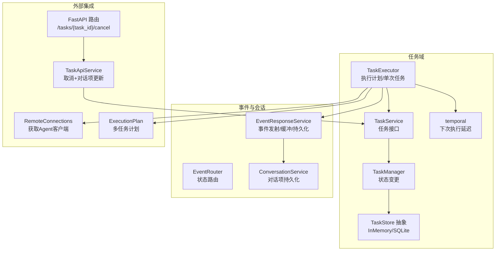
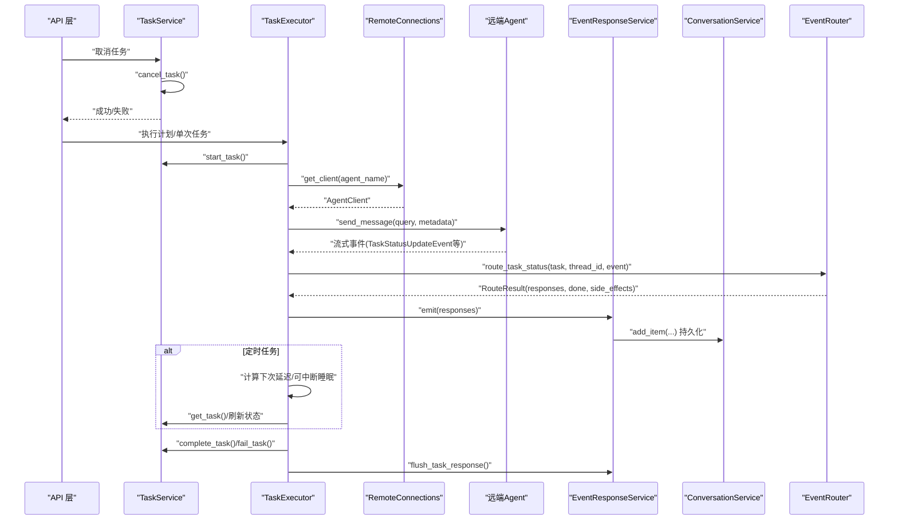
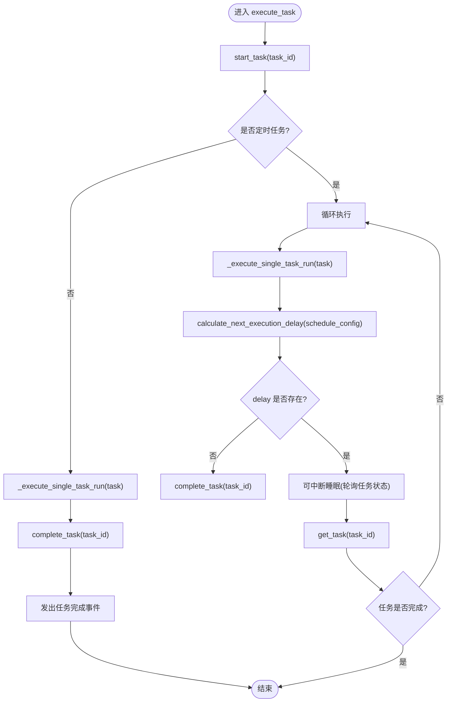
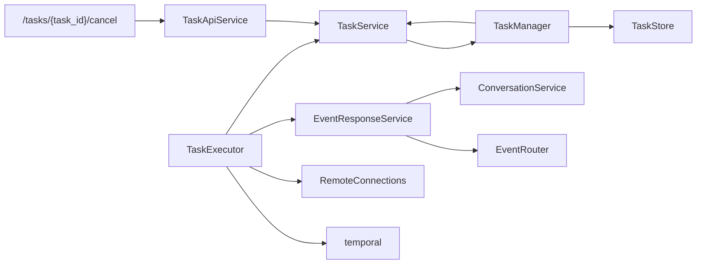

# 任务服务

<cite>
**本文引用的文件**
- [service.py](file://python/valuecell/core/task/service.py)
- [executor.py](file://python/valuecell/core/task/executor.py)
- [models.py](file://python/valuecell/core/task/models.py)
- [manager.py](file://python/valuecell/core/task/manager.py)
- [temporal.py](file://python/valuecell/core/task/temporal.py)
- [task_store.py](file://python/valuecell/core/task/task_store.py)
- [event_service.py](file://python/valuecell/core/event/service.py)
- [conversation_service.py](file://python/valuecell/core/conversation/service.py)
- [connect.py](file://python/valuecell/core/agent/connect.py)
- [router.py](file://python/valuecell/core/event/router.py)
- [task.py](file://python/valuecell/server/api/routers/task.py)
- [task_service.py](file://python/valuecell/server/services/task_service.py)
- [models.py](file://python/valuecell/core/plan/models.py)
- [test_executor.py](file://python/valuecell/core/task/tests/test_executor.py)
- [test_service_unit.py](file://python/valuecell/core/task/tests/test_service_unit.py)
- [test_manager.py](file://python/valuecell/core/task/tests/test_manager.py)
</cite>

## 目录
1. [简介](#简介)
2. [项目结构](#项目结构)
3. [核心组件](#核心组件)
4. [架构总览](#架构总览)
5. [详细组件分析](#详细组件分析)
6. [依赖关系分析](#依赖关系分析)
7. [性能考量](#性能考量)
8. [故障排查指南](#故障排查指南)
9. [结论](#结论)
10. [附录](#附录)

## 简介
本文件深入解析 ValueCell 中的 TaskService 异步任务调度架构，覆盖任务的创建、分发、执行状态跟踪与结果回调机制；解释 TaskService 与核心 TaskExecutor 的协作方式，以及如何处理数据获取、模型推理与交易执行等后台任务；梳理任务队列管理策略、优先级调度算法与失败重试逻辑；给出从 API 请求到最终状态更新的完整生命周期示例；阐述服务的可扩展性设计与事件通知机制，并提供高并发场景下的性能优化建议。

## 项目结构
围绕任务调度的核心模块分布如下：
- 核心模型与状态：Task、TaskStatus、ScheduleConfig、TaskPattern
- 任务管理器：TaskManager（封装 TaskStore，提供状态变更）
- 任务服务：TaskService（对外暴露任务操作接口）
- 执行器：TaskExecutor（执行计划与单次任务，驱动事件流）
- 存储层：TaskStore 抽象与 InMemory/SQLite 实现
- 时间调度：temporal（计算下次执行延迟）
- 事件系统：EventResponseService、EventRouter（路由任务状态更新）
- 会话服务：ConversationService（持久化对话项）
- 远程代理连接：RemoteConnections（获取 Agent 客户端）
- 计划模型：ExecutionPlan（将用户请求拆分为多任务）

图表来源
- [service.py](file://python/valuecell/core/task/service.py#L1-L68)
- [executor.py](file://python/valuecell/core/task/executor.py#L1-L454)
- [manager.py](file://python/valuecell/core/task/manager.py#L1-L96)
- [task_store.py](file://python/valuecell/core/task/task_store.py#L1-L322)
- [temporal.py](file://python/valuecell/core/task/temporal.py#L1-L52)
- [event_service.py](file://python/valuecell/core/event/service.py#L1-L81)
- [router.py](file://python/valuecell/core/event/router.py#L1-L170)
- [conversation_service.py](file://python/valuecell/core/conversation/service.py#L1-L161)
- [connect.py](file://python/valuecell/core/agent/connect.py#L1-L674)
- [task.py](file://python/valuecell/server/api/routers/task.py#L1-L43)
- [task_service.py](file://python/valuecell/server/services/task_service.py#L1-L100)
- [models.py](file://python/valuecell/core/plan/models.py#L1-L87)

章节来源
- [service.py](file://python/valuecell/core/task/service.py#L1-L68)
- [executor.py](file://python/valuecell/core/task/executor.py#L1-L454)
- [manager.py](file://python/valuecell/core/task/manager.py#L1-L96)
- [task_store.py](file://python/valuecell/core/task/task_store.py#L1-L322)
- [temporal.py](file://python/valuecell/core/task/temporal.py#L1-L52)
- [event_service.py](file://python/valuecell/core/event/service.py#L1-L81)
- [router.py](file://python/valuecell/core/event/router.py#L1-L170)
- [conversation_service.py](file://python/valuecell/core/conversation/service.py#L1-L161)
- [connect.py](file://python/valuecell/core/agent/connect.py#L1-L674)
- [task.py](file://python/valuecell/server/api/routers/task.py#L1-L43)
- [task_service.py](file://python/valuecell/server/services/task_service.py#L1-L100)
- [models.py](file://python/valuecell/core/plan/models.py#L1-L87)

## 核心组件
- TaskService：对外暴露任务管理接口，委托 TaskManager 完成状态变更与查询；提供启动、完成、失败、取消、按会话批量取消、查询列表等能力。
- TaskExecutor：负责执行 ExecutionPlan 中的任务序列，逐个 Task 执行；对一次性任务直接执行，对定时任务循环执行并等待下一次延迟；在执行过程中通过 EventResponseService 发出消息、推理、工具调用、组件生成等事件，并根据 EventRouter 对任务状态更新进行路由与副作用处理。
- TaskManager：轻量任务管理器，提供并发安全的状态变更（开始、完成、失败、取消），并支持按会话批量取消未完成任务。
- TaskStore：抽象存储接口，提供保存、加载、删除、列表查询与存在性检查；默认 InMemory 实现，生产环境可替换为 SQLite 实现以获得持久化。
- EventResponseService：统一事件发射入口，负责事件注解、缓冲与持久化；提供按任务上下文强制刷新缓冲的能力。
- EventRouter：将远端 Agent 返回的任务状态更新事件转换为本地响应事件，并在必要时触发副作用（如标记任务失败）。
- ConversationService：将事件持久化为对话项，支持更新已存在的任务组件状态。
- RemoteConnections：管理远程 Agent 客户端连接，提供获取客户端的能力，用于向远端代理发送消息。
- ExecutionPlan：将用户请求拆分为多个 Task，每个 Task 指定目标 Agent、执行模式与可选的定时配置。

章节来源
- [service.py](file://python/valuecell/core/task/service.py#L1-L68)
- [executor.py](file://python/valuecell/core/task/executor.py#L1-L454)
- [manager.py](file://python/valuecell/core/task/manager.py#L1-L96)
- [task_store.py](file://python/valuecell/core/task/task_store.py#L1-L322)
- [event_service.py](file://python/valuecell/core/event/service.py#L1-L81)
- [router.py](file://python/valuecell/core/event/router.py#L1-L170)
- [conversation_service.py](file://python/valuecell/core/conversation/service.py#L1-L161)
- [connect.py](file://python/valuecell/core/agent/connect.py#L1-L674)
- [models.py](file://python/valuecell/core/plan/models.py#L1-L87)

## 架构总览
TaskExecutor 在执行任务时，遵循以下流程：
- 更新任务状态为运行中
- 获取远端 Agent 客户端并发送消息
- 流式接收远端返回的事件
- 使用 EventRouter 将状态更新事件转换为本地响应事件
- 通过 EventResponseService 注解、缓冲并持久化事件
- 对于定时任务，计算下一次执行延迟并可中断等待；完成后标记任务完成并发出完成事件

图表来源
- [executor.py](file://python/valuecell/core/task/executor.py#L1-L454)
- [event_service.py](file://python/valuecell/core/event/service.py#L1-L81)
- [router.py](file://python/valuecell/core/event/router.py#L1-L170)
- [conversation_service.py](file://python/valuecell/core/conversation/service.py#L1-L161)
- [connect.py](file://python/valuecell/core/agent/connect.py#L1-L674)
- [service.py](file://python/valuecell/core/task/service.py#L1-L68)

## 详细组件分析

### TaskService：任务接口与状态门面
- 提供 update_task、start_task、complete_task、fail_task、cancel_task、cancel_conversation_tasks、get_task、list_tasks 等方法
- 内部持有 TaskManager，所有状态变更均通过 TaskManager 完成，保证一致性与并发安全
- 支持按会话、用户、状态、分页查询任务列表

章节来源
- [service.py](file://python/valuecell/core/task/service.py#L1-L68)
- [manager.py](file://python/valuecell/core/task/manager.py#L1-L96)

### TaskExecutor：执行引擎与事件编排
- execute_plan：按 ExecutionPlan 顺序执行任务，支持引导消息、子代理对话组件的开始/结束阶段
- execute_task：一次性任务直接执行；定时任务循环执行并在每次迭代后计算下一次延迟，支持可中断睡眠
- _execute_single_task_run：获取 Agent 客户端、发送消息、流式消费事件、路由状态更新、收集定时任务结果、发出完成事件
- ScheduledTaskResultAccumulator：定时任务结果聚合器，仅对 MESSAGE_CHUNK 事件累积内容，最终生成结果组件
- _sleep_with_cancellation：带取消能力的睡眠，周期性刷新任务状态，若任务已完成则提前退出

图表来源
- [executor.py](file://python/valuecell/core/task/executor.py#L1-L454)
- [temporal.py](file://python/valuecell/core/task/temporal.py#L1-L52)

章节来源
- [executor.py](file://python/valuecell/core/task/executor.py#L1-L454)
- [temporal.py](file://python/valuecell/core/task/temporal.py#L1-L52)

### TaskManager：状态变更与批处理
- 并发安全：使用 asyncio.Lock 保护内存状态
- 状态变更原子性：开始、完成、失败、取消均在锁内读取任务、校验状态、更新并持久化
- 批量取消：按会话过滤未完成任务并统一标记取消

章节来源
- [manager.py](file://python/valuecell/core/task/manager.py#L1-L96)

### 任务存储：TaskStore 抽象与实现
- InMemoryTaskStore：字典存储，适合测试与简单场景
- SQLiteTaskStore：基于 aiosqlite 的异步持久化，首次使用自动建表与索引；支持复杂字段序列化/反序列化

章节来源
- [task_store.py](file://python/valuecell/core/task/task_store.py#L1-L322)

### 事件系统与对话持久化
- EventResponseService：统一事件发射入口，先注解再缓冲，最后持久化到对话项
- EventRouter：将远端任务状态更新事件映射为本地响应事件；当远端报告失败时，返回副作用要求标记任务失败
- ConversationService：将事件持久化为对话项，支持更新已存在任务组件状态

章节来源
- [event_service.py](file://python/valuecell/core/event/service.py#L1-L81)
- [router.py](file://python/valuecell/core/event/router.py#L1-L170)
- [conversation_service.py](file://python/valuecell/core/conversation/service.py#L1-L161)

### 远程代理连接与客户端
- RemoteConnections：按 Agent 名称加载卡片、建立 HTTP 客户端、可选启动监听器；提供并发控制与重试初始化
- 用于 TaskExecutor 获取远端 Agent 客户端并发送消息

章节来源
- [connect.py](file://python/valuecell/core/agent/connect.py#L1-L674)
- [executor.py](file://python/valuecell/core/task/executor.py#L1-L454)

### 计划与任务模型
- ExecutionPlan：包含 plan_id、conversation_id、user_id、orig_query、tasks 列表与可选 guidance_message
- Task：包含 task_id、query、conversation_id、thread_id、user_id、agent_name、status、pattern、schedule_config、时间戳与错误信息等
- ScheduleConfig：支持按分钟间隔或每日固定时间两种定时方式

章节来源
- [models.py](file://python/valuecell/core/plan/models.py#L1-L87)
- [models.py](file://python/valuecell/core/task/models.py#L1-L149)

### API 集成与取消流程
- FastAPI 路由 /tasks/{task_id}/cancel：调用 TaskApiService 取消任务并同步更新对话中的定时控制器组件状态
- TaskApiService：通过 TaskService 取消任务，再扫描对话项中匹配的定时控制器组件并更新其状态字段

章节来源
- [task.py](file://python/valuecell/server/api/routers/task.py#L1-L43)
- [task_service.py](file://python/valuecell/server/services/task_service.py#L1-L100)
- [service.py](file://python/valuecell/core/task/service.py#L1-L68)

## 依赖关系分析
- TaskService 依赖 TaskManager；TaskManager 依赖 TaskStore（默认 InMemory，可替换为 SQLite）
- TaskExecutor 依赖 TaskService、EventResponseService、ConversationService、RemoteConnections、temporal
- EventResponseService 依赖 EventRouter 与 ConversationService
- API 层通过 TaskApiService 协调 TaskService 与对话项更新

图表来源
- [service.py](file://python/valuecell/core/task/service.py#L1-L68)
- [manager.py](file://python/valuecell/core/task/manager.py#L1-L96)
- [task_store.py](file://python/valuecell/core/task/task_store.py#L1-L322)
- [executor.py](file://python/valuecell/core/task/executor.py#L1-L454)
- [event_service.py](file://python/valuecell/core/event/service.py#L1-L81)
- [router.py](file://python/valuecell/core/event/router.py#L1-L170)
- [conversation_service.py](file://python/valuecell/core/conversation/service.py#L1-L161)
- [connect.py](file://python/valuecell/core/agent/connect.py#L1-L674)
- [temporal.py](file://python/valuecell/core/task/temporal.py#L1-L52)
- [task.py](file://python/valuecell/server/api/routers/task.py#L1-L43)
- [task_service.py](file://python/valuecell/server/services/task_service.py#L1-L100)

## 性能考量
- 并发安全：TaskManager 使用 asyncio.Lock 保护状态变更，避免竞态；RemoteConnections 使用 per-agent 锁防止并发启动同一 Agent
- 异步 I/O：SQLiteTaskStore 使用 aiosqlite，避免阻塞事件循环；EventResponseService 使用缓冲与批量持久化减少写入次数
- 可中断睡眠：定时任务的等待采用可中断睡眠，周期性检查任务状态，降低无效等待
- 事件流控：EventResponseService 的缓冲与批处理有助于平滑事件输出，减少 UI 压力
- 重试与退避：RemoteConnections 初始化客户端时具备有限重试与指数退避，提升连接稳定性
- 数据库索引：SQLiteTaskStore 为常用查询字段建立索引，提高列表查询效率

[本节为通用指导，不直接分析具体文件]

## 故障排查指南
- 任务无法启动
  - 检查 TaskManager.start_task 的前置条件（必须是 PENDING 状态）
  - 确认 TaskStore 是否正确保存任务
- 任务状态未更新
  - 检查 EventRouter 是否正确路由远端状态更新事件
  - 确认 EventResponseService 是否成功持久化事件
- 定时任务未按预期重试
  - 检查 ScheduleConfig 配置是否有效（interval_minutes 或 daily_time）
  - 确认 calculate_next_execution_delay 返回值
  - 查看 _sleep_with_cancellation 是否被提前退出
- 取消任务后 UI 状态不同步
  - 检查 TaskApiService 是否正确扫描并更新定时控制器组件
  - 确认 ConversationService 是否成功持久化更新后的对话项

章节来源
- [manager.py](file://python/valuecell/core/task/manager.py#L1-L96)
- [router.py](file://python/valuecell/core/event/router.py#L1-L170)
- [event_service.py](file://python/valuecell/core/event/service.py#L1-L81)
- [temporal.py](file://python/valuecell/core/task/temporal.py#L1-L52)
- [task_service.py](file://python/valuecell/server/services/task_service.py#L1-L100)

## 结论
该任务调度架构以 TaskService 为门面、TaskExecutor 为核心执行器，结合事件系统与会话持久化，实现了从任务创建、分发、执行到状态跟踪与结果回调的完整闭环。通过 TaskManager 的并发安全与 TaskStore 的可插拔存储，系统具备良好的扩展性与可靠性。定时任务的延迟计算与可中断睡眠确保了资源的有效利用。API 层与对话项的联动进一步完善了用户体验。整体设计兼顾了可维护性与性能，在高并发场景下仍能保持稳定运行。

[本节为总结，不直接分析具体文件]

## 附录

### 任务生命周期示例（从 API 请求到最终状态更新）
- 用户通过 /tasks/{task_id}/cancel 触发取消
- TaskApiService 调用 TaskService.cancel_task
- 若任务处于定时状态，TaskExecutor 在下一次循环前检测任务状态并提前退出
- 任务完成后，TaskExecutor 调用 TaskService.complete_task 并发出完成事件
- EventResponseService 将事件持久化到对话项，ConversationService 更新对应组件状态

章节来源
- [task.py](file://python/valuecell/server/api/routers/task.py#L1-L43)
- [task_service.py](file://python/valuecell/server/services/task_service.py#L1-L100)
- [service.py](file://python/valuecell/core/task/service.py#L1-L68)
- [executor.py](file://python/valuecell/core/task/executor.py#L1-L454)
- [event_service.py](file://python/valuecell/core/event/service.py#L1-L81)
- [conversation_service.py](file://python/valuecell/core/conversation/service.py#L1-L161)

### 可扩展性设计
- 新增任务类型
  - 在计划阶段定义新的 TaskPattern 或扩展 ScheduleConfig 字段
  - 在 EventRouter 中增加对新事件类型的路由分支
  - 在 EventResponseService 中扩展持久化逻辑
- 新增存储后端
  - 实现 TaskStore 接口并注入到 TaskManager
  - 确保序列化/反序列化与索引策略满足查询需求
- 新增 Agent
  - 在 RemoteConnections 中注册 Agent 卡片，TaskExecutor 通过 get_client 自动连接

章节来源
- [models.py](file://python/valuecell/core/plan/models.py#L1-L87)
- [router.py](file://python/valuecell/core/event/router.py#L1-L170)
- [event_service.py](file://python/valuecell/core/event/service.py#L1-L81)
- [task_store.py](file://python/valuecell/core/task/task_store.py#L1-L322)
- [connect.py](file://python/valuecell/core/agent/connect.py#L1-L674)

### 优先级调度与失败重试
- 优先级调度
  - 当前实现未显式支持任务优先级；可通过在 TaskManager 外层引入队列与调度器实现优先级排队
- 失败重试
  - RemoteConnections 初始化客户端时具备有限重试与退避
  - TaskExecutor 在执行过程中捕获异常并标记失败，随后通过 ConversationService 同步更新对话项状态

章节来源
- [connect.py](file://python/valuecell/core/agent/connect.py#L1-L674)
- [executor.py](file://python/valuecell/core/task/executor.py#L1-L454)
- [conversation_service.py](file://python/valuecell/core/conversation/service.py#L1-L161)

### 高并发场景性能优化建议
- 使用 SQLiteTaskStore 替代 InMemoryTaskStore 以获得持久化与更好的并发隔离
- 合理设置 DEFAULT_EXECUTION_POLL_INTERVAL 与 calculate_next_execution_delay，避免过短轮询
- 对 EventResponseService 的缓冲大小与批量写入频率进行调优
- 对 RemoteConnections 的线程池大小与客户端重试策略进行评估

章节来源
- [task_store.py](file://python/valuecell/core/task/task_store.py#L1-L322)
- [executor.py](file://python/valuecell/core/task/executor.py#L1-L454)
- [connect.py](file://python/valuecell/core/agent/connect.py#L1-L674)