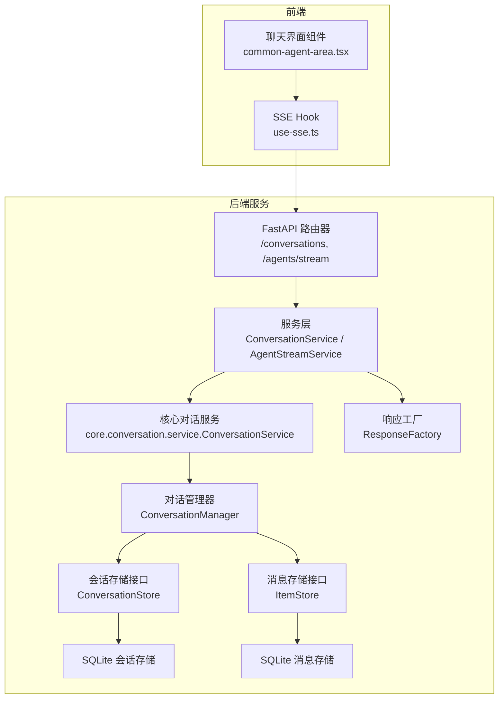
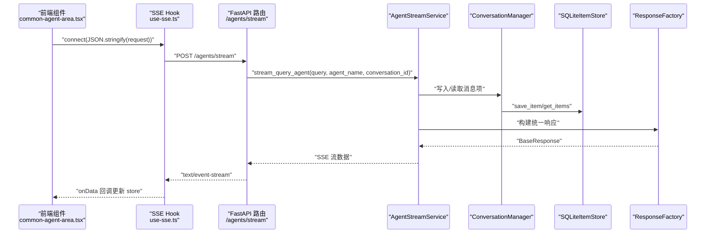
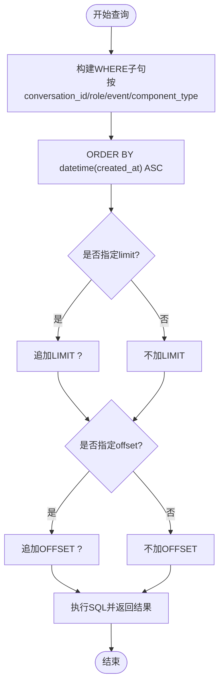
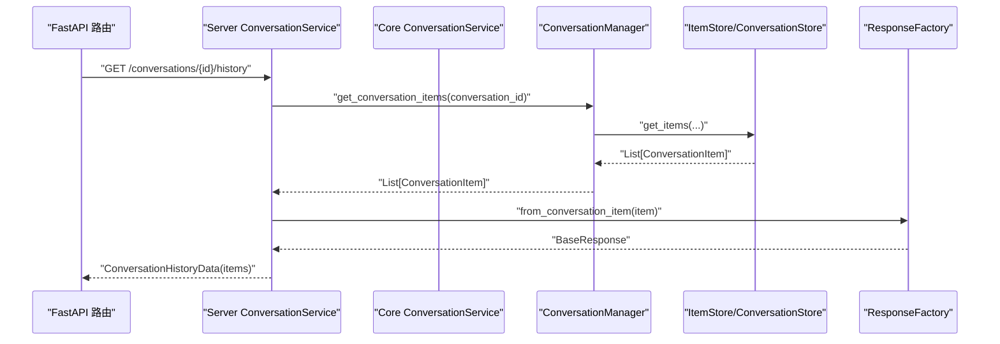
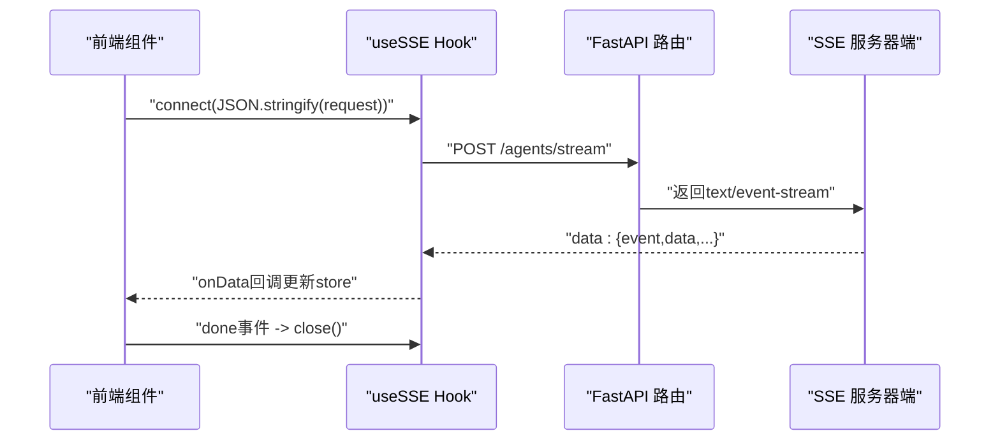
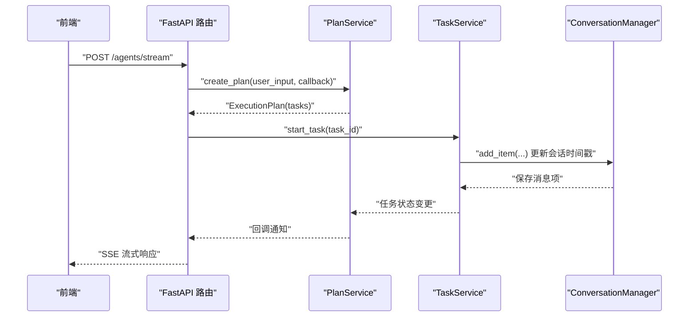
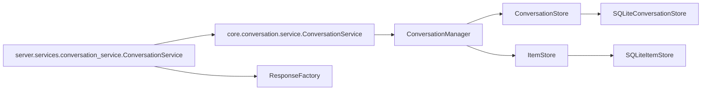

# 对话服务

<cite>
**本文引用的文件**
- [python/valuecell/core/conversation/service.py](file://python/valuecell/core/conversation/service.py)
- [python/valuecell/core/conversation/manager.py](file://python/valuecell/core/conversation/manager.py)
- [python/valuecell/core/conversation/models.py](file://python/valuecell/core/conversation/models.py)
- [python/valuecell/core/conversation/conversation_store.py](file://python/valuecell/core/conversation/conversation_store.py)
- [python/valuecell/core/conversation/item_store.py](file://python/valuecell/core/conversation/item_store.py)
- [python/valuecell/server/services/conversation_service.py](file://python/valuecell/server/services/conversation_service.py)
- [python/valuecell/server/api/routers/conversation.py](file://python/valuecell/server/api/routers/conversation.py)
- [python/valuecell/server/api/routers/agent_stream.py](file://python/valuecell/server/api/routers/agent_stream.py)
- [python/valuecell/core/event/factory.py](file://python/valuecell/core/event/factory.py)
- [python/valuecell/core/plan/service.py](file://python/valuecell/core/plan/service.py)
- [python/valuecell/core/task/service.py](file://python/valuecell/core/task/service.py)
- [python/valuecell/server/main.py](file://python/valuecell/server/main.py)
- [frontend/src/app/agent/components/agent-view/common-agent-area.tsx](file://frontend/src/app/agent/components/agent-view/common-agent-area.tsx)
- [frontend/src/hooks/use-sse.ts](file://frontend/src/hooks/use-sse.ts)
</cite>

## 目录
1. [简介](#简介)
2. [项目结构](#项目结构)
3. [核心组件](#核心组件)
4. [架构总览](#架构总览)
5. [详细组件分析](#详细组件分析)
6. [依赖关系分析](#依赖关系分析)
7. [性能考量](#性能考量)
8. [故障排查指南](#故障排查指南)
9. [结论](#结论)
10. [附录](#附录)

## 简介
本文件系统性地文档化对话服务（ConversationService）的职责与实现，重点覆盖：
- 对话上下文管理：会话状态维护、激活/停用、等待用户输入标记
- 消息存储与检索：消息项持久化、分页查询、按角色/事件/组件类型过滤
- 实时流式传输：后端通过SSE向前端推送消息，前端使用SSE客户端接收并渲染
- 历史记录与结果聚合：历史列表、任务结果汇总、策略结果聚合
- 与PlanService和TaskService的集成：解析自然语言指令、生成执行计划、调度任务
- 性能优化：缓存策略、分页加载、索引优化、异步I/O

## 项目结构
后端采用FastAPI + aiosqlite的异步架构，对话数据分为两层：
- 元数据层：会话信息（创建时间、更新时间、状态等）
- 内容层：消息项（角色、事件、负载、元数据等）



图表来源
- [python/valuecell/server/api/routers/conversation.py](file://python/valuecell/server/api/routers/conversation.py#L1-L148)
- [python/valuecell/server/api/routers/agent_stream.py](file://python/valuecell/server/api/routers/agent_stream.py#L1-L64)
- [python/valuecell/server/services/conversation_service.py](file://python/valuecell/server/services/conversation_service.py#L1-L345)
- [python/valuecell/core/conversation/service.py](file://python/valuecell/core/conversation/service.py#L1-L161)
- [python/valuecell/core/conversation/manager.py](file://python/valuecell/core/conversation/manager.py#L1-L307)
- [python/valuecell/core/conversation/conversation_store.py](file://python/valuecell/core/conversation/conversation_store.py#L1-L240)
- [python/valuecell/core/conversation/item_store.py](file://python/valuecell/core/conversation/item_store.py#L1-L273)
- [python/valuecell/core/event/factory.py](file://python/valuecell/core/event/factory.py#L1-L640)
- [frontend/src/app/agent/components/agent-view/common-agent-area.tsx](file://frontend/src/app/agent/components/agent-view/common-agent-area.tsx#L84-L171)
- [frontend/src/hooks/use-sse.ts](file://frontend/src/hooks/use-sse.ts#L1-L91)

章节来源
- [python/valuecell/server/api/routers/conversation.py](file://python/valuecell/server/api/routers/conversation.py#L1-L148)
- [python/valuecell/server/api/routers/agent_stream.py](file://python/valuecell/server/api/routers/agent_stream.py#L1-L64)
- [python/valuecell/server/services/conversation_service.py](file://python/valuecell/server/services/conversation_service.py#L1-L345)
- [python/valuecell/core/conversation/service.py](file://python/valuecell/core/conversation/service.py#L1-L161)
- [python/valuecell/core/conversation/manager.py](file://python/valuecell/core/conversation/manager.py#L1-L307)
- [python/valuecell/core/conversation/conversation_store.py](file://python/valuecell/core/conversation/conversation_store.py#L1-L240)
- [python/valuecell/core/conversation/item_store.py](file://python/valuecell/core/conversation/item_store.py#L1-L273)
- [python/valuecell/core/event/factory.py](file://python/valuecell/core/event/factory.py#L1-L640)
- [frontend/src/app/agent/components/agent-view/common-agent-area.tsx](file://frontend/src/app/agent/components/agent-view/common-agent-area.tsx#L84-L171)
- [frontend/src/hooks/use-sse.ts](file://frontend/src/hooks/use-sse.ts#L1-L91)

## 核心组件
- ConversationService（核心层）：对外暴露会话操作，委托给ConversationManager
- ConversationManager：协调会话元数据与消息项，提供创建、查询、更新、删除、状态变更等能力
- ConversationStore/SQLiteConversationStore：会话元数据的抽象与SQLite实现
- ItemStore/SQLiteItemStore：消息项的抽象与SQLite实现
- Server ConversationService（服务层）：对接HTTP API，负责历史查询、列表分页、策略结果聚合、删除会话
- ResponseFactory：从持久化的ConversationItem重建统一响应模型，供前端渲染
- 前端SSE：前端通过use-sse.ts连接后端SSE流，接收实时消息并更新UI

章节来源
- [python/valuecell/core/conversation/service.py](file://python/valuecell/core/conversation/service.py#L1-L161)
- [python/valuecell/core/conversation/manager.py](file://python/valuecell/core/conversation/manager.py#L1-L307)
- [python/valuecell/core/conversation/conversation_store.py](file://python/valuecell/core/conversation/conversation_store.py#L1-L240)
- [python/valuecell/core/conversation/item_store.py](file://python/valuecell/core/conversation/item_store.py#L1-L273)
- [python/valuecell/server/services/conversation_service.py](file://python/valuecell/server/services/conversation_service.py#L1-L345)
- [python/valuecell/core/event/factory.py](file://python/valuecell/core/event/factory.py#L1-L640)

## 架构总览
后端通过FastAPI路由暴露会话API；服务层调用核心对话服务与存储层，完成历史查询、列表分页、结果聚合与删除；前端通过SSE实时接收后端流式输出。



图表来源
- [python/valuecell/server/api/routers/agent_stream.py](file://python/valuecell/server/api/routers/agent_stream.py#L1-L64)
- [python/valuecell/server/services/conversation_service.py](file://python/valuecell/server/services/conversation_service.py#L1-L345)
- [python/valuecell/core/conversation/manager.py](file://python/valuecell/core/conversation/manager.py#L1-L307)
- [python/valuecell/core/conversation/item_store.py](file://python/valuecell/core/conversation/item_store.py#L1-L273)
- [python/valuecell/core/event/factory.py](file://python/valuecell/core/event/factory.py#L1-L640)
- [frontend/src/app/agent/components/agent-view/common-agent-area.tsx](file://frontend/src/app/agent/components/agent-view/common-agent-area.tsx#L84-L171)
- [frontend/src/hooks/use-sse.ts](file://frontend/src/hooks/use-sse.ts#L1-L91)

## 详细组件分析

### 会话状态与生命周期管理
- 状态枚举：ACTIVE、INACTIVE、REQUIRE_USER_INPUT
- 生命周期方法：activate/deactivate、require_user_input、set_status
- 更新时间戳：每次状态变更或新增消息都会更新updated_at

```mermaid
classDiagram
class Conversation {
+string conversation_id
+string user_id
+string title
+string agent_name
+datetime created_at
+datetime updated_at
+ConversationStatus status
+is_active() bool
+activate() void
+deactivate() void
+require_user_input() void
+set_status(status) void
+touch() void
}
class ConversationStatus {
<<enumeration>>
"active"
"inactive"
"require_user_input"
}
class ConversationManager {
+create_conversation(...)
+get_conversation(id)
+update_conversation(conversation)
+delete_conversation(id)
+list_user_conversations(user_id, limit, offset)
+conversation_exists(id)
+activate_conversation(id)
+deactivate_conversation(id)
+require_user_input(id)
+set_conversation_status(id, status)
+get_conversation_items(...)
+get_latest_item(id)
+get_item(id)
+get_item_count(id)
+update_task_component_status(task_id, status, error_reason)
}
ConversationManager --> Conversation : "管理"
```

图表来源
- [python/valuecell/core/conversation/models.py](file://python/valuecell/core/conversation/models.py#L1-L65)
- [python/valuecell/core/conversation/manager.py](file://python/valuecell/core/conversation/manager.py#L1-L307)

章节来源
- [python/valuecell/core/conversation/models.py](file://python/valuecell/core/conversation/models.py#L1-L65)
- [python/valuecell/core/conversation/manager.py](file://python/valuecell/core/conversation/manager.py#L1-L307)

### 消息存储与检索（含分页与过滤）
- 存储接口：ItemStore抽象，SQLiteItemStore实现
- 字段：item_id、role、event、conversation_id、thread_id、task_id、payload、agent_name、metadata、created_at
- 查询能力：按conversation_id、role、event、component_type过滤，支持limit/offset分页
- 索引：为conversation_id和created_at建立索引，提升排序与分页性能



图表来源
- [python/valuecell/core/conversation/item_store.py](file://python/valuecell/core/conversation/item_store.py#L190-L232)

章节来源
- [python/valuecell/core/conversation/item_store.py](file://python/valuecell/core/conversation/item_store.py#L1-L273)

### 历史记录与结果聚合（服务层）
- 会话历史：按conversation_id获取所有消息项，重建统一响应对象，排除特定任务结果
- 任务结果：筛选component_type为“scheduled_task_result”的消息项
- 全部会话的任务结果：按agent_name分组，统计最新更新时间
- 列表过滤：排除策略类Agent产生的会话（如PromptBasedStrategyAgent、GridStrategyAgent）



图表来源
- [python/valuecell/server/services/conversation_service.py](file://python/valuecell/server/services/conversation_service.py#L138-L205)
- [python/valuecell/core/event/factory.py](file://python/valuecell/core/event/factory.py#L72-L198)

章节来源
- [python/valuecell/server/services/conversation_service.py](file://python/valuecell/server/services/conversation_service.py#L53-L205)
- [python/valuecell/core/event/factory.py](file://python/valuecell/core/event/factory.py#L72-L198)

### 前端API交互与WebSocket/SSE连接管理
- SSE连接：前端通过use-sse.ts连接后端“/agents/stream”，发送请求体包含query、agent_name、conversation_id
- 数据处理：onData回调中更新全局store，根据事件类型触发导航、刷新列表、错误提示、关闭连接等
- 连接生命周期：open/error/close回调日志记录，done事件自动关闭连接



图表来源
- [frontend/src/app/agent/components/agent-view/common-agent-area.tsx](file://frontend/src/app/agent/components/agent-view/common-agent-area.tsx#L84-L171)
- [frontend/src/hooks/use-sse.ts](file://frontend/src/hooks/use-sse.ts#L1-L91)
- [python/valuecell/server/api/routers/agent_stream.py](file://python/valuecell/server/api/routers/agent_stream.py#L1-L64)

章节来源
- [frontend/src/app/agent/components/agent-view/common-agent-area.tsx](file://frontend/src/app/agent/components/agent-view/common-agent-area.tsx#L84-L171)
- [frontend/src/hooks/use-sse.ts](file://frontend/src/hooks/use-sse.ts#L1-L91)
- [python/valuecell/server/api/routers/agent_stream.py](file://python/valuecell/server/api/routers/agent_stream.py#L1-L64)

### 与PlanService和TaskService的集成
- 计划阶段：PlanService根据用户输入生成ExecutionPlan，必要时注册用户输入请求，等待用户确认
- 执行阶段：TaskService管理任务生命周期（启动、完成、失败、取消），并与对话上下文关联
- 会话联动：ConversationManager在添加消息项时更新会话updated_at，保持会话活跃度



图表来源
- [python/valuecell/core/plan/service.py](file://python/valuecell/core/plan/service.py#L1-L148)
- [python/valuecell/core/task/service.py](file://python/valuecell/core/task/service.py#L1-L68)
- [python/valuecell/core/conversation/manager.py](file://python/valuecell/core/conversation/manager.py#L1-L307)

章节来源
- [python/valuecell/core/plan/service.py](file://python/valuecell/core/plan/service.py#L1-L148)
- [python/valuecell/core/task/service.py](file://python/valuecell/core/task/service.py#L1-L68)
- [python/valuecell/core/conversation/manager.py](file://python/valuecell/core/conversation/manager.py#L1-L307)

## 依赖关系分析
- 低耦合高内聚：核心对话服务仅依赖管理器；服务层依赖核心服务与存储；前端仅依赖SSE Hook与路由
- 外部依赖：aiosqlite用于异步数据库访问；loguru用于日志；FastAPI用于API定义
- 可替换性：ConversationStore/ItemStore均为抽象接口，可替换为内存实现或SQLite实现



图表来源
- [python/valuecell/core/conversation/service.py](file://python/valuecell/core/conversation/service.py#L1-L161)
- [python/valuecell/core/conversation/manager.py](file://python/valuecell/core/conversation/manager.py#L1-L307)
- [python/valuecell/core/conversation/conversation_store.py](file://python/valuecell/core/conversation/conversation_store.py#L1-L240)
- [python/valuecell/core/conversation/item_store.py](file://python/valuecell/core/conversation/item_store.py#L1-L273)
- [python/valuecell/server/services/conversation_service.py](file://python/valuecell/server/services/conversation_service.py#L1-L345)
- [python/valuecell/core/event/factory.py](file://python/valuecell/core/event/factory.py#L1-L640)

章节来源
- [python/valuecell/core/conversation/service.py](file://python/valuecell/core/conversation/service.py#L1-L161)
- [python/valuecell/core/conversation/manager.py](file://python/valuecell/core/conversation/manager.py#L1-L307)
- [python/valuecell/core/conversation/conversation_store.py](file://python/valuecell/core/conversation/conversation_store.py#L1-L240)
- [python/valuecell/core/conversation/item_store.py](file://python/valuecell/core/conversation/item_store.py#L1-L273)
- [python/valuecell/server/services/conversation_service.py](file://python/valuecell/server/services/conversation_service.py#L1-L345)
- [python/valuecell/core/event/factory.py](file://python/valuecell/core/event/factory.py#L1-L640)

## 性能考量
- 异步I/O：aiosqlite非阻塞访问，避免主线程阻塞
- 分页与索引：SQLiteItemStore对conversation_id+created_at建立索引，支持高效分页与排序
- 缓存策略：当前为SQLite持久化；可在高频读场景引入轻量缓存（如最近N条消息）减少重复查询
- 大数据量加载：建议按conversation_id分页拉取，避免一次性加载全部消息；前端按需懒加载
- 任务状态更新：update_task_component_status通过JSON字段更新，注意payload与metadata的序列化开销

章节来源
- [python/valuecell/core/conversation/item_store.py](file://python/valuecell/core/conversation/item_store.py#L130-L170)
- [python/valuecell/core/conversation/manager.py](file://python/valuecell/core/conversation/manager.py#L236-L288)

## 故障排查指南
- 会话不存在：服务层在历史查询前校验会话存在性，不存在抛出异常
- 删除失败：删除会话时捕获异常并返回deleted=False
- 任务状态更新失败：在update_task_component_status中捕获异常并记录警告日志
- SSE连接问题：前端use-sse.ts提供onOpen/onError/onClose回调，便于定位连接问题

章节来源
- [python/valuecell/server/services/conversation_service.py](file://python/valuecell/server/services/conversation_service.py#L282-L299)
- [python/valuecell/core/conversation/manager.py](file://python/valuecell/core/conversation/manager.py#L236-L288)
- [frontend/src/hooks/use-sse.ts](file://frontend/src/hooks/use-sse.ts#L1-L91)

## 结论
对话服务通过清晰的分层设计实现了会话状态管理、消息持久化与检索、历史聚合与实时流式传输。结合PlanService与TaskService，系统能够将自然语言指令转化为可执行计划并跟踪任务状态，最终以统一响应模型反馈到前端。SQLite异步存储与索引优化保证了在大数据量下的可扩展性；SSE机制提供了流畅的实时体验。后续可在缓存与分页策略上进一步优化，以满足更高并发与更长历史记录的场景。

## 附录
- 启动入口：uvicorn运行FastAPI应用，支持控制台停止命令
- API路由：/conversations（列表/历史/删除）、/agents/stream（SSE流）

章节来源
- [python/valuecell/server/main.py](file://python/valuecell/server/main.py#L1-L99)
- [python/valuecell/server/api/routers/conversation.py](file://python/valuecell/server/api/routers/conversation.py#L1-L148)
- [python/valuecell/server/api/routers/agent_stream.py](file://python/valuecell/server/api/routers/agent_stream.py#L1-L64)