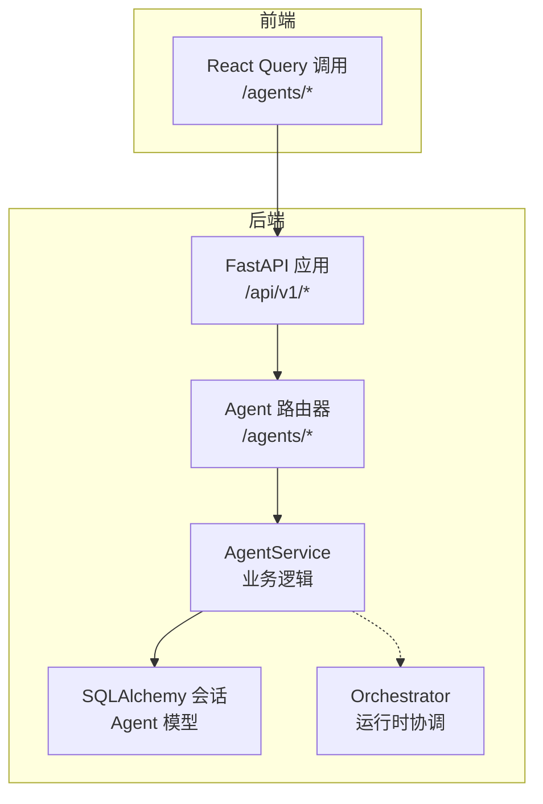
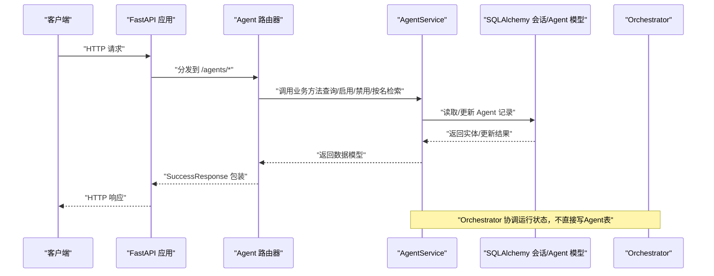
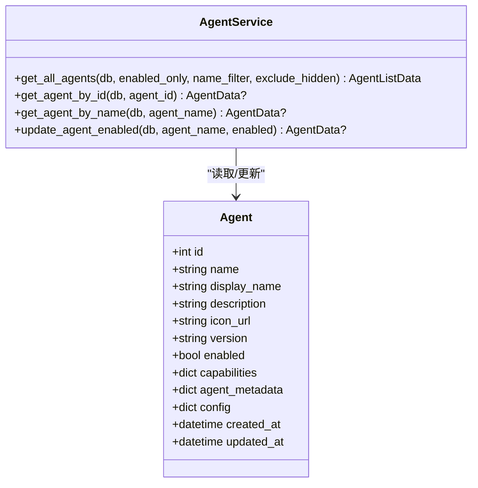
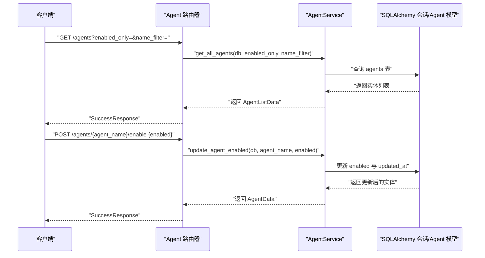
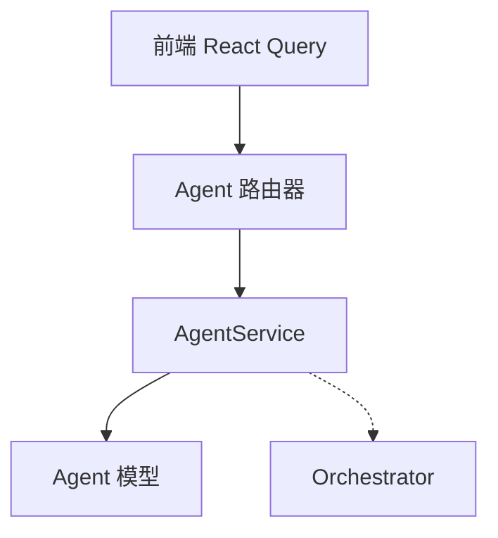

# 智能体服务

<cite>
**本文引用的文件**
- [python/valuecell/server/services/agent_service.py](file://python/valuecell/server/services/agent_service.py)
- [python/valuecell/server/db/models/agent.py](file://python/valuecell/server/db/models/agent.py)
- [python/valuecell/server/api/routers/agent.py](file://python/valuecell/server/api/routers/agent.py)
- [python/valuecell/server/api/schemas/agent.py](file://python/valuecell/server/api/schemas/agent.py)
- [python/valuecell/core/coordinate/orchestrator.py](file://python/valuecell/core/coordinate/orchestrator.py)
- [python/valuecell/server/api/app.py](file://python/valuecell/server/api/app.py)
- [python/valuecell/server/main.py](file://python/valuecell/server/main.py)
- [python/valuecell/server/services/user_profile_service.py](file://python/valuecell/server/services/user_profile_service.py)
- [python/valuecell/server/db/README.md](file://python/valuecell/server/db/README.md)
- [frontend/src/api/agent.ts](file://frontend/src/api/agent.ts)
</cite>

## 目录
1. [简介](#简介)
2. [项目结构](#项目结构)
3. [核心组件](#核心组件)
4. [架构总览](#架构总览)
5. [详细组件分析](#详细组件分析)
6. [依赖分析](#依赖分析)
7. [性能考虑](#性能考虑)
8. [故障排查指南](#故障排查指南)
9. [结论](#结论)
10. [附录](#附录)

## 简介
本文件深入解析后端智能体服务（AgentService）的实现细节，重点阐述其在智能体生命周期管理中的核心作用：包括智能体的查询、启用/禁用、按名称或ID检索等业务逻辑；AgentService如何与数据库中的Agent模型交互；以及如何通过核心Orchestrator协调智能体的运行状态；同时给出REST API请求从路由层到服务层的调用序列，并说明异常处理机制与性能优化策略（如状态缓存思路），以及与UserProfileService的集成关系（用于用户个性化配置的持久化）。

## 项目结构
- 后端采用FastAPI作为Web框架，路由层负责接收HTTP请求并进行参数校验与异常处理，随后调用服务层（AgentService）执行业务逻辑。
- 服务层通过SQLAlchemy会话访问数据库模型（Agent），完成智能体信息的读取与更新。
- 核心Orchestrator负责协调规划、执行与持久化，是系统中智能体运行状态的中枢，但不直接操作Agent表，而是通过对话、事件、任务等服务协作。
- 前端通过React Query调用后端API，实现智能体列表、详情与启用状态切换等功能。

图表来源
- [python/valuecell/server/api/app.py](file://python/valuecell/server/api/app.py#L190-L239)
- [python/valuecell/server/api/routers/agent.py](file://python/valuecell/server/api/routers/agent.py#L22-L179)
- [python/valuecell/server/services/agent_service.py](file://python/valuecell/server/services/agent_service.py#L15-L202)
- [python/valuecell/server/db/models/agent.py](file://python/valuecell/server/db/models/agent.py#L15-L131)
- [python/valuecell/core/coordinate/orchestrator.py](file://python/valuecell/core/coordinate/orchestrator.py#L68-L102)

章节来源
- [python/valuecell/server/api/app.py](file://python/valuecell/server/api/app.py#L190-L239)
- [python/valuecell/server/api/routers/agent.py](file://python/valuecell/server/api/routers/agent.py#L22-L179)
- [python/valuecell/server/services/agent_service.py](file://python/valuecell/server/services/agent_service.py#L15-L202)
- [python/valuecell/server/db/models/agent.py](file://python/valuecell/server/db/models/agent.py#L15-L131)
- [python/valuecell/core/coordinate/orchestrator.py](file://python/valuecell/core/coordinate/orchestrator.py#L68-L102)

## 核心组件
- AgentService：封装智能体相关的业务逻辑，包括查询、启用/禁用、按名称/ID检索等。
- Agent模型：定义数据库表结构及字段，包含智能体的基础信息、能力、元数据、配置与时间戳。
- Agent路由器：定义REST接口，负责参数校验、异常处理与响应包装。
- Orchestrator：系统运行时协调者，负责规划、执行与持久化，间接影响智能体的可用性与运行状态。
- UserProfileService：用户个性化配置的持久化服务，与AgentService无直接耦合，但可共同支撑用户视角下的智能体体验。

章节来源
- [python/valuecell/server/services/agent_service.py](file://python/valuecell/server/services/agent_service.py#L15-L202)
- [python/valuecell/server/db/models/agent.py](file://python/valuecell/server/db/models/agent.py#L15-L131)
- [python/valuecell/server/api/routers/agent.py](file://python/valuecell/server/api/routers/agent.py#L22-L179)
- [python/valuecell/core/coordinate/orchestrator.py](file://python/valuecell/core/coordinate/orchestrator.py#L68-L102)
- [python/valuecell/server/services/user_profile_service.py](file://python/valuecell/server/services/user_profile_service.py#L1-L256)

## 架构总览
下图展示了从API路由到服务层、数据库模型与核心Orchestrator之间的交互关系。

图表来源
- [python/valuecell/server/api/app.py](file://python/valuecell/server/api/app.py#L190-L239)
- [python/valuecell/server/api/routers/agent.py](file://python/valuecell/server/api/routers/agent.py#L22-L179)
- [python/valuecell/server/services/agent_service.py](file://python/valuecell/server/services/agent_service.py#L15-L202)
- [python/valuecell/server/db/models/agent.py](file://python/valuecell/server/db/models/agent.py#L15-L131)
- [python/valuecell/core/coordinate/orchestrator.py](file://python/valuecell/core/coordinate/orchestrator.py#L68-L102)

## 详细组件分析

### AgentService：智能体生命周期管理的核心
- 查询所有智能体：支持按启用状态、名称模糊匹配过滤，隐藏默认未启用的特定智能体，返回统计信息。
- 按ID查询：根据主键检索智能体详情。
- 按名称查询：根据唯一标识检索智能体详情。
- 更新启用状态：根据名称更新enabled字段并刷新更新时间戳，返回更新后的智能体数据。

图表来源
- [python/valuecell/server/services/agent_service.py](file://python/valuecell/server/services/agent_service.py#L15-L202)
- [python/valuecell/server/db/models/agent.py](file://python/valuecell/server/db/models/agent.py#L15-L131)

章节来源
- [python/valuecell/server/services/agent_service.py](file://python/valuecell/server/services/agent_service.py#L15-L202)
- [python/valuecell/server/db/models/agent.py](file://python/valuecell/server/db/models/agent.py#L15-L131)

### 数据模型：Agent
- 字段覆盖基础信息、状态、能力、元数据、配置与时间戳。
- 提供字典转换与从配置构造实例的方法，便于序列化与初始化。

章节来源
- [python/valuecell/server/db/models/agent.py](file://python/valuecell/server/db/models/agent.py#L15-L131)

### 路由层：REST API 到 AgentService 的调用链
- GET /agents：列出智能体，支持enabled_only与name_filter参数，内部调用AgentService.get_all_agents。
- GET /agents/{agent_id}：按ID获取智能体详情，内部调用AgentService.get_agent_by_id。
- GET /agents/by-name/{agent_name}：按名称获取智能体详情，内部调用AgentService.get_agent_by_name。
- POST /agents/{agent_name}/enable：更新智能体启用状态，内部调用AgentService.update_agent_enabled。

图表来源
- [python/valuecell/server/api/routers/agent.py](file://python/valuecell/server/api/routers/agent.py#L22-L179)
- [python/valuecell/server/services/agent_service.py](file://python/valuecell/server/services/agent_service.py#L15-L202)

章节来源
- [python/valuecell/server/api/routers/agent.py](file://python/valuecell/server/api/routers/agent.py#L22-L179)
- [python/valuecell/server/api/schemas/agent.py](file://python/valuecell/server/api/schemas/agent.py#L1-L129)

### 与核心Orchestrator的集成关系
- AgentService不直接控制智能体的启动/暂停/销毁，而是通过enabled字段影响智能体是否被系统启用。
- Orchestrator在运行时协调规划、执行与持久化，当需要与智能体交互时，会通过对话、事件与任务服务间接影响其可用性与状态流转。
- 因此，智能体的“创建/配置/启动/暂停/销毁”在当前代码中主要体现在：
  - 创建：通过数据库初始化脚本插入默认智能体记录（见数据库文档）。
  - 配置：Agent.config与agent_metadata存储配置信息。
  - 启动/暂停/销毁：通过enabled字段控制启用状态；Orchestrator在运行时根据对话与任务状态进行调度。

章节来源
- [python/valuecell/core/coordinate/orchestrator.py](file://python/valuecell/core/coordinate/orchestrator.py#L68-L102)
- [python/valuecell/server/db/README.md](file://python/valuecell/server/db/README.md#L96-L171)

### 与UserProfileService的集成关系
- UserProfileService负责用户个性化配置的持久化，提供创建、查询、更新、删除与汇总统计等能力。
- 在当前AgentService中未发现直接依赖UserProfileService的调用；两者分别服务于不同领域：AgentService关注智能体维度的状态与配置，UserProfileService关注用户维度的偏好与行为。
- 若需实现“用户个性化配置驱动智能体行为”，可在上层业务中结合两者：例如根据用户偏好选择启用哪些智能体，或为不同用户定制智能体配置。

章节来源
- [python/valuecell/server/services/user_profile_service.py](file://python/valuecell/server/services/user_profile_service.py#L1-L256)

### 异常处理机制
- 路由层对AgentService可能抛出的异常进行捕获与HTTP错误码映射，确保对外统一的错误响应格式。
- 典型场景：
  - 智能体不存在：返回404。
  - 数据库查询/更新异常：返回500。
- 建议：
  - 在AgentService内部增加更细粒度的异常类型与日志记录，便于定位问题。
  - 对于并发更新，建议引入乐观锁或重试策略，避免竞态条件导致的数据不一致。

章节来源
- [python/valuecell/server/api/routers/agent.py](file://python/valuecell/server/api/routers/agent.py#L45-L97)
- [python/valuecell/server/api/routers/agent.py](file://python/valuecell/server/api/routers/agent.py#L105-L131)
- [python/valuecell/server/api/routers/agent.py](file://python/valuecell/server/api/routers/agent.py#L133-L178)

### 性能优化策略
- 查询优化：
  - 使用索引字段（如Agent.name、Agent.enabled）减少全表扫描。
  - 分页与过滤（enabled_only、name_filter）降低返回数据量。
- 缓存策略（建议）：
  - 对高频查询（如智能体列表）引入短期缓存（如Redis），设置合理TTL，避免重复查询数据库。
  - 对于只读配置（如agent_metadata、config），可在进程内缓存热点键，降低序列化/反序列化开销。
- 并发与事务：
  - 批量更新enabled时，尽量合并提交，减少事务次数。
  - 对长事务进行拆分，避免长时间持有锁。

章节来源
- [python/valuecell/server/services/agent_service.py](file://python/valuecell/server/services/agent_service.py#L15-L202)
- [python/valuecell/server/db/models/agent.py](file://python/valuecell/server/db/models/agent.py#L15-L131)

## 依赖分析
- 组件耦合：
  - 路由层依赖AgentService；AgentService依赖SQLAlchemy会话与Agent模型。
  - Orchestrator独立于AgentService，通过对话、事件与任务服务协作，不直接写Agent表。
- 外部依赖：
  - FastAPI、SQLAlchemy、loguru、pydantic等。
- 循环依赖：
  - 当前模块间无明显循环导入；若后续扩展，需避免服务层与模型层互相引用。

图表来源
- [python/valuecell/server/api/routers/agent.py](file://python/valuecell/server/api/routers/agent.py#L22-L179)
- [python/valuecell/server/services/agent_service.py](file://python/valuecell/server/services/agent_service.py#L15-L202)
- [python/valuecell/server/db/models/agent.py](file://python/valuecell/server/db/models/agent.py#L15-L131)
- [python/valuecell/core/coordinate/orchestrator.py](file://python/valuecell/core/coordinate/orchestrator.py#L68-L102)
- [frontend/src/api/agent.ts](file://frontend/src/api/agent.ts#L1-L56)

章节来源
- [python/valuecell/server/api/routers/agent.py](file://python/valuecell/server/api/routers/agent.py#L22-L179)
- [python/valuecell/server/services/agent_service.py](file://python/valuecell/server/services/agent_service.py#L15-L202)
- [python/valuecell/server/db/models/agent.py](file://python/valuecell/server/db/models/agent.py#L15-L131)
- [python/valuecell/core/coordinate/orchestrator.py](file://python/valuecell/core/coordinate/orchestrator.py#L68-L102)
- [frontend/src/api/agent.ts](file://frontend/src/api/agent.ts#L1-L56)

## 性能考虑
- 数据库层面：
  - 为常用查询字段建立索引，减少排序与过滤成本。
  - 控制返回字段大小，避免不必要的JSON序列化。
- 服务层层面：
  - 合理使用ORM查询，避免N+1查询。
  - 对频繁读取的配置进行进程内缓存。
- API层面：
  - 前端使用React Query缓存与失效策略，减少重复请求。
  - 对列表接口支持分页与筛选，避免一次性返回大量数据。

## 故障排查指南
- 常见问题
  - 智能体不存在：检查名称或ID是否正确，确认数据库中是否存在对应记录。
  - 启用状态更新失败：检查数据库连接、权限与事务是否成功提交。
  - 前端无法获取智能体列表：确认后端健康检查与路由注册正常。
- 排查步骤
  - 查看后端日志（loguru）定位异常堆栈。
  - 在路由层捕获异常并返回标准错误响应，便于前端识别。
  - 对数据库查询进行单元测试，验证过滤与排序逻辑。

章节来源
- [python/valuecell/server/api/routers/agent.py](file://python/valuecell/server/api/routers/agent.py#L45-L97)
- [python/valuecell/server/api/routers/agent.py](file://python/valuecell/server/api/routers/agent.py#L105-L131)
- [python/valuecell/server/api/routers/agent.py](file://python/valuecell/server/api/routers/agent.py#L133-L178)

## 结论
AgentService在本系统中承担了智能体生命周期管理的关键职责：提供查询、启用/禁用与检索等核心能力，并通过SQLAlchemy与Agent模型紧密协作。虽然智能体的“启动/暂停/销毁”并非由AgentService直接实现，但enabled字段与Orchestrator的运行时协调共同决定了智能体的实际可用性。结合异常处理与性能优化策略，AgentService能够稳定地支撑前端智能体市场与用户配置需求。未来可在服务层引入缓存与重试机制，进一步提升吞吐与可靠性。

## 附录
- 默认智能体初始化参考：数据库初始化脚本会自动创建默认智能体记录，便于系统快速可用。
- 前端调用示例：前端通过React Query调用后端API，实现智能体列表与启用状态切换。

章节来源
- [python/valuecell/server/db/README.md](file://python/valuecell/server/db/README.md#L96-L171)
- [frontend/src/api/agent.ts](file://frontend/src/api/agent.ts#L1-L56)