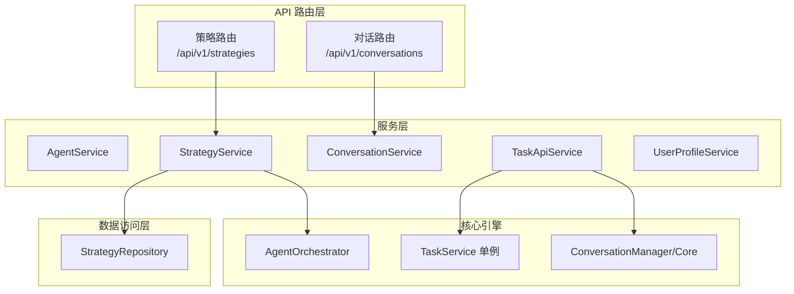
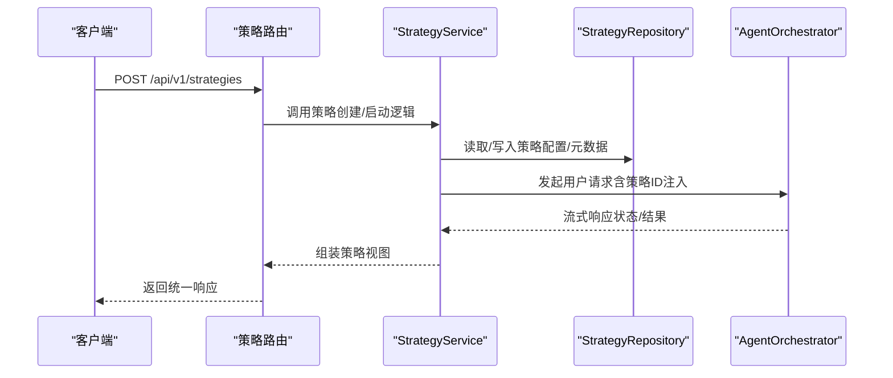
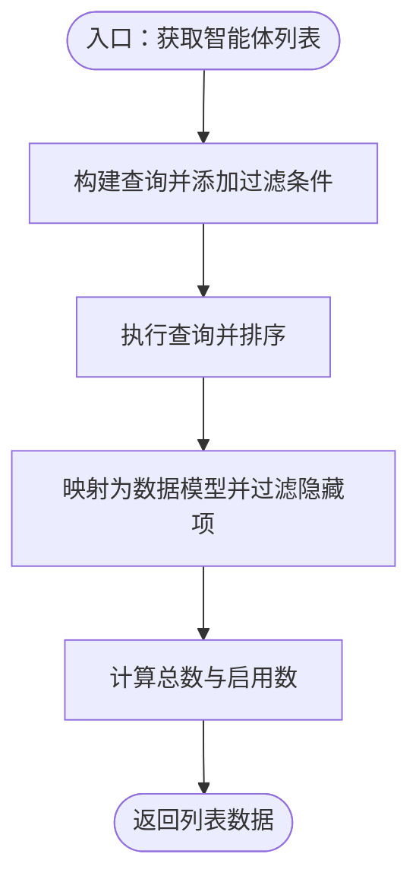
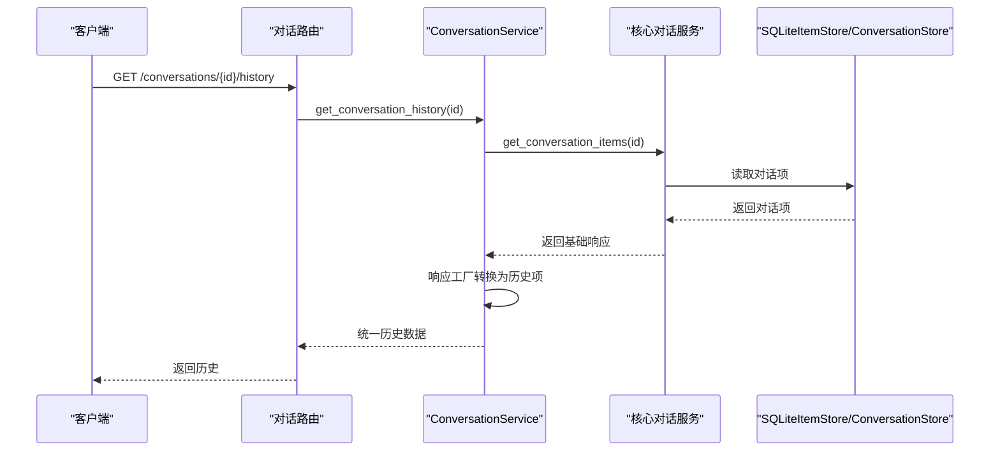
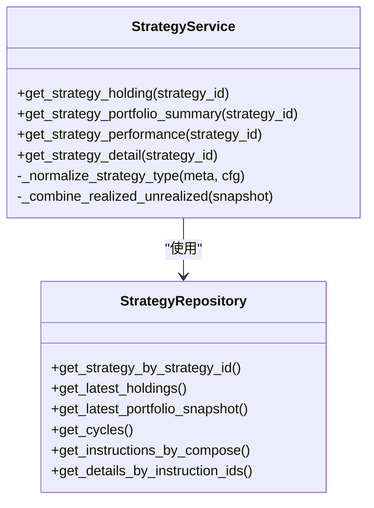
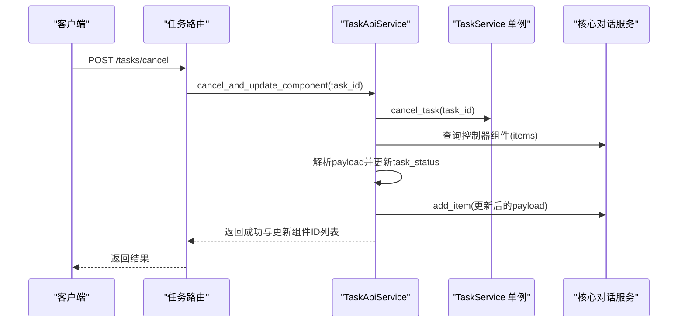
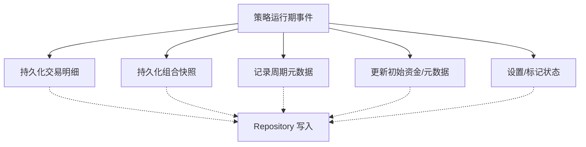
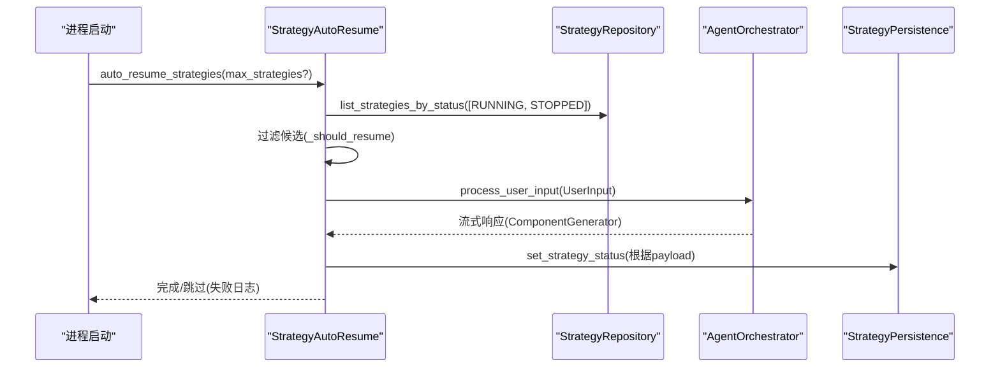
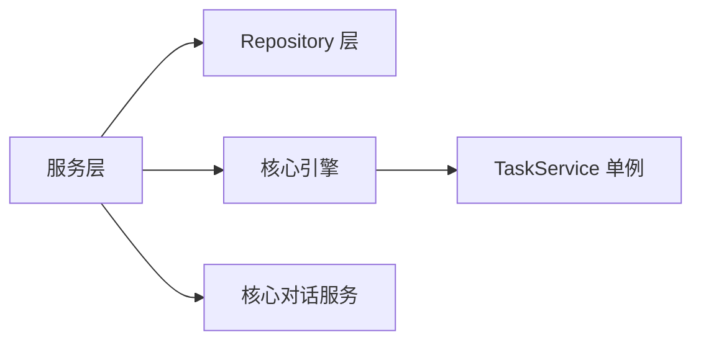

# 服务层架构

<cite>
**本文引用的文件**
- [agent_service.py](file://python/valuecell/server/services/agent_service.py)
- [conversation_service.py](file://python/valuecell/server/services/conversation_service.py)
- [strategy_service.py](file://python/valuecell/server/services/strategy_service.py)
- [task_service.py](file://python/valuecell/server/services/task_service.py)
- [user_profile_service.py](file://python/valuecell/server/services/user_profile_service.py)
- [strategy_persistence.py](file://python/valuecell/server/services/strategy_persistence.py)
- [strategy_autoresume.py](file://python/valuecell/server/services/strategy_autoresume.py)
- [strategy_repository.py](file://python/valuecell/server/db/repositories/strategy_repository.py)
- [strategy.py](file://python/valuecell/server/db/models/strategy.py)
- [app.py](file://python/valuecell/server/api/app.py)
- [strategy.py](file://python/valuecell/server/api/routers/strategy.py)
- [conversation.py](file://python/valuecell/server/api/routers/conversation.py)
- [exceptions.py](file://python/valuecell/server/api/exceptions.py)
- [main.py](file://python/valuecell/server/main.py)
- [locator.py](file://python/valuecell/core/task/locator.py)
- [services.py](file://python/valuecell/core/coordinate/services.py)
</cite>

## 目录
1. [引言](#引言)
2. [项目结构](#项目结构)
3. [核心组件](#核心组件)
4. [架构总览](#架构总览)
5. [详细组件分析](#详细组件分析)
6. [依赖关系分析](#依赖关系分析)
7. [性能考量](#性能考量)
8. [故障排查指南](#故障排查指南)
9. [结论](#结论)

## 引言
本文件系统性梳理 ValueCell 服务层架构，聚焦以下目标：
- 解析服务层如何封装与协调业务逻辑：AgentService（智能体生命周期管理）、ConversationService（对话上下文维护）、StrategyService（策略创建与执行）、TaskService（异步任务调度）、UserProfileService（用户偏好存储）。
- 阐明服务层如何与数据库（Repository 模式）和核心引擎（core 模块）协作。
- 深入说明策略的持久化与故障恢复：strategy_persistence.py 的持久化能力与 strategy_autoresume.py 的自动恢复流程。
- 提供服务调用链路示例（如创建策略时 StrategyService 与数据库和核心 Orchestrator 的交互）。
- 总结异常处理、事务管理与性能优化策略（缓存、批处理等）。

## 项目结构
服务层位于 Python 后端目录，采用“路由层 → 服务层 → 数据访问层（Repository）→ 核心引擎”的分层设计。API 路由负责参数校验与响应包装；服务层负责业务编排；Repository 负责数据库读写；核心引擎（core 模块）提供对话、任务、规划、超级代理等运行时能力。

图表来源
- [strategy.py](file://python/valuecell/server/api/routers/strategy.py#L1-L525)
- [conversation.py](file://python/valuecell/server/api/routers/conversation.py#L1-L148)
- [strategy_service.py](file://python/valuecell/server/services/strategy_service.py#L1-L415)
- [conversation_service.py](file://python/valuecell/server/services/conversation_service.py#L1-L345)
- [task_service.py](file://python/valuecell/server/services/task_service.py#L1-L100)
- [strategy_repository.py](file://python/valuecell/server/db/repositories/strategy_repository.py#L1-L648)
- [locator.py](file://python/valuecell/core/task/locator.py#L1-L54)
- [services.py](file://python/valuecell/core/coordinate/services.py#L1-L33)

章节来源
- [app.py](file://python/valuecell/server/api/app.py#L1-L242)
- [main.py](file://python/valuecell/server/main.py#L1-L99)

## 核心组件
- AgentService：提供智能体列表、过滤、启用状态更新、按名称/ID 查询等能力，面向前端展示与控制台管理。
- ConversationService：封装对话历史、任务结果聚合、删除等，桥接核心对话管理器与响应格式转换。
- StrategyService：面向策略查询（持仓、组合摘要、表现、周期明细），通过 Repository 组合多表数据，返回统一视图。
- TaskApiService：取消任务并同步更新对话中的控制器组件状态，协调核心任务服务与对话项持久化。
- UserProfileService：用户偏好（产品行为、风险偏好、阅读偏好）的增删改查与汇总统计。
- StrategyRepository：策略、持仓、详情、周期、指令、提示词等的统一数据库访问接口。
- StrategyPersistence：策略运行期数据的持久化（交易明细、组合快照、初始资金、周期元数据等）与状态管理。
- StrategyAutoResume：进程重启后扫描“运行中/已取消停止”的策略并自动恢复执行。

章节来源
- [agent_service.py](file://python/valuecell/server/services/agent_service.py#L1-L202)
- [conversation_service.py](file://python/valuecell/server/services/conversation_service.py#L1-L345)
- [strategy_service.py](file://python/valuecell/server/services/strategy_service.py#L1-L415)
- [task_service.py](file://python/valuecell/server/services/task_service.py#L1-L100)
- [user_profile_service.py](file://python/valuecell/server/services/user_profile_service.py#L1-L256)
- [strategy_repository.py](file://python/valuecell/server/db/repositories/strategy_repository.py#L1-L648)
- [strategy_persistence.py](file://python/valuecell/server/services/strategy_persistence.py#L1-L479)
- [strategy_autoresume.py](file://python/valuecell/server/services/strategy_autoresume.py#L1-L150)

## 架构总览
服务层通过依赖注入与单例定位器实现解耦：
- API 路由层仅依赖服务层方法。
- 服务层通过全局/工厂函数获取 Repository 或核心服务实例。
- 核心引擎通过 locator 提供的单例 TaskService 与 ConversationManager 等共享实例，确保一致性。

图表来源
- [strategy.py](file://python/valuecell/server/api/routers/strategy.py#L1-L525)
- [strategy_service.py](file://python/valuecell/server/services/strategy_service.py#L1-L415)
- [strategy_repository.py](file://python/valuecell/server/db/repositories/strategy_repository.py#L1-L648)
- [locator.py](file://python/valuecell/core/task/locator.py#L1-L54)
- [services.py](file://python/valuecell/core/coordinate/services.py#L1-L33)

## 详细组件分析

### AgentService（智能体生命周期管理）
职责
- 列出智能体并支持启用状态、名称过滤、隐藏策略控制。
- 按 ID/名称查询智能体。
- 更新智能体启用状态并记录时间戳。

实现要点
- 使用 SQLAlchemy 查询构建器动态拼接过滤条件。
- 对特定默认隐藏的智能体进行二次过滤。
- 更新启用状态后提交事务并刷新实体。

图表来源
- [agent_service.py](file://python/valuecell/server/services/agent_service.py#L1-L202)

章节来源
- [agent_service.py](file://python/valuecell/server/services/agent_service.py#L1-L202)

### ConversationService（对话上下文维护）
职责
- 获取对话列表（排除策略智能体发起的对话）。
- 获取对话历史与任务结果（区分通用历史与计划任务结果）。
- 聚合所有对话的任务结果并按智能体分组。
- 删除对话并清理关联数据。
- 将核心对话项转换为统一的历史条目格式，并进行事件/角色归一化。

实现要点
- 通过核心对话服务与 SQLite 存储交互，避免直接操作底层存储。
- 使用响应工厂从对话项重建响应对象，再转换为统一历史项。
- 对任务结果进行过滤，避免在通用历史中显示计划任务结果。

图表来源
- [conversation_service.py](file://python/valuecell/server/services/conversation_service.py#L1-L345)
- [conversation.py](file://python/valuecell/server/api/routers/conversation.py#L1-L148)

章节来源
- [conversation_service.py](file://python/valuecell/server/services/conversation_service.py#L1-L345)
- [conversation.py](file://python/valuecell/server/api/routers/conversation.py#L1-L148)

### StrategyService（策略创建与执行）
职责
- 获取策略持仓（最新快照与组合摘要）。
- 计算策略表现（初始资金、回报率、模型/提供商、交易模式、杠杆、标的等）。
- 获取策略周期明细（指令与执行细节）。
- 类型与字段规范化（策略类型、交易模式、提示词最终内容）。

实现要点
- 通过 Repository 组合多表数据（组合周期、指令、明细、快照）。
- 对配置与元数据进行兼容性处理（严格模式下不回退）。
- 时间戳与数值转换采用容错处理，避免异常中断。

图表来源
- [strategy_service.py](file://python/valuecell/server/services/strategy_service.py#L1-L415)
- [strategy_repository.py](file://python/valuecell/server/db/repositories/strategy_repository.py#L1-L648)

章节来源
- [strategy_service.py](file://python/valuecell/server/services/strategy_service.py#L1-L415)
- [strategy_repository.py](file://python/valuecell/server/db/repositories/strategy_repository.py#L1-L648)

### TaskApiService（异步任务调度）
职责
- 取消任务并同步更新对话中的计划任务控制器组件状态。
- 通过核心对话服务查找匹配的控制器项，更新嵌套 payload 中的任务状态并持久化。

实现要点
- 使用核心对话服务而非直接访问存储，保证一致性。
- 对 payload 进行 JSON 解析与重建，保留元数据。
- 失败项跳过，不影响其他组件的更新。

图表来源
- [task_service.py](file://python/valuecell/server/services/task_service.py#L1-L100)
- [locator.py](file://python/valuecell/core/task/locator.py#L1-L54)

章节来源
- [task_service.py](file://python/valuecell/server/services/task_service.py#L1-L100)
- [locator.py](file://python/valuecell/core/task/locator.py#L1-L54)

### UserProfileService（用户偏好存储）
职责
- 创建、查询、更新、删除用户偏好。
- 按类别汇总用户偏好并统计数量。
- 对类别进行合法性校验。

实现要点
- 通过仓库层进行 CRUD 操作，日志记录异常并返回空值或默认值。
- 分组统计与计数均在服务层完成，便于前端展示。

章节来源
- [user_profile_service.py](file://python/valuecell/server/services/user_profile_service.py#L1-L256)

### 策略持久化与故障恢复（strategy_persistence.py / strategy_autoresume.py）

策略持久化
- 交易明细持久化：将交易历史映射为明细记录，支持事件时间、入场/出场时间、未实现/已实现盈亏、手续费等字段。
- 组合快照持久化：按策略维度写入现金、总资产、未实现/已实现盈亏、总敞口等。
- 初始资金与元数据：在配置与元数据中记录初始资金，确保下游表现计算一致。
- 周期元数据：记录 compose_id、周期索引、理由等。
- 状态管理：检查策略是否存在，设置/标记停止状态，避免误写。

图表来源
- [strategy_persistence.py](file://python/valuecell/server/services/strategy_persistence.py#L1-L479)
- [strategy_repository.py](file://python/valuecell/server/db/repositories/strategy_repository.py#L1-L648)

策略自动恢复
- 启动扫描：进程启动时扫描状态为“运行中”或“已停止但原因标记为取消”的策略。
- 请求重建：从策略配置重建用户请求，注入策略ID以复用组合状态。
- 执行与状态更新：通过核心 Orchestrator 发送输入并消费首个组件生成事件，据此更新状态。

图表来源
- [strategy_autoresume.py](file://python/valuecell/server/services/strategy_autoresume.py#L1-L150)
- [strategy_persistence.py](file://python/valuecell/server/services/strategy_persistence.py#L1-L479)
- [strategy_repository.py](file://python/valuecell/server/db/repositories/strategy_repository.py#L1-L648)

章节来源
- [strategy_persistence.py](file://python/valuecell/server/services/strategy_persistence.py#L1-L479)
- [strategy_autoresume.py](file://python/valuecell/server/services/strategy_autoresume.py#L1-L150)
- [strategy_repository.py](file://python/valuecell/server/db/repositories/strategy_repository.py#L1-L648)

## 依赖关系分析
- 服务层与数据访问层：StrategyService、TaskApiService、UserProfileService 显式依赖 Repository；AgentService、ConversationService 也通过 ORM/核心服务间接依赖数据库。
- 服务层与核心引擎：StrategyService 与 StrategyAutoResume 通过 AgentOrchestrator 与核心任务/对话服务交互；TaskApiService 通过 TaskService 单例与核心任务管理器交互。
- 全局定位器：TaskService 通过进程内单例定位器提供，确保跨模块一致性；ConversationService 在服务层内部构造核心对话服务，避免循环依赖。

图表来源
- [strategy_service.py](file://python/valuecell/server/services/strategy_service.py#L1-L415)
- [task_service.py](file://python/valuecell/server/services/task_service.py#L1-L100)
- [conversation_service.py](file://python/valuecell/server/services/conversation_service.py#L1-L345)
- [locator.py](file://python/valuecell/core/task/locator.py#L1-L54)
- [services.py](file://python/valuecell/core/coordinate/services.py#L1-L33)

章节来源
- [locator.py](file://python/valuecell/core/task/locator.py#L1-L54)
- [services.py](file://python/valuecell/core/coordinate/services.py#L1-L33)

## 性能考量
- 缓存与批处理
  - 对话历史与任务结果聚合：在服务层进行内存聚合与过滤，减少前端多次请求。
  - 策略视图计算：Repository 提供批量查询接口（如最近快照、周期、指令），服务层一次性组装，避免多次往返。
- 事务与一致性
  - Repository 对每个操作封装会话与异常回滚，保证写入一致性。
  - 对话项更新通过核心对话服务统一入口，避免直接写存储导致的状态不一致。
- I/O 优化
  - 通过统一的数据库连接管理器与会话生命周期管理，降低连接开销。
  - 对于大列表查询（策略/对话）使用分页与限制，避免一次性加载过多数据。

[本节为通用指导，无需具体文件来源]

## 故障排查指南
- 异常处理
  - API 层统一注册自定义异常与 HTTP 验证异常处理器，返回结构化错误响应。
  - 服务层捕获并记录异常，必要时抛出 HTTP 异常以便路由层统一处理。
- 事务管理
  - Repository 在写入失败时回滚并返回 None，调用方需判断返回值并记录日志。
- 常见问题
  - 对话不存在：ConversationService 抛出 ValueError，路由层映射为 404。
  - 策略不存在：路由层返回 404；服务层返回空数据或 None，调用方可按需处理。
  - 任务取消后控制器状态未更新：确认 payload 结构与 task_id 匹配，必要时检查 JSON 解析分支。

章节来源
- [exceptions.py](file://python/valuecell/server/api/exceptions.py#L1-L111)
- [conversation_service.py](file://python/valuecell/server/services/conversation_service.py#L1-L345)
- [strategy.py](file://python/valuecell/server/api/routers/strategy.py#L1-L525)

## 结论
ValueCell 服务层通过清晰的职责划分与依赖注入，实现了业务逻辑的高内聚与低耦合。服务层与 Repository、核心引擎之间的边界明确，既保证了数据一致性，又提升了可测试性与扩展性。策略持久化与自动恢复机制完善，结合对话与任务服务，形成了从策略创建到运行监控的完整闭环。建议在后续迭代中进一步引入缓存层与批量写入优化，以应对更高并发场景。