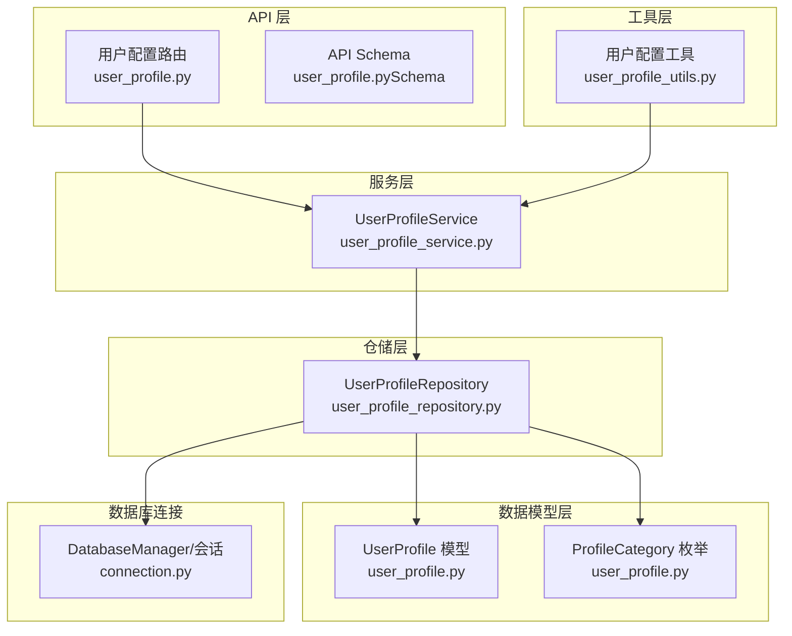
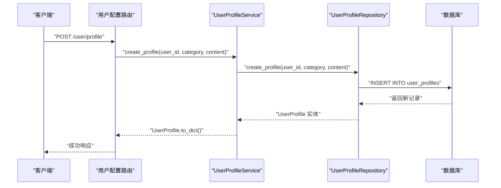
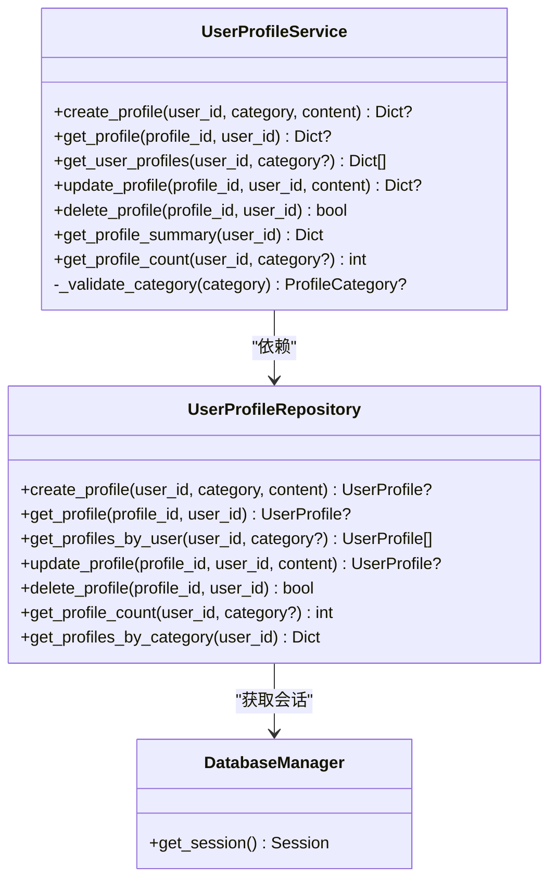
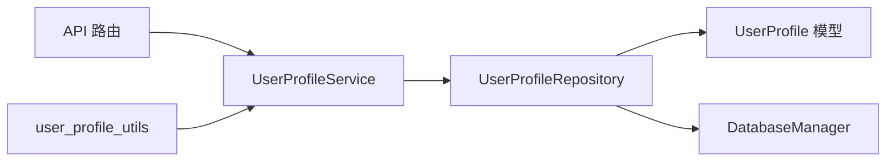
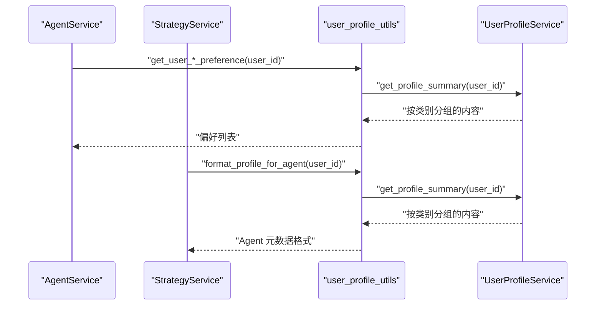

# 用户配置服务

<cite>
**本文引用的文件列表**
- [user_profile_service.py](file://python/valuecell/server/services/user_profile_service.py)
- [user_profile_repository.py](file://python/valuecell/server/db/repositories/user_profile_repository.py)
- [user_profile.py](file://python/valuecell/server/db/models/user_profile.py)
- [user_profile.py（API 路由）](file://python/valuecell/server/api/routers/user_profile.py)
- [user_profile.py（API Schema）](file://python/valuecell/server/api/schemas/user_profile.py)
- [user_profile_utils.py](file://python/valuecell/utils/user_profile_utils.py)
- [connection.py](file://python/valuecell/server/db/connection.py)
- [agent_service.py](file://python/valuecell/server/services/agent_service.py)
- [strategy_service.py](file://python/valuecell/server/services/strategy_service.py)
</cite>

## 目录
1. [简介](#简介)
2. [项目结构](#项目结构)
3. [核心组件](#核心组件)
4. [架构总览](#架构总览)
5. [组件详解](#组件详解)
6. [依赖关系分析](#依赖关系分析)
7. [性能与缓存策略](#性能与缓存策略)
8. [安全与数据验证](#安全与数据验证)
9. [与其他服务的集成](#与其他服务的集成)
10. [故障排查指南](#故障排查指南)
11. [结论](#结论)

## 简介
本文件系统化梳理 UserProfileService 的功能实现，聚焦用户偏好与配置数据的存储与管理。服务覆盖用户模型提供商设置、交易所凭证、界面主题等个性化数据的增删改查（CRUD），并与数据库 UserProfile 模型映射，提供数据验证与错误处理，并通过工具层为 AgentService、StrategyService 等上层服务提供统一的用户上下文访问接口。文档同时解释服务的读写分离与缓存策略思路，以及在高频访问场景下的性能优化建议。

## 项目结构
UserProfileService 所在模块位于 Python 后端服务层，采用经典的分层架构：
- API 层：FastAPI 路由定义与请求/响应模型
- 服务层：UserProfileService 提供业务逻辑
- 仓储层：UserProfileRepository 封装数据库操作
- 数据模型层：UserProfile 及 ProfileCategory 定义
- 工具层：user_profile_utils 提供便捷查询与格式化
- 数据库连接：connection.py 管理引擎与会话

图表来源
- [user_profile.py（API 路由）](file://python/valuecell/server/api/routers/user_profile.py#L1-L245)
- [user_profile.py（API Schema）](file://python/valuecell/server/api/schemas/user_profile.py#L1-L63)
- [user_profile_service.py](file://python/valuecell/server/services/user_profile_service.py#L1-L255)
- [user_profile_repository.py](file://python/valuecell/server/db/repositories/user_profile_repository.py#L1-L220)
- [user_profile.py](file://python/valuecell/server/db/models/user_profile.py#L1-L63)
- [connection.py](file://python/valuecell/server/db/connection.py#L1-L103)
- [user_profile_utils.py](file://python/valuecell/utils/user_profile_utils.py#L1-L277)

章节来源
- [user_profile_service.py](file://python/valuecell/server/services/user_profile_service.py#L1-L255)
- [user_profile_repository.py](file://python/valuecell/server/db/repositories/user_profile_repository.py#L1-L220)
- [user_profile.py](file://python/valuecell/server/db/models/user_profile.py#L1-L63)
- [user_profile.py（API 路由）](file://python/valuecell/server/api/routers/user_profile.py#L1-L245)
- [user_profile.py（API Schema）](file://python/valuecell/server/api/schemas/user_profile.py#L1-L63)
- [user_profile_utils.py](file://python/valuecell/utils/user_profile_utils.py#L1-L277)
- [connection.py](file://python/valuecell/server/db/connection.py#L1-L103)

## 核心组件
- UserProfileService：面向业务的用户配置管理服务，封装 CRUD 与汇总统计，负责参数校验与异常处理。
- UserProfileRepository：面向数据访问的仓储层，负责数据库会话管理、SQL 查询与事务控制。
- UserProfile 模型与 ProfileCategory 枚举：定义用户配置的数据结构与分类。
- API 路由与 Schema：对外暴露 REST 接口与请求/响应模型。
- 工具函数 user_profile_utils：提供便捷查询、汇总与格式化，供 Agent/Strategy 等服务消费。

章节来源
- [user_profile_service.py](file://python/valuecell/server/services/user_profile_service.py#L1-L255)
- [user_profile_repository.py](file://python/valuecell/server/db/repositories/user_profile_repository.py#L1-L220)
- [user_profile.py](file://python/valuecell/server/db/models/user_profile.py#L1-L63)
- [user_profile.py（API 路由）](file://python/valuecell/server/api/routers/user_profile.py#L1-L245)
- [user_profile.py（API Schema）](file://python/valuecell/server/api/schemas/user_profile.py#L1-L63)
- [user_profile_utils.py](file://python/valuecell/utils/user_profile_utils.py#L1-L277)

## 架构总览
UserProfileService 采用“服务层-仓储层-模型层-连接层”的分层设计，API 层通过依赖注入获取服务实例，服务层再委托仓储层执行数据库操作。连接层统一管理数据库引擎与会话生命周期，确保资源释放与异常回滚。

图表来源
- [user_profile.py（API 路由）](file://python/valuecell/server/api/routers/user_profile.py#L1-L120)
- [user_profile_service.py](file://python/valuecell/server/services/user_profile_service.py#L22-L61)
- [user_profile_repository.py](file://python/valuecell/server/db/repositories/user_profile_repository.py#L30-L64)

## 组件详解

### UserProfileService：用户配置业务服务
- 职责
  - 创建、查询、更新、删除用户配置
  - 汇总与计数：按用户与类别分组，统计总数
  - 参数校验：将字符串类别转换为 ProfileCategory 枚举
- 关键方法
  - create_profile：创建配置，返回字典结果
  - get_profile/get_user_profiles：按 ID 或用户+可选类别查询
  - update_profile：按 ID 更新内容
  - delete_profile：按 ID 删除
  - get_profile_summary：按类别聚合内容
  - get_profile_count：按用户与类别统计数量
  - _validate_category：类别校验
- 依赖注入
  - 支持传入自定义仓库实例，便于测试与替换
- 全局单例
  - 提供 get_user_profile_service/reset_user_profile_service，支持全局实例管理

图表来源
- [user_profile_service.py](file://python/valuecell/server/services/user_profile_service.py#L1-L255)
- [user_profile_repository.py](file://python/valuecell/server/db/repositories/user_profile_repository.py#L1-L220)
- [connection.py](file://python/valuecell/server/db/connection.py#L1-L103)

章节来源
- [user_profile_service.py](file://python/valuecell/server/services/user_profile_service.py#L1-L255)

### UserProfileRepository：用户配置数据访问
- 职责
  - 统一会话管理：内部或外部注入 Session
  - CRUD 操作：创建、查询、更新、删除
  - 聚合与统计：按用户与类别分组、计数
- 异常处理
  - 捕获完整性约束与通用异常，回滚并返回空值
- 会话生命周期
  - 非外部注入时自动关闭会话，避免连接泄漏

章节来源
- [user_profile_repository.py](file://python/valuecell/server/db/repositories/user_profile_repository.py#L1-L220)
- [connection.py](file://python/valuecell/server/db/connection.py#L1-L103)

### UserProfile 模型与 ProfileCategory 枚举
- 模型字段
  - id、user_id、category（枚举）、content、created_at、updated_at
- 枚举类别
  - product_behavior、risk_preference、reading_preference、normal
- 序列化
  - to_dict 输出标准化字典，包含时间戳 ISO 字符串

章节来源
- [user_profile.py](file://python/valuecell/server/db/models/user_profile.py#L1-L63)

### API 路由与 Schema
- 路由
  - POST /user/profile：创建配置
  - GET /user/profile：按用户与类别查询
  - GET /user/profile/{profile_id}：按 ID 查询
  - PUT /user/profile/{profile_id}：更新
  - DELETE /user/profile/{profile_id}：删除
- 请求/响应模型
  - CreateUserProfileRequest、UpdateUserProfileRequest、UserProfileData、UserProfileListData、UserProfileSummaryData
- 默认用户 ID
  - 当前开放源码模式下使用默认用户标识

章节来源
- [user_profile.py（API 路由）](file://python/valuecell/server/api/routers/user_profile.py#L1-L245)
- [user_profile.py（API Schema）](file://python/valuecell/server/api/schemas/user_profile.py#L1-L63)

### 工具层：便捷查询与格式化
- get_user_profile_summary：返回按类别分组的内容列表与总数
- get_user_*_preference：快速获取特定偏好的内容列表
- format_profile_for_agent：为 Agent 元数据消费格式化
- get_user_profile_metadata：返回包含用户配置摘要的元数据对象

章节来源
- [user_profile_utils.py](file://python/valuecell/utils/user_profile_utils.py#L1-L277)

## 依赖关系分析
- 服务到仓储：UserProfileService 依赖 UserProfileRepository 进行数据库操作
- 仓储到模型：UserProfileRepository 使用 UserProfile 模型与 ProfileCategory 枚举
- 仓储到连接：UserProfileRepository 通过 DatabaseManager 获取会话
- API 到服务：FastAPI 路由通过 get_user_profile_service 获取服务实例
- 工具到服务：user_profile_utils 通过 get_user_profile_service 调用服务方法

图表来源
- [user_profile.py（API 路由）](file://python/valuecell/server/api/routers/user_profile.py#L1-L245)
- [user_profile_service.py](file://python/valuecell/server/services/user_profile_service.py#L1-L255)
- [user_profile_repository.py](file://python/valuecell/server/db/repositories/user_profile_repository.py#L1-L220)
- [user_profile.py](file://python/valuecell/server/db/models/user_profile.py#L1-L63)
- [connection.py](file://python/valuecell/server/db/connection.py#L1-L103)
- [user_profile_utils.py](file://python/valuecell/utils/user_profile_utils.py#L1-L277)

章节来源
- [user_profile_service.py](file://python/valuecell/server/services/user_profile_service.py#L1-L255)
- [user_profile_repository.py](file://python/valuecell/server/db/repositories/user_profile_repository.py#L1-L220)
- [user_profile.py（API 路由）](file://python/valuecell/server/api/routers/user_profile.py#L1-L245)
- [user_profile_utils.py](file://python/valuecell/utils/user_profile_utils.py#L1-L277)

## 性能与缓存策略
- 读写分离
  - 仓储层按需获取会话，非外部注入时自动关闭，避免长连接占用
  - 查询路径中对用户维度进行索引过滤，减少扫描范围
- 缓存机制
  - 当前未实现专用缓存层；建议在高频读取场景引入应用级缓存（如 LRU 缓存）存放 get_profile_summary 结果，结合用户维度与 TTL 控制
  - 对于频繁访问的类别（如 risk_preference、reading_preference），可在工具层增加短期缓存，降低数据库压力
- 事务与会话
  - 仓储层在异常时回滚并关闭会话，保证一致性与资源回收
- 批量与排序
  - 查询按创建时间倒序，适合“最新优先”的展示需求；若需要更复杂的排序或分页，可在仓储层扩展

[本节为通用性能建议，不直接分析具体文件，故无章节来源]

## 安全与数据验证
- 类别校验
  - 服务层将字符串类别转换为 ProfileCategory 枚举，非法类别直接拒绝
- 输入长度限制
  - API Schema 对 content 设置最大长度限制，防止超大数据写入
- 错误处理
  - 服务层与仓储层均捕获异常并记录日志，返回空值或失败状态
- 数据库约束
  - 仓储层捕获完整性约束异常，避免脏数据进入持久层

章节来源
- [user_profile_service.py](file://python/valuecell/server/services/user_profile_service.py#L224-L238)
- [user_profile.py（API Schema）](file://python/valuecell/server/api/schemas/user_profile.py#L22-L40)
- [user_profile_repository.py](file://python/valuecell/server/db/repositories/user_profile_repository.py#L55-L60)

## 与其他服务的集成
- 与 AgentService 的关系
  - AgentService 主要负责代理器的启用/禁用与元数据管理，不直接依赖用户配置；但 AgentService 可通过工具层 user_profile_utils 获取用户偏好（如风险偏好、阅读偏好）用于提示词或行为引导
- 与 StrategyService 的关系
  - StrategyService 负责策略持有、组合周期与表现计算，不直接依赖用户配置；但可通过 user_profile_utils 获取用户偏好（如产品行为、风险偏好）辅助策略提示或风控策略制定
- 统一用户上下文访问
  - user_profile_utils 提供统一入口，屏蔽服务层细节，便于 Agent/Strategy 等服务按需获取用户配置摘要

图表来源
- [agent_service.py](file://python/valuecell/server/services/agent_service.py#L1-L202)
- [strategy_service.py](file://python/valuecell/server/services/strategy_service.py#L1-L415)
- [user_profile_utils.py](file://python/valuecell/utils/user_profile_utils.py#L1-L277)
- [user_profile_service.py](file://python/valuecell/server/services/user_profile_service.py#L159-L223)

章节来源
- [agent_service.py](file://python/valuecell/server/services/agent_service.py#L1-L202)
- [strategy_service.py](file://python/valuecell/server/services/strategy_service.py#L1-L415)
- [user_profile_utils.py](file://python/valuecell/utils/user_profile_utils.py#L1-L277)

## 故障排查指南
- 常见问题
  - 无效类别：服务层会拒绝非法类别字符串，检查调用方是否使用 ProfileCategory 支持的值
  - 未找到记录：查询按 ID+用户过滤，确认 user_id 与 profile_id 是否匹配
  - 更新失败：检查内容长度与数据库约束，查看日志定位异常
- 日志与异常
  - 服务层与仓储层均记录异常堆栈，便于定位 SQL 失败或业务异常
- 会话与连接
  - 若出现连接泄漏或超时，检查是否正确关闭会话；仓储层在非外部注入时会自动关闭

章节来源
- [user_profile_service.py](file://python/valuecell/server/services/user_profile_service.py#L63-L81)
- [user_profile_repository.py](file://python/valuecell/server/db/repositories/user_profile_repository.py#L65-L84)
- [connection.py](file://python/valuecell/server/db/connection.py#L63-L70)

## 结论
UserProfileService 通过清晰的分层设计与严格的参数校验，提供了稳定可靠的用户配置管理能力。服务与仓储层解耦良好，便于扩展与测试；API 层提供标准的 CRUD 接口，工具层为上层服务提供统一的用户上下文访问。当前未实现专用缓存与读写分离，建议在高频读取场景引入应用级缓存与会话池优化，以进一步提升性能与稳定性。