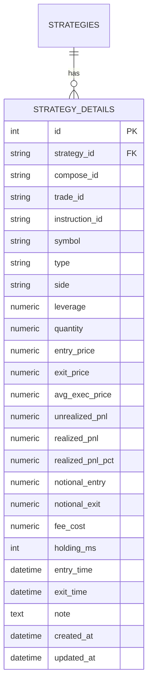
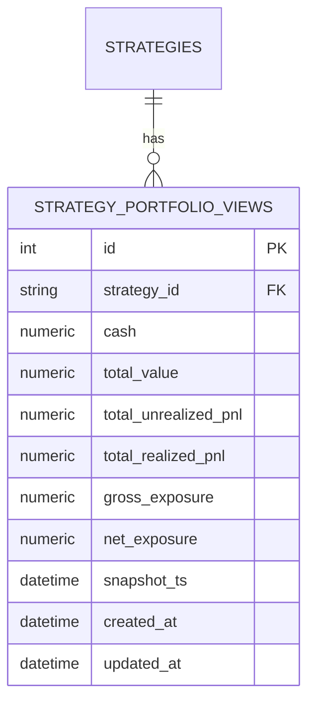
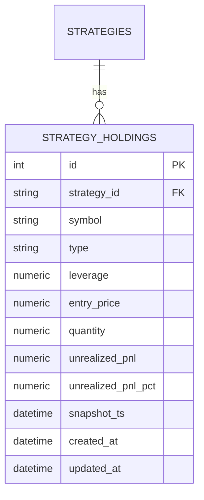
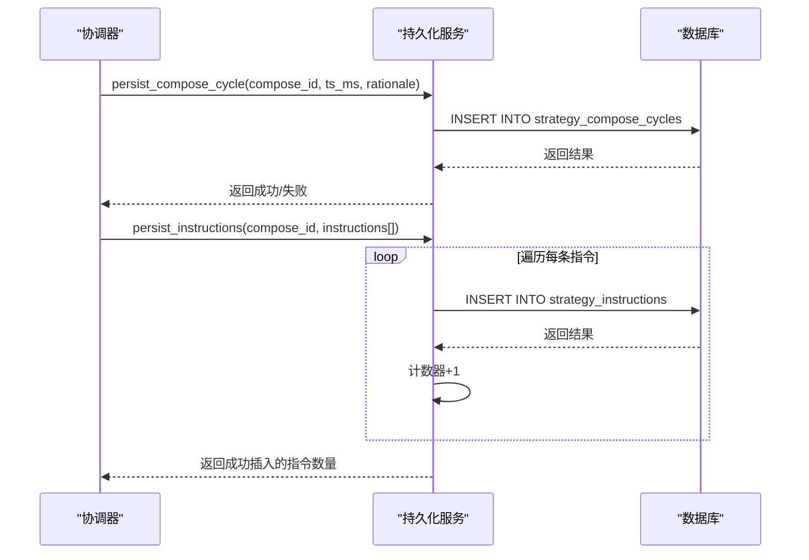

# 策略持久化机制

<cite>
**本文档引用的文件**   
- [strategy_persistence.py](file://python/valuecell/server/services/strategy_persistence.py)
- [strategy_repository.py](file://python/valuecell/server/db/repositories/strategy_repository.py)
- [strategy_detail.py](file://python/valuecell/server/db/models/strategy_detail.py)
- [strategy_portfolio.py](file://python/valuecell/server/db/models/strategy_portfolio.py)
- [strategy_compose_cycle.py](file://python/valuecell/server/db/models/strategy_compose_cycle.py)
- [strategy_instruction.py](file://python/valuecell/server/db/models/strategy_instruction.py)
- [strategy.py](file://python/valuecell/server/db/models/strategy.py)
- [models.py](file://python/valuecell/agents/common/trading/models.py)
- [stream_controller.py](file://python/valuecell/agents/common/trading/_internal/stream_controller.py)
</cite>

## 目录
1. [引言](#引言)
2. [核心持久化函数分析](#核心持久化函数分析)
3. [数据模型与数据库结构](#数据模型与数据库结构)
4. [持久化流程与组件协作](#持久化流程与组件协作)
5. [错误处理与日志记录](#错误处理与日志记录)
6. [结论](#结论)

## 引言
策略持久化模块是ValueCell系统的核心组件，负责将交易策略的运行状态、交易历史、投资组合视图和策略摘要等关键数据可靠地存储到数据库中。该模块确保了策略执行过程的可追溯性和数据完整性，为后续的性能分析、状态恢复和用户界面展示提供了数据基础。本文档将深入解析其内部实现机制。

## 核心持久化函数分析

### 交易历史持久化
`persist_trade_history`函数负责将单笔交易的执行详情保存到策略明细表中。该函数首先通过策略ID验证策略是否存在，若策略不存在则跳过持久化以避免数据不一致。在时间戳处理上，函数优先使用交易记录中的entry_ts（进入时间戳），若不存在则回退到trade_ts（交易时间戳），并将其从毫秒级Unix时间戳转换为UTC时区的`datetime`对象。对于交易方向和类型的映射，函数通过`trade.type.value`和`trade.side.value`获取枚举值，并在缺失时根据交易数量的正负进行推断（正数为多头，负数为空头）。数据完整性通过数据库的唯一约束`uq_strategy_trade_id`（策略ID与交易ID的组合）来保障，防止重复记录。函数通过`add_detail_item`方法将数据写入`strategy_details`表，并返回插入记录的字典形式，若写入失败则返回`None`。

**Section sources**
- [strategy_persistence.py](file://python/valuecell/server/services/strategy_persistence.py#L12-L130)
- [strategy_repository.py](file://python/valuecell/server/db/repositories/strategy_repository.py#L315-L379)

### 投资组合视图持久化
`persist_portfolio_view`函数负责将投资组合的快照数据分解并存入数据库。该函数接收一个`PortfolioView`对象，其中包含现金余额、总价值、各持仓信息等。首先，函数将`PortfolioView`的顶层信息（如现金、总价值）通过`add_portfolio_snapshot`方法存入`strategy_portfolio_views`表，形成一个聚合的投资组合快照。随后，函数遍历`view.positions`字典，将每个持仓（`PositionSnapshot`）作为一条独立的记录，通过`add_holding_item`方法存入`strategy_holdings`表。在处理每个持仓时，函数同样会进行交易类型（LONG/SHORT）的映射，并将时间戳从毫秒转换为`datetime`对象。此设计将聚合数据与明细数据分离，既保证了查询效率，又保留了详细的持仓信息。

**Section sources**
- [strategy_persistence.py](file://python/valuecell/server/services/strategy_persistence.py#L133-L225)
- [strategy_repository.py](file://python/valuecell/server/db/repositories/strategy_repository.py#L168-L203)

### 策略摘要持久化
`persist_strategy_summary`函数负责将策略的元数据合并更新到数据库中。该函数首先通过`get_strategy_by_strategy_id`获取策略的现有记录，若策略不存在则直接返回`False`。核心的合并更新策略体现在`meta`字典的构建上：它使用`**`操作符将现有的`strategy_metadata`字典与新的`summary`模型通过`model_dump`方法导出的字典进行合并。`model_dump`方法的`exclude_none=True`参数确保了只有非`None`的字段才会被包含，从而实现了“非空字段覆盖”的更新逻辑。最后，通过`upsert_strategy`方法将合并后的元数据写回数据库。这种设计允许增量更新，避免了全量覆盖可能带来的数据丢失。

**Section sources**
- [strategy_persistence.py](file://python/valuecell/server/services/strategy_persistence.py#L228-L257)
- [strategy_repository.py](file://python/valuecell/server/db/repositories/strategy_repository.py#L76-L127)

### 初始资金信息记录
`set_initial_capital_metadata`函数专门用于在实盘模式下记录初始资金信息。该函数将初始资金金额、来源描述（如'live_snapshot_cash'）和时间戳作为元数据，存储在`strategy_metadata` JSON字段中，对应的键分别为`initial_capital_live`、`initial_capital_source`和`initial_capital_ts_ms`。与`update_initial_capital`函数（该函数更新`strategies.config.trading_config.initial_capital`）不同，此函数直接操作元数据，为性能分析提供了更准确的基准。例如，`StrategyService`在计算收益率时，会优先从`strategy_metadata`中读取`initial_capital_live`作为初始本金。

**Section sources**
- [strategy_persistence.py](file://python/valuecell/server/services/strategy_persistence.py#L424-L478)
- [strategy_service.py](file://python/valuecell/server/services/strategy_service.py#L237-L249)

## 数据模型与数据库结构

### 策略明细表 (strategy_details)
该表存储每笔交易或持仓的详细信息，是交易历史的核心。其关键字段包括：
- **trade_id**: 交易的唯一标识符。
- **type** 和 **side**: 分别表示交易类型（LONG/SHORT）和方向（BUY/SELL）。
- **entry_price** 和 **exit_price**: 进场和出场价格。
- **quantity**: 交易数量（绝对值）。
- **realized_pnl** 和 **unrealized_pnl**: 已实现和未实现盈亏。
- **entry_time** 和 **exit_time**: 进场和出场时间。
- **event_time**: 事件时间，用于排序。
- **created_at** 和 **updated_at**: 记录的创建和更新时间。
- **约束**: `uq_strategy_trade_id`确保了同一策略下的交易ID唯一。

**Diagram sources **
- [strategy_detail.py](file://python/valuecell/server/db/models/strategy_detail.py)
- [strategy.py](file://python/valuecell/server/db/models/strategy.py)

### 投资组合视图表 (strategy_portfolio_views)
该表存储策略在特定时间点的聚合投资组合快照。其关键字段包括：
- **cash**: 现金余额。
- **total_value**: 投资组合总价值（现金+持仓市值）。
- **total_unrealized_pnl** 和 **total_realized_pnl**: 总未实现和已实现盈亏。
- **snapshot_ts**: 快照时间戳。
- **约束**: `uq_strategy_portfolio_snapshot`确保了同一策略在同一个时间点只有一个快照。

**Diagram sources **
- [strategy_portfolio.py](file://python/valuecell/server/db/models/strategy_portfolio.py)
- [strategy.py](file://python/valuecell/server/db/models/strategy.py)

### 持仓明细表 (strategy_holdings)
该表存储策略在特定时间点对每个交易标的的持仓快照。其关键字段包括：
- **symbol**: 交易标的符号。
- **type**: 持仓类型（LONG/SHORT）。
- **quantity**: 持仓数量（绝对值）。
- **entry_price**: 平均进场价格。
- **unrealized_pnl**: 该持仓的未实现盈亏。
- **snapshot_ts**: 快照时间戳。
- **约束**: `uq_strategy_holding_snapshot`确保了同一策略对同一标的在同一个时间点只有一个持仓记录。

**Diagram sources **
- [strategy_holding.py](file://python/valuecell/server/db/models/strategy_holding.py)
- [strategy.py](file://python/valuecell/server/db/models/strategy.py)

## 持久化流程与组件协作

### 决策周期持久化
`persist_compose_cycle`和`persist_instructions`函数协同工作，完整记录策略决策周期的全过程。`persist_compose_cycle`函数在每次决策周期开始时被调用，它将`compose_id`（决策周期ID）、时间戳和可选的推理（rationale）存入`strategy_compose_cycles`表。这为整个决策周期提供了一个聚合的锚点。紧接着，`persist_instructions`函数被调用，它遍历该周期内生成的所有`TradeInstruction`对象，并通过`add_instruction`方法将每条指令存入`strategy_instructions`表。每条指令都关联到同一个`compose_id`，从而建立了“决策周期-指令”的关联关系。这种设计使得可以追溯到某次决策周期中AI生成的所有交易指令。

**Diagram sources **
- [strategy_persistence.py](file://python/valuecell/server/services/strategy_persistence.py#L304-L371)
- [strategy_repository.py](file://python/valuecell/server/db/repositories/strategy_repository.py#L382-L447)

### 完整生命周期流程
策略的持久化贯穿其整个生命周期。在策略启动时，`StreamController`的`persist_initial_state`方法会调用`persist_portfolio_view`和`persist_strategy_summary`来记录初始状态。在每个决策周期结束后，`StreamController`会调用`persist_trade_history`、`persist_portfolio_view`和`persist_strategy_summary`来持久化该周期的交易结果、新的投资组合视图和更新后的策略摘要。当策略停止时，`StreamController`会调用`set_strategy_status`来更新其状态。整个流程确保了策略运行的每一步都有迹可循。

**Section sources**
- [stream_controller.py](file://python/valuecell/agents/common/trading/_internal/stream_controller.py#L97-L280)
- [strategy_persistence.py](file://python/valuecell/server/services/strategy_persistence.py)

## 错误处理与日志记录
持久化模块采用了稳健的错误处理和日志记录策略，以确保数据写入的可靠性和可追溯性。所有核心持久化函数都使用了`try...except`块来捕获任何潜在的异常。当发生错误时，函数会通过`logger.error`或`logger.exception`记录详细的错误信息，包括策略ID、交易ID等上下文，然后返回`None`或`False`以指示失败，而不会让异常中断主业务流程。例如，`persist_trade_history`在写入失败时会记录一条错误日志，而在发生未预期的异常时会记录完整的堆栈跟踪。数据库操作通过`session.commit()`和`session.rollback()`来保证原子性，任何数据库层面的错误都会触发回滚，防止数据处于不一致状态。这种“记录并继续”的模式保证了系统的整体健壮性。

**Section sources**
- [strategy_persistence.py](file://python/valuecell/server/services/strategy_persistence.py)
- [strategy_repository.py](file://python/valuecell/server/db/repositories/strategy_repository.py)

## 结论
策略持久化模块通过一系列精心设计的函数和数据库模型，实现了对交易历史、投资组合、策略摘要等关键数据的可靠存储。其核心机制包括：利用`add_detail_item`等仓库方法进行数据写入，通过`datetime`转换和枚举映射处理时间戳与方向，采用合并更新策略维护元数据，并通过`compose_id`将决策周期与指令关联。完善的错误处理和日志记录确保了数据的完整性和系统的稳定性。该模块是连接策略执行引擎与数据存储的桥梁，为系统的可审计性和可恢复性奠定了坚实的基础。