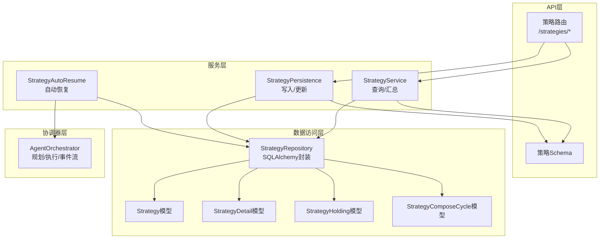
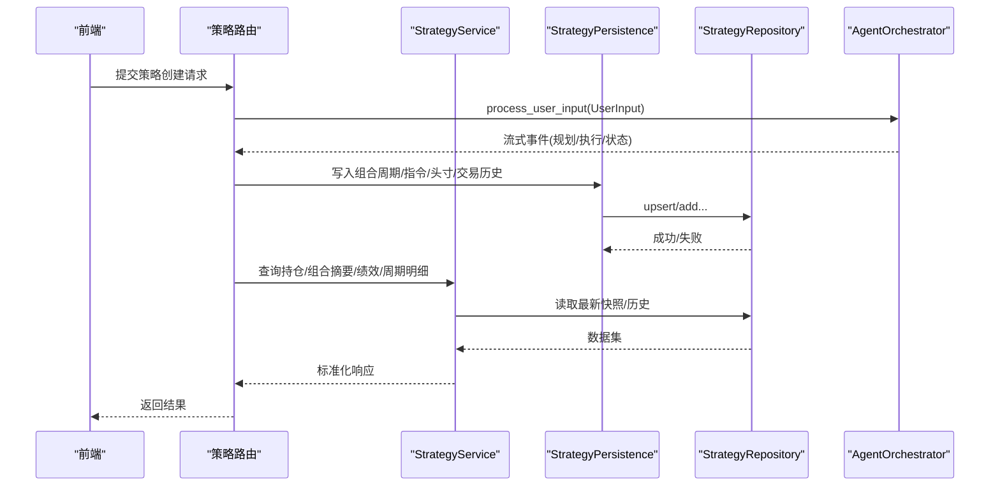
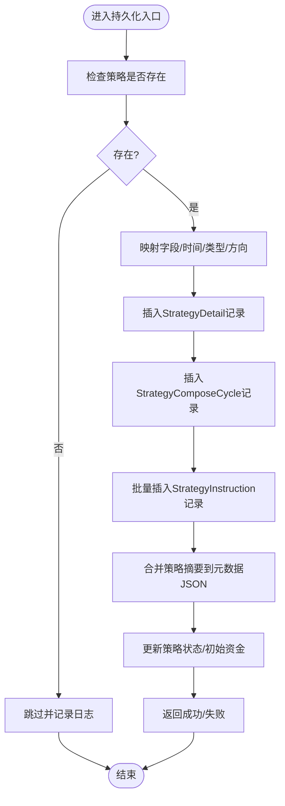
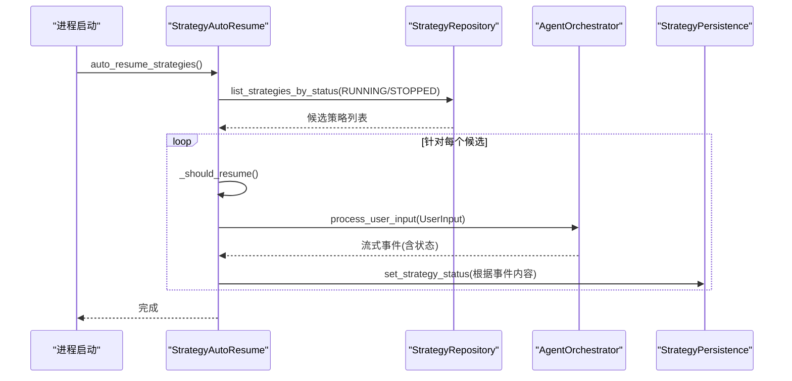
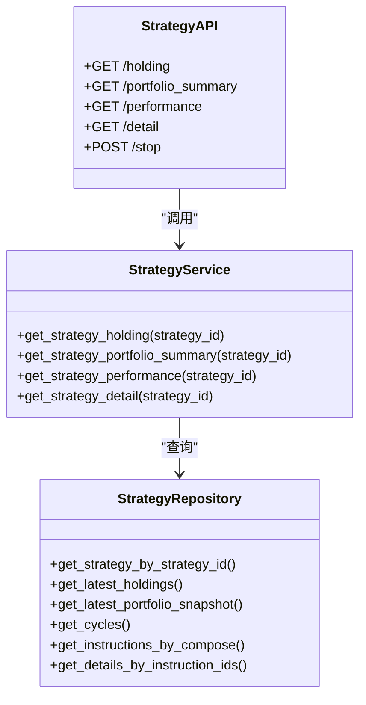
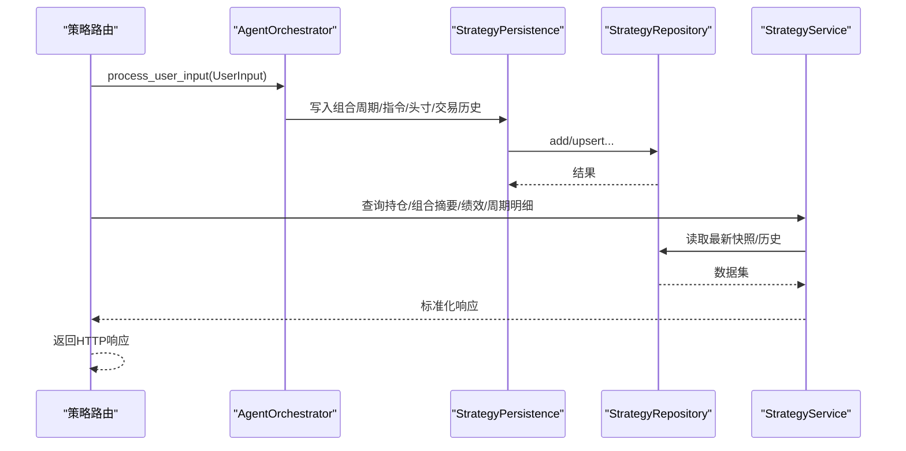
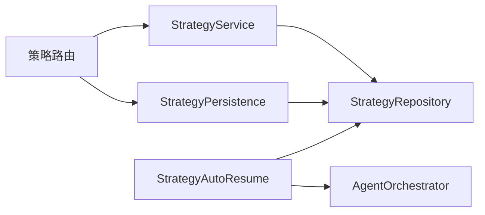

# 策略服务

<cite>
**本文引用的文件列表**
- [python/valuecell/server/services/strategy_service.py](file://python/valuecell/server/services/strategy_service.py)
- [python/valuecell/server/services/strategy_persistence.py](file://python/valuecell/server/services/strategy_persistence.py)
- [python/valuecell/server/services/strategy_autoresume.py](file://python/valuecell/server/services/strategy_autoresume.py)
- [python/valuecell/server/db/repositories/strategy_repository.py](file://python/valuecell/server/db/repositories/strategy_repository.py)
- [python/valuecell/server/db/models/strategy.py](file://python/valuecell/server/db/models/strategy.py)
- [python/valuecell/server/db/models/strategy_detail.py](file://python/valuecell/server/db/models/strategy_detail.py)
- [python/valuecell/server/db/models/strategy_holding.py](file://python/valuecell/server/db/models/strategy_holding.py)
- [python/valuecell/server/db/models/strategy_compose_cycle.py](file://python/valuecell/server/db/models/strategy_compose_cycle.py)
- [python/valuecell/server/api/routers/strategy.py](file://python/valuecell/server/api/routers/strategy.py)
- [python/valuecell/server/api/schemas/strategy.py](file://python/valuecell/server/api/schemas/strategy.py)
- [python/valuecell/core/coordinate/orchestrator.py](file://python/valuecell/core/coordinate/orchestrator.py)
- [python/valuecell/agents/common/trading/models.py](file://python/valuecell/agents/common/trading/models.py)
</cite>

## 目录
1. [引言](#引言)
2. [项目结构](#项目结构)
3. [核心组件](#核心组件)
4. [架构总览](#架构总览)
5. [详细组件分析](#详细组件分析)
6. [依赖关系分析](#依赖关系分析)
7. [性能考量](#性能考量)
8. [故障排查指南](#故障排查指南)
9. [结论](#结论)

## 引言
本文件面向策略服务（StrategyService）的架构设计与实现进行全面阐述，覆盖策略的创建、执行、监控与持久化全流程。重点解析以下方面：
- 策略状态持久化机制：数据库事务管理、数据序列化格式、版本控制策略
- 断点续传与自动恢复：系统重启后的策略执行状态恢复、断点续传与状态一致性
- 服务层调用链：策略创建时服务层与数据库Repository、核心TaskExecutor、Orchestrator的交互
- 并发控制、错误重试与资源隔离：多用户环境下策略执行的稳定性与安全性

## 项目结构
策略服务位于后端Python子项目中，采用分层架构：
- API层：FastAPI路由定义与请求/响应模型
- 服务层：策略查询与展示、持久化写入、自动恢复逻辑
- 数据访问层：SQLAlchemy仓库封装数据库操作
- 模型层：数据库表模型与交易运行时数据模型
- 协调器层：核心执行编排（规划、任务执行、事件流）

图表来源
- [python/valuecell/server/api/routers/strategy.py](file://python/valuecell/server/api/routers/strategy.py#L1-L525)
- [python/valuecell/server/services/strategy_service.py](file://python/valuecell/server/services/strategy_service.py#L1-L415)
- [python/valuecell/server/services/strategy_persistence.py](file://python/valuecell/server/services/strategy_persistence.py#L1-L479)
- [python/valuecell/server/services/strategy_autoresume.py](file://python/valuecell/server/services/strategy_autoresume.py#L1-L150)
- [python/valuecell/server/db/repositories/strategy_repository.py](file://python/valuecell/server/db/repositories/strategy_repository.py#L1-L648)
- [python/valuecell/server/db/models/strategy.py](file://python/valuecell/server/db/models/strategy.py#L1-L74)
- [python/valuecell/server/db/models/strategy_detail.py](file://python/valuecell/server/db/models/strategy_detail.py#L1-L166)
- [python/valuecell/server/db/models/strategy_holding.py](file://python/valuecell/server/db/models/strategy_holding.py#L1-L112)
- [python/valuecell/server/db/models/strategy_compose_cycle.py](file://python/valuecell/server/db/models/strategy_compose_cycle.py#L1-L76)
- [python/valuecell/core/coordinate/orchestrator.py](file://python/valuecell/core/coordinate/orchestrator.py#L1-L644)

章节来源
- [python/valuecell/server/api/routers/strategy.py](file://python/valuecell/server/api/routers/strategy.py#L1-L525)
- [python/valuecell/server/services/strategy_service.py](file://python/valuecell/server/services/strategy_service.py#L1-L415)
- [python/valuecell/server/services/strategy_persistence.py](file://python/valuecell/server/services/strategy_persistence.py#L1-L479)
- [python/valuecell/server/services/strategy_autoresume.py](file://python/valuecell/server/services/strategy_autoresume.py#L1-L150)
- [python/valuecell/server/db/repositories/strategy_repository.py](file://python/valuecell/server/db/repositories/strategy_repository.py#L1-L648)
- [python/valuecell/server/db/models/strategy.py](file://python/valuecell/server/db/models/strategy.py#L1-L74)
- [python/valuecell/server/db/models/strategy_detail.py](file://python/valuecell/server/db/models/strategy_detail.py#L1-L166)
- [python/valuecell/server/db/models/strategy_holding.py](file://python/valuecell/server/db/models/strategy_holding.py#L1-L112)
- [python/valuecell/server/db/models/strategy_compose_cycle.py](file://python/valuecell/server/db/models/strategy_compose_cycle.py#L1-L76)
- [python/valuecell/core/coordinate/orchestrator.py](file://python/valuecell/core/coordinate/orchestrator.py#L1-L644)

## 核心组件
- 策略服务（StrategyService）：提供策略持仓、组合摘要、绩效、周期明细等查询能力，聚合Repository层数据并输出标准化响应模型。
- 策略持久化（StrategyPersistence）：将交易历史、头寸快照、策略摘要、组合周期与指令等写入数据库；提供状态检查与更新、初始资金记录等辅助能力。
- 自动恢复（StrategyAutoResume）：进程启动时扫描“运行中”或“已停止但被标记为取消”的策略，使用原有配置重建会话并恢复执行，同时记录运行状态。
- 仓库（StrategyRepository）：统一的数据库访问接口，封装增删改查、事务回滚、会话生命周期管理。
- 数据模型（Strategy/Detail/Holding/ComposeCycle）：定义持久化表结构、字段类型、唯一约束与时间戳。
- 协调器（AgentOrchestrator）：负责规划、执行与事件流，支持后台生产者-消费者模式，保证连接断开后仍可继续执行。

章节来源
- [python/valuecell/server/services/strategy_service.py](file://python/valuecell/server/services/strategy_service.py#L1-L415)
- [python/valuecell/server/services/strategy_persistence.py](file://python/valuecell/server/services/strategy_persistence.py#L1-L479)
- [python/valuecell/server/services/strategy_autoresume.py](file://python/valuecell/server/services/strategy_autoresume.py#L1-L150)
- [python/valuecell/server/db/repositories/strategy_repository.py](file://python/valuecell/server/db/repositories/strategy_repository.py#L1-L648)
- [python/valuecell/server/db/models/strategy.py](file://python/valuecell/server/db/models/strategy.py#L1-L74)
- [python/valuecell/server/db/models/strategy_detail.py](file://python/valuecell/server/db/models/strategy_detail.py#L1-L166)
- [python/valuecell/server/db/models/strategy_holding.py](file://python/valuecell/server/db/models/strategy_holding.py#L1-L112)
- [python/valuecell/server/db/models/strategy_compose_cycle.py](file://python/valuecell/server/db/models/strategy_compose_cycle.py#L1-L76)
- [python/valuecell/core/coordinate/orchestrator.py](file://python/valuecell/core/coordinate/orchestrator.py#L1-L644)

## 架构总览
策略服务的端到端流程如下：
- 创建阶段：前端提交策略配置，后端通过API路由接收，协调器启动规划与执行，持久化模块写入组合周期、指令、头寸快照与交易历史。
- 运行阶段：持续生成头寸快照与交易历史，服务层按需查询并返回给前端。
- 监控阶段：服务层聚合数据，提供持仓、组合摘要、绩效与周期明细等接口。
- 恢复阶段：进程重启后，自动恢复模块扫描“运行中/被取消但应恢复”的策略，注入原配置并重新调度执行。

图表来源
- [python/valuecell/server/api/routers/strategy.py](file://python/valuecell/server/api/routers/strategy.py#L1-L525)
- [python/valuecell/server/services/strategy_service.py](file://python/valuecell/server/services/strategy_service.py#L1-L415)
- [python/valuecell/server/services/strategy_persistence.py](file://python/valuecell/server/services/strategy_persistence.py#L1-L479)
- [python/valuecell/server/db/repositories/strategy_repository.py](file://python/valuecell/server/db/repositories/strategy_repository.py#L1-L648)
- [python/valuecell/core/coordinate/orchestrator.py](file://python/valuecell/core/coordinate/orchestrator.py#L1-L644)

## 详细组件分析

### 策略持久化机制（strategy_persistence.py）
该模块负责将运行时产生的交易历史、头寸快照、策略摘要、组合周期与指令等写入数据库，并提供状态检查与更新能力。

- 交易历史持久化
  - 输入：交易历史条目（包含类型、方向、杠杆、数量、价格、未实现/已实现盈亏、手续费、持有时间、事件/入场/出场时间、备注等）
  - 处理：映射类型与方向，解析时间戳，构造StrategyDetail记录，插入数据库
  - 错误处理：异常日志记录，返回None或False
  - 关键路径参考：[persist_trade_history](file://python/valuecell/server/services/strategy_persistence.py#L12-L131)

- 组合周期与指令持久化
  - 组合周期：记录compose_id、compose_time、cycle_index、rationale
  - 指令：记录instruction_id、symbol、action、side、quantity、leverage、note
  - 关键路径参考：
    - [persist_compose_cycle](file://python/valuecell/server/services/strategy_persistence.py#L304-L334)
    - [persist_instructions](file://python/valuecell/server/services/strategy_persistence.py#L337-L371)

- 头寸快照持久化
  - 输入：PortfolioView（包含strategy_id、ts、positions、总值、未实现/已实现盈亏、总敞口等）
  - 处理：先写入组合快照，再对每个symbol写入StrategyHolding记录
  - 关键路径参考：[persist_portfolio_view](file://python/valuecell/server/services/strategy_persistence.py#L133-L226)

- 策略摘要与状态持久化
  - 策略摘要：将StrategySummary合并到策略元数据JSON中，避免重建缺失策略
  - 状态检查与更新：检查策略是否存在且处于运行中，设置/标记停止状态
  - 初始资金：更新trading_config.initial_capital或写入strategy_metadata
  - 关键路径参考：
    - [persist_strategy_summary](file://python/valuecell/server/services/strategy_persistence.py#L228-L258)
    - [strategy_running](file://python/valuecell/server/services/strategy_persistence.py#L260-L272)
    - [set_strategy_status](file://python/valuecell/server/services/strategy_persistence.py#L274-L291)
    - [mark_strategy_stopped](file://python/valuecell/server/services/strategy_persistence.py#L293-L302)
    - [update_initial_capital](file://python/valuecell/server/services/strategy_persistence.py#L374-L422)
    - [set_initial_capital_metadata](file://python/valuecell/server/services/strategy_persistence.py#L424-L479)

- 数据序列化与版本控制
  - JSON字段：策略配置与元数据以JSON存储，便于扩展与向后兼容
  - 时间戳与时区：统一使用UTC时间戳，避免跨时区歧义
  - 唯一性约束：头寸快照按(strategy_id, symbol, snapshot_ts)去重，交易记录按(strategy_id, trade_id)去重
  - 版本控制策略：通过字段新增与可选字段保持向前兼容；关键字段变更通过迁移脚本或应用内合并策略处理

- 事务管理与错误处理
  - 仓库层封装事务：成功提交、失败回滚，异常捕获并返回None/False
  - 服务层幂等：存在性检查与跳过策略不存在场景的日志提示
  - 关键路径参考：[StrategyRepository.upsert_strategy](file://python/valuecell/server/db/repositories/strategy_repository.py#L76-L122)、[StrategyRepository.add_detail_item](file://python/valuecell/server/db/repositories/strategy_repository.py#L315-L379)

图表来源
- [python/valuecell/server/services/strategy_persistence.py](file://python/valuecell/server/services/strategy_persistence.py#L12-L479)
- [python/valuecell/server/db/repositories/strategy_repository.py](file://python/valuecell/server/db/repositories/strategy_repository.py#L1-L648)

章节来源
- [python/valuecell/server/services/strategy_persistence.py](file://python/valuecell/server/services/strategy_persistence.py#L1-L479)
- [python/valuecell/server/db/repositories/strategy_repository.py](file://python/valuecell/server/db/repositories/strategy_repository.py#L1-L648)
- [python/valuecell/server/db/models/strategy_detail.py](file://python/valuecell/server/db/models/strategy_detail.py#L1-L166)
- [python/valuecell/server/db/models/strategy_holding.py](file://python/valuecell/server/db/models/strategy_holding.py#L1-L112)
- [python/valuecell/server/db/models/strategy_compose_cycle.py](file://python/valuecell/server/db/models/strategy_compose_cycle.py#L1-L76)

### 自动恢复机制（strategy_autoresume.py）
该模块在进程启动时扫描“运行中”或“已停止但标记为取消”的策略，使用其原始配置重建会话并恢复执行，同时记录运行状态。

- 扫描与筛选
  - 使用仓库层按状态列出策略，过滤出应恢复的候选
  - 关键路径参考：[list_strategies_by_status](file://python/valuecell/server/db/repositories/strategy_repository.py#L51-L71)、[_should_resume](file://python/valuecell/server/services/strategy_autoresume.py#L130-L150)

- 恢复流程
  - 解析策略配置为UserRequest，注入strategy_id，构造UserInput
  - 调用AgentOrchestrator.process_user_input进行恢复执行
  - 监听流式事件，提取状态内容并更新策略状态
  - 关键路径参考：[auto_resume_strategies](file://python/valuecell/server/services/strategy_autoresume.py#L45-L83)、[_resume_one](file://python/valuecell/server/services/strategy_autoresume.py#L85-L128)

- 断点续传与状态一致性
  - 通过注入strategy_id，底层运行时可复用原有组合周期与头寸快照，实现幂等初始化
  - 对于“取消”状态的策略，允许自动恢复，体现业务语义上的“计划内中断”
  - 关键路径参考：[UserRequest.trading_config.strategy_id](file://python/valuecell/agents/common/trading/models.py#L207-L210)

图表来源
- [python/valuecell/server/services/strategy_autoresume.py](file://python/valuecell/server/services/strategy_autoresume.py#L1-L150)
- [python/valuecell/server/db/repositories/strategy_repository.py](file://python/valuecell/server/db/repositories/strategy_repository.py#L1-L648)
- [python/valuecell/core/coordinate/orchestrator.py](file://python/valuecell/core/coordinate/orchestrator.py#L1-L644)
- [python/valuecell/server/services/strategy_persistence.py](file://python/valuecell/server/services/strategy_persistence.py#L1-L479)

章节来源
- [python/valuecell/server/services/strategy_autoresume.py](file://python/valuecell/server/services/strategy_autoresume.py#L1-L150)
- [python/valuecell/server/db/repositories/strategy_repository.py](file://python/valuecell/server/db/repositories/strategy_repository.py#L1-L648)
- [python/valuecell/core/coordinate/orchestrator.py](file://python/valuecell/core/coordinate/orchestrator.py#L1-L644)
- [python/valuecell/agents/common/trading/models.py](file://python/valuecell/agents/common/trading/models.py#L1-L950)

### 策略服务（StrategyService）与API交互
- 查询接口
  - 持仓：获取最新头寸快照与组合快照，组装为标准化结构
  - 组合摘要：计算总价值、未实现/已实现盈亏、总回报率等
  - 绩效：从配置与元数据推导策略类型、交易模式、初始资金、提示词等
  - 周期明细：按compose周期聚合指令与执行详情
- 关键路径参考：
  - [get_strategy_holding](file://python/valuecell/server/services/strategy_service.py#L27-L104)
  - [get_strategy_portfolio_summary](file://python/valuecell/server/services/strategy_service.py#L106-L154)
  - [get_strategy_performance](file://python/valuecell/server/services/strategy_service.py#L200-L301)
  - [get_strategy_detail](file://python/valuecell/server/services/strategy_service.py#L302-L415)
- API路由与响应模型
  - 路由：/strategies/holding、/portfolio_summary、/performance、/detail、/stop
  - 响应模型：StrategyHoldingData、StrategyPortfolioSummaryData、StrategyPerformanceData、StrategyCycleDetail等
  - 关键路径参考：
    - [策略路由](file://python/valuecell/server/api/routers/strategy.py#L1-L525)
    - [策略Schema](file://python/valuecell/server/api/schemas/strategy.py#L1-L276)

图表来源
- [python/valuecell/server/services/strategy_service.py](file://python/valuecell/server/services/strategy_service.py#L1-L415)
- [python/valuecell/server/db/repositories/strategy_repository.py](file://python/valuecell/server/db/repositories/strategy_repository.py#L1-L648)
- [python/valuecell/server/api/routers/strategy.py](file://python/valuecell/server/api/routers/strategy.py#L1-L525)
- [python/valuecell/server/api/schemas/strategy.py](file://python/valuecell/server/api/schemas/strategy.py#L1-L276)

章节来源
- [python/valuecell/server/services/strategy_service.py](file://python/valuecell/server/services/strategy_service.py#L1-L415)
- [python/valuecell/server/api/routers/strategy.py](file://python/valuecell/server/api/routers/strategy.py#L1-L525)
- [python/valuecell/server/api/schemas/strategy.py](file://python/valuecell/server/api/schemas/strategy.py#L1-L276)

### 服务层调用链示例（策略创建）
策略创建时的服务层调用链如下：
- API路由接收请求，构造UserInput并调用AgentOrchestrator
- 协调器内部启动规划与执行，期间通过持久化模块写入组合周期、指令、头寸快照与交易历史
- 查询侧通过StrategyService聚合数据，返回给API路由

图表来源
- [python/valuecell/server/api/routers/strategy.py](file://python/valuecell/server/api/routers/strategy.py#L1-L525)
- [python/valuecell/core/coordinate/orchestrator.py](file://python/valuecell/core/coordinate/orchestrator.py#L1-L644)
- [python/valuecell/server/services/strategy_persistence.py](file://python/valuecell/server/services/strategy_persistence.py#L1-L479)
- [python/valuecell/server/db/repositories/strategy_repository.py](file://python/valuecell/server/db/repositories/strategy_repository.py#L1-L648)
- [python/valuecell/server/services/strategy_service.py](file://python/valuecell/server/services/strategy_service.py#L1-L415)

## 依赖关系分析
- 组件耦合
  - StrategyService高度依赖StrategyRepository提供的查询能力
  - StrategyPersistence依赖StrategyRepository进行写入与更新
  - StrategyAutoResume依赖StrategyRepository扫描策略与AgentOrchestrator恢复执行
- 外部依赖
  - SQLAlchemy：ORM与事务管理
  - FastAPI：路由与异步处理
  - loguru：日志记录
- 循环依赖
  - 未发现直接循环依赖；各模块职责清晰，通过接口与方法边界解耦

图表来源
- [python/valuecell/server/api/routers/strategy.py](file://python/valuecell/server/api/routers/strategy.py#L1-L525)
- [python/valuecell/server/services/strategy_service.py](file://python/valuecell/server/services/strategy_service.py#L1-L415)
- [python/valuecell/server/services/strategy_persistence.py](file://python/valuecell/server/services/strategy_persistence.py#L1-L479)
- [python/valuecell/server/services/strategy_autoresume.py](file://python/valuecell/server/services/strategy_autoresume.py#L1-L150)
- [python/valuecell/server/db/repositories/strategy_repository.py](file://python/valuecell/server/db/repositories/strategy_repository.py#L1-L648)
- [python/valuecell/core/coordinate/orchestrator.py](file://python/valuecell/core/coordinate/orchestrator.py#L1-L644)

章节来源
- [python/valuecell/server/api/routers/strategy.py](file://python/valuecell/server/api/routers/strategy.py#L1-L525)
- [python/valuecell/server/services/strategy_service.py](file://python/valuecell/server/services/strategy_service.py#L1-L415)
- [python/valuecell/server/services/strategy_persistence.py](file://python/valuecell/server/services/strategy_persistence.py#L1-L479)
- [python/valuecell/server/services/strategy_autoresume.py](file://python/valuecell/server/services/strategy_autoresume.py#L1-L150)
- [python/valuecell/server/db/repositories/strategy_repository.py](file://python/valuecell/server/db/repositories/strategy_repository.py#L1-L648)
- [python/valuecell/core/coordinate/orchestrator.py](file://python/valuecell/core/coordinate/orchestrator.py#L1-L644)

## 性能考量
- 查询优化
  - 使用索引字段（strategy_id、symbol、compose_id、instruction_id、snapshot_ts）减少全表扫描
  - 分页与降序排序限制返回数量，避免大结果集
- 写入优化
  - 批量插入指令（persist_instructions）逐条处理并统计成功数，降低单次事务成本
  - 头寸快照按symbol逐条写入，避免大事务
- 并发与资源隔离
  - 协调器采用后台生产者-消费者模式，连接断开不影响执行
  - 仓库层每个操作独立获取/关闭会话，避免长事务占用连接池
- 日志与可观测性
  - 统一使用loguru记录异常与关键事件，便于定位性能瓶颈

## 故障排查指南
- 策略不存在
  - 现象：写入返回None/False或查询为空
  - 排查：确认strategy_id是否正确；检查仓库层get_strategy_by_strategy_id
  - 参考路径：[get_strategy_by_strategy_id](file://python/valuecell/server/db/repositories/strategy_repository.py#L36-L50)
- 事务回滚
  - 现象：写入失败，数据库无变更
  - 排查：查看仓库层rollback分支；检查字段类型与唯一约束冲突
  - 参考路径：[add_detail_item](file://python/valuecell/server/db/repositories/strategy_repository.py#L315-L379)
- 自动恢复失败
  - 现象：恢复任务被跳过或异常
  - 排查：检查策略状态与元数据；确认UserRequest解析成功；关注日志异常
  - 参考路径：[_resume_one](file://python/valuecell/server/services/strategy_autoresume.py#L85-L128)
- 响应为空或404
  - 现象：查询接口返回空数据或404
  - 排查：确认策略存在；检查StrategyService的空值处理逻辑
  - 参考路径：[get_strategy_performance](file://python/valuecell/server/services/strategy_service.py#L200-L301)

章节来源
- [python/valuecell/server/db/repositories/strategy_repository.py](file://python/valuecell/server/db/repositories/strategy_repository.py#L1-L648)
- [python/valuecell/server/services/strategy_autoresume.py](file://python/valuecell/server/services/strategy_autoresume.py#L1-L150)
- [python/valuecell/server/services/strategy_service.py](file://python/valuecell/server/services/strategy_service.py#L1-L415)

## 结论
策略服务通过清晰的分层设计与完善的持久化机制，实现了策略从创建到执行、监控与恢复的全生命周期管理。策略持久化采用JSON字段与唯一约束保障数据完整性与版本兼容；自动恢复模块在进程重启后能够可靠地恢复策略执行状态，结合幂等初始化实现断点续传与状态一致性。服务层通过标准化查询接口与响应模型，为前端提供了稳定的策略监控能力。建议在生产环境中进一步完善：
- 数据库索引与查询计划分析
- 事务超时与连接池监控
- 自动恢复失败的重试与告警策略
- 更细粒度的并发控制与资源隔离