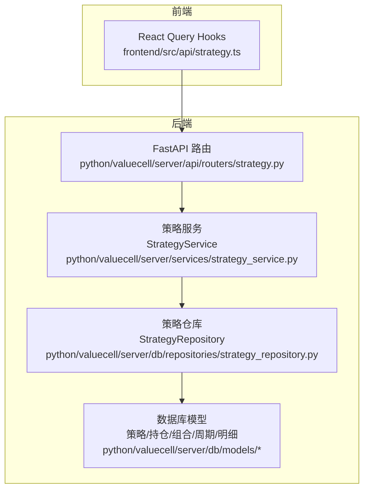
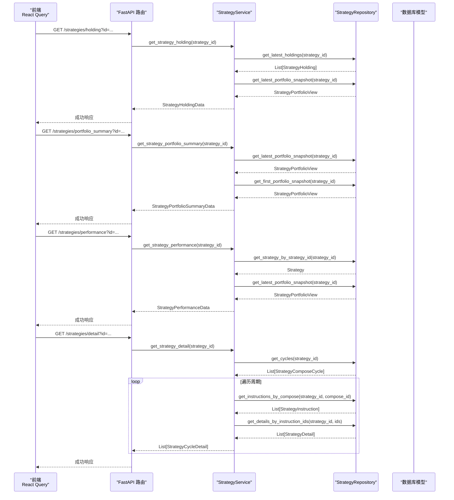
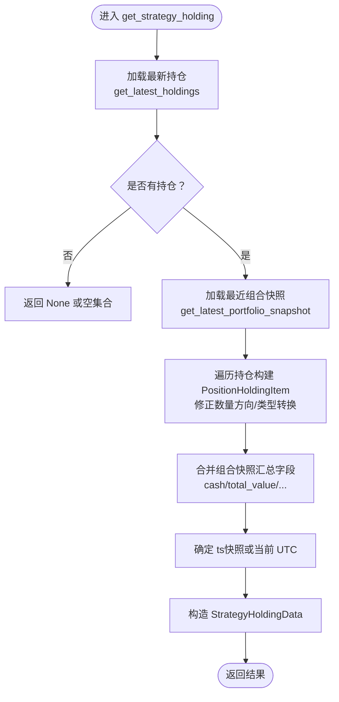
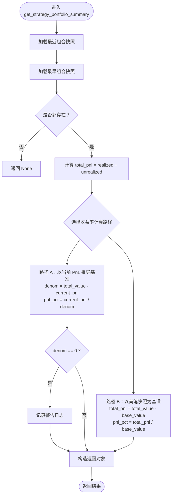
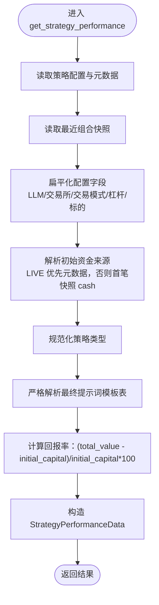
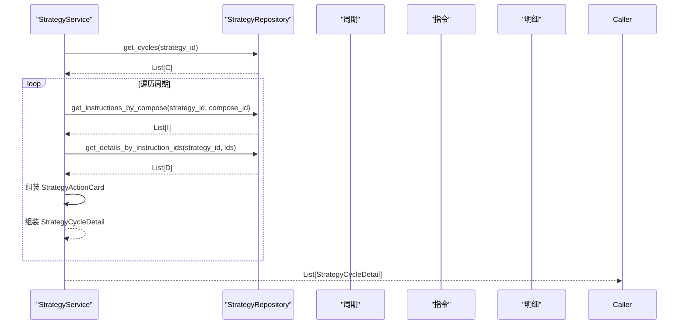
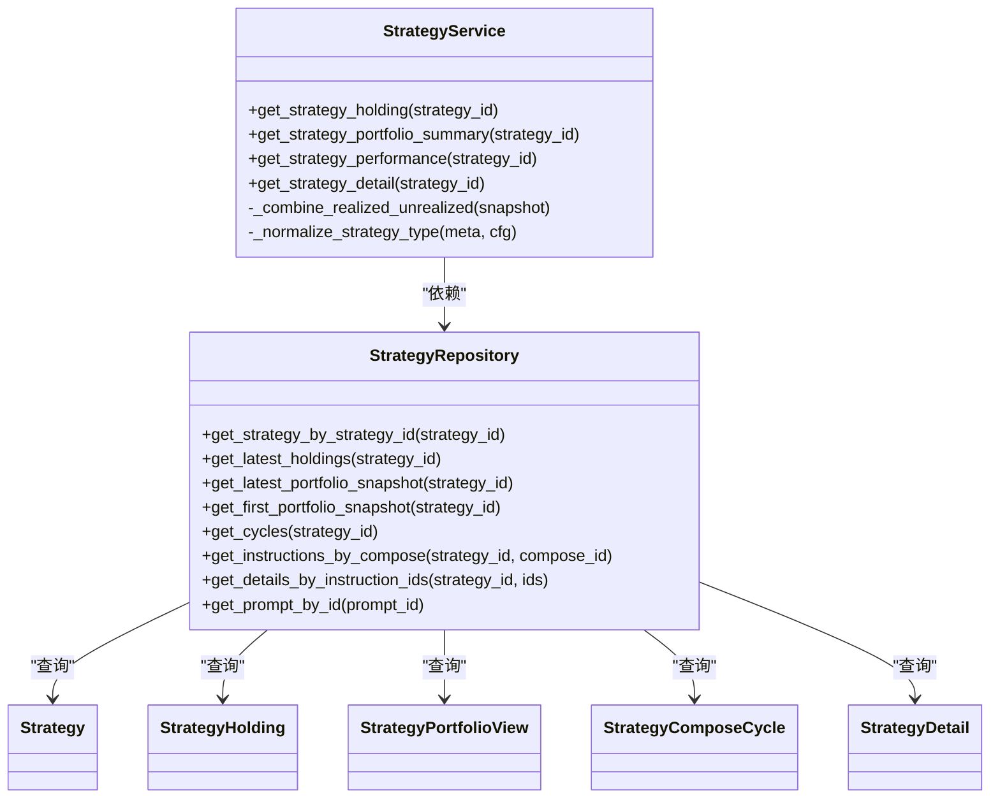

# 策略核心逻辑

<cite>
**本文引用的文件**
- [python/valuecell/server/services/strategy_service.py](file://python/valuecell/server/services/strategy_service.py)
- [python/valuecell/server/db/repositories/strategy_repository.py](file://python/valuecell/server/db/repositories/strategy_repository.py)
- [python/valuecell/server/api/schemas/strategy.py](file://python/valuecell/server/api/schemas/strategy.py)
- [python/valuecell/server/api/routers/strategy.py](file://python/valuecell/server/api/routers/strategy.py)
- [python/valuecell/server/db/models/strategy.py](file://python/valuecell/server/db/models/strategy.py)
- [python/valuecell/server/db/models/strategy_holding.py](file://python/valuecell/server/db/models/strategy_holding.py)
- [python/valuecell/server/db/models/strategy_portfolio.py](file://python/valuecell/server/db/models/strategy_portfolio.py)
- [python/valuecell/server/db/models/strategy_detail.py](file://python/valuecell/server/db/models/strategy_detail.py)
- [python/valuecell/server/db/models/strategy_compose_cycle.py](file://python/valuecell/server/db/models/strategy_compose_cycle.py)
- [frontend/src/api/strategy.ts](file://frontend/src/api/strategy.ts)
</cite>

## 目录
1. [引言](#引言)
2. [项目结构](#项目结构)
3. [核心组件](#核心组件)
4. [架构总览](#架构总览)
5. [详细组件分析](#详细组件分析)
6. [依赖关系分析](#依赖关系分析)
7. [性能考量](#性能考量)
8. [故障排查指南](#故障排查指南)
9. [结论](#结论)
10. [附录](#附录)

## 引言
本文件系统性梳理 StrategyService 中实现的策略核心逻辑，围绕以下四个关键方法展开：
- get_strategy_holding：策略持仓数据的提取与转换
- get_strategy_portfolio_summary：投资组合摘要的生成与收益率计算
- get_strategy_performance：策略性能概览与初始资金来源解析
- get_strategy_detail：交易周期详情的组装与动作卡片构建

文档将深入解释服务层如何通过策略仓库（Repository）从数据库读取数据，并将底层模型转换为 API 响应模型；同时对策略持仓计算、摘要生成、收益率双路径计算、周期详情组装进行逐项剖析，并给出前端调用示例与字段业务含义说明。

## 项目结构
后端采用分层设计：
- API 路由层：定义 HTTP 接口与参数校验，调用服务层并返回统一响应模型
- 服务层：封装策略数据聚合与转换逻辑，协调仓库访问
- 仓库层：提供数据库访问接口，屏蔽 SQLAlchemy 细节
- 数据模型层：定义策略、持仓、组合快照、周期与明细等实体
- 前端：通过 React Query 发起请求，消费后端策略相关接口

图表来源
- [python/valuecell/server/api/routers/strategy.py](file://python/valuecell/server/api/routers/strategy.py#L1-L525)
- [python/valuecell/server/services/strategy_service.py](file://python/valuecell/server/services/strategy_service.py#L1-L415)
- [python/valuecell/server/db/repositories/strategy_repository.py](file://python/valuecell/server/db/repositories/strategy_repository.py#L1-L648)
- [python/valuecell/server/db/models/strategy.py](file://python/valuecell/server/db/models/strategy.py#L1-L74)
- [python/valuecell/server/db/models/strategy_holding.py](file://python/valuecell/server/db/models/strategy_holding.py#L1-L112)
- [python/valuecell/server/db/models/strategy_portfolio.py](file://python/valuecell/server/db/models/strategy_portfolio.py#L1-L122)
- [python/valuecell/server/db/models/strategy_detail.py](file://python/valuecell/server/db/models/strategy_detail.py#L1-L166)
- [python/valuecell/server/db/models/strategy_compose_cycle.py](file://python/valuecell/server/db/models/strategy_compose_cycle.py#L1-L76)
- [frontend/src/api/strategy.ts](file://frontend/src/api/strategy.ts#L1-L179)

章节来源
- [python/valuecell/server/api/routers/strategy.py](file://python/valuecell/server/api/routers/strategy.py#L1-L525)
- [python/valuecell/server/services/strategy_service.py](file://python/valuecell/server/services/strategy_service.py#L1-L415)
- [python/valuecell/server/db/repositories/strategy_repository.py](file://python/valuecell/server/db/repositories/strategy_repository.py#L1-L648)
- [frontend/src/api/strategy.ts](file://frontend/src/api/strategy.ts#L1-L179)

## 核心组件
- 策略服务（StrategyService）
  - 提供四大核心方法：get_strategy_holding、get_strategy_portfolio_summary、get_strategy_performance、get_strategy_detail
  - 负责数据聚合、类型转换、异常兜底与业务规则（如收益率双路径计算、初始资金来源解析）
- 策略仓库（StrategyRepository）
  - 封装数据库访问：最新持仓、组合快照、周期与指令、明细等
  - 提供会话管理与异常处理
- API 路由（FastAPI）
  - 定义接口契约、参数校验、HTTP 状态码与统一响应包装
- 数据模型（SQLAlchemy）
  - 策略、策略持仓、组合快照、周期、明细等实体
- 前端 Hook
  - 使用 React Query 访问后端接口，自动轮询刷新

章节来源
- [python/valuecell/server/services/strategy_service.py](file://python/valuecell/server/services/strategy_service.py#L1-L415)
- [python/valuecell/server/db/repositories/strategy_repository.py](file://python/valuecell/server/db/repositories/strategy_repository.py#L1-L648)
- [python/valuecell/server/api/routers/strategy.py](file://python/valuecell/server/api/routers/strategy.py#L1-L525)
- [python/valuecell/server/db/models/strategy.py](file://python/valuecell/server/db/models/strategy.py#L1-L74)
- [python/valuecell/server/db/models/strategy_holding.py](file://python/valuecell/server/db/models/strategy_holding.py#L1-L112)
- [python/valuecell/server/db/models/strategy_portfolio.py](file://python/valuecell/server/db/models/strategy_portfolio.py#L1-L122)
- [python/valuecell/server/db/models/strategy_detail.py](file://python/valuecell/server/db/models/strategy_detail.py#L1-L166)
- [python/valuecell/server/db/models/strategy_compose_cycle.py](file://python/valuecell/server/db/models/strategy_compose_cycle.py#L1-L76)
- [frontend/src/api/strategy.ts](file://frontend/src/api/strategy.ts#L1-L179)

## 架构总览
下图展示从前端到数据库的完整调用链路与数据流向。

图表来源
- [python/valuecell/server/api/routers/strategy.py](file://python/valuecell/server/api/routers/strategy.py#L212-L356)
- [python/valuecell/server/services/strategy_service.py](file://python/valuecell/server/services/strategy_service.py#L27-L415)
- [python/valuecell/server/db/repositories/strategy_repository.py](file://python/valuecell/server/db/repositories/strategy_repository.py#L204-L510)

## 详细组件分析

### 方法一：get_strategy_holding（策略持仓）
- 输入：strategy_id
- 关键步骤
  - 通过仓库获取最新快照时间戳对应的全部持仓记录
  - 获取最近一次组合快照以补充现金、总价值、未实现盈亏等汇总信息
  - 对每个持仓项进行类型转换与方向修正（多头正数、空头负数）
  - 合成时间戳（优先使用快照时间，否则回退到当前 UTC）
  - 构造响应模型 StrategyHoldingData，包含现金、总值、未实现盈亏、总实现盈亏、总杠杆、净/总敞口等
- 数据来源
  - 持仓表：策略持仓快照
  - 组合视图：最近一次组合快照
- 字段业务含义
  - positions：按 symbol 排序的持仓列表，含符号、数量（多头正、空头负）、均价、未实现盈亏、杠杆、交易类型等
  - ts/cash/total_value/total_unrealized_pnl/total_realized_pnl/gross_exposure/net_exposure/available_cash：来自组合快照的聚合指标
- 复杂度
  - 时间复杂度 O(n)，n 为持仓条目数
  - 空间复杂度 O(n)

图表来源
- [python/valuecell/server/services/strategy_service.py](file://python/valuecell/server/services/strategy_service.py#L27-L104)
- [python/valuecell/server/db/repositories/strategy_repository.py](file://python/valuecell/server/db/repositories/strategy_repository.py#L204-L232)

章节来源
- [python/valuecell/server/services/strategy_service.py](file://python/valuecell/server/services/strategy_service.py#L27-L104)
- [python/valuecell/server/db/repositories/strategy_repository.py](file://python/valuecell/server/db/repositories/strategy_repository.py#L204-L232)
- [python/valuecell/server/api/schemas/strategy.py](file://python/valuecell/server/api/schemas/strategy.py#L55-L102)

### 方法二：get_strategy_portfolio_summary（投资组合摘要）
- 输入：strategy_id
- 关键步骤
  - 获取最近一次组合快照与最早一次组合快照
  - 计算总 PnL：未实现 + 已实现（内部通过辅助函数组合）
  - 收益率计算采用两条路径（二选一）：
    - 路径 A：以“当前 PnL”推导基准，分母为 total_value - current_pnl
    - 路径 B：以“首笔快照的 total_value”作为基准，分母为 base_value
  - 若分母为 0，记录警告日志并返回 0%
  - 构造 StrategyPortfolioSummaryData 返回
- 数据来源
  - 组合快照表：最近与最早两次快照
- 字段业务含义
  - total_pnl_pct：基于上述两条路径之一计算的百分比
  - gross_exposure/net_exposure：总/净敞口
- 复杂度
  - 时间复杂度 O(1)
  - 空间复杂度 O(1)

图表来源
- [python/valuecell/server/services/strategy_service.py](file://python/valuecell/server/services/strategy_service.py#L106-L154)
- [python/valuecell/server/services/strategy_service.py](file://python/valuecell/server/services/strategy_service.py#L156-L160)
- [python/valuecell/server/db/repositories/strategy_repository.py](file://python/valuecell/server/db/repositories/strategy_repository.py#L258-L290)

章节来源
- [python/valuecell/server/services/strategy_service.py](file://python/valuecell/server/services/strategy_service.py#L106-L154)
- [python/valuecell/server/services/strategy_service.py](file://python/valuecell/server/services/strategy_service.py#L156-L160)
- [python/valuecell/server/db/repositories/strategy_repository.py](file://python/valuecell/server/db/repositories/strategy_repository.py#L258-L290)
- [python/valuecell/server/api/schemas/strategy.py](file://python/valuecell/server/api/schemas/strategy.py#L107-L129)

### 方法三：get_strategy_performance（策略性能）
- 输入：strategy_id
- 关键步骤
  - 读取策略配置与元数据，扁平化提取 LLM 提供商、模型、交易所、策略类型、交易模式、最大杠杆、标的等
  - 解析初始资金来源：
    - LIVE 模式优先从元数据读取初始资本；若缺失则回退到首笔快照的 cash
    - 非 LIVE 模式直接从配置读取
  - 解析策略类型：从元数据、配置或代理名称中规范化
  - 解析最终提示词：严格从模板表读取，不回退
  - 计算回报率：(total_value - initial_capital) / initial_capital * 100
  - 构造 StrategyPerformanceData 返回
- 数据来源
  - 策略表：config 与 strategy_metadata
  - 组合快照表：total_value
  - 提示词模板表：strict fetch
- 字段业务含义
  - initial_capital：初始资金来源解析后的数值
  - return_rate_pct：回报率
  - llm_provider/model_id/exchange_id：配置/元数据扁平化字段
  - strategy_type/trading_mode/max_leverage/symbols/prompt_name/prompt：策略配置与提示词
- 复杂度
  - 时间复杂度 O(1)
  - 空间复杂度 O(1)

图表来源
- [python/valuecell/server/services/strategy_service.py](file://python/valuecell/server/services/strategy_service.py#L200-L301)
- [python/valuecell/server/db/repositories/strategy_repository.py](file://python/valuecell/server/db/repositories/strategy_repository.py#L36-L50)
- [python/valuecell/server/db/repositories/strategy_repository.py](file://python/valuecell/server/db/repositories/strategy_repository.py#L567-L586)

章节来源
- [python/valuecell/server/services/strategy_service.py](file://python/valuecell/server/services/strategy_service.py#L200-L301)
- [python/valuecell/server/db/repositories/strategy_repository.py](file://python/valuecell/server/db/repositories/strategy_repository.py#L36-L50)
- [python/valuecell/server/db/repositories/strategy_repository.py](file://python/valuecell/server/db/repositories/strategy_repository.py#L567-L586)
- [python/valuecell/server/api/schemas/strategy.py](file://python/valuecell/server/api/schemas/strategy.py#L241-L275)

### 方法四：get_strategy_detail（交易周期详情）
- 输入：strategy_id
- 关键步骤
  - 获取所有 compose 周期（按时间倒序）
  - 对每个周期：
    - 查询该周期内的指令集（按 symbol 排序）
    - 依据指令 ID 批量查询执行明细（按 instruction_id 映射）
    - 组装动作卡片（StrategyActionCard）：包含指令与执行细节（入场/出场价格、时间、持有时长、手续费、已实现盈亏及百分比、名义金额等）
    - 生成周期详情（StrategyCycleDetail）：包含 compose_id、周期索引、创建时间、理由与动作卡片列表
- 数据来源
  - 周期表：compose 周期
  - 指令表：周期内指令
  - 明细表：按指令 ID 聚合的执行明细
- 字段业务含义
  - action_display：将 action 名称标准化为可读标签（如 open_long -> OPEN LONG）
  - holding_time_ms：根据 entry_at/exit_at 计算或明细中的 holding_ms
  - realized_pnl/realized_pnl_pct：已实现盈亏与百分比
- 复杂度
  - 时间复杂度 O(C*(I+D))，C 为周期数，I 为每周期指令数，D 为明细数
  - 空间复杂度 O(C*I + D)

图表来源
- [python/valuecell/server/services/strategy_service.py](file://python/valuecell/server/services/strategy_service.py#L302-L415)
- [python/valuecell/server/db/repositories/strategy_repository.py](file://python/valuecell/server/db/repositories/strategy_repository.py#L448-L510)

章节来源
- [python/valuecell/server/services/strategy_service.py](file://python/valuecell/server/services/strategy_service.py#L302-L415)
- [python/valuecell/server/db/repositories/strategy_repository.py](file://python/valuecell/server/db/repositories/strategy_repository.py#L448-L510)
- [python/valuecell/server/api/schemas/strategy.py](file://python/valuecell/server/api/schemas/strategy.py#L132-L185)

### 服务层与数据库层交互模式
- 会话管理
  - 仓库在每次操作中获取会话，必要时关闭，避免连接泄漏
- 查询模式
  - 最新持仓：先查最新快照时间，再按时间过滤
  - 组合快照：支持升序/降序与 limit
  - 周期/指令/明细：按策略 ID 与 compose_id/ids 进行关联查询
- 转换与异常处理
  - 服务层负责将数据库数值型字段转换为浮点或 None，避免上游报错
  - 对空值、除零、类型不匹配等情况进行保护性处理
- 性能优化建议
  - 对高频查询（如最新持仓）可考虑缓存最近快照时间
  - 对明细批量查询使用 in_ 条件减少往返
  - 对周期/指令/明细的映射使用字典加速

章节来源
- [python/valuecell/server/db/repositories/strategy_repository.py](file://python/valuecell/server/db/repositories/strategy_repository.py#L30-L50)
- [python/valuecell/server/db/repositories/strategy_repository.py](file://python/valuecell/server/db/repositories/strategy_repository.py#L204-L232)
- [python/valuecell/server/db/repositories/strategy_repository.py](file://python/valuecell/server/db/repositories/strategy_repository.py#L233-L290)
- [python/valuecell/server/db/repositories/strategy_repository.py](file://python/valuecell/server/db/repositories/strategy_repository.py#L448-L510)

## 依赖关系分析
- 类关系与职责
  - StrategyService：策略数据聚合与转换
  - StrategyRepository：数据库访问与会话管理
  - API 路由：接口契约与统一响应
  - 数据模型：策略、持仓、组合快照、周期、明细
- 依赖图

图表来源
- [python/valuecell/server/services/strategy_service.py](file://python/valuecell/server/services/strategy_service.py#L1-L415)
- [python/valuecell/server/db/repositories/strategy_repository.py](file://python/valuecell/server/db/repositories/strategy_repository.py#L1-L648)
- [python/valuecell/server/db/models/strategy.py](file://python/valuecell/server/db/models/strategy.py#L1-L74)
- [python/valuecell/server/db/models/strategy_holding.py](file://python/valuecell/server/db/models/strategy_holding.py#L1-L112)
- [python/valuecell/server/db/models/strategy_portfolio.py](file://python/valuecell/server/db/models/strategy_portfolio.py#L1-L122)
- [python/valuecell/server/db/models/strategy_compose_cycle.py](file://python/valuecell/server/db/models/strategy_compose_cycle.py#L1-L76)
- [python/valuecell/server/db/models/strategy_detail.py](file://python/valuecell/server/db/models/strategy_detail.py#L1-L166)

章节来源
- [python/valuecell/server/services/strategy_service.py](file://python/valuecell/server/services/strategy_service.py#L1-L415)
- [python/valuecell/server/db/repositories/strategy_repository.py](file://python/valuecell/server/db/repositories/strategy_repository.py#L1-L648)

## 性能考量
- 查询优化
  - 最新持仓与组合快照查询通过时间戳过滤，避免全表扫描
  - 批量明细查询使用 in_ 条件，减少多次往返
- 内存与序列化
  - 服务层对数值字段进行安全转换，避免异常导致的序列化失败
  - 对空值与 None 的处理减少前端额外判断
- 缓存与限流
  - 前端使用 React Query 自动轮询，建议结合后端缓存策略降低数据库压力
- 可扩展性
  - 周期/指令/明细的映射采用字典，便于后续扩展更多字段

[本节为通用指导，无需列出具体文件来源]

## 故障排查指南
- 常见问题与定位
  - 无持仓/无摘要：检查是否存在最新组合快照与持仓快照；确认策略 ID 是否正确
  - 收益率异常为 0%：检查分母是否为 0（路径 A）或初始资金是否为空（路径 B）
  - 初始资金来源错误：确认 LIVE 模式下元数据是否设置，非 LIVE 模式下配置是否正确
  - 周期详情为空：确认周期、指令与明细是否齐全，指令 ID 是否一致
- 日志与异常
  - 服务层对除零与类型转换异常进行保护，必要时记录警告日志
  - API 层对 404/400/500 进行明确区分与返回
- 建议排查步骤
  - 先验证策略是否存在与状态正常
  - 再验证最近快照与历史快照是否生成
  - 最后核对周期、指令与明细的数据一致性

章节来源
- [python/valuecell/server/services/strategy_service.py](file://python/valuecell/server/services/strategy_service.py#L123-L142)
- [python/valuecell/server/api/routers/strategy.py](file://python/valuecell/server/api/routers/strategy.py#L212-L356)

## 结论
StrategyService 将底层数据库模型与 API 响应模型进行解耦，通过策略仓库完成高效的数据访问与转换。四个核心方法分别覆盖了持仓、摘要、性能与周期详情的完整链路，既保证了业务逻辑的清晰性，也兼顾了异常处理与性能优化。前端通过 React Query 以轮询方式获取实时数据，配合统一响应模型，形成完整的策略数据可视化闭环。

[本节为总结性内容，无需列出具体文件来源]

## 附录

### 前端调用示例与字段说明
- 获取策略列表
  - 请求：GET /strategies
  - 响应：包含策略数组与统计信息
  - 字段：strategy_id、strategy_name、strategy_type、status、stop_reason、trading_mode、total_pnl、total_pnl_pct、created_at、exchange_id、model_id
- 获取策略持仓
  - 请求：GET /strategies/holding?id=STRATEGY_ID
  - 响应：按 symbol 排序的持仓数组（扁平化）
  - 字段：symbol、type、leverage、entry_price、quantity（绝对值）、unrealized_pnl、unrealized_pnl_pct
- 获取投资组合摘要
  - 请求：GET /strategies/portfolio_summary?id=STRATEGY_ID
  - 响应：包含 cash、total_value、total_pnl、total_pnl_pct、gross_exposure、net_exposure
- 获取策略性能
  - 请求：GET /strategies/performance?id=STRATEGY_ID
  - 响应：包含 initial_capital、return_rate_pct、llm_provider、llm_model_id、exchange_id、strategy_type、trading_mode、max_leverage、symbols、prompt_name、prompt
- 获取交易周期详情
  - 请求：GET /strategies/detail?id=STRATEGY_ID
  - 响应：周期数组，每项包含 compose_id、cycle_index、created_at、rationale 与动作卡片列表
  - 动作卡片字段：instruction_id、symbol、action、action_display、side、quantity、leverage、avg_exec_price、entry_price、exit_price、entry_at、exit_at、holding_time_ms、notional_entry、notional_exit、fee_cost、realized_pnl、realized_pnl_pct、rationale

章节来源
- [frontend/src/api/strategy.ts](file://frontend/src/api/strategy.ts#L1-L179)
- [python/valuecell/server/api/routers/strategy.py](file://python/valuecell/server/api/routers/strategy.py#L212-L356)
- [python/valuecell/server/api/schemas/strategy.py](file://python/valuecell/server/api/schemas/strategy.py#L132-L275)