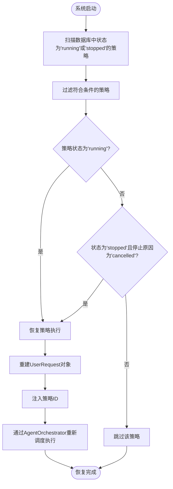
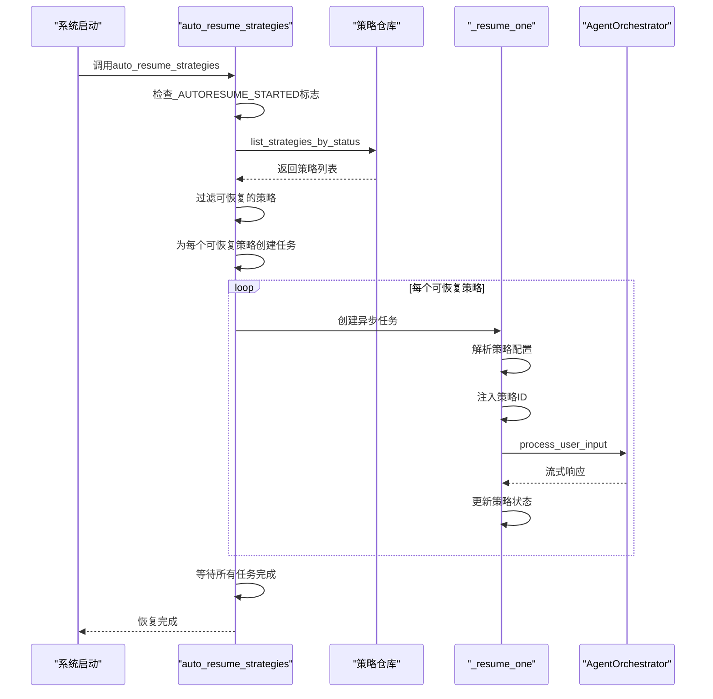
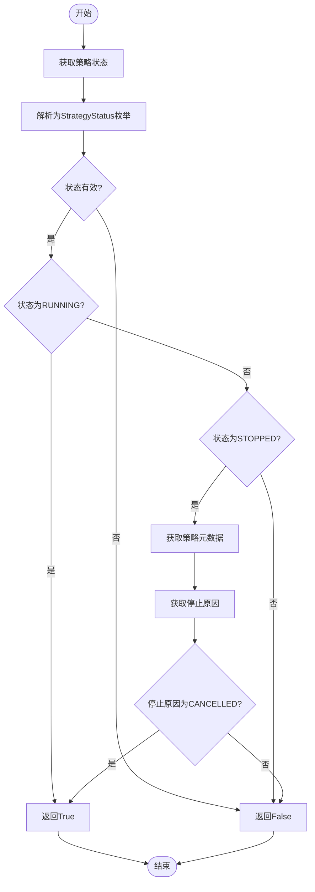
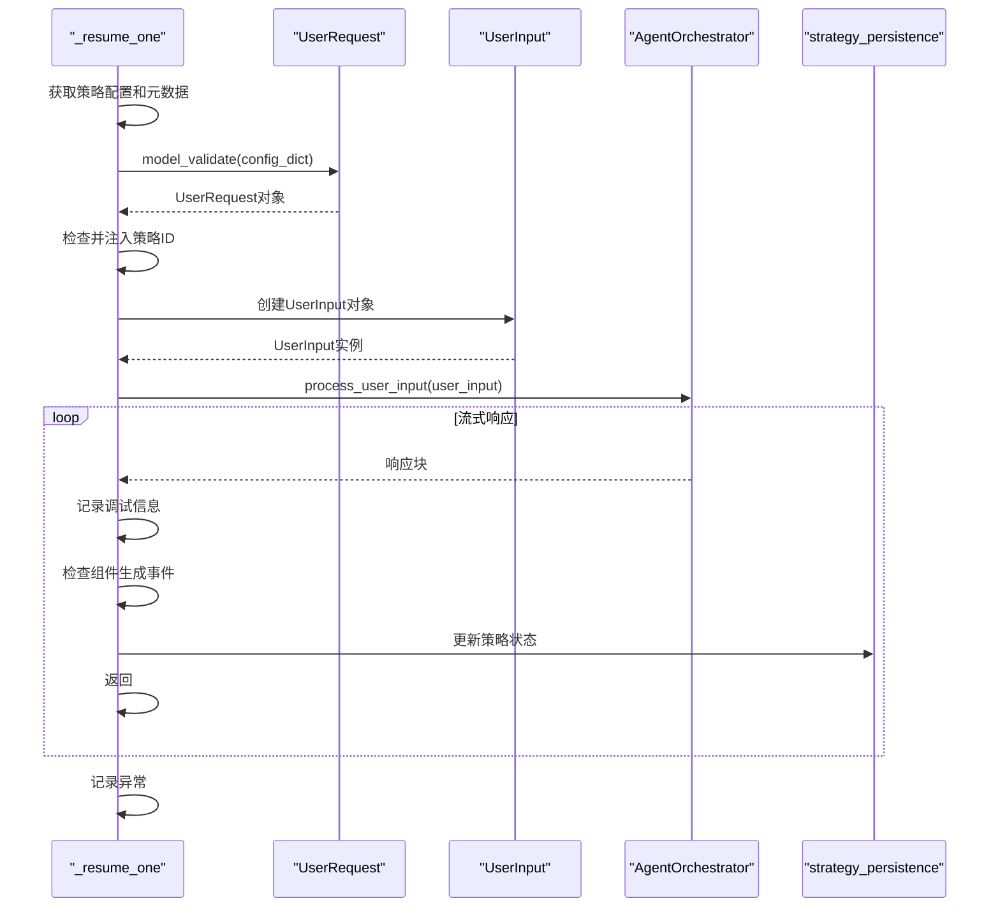
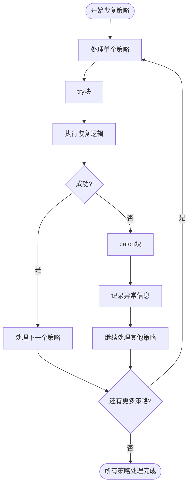
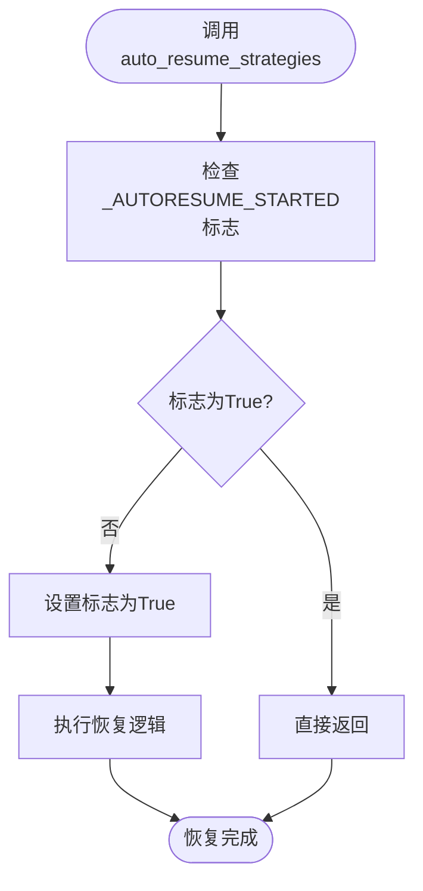
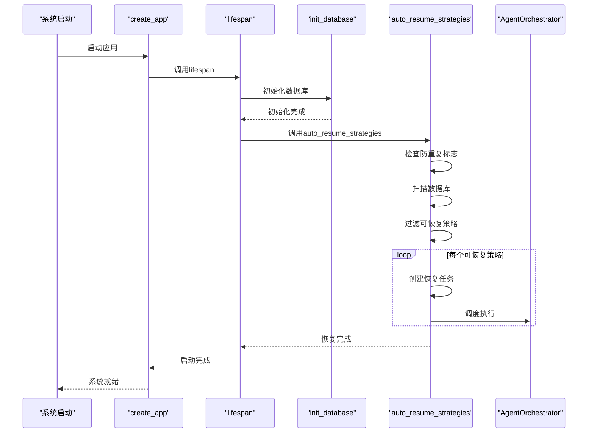

# 策略自动恢复

<cite>
**本文档引用的文件**   
- [strategy_autoresume.py](file://python/valuecell/server/services/strategy_autoresume.py)
- [strategy.py](file://python/valuecell/server/db/models/strategy.py)
- [strategy_repository.py](file://python/valuecell/server/db/repositories/strategy_repository.py)
- [models.py](file://python/valuecell/agents/common/trading/models.py)
- [strategy_persistence.py](file://python/valuecell/server/services/strategy_persistence.py)
- [app.py](file://python/valuecell/server/api/app.py)
</cite>

## 目录
1. [策略自动恢复机制概述](#策略自动恢复机制概述)
2. [自动恢复流程分析](#自动恢复流程分析)
3. [核心组件详细分析](#核心组件详细分析)
4. [异常处理与隔离机制](#异常处理与隔离机制)
5. [防重复执行机制](#防重复执行机制)
6. [系统集成与启动流程](#系统集成与启动流程)

## 策略自动恢复机制概述

策略自动恢复机制是ValueCell系统中的关键功能，旨在确保在系统重启或崩溃后，能够自动恢复正在运行的交易策略。该机制通过扫描数据库中状态为'running'或因取消而停止的策略，并自动恢复其执行。此功能确保了交易策略的连续性和可靠性，即使在系统故障的情况下也能保持策略的持续运行。

**Section sources**
- [strategy_autoresume.py](file://python/valuecell/server/services/strategy_autoresume.py#L1-L20)

## 自动恢复流程分析

策略自动恢复机制在系统启动时执行，其核心流程包括扫描数据库、判断恢复条件、重建策略配置和重新调度执行。该机制通过`auto_resume_strategies`函数实现，该函数在系统启动时被调用，负责扫描数据库中符合条件的策略并恢复其执行。

**Diagram sources**
- [strategy_autoresume.py](file://python/valuecell/server/services/strategy_autoresume.py#L45-L83)

**Section sources**
- [strategy_autoresume.py](file://python/valuecell/server/services/strategy_autoresume.py#L45-L83)

## 核心组件详细分析

### auto_resume_strategies函数分析

`auto_resume_strategies`函数是策略自动恢复机制的核心，负责在系统启动时扫描数据库并恢复符合条件的策略。该函数接收一个`AgentOrchestrator`实例作为参数，并可选地限制恢复的策略数量。

**Diagram sources**
- [strategy_autoresume.py](file://python/valuecell/server/services/strategy_autoresume.py#L45-L83)

**Section sources**
- [strategy_autoresume.py](file://python/valuecell/server/services/strategy_autoresume.py#L45-L83)

### _should_resume判断逻辑分析

`_should_resume`函数负责判断一个策略是否应该被自动恢复。该函数实现了双重校验机制，既检查策略状态又检查停止原因。

**Diagram sources**
- [strategy_autoresume.py](file://python/valuecell/server/services/strategy_autoresume.py#L130-L149)

**Section sources**
- [strategy_autoresume.py](file://python/valuecell/server/services/strategy_autoresume.py#L130-L149)

### _resume_one函数分析

`_resume_one`函数负责将持久化的策略配置重建为`UserRequest`对象，并通过`AgentOrchestrator`重新调度执行。该函数实现了策略ID的注入机制，确保恢复执行时能正确关联到原有的投资组合状态。

**Diagram sources**
- [strategy_autoresume.py](file://python/valuecell/server/services/strategy_autoresume.py#L85-L127)

**Section sources**
- [strategy_autoresume.py](file://python/valuecell/server/services/strategy_autoresume.py#L85-L127)

## 异常处理与隔离机制

策略自动恢复机制实现了完善的异常处理与隔离机制，确保单个策略恢复失败不会影响其他策略的恢复过程。该机制通过`try-catch`块捕获异常，并将异常信息记录到日志中，同时继续处理其他策略。

**Diagram sources**
- [strategy_autoresume.py](file://python/valuecell/server/services/strategy_autoresume.py#L84-L127)

**Section sources**
- [strategy_autoresume.py](file://python/valuecell/server/services/strategy_autoresume.py#L84-L127)

## 防重复执行机制

策略自动恢复机制通过全局标志`_AUTORESUME_STARTED`实现防重复执行机制。该标志确保`auto_resume_strategies`函数在整个应用生命周期中只执行一次，防止因多次调用而导致的重复恢复问题。

**Diagram sources**
- [strategy_autoresume.py](file://python/valuecell/server/services/strategy_autoresume.py#L42-L58)

**Section sources**
- [strategy_autoresume.py](file://python/valuecell/server/services/strategy_autoresume.py#L42-L58)

## 系统集成与启动流程

策略自动恢复机制与系统启动流程紧密集成，确保在系统启动时自动执行。该机制通过在应用启动时调用`auto_resume_strategies`函数来实现，确保所有符合条件的策略都能在系统重启后自动恢复执行。

**Diagram sources**
- [app.py](file://python/valuecell/server/api/app.py#L91-L141)
- [strategy_autoresume.py](file://python/valuecell/server/services/strategy_autoresume.py#L45-L83)

**Section sources**
- [app.py](file://python/valuecell/server/api/app.py#L91-L141)
- [strategy_autoresume.py](file://python/valuecell/server/services/strategy_autoresume.py#L45-L83)