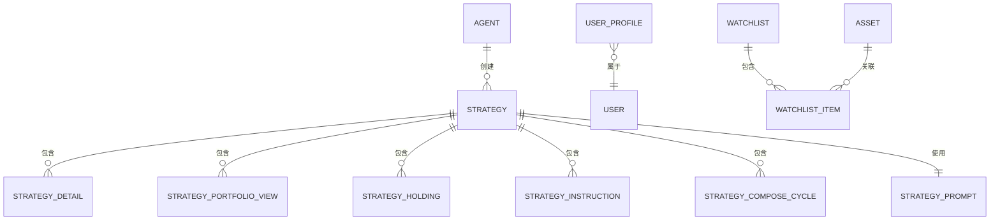

# 数据模型

<cite>
**本文档中引用的文件**  
- [agent.py](file://python/valuecell/server/db/models/agent.py)
- [user_profile.py](file://python/valuecell/server/db/models/user_profile.py)
- [watchlist.py](file://python/valuecell/server/db/models/watchlist.py)
- [strategy.py](file://python/valuecell/server/db/models/strategy.py)
- [strategy_detail.py](file://python/valuecell/server/db/models/strategy_detail.py)
- [strategy_portfolio.py](file://python/valuecell/server/db/models/strategy_portfolio.py)
- [strategy_holding.py](file://python/valuecell/server/db/models/strategy_holding.py)
- [strategy_instruction.py](file://python/valuecell/server/db/models/strategy_instruction.py)
- [strategy_compose_cycle.py](file://python/valuecell/server/db/models/strategy_compose_cycle.py)
- [strategy_prompt.py](file://python/valuecell/server/db/models/strategy_prompt.py)
- [asset.py](file://python/valuecell/server/db/models/asset.py)
- [base.py](file://python/valuecell/server/db/models/base.py)
- [init_db.py](file://python/valuecell/server/db/init_db.py)
- [connection.py](file://python/valuecell/server/db/connection.py)
</cite>

## 目录
1. [简介](#简介)
2. [核心数据模型](#核心数据模型)
3. [实体关系图](#实体关系图)
4. [主要模型详细说明](#主要模型详细说明)
5. [数据验证规则与业务逻辑](#数据验证规则与业务逻辑)
6. [数据访问模式与性能考虑](#数据访问模式与性能考虑)
7. [数据生命周期与保留策略](#数据生命周期与保留策略)
8. [示例数据](#示例数据)

## 简介
ValueCell系统采用基于SQLAlchemy的数据库模式来管理金融交易和用户数据。该数据库设计支持复杂的交易策略、用户配置文件、观察列表和资产信息的存储。核心实体包括Agent（代理）、Strategy（策略）、UserProfile（用户配置文件）和Watchlist（观察列表），它们通过精心设计的关系相互连接，以支持系统的高级功能。

**Section sources**
- [init_db.py](file://python/valuecell/server/db/init_db.py#L1-L719)
- [connection.py](file://python/valuecell/server/db/connection.py#L1-L103)

## 核心数据模型
ValueCell的数据库模式由多个相互关联的模型组成，这些模型定义了系统中各种实体的结构和关系。所有模型都继承自一个基础类，该类使用SQLAlchemy的声明性基类来定义数据库表。



**Diagram sources**
- [agent.py](file://python/valuecell/server/db/models/agent.py#L15-L131)
- [user_profile.py](file://python/valuecell/server/db/models/user_profile.py#L21-L63)
- [watchlist.py](file://python/valuecell/server/db/models/watchlist.py#L25-L196)
- [strategy.py](file://python/valuecell/server/db/models/strategy.py#L15-L74)
- [strategy_detail.py](file://python/valuecell/server/db/models/strategy_detail.py#L25-L166)
- [strategy_portfolio.py](file://python/valuecell/server/db/models/strategy_portfolio.py#L25-L122)
- [strategy_holding.py](file://python/valuecell/server/db/models/strategy_holding.py#L24-L112)
- [strategy_instruction.py](file://python/valuecell/server/db/models/strategy_instruction.py#L22-L75)
- [strategy_compose_cycle.py](file://python/valuecell/server/db/models/strategy_compose_cycle.py#L21-L76)
- [strategy_prompt.py](file://python/valuecell/server/db/models/strategy_prompt.py#L16-L48)
- [asset.py](file://python/valuecell/server/db/models/asset.py#L15-L128)

**Section sources**
- [base.py](file://python/valuecell/server/db/models/base.py#L1-L11)

## 主要模型详细说明

### Agent（代理）模型
Agent模型代表ValueCell系统中的AI代理，存储有关可用代理的信息、其功能、配置和元数据。

**字段定义：**
- `id`: 整数，主键，索引
- `name`: 字符串(100)，唯一，非空，索引，代理的唯一标识符
- `display_name`: 字符串(200)，可为空，人类可读的显示名称
- `description`: 文本，可为空，代理目的和功能的详细描述
- `icon_url`: 字符串(500)，可为空，代理图标图像的URL
- `version`: 字符串(50)，可为空，默认为"1.0.0"，代理版本
- `enabled`: 布尔值，非空，默认为True，指示代理是否启用
- `capabilities`: JSON，可为空，描述代理功能的JSON对象
- `agent_metadata`: JSON，可为空，额外的元数据（作者、标签、支持的功能等）
- `config`: JSON，可为空，代理特定的配置参数
- `created_at`: 时间戳，非空，默认为当前时间，创建时间
- `updated_at`: 时间戳，非空，默认为当前时间并在更新时自动更新，最后更新时间

**约束与索引：**
- 主键：`id`
- 唯一约束：`name`
- 索引：`id`, `name`

**Section sources**
- [agent.py](file://python/valuecell/server/db/models/agent.py#L15-L131)

### Strategy（策略）模型
Strategy模型代表在ValueCell系统中创建的交易策略，是策略相关数据的核心实体。

**字段定义：**
- `id`: 整数，主键，索引
- `strategy_id`: 字符串(100)，唯一，非空，索引，来自StrategyAgent的运行时策略标识符
- `name`: 字符串(200)，可为空，用户定义的策略名称
- `description`: 文本，可为空，可选描述
- `user_id`: 字符串(100)，可为空，索引，所有者用户ID
- `status`: 字符串(50)，非空，默认为"running"，策略状态
- `config`: JSON，可为空，原始UserRequest配置
- `strategy_metadata`: JSON，可为空，额外的元数据（代理、模型提供者等）
- `created_at`: 时间戳，非空，默认为当前时间，创建时间
- `updated_at`: 时间戳，非空，默认为当前时间并在更新时自动更新，最后更新时间

**约束与索引：**
- 主键：`id`
- 唯一约束：`strategy_id`
- 索引：`id`, `strategy_id`, `user_id`

**Section sources**
- [strategy.py](file://python/valuecell/server/db/models/strategy.py#L15-L74)

### UserProfile（用户配置文件）模型
UserProfile模型存储用户偏好和记忆，按类别组织用户信息。

**字段定义：**
- `id`: 整数，主键，索引，自动递增
- `user_id`: 字符串(255)，非空，索引，用户ID
- `category`: 枚举(ProfileCategory)，非空，索引，记忆类别
- `content`: 文本，非空，以字符串格式存储的配置文件内容
- `created_at`: 时间戳，非空，默认为当前时间，创建时间戳
- `updated_at`: 时间戳，非空，默认为当前时间并在更新时自动更新，最后更新时间戳

**枚举值（ProfileCategory）：**
- `PRODUCT_BEHAVIOR`: 用户在产品上的行为
- `RISK_PREFERENCE`: 用户的风险偏好
- `READING_PREFERENCE`: 用户的阅读偏好
- `NORMAL`: 用户的正常配置文件

**约束与索引：**
- 主键：`id`
- 索引：`user_id`, `category`

**Section sources**
- [user_profile.py](file://python/valuecell/server/db/models/user_profile.py#L21-L63)

### Watchlist（观察列表）模型
Watchlist模型代表用户的股票观察列表，包含名称、描述和元数据。

**字段定义：**
- `id`: 整数，主键，索引
- `user_id`: 字符串(100)，非空，索引，拥有此观察列表的用户标识符
- `name`: 字符串(200)，非空，观察列表的名称
- `description`: 文本，可为空，观察列表的描述
- `is_default`: 布尔值，非空，默认为False，指示这是否是用户的默认观察列表
- `is_public`: 布尔值，非空，默认为False，指示此观察列表是否公开
- `created_at`: 时间戳，非空，默认为当前时间，创建时间
- `updated_at`: 时间戳，非空，默认为当前时间并在更新时自动更新，最后更新时间

**关系：**
- `items`: 与WatchlistItem的关系，级联删除

**约束与索引：**
- 主键：`id`
- 唯一约束：`user_id` + `name`
- 索引：`user_id`

**Section sources**
- [watchlist.py](file://python/valuecell/server/db/models/watchlist.py#L25-L196)

## 数据验证规则与业务逻辑

### 数据验证规则
ValueCell的数据库模式实现了多层次的数据验证规则，确保数据的完整性和一致性。

**字段级验证：**
- 所有主键字段都定义为非空且具有索引
- 唯一性约束应用于关键字段，如Agent的`name`和Strategy的`strategy_id`
- 布尔字段使用适当的默认值（如`enabled`默认为True）
- 时间戳字段使用数据库服务器默认值和自动更新功能
- JSON字段用于存储灵活的元数据和配置，提供结构化数据的灵活性

**业务逻辑验证：**
- 外键约束确保引用完整性，如StrategyDetail中的`strategy_id`引用Strategy的`strategy_id`
- 级联删除确保相关数据的一致性，如删除Watchlist时自动删除其所有WatchlistItem
- 唯一约束防止重复数据，如用户不能有同名的观察列表

### 业务逻辑
数据库模式支持以下核心业务逻辑：

**策略生命周期管理：**
- 策略创建时，`status`字段初始化为"running"
- 策略的配置和元数据存储在JSON字段中，允许灵活的策略定义
- 每个策略的详细信息（交易、持仓、组合周期等）通过外键关联到主策略记录

**观察列表管理：**
- 用户可以创建多个观察列表，但每个用户的观察列表名称必须唯一
- 观察列表项使用"EXCHANGE:SYMBOL"格式存储股票标识符，便于跨市场支持
- 观察列表项的显示名称和用户笔记提供额外的上下文信息

**用户配置文件管理：**
- 用户配置文件按类别组织，允许对不同类型的记忆进行分类
- 每个配置文件条目包含用户ID、类别和内容，支持灵活的用户偏好存储

**Section sources**
- [strategy_detail.py](file://python/valuecell/server/db/models/strategy_detail.py#L25-L166)
- [strategy_portfolio.py](file://python/valuecell/server/db/models/strategy_portfolio.py#L25-L122)
- [strategy_holding.py](file://python/valuecell/server/db/models/strategy_holding.py#L24-L112)
- [strategy_instruction.py](file://python/valuecell/server/db/models/strategy_instruction.py#L22-L75)
- [strategy_compose_cycle.py](file://python/valuecell/server/db/models/strategy_compose_cycle.py#L21-L76)

## 数据访问模式与性能考虑

### 数据访问模式
ValueCell的数据库设计支持高效的数据访问模式，优化了常见查询场景。

**读取模式：**
- 通过主键或唯一索引进行点查询（如通过`strategy_id`查找策略）
- 通过外键进行关联查询（如获取特定策略的所有交易详情）
- 范围查询（如按时间范围检索策略组合周期）

**写入模式：**
- 事务性写入确保数据一致性
- 批量插入优化大量数据的导入
- 使用UPSERT模式处理可能重复的数据

### 性能优化
数据库模式通过以下方式优化性能：

**索引策略：**
- 在经常查询的字段上创建索引，如`user_id`、`strategy_id`等
- 复合索引用于多字段查询场景
- 唯一索引同时提供约束和查询性能

**查询优化：**
- 使用适当的JOIN策略减少查询复杂性
- 分页支持大数据集的高效检索
- 缓存频繁访问的数据以减少数据库负载

**数据库配置：**
- 使用连接池管理数据库连接
- 配置适当的超时和重试策略
- 定期维护任务（如VACUUM在SQLite中）保持数据库性能

**Section sources**
- [init_db.py](file://python/valuecell/server/db/init_db.py#L1-L719)
- [connection.py](file://python/valuecell/server/db/connection.py#L1-L103)

## 数据生命周期与保留策略
ValueCell系统实现了明确的数据生命周期管理策略，确保数据的长期可用性和系统性能。

**数据创建：**
- 数据在用户操作或系统事件触发时创建
- 所有记录自动记录创建时间戳
- 必需字段在创建时验证

**数据更新：**
- 记录更新时自动更新`updated_at`时间戳
- 审计日志记录重要变更（通过应用层实现）
- 并发控制防止数据竞争

**数据归档与删除：**
- 不活跃的策略可以被标记为归档状态
- 用户可以删除自己的观察列表和配置文件
- 系统定期清理临时数据和过期会话

**数据备份：**
- 数据库定期备份以防止数据丢失
- 备份策略包括完整备份和增量备份
- 灾难恢复计划确保业务连续性

**Section sources**
- [init_db.py](file://python/valuecell/server/db/init_db.py#L1-L719)

## 示例数据
以下是ValueCell数据库中各主要模型的示例数据：

**Agent示例：**
```json
{
  "id": 1,
  "name": "trading_agent",
  "display_name": "交易代理",
  "description": "负责执行交易策略的AI代理",
  "icon_url": "https://example.com/icons/trading.png",
  "version": "1.0.0",
  "enabled": true,
  "capabilities": {
    "streaming": true,
    "push_notifications": false
  },
  "agent_metadata": {
    "author": "ValueCell Team",
    "tags": ["trading", "ai"],
    "supported_features": ["crypto", "stocks"]
  },
  "config": {
    "max_risk_per_trade": 0.02,
    "default_leverage": 5
  }
}
```

**Strategy示例：**
```json
{
  "id": 1,
  "strategy_id": "strat-12345",
  "name": "趋势跟踪策略",
  "description": "基于技术指标的趋势跟踪交易策略",
  "user_id": "user-67890",
  "status": "running",
  "config": {
    "indicators": ["SMA", "RSI"],
    "timeframe": "1h",
    "risk_per_trade": 0.01
  },
  "strategy_metadata": {
    "agent": "trading_agent",
    "model_provider": "openai"
  }
}
```

**UserProfile示例：**
```json
{
  "id": 1,
  "user_id": "user-67890",
  "category": "risk_preference",
  "content": "用户偏好中等风险水平的投资，最大单笔损失容忍度为5%",
  "created_at": "2024-01-01T10:00:00Z",
  "updated_at": "2024-01-01T10:00:00Z"
}
```

**Watchlist示例：**
```json
{
  "id": 1,
  "user_id": "user-67890",
  "name": "科技股观察",
  "description": "关注的科技公司股票",
  "is_default": true,
  "is_public": false,
  "created_at": "2024-01-01T10:00:00Z",
  "updated_at": "2024-01-01T10:00:00Z"
}
```

**Section sources**
- [agent.py](file://python/valuecell/server/db/models/agent.py#L15-L131)
- [strategy.py](file://python/valuecell/server/db/models/strategy.py#L15-L74)
- [user_profile.py](file://python/valuecell/server/db/models/user_profile.py#L21-L63)
- [watchlist.py](file://python/valuecell/server/db/models/watchlist.py#L25-L196)