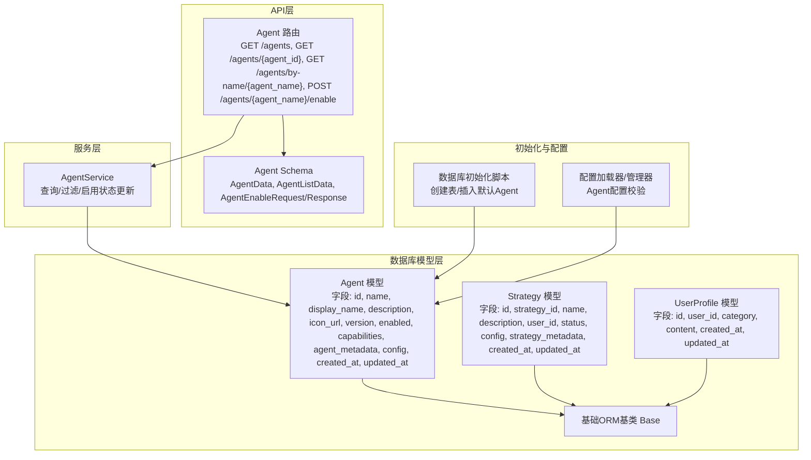
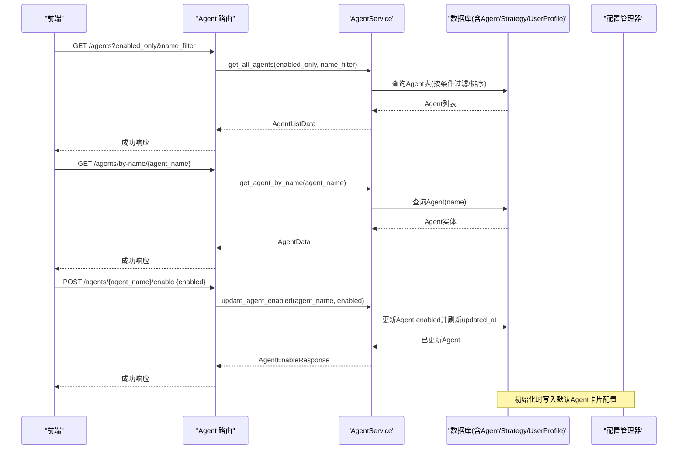
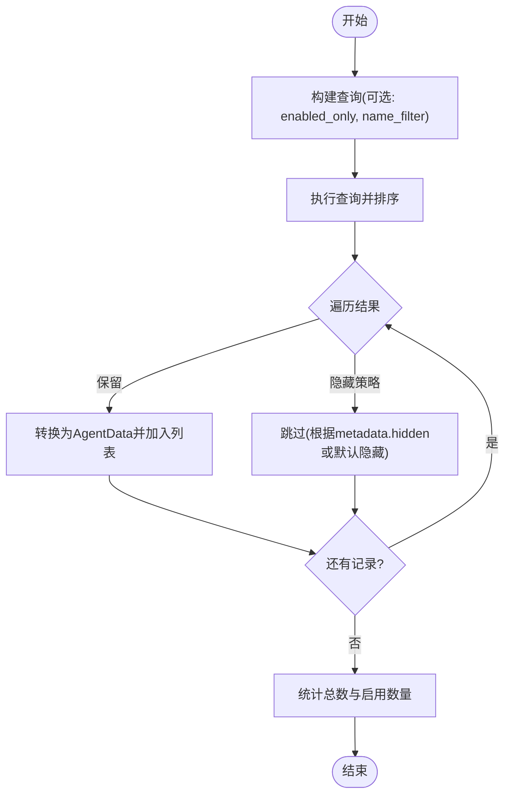
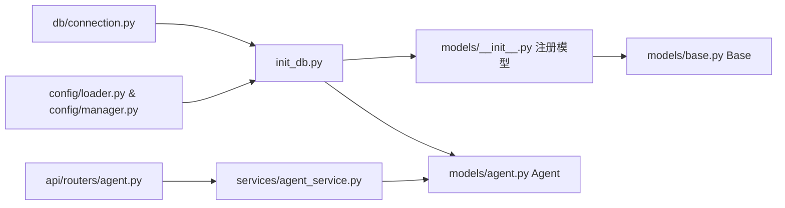

# 智能体模型

<cite>
**本文引用的文件**
- [python/valuecell/server/db/models/agent.py](file://python/valuecell/server/db/models/agent.py)
- [python/valuecell/server/db/models/__init__.py](file://python/valuecell/server/db/models/__init__.py)
- [python/valuecell/server/db/models/base.py](file://python/valuecell/server/db/models/base.py)
- [python/valuecell/server/db/models/strategy.py](file://python/valuecell/server/db/models/strategy.py)
- [python/valuecell/server/db/models/user_profile.py](file://python/valuecell/server/db/models/user_profile.py)
- [python/valuecell/server/api/schemas/agent.py](file://python/valuecell/server/api/schemas/agent.py)
- [python/valuecell/server/api/routers/agent.py](file://python/valuecell/server/api/routers/agent.py)
- [python/valuecell/server/services/agent_service.py](file://python/valuecell/server/services/agent_service.py)
- [python/valuecell/server/db/init_db.py](file://python/valuecell/server/db/init_db.py)
- [python/valuecell/server/db/connection.py](file://python/valuecell/server/db/connection.py)
- [python/valuecell/config/loader.py](file://python/valuecell/config/loader.py)
- [python/valuecell/config/manager.py](file://python/valuecell/config/manager.py)
- [python/valuecell/agents/common/trading/base_agent.py](file://python/valuecell/agents/common/trading/base_agent.py)
</cite>

## 目录
1. [简介](#简介)
2. [项目结构](#项目结构)
3. [核心组件](#核心组件)
4. [架构总览](#架构总览)
5. [详细组件分析](#详细组件分析)
6. [依赖关系分析](#依赖关系分析)
7. [性能考量](#性能考量)
8. [故障排查指南](#故障排查指南)
9. [结论](#结论)
10. [附录](#附录)

## 简介
本文件聚焦于ValueCell系统中的智能体（Agent）实体数据模型，系统性阐述其字段定义、数据类型、主键与索引设计、与其他模型（如Strategy、UserProfile）的关系，以及在系统中的作用：包括智能体状态管理、类型分类与执行上下文存储。同时提供示例数据记录、数据访问模式、性能优化策略（索引与查询缓存），并结合代码实现说明模型与SQLAlchemy ORM的映射方式及业务规则验证逻辑。

## 项目结构
围绕Agent模型的关键文件分布如下：
- 数据库模型层：Agent模型、基础ORM基类、其他相关模型（Strategy、UserProfile）
- API层：Agent路由与Schema
- 服务层：AgentService封装查询与更新逻辑
- 初始化脚本：数据库初始化与默认Agent数据注入
- 配置层：Agent配置加载与校验
- 前端集成：前端通过API获取Agent列表与详情

图表来源
- [python/valuecell/server/db/models/agent.py](file://python/valuecell/server/db/models/agent.py#L1-L131)
- [python/valuecell/server/db/models/strategy.py](file://python/valuecell/server/db/models/strategy.py#L1-L74)
- [python/valuecell/server/db/models/user_profile.py](file://python/valuecell/server/db/models/user_profile.py#L1-L63)
- [python/valuecell/server/db/models/base.py](file://python/valuecell/server/db/models/base.py#L1-L11)
- [python/valuecell/server/api/routers/agent.py](file://python/valuecell/server/api/routers/agent.py#L1-L180)
- [python/valuecell/server/api/schemas/agent.py](file://python/valuecell/server/api/schemas/agent.py#L1-L129)
- [python/valuecell/server/services/agent_service.py](file://python/valuecell/server/services/agent_service.py#L1-L202)
- [python/valuecell/server/db/init_db.py](file://python/valuecell/server/db/init_db.py#L450-L504)
- [python/valuecell/config/loader.py](file://python/valuecell/config/loader.py#L430-L472)
- [python/valuecell/config/manager.py](file://python/valuecell/config/manager.py#L48-L100)

章节来源
- [python/valuecell/server/db/models/agent.py](file://python/valuecell/server/db/models/agent.py#L1-L131)
- [python/valuecell/server/db/models/__init__.py](file://python/valuecell/server/db/models/__init__.py#L1-L39)
- [python/valuecell/server/db/models/base.py](file://python/valuecell/server/db/models/base.py#L1-L11)
- [python/valuecell/server/api/routers/agent.py](file://python/valuecell/server/api/routers/agent.py#L1-L180)
- [python/valuecell/server/api/schemas/agent.py](file://python/valuecell/server/api/schemas/agent.py#L1-L129)
- [python/valuecell/server/services/agent_service.py](file://python/valuecell/server/services/agent_service.py#L1-L202)
- [python/valuecell/server/db/init_db.py](file://python/valuecell/server/db/init_db.py#L450-L504)
- [python/valuecell/config/loader.py](file://python/valuecell/config/loader.py#L430-L472)
- [python/valuecell/config/manager.py](file://python/valuecell/config/manager.py#L48-L100)

## 核心组件
- Agent模型：用于持久化系统中可用智能体的基本信息、能力、元数据与配置；支持按名称唯一标识与启用状态控制。
- AgentService：封装查询、过滤与启用状态更新等业务逻辑。
- Agent路由与Schema：对外提供REST接口与请求/响应数据结构。
- 数据库初始化：自动创建表并注入默认Agent卡片配置。
- 配置管理：对Agent配置进行校验（如模型提供商、API密钥等）。

章节来源
- [python/valuecell/server/db/models/agent.py](file://python/valuecell/server/db/models/agent.py#L1-L131)
- [python/valuecell/server/services/agent_service.py](file://python/valuecell/server/services/agent_service.py#L1-L202)
- [python/valuecell/server/api/routers/agent.py](file://python/valuecell/server/api/routers/agent.py#L1-L180)
- [python/valuecell/server/api/schemas/agent.py](file://python/valuecell/server/api/schemas/agent.py#L1-L129)
- [python/valuecell/server/db/init_db.py](file://python/valuecell/server/db/init_db.py#L450-L504)
- [python/valuecell/config/loader.py](file://python/valuecell/config/loader.py#L430-L472)
- [python/valuecell/config/manager.py](file://python/valuecell/config/manager.py#L48-L100)

## 架构总览
Agent模型在系统中的位置与交互如下图所示：

图表来源
- [python/valuecell/server/api/routers/agent.py](file://python/valuecell/server/api/routers/agent.py#L1-L180)
- [python/valuecell/server/services/agent_service.py](file://python/valuecell/server/services/agent_service.py#L1-L202)
- [python/valuecell/server/db/models/agent.py](file://python/valuecell/server/db/models/agent.py#L1-L131)
- [python/valuecell/server/db/init_db.py](file://python/valuecell/server/db/init_db.py#L450-L504)
- [python/valuecell/config/manager.py](file://python/valuecell/config/manager.py#L48-L100)

## 详细组件分析

### Agent模型字段定义与ORM映射
- 表名：agents
- 主键：id（整数，自增索引）
- 唯一约束：name（字符串，唯一）
- 索引：id、name、display_name（模糊匹配）、user_id（在Strategy中存在）
- 字段与类型：
  - 基础信息：name（字符串，唯一且必填）、display_name（字符串，可空）、description（文本，可空）、icon_url（字符串，可空）
  - 版本与状态：version（字符串，可空，默认“1.0.0”）、enabled（布尔，缺省为真）
  - 能力与元数据：capabilities（JSON，可空，描述流式、推送通知等能力）、agent_metadata（JSON，可空，作者、标签、支持特性等）
  - 配置：config（JSON，可空，Agent特定参数）
  - 时间戳：created_at（时间，服务器默认当前时间）、updated_at（时间，服务器默认当前时间并在更新时刷新）
- 方法：
  - to_dict：序列化为字典，便于API返回
  - from_config：从配置字典创建Agent实例，设置默认能力与版本

ORM映射要点：
- 继承Base（declarative_base），所有模型统一注册
- 使用SQLAlchemy Column定义字段，配合索引与注释
- JSON字段用于灵活存储结构化配置与元数据

章节来源
- [python/valuecell/server/db/models/agent.py](file://python/valuecell/server/db/models/agent.py#L1-L131)
- [python/valuecell/server/db/models/base.py](file://python/valuecell/server/db/models/base.py#L1-L11)
- [python/valuecell/server/db/models/__init__.py](file://python/valuecell/server/db/models/__init__.py#L1-L39)

### AgentService业务逻辑
- 查询全部Agent：
  - 支持enabled_only过滤、name_filter（模糊匹配name或display_name）
  - 排序：按created_at倒序
  - 隐藏策略：当exclude_hidden为真时，隐藏标记为hidden的Agent；对research_agent、news_agent默认仅在enabled为真时显示
- 按ID/名称查询：返回AgentData
- 更新启用状态：按name查找Agent，更新enabled与updated_at并提交事务

图表来源
- [python/valuecell/server/services/agent_service.py](file://python/valuecell/server/services/agent_service.py#L1-L202)

章节来源
- [python/valuecell/server/services/agent_service.py](file://python/valuecell/server/services/agent_service.py#L1-L202)

### API与Schema
- 路由：
  - GET /agents：分页/过滤获取Agent列表
  - GET /agents/{agent_id}：按ID获取Agent
  - GET /agents/by-name/{agent_name}：按名称获取Agent
  - POST /agents/{agent_name}/enable：更新Agent启用状态
- Schema：
  - AgentData：包含id、agent_name、display_name、description、version、enabled、icon_url、agent_metadata、config、created_at、updated_at
  - AgentListData：agents列表、total、enabled_count
  - AgentEnableRequest/Response：启用开关与消息

章节来源
- [python/valuecell/server/api/routers/agent.py](file://python/valuecell/server/api/routers/agent.py#L1-L180)
- [python/valuecell/server/api/schemas/agent.py](file://python/valuecell/server/api/schemas/agent.py#L1-L129)

### 与其他模型的关系
- 与Strategy：
  - Strategy.user_id可作为拥有者标识；Strategy.strategy_metadata中可能包含agent、model provider等元信息
  - Agent不直接外键关联Strategy，但可通过策略元数据与Agent名称建立语义关联
- 与UserProfile：
  - UserProfile用于存储用户偏好与记忆，Agent在运行时可读取用户画像以增强决策上下文
  - Agent本身不直接外键关联UserProfile，但系统会格式化用户画像供Agent消费

章节来源
- [python/valuecell/server/db/models/strategy.py](file://python/valuecell/server/db/models/strategy.py#L1-L74)
- [python/valuecell/server/db/models/user_profile.py](file://python/valuecell/server/db/models/user_profile.py#L1-L63)
- [python/valuecell/utils/user_profile_utils.py](file://python/valuecell/utils/user_profile_utils.py#L122-L243)

### 执行上下文与Agent类型
- 执行上下文：
  - Agent.config用于存储Agent特定配置参数
  - capabilities用于声明Agent能力（如是否支持流式、推送通知）
  - agent_metadata用于附加元信息（作者、标签、支持特性等）
- 类型分类：
  - 系统内置Agent（如ResearchAgent、NewsAgent）默认可能隐藏，除非显式启用
  - BaseStrategyAgent定义了策略型Agent的通用生命周期与运行时管理，与Agent模型共同支撑策略执行场景

章节来源
- [python/valuecell/server/db/models/agent.py](file://python/valuecell/server/db/models/agent.py#L1-L131)
- [python/valuecell/agents/common/trading/base_agent.py](file://python/valuecell/agents/common/trading/base_agent.py#L1-L373)

### 示例数据记录
以下为典型Agent记录的字段示意（非代码片段）：
- id: 整数
- name: 字符串（唯一，如“ResearchAgent”）
- display_name: 字符串（如“研究智能体”）
- description: 文本（如“基于知识库的研究智能体”）
- icon_url: 字符串（图标地址）
- version: 字符串（如“1.0.0”）
- enabled: 布尔（默认True）
- capabilities: JSON对象（如包含“streaming”、“push_notifications”）
- agent_metadata: JSON对象（如包含“author”、“tags”）
- config: JSON对象（Agent特定配置）
- created_at/updated_at: 时间戳

章节来源
- [python/valuecell/server/db/models/agent.py](file://python/valuecell/server/db/models/agent.py#L1-L131)
- [python/valuecell/server/api/schemas/agent.py](file://python/valuecell/server/api/schemas/agent.py#L1-L129)

## 依赖关系分析
- 模型注册：__init__.py集中导入Agent等模型，确保SQLAlchemy自动注册
- 连接与引擎：connection.py提供数据库连接管理
- 初始化流程：init_db.py创建表并注入默认Agent卡片配置
- 配置校验：loader.py与manager.py负责Agent配置有效性检查（提供商、API密钥等）

图表来源
- [python/valuecell/server/db/models/__init__.py](file://python/valuecell/server/db/models/__init__.py#L1-L39)
- [python/valuecell/server/db/models/base.py](file://python/valuecell/server/db/models/base.py#L1-L11)
- [python/valuecell/server/db/models/agent.py](file://python/valuecell/server/db/models/agent.py#L1-L131)
- [python/valuecell/server/api/routers/agent.py](file://python/valuecell/server/api/routers/agent.py#L1-L180)
- [python/valuecell/server/services/agent_service.py](file://python/valuecell/server/services/agent_service.py#L1-L202)
- [python/valuecell/server/db/connection.py](file://python/valuecell/server/db/connection.py)
- [python/valuecell/server/db/init_db.py](file://python/valuecell/server/db/init_db.py#L450-L504)
- [python/valuecell/config/loader.py](file://python/valuecell/config/loader.py#L430-L472)
- [python/valuecell/config/manager.py](file://python/valuecell/config/manager.py#L48-L100)

章节来源
- [python/valuecell/server/db/models/__init__.py](file://python/valuecell/server/db/models/__init__.py#L1-L39)
- [python/valuecell/server/db/connection.py](file://python/valuecell/server/db/connection.py)
- [python/valuecell/server/db/init_db.py](file://python/valuecell/server/db/init_db.py#L450-L504)
- [python/valuecell/config/loader.py](file://python/valuecell/config/loader.py#L430-L472)
- [python/valuecell/config/manager.py](file://python/valuecell/config/manager.py#L48-L100)

## 性能考量
- 索引设计建议：
  - 在Agent表上为name建立唯一索引（已具备）
  - 为enabled建立索引，加速“仅启用”过滤
  - 为created_at建立索引，提升排序与分页性能
  - 为Strategy.user_id建立索引，加速按用户过滤策略
- 查询缓存：
  - 对高频查询（如获取启用Agent列表）可采用应用层缓存（如Redis）短期缓存结果，降低数据库压力
  - 缓存失效策略：在Agent启用状态变更或新增Agent后主动失效相关缓存
- 分页与过滤：
  - API层支持分页参数（如limit/offset）与name_filter模糊匹配，避免一次性返回大量数据
- 写入优化：
  - 批量初始化默认Agent时使用事务，减少多次提交开销
- JSON字段：
  - capabilities与agent_metadata为JSON字段，查询时尽量避免全表扫描，必要时在应用层做字段裁剪

章节来源
- [python/valuecell/server/services/agent_service.py](file://python/valuecell/server/services/agent_service.py#L1-L202)
- [python/valuecell/server/db/models/agent.py](file://python/valuecell/server/db/models/agent.py#L1-L131)
- [python/valuecell/server/db/models/strategy.py](file://python/valuecell/server/db/models/strategy.py#L1-L74)

## 故障排查指南
- Agent未显示或被隐藏：
  - 检查agent_metadata中是否标记hidden
  - 检查enabled状态；research_agent、news_agent默认仅在enabled为真时显示
- 启用状态更新失败：
  - 确认agent_name是否存在；若不存在会返回404
  - 查看数据库事务是否成功提交
- 配置校验失败：
  - 检查配置加载器是否检测到缺失的API密钥或无效的提供商
  - 核对配置管理器中的primary_provider与fallback_providers链路

章节来源
- [python/valuecell/server/services/agent_service.py](file://python/valuecell/server/services/agent_service.py#L1-L202)
- [python/valuecell/server/api/routers/agent.py](file://python/valuecell/server/api/routers/agent.py#L1-L180)
- [python/valuecell/config/loader.py](file://python/valuecell/config/loader.py#L430-L472)
- [python/valuecell/config/manager.py](file://python/valuecell/config/manager.py#L48-L100)

## 结论
Agent模型在ValueCell系统中承担着智能体注册、能力声明与配置存储的核心职责。通过清晰的字段设计、完善的索引策略与服务层过滤逻辑，系统实现了高效的Agent发现与管理。结合配置校验与初始化流程，Agent能够稳定地参与策略执行与对话场景。未来可在高频查询上引入缓存与更细粒度的索引，进一步提升整体性能。

## 附录
- 数据库初始化与默认Agent注入流程：
  - 创建表并写入默认Agent卡片配置（from_config）
  - 初始化策略提示模板（StrategyPrompt）
- 前端集成：
  - 前端通过API获取Agent列表与详情，支持按名称过滤与启用状态切换

章节来源
- [python/valuecell/server/db/init_db.py](file://python/valuecell/server/db/init_db.py#L450-L504)
- [python/valuecell/server/db/models/strategy_prompt.py](file://python/valuecell/server/db/models/strategy_prompt.py#L1-L48)
- [python/valuecell/server/api/routers/agent.py](file://python/valuecell/server/api/routers/agent.py#L1-L180)