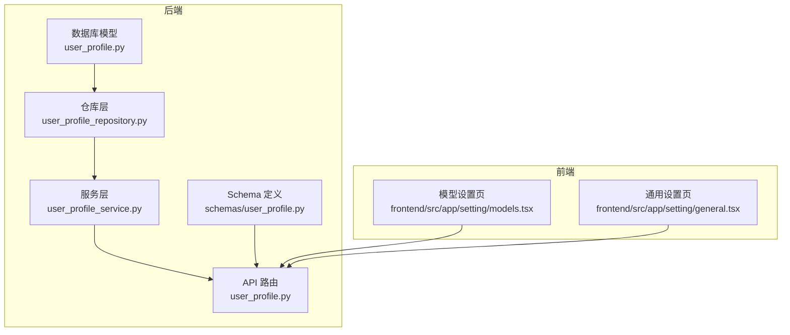
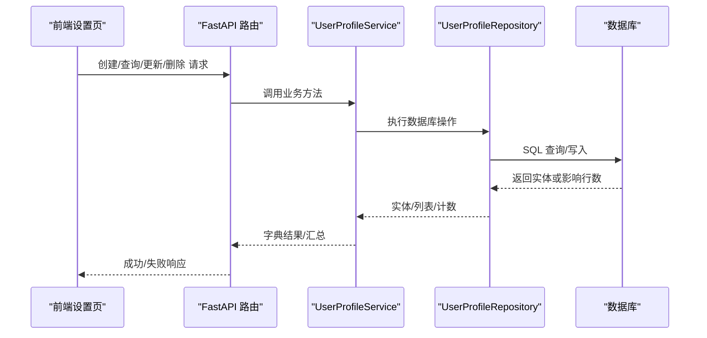
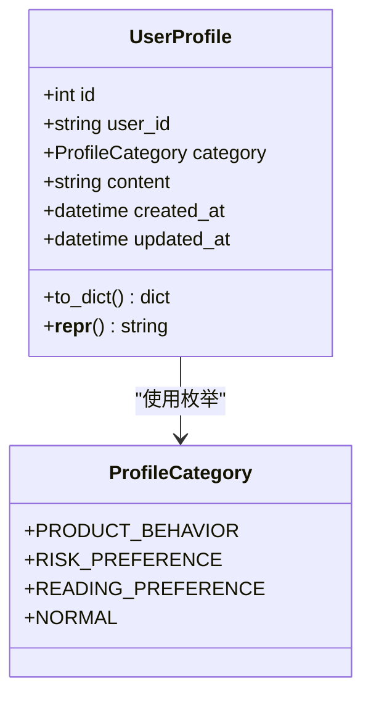
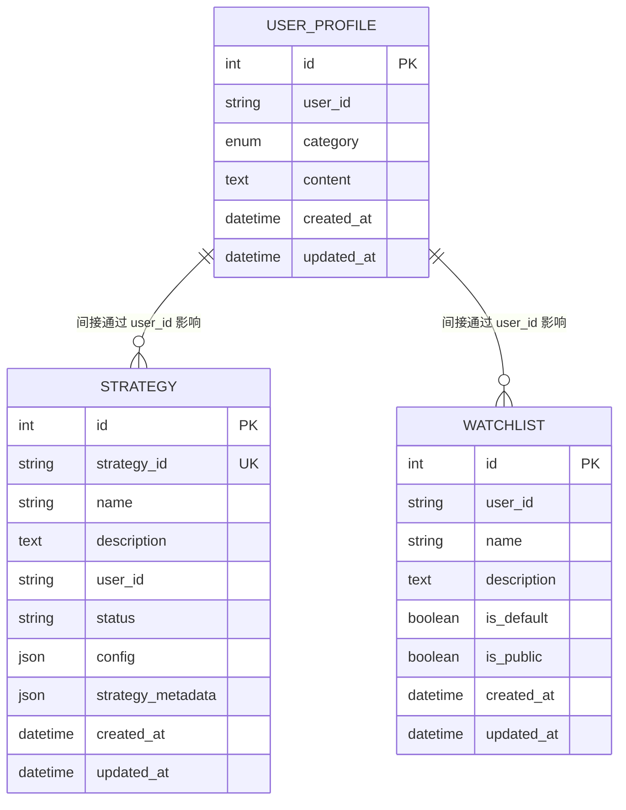
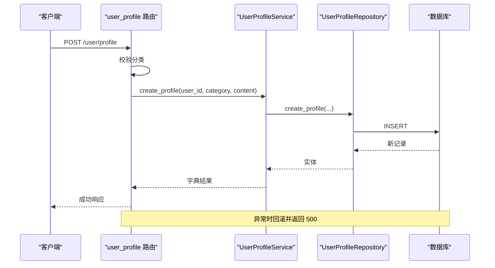
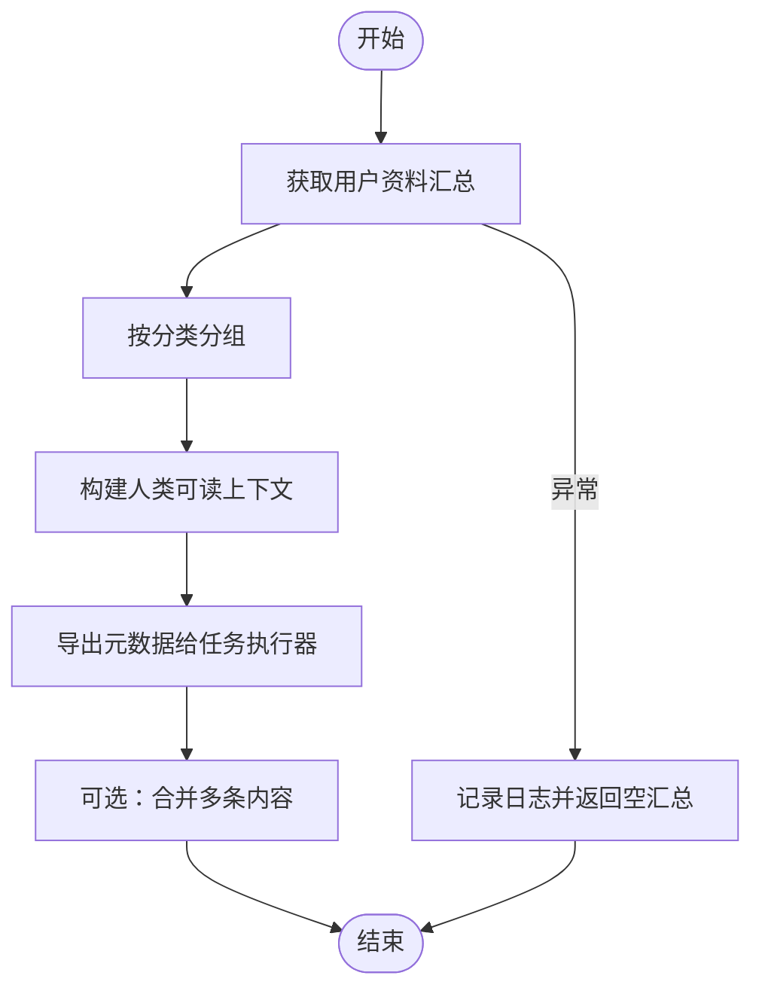
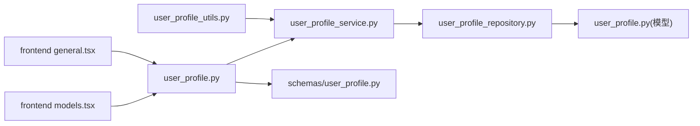

# 用户资料模型

<cite>
**本文引用的文件**
- [python/valuecell/server/db/models/user_profile.py](file://python/valuecell/server/db/models/user_profile.py)
- [python/valuecell/server/api/schemas/user_profile.py](file://python/valuecell/server/api/schemas/user_profile.py)
- [python/valuecell/server/services/user_profile_service.py](file://python/valuecell/server/services/user_profile_service.py)
- [python/valuecell/server/db/repositories/user_profile_repository.py](file://python/valuecell/server/db/repositories/user_profile_repository.py)
- [python/valuecell/server/api/routers/user_profile.py](file://python/valuecell/server/api/routers/user_profile.py)
- [python/valuecell/utils/user_profile_utils.py](file://python/valuecell/utils/user_profile_utils.py)
- [python/valuecell/server/db/models/strategy.py](file://python/valuecell/server/db/models/strategy.py)
- [python/valuecell/server/db/models/watchlist.py](file://python/valuecell/server/db/models/watchlist.py)
- [python/valuecell/server/api/routers/models.py](file://python/valuecell/server/api/routers/models.py)
- [python/valuecell/server/api/routers/i18n.py](file://python/valuecell/server/api/routers/i18n.py)
- [python/valuecell/core/task/executor.py](file://python/valuecell/core/task/executor.py)
- [frontend/src/app/setting/models.tsx](file://frontend/src/app/setting/models.tsx)
- [frontend/src/app/setting/general.tsx](file://frontend/src/app/setting/general.tsx)
- [docs/CONFIGURATION_GUIDE.md](file://docs/CONFIGURATION_GUIDE.md)
</cite>

## 目录
1. [简介](#简介)
2. [项目结构](#项目结构)
3. [核心组件](#核心组件)
4. [架构总览](#架构总览)
5. [详细组件分析](#详细组件分析)
6. [依赖关系分析](#依赖关系分析)
7. [性能考量](#性能考量)
8. [故障排查指南](#故障排查指南)
9. [结论](#结论)
10. [附录](#附录)

## 简介
本文件系统化梳理用户资料（UserProfile）数据模型，覆盖字段结构、分类体系、与系统个性化能力（模型提供商配置、界面主题与语言设置）的关系，以及与智能体、策略、观察列表（Watchlist）的外键关系与数据一致性保障机制。同时提供实际数据示例、敏感信息处理建议、访问控制策略与隐私合规要点，帮助开发者与产品人员高效理解并正确使用该模型。

## 项目结构
用户资料模型位于后端 Python 层，采用典型的分层设计：数据库模型定义、SQLAlchemy 映射、仓库层封装、服务层业务逻辑、FastAPI 路由与 Pydantic Schema 共同构成完整闭环；前端通过设置页面与模型配置页面进行交互。

图表来源
- [python/valuecell/server/db/models/user_profile.py](file://python/valuecell/server/db/models/user_profile.py#L1-L63)
- [python/valuecell/server/db/repositories/user_profile_repository.py](file://python/valuecell/server/db/repositories/user_profile_repository.py#L1-L220)
- [python/valuecell/server/services/user_profile_service.py](file://python/valuecell/server/services/user_profile_service.py#L1-L256)
- [python/valuecell/server/api/routers/user_profile.py](file://python/valuecell/server/api/routers/user_profile.py#L1-L246)
- [python/valuecell/server/api/schemas/user_profile.py](file://python/valuecell/server/api/schemas/user_profile.py#L1-L63)
- [frontend/src/app/setting/models.tsx](file://frontend/src/app/setting/models.tsx#L1-L28)
- [frontend/src/app/setting/general.tsx](file://frontend/src/app/setting/general.tsx#L1-L37)

章节来源
- [python/valuecell/server/db/models/user_profile.py](file://python/valuecell/server/db/models/user_profile.py#L1-L63)
- [python/valuecell/server/api/routers/user_profile.py](file://python/valuecell/server/api/routers/user_profile.py#L1-L246)

## 核心组件
- 数据库模型（UserProfile）
  - 字段：主键、用户标识、分类枚举、内容文本、创建/更新时间戳
  - 分类枚举：产品行为、风险偏好、阅读偏好、普通
- 仓库层（UserProfileRepository）
  - 提供增删改查、按用户与分类过滤、计数、按分类聚合
- 服务层（UserProfileService）
  - 统一校验分类、调用仓库、返回字典结果、汇总统计
- API 路由（user_profile.py）
  - 提供创建、查询、汇总、更新、删除接口，统一错误处理
- Schema（schemas/user_profile.py）
  - 定义请求/响应结构，含列表与汇总结构
- 工具函数（user_profile_utils.py）
  - 汇总、格式化、合并、元数据导出、校验分类等
- 前端设置页
  - 模型设置页用于配置模型提供商；通用设置页包含应用偏好与国际化设置

章节来源
- [python/valuecell/server/db/models/user_profile.py](file://python/valuecell/server/db/models/user_profile.py#L1-L63)
- [python/valuecell/server/db/repositories/user_profile_repository.py](file://python/valuecell/server/db/repositories/user_profile_repository.py#L1-L220)
- [python/valuecell/server/services/user_profile_service.py](file://python/valuecell/server/services/user_profile_service.py#L1-L256)
- [python/valuecell/server/api/routers/user_profile.py](file://python/valuecell/server/api/routers/user_profile.py#L1-L246)
- [python/valuecell/server/api/schemas/user_profile.py](file://python/valuecell/server/api/schemas/user_profile.py#L1-L63)
- [python/valuecell/utils/user_profile_utils.py](file://python/valuecell/utils/user_profile_utils.py#L1-L278)
- [frontend/src/app/setting/models.tsx](file://frontend/src/app/setting/models.tsx#L1-L28)
- [frontend/src/app/setting/general.tsx](file://frontend/src/app/setting/general.tsx#L1-L37)

## 架构总览
用户资料模型贯穿“路由—服务—仓库—模型”的标准分层，配合工具函数为智能体与系统其他模块提供个性化上下文。

图表来源
- [python/valuecell/server/api/routers/user_profile.py](file://python/valuecell/server/api/routers/user_profile.py#L1-L246)
- [python/valuecell/server/services/user_profile_service.py](file://python/valuecell/server/services/user_profile_service.py#L1-L256)
- [python/valuecell/server/db/repositories/user_profile_repository.py](file://python/valuecell/server/db/repositories/user_profile_repository.py#L1-L220)

## 详细组件分析

### 数据模型与字段结构
- 表名：user_profiles
- 主键：自增整数
- 关键字段：
  - user_id：字符串，索引，标识所属用户
  - category：枚举，限制有效值集合
  - content：文本，存储用户偏好的自由文本
  - created_at/updated_at：时间戳，默认值与更新触发器
- 方法：
  - to_dict：序列化为字典，便于 API 响应
  - __repr__：调试输出

图表来源
- [python/valuecell/server/db/models/user_profile.py](file://python/valuecell/server/db/models/user_profile.py#L1-L63)

章节来源
- [python/valuecell/server/db/models/user_profile.py](file://python/valuecell/server/db/models/user_profile.py#L1-L63)

### 分类体系与个性化能力
- 分类枚举：
  - 产品行为：记录用户在产品上的行为偏好
  - 风险偏好：记录用户的风险倾向
  - 阅读偏好：记录用户对内容类型的偏好
  - 普通：通用用户资料
- 与系统个性化的关系：
  - 模型提供商配置：通过前端模型设置页配置提供商、默认模型、API 密钥等，这些配置可作为系统级个性化的一部分，但不直接映射到 UserProfile 的 category 字段
  - 界面主题与语言设置：通过国际化路由设置语言与时区，保存在内存上下文中，不直接持久化到 UserProfile
- 工具函数支撑：
  - 汇总与格式化：将用户资料按分类聚合，生成人类可读的上下文字符串，便于注入到智能体提示词中
  - 元数据导出：为任务执行器提供结构化元数据，供智能体消费

章节来源
- [python/valuecell/server/api/schemas/user_profile.py](file://python/valuecell/server/api/schemas/user_profile.py#L1-L63)
- [python/valuecell/utils/user_profile_utils.py](file://python/valuecell/utils/user_profile_utils.py#L1-L278)
- [python/valuecell/server/api/routers/models.py](file://python/valuecell/server/api/routers/models.py#L296-L430)
- [python/valuecell/server/api/routers/i18n.py](file://python/valuecell/server/api/routers/i18n.py#L126-L239)
- [frontend/src/app/setting/models.tsx](file://frontend/src/app/setting/models.tsx#L1-L28)
- [docs/CONFIGURATION_GUIDE.md](file://docs/CONFIGURATION_GUIDE.md#L214-L268)

### 外键关系与数据一致性
- 与智能体（Agent）：
  - 通过工具函数将用户资料以结构化形式注入到任务元数据中，供智能体在推理时参考
- 与策略（Strategy）：
  - 策略模型包含 JSON 字段用于存储配置与元数据，用户资料可作为策略运行时的上下文输入之一
- 与观察列表（Watchlist）：
  - 观察列表模型包含 user_id 字段，用户资料与观察列表均以 user_id 进行关联，确保同一用户的数据一致性
- 仓库层保证：
  - 查询按 user_id 与可选 category 过滤，避免跨用户数据泄露
  - 更新/删除严格匹配 user_id 与 profile_id，防止越权修改
  - 聚合按分类分组，汇总统计总数，便于前端展示

图表来源
- [python/valuecell/server/db/models/user_profile.py](file://python/valuecell/server/db/models/user_profile.py#L1-L63)
- [python/valuecell/server/db/models/strategy.py](file://python/valuecell/server/db/models/strategy.py#L1-L74)
- [python/valuecell/server/db/models/watchlist.py](file://python/valuecell/server/db/models/watchlist.py#L1-L196)

章节来源
- [python/valuecell/core/task/executor.py](file://python/valuecell/core/task/executor.py#L240-L260)
- [python/valuecell/server/db/models/strategy.py](file://python/valuecell/server/db/models/strategy.py#L1-L74)
- [python/valuecell/server/db/models/watchlist.py](file://python/valuecell/server/db/models/watchlist.py#L1-L196)

### API 流程与错误处理
- 创建/查询/更新/删除流程：
  - 路由层接收请求，校验分类枚举，调用服务层
  - 服务层验证分类、调用仓库层执行数据库操作
  - 仓库层使用会话管理、异常捕获与回滚，最终返回实体或布尔结果
  - 路由层统一包装响应与错误码
- 错误处理：
  - 输入校验失败返回 400
  - 未找到返回 404
  - 服务器内部错误返回 500
  - 日志记录关键操作与异常

图表来源
- [python/valuecell/server/api/routers/user_profile.py](file://python/valuecell/server/api/routers/user_profile.py#L1-L246)
- [python/valuecell/server/services/user_profile_service.py](file://python/valuecell/server/services/user_profile_service.py#L1-L256)
- [python/valuecell/server/db/repositories/user_profile_repository.py](file://python/valuecell/server/db/repositories/user_profile_repository.py#L1-L220)

章节来源
- [python/valuecell/server/api/routers/user_profile.py](file://python/valuecell/server/api/routers/user_profile.py#L1-L246)
- [python/valuecell/server/services/user_profile_service.py](file://python/valuecell/server/services/user_profile_service.py#L1-L256)
- [python/valuecell/server/db/repositories/user_profile_repository.py](file://python/valuecell/server/db/repositories/user_profile_repository.py#L1-L220)

### 复杂逻辑流程（分类汇总与格式化）

图表来源
- [python/valuecell/utils/user_profile_utils.py](file://python/valuecell/utils/user_profile_utils.py#L1-L278)
- [python/valuecell/core/task/executor.py](file://python/valuecell/core/task/executor.py#L240-L260)

章节来源
- [python/valuecell/utils/user_profile_utils.py](file://python/valuecell/utils/user_profile_utils.py#L1-L278)
- [python/valuecell/core/task/executor.py](file://python/valuecell/core/task/executor.py#L240-L260)

## 依赖关系分析
- 路由依赖服务层，服务层依赖仓库层，仓库层依赖 SQLAlchemy 模型与数据库连接
- Schema 与模型相互映射，保证 API 输入输出与数据库结构一致
- 工具函数依赖服务层，为上层（如任务执行器）提供便捷接口
- 前端设置页通过 API 与后端交互，实现模型提供商配置与通用设置

图表来源
- [python/valuecell/server/api/routers/user_profile.py](file://python/valuecell/server/api/routers/user_profile.py#L1-L246)
- [python/valuecell/server/services/user_profile_service.py](file://python/valuecell/server/services/user_profile_service.py#L1-L256)
- [python/valuecell/server/db/repositories/user_profile_repository.py](file://python/valuecell/server/db/repositories/user_profile_repository.py#L1-L220)
- [python/valuecell/server/db/models/user_profile.py](file://python/valuecell/server/db/models/user_profile.py#L1-L63)
- [python/valuecell/server/api/schemas/user_profile.py](file://python/valuecell/server/api/schemas/user_profile.py#L1-L63)
- [python/valuecell/utils/user_profile_utils.py](file://python/valuecell/utils/user_profile_utils.py#L1-L278)
- [frontend/src/app/setting/models.tsx](file://frontend/src/app/setting/models.tsx#L1-L28)
- [frontend/src/app/setting/general.tsx](file://frontend/src/app/setting/general.tsx#L1-L37)

章节来源
- [python/valuecell/server/api/routers/user_profile.py](file://python/valuecell/server/api/routers/user_profile.py#L1-L246)
- [python/valuecell/server/services/user_profile_service.py](file://python/valuecell/server/services/user_profile_service.py#L1-L256)
- [python/valuecell/server/db/repositories/user_profile_repository.py](file://python/valuecell/server/db/repositories/user_profile_repository.py#L1-L220)
- [python/valuecell/server/db/models/user_profile.py](file://python/valuecell/server/db/models/user_profile.py#L1-L63)
- [python/valuecell/server/api/schemas/user_profile.py](file://python/valuecell/server/api/schemas/user_profile.py#L1-L63)
- [python/valuecell/utils/user_profile_utils.py](file://python/valuecell/utils/user_profile_utils.py#L1-L278)
- [frontend/src/app/setting/models.tsx](file://frontend/src/app/setting/models.tsx#L1-L28)
- [frontend/src/app/setting/general.tsx](file://frontend/src/app/setting/general.tsx#L1-L37)

## 性能考量
- 索引优化：user_id 与 category 字段建立索引，有利于按用户与分类快速检索
- 批量查询：按用户查询时按创建时间倒序，减少前端二次排序成本
- 会话管理：仓库层在每次操作后 expunge 实体，避免会话持有导致的内存膨胀
- 只读路径：汇总与格式化逻辑在服务层完成，避免重复查询

[本节为通用指导，无需列出具体文件来源]

## 故障排查指南
- 常见错误与定位
  - 400：分类不在允许集合内，检查分类枚举与前端传参
  - 404：未找到用户资料或删除失败，确认 user_id 与 profile_id 是否匹配
  - 500：数据库异常或服务层异常，查看日志并检查仓库层回滚逻辑
- 排查步骤
  - 确认路由层参数校验是否通过
  - 在服务层打印分类转换结果
  - 在仓库层确认查询条件与返回实体
  - 检查数据库约束与唯一性（如 user_id+name 在 watchlist 中的唯一约束）

章节来源
- [python/valuecell/server/api/routers/user_profile.py](file://python/valuecell/server/api/routers/user_profile.py#L1-L246)
- [python/valuecell/server/services/user_profile_service.py](file://python/valuecell/server/services/user_profile_service.py#L1-L256)
- [python/valuecell/server/db/repositories/user_profile_repository.py](file://python/valuecell/server/db/repositories/user_profile_repository.py#L1-L220)

## 结论
用户资料模型通过清晰的分类体系与完善的分层设计，为系统个性化提供了灵活的数据基础。结合工具函数与任务执行器，用户偏好能够自然地融入智能体工作流。与策略、观察列表共享 user_id 的设计，确保了跨模块的一致性。建议在生产环境中强化访问控制与审计日志，以满足隐私合规要求。

[本节为总结性内容，无需列出具体文件来源]

## 附录

### 实际数据示例
- 用户资料（UserProfile）
  - 字段示例：id、user_id、category（如 risk_preference）、content（如“偏好中等波动的资产组合”）、created_at、updated_at
- 汇总结构（UserProfileSummaryData）
  - 包含 user_id、各分类列表（如 risk_preference）、total_count
- 上下文字符串（格式化后的用户偏好）
  - 示例片段：Risk Preference: - 偏好稳健型投资

章节来源
- [python/valuecell/server/api/schemas/user_profile.py](file://python/valuecell/server/api/schemas/user_profile.py#L1-L63)
- [python/valuecell/utils/user_profile_utils.py](file://python/valuecell/utils/user_profile_utils.py#L196-L234)

### 敏感信息加密存储、访问控制与隐私合规
- 加密存储
  - 对于包含敏感信息的内容（如 API 密钥），建议在入库前进行加密处理，并仅在必要时解密
- 访问控制
  - 路由层与服务层已基于 user_id 与 profile_id 进行校验，建议在网关或中间件层增加鉴权与授权
- 隐私合规
  - 遵循最小化原则，仅收集必要的用户偏好
  - 提供用户查阅、更正、删除其资料的权利
  - 对跨境传输与第三方集成（如模型提供商）进行数据保护评估

[本节为通用指导，无需列出具体文件来源]