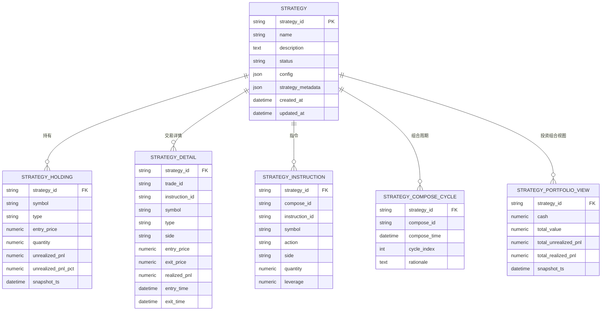
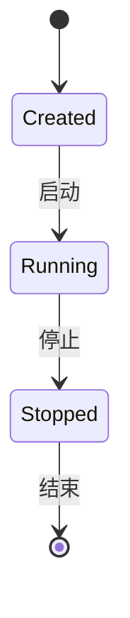
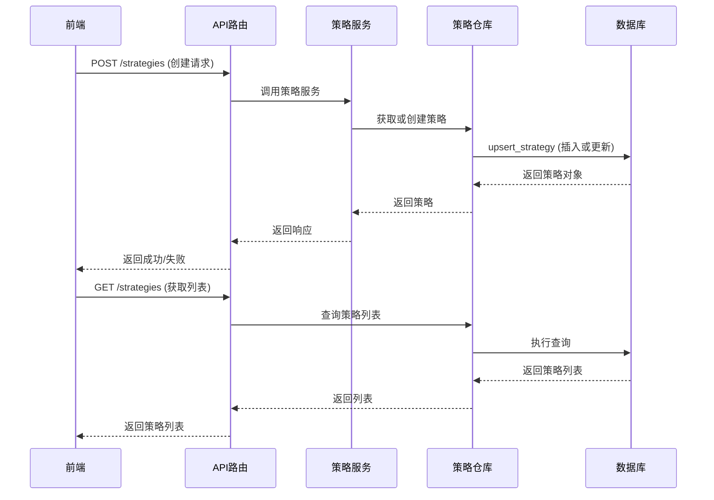

# 策略主模型

<cite>
**本文档引用的文件**   
- [strategy.py](file://python/valuecell/server/db/models/strategy.py)
- [strategy_detail.py](file://python/valuecell/server/db/models/strategy_detail.py)
- [strategy_holding.py](file://python/valuecell/server/db/models/strategy_holding.py)
- [strategy_instruction.py](file://python/valuecell/server/db/models/strategy_instruction.py)
- [strategy_compose_cycle.py](file://python/valuecell/server/db/models/strategy_compose_cycle.py)
- [strategy_portfolio.py](file://python/valuecell/server/db/models/strategy_portfolio.py)
- [strategy.py](file://python/valuecell/server/api/routers/strategy.py)
- [strategy_service.py](file://python/valuecell/server/services/strategy_service.py)
- [strategy.py](file://python/valuecell/server/api/schemas/strategy.py)
- [connection.py](file://python/valuecell/server/db/connection.py)
- [init_db.py](file://python/valuecell/server/db/init_db.py)
- [base.py](file://python/valuecell/server/db/models/base.py)
- [strategy.ts](file://frontend/src/api/strategy.ts)
- [strategy_prompts.py](file://python/valuecell/server/api/routers/strategy_prompts.py)
- [strategy_agent.py](file://python/valuecell/server/api/routers/strategy_agent.py)
</cite>

## 目录
1. [引言](#引言)
2. [核心字段定义](#核心字段定义)
3. [聚合角色与关联模型](#聚合角色与关联模型)
4. [生命周期管理与状态控制](#生命周期管理与状态控制)
5. [与用户配置及智能体引擎的集成](#与用户配置及智能体引擎的集成)
6. [数据持久化实现](#数据持久化实现)
7. [查询优化与索引设计](#查询优化与索引设计)
8. [API流程与数据流](#api流程与数据流)
9. [总结](#总结)

## 引言

策略主模型（Strategy）是ValueCell系统中策略体系的核心聚合根实体。它作为策略生命周期的中心枢纽，不仅存储策略的基本元数据，还通过外键关联多个子模型，形成完整的策略执行与监控体系。该模型由智能体（Agent）在策略创建时初始化，并在整个运行周期中持续更新状态，是连接前端用户界面、后端服务与智能体执行引擎的关键桥梁。

**Section sources**
- [strategy.py](file://python/valuecell/server/db/models/strategy.py#L1-L74)
- [strategy_service.py](file://python/valuecell/server/services/strategy_service.py#L1-L415)

## 核心字段定义

策略主模型的核心字段定义了策略的基本属性和状态，其业务含义与数据类型如下：

- **strategy_id**: `String(100)` - 策略的运行时唯一标识符，由智能体生成，作为所有关联数据的外键。此字段具有唯一约束和索引，确保高效查询。
- **name**: `String(200)` - 用户自定义的策略名称，用于在用户界面中识别策略，可为空。
- **description**: `Text` - 策略的可选描述信息，提供更详细的背景说明。
- **status**: `String(50)` - 策略的当前状态，如"running"（运行中）或"stopped"（已停止），用于控制策略的执行流程。
- **created_at**: `DateTime(timezone=True)` - 策略创建的时间戳，由数据库自动设置为当前时间。
- **updated_at**: `DateTime(timezone=True)` - 策略最后更新的时间戳，每次记录更新时自动刷新。

此外，模型还包含`config`和`strategy_metadata`两个JSON字段，用于存储原始的用户请求配置和附加的元数据（如智能体类型、模型提供商等），提供了灵活的扩展能力。

**Section sources**
- [strategy.py](file://python/valuecell/server/db/models/strategy.py#L24-L55)

## 聚合角色与关联模型

策略主模型作为聚合根，通过`strategy_id`外键与多个子模型建立关联，形成一个完整的策略数据体系：



**Diagram sources**
- [strategy.py](file://python/valuecell/server/db/models/strategy.py#L34-L40)
- [strategy_holding.py](file://python/valuecell/server/db/models/strategy_holding.py#L36-L42)
- [strategy_detail.py](file://python/valuecell/server/db/models/strategy_detail.py#L34-L40)
- [strategy_instruction.py](file://python/valuecell/server/db/models/strategy_instruction.py#L27-L33)
- [strategy_compose_cycle.py](file://python/valuecell/server/db/models/strategy_compose_cycle.py#L26-L32)
- [strategy_portfolio.py](file://python/valuecell/server/db/models/strategy_portfolio.py#L32-L38)

## 生命周期管理与状态控制

策略的生命周期由其`status`字段管理，主要状态包括"running"和"stopped"。通过API端点`/strategies/stop`可以将策略状态更新为"stopped"，实现策略的停止操作。此操作通过`upsert_strategy`方法在策略仓库中完成，确保了状态更新的幂等性。



**Diagram sources**
- [strategy.py](file://python/valuecell/server/api/routers/strategy.py#L487-L524)
- [strategy_agent.py](file://python/valuecell/server/api/routers/strategy_agent.py#L199-L207)

## 与用户配置及智能体引擎的集成

策略主模型与用户配置和智能体执行引擎紧密集成。当用户通过前端界面创建策略时，配置信息被封装在`UserRequest`对象中，由智能体处理并生成策略。智能体将原始配置存入`config`字段，并将运行时元数据（如智能体名称、模型ID等）存入`strategy_metadata`字段。这种设计实现了用户意图与智能体执行的解耦，同时保留了完整的审计信息。

**Section sources**
- [strategy_agent.py](file://python/valuecell/server/api/routers/strategy_agent.py#L199-L207)
- [strategy.py](file://python/valuecell/server/db/models/strategy.py#L41-L44)

## 数据持久化实现

策略模型的持久化通过SQLAlchemy ORM实现，结合Pydantic模型进行数据验证和序列化。以下是关键实现细节：

### SQLAlchemy ORM 映射

```python
class Strategy(Base):
    __tablename__ = "strategies"

    id = Column(Integer, primary_key=True, index=True)
    strategy_id = Column(String(100), unique=True, nullable=False, index=True)
    name = Column(String(200), nullable=True)
    description = Column(Text, nullable=True)
    user_id = Column(String(100), nullable=True, index=True)
    status = Column(String(50), nullable=False, default="running")
    config = Column(JSON, nullable=True)
    strategy_metadata = Column(JSON, nullable=True)
    created_at = Column(DateTime(timezone=True), server_default=func.now(), nullable=False)
    updated_at = Column(DateTime(timezone=True), server_default=func.now(), onupdate=func.now(), nullable=False)
```

### Pydantic 模型

```python
class StrategySummaryData(BaseModel):
    strategy_id: str
    strategy_name: Optional[str]
    strategy_type: Optional[StrategyType]
    status: Literal["running", "stopped"]
    stop_reason: Optional[str]
    trading_mode: Optional[Literal["live", "virtual"]]
    total_pnl: Optional[float]
    total_pnl_pct: Optional[float]
    created_at: Optional[datetime]
    exchange_id: Optional[str]
    model_id: Optional[str]
```

**Section sources**
- [strategy.py](file://python/valuecell/server/db/models/strategy.py#L15-L74)
- [strategy.py](file://python/valuecell/server/api/schemas/strategy.py#L19-L42)

## 查询优化与索引设计

为确保高性能查询，策略主模型设计了以下索引和约束：

- **主键索引**: `id` 字段上的主键索引，用于唯一标识每条记录。
- **唯一索引**: `strategy_id` 字段上的唯一索引，防止重复策略ID。
- **普通索引**: `user_id` 和 `status` 字段上的索引，加速按用户和状态的过滤查询。
- **复合查询**: 在API中使用`and_`和`or_`操作符组合多个过滤条件，如按用户ID、状态和名称进行模糊匹配。

**Section sources**
- [strategy.py](file://python/valuecell/server/db/models/strategy.py#L21-L38)
- [strategy.py](file://python/valuecell/server/api/routers/strategy.py#L66-L83)

## API流程与数据流

策略创建和管理的API流程如下：



**Diagram sources**
- [strategy.py](file://python/valuecell/server/api/routers/strategy.py#L42-L211)
- [strategy_agent.py](file://python/valuecell/server/api/routers/strategy_agent.py#L199-L207)

## 总结

策略主模型是ValueCell系统中策略管理的核心，它不仅定义了策略的基本属性，还通过丰富的关联模型和集成机制，构建了一个完整的策略执行与监控体系。其设计充分考虑了性能、可扩展性和易用性，为用户提供了一个强大而灵活的策略管理平台。

**Section sources**
- [strategy.py](file://python/valuecell/server/db/models/strategy.py#L1-L74)
- [strategy_service.py](file://python/valuecell/server/services/strategy_service.py#L1-L415)
- [strategy.py](file://python/valuecell/server/api/routers/strategy.py#L33-L525)