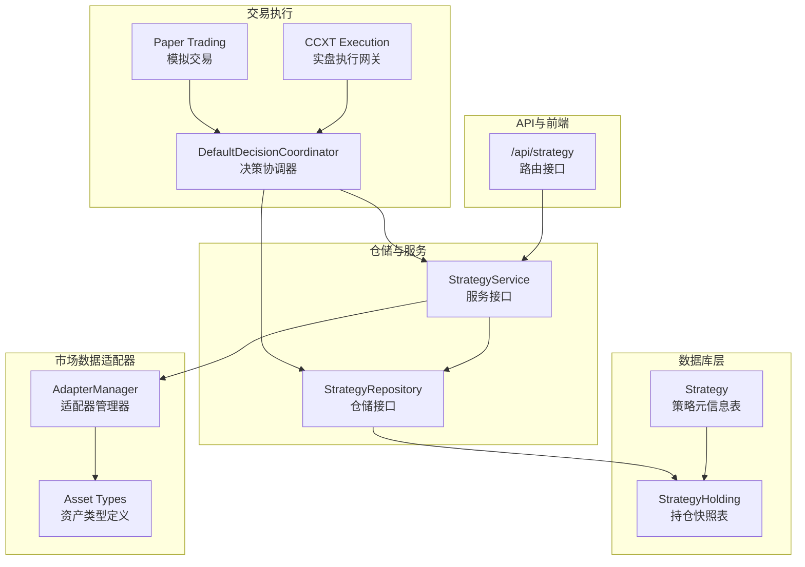
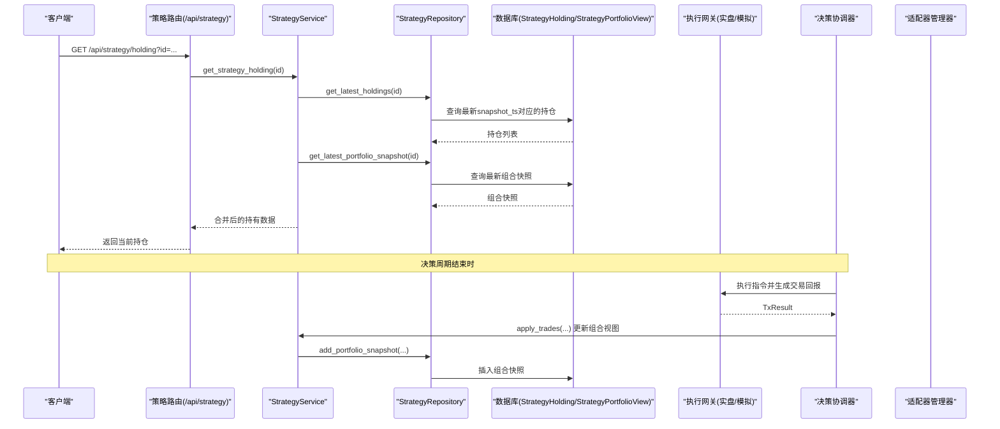
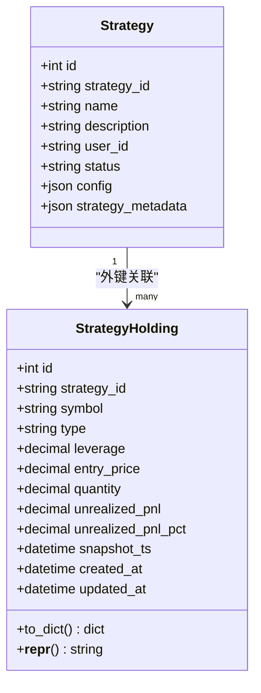
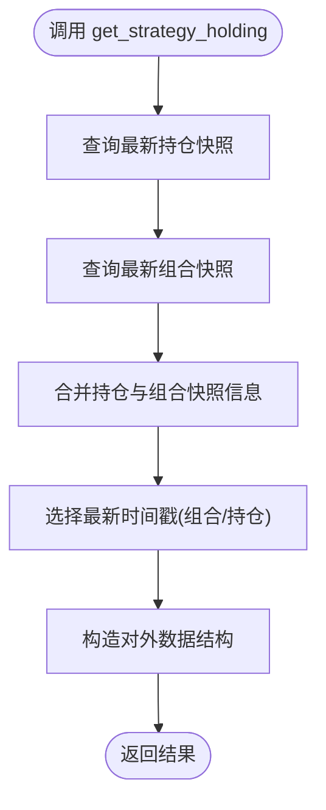
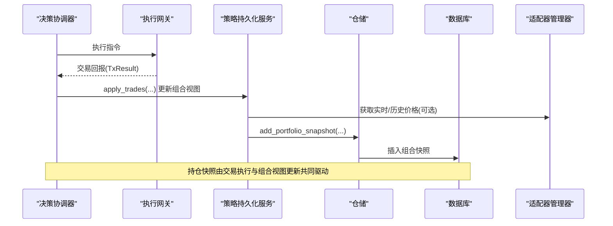
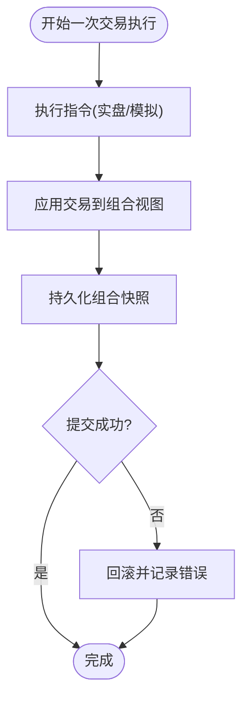
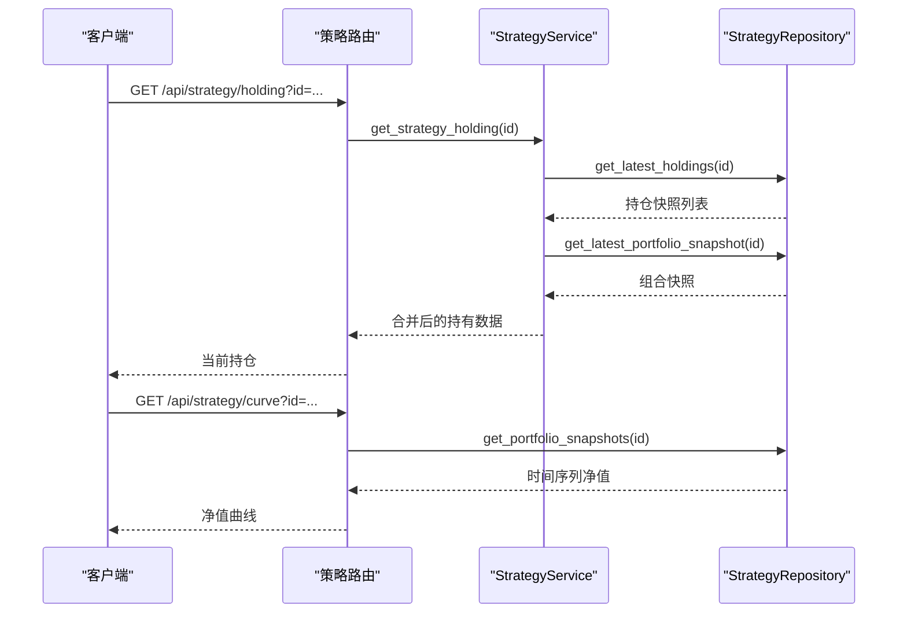
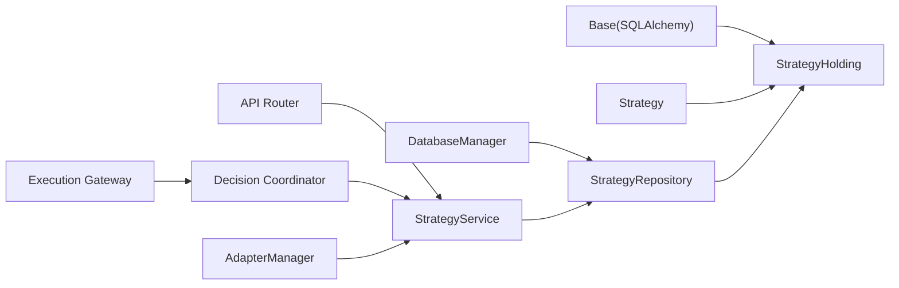

# 策略持仓

<cite>
**本文引用的文件**
- [python/valuecell/server/db/models/strategy_holding.py](file://python/valuecell/server/db/models/strategy_holding.py)
- [python/valuecell/server/db/models/strategy.py](file://python/valuecell/server/db/models/strategy.py)
- [python/valuecell/server/db/repositories/strategy_repository.py](file://python/valuecell/server/db/repositories/strategy_repository.py)
- [python/valuecell/server/services/strategy_service.py](file://python/valuecell/server/services/strategy_service.py)
- [python/valuecell/server/api/routers/strategy.py](file://python/valuecell/server/api/routers/strategy.py)
- [python/valuecell/server/db/connection.py](file://python/valuecell/server/db/connection.py)
- [python/valuecell/server/db/init_db.py](file://python/valuecell/server/db/init_db.py)
- [python/valuecell/agents/common/trading/_internal/coordinator.py](file://python/valuecell/agents/common/trading/_internal/coordinator.py)
- [python/valuecell/agents/common/trading/execution/ccxt_trading.py](file://python/valuecell/agents/common/trading/execution/ccxt_trading.py)
- [python/valuecell/agents/common/trading/execution/paper_trading.py](file://python/valuecell/agents/common/trading/execution/paper_trading.py)
- [python/valuecell/adapters/assets/manager.py](file://python/valuecell/adapters/assets/manager.py)
- [python/valuecell/adapters/assets/types.py](file://python/valuecell/adapters/assets/types.py)
- [python/valuecell/server/services/strategy_persistence.py](file://python/valuecell/server/services/strategy_persistence.py)
</cite>

## 目录
1. [简介](#简介)
2. [项目结构](#项目结构)
3. [核心组件](#核心组件)
4. [架构总览](#架构总览)
5. [详细组件分析](#详细组件分析)
6. [依赖关系分析](#依赖关系分析)
7. [性能考虑](#性能考虑)
8. [故障排查指南](#故障排查指南)
9. [结论](#结论)
10. [附录](#附录)

## 简介
本技术文档围绕策略持仓（StrategyHolding）模型展开，系统性阐述其在 ValueCell 平台中的角色与实现细节。StrategyHolding 记录了策略在特定时间点的“持仓快照”，包含 symbol、type、quantity、entry_price、unrealized_pnl、unrealized_pnl_pct、leverage、snapshot_ts 等关键字段，并通过唯一约束确保同一策略、同一标的、同一快照时刻仅存一条记录。本文将从数据模型设计、与市场数据适配器的集成、实时估值更新、事务一致性与交易执行协同、快照生成与历史回溯、高频更新下的数据库性能优化等方面进行深入解析。

## 项目结构
StrategyHolding 模型位于后端数据库层，配合仓库层（Repository）、服务层（Service）、API 层（Router）以及交易执行与市场适配器模块共同构成完整的策略持仓生命周期闭环。

图表来源
- [python/valuecell/server/db/models/strategy_holding.py](file://python/valuecell/server/db/models/strategy_holding.py#L24-L111)
- [python/valuecell/server/db/models/strategy.py](file://python/valuecell/server/db/models/strategy.py#L15-L44)
- [python/valuecell/server/db/repositories/strategy_repository.py](file://python/valuecell/server/db/repositories/strategy_repository.py#L129-L166)
- [python/valuecell/server/services/strategy_service.py](file://python/valuecell/server/services/strategy_service.py#L27-L113)
- [python/valuecell/server/api/routers/strategy.py](file://python/valuecell/server/api/routers/strategy.py#L251-L290)
- [python/valuecell/agents/common/trading/_internal/coordinator.py](file://python/valuecell/agents/common/trading/_internal/coordinator.py#L212-L251)
- [python/valuecell/agents/common/trading/execution/ccxt_trading.py](file://python/valuecell/agents/common/trading/execution/ccxt_trading.py#L787-L815)
- [python/valuecell/agents/common/trading/execution/paper_trading.py](file://python/valuecell/agents/common/trading/execution/paper_trading.py#L23-L51)
- [python/valuecell/adapters/assets/manager.py](file://python/valuecell/adapters/assets/manager.py#L763-L795)
- [python/valuecell/adapters/assets/types.py](file://python/valuecell/adapters/assets/types.py#L1-L383)

章节来源
- [python/valuecell/server/db/models/strategy_holding.py](file://python/valuecell/server/db/models/strategy_holding.py#L24-L111)
- [python/valuecell/server/db/repositories/strategy_repository.py](file://python/valuecell/server/db/repositories/strategy_repository.py#L129-L166)
- [python/valuecell/server/services/strategy_service.py](file://python/valuecell/server/services/strategy_service.py#L27-L113)
- [python/valuecell/server/api/routers/strategy.py](file://python/valuecell/server/api/routers/strategy.py#L251-L290)

## 核心组件
- 数据模型：StrategyHolding 定义了持仓快照的核心字段与索引约束，确保唯一性与可查询性。
- 仓储层：StrategyRepository 提供添加持仓快照、按最新快照查询、按指定快照查询等方法。
- 服务层：StrategyService 将最新持仓与组合快照整合，输出对外的持有数据结构。
- API 层：/api/strategy 路由提供获取当前持仓的接口。
- 交易执行：DefaultDecisionCoordinator 在每次决策周期结束后，将交易结果写入历史并触发组合视图更新；实盘/模拟执行网关负责下单与成交回报。
- 市场数据适配器：AdapterManager 提供统一的资产查询、实时/历史价格获取能力，支撑实时估值与回测。

章节来源
- [python/valuecell/server/db/models/strategy_holding.py](file://python/valuecell/server/db/models/strategy_holding.py#L24-L111)
- [python/valuecell/server/db/repositories/strategy_repository.py](file://python/valuecell/server/db/repositories/strategy_repository.py#L129-L166)
- [python/valuecell/server/services/strategy_service.py](file://python/valuecell/server/services/strategy_service.py#L27-L113)
- [python/valuecell/server/api/routers/strategy.py](file://python/valuecell/server/api/routers/strategy.py#L251-L290)
- [python/valuecell/agents/common/trading/_internal/coordinator.py](file://python/valuecell/agents/common/trading/_internal/coordinator.py#L212-L251)
- [python/valuecell/agents/common/trading/execution/ccxt_trading.py](file://python/valuecell/agents/common/trading/execution/ccxt_trading.py#L787-L815)
- [python/valuecell/agents/common/trading/execution/paper_trading.py](file://python/valuecell/agents/common/trading/execution/paper_trading.py#L23-L51)
- [python/valuecell/adapters/assets/manager.py](file://python/valuecell/adapters/assets/manager.py#L763-L795)
- [python/valuecell/adapters/assets/types.py](file://python/valuecell/adapters/assets/types.py#L1-L383)

## 架构总览
下图展示了从交易执行到持仓快照生成、再到对外展示的完整链路。

图表来源
- [python/valuecell/server/api/routers/strategy.py](file://python/valuecell/server/api/routers/strategy.py#L251-L290)
- [python/valuecell/server/services/strategy_service.py](file://python/valuecell/server/services/strategy_service.py#L27-L113)
- [python/valuecell/server/db/repositories/strategy_repository.py](file://python/valuecell/server/db/repositories/strategy_repository.py#L129-L166)
- [python/valuecell/agents/common/trading/_internal/coordinator.py](file://python/valuecell/agents/common/trading/_internal/coordinator.py#L212-L251)
- [python/valuecell/agents/common/trading/execution/ccxt_trading.py](file://python/valuecell/agents/common/trading/execution/ccxt_trading.py#L787-L815)
- [python/valuecell/agents/common/trading/execution/paper_trading.py](file://python/valuecell/agents/common/trading/execution/paper_trading.py#L23-L51)

## 详细组件分析

### 数据模型：StrategyHolding
- 表名与主键：strategy_holdings，主键 id。
- 关联关系：外键 strategy_id 引用 strategies.strategy_id，删除策略时级联删除持仓快照。
- 关键字段：
  - symbol：标的代码（索引）
  - type：多空方向（LONG/SHORT）
  - leverage：杠杆倍数
  - entry_price：平均开仓价
  - quantity：头寸数量（绝对值）
  - unrealized_pnl：未平仓盈亏
  - unrealized_pnl_pct：未平仓盈亏百分比
  - snapshot_ts：快照时间戳（UTC）
  - created_at/updated_at：记录创建与更新时间
- 唯一约束：strategy_id + symbol + snapshot_ts 唯一，避免重复快照。
- 序列化：to_dict 方法将数值字段转换为浮点或字符串格式，便于 API 输出。

图表来源
- [python/valuecell/server/db/models/strategy_holding.py](file://python/valuecell/server/db/models/strategy_holding.py#L24-L111)
- [python/valuecell/server/db/models/strategy.py](file://python/valuecell/server/db/models/strategy.py#L15-L44)

章节来源
- [python/valuecell/server/db/models/strategy_holding.py](file://python/valuecell/server/db/models/strategy_holding.py#L24-L111)
- [python/valuecell/server/db/models/strategy.py](file://python/valuecell/server/db/models/strategy.py#L15-L44)

### 仓储与服务：快照读取与对外聚合
- 添加持仓快照：add_holding_item 接收单条持仓明细，插入 StrategyHolding 并返回持久化对象。
- 最新持仓查询：get_latest_holdings 先查出最新 snapshot_ts，再筛选对应时间点的所有持仓，按 symbol 升序返回。
- 指定快照查询：get_holdings_by_snapshot 支持按 snapshot_ts 精确查询。
- 服务聚合：StrategyService.get_strategy_holding 同步最新持仓与组合快照，计算时间戳、现金、总价值、未实现盈亏等，封装为对外数据结构。

图表来源
- [python/valuecell/server/db/repositories/strategy_repository.py](file://python/valuecell/server/db/repositories/strategy_repository.py#L204-L232)
- [python/valuecell/server/db/repositories/strategy_repository.py](file://python/valuecell/server/db/repositories/strategy_repository.py#L292-L313)
- [python/valuecell/server/services/strategy_service.py](file://python/valuecell/server/services/strategy_service.py#L27-L113)

章节来源
- [python/valuecell/server/db/repositories/strategy_repository.py](file://python/valuecell/server/db/repositories/strategy_repository.py#L129-L166)
- [python/valuecell/server/db/repositories/strategy_repository.py](file://python/valuecell/server/db/repositories/strategy_repository.py#L204-L232)
- [python/valuecell/server/db/repositories/strategy_repository.py](file://python/valuecell/server/db/repositories/strategy_repository.py#L292-L313)
- [python/valuecell/server/services/strategy_service.py](file://python/valuecell/server/services/strategy_service.py#L27-L113)

### 与市场数据适配器的集成与实时估值更新
- 适配器管理：AdapterManager 提供 get_real_time_price、get_multiple_prices、get_historical_prices 等接口，支持多数据源与故障转移。
- 实时估值：在决策周期结束时，协调器根据交易回报与市场特征（如滑点、手续费）更新组合视图，并持久化组合快照。组合快照包含总价值、未实现/已实现盈亏、总敞口等聚合指标，用于实时估值与展示。
- 回测支持：历史回溯通过 get_portfolio_snapshots 获取时间序列，构建净值曲线；同时可通过 get_holdings_by_snapshot 获取某时刻的持仓快照，实现逐时刻复盘。

图表来源
- [python/valuecell/agents/common/trading/_internal/coordinator.py](file://python/valuecell/agents/common/trading/_internal/coordinator.py#L212-L251)
- [python/valuecell/agents/common/trading/execution/ccxt_trading.py](file://python/valuecell/agents/common/trading/execution/ccxt_trading.py#L787-L815)
- [python/valuecell/agents/common/trading/execution/paper_trading.py](file://python/valuecell/agents/common/trading/execution/paper_trading.py#L23-L51)
- [python/valuecell/server/services/strategy_persistence.py](file://python/valuecell/server/services/strategy_persistence.py#L156-L194)
- [python/valuecell/adapters/assets/manager.py](file://python/valuecell/adapters/assets/manager.py#L763-L795)

章节来源
- [python/valuecell/server/services/strategy_persistence.py](file://python/valuecell/server/services/strategy_persistence.py#L156-L194)
- [python/valuecell/adapters/assets/manager.py](file://python/valuecell/adapters/assets/manager.py#L763-L795)

### 交易执行模块协同与事务一致性
- 事务边界：StrategyRepository 的 add_holding_item、add_portfolio_snapshot、add_detail_item 等均在单个会话中执行插入、提交、刷新与 expunge，异常时回滚，确保单次操作的原子性。
- 多表一致性：删除策略时，仓储层级联删除该策略的持仓快照、组合快照与明细记录，避免悬挂数据。
- 执行网关：实盘 CCXT 执行网关与模拟交易网关分别处理下单、成交回报与费用计算，最终由协调器汇总为交易历史并更新组合视图。

图表来源
- [python/valuecell/server/db/repositories/strategy_repository.py](file://python/valuecell/server/db/repositories/strategy_repository.py#L129-L166)
- [python/valuecell/server/db/repositories/strategy_repository.py](file://python/valuecell/server/db/repositories/strategy_repository.py#L587-L628)
- [python/valuecell/agents/common/trading/_internal/coordinator.py](file://python/valuecell/agents/common/trading/_internal/coordinator.py#L212-L251)
- [python/valuecell/agents/common/trading/execution/ccxt_trading.py](file://python/valuecell/agents/common/trading/execution/ccxt_trading.py#L787-L815)
- [python/valuecell/agents/common/trading/execution/paper_trading.py](file://python/valuecell/agents/common/trading/execution/paper_trading.py#L23-L51)

章节来源
- [python/valuecell/server/db/repositories/strategy_repository.py](file://python/valuecell/server/db/repositories/strategy_repository.py#L129-L166)
- [python/valuecell/server/db/repositories/strategy_repository.py](file://python/valuecell/server/db/repositories/strategy_repository.py#L587-L628)
- [python/valuecell/agents/common/trading/_internal/coordinator.py](file://python/valuecell/agents/common/trading/_internal/coordinator.py#L212-L251)

### 快照生成与历史回溯
- 最新持仓：get_latest_holdings 通过查询最大 snapshot_ts 获取最新快照。
- 指定快照：get_holdings_by_snapshot 可按 snapshot_ts 精确获取某时刻的持仓集合。
- 组合快照序列：get_portfolio_snapshots 返回按时间排序的历史净值序列，用于可视化与回测。
- API 展示：/api/strategy/holding 返回扁平化的当前持仓列表；净值曲线接口返回时间序列。

图表来源
- [python/valuecell/server/api/routers/strategy.py](file://python/valuecell/server/api/routers/strategy.py#L251-L290)
- [python/valuecell/server/api/routers/strategy.py](file://python/valuecell/server/api/routers/strategy.py#L386-L451)
- [python/valuecell/server/db/repositories/strategy_repository.py](file://python/valuecell/server/db/repositories/strategy_repository.py#L204-L232)
- [python/valuecell/server/db/repositories/strategy_repository.py](file://python/valuecell/server/db/repositories/strategy_repository.py#L233-L257)

章节来源
- [python/valuecell/server/api/routers/strategy.py](file://python/valuecell/server/api/routers/strategy.py#L251-L290)
- [python/valuecell/server/api/routers/strategy.py](file://python/valuecell/server/api/routers/strategy.py#L386-L451)
- [python/valuecell/server/db/repositories/strategy_repository.py](file://python/valuecell/server/db/repositories/strategy_repository.py#L204-L232)
- [python/valuecell/server/db/repositories/strategy_repository.py](file://python/valuecell/server/db/repositories/strategy_repository.py#L233-L257)

## 依赖关系分析
- 模型依赖：StrategyHolding 依赖 Base（SQLAlchemy 声明式基类），并以外键关联 Strategy。
- 仓储依赖：StrategyRepository 使用 DatabaseManager 获取 Session，所有数据库操作在单 Session 中完成，异常回滚。
- 服务依赖：StrategyService 依赖 StrategyRepository，并在必要时调用适配器管理器获取价格数据。
- 执行依赖：DefaultDecisionCoordinator 依赖执行网关（实盘/模拟），并在交易完成后更新组合视图并持久化快照。
- 适配器依赖：AdapterManager 提供统一的资产与价格接口，支持故障转移与多数据源。

图表来源
- [python/valuecell/server/db/models/strategy_holding.py](file://python/valuecell/server/db/models/strategy_holding.py#L24-L111)
- [python/valuecell/server/db/models/strategy.py](file://python/valuecell/server/db/models/strategy.py#L15-L44)
- [python/valuecell/server/db/connection.py](file://python/valuecell/server/db/connection.py#L13-L103)
- [python/valuecell/server/db/repositories/strategy_repository.py](file://python/valuecell/server/db/repositories/strategy_repository.py#L129-L166)
- [python/valuecell/server/services/strategy_service.py](file://python/valuecell/server/services/strategy_service.py#L27-L113)
- [python/valuecell/agents/common/trading/_internal/coordinator.py](file://python/valuecell/agents/common/trading/_internal/coordinator.py#L212-L251)
- [python/valuecell/adapters/assets/manager.py](file://python/valuecell/adapters/assets/manager.py#L763-L795)

章节来源
- [python/valuecell/server/db/connection.py](file://python/valuecell/server/db/connection.py#L13-L103)
- [python/valuecell/server/db/repositories/strategy_repository.py](file://python/valuecell/server/db/repositories/strategy_repository.py#L129-L166)
- [python/valuecell/server/services/strategy_service.py](file://python/valuecell/server/services/strategy_service.py#L27-L113)

## 性能考虑
- 数据库引擎与连接池
  - SQLite：使用 StaticPool 与较长超时，适合本地开发与小规模并发；生产环境建议使用非 SQLite 并配置合适的连接池参数。
  - 非 SQLite：默认连接池，需结合实际负载调整最大连接数、空闲连接数与超时设置。
- 索引与唯一约束
  - symbol、strategy_id、snapshot_ts 建有索引，唯一约束避免重复快照，提升查询与去重效率。
- 事务与批量写入
  - 仓储层每个写入操作在单 Session 中完成，异常回滚，保证原子性；高频写入场景建议评估批量提交策略与锁竞争。
- 适配器缓存与降级
  - 适配器管理器具备故障转移逻辑，优先使用成功适配器并缓存结果，减少重复请求与失败重试成本。
- 视图与序列化
  - to_dict 序列化在服务层完成，避免 ORM 对象直接暴露；组合快照序列化为时间序列用于前端渲染，注意分页与限制返回条数。

章节来源
- [python/valuecell/server/db/connection.py](file://python/valuecell/server/db/connection.py#L13-L103)
- [python/valuecell/server/db/models/strategy_holding.py](file://python/valuecell/server/db/models/strategy_holding.py#L24-L111)
- [python/valuecell/adapters/assets/manager.py](file://python/valuecell/adapters/assets/manager.py#L763-L795)

## 故障排查指南
- 无法获取最新持仓
  - 检查是否存在最新 snapshot_ts；若无，确认是否已调用 add_holding_item 或组合快照持久化流程。
  - 确认唯一约束是否被违反（同一策略+同一标的+同一快照时刻不应重复）。
- 交易执行后未更新快照
  - 检查协调器是否调用 apply_trades 并持久化组合快照；查看 add_portfolio_snapshot 是否抛出异常并被回滚。
- 实时价格不可用
  - 检查适配器配置与可用性；确认故障转移逻辑是否成功切换到备用适配器。
- 数据库连接问题
  - 检查数据库 URL、SQLite 文件路径与权限；确认连接池参数与超时设置合理。

章节来源
- [python/valuecell/server/db/repositories/strategy_repository.py](file://python/valuecell/server/db/repositories/strategy_repository.py#L129-L166)
- [python/valuecell/server/db/repositories/strategy_repository.py](file://python/valuecell/server/db/repositories/strategy_repository.py#L587-L628)
- [python/valuecell/server/services/strategy_persistence.py](file://python/valuecell/server/services/strategy_persistence.py#L156-L194)
- [python/valuecell/adapters/assets/manager.py](file://python/valuecell/adapters/assets/manager.py#L763-L795)

## 结论
StrategyHolding 模型通过明确的字段定义、唯一约束与完善的仓储/服务/API 层协作，实现了策略在特定时间点的准确、一致、可追溯的持仓快照记录。结合交易执行模块与市场数据适配器，系统能够在高频更新场景下保持数据一致性，并提供实时估值与历史回溯能力。针对性能，建议在生产环境中优化数据库连接池、索引与事务策略，并充分利用适配器的缓存与降级机制。

## 附录
- 字段说明与用途
  - symbol：标的标识，用于区分不同资产。
  - type：多空方向，决定头寸方向。
  - leverage：杠杆倍数，影响风险与收益。
  - entry_price：平均开仓价，用于计算未实现盈亏。
  - quantity：头寸数量（绝对值），与方向结合可推导净头寸。
  - unrealized_pnl/unrealized_pnl_pct：未实现盈亏及其百分比，反映实时估值变化。
  - snapshot_ts：快照时间戳，作为时间序列的锚点。
  - created_at/updated_at：审计与调试辅助字段。
- API 示例路径
  - 获取当前持仓：/api/strategy/holding
  - 获取净值曲线：/api/strategy/curve

章节来源
- [python/valuecell/server/api/routers/strategy.py](file://python/valuecell/server/api/routers/strategy.py#L251-L290)
- [python/valuecell/server/api/routers/strategy.py](file://python/valuecell/server/api/routers/strategy.py#L386-L451)